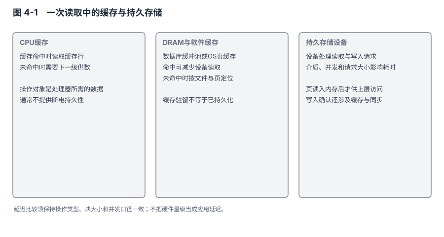
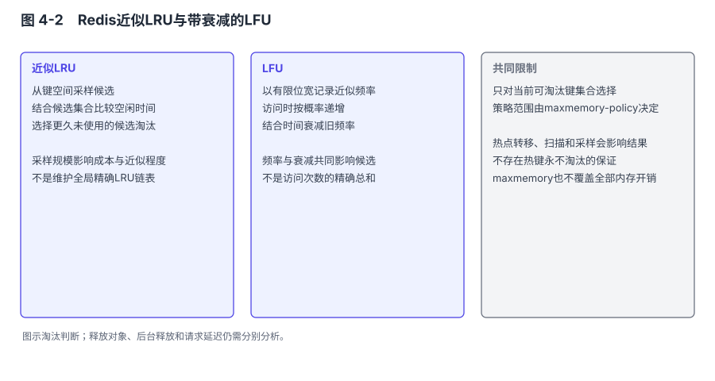
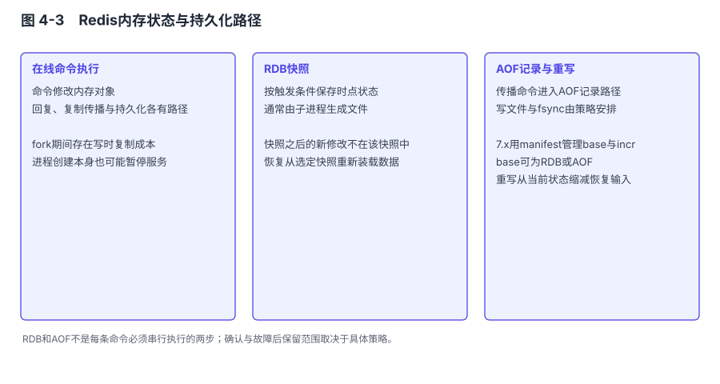
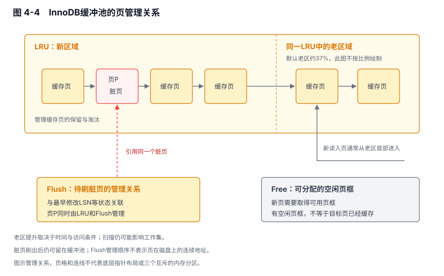
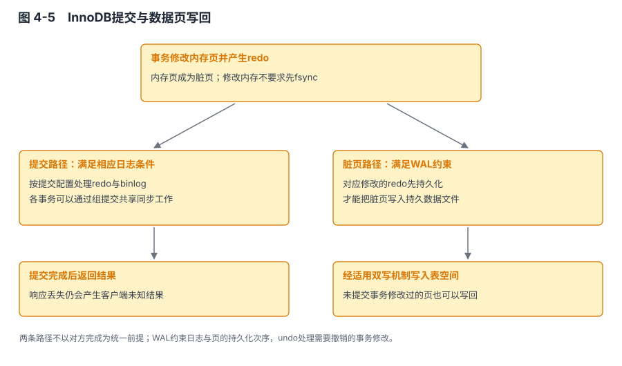
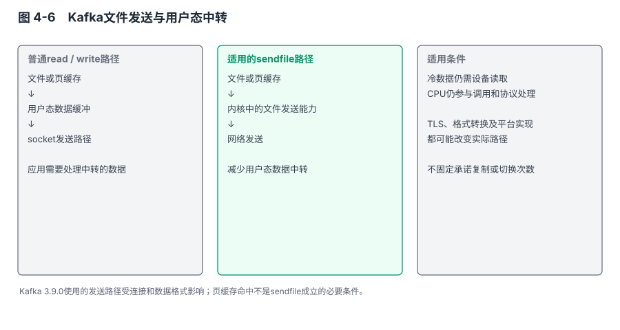

# 第 4 章 内存与磁盘：速度与持久化的平衡

## 本章导读

我参与过一次选型争论：缓存到底该用Redis还是MySQL？有人提到MySQL的内存表和Query Cache。我花了一下午把两者的访问模式列成表，讨论才从软件名字转向具体工作：哪些数据频繁读取，哪些修改需要事务，命中缓存以后还要执行什么。这里提到的Query Cache是历史背景；MySQL8.0已经移除了这项查询结果缓存，它与InnoDB缓冲池不是同一机制。

那次对照有助于明确分工，但不能把结论扩大为“高频小数据都用Redis，事务数据都用MySQL”。缓存是否可丢、更新怎样传播、容量增长后怎么办，仍然影响决定。即便访问全部命中内存，事务、网络和计算也不会因此没有成本。

本章把几件容易混在一起的事分开：数据在哪里供日常访问，修改在哪里暂存，何时形成持久恢复依据，以及副本确认增加了什么。Redis、MySQL和Kafka都使用内存与磁盘，差别在这些资源分别承担哪项责任。

## 4.1 问题的本质：访问路径与恢复路径同时存在

### 4.1.1 延迟、吞吐与容量不能放进同一个排名

延迟描述一次操作需要多久，吞吐描述一段时间完成多少工作。一个设备可以通过并发取得较高吞吐，同时使排队中的单次请求等待更久。把SSD顺序写的GB/s与内存随机读取的微秒放在一起，不能据此判断哪一种介质“更快”。块大小、并发、读写方向和持久化要求必须相同，数字才有比较意义。

DRAM、处理器缓存和持久设备具有不同的访问和保存特征。处理器缓存未命中可能访问DRAM，数据不在内存缓存时又可能需要存储I/O。机械盘还需要寻道和旋转，SSD没有这些机械动作，却仍受控制器、闪存管理、队列和写放大影响。顺序访问的收益在两类设备上并不完全相同。

图4-1用访问路径而非无条件硬件排名表示这种关系。


图 4-1　一次读取中的缓存与持久存储：缓存命中减少后续访问，实际延迟取决于同口径的负载与设备。

缓存命中所避免的是某段工作，不一定是整个请求。数据库即使命中页，仍可能执行过滤、锁检查和排序；Redis找到键以后，还要处理命令与发送结果；Kafka命中页缓存以后，消费者的业务计算也不由存储系统完成。分析性能时，需要先识别真正占用时间的路径。

### 4.1.2 用一个假设计算说明命中率的影响

下面的数值仅用于算例，不是任何硬件或软件的实测。假定一次页访问命中时耗时5微秒，未命中并读入所需页时耗时500微秒，暂时忽略排队和其他计算。命中率为99%时，平均页访问时间是：

```text
0.99 × 5 + 0.01 × 500 = 9.95 微秒
```

如果命中率变成90%，同一模型中的平均值变为54.5微秒。两个场景的存储设备没有变化，访问落到设备上的比例变了。这说明工作集和缓存容量可以显著影响平均成本，不能只拿设备最快的一次访问解释应用响应。

这个算例仍不能推出请求的P99。一个请求可能访问很多页，各次命中并非独立；热点锁、并发排队和结果传输也会改变尾部延迟。平均命中率很高，不表示最重要的业务对象一定命中，更不表示某次大扫描不会影响其他请求。

工作集指一段时间内被反复访问的数据，大小可以远小于总数据量，也可能接近总量。数据库能保存超过内存的数据，并不意味着它假设“大部分页在任何时刻都不在内存”。小数据库可以完全被缓存，大数据库也可能只有一小部分频繁访问。容量规划需要描述访问分布，不能只拿总数据量除以内存大小。

### 4.1.3 易失缓冲、持久副本与确认分别是什么

程序修改内存以后，可以把数据写入文件。通常的缓冲I/O先把内容交给操作系统页缓存，写调用返回并不等于设备已经持久保存。`fsync`等接口用于请求按相应语义把数据同步到持久存储；设备和文件系统也必须兑现其约定。这是本地存储的边界。

复制把内容送到另一个节点，增加了恢复来源，但接收端可能也只是写入自己的易失缓冲。另一个节点收到、刷盘和应用修改是三种不同状态。若要抵御机器故障，还需要说明副本位于哪些故障域、接替选择什么历史，不能仅根据“有两个副本”作结论。

表4-1先固定本章使用的几个动作。

**表 4-1　几个容易混淆的写入动作**

| 动作 | 直接建立的事实 | 不能直接推出 |
|---|---|---|
| 修改进程内存 | 当前进程得到新状态 | 重启以后仍能恢复 |
| 写入操作系统缓冲 | 内核接受了相关文件内容 | 整机掉电后一定保留 |
| 按协议完成本地刷盘 | 有相应本地持久恢复依据 | 任意副本已经获得或应用 |
| 收到副本确认 | 达到该复制协议定义的确认位置 | 接收端已刷盘、业务效果已完成 |
| 向客户端返回成功 | 接口按约定完成了处理 | 客户端一定收到响应，外部系统也成功 |

后面的参数各控制表中的一部分。把它们排成一条“弱到强”的统一刻度，会丢失它们究竟保证什么。

## 4.2 Redis：主要数据集驻留内存，持久化另有路径

### 4.2.1 内存占用不只是键和值的业务长度

Redis的常规数据访问使用内存中的对象和结构。第2章的SDS、字典、跳表、listpack和intset不仅决定操作，也决定数据量相同的实例需要多少内存。许多很小的键会反复承担对象、指针与分配器开销；较大集合可能跨过编码转换条件，改变空间分布。

总占用还包括客户端缓冲、复制或AOF相关缓冲、后台任务和分配器保留的空间。设置`maxmemory`不等于整个进程或容器从此不可能超过这个字节数。部分缓冲不计入淘汰判断，后台保存期间也可能增加写时复制占用。容量边界需要覆盖这些工作，不能把内存全额分给业务数据。

在数据被当作缓存时，可以定义可淘汰范围；若数据是唯一的业务记录，简单淘汰会直接改变事实。因而“内存满了怎么办”是数据责任问题，不能只按命中率选择一个听起来更先进的算法。

### 4.2.2 近似LRU与LFU怎样选择候选

严格LRU（最近最少使用，Least Recently Used）需要维护访问顺序。Redis的近似LRU通过采样和候选集合，寻找较久未访问的键，减少持续维护完整全局顺序的成本。`maxmemory-samples`控制采样数量，7.x常见默认值为5；算法还保留较好的淘汰候选，不是每次独立抽五个键后立刻任意淘汰一个。

增加样本可能使候选更接近全局较久未用的对象，也增加检查成本。近似算法没有保证每次都找到真正最久未用的键。它在这里追求足够有效的候选，而不是为了满足LRU定义支付全部维护成本。[R4-01：Redis淘汰说明](#ref-r4-01)解释了采样与候选集合。

LFU（最不经常使用，Least Frequently Used）考虑访问频率，同时让历史频率随时间衰减。Redis使用有限位宽的概率计数，不逐次保存精确访问次数；较高计数继续增加的概率更低，使有限空间能区分更宽的热度范围。计数的含义因此是用于比较的近似值，不是业务请求统计。

衰减避免一个过去很热、现在不再使用的键永久占据优势。`lfu-log-factor`影响计数增长，`lfu-decay-time`影响衰减时间尺度；相关路径在访问或评估时处理衰减，不需要为每个键配置一个定时器。热度变化比衰减更快时，旧热点仍可能占用空间，算法不能直接识别业务变化。

图4-2比较两种选择依据。


图 4-2　Redis近似LRU与带衰减的LFU：前者比较近期使用，后者使用近似频率与衰减信息。

一次扫描把许多冷键访问一遍时，单看最近访问容易把它们视为新近使用；频率信息可能帮助区分反复访问的键与一次性访问的键。但LFU也不能保证热键绝不淘汰，采样、容量、访问分布和衰减都会影响结果。判断策略收益需要比较相同工作负载下的命中与淘汰，而不是只给出一个算法名称。

### 4.2.3 淘汰策略定义的是可删除范围

Redis7.x的八种常见淘汰策略可以按范围理解。`allkeys-lru`、`allkeys-lfu`、`allkeys-random`从全部键中选择；`volatile-lru`、`volatile-lfu`、`volatile-random`、`volatile-ttl`只考虑设置过期时间的键；`noeviction`不通过淘汰释放空间，对受到内存限制的写入返回错误。

`noeviction`只表达不因该策略主动淘汰，不能保证数据不因过期、删除、故障或配置变化而丢失。volatile策略也不是一个持久性标记：未设TTL的键不在它的候选集合，不等于这些键已刷盘。若可淘汰键不足，内存压力仍会影响新的写入。

过期和内存淘汰还应区别。TTL表达数据在时间上的有效期，淘汰表达资源不足时可以放弃什么。一个被过期删除的会话可能是业务规定的行为，一个被内存压力删除的会话则可能导致用户重新登录。两者都表现为键不存在，但应对方式和服务指标不同。

对缓存而言，删除之后的回源能力是设计的一部分。若大量键同时失效，后端是否能够承受重建流量？若原始状态早已清理，缓存是否真的可重建？仅说“缓存可丢”会忽略恢复来源和恢复速度，这个判断必须落到实际数据。

### 4.2.4 RDB：快照时点、fork与写时复制

RDB把某一时点的键空间序列化为快照。通过BGSAVE生成时，Redis使用fork创建子进程；父子最初共享内存页，子进程按照自己的视图写文件，父进程继续处理请求。父进程后续修改页面时，操作系统通过写时复制（COW，Copy-on-Write）隔离需要分开的内容。

fork并不在开始时复制全部数据页，却要处理页表及相关进程状态，父进程在这段工作中不能照常执行命令。后台生成也仍与前台争用CPU、内存和I/O。不能因为主要序列化发生在子进程，就把整个快照过程称为不阻塞或没有前台影响。

COW成本与快照期间实际修改的页面有关，而不只与修改的业务字节有关。多次修改同一个已复制页，与分散修改许多不同页，可能产生不同的额外占用。快照持续越久，就有更长时间累积写入；是否启用透明大页、分配器行为等也会影响表现。不能仅按实例容量推算一个固定毫秒数。

快照文件完成与原子替换帮助避免把半成品直接当作当前RDB，但不代表任何文件系统或设备故障都被覆盖。恢复的是快照代表的状态，后续写若没有其他持久化来源，就不在这份快照中。第3章正常关闭保存可以减少某些计划停机的缺口，不能替代运行期间对成功写的约定。

RDB适合需要完整状态副本和可搬运恢复文件的场景。它的价值既有恢复效率，也有备份用途；二者仍不完全相同。只有本机最新快照，无法处理设备整体丢失，也未必能回到误删除之前的时间。保留多个时间点和异地副本，需要另外安排。

### 4.2.5 AOF：执行记录与刷盘策略

AOF保存用于重建状态的写操作记录。通常先执行影响数据的操作，再把需要传播的写记录放入AOF相关缓冲，经过文件写入与刷盘形成恢复依据。它不等于InnoDB的WAL过程，也不是审计意义上永久保留所有原始请求：传播命令可能经过改写，AOF重写还会压缩历史。

`appendfsync`控制AOF同步策略，只有AOF已启用才有对应作用。Redis7.x示例配置默认`appendonly no`，因此不能看到`appendfsync everysec`就认定实例已经持久记录每次写。

**表 4-2　AOF刷盘策略及其边界**

| 策略 | 主要安排 | 需要理解的代价与边界 |
|---|---|---|
| `always` | AOF写入后按每次同步策略等待刷盘，处理可以合并工作 | 增加持久化等待；不应机械理解成每条命令独占一次系统调用 |
| `everysec` | 通常由后台周期性执行同步 | 常以约一秒说明风险窗口，调度与存储异常下不是严格的一秒上限 |
| `no` | Redis不主动为这条策略执行周期同步，依赖系统写回 | 本地掉电前未持久化的内容可能更多；不能据此保证吞吐一定最高 |

缓冲文件写入也可能受到存储压力和系统回写影响，“不主动fsync”并不等于主线程永不等待I/O。评估时要把正常响应、后台同步与异常存储状态一同考虑。机制与策略见[R4-02：Redis持久化说明](#ref-r4-02)。

Redis7.2新增`WAITAOF`，可以对当前连接此前的写等待规定数量的本地及副本AOF同步确认。它与等待副本处理进度的`WAIT`不同，也不能仅因返回了某个数量就把整个集群称为线性一致系统。超时、返回值、部署和切换条件仍要解释。[R4-03：WAITAOF定义](#ref-r4-03)标明了小版本和作用范围。

### 4.2.6 重写减少历史，持久化仍按完成时点判断

一个计数器增加很多次以后，恢复当前值不必再保留每次增加。AOF重写从当前内存状态生成新的基础表示，保留恢复所需的信息，减少重复历史带来的文件和重放成本。新基础文件完成持久化以后，可以成为当前状态的恢复来源；它无法追回已经丢失的修改，也不能倒推先前成功响应时就已满足同样条件。

Redis7.x使用多部分AOF，base表达重写得到的基础状态，incr保存后续变更，manifest确定有效文件集合。base默认可以采用RDB格式，也可以配置为命令格式。重写期间的新写入进入相应增量文件，新基础文件和清单准备好后再切换有效集合。具体文件布局与原子切换留到第8章。

旧单文件AOF同样需要在重写期间维持可恢复状态。多部分AOF改变的是增量管理、重写过程开销和文件组织；版本不同，成本发生的位置不同。

恢复时间也由组合决定。基础状态较新，通常需要重放的增量较少；重写太频繁又会增加生成基础文件的资源消耗。由此得到的调节依据应是恢复预算、增量增长和重写成本，而不是越小的 AOF 越好。容量评估还要给重写期间的新旧文件共存留空间。

图4-3区分日常内存状态、快照和AOF恢复路径。


图 4-3　Redis内存状态与持久化路径：RDB保存时点状态，多部分AOF由base与增量共同表达恢复内容。

主要数据访问不按需从RDB或AOF加载单个键，但持久化I/O仍可能影响请求执行。由此得到的判断应是：Redis把常规对象访问留在内存，把恢复状态另行保存；它是否能够承担某类权威状态，还要结合确认、故障与副本语义判断，而不是预先接受一个固定秒级丢失窗口。

## 4.3 MySQL：页可以晚写回，不能缺少恢复依据

### 4.3.1 缓冲池既缓存读取，也保存尚未写回的修改

InnoDB缓冲池保存正在使用的页。查询需要某页时，先检查它是否在内存；不在时，再读取并纳入管理。页被修改后，内存页的内容与数据文件中的内容不同，这个内存页称为脏页。缓冲池因此不只是一个可随时删除的只读副本集合，还保存等待写回的修改。

管理这些页需要几种相互关联的组织。Free List提供空闲页；LRU List组织已使用页的替换候选；Flush List跟踪需要写回的脏页及其修改位置。同一脏页可以同时在LRU和Flush相关结构中，不能把它们画成三个互斥的内存分区。

替换一个干净页，可以在后续需要时重新读取；替换脏页则先要满足写回与日志约束。若持续写入使可用干净页不足，前台可能等待页面回收，缓冲池越大也不表示永远不会出现这类等待。观察命中率之外，还需要观察脏页和刷新进度。

### 4.3.2 新老分区降低扫描影响，但不保证热页不受影响

朴素LRU把最新访问视为近期有用。一次性扫描会把许多页提升，可能替换原有热点。InnoDB采用中点插入：新读入的页进入旧区附近，只有满足后续访问条件才提升，给一次性访问与反复访问留下区别。

`innodb_old_blocks_pct`控制旧区比例，8.0默认值为37；`innodb_old_blocks_time`控制相关的提升时间条件，默认1000毫秒。时间从首次访问等规定时点参与判断，不是“页只要待满一秒就自动变热”。具体行为见[R4-04：缓冲池抗扫描说明](#ref-r4-04)。

图4-4同时表现管理链表与LRU内部的新老区域。


图 4-4　InnoDB缓冲池的页管理关系：LRU的新老区域与Free、Flush管理结构不是同一层分类。

中点插入降低了扫描页立即占据热区的机会，并未取消扫描的I/O和CPU成本。扫描仍可能持续很久，也可能重复访问足以满足提升条件；真正工作集超过内存时，热点之间也会竞争。减少缓存污染，并不意味着热数据完全不受影响。

缓冲池启动后的状态也不只有空和热两种。MySQL支持保存与加载部分缓冲池内容的页标识，用来预热；它不等于把整个进程内存快照恢复。重启后页是否已加载、操作系统页缓存是否还在、是否采用直接I/O，都会改变预热过程。第3章的就绪并不承诺工作集已完全进入缓冲池。

### 4.3.3 WAL限制的是持久化先后，不是内存修改先后

WAL（预写日志，Write-Ahead Log）的关键约束是：数据页写入持久存储之前，能够恢复对应修改的日志必须先满足持久化要求。事务可以先修改缓冲池中的页，并产生redo记录，随后按提交与刷新协议把日志和页写出去。把WAL写成“日志先落盘，然后才允许修改内存页”，会误解写入过程。

这样安排，可以不让每次提交都等待所有被修改的数据页分别写回。事务需要的恢复信息进入顺序日志，多个脏页以后按刷新安排逐步处理；同一页在此期间被多次修改，也可能合并成后续一次写回。收益是提交路径与全部数据页写回解耦，不是永久消除了随机写。

redo有有限容量，需要checkpoint推进释放可复用空间。若脏页长期无法写回，恢复就仍可能需要旧日志，日志空间压力最终影响前台。增加日志容量可以提供更大余量，却不能在存储长期跟不上时无限吸收写入。缓冲是时间上的调节，不是持续吞吐能力的替代。

图4-5把提交所依赖的日志同步与后续数据页写回分成两条相连路径。


图 4-5　InnoDB提交与数据页写回：内存修改产生日志，提交等待所需日志条件，脏页在满足WAL约束后写回。

页的布局和完整性保护见第8章。本章要建立的是先后约束：恢复所需信息已经可靠保存以后，数据页可以晚一点到达最终位置；如果数据页先出现新状态而恢复日志缺失，恢复就可能无法解释这份状态。

### 4.3.4 redo与binlog分别控制，组提交可以摊薄同步成本

`innodb_flush_log_at_trx_commit=1`要求事务提交时写出并同步相应redo；为0或2时，提交与周期写出、同步的安排不同。后台同步周期还受`innodb_flush_log_at_timeout`和调度影响，因此“约一秒”不能作为所有故障中的严格损失上限。

**表 4-3　InnoDB redo提交策略**

| 配置值 | 提交时与周期工作的关系 | 主要风险边界 |
|---|---|---|
| 1 | 提交要求相应日志写出并同步 | 依赖文件系统和设备兑现持久化语义；不自动覆盖远程副本 |
| 2 | 提交写出日志，同步主要由周期任务承担 | 内核与设备中尚未持久化内容在相应故障中可能失去 |
| 0 | 提交不要求立即完成日志写出，主要周期性写出与同步 | 进程内日志缓冲也可能尚未交给内核 |

这里描述的是提交需要达到的条件，不代表每笔事务单独执行一次物理同步。组提交允许若干事务共享一部分日志同步工作，在保留各自提交条件的同时摊薄成本。决定刷盘策略之前，应先分清安全条件与实现如何批量满足条件，不能用“一笔事务一次fsync”的简单模型估计全部吞吐。

MySQL服务层binlog有自己的`sync_binlog`设置。常说的“双1”指它与`innodb_flush_log_at_trx_commit`均为1，用于加强相应的本地日志持久性。两份日志还要经内部提交协议协调，避免崩溃恢复时引擎提交事实与binlog事实无法对齐。官方分别定义[R4-05：redo提交策略](#ref-r4-05)和[R4-06：binlog同步选项](#ref-r4-06)。

双1不是跨节点“不丢”的同义词。主节点日志已同步，但异步从节点尚未获得该事务时发生切换，新主的历史可能不包含它。半同步增加等待条件，组复制又有不同协议；第7、9章将分别讨论。这里先保留一个明确结论：本地恢复依据与故障切换后可用的恢复依据必须分开。

### 4.3.5 doublewrite保护页完整性，redo解释页修改

页写入不一定具有与页大小相同的原子性。默认16KB页写到一半遇到故障，可能留下部分新内容和部分旧内容。redo不等于每次都保存整页镜像；若需要的基础页已经损坏，仅靠增量修改记录未必能够正确重建。

doublewrite先保存一份用于恢复的完整页内容，再写入最终表空间位置。恢复发现目标页不完整时，可以使用完整副本补足基础页，然后按照恢复规则处理日志。这不是让最终页从此不会撕裂，而是为可能的撕裂提供恢复来源。

MySQL8.0.20起，doublewrite使用独立文件组织相关内容，早期安排位于系统表空间。它增加写入量和同步工作，是否便宜取决于设备与负载，不能仅因部分顺序写就视为几乎零成本。不同小版本还有相关模式和配置，具体范围见[R4-07：doublewrite说明](#ref-r4-07)。

页完整性、事务持久性与副本接替再次分开了。doublewrite不能保存从未写出的redo，也不能让落后从节点自动拥有新事务；redo刷盘也不能替代一切完整页恢复手段。每项机制处理一个特定缺口，它们共同出现不是重复建设。

### 4.3.6 change buffer把部分二级索引工作推迟

修改一个当前不在缓冲池的二级索引页，可能先触发随机读取。change buffer记录符合条件的修改，在页随后读入或后台合并时应用，减少立即把目标页读取进来的要求。它有适用限制，例如唯一性检查和某些降序索引条件会影响是否能够使用，不能说所有二级索引修改都进入这里。

这份缓冲也不是只存在于进程内存。在内存中它占用缓冲池的一部分，在磁盘上有系统表空间中的对应组织，使未合并工作能够跨越事务和重启继续存在。相关持久化与恢复机制必须保护这些延迟修改，否则“先缓一缓”就会成为漏更新。[R4-08：change buffer说明](#ref-r4-08)列出了范围及合并时机。

合并可以聚合某些访问，却也可能在后续引入I/O。持续产生而无法及时合并的工作，会转化为新的资源压力。第3章快速关闭允许跳过完整合并，并不是认定这些工作没有必要，而是允许它们按恢复协议继续存在。

第2章的自适应哈希索引则是另一类辅助状态：它减少部分热点搜索的重复路径，可以配置是否启用，并有维护和争用成本。change buffer改变写入安排，辅助哈希改变读取定位，doublewrite应对页损坏。三者不宜因为都称“缓冲”或“索引”就按同一种缓存理解。

### 4.3.7 读取视图与旧版本也会占用资源

并发读写还需要说明可见性。MVCC（多版本并发控制，Multi-Version Concurrency Control）保留重建旧行版本所需的信息，让普通一致性读依据读取视图选择可见版本。它使某些读写不必互相等待，但没有取消数据库里的锁。更新、锁定读、元数据操作与普通一致性读的规则不同，不能用“读不阻塞写”概括所有SQL。

在InnoDB默认的可重复读隔离级别下，同一事务中的一致性读通常使用首次此类读取建立的快照；在读已提交隔离级别下，每次一致性读建立自己的快照。这会影响两个连续查询为什么看到相同或不同结果。这里的“一致性读”是特定读取机制，不等同于分布式系统讨论的线性一致性。[R1-02：MySQL8.0一致性非锁定读](#ref-r1-02)明确区分了这些条件。

例如，一笔事务先读到某商品剩余十件，另一笔事务随后提交扣减。前一笔事务再次普通查询，可能仍看到原来的快照。不能据此认定副本复制延迟，也不能据此推导它执行更新时仍只会处理快照中的版本。判断读到旧值的原因，需要先说明读发生在哪里、用什么隔离级别、是不是锁定读。第9章讨论副本旧值时，还会用到这项区别。

redo log（重做日志）服务于崩溃恢复，undo log（回滚日志）支持回滚和旧版本重建，binlog（二进制日志）记录服务层的变更历史，供复制和恢复等用途使用。长事务可能使读取视图仍然需要的旧版本无法及时清理。这是MVCC降低部分读写冲突所伴随的维护成本，而不是某个参数配置不当才会出现的偶然现象。[R1-03：MySQL8.0多版本机制](#ref-r1-03)说明了undo的这些职责。

## 4.4 Kafka：日志访问利用页缓存，确认仍由协议定义

### 4.4.1 顺序追加有局部范围，不代表整块设备只有顺序I/O

Kafka把生产记录追加到分区活跃日志段。日志段按大小、时间等条件滚动，旧段根据保留或清理策略处理。一个分区的主要写入方向因此是向末尾追加，而不是按业务键频繁原地修改任意位置。

同一Broker却可能同时承载很多分区，还有索引、检查点、清理、复制读取等工作。多个顺序文件在同一设备上交错，不等于设备从头到尾只接收一条连续写流。compaction也会读取与重写内容。顺序追加减少了一类访问成本，不能推出写路径上完全没有其他I/O。

消费者常沿offset前进，但不同消费者的位置可以相距很远，也可以主动从历史位置读取。最近追加的数据可能仍在页缓存，较旧数据可能需要磁盘或远程存储。Kafka没有按任意业务字段提供通用数据库索引，不等于完全不能跳到某个offset附近读取。

### 4.4.2 页缓存让文件内容在内核中复用

Kafka的数据文件访问利用操作系统页缓存。写入先形成内核中的脏页，读取可以命中相应文件页；当数据已经在缓存中，消费者不必每次从设备重新读取。相同文件内容也不必为了常规读取再在JVM中维护一份完整数据库式缓冲池。

这不表示Kafka没有内存管理。生产者批次缓冲、网络接收发送、请求队列、元数据、索引和各种管理状态都需要内存。JVM堆与页缓存还会竞争机器资源，容器内存限制也可能改变可用空间。把堆调得很大，不一定为日志读取留下更多可用缓存。

进程重启而操作系统未重启时，原文件的某些页可能继续留在内核缓存，这能减少重新读取。但它们随时可能因为内存压力被回收；文件重新建立、其他负载或整机重启都会改变结果。因此“Kafka重启后缓存必在，立即按内存速度服务”不是保证。第3章还说明了独立于缓存冷热的日志与集群状态恢复工作。

### 4.4.3 回写阈值限制脏数据，不是为Kafka预留固定缓冲区

Linux根据脏页数量和相关阈值推进后台写回，在压力较大时也使产生写入的进程参与或等待写回。`vm.dirty_background_ratio`、`vm.dirty_ratio`与对应的字节阈值是系统配置，不是Kafka协议参数，实际值应从运行环境读取。

比例的分母也不能直接当作物理内存总量。内核文档说明，它与包含空闲页和可回收页的可用内存相关，并不等于整机内存。因此“64GB机器乘10%就有6.4GB属于Kafka的异步缓冲”既省略了共享负载，也使用了错误分母。[R4-09：Linux虚拟内存参数](#ref-r4-09)定义了这些口径。

缓冲允许短时间内以高于设备持续写入能力的速度接受内容，脏页逐渐累积后，最终仍要受实际写回能力约束。一次很短的吞吐测试可能主要测到写入缓冲的能力，而不是持续落盘能力。延长测试、观察脏页和设备写入，是为了判断这部分差异，不是为了从某个峰值推出整机容量。

### 4.4.4 零拷贝减少的是部分数据经过用户态的次数

常规文件发送可能先把文件内容读入用户态缓冲，再交给套接字发送。使用`sendfile`或Java NIO的`transferTo`等适用路径，可以让文件内容在内核管理下发送，减少用户态中转和相应复制。

图4-6比较普通中转与适用的文件发送路径。


图 4-6　Kafka文件发送与用户态中转：适用路径避免内容进入用户态再复制发送，实际复制和DMA步骤依实现而异。

“零拷贝”是这类优化的通用名称，不意味着物理上没有任何数据移动，也不能把上下文切换数固定成所有平台都相同的四次或两次。若数据尚未在页缓存，仍需取得文件内容；加密或格式转换需要处理内容时，路径也可能变化。优化降低了某段成本，没有免除读取冷数据或执行加密所需的工作。

Kafka批次布局使多条记录能够作为连续内容传递，进一步减少逐条处理固定开销。但为减少复制而安排格式，也要考虑校验、版本和消费者需求。第2章已经说明消费者API可以逐条交付记录，网络批量与业务处理单位无需相同。

### 4.4.5 本地刷新与acks分别回答不同问题

Kafka通常不要求每次生产写入都先执行本地`fsync`才返回，常规路径利用操作系统写回，并通过副本机制增加可恢复性。日志刷新参数可以改变本地同步安排，但不会替代副本协议。开启更频繁刷新可能增加等待，影响幅度需要实测，缺少测量依据，就无法给出固定的下降比例。

`acks=0`不等待Broker确认，生产者甚至不能由成功发送推断服务端已经保存；`acks=1`等待Leader本地日志接受相应记录，不等待完整ISR确认；`acks=all`要求按ISR协议等待相应副本确认，并与`min.insync.replicas`配合约束可接受写入的副本条件。Kafka3.9生产者默认`acks=all`，配置冲突还会影响幂等设置。[R4-10：生产者配置](#ref-r4-10)给出了精确定义。

这里的日志接受不等于各节点强制刷盘。多节点仍存活时，可以利用它们的记录恢复一个失败节点；若相关节点同时掉电且记录均未持久化，复制确认不能使未持久化的数据保留在磁盘上。`acks`因而不与Redis的`appendfsync`或MySQL的redo刷盘参数逐档对应。

反过来，某一个节点的文件已经刷盘，也不说明故障切换会选择它的历史。选主规则和日志对齐决定哪些记录被继续保留。第7章解释资格，第9章解释历史；本章只确认本地持久化与分布式确认的职责区别。

### 4.4.6 日志之外还有需要恢复的辅助状态

一个日志段周围有offset索引、时间索引，以及某些与生产者、事务和恢复有关的文件。offset索引是稀疏映射，用来先定位附近，再扫描到目标；时间索引帮助按时间取得适当的起始位置。它们不需要为每条记录都建立数据库式索引，也不意味着二者必定在完全相同的时刻追加。

**表 4-4　Kafka日志及辅助状态的职责**

| 状态 | 作用 | 与恢复的关系 |
|---|---|---|
| 分区日志记录 | 保存按offset组织的内容 | 是读取和副本对齐的重要依据 |
| offset与时间索引 | 缩小文件定位范围 | 需要与对应日志一致，部分损坏可按机制重建 |
| 生产者状态 | 支持幂等与相关检查 | 可由快照配合保留日志恢复，不能忽略保留边界 |
| 事务和恢复位置等状态 | 限定可见性与恢复扫描 | 不能仅凭日志文件存在就认定全部可用 |

本表只划分职责，不重复第8章的字节布局。是否能够重建某项状态，取决于所需记录和辅助信息是否还在；日志保留策略与恢复要求因此有关。所谓“数据就是日志”，并不表示日志以外没有需要管理的事实。

## 4.5 横向对比：不同故障需要不同恢复来源

### 4.5.1 先比较访问和保存责任

表4-5以同样的问题比较三者。磁盘文件、内存缓存和副本都可以同时存在，不能只归为“谁以谁为主”。

**表 4-5　访问路径与持久化责任**

| 问题 | Redis | MySQL/InnoDB | Kafka |
|---|---|---|---|
| 常规数据访问 | 内存对象与结构操作 | 缓冲池页，未命中时读取 | 日志读取利用内核页缓存 |
| 内存不足时主要约束 | 淘汰范围、拒绝写入、对象与缓冲占用 | 页替换、脏页刷新、工作集命中 | 页缓存回收、堆与缓存竞争、冷读 |
| 本地恢复依据 | 所选RDB/AOF文件集合 | 数据页、redo、undo及提交相关状态 | 日志、索引与相关状态文件 |
| 日常写入的延迟安排 | AOF策略和后台任务影响请求 | 提交等待日志条件，页可以后写 | 批量追加与系统回写，副本确认另定义 |
| 不能省略的外部条件 | 数据是否可重建、副本与切换 | binlog、复制模式、读取和切换 | ISR、选主、保留和消费状态 |

这张表不足以直接选型，却能指出比较时需要补哪种事实。若缺少本地恢复来源，增加缓存命中率没有帮助；若瓶颈是热点锁，增加设备顺序吞吐也未必解决。指标和机制要对准同一个问题。

### 4.5.2 按故障区分“已写入”

考虑一个明确的假设：系统已经向客户端返回成功，但最新修改还只在某一层易失缓冲中。若只结束应用进程，操作系统仍然运行，内核页缓存可能继续存在；如果整机掉电，内核状态也失去。二者对尚未同步的文件内容产生的风险不同，因此不能用进程强杀测试代替掉电测试。

再考虑主节点失联而从节点继续服务。即便原主本地日志完整，接替者也可能还没有这次修改；反过来，原主本地尚未刷盘，存活副本可能仍保有足够记录。恢复结果取决于选主与复制协议，而不是单看原主的磁盘。

最后是逻辑删除或错误写入。正常复制和持久化可能忠实保存并传播这次错误。副本不是历史备份，刷盘也不是误操作撤销机制。要回到更早时点，需要相应备份、保留日志与恢复流程。这些需求不能全部归入“数据不丢”四个字。

**表 4-6　故障与需要检查的证据**

| 故障 | 主要检查 | 容易误用的结论 |
|---|---|---|
| 进程异常结束 | 哪些内容已交给内核，恢复文件与状态是否完整 | 强杀不丢，所以掉电也不丢 |
| 整机掉电 | 哪些内容已达到持久存储，设备是否兑现同步语义 | 文件写返回，所以数据已永久保存 |
| 主节点切换 | 哪些副本拥有哪段历史，谁有资格接替 | 原主双1，所以新主一定不缺事务 |
| 错误写入被复制 | 历史备份与保留记录能否恢复正确时点 | 副本多，所以可以回到任意过去 |

这些条件对应选择架构时实际要作的决定。不同业务可以接受不同结果，前提是成功语义和恢复责任事先清楚。

### 4.5.3 回到那次缓存争论

查询命中InnoDB缓冲池，减少了页读取，但仍执行数据库语义；Redis缓存结果，可能减少整个查询的计算，却增加结果如何更新的问题。两种缓存对象不同，不能仅根据都用内存就认为功能重叠。

如果某结果很难失效或更新成本很高，单纯减少读取延迟可能不足以抵偿一致性维护。若结果可以从明确正本重新计算，且允许有限更新延迟，缓存就可能合适。MySQL8.0移除旧Query Cache，不等于所有查询结果缓存都不应该存在；那项历史机制的局限需要在具体并发与失效安排下解释，第5章会继续讨论。

我现在更看重这类比较最后是否说明了职责。缓存中存什么，错了或没了从哪里恢复，重新生成期间请求怎样处理，才决定引入第二个系统是否值得。访问模式是起点，但还不能单独决定完整方案。

## 4.6 架构启示：把性能收益与恢复责任一起说明

### 4.6.1 我会先确定被加速的对象

缓存一页文件、缓存一条业务记录、缓存一次查询结果，失效条件和恢复方式不同。InnoDB需要检查页是否脏，Redis淘汰需要确定哪些键可以删除，Kafka页缓存由内核按文件页管理。它们的区别不只是缓存位于哪一层，而是这一层掌握哪些语义。

因此，我在决定自己管理缓存之前，会先问它必须掌握什么信息。如果只需要复用文件内容，已有页缓存可能足够；如果要控制业务对象失效、隔离脏状态或避免特定访问污染，就需要相应机制。多一份用户态缓存还会占用空间和增加同步责任，不能仅因可定制就视为收益。

### 4.6.2 我不会把刷盘和复制确认放在一条强弱轴上

这两项机制可以共同提高某些故障下的恢复能力，但保护的状态不同。本地日志刷盘不能保证接替者已有日志，副本收到内容也不能保证相关机器同时掉电后的保留。选择参数时，我会先写明不能接受哪种失败，再确定需要哪些完成条件。

条件写清以后，仍可以对代价有明确判断。例如，一项业务不能丢失已确认的权威记录，就不能为了平均响应更低而悄悄改成未满足所需持久化条件即返回成功。若选择允许窗口，窗口应成为业务约定和恢复设计的一部分，不是藏在默认配置里。

### 4.6.3 批量和顺序写是优化手段，不是通用保证

Redis AOF集中保存写操作，InnoDB redo把提交与全部页写回分开，Kafka让事件主要沿分区追加。三者都利用了追加或批量，但没有消除所有后续工作。AOF要重写，InnoDB要刷新页，Kafka要管理索引、保留和清理。

我会同时检查前台节省的工作与后台积累的工作。如果正常流量下后台长期追不上，短时低延迟只是缓冲尚未耗尽。把这种状态解释为架构高效，容易在容量增长或维护时才暴露问题。持续运行和恢复时间应当进入同一份评估。

### 4.6.4 重建能力必须包含来源、时间和副作用

“有正本就能重建缓存”只说明内容可能可计算，尚未说明正本能否承受全量读取、重建需要多久，以及期间业务是否继续写入。重建期间如果读到不同时点的数据，还需要界定目标视图。派生状态可以不做同等级持久化，但不能缺少重建协议。

我会把权威数据、派生数据和处理进度分别标记。原始消息存在，不一定能推断哪些外部动作已经完成；数据库行在，也不一定包含丢失的消费进度。第9章讨论同步位置，第10章会把这种区别落实到重试和事件消费。

## 4.7 小结

内存与磁盘的分工同时影响访问成本和故障恢复，不能以“全内存”“磁盘为主”替代具体路径。Redis为内存对象另行保存恢复状态，InnoDB通过日志约束允许页延迟写回，Kafka利用页缓存和批量日志传递内容；每种安排都有需要继续处理的后台工作。本地刷盘、复制确认与业务成功分别建立不同事实，必须按故障条件组合。下一章讨论这些职责怎样在软件内部划分，以及增加一层究竟隔离了什么变化。
