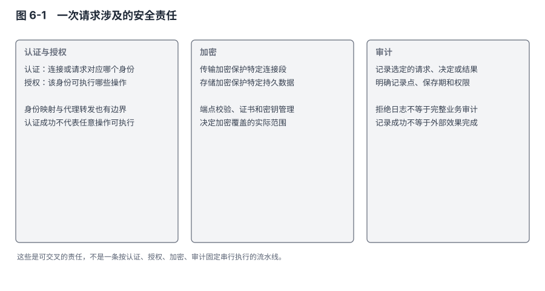
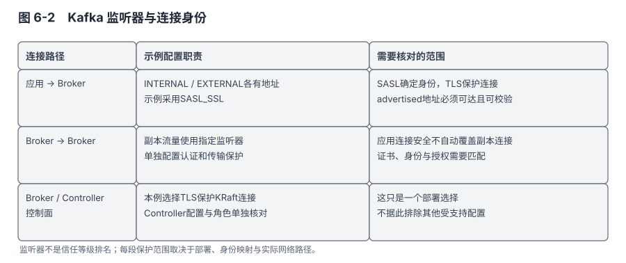
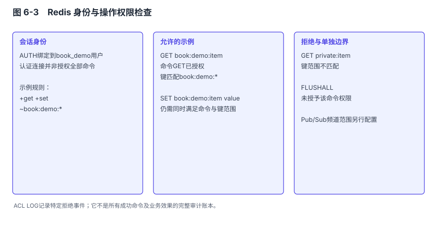
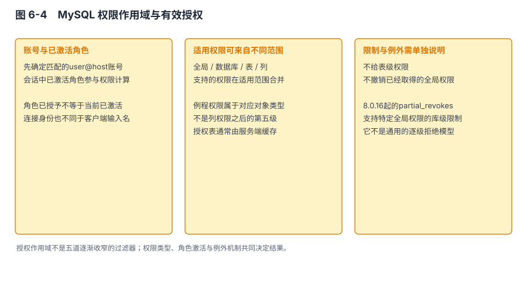

# 第 6 章 安全机制 — 权限、加密、审计

## 本章导读

早年在测试环境跑 Redis 没设密码，某天发现 `KEYS *` 返回来一堆不认识的东西：一个爬虫脚本扫到了公网 IP 上的 6379 端口，把我们的实例当成了免费缓存。好在只是测试环境。

这件事能证明的是，那次部署把可以执行命令的接口暴露给了没有获得授权的人。加上一个密码也不意味着完成全部保护。后来再看数据系统的安全配置，我更关心一个具体请求：它从哪里进入，以什么身份执行，能触及哪些状态，失败和成功又留下什么记录。

Redis、MySQL 和 Kafka 都能提供认证、授权和传输保护，但资源模型与部署组合不同。Redis 的键权限、MySQL 的表列权限、Kafka 的主题与消费组权限，各自限制不同的操作。把它们排成“简单、企业级、分布式”三档，反而容易跳过最关键的判断：当前配置究竟阻止了哪一种越界。

## 6.1 问题的本质：同一请求涉及不同的信任关系

### 四项工作不能互相替代

认证确认连接或请求代表哪个身份；授权判断该身份能否执行相应操作；加密保护特定介质或传输范围内的数据；审计为事后追踪提供记录。这四项工作可以协作，但不能互相替代。已经通过密码认证的账号仍可能权限过大；已经加密的连接仍可能连向错误的服务端；完整记录一项越权操作，也不等于事前阻止了它。


图 6-1　一次请求涉及的安全责任：传输保护覆盖连接，认证建立身份，授权限制操作，审计记录选定事件；存储加密另有介质与密钥范围。

图中各项不是一个固定的四步算法。TLS 可以在应用认证之前建立，也可以参与客户端身份校验；授权可能发生多次；审计记录可来自多个阶段。把它们画在一张图上，是为了标出责任，不是宣称每种系统都按完全相同的顺序执行。

### 先说明防护对象，再评价配置

对公网连接，窃听与冒充服务端是需要处理的风险；对已经取得应用凭证的攻击者，操作范围更重要；对被复制走的磁盘或备份，加密及密钥分离才有针对性。一个拥有操作系统管理权限的人，与一个只能调用 GET 的应用账号，不处于同一信任位置。不给出这些前提，就很难判断“已经足够安全”意味着什么。

部署环境也不能只分为可信内网与不可信公网。应用主机可能被入侵，测试凭证可能误用于生产，维护人员可能使用了过大的管理权限。网络隔离能够减少可到达的入口，却不能自动把所有内网调用都变成授权操作。内部连接是否需要加密，要根据数据与访问风险决定，不能仅凭地址属于私网就省略判断。

本章比较服务本身暴露的能力，同时明确与操作系统、身份平台、密钥服务之间的分工。这样既不把某个产品没有内置的功能说成无法实现，也不把“可以外挂”说成已经具备。一个扩展接口与一套运行可靠、能撤销凭证并保留审计的系统之间，还隔着具体的集成工作。

### 长连接减少认证次数，不取消身份变化

数据服务经常使用长连接，身份验证的成本可以由多次操作分担。但授权必须针对当前操作及资源，不能因为握手时通过认证，就放行会话中任何命令。密码轮换、账号禁用和权限撤销还会提出一个额外问题：已有会话何时受这些变化影响。

“认证一次、授权每次”可以描述一种常见安排，却不是永久不变的会话契约。有的操作可以重新认证，有的系统支持连接上的再认证；修改账号状态后，已经建立的连接也未必立即终止。这些差异在应急撤权时很实际。撤销新连接资格与使所有旧会话失效，需要分别验证。

## 6.2 认证：身份从哪里来，凭证如何更换

### 6.2.1 Redis 的用户与会话

Redis 6.0 引入 ACL 用户体系，7.x 延续这套模型。与早期共享 `requirepass` 相比，命名用户使不同应用能够使用不同凭证与权限。`AUTH username password` 或带认证信息的 HELLO 可以建立用户身份。兼容形式的共享密码仍然存在，因此迁移到较新版本不会自动替部署者建立按应用区分的身份。

Redis ACL 用户可以配置多个密码，这为轮换提供了过渡空间：先让新旧凭证都可用，迁移客户端，再撤旧凭证。但允许重叠与完成轮换是两回事。仍在使用旧密码的客户端、长期未重连的连接，以及配置文件中遗留的旧凭证，都需要有观察和退出办法。只把新密码加入服务端，旧凭证并没有因此失效。

密码摘要、运行时用户状态和持久化规则也应区分。配置了 `aclfile` 时，ACL 可以按相应命令保存和加载；修改运行时规则，不等于所有磁盘配置已经同步更新。启动时从哪里恢复用户，需要与运维管理方式一致。否则重启可能重新启用旧规则，或者让已迁移客户端无法登录。[R6-01：Redis 访问控制列表](#ref-r6-01)

Redis 使用密码摘要并不意味着可以选择容易猜测的密码。用于校验的摘要不是可逆加密，但弱口令仍可能被离线尝试恢复。这里应依赖高熵凭证、访问控制和妥善保存，而不是只看到文件中没有明文就认为风险已经消失。

### 6.2.2 一个 ACL 示例还需要解释初始状态

下面的命令用于 Redis 7.x 隔离测试实例，通过已获授权的管理连接进入 `redis-cli` 后执行。它会建立或重置演示用户，因此不应对已有应用用户照抄。`REPLACE_WITH_RANDOM_SECRET` 是必须替换的占位符，不是可使用的密码。

```redis
ACL SETUSER book_demo reset on >REPLACE_WITH_RANDOM_SECRET ~book:demo:* +get +set
```

`reset` 使示例从明确的权限状态开始，避免已有授权与新规则累积后仍然保留额外权限。`on` 允许该用户认证，密码前的 `>` 是 Redis ACL 语法，不是 shell 的输出重定向。键模式只覆盖 `book:demo:` 前缀，命令只授予 GET 与 SET。该用户没有由这条命令获得管理命令、任意键访问或订阅通道权限。

如果在 shell 中调用 `redis-cli`，带 `>` 的参数还需要正确引用；这也是示例特意说明执行位置的原因。凭证还可能进入命令历史，实际管理应使用符合环境要求的凭证注入方式。本例只展示规则含义，不能代替生产凭证发放流程。

Redis 7.0 提供 `ACL DRYRUN`，可由管理用户检查某个命令对目标用户是否允许，而不执行数据操作：

```redis
ACL DRYRUN book_demo GET book:demo:1
ACL DRYRUN book_demo GET other:1
ACL DRYRUN book_demo FLUSHALL
```

第一项应符合演示授权，后两项应因键范围或命令权限不符而被拒绝。这个检查直接验证规则边界，比只查看用户是否创建成功更有意义。测试结束后，管理用户可用 `ACL DELUSER book_demo` 删除演示用户；若测试期间选择将规则持久化，还应同步恢复对应配置。[R6-02：ACL DRYRUN 命令](#ref-r6-02)

### 6.2.3 MySQL 账号匹配与认证插件

MySQL 账号以用户与来源部分共同标识。`'app'@'localhost'` 与另一个来源规则下的 `'app'` 可以对应不同账号配置。连接建立时先匹配账号，再使用该账号指定的认证方式。客户端声称的用户名，与最终匹配到的账号并不总是同一个文本表示；排查时可以对照 `USER()` 与 `CURRENT_USER()`，前者反映连接信息，后者反映权限检查采用的账号。

MySQL 8.0 的默认认证插件为 `caching_sha2_password`，但升级后的既有账号仍可能采用其他插件。新安装、升级和发行版初始化方式必须分开看，不能概括成“装好就一定有强密码”。初始化选项、密码策略组件和账号创建语句共同影响结果。

`caching_sha2_password` 区分完整认证与缓存可用时的快速认证。完整认证需要安全连接，或在相应非加密连接上使用 RSA 密钥交换来保护密码传送；RSA 保护密码交换不等于给此后的 SQL 和结果加密。缓存路径减少后续认证的工作，但不是把现有长连接上的每条 SQL 都重新做一次密码校验。[R6-03：Caching SHA-2 认证插件](#ref-r6-03)

插件接口能够接入不同身份验证方式，但客户端也必须支持对应协议，服务端还需部署正确组件。有些企业身份集成与发行版或授权有关，不能把插件名称列表当作所有安装都可直接使用的能力。更换认证方式的验收，应包含新连接、缓存失效后的连接和旧客户端，不能只在一个已连通会话里执行查询。

### 6.2.4 Kafka 的认证机制与监听器

Kafka 3.9.0 可以使用 SASL 机制或 TLS 客户端证书等方式建立身份。SASL 是认证框架，PLAIN、SCRAM、GSSAPI、OAUTHBEARER 是不同机制；`SASL_SSL` 与 `SASL_PLAINTEXT` 则还表达了传输层是否使用 TLS。名字中都有 SASL，不代表凭证及业务数据受到相同保护。

PLAIN 需要通过受保护的传输来避免暴露密码。SCRAM 通过带盐的派生信息和挑战响应证明持有密码，但也不能据此省去服务端身份验证与连接保护。支持某种算法，只说明产品具有一种选择；部署还要检查凭证来源、轮换、客户端兼容和运维能力，不能单凭 SHA-512 的数字较大就完成机制选型。[R6-04：使用 SASL 认证](#ref-r6-04)

同一 Broker 可以暴露多个监听器，分别服务应用、节点间通信或控制面相关连接。监听器名称映射到安全协议，再关联相应认证与证书配置。它们是同一进程中的不同入口，不是三套彼此独立的数据服务。某个入口配置严格，不能抵消另一个可到达入口的宽松权限。


图 6-2　Kafka 监听器与连接身份：应用、Broker 间和控制面连接分别选择协议与凭证；图中是显式配置示例，不是产品默认值。

`listeners` 指定服务端监听位置，`advertised.listeners` 为客户端提供后续连接地址。bootstrap 地址能连通，只证明客户端找到了初始入口；元数据返回的 Broker 地址若无法从客户端网络访问，后续生产或消费仍会失败。TLS 还需要证书中的身份与访问地址匹配。把地址问题误当作认证失败，常会导致无依据地放宽安全设置。

### 6.2.5 控制面也需要能够启动的凭证来源

KRaft 的元数据与应用消息不同，控制器和 Broker 对凭证、授权信息及元数据状态具有依赖。设计内部认证时，需要说明首次启动时凭证从哪里来，哪些信息可以预置，哪些必须等集群建立后管理。不能仅因为凭证存放在元数据中，就推导某个监听器在所有版本都绝对不能采用某种机制。

本章图示选择控制面使用预置证书的 TLS 连接，应用和 Broker 间使用各自明确配置的认证方式。这是一个便于说明信任关系的部署示例，不是排他结论。采用其他组合时，应按 3.9.0 的具体支持与引导步骤核验，尤其不能把为数据连接准备的配置直接搬到控制器仲裁连接。

Kafka 的委托令牌提供另一种凭证生命周期：通过已认证通道申请，后续使用有效期受限的令牌，并处理续期与撤销。它可以减少分发长期凭证的需要，却不自动保存每次业务调用的最终用户身份。令牌代表谁、谁可续期、服务端怎样保护验证所需的秘密信息，仍属于完整设计的一部分。

## 6.3 授权：允许一项操作，需要哪些资源权限

### 6.3.1 Redis 的命令、键与通道

Redis ACL 可以限制命令、键模式与 Pub/Sub 通道。命令类别便于管理一组相关操作，但类别是产品提供的集合，不能直接代替业务权限。“只读”也不等于“可以读取所有数据”，某些不修改状态的命令仍可能暴露敏感信息或产生大量资源开销。资源范围与命令范围需要同时限制。


图 6-3　Redis 身份与操作权限检查：会话关联用户，具体命令仍按其操作及资源检查；键权限不自动授予 Pub/Sub 通道权限。

多键命令使这个边界更明显。用户能够访问一个键，不代表能够执行涉及另一个命名空间的操作；模块命令和脚本也需要遵守相应的键与权限约定。Redis 7.x 的 ACL 又包含读写键模式及选择器等演进能力，使用这些规则时应核对客户端和实际小版本，不能把较早示例中的两个条件当成全部 ACL 表达能力。

另一个常见误解是把关闭 `default` 用户当成撤销所有既有会话。用户 `off` 影响后续认证，但既有连接的处理需要按实际规则另行检查。相应地，protected mode 是对某些缺少显式防护的部署状态的保护，不是通用的身份与权限系统。它与监听地址、用户状态和网络访问策略共同作用，不能只凭一个开关宣称公网部署已经安全。[R6-05：Redis 安全机制](#ref-r6-05)

### 6.3.2 MySQL 的不同作用域不能画成逐级拒绝

MySQL 可以在全局、数据库、表、列与存储程序等作用域授予适用权限。对一般对象访问而言，相关授权可以组合；并非细粒度规则总能覆盖掉粗粒度授权。账号已经具有全局 SELECT 时，只在某张表上少授几列，不会自动把全局权限收窄到这些列。[R6-06：访问控制：请求验证](#ref-r6-06)


图 6-4　MySQL 权限作用域与有效授权：适用授权共同影响结果，存储程序是不同对象分支；不能理解为从全局到列逐级设置拒绝。

MySQL 8.0.16 起的 partial revokes 可以在启用相关变量后，对部分全局权限施加数据库级限制。这是有范围、有条件的功能，不能扩展成任意表列上的通用拒绝规则。使用它还会影响相关授权语义，需要在实际配置中明确，而不是靠一张“越细优先”的图略过。[R6-07：部分撤销权限](#ref-r6-07)

MySQL 8.0 的角色把一组权限命名，并可授予账号；角色授予与角色激活仍需区分。账号拥有某个角色，不保证当前会话已经使用它。排查权限时要结合账号匹配、直接授权、角色和激活状态，而不是只检查某条 GRANT 是否存在。

管理权限也不能仅按“比写权限更危险”排列。FILE 涉及服务端文件访问，但受系统权限和 `secure_file_priv` 等条件限制，并非可以读写任意文件。复制、账户管理和运行状态查看各自暴露不同能力。应用通常不需要管理整个实例，然而迁移或维护账号可能确实需要较大范围；把它们与日常业务账号分开，才能分别设置使用时限与审计。

### 6.3.3 Kafka 的主体、操作与资源必须同时匹配

Kafka ACL 将主体、操作、资源以及适用的主机条件和允许或拒绝规则组合起来。Topic、Group、Cluster、TransactionalId 等是不同资源类型。可以写某个主题，不等于可以管理消费组；消费者能够读主题，也还需要满足消费组相关操作的权限要求。事务生产者又会涉及不同资源，不能从最简单的生产示例直接推导所有应用所需 ACL。

前缀资源模式便于管理同一应用的一组主题，但也把命名约定变成授权的一部分。若所有 `app-a.` 开头的主题都被授予某服务，未来创建的新主题也可能落入该范围。前缀降低逐项管理成本，同时扩大了命名错误的影响。因此创建权限、命名审核与前缀授权应一起考虑。

对 Apache Kafka 3.9 内置授权器，启用授权器而资源没有匹配 ACL 时，默认只允许超级用户；显式设置 `allow.everyone.if.no.acl.found=true` 才改变这项行为。ZooKeeper 模式的 `AclAuthorizer` 并非默认放行所有人，`StandardAuthorizer` 的默认拒绝也可以通过配置改变。未启用授权器与启用了但没有 ACL，是两个不同状态。[R6-08：授权与 ACL](#ref-r6-08)

授权变更后出现拒绝时，实际主体、资源、操作和有效规则共同决定缺少哪项权限。临时授予全资源 ALL 也许能让请求通过，却掩盖了究竟缺少哪项权限，并可能把这个临时状态长期留下。成功请求只能证明当前权限足够，不能证明权限最小；还需要验证应该失败的操作确实失败。

## 6.4 加密：保护范围不能只写成一个开关

### 6.4.1 TLS 同时涉及传输保护与对端身份

TLS 可以保护连接上传输的数据，但客户端必须正确验证服务端证书及身份。如果只是加密而不确认连接到谁，客户端仍可能把数据交给不应接收它的对端。证书链可信、访问主机名匹配、证书在有效期内，是相互有关但不同的检查。

客户端证书又增加了另一方向的认证。服务端可以要求客户端持有受信任的证书，不过证书身份如何映射到应用权限，仍由产品机制和部署配置决定。持有有效证书不必然等于拥有某个 Redis ACL 用户的所有权限，也不等于可以执行任意 SQL。连接认证与资源授权不能在概念上合并。

Redis 7.x 的 TLS 能覆盖客户端、复制和 Cluster bus 等连接，具体通道由相应配置启用。可以保留明文与 TLS 端口以支持迁移，也可以关闭明文入口。两种安排各有目的：迁移期需要旧客户端继续工作，最终保护目标却可能要求不再存在可到达的明文路径。只验证 TLS 端口能连接，不能证明所有客户端已经迁移。[R6-09：Redis TLS](#ref-r6-09)

### 6.4.2 MySQL 的连接要求与客户端验证

MySQL 可以通过服务端及账号条件要求加密连接，也支持不同客户端验证模式。`REQUIRE SSL` 表达账号使用加密连接的要求，`REQUIRE X509` 等条件还可要求客户端证书。但服务端对客户端提出要求，不会替客户端完成对服务端身份的正确验证。两端配置都属于同一条连接的安全条件。

这在代理场景中尤其重要。应用到代理的一段使用 TLS，不等于代理到数据库的另一段也受保护；如果 TLS 在代理终止，代理就是能够看到明文的受信任组件。架构图应把终止点标出来，才能知道证书、私钥和明文分别出现在哪里。把多段连接统一画成一根“已加密”箭头，会遗漏真正的责任边界。

### 6.4.3 存储加密取决于文件与密钥的管理

InnoDB 的静态数据加密针对其支持的表空间和日志范围。密钥由相应 keyring 组件或插件管理，MySQL 8.0 的不同小版本、发行版与组件具有差异。社区版并非只有一种永远不变的旧插件形态；具体安装应按对应版本确认组件支持。企业版还提供更多密钥管理集成。[R6-10：InnoDB 静态数据加密](#ref-r6-10)

这里最重要的边界是，文件加密主要防止没有解密能力的人读取被取得的文件。已经通过数据库授权执行 SELECT 的用户，通常仍会得到正常明文结果；主机上能够访问数据和密钥的高权限主体，也不能仅靠表空间加密隔离。加密保护的是明确的获取路径，不是对任何攻击者都不可读。

数据文件、redo log、undo log、binlog、relay log 和备份又有各自的配置与支持范围。只给表空间加密，不能自然推出其他记录已加密。恢复时还需要与数据匹配的密钥及其管理配置；拥有备份文件而失去必要密钥，可能无法恢复。备份验证因此必须包含解密与实际装载，而不是只确认文件复制成功。

Redis 和 Apache Kafka 的常见开源部署可以通过文件系统、磁盘或外部存储服务提供静态加密，这与应用内置的表空间加密属于不同实施层次。远程存储对象的加密、访问凭证和副本数据也需要纳入范围。是否必须在应用内实现，取决于防护对象与运维要求，不能据此直接给产品排安全高低。

### 6.4.4 Kafka 要逐条说明通信路径

第6.2.4—6.2.5节已经区分应用、节点间与控制面入口。传输保护须落实到实际使用的连接：一个入口配置TLS，不会自动保护其余连接；流量被称为“内部”，也不改变其中数据的敏感性。

第 5 章提到 Kafka 3.9 的 SSL 路径不能使用所述 `sendfile` 优化。这是加密成本的一项具体来源，此外还有握手、数据加解密、缓冲管理等工作。证书算法主要影响认证与握手部分，长连接的大量数据则主要经过记录保护路径。实际占比受连接寿命、消息量、硬件和实现影响，不能用一个固定的“吞吐只剩六到八成”代表所有场景。

评估性能时，应把握手密集与长连接稳态分开，把相同消息大小、确认方式和硬件下的结果放在一起。若必须满足传输保护要求，性能预算要在这个前提下测量，再调整批量、连接复用或资源。不能先以无保护配置取得一个目标数字，再把保护要求描述成可随意舍弃的附加成本。

### 6.4.5 轮换不只是生成新证书

证书更新需要考虑信任方的更新顺序。新证书由新 CA 签发时，如果客户端尚未信任新 CA，那么在服务端切换证书后，客户端会拒绝建立连接。长期同时信任已经应当退出的 CA，则会保留旧风险。一次轮换的完成条件应该包含旧信任退出，而不只是新连接成功。

密钥轮换与数据重新加密也不是同义词。某些方案更换用于保护数据密钥的上层密钥，实际数据页不必立即全部改写；具体机制要按实现确认。对运维而言，无论采用哪种方式，都要能证明旧数据仍可恢复、新数据使用正确配置，以及回退不会重新依赖已经销毁的密钥。

## 6.5 审计：记录了什么，仍然不知道什么

### 6.5.1 拒绝日志、慢日志和完整审计有不同目的

Redis 的 ACL LOG 记录与权限相关的拒绝事件，SLOWLOG 关注超过执行时间阈值的命令。二者都有排障价值，但都不等于所有成功读写的完整审计。没有看到拒绝记录，只能说明相应记录中没有捕获到拒绝，不能证明没有发生越权或凭证滥用。

记录字段同样有边界。审计需要关联身份、操作、目标、时间及结果，但不同日志未必同时提供这些信息。若应用共用一个用户，日志即使完整记录该用户的行为，也无法直接区分是哪一个应用实例或最终用户发起。第 6.2 节的身份划分在这里影响可追踪性，审计端无法凭空还原上游已经丢掉的身份。

`MONITOR` 可以观察命令流，却不是无条件适合长期生产审计的替代品。它会增加处理负担，并可能暴露敏感操作信息。是否采集某种日志，需要同时考虑覆盖范围、性能和敏感数据，而不能把“能看到更多”直接等同于“更安全”。

### 6.5.2 MySQL 日志要按事件含义选择

MySQL General Log 记录连接和收到的语句，慢查询日志关注特定执行条件，binlog 面向复制与恢复。它们记录不同事件，收到语句不证明事务最终提交，binlog 中的变化也不直接包含所有查询行为。把这些文件拼在一起，仍需理解它们的时点与标识才能重建过程。

MySQL Enterprise Audit 提供专门的审计能力，其他发行版或外部组件也可能提供不同方案。选择时需要确认实际产品、插件和过滤策略，而不是按“社区版只能开 General Log”概括全部可能性。本书不把某一个商业组件的存在当作合规完成；事件覆盖、保留、权限及取证流程仍需落实。

如果需要证明谁修改了某项业务状态，数据库账号可能只对应共享连接池。此时还需要应用请求标识、业务主体和事务结果的关联记录。应用记录与数据库记录各自不能替代另一方：前者保存业务上下文，后者更接近实际执行。组合之后仍要处理时钟、重试和失败时的记录缺口。

### 6.5.3 Kafka 的授权记录不包含完整消息处理历史

Kafka Authorizer 的日志可以提供授权决策信息，但开启哪个级别、记录哪些事件，要以实际日志配置为准。某个写请求被允许，只说明权限检查通过，不直接证明每条消息最终获得何种确认；某个消费请求被允许，也不能证明应用已处理结果或完成外部副作用。

客户端拦截器可以补充应用侧记录，但无法被当作不可绕过的服务端控制。一个未安装拦截器的客户端，或者已经被修改的应用代码，可能不产生预期记录。如果审计目标要求所有访问都有可验证痕迹，记录点必须位于不能被相应调用者绕过的位置，或者明确承认这一覆盖限制。

把日志输出到独立系统，可以减少业务节点故障导致的丢失风险，但也增加了传输、积压和收集端故障问题。异步审计需要说明最多允许丢失多少记录，以及队列满了以后怎样处理；同步审计则把记录服务的可用性加入业务请求路径。这是业务与审计要求共同决定的取舍，不能默认采样永远足够。

### 6.5.4 审计数据本身也需要保护

日志可能包含账号、对象名、查询条件或其他敏感信息。为了审计而复制这些信息，会形成新的数据副本和访问范围。记录哪些字段、哪些字段需要遮蔽、谁能读取和删除，应该与业务数据一样有明确约定。

留存时间也不是越长越好。太短会缺少调查所需证据，长期无差别保留则增加暴露范围和存储负担。若需要证明记录没有被修改，还要考虑追加写存储、完整性校验及管理权限分离。普通文本日志存在，并不自动具有不可抵赖或防篡改性质。

我更愿意从一次具体事件倒推审计需求。假设调查发现共享应用账号访问了一个不属于日常业务的表，下面只列三种证据状态，不把它们当成所有产品默认具备的日志能力。

| 实际留下的记录 | 可以进一步确认什么 | 仍不能由此确定什么 |
|---|---|---|
| 数据库侧记录了账号、访问对象、操作与时间 | 哪个应用账号在相应时间访问了哪些资源 | 共享该账号的哪个最终用户发起了请求 |
| 应用侧还记录了请求标识、认证用户及对应数据访问，且能可靠关联到这次操作 | 请求从哪个业务身份进入，并经过哪条访问路径 | 没有记录的中间步骤，不能仅凭时间接近补成事实 |
| 只剩应用总错误计数，相关访问记录未保留 | 记录周期内的错误总数 | 是否与本次访问有关，以及具体对象、请求和用户，均无法由总数确认 |

这会改变记录选择：为调查补上必要的账号、对象和关联信息，比无差别复制所有查询内容更直接。记录缺失时应保留未知范围；增加采集也要继续满足前面的字段遮蔽、权限与留存约定。

## 6.6 横向对比：能力要与部署状态一起记录

**表 6-1　三种系统的安全责任与边界**

| 问题 | Redis 7.x | MySQL 8.0.x | Kafka 3.9.0 |
|---|---|---|---|
| 应用身份怎样建立 | ACL 用户与密码；TLS 可校验连接证书 | 账号匹配及认证插件 | SASL 机制或 TLS 身份等配置 |
| 资源怎样划分 | 命令、键模式、通道及相关规则 | 全局与对象作用域、角色和适用限制 | 主体、操作、资源模式及允许/拒绝规则 |
| 默认状态要检查什么 | default 用户、密码、监听与 protected mode | 初始化方式、现有账号插件与权限 | 监听协议、是否启用授权器、无 ACL 行为 |
| 传输保护怎样确定 | 客户端、复制、Cluster bus 分别配置 | 客户端、代理、复制等连接分别确认 | 应用、Broker 间、控制面连接分别确认 |
| 静态数据怎样保护 | 操作系统或外部存储等方案 | 支持范围内的 InnoDB 与日志加密、keyring | 本地介质与远程存储等方案 |
| 原生日志不能证明什么 | ACL LOG/SLOWLOG 不覆盖全部成功访问 | 收到 SQL 不等于事务提交或最终用户身份 | 授权通过不等于消息已处理或外部效果完成 |

表中的差异不能形成一个统一的权限粒度排名。列权限和键模式限制不同对象，主题权限也不能直接与列数比较。真正有意义的是当前业务的授权单位：应用是否需要读取某些字段，是否需要共享主题，是否需要在同一实例隔离键空间。资源模型不合适时，强行叠加复杂规则可能比拆分数据更难维护。

同样，某项能力可选，并不证明产品故意把安全排在性能后面。要解释历史设计动机，需要相应记录；本章依据当前可观察的机制与代价作判断。默认配置、可配置能力和具体部署状态应分别记载，避免把一份演示配置写成产品永恒属性。

## 6.7 架构启示

### 6.7.1 默认值需要与完整安装路径一起检查

从源代码默认值、发行版配置、容器镜像初始化到实际启动参数，最终状态可能经过多次覆盖。只引用产品文档的一项默认值，不能证明当前实例就是那个状态。第 3 章讨论配置加载，本章进一步说明它为什么会改变信任边界。

开篇事件中，关键是未授权者能够访问并写入测试实例。整改首先要阻断这条路径，再区分应用身份与操作范围。用一条“默认安全”的产品标签代替实际连接测试，仍然可能漏掉另一个监听入口或旧账号。可观察的拒绝行为，比配置名更接近需要验证的目标。

### 6.7.2 最小权限要验证允许与拒绝两侧

应用正常运行，只证明它拥有足够权限，不证明没有多余权限。一个只需要写自己主题的服务，也许同时拥有删其他主题的能力；一个查询用户，也许继承了全局权限。权限评审需要从实际业务操作推导允许集合，再对越界操作做受控验证。

Redis 的 ACL DRYRUN 提供了不实际执行命令的检查方式，MySQL 与 Kafka 也能通过查看有效账号、授权规则以及隔离环境中的请求验证来检查边界。方法不必完全相同，目标是一致的：被允许的必要操作能够完成，被禁止的操作不会因另一条广泛授权而放行。

### 6.7.3 纵深防御要有不同的失效条件

网络限制、认证、授权和加密可以降低不同路径的风险，但不能据此说攻击者必须逐层攻破所有措施才能获得数据。若攻击者已经控制了有权解密并读取数据的应用进程，某些保护并不会阻止其正常权限内的访问。多个措施是否独立，要根据攻击者已经取得的能力判断。

因此，我不会只数安全图上有几个框。更有用的是分别设想一个条件失效：密码泄露后权限能否限制影响，应用主机失陷后其他服务是否仍隔离，磁盘被复制后密钥是否同时暴露。这样才知道措施之间有没有真正提供额外保护。

### 6.7.4 身份跨过服务边界时，需要明确保留还是转换

应用连接数据库时可能使用服务账号，原始用户身份只存在于应用内；Broker 处理客户端请求与节点间复制，也使用不同连接身份。下游服务接收到的主体，不一定还是最初的用户。这个问题同样存在于 Redis、MySQL 的代理与应用链路中，不是 Kafka 独有。

若只保留服务身份，权限和审计就只能到服务这一层；若传递原始用户标识，下游还需要判断谁有资格声明这个标识。一个普通请求字段不能自动成为可信身份。委托令牌、受信代理和应用审计各自提供不同能力，选择时应明确需要保留的身份粒度。

### 6.7.5 轮换、撤销和恢复决定控制能否持续有效

一套认证配置刚启用时能工作，只是生命周期的开始。人员离职或服务下线后如何撤销相关账号，证书到期前怎样更换，密钥服务故障时数据能否恢复，都会影响控制的长期有效性。把这些动作交给外部平台可以减少重复实现，但依赖关系也要进入部署与恢复说明。

安全检查需要明确当前请求从入口到数据、再到日志记录的责任，而非脱离这些责任比较哪个产品更安全。任何一项能力若只有接口、没有实际配置与验证，都还不能算当前部署已经具备。

## 6.8 小结

那次测试实例被当成免费缓存，并不复杂，却把身份与访问范围缺失的结果直接暴露了出来。更复杂的部署并不会改变这个基本问题，只会增加账号、连接、复制和记录之间的关系。

Redis 的 ACL、MySQL 的账号与对象权限、Kafka 的监听器与资源 ACL，都可以限制具体访问。TLS 与存储加密保护不同范围，审计又提供另一种证据。把这些能力准确组合起来，需要区分产品支持、默认配置和实际部署，而不是凭产品定位替安全方案下结论。

下一章把这些连接放进集群拓扑。节点失联后谁还能服务，副本能否替代主节点，控制面怎样更新所有权，既影响数据保证，也影响本章讨论的身份与权限应落在哪里。
