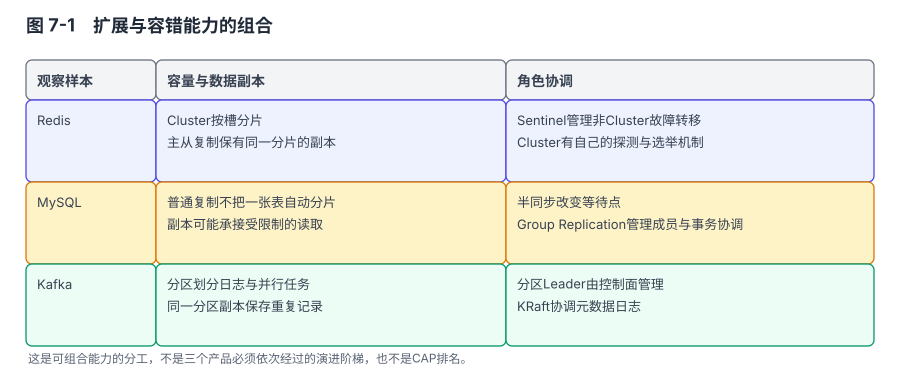
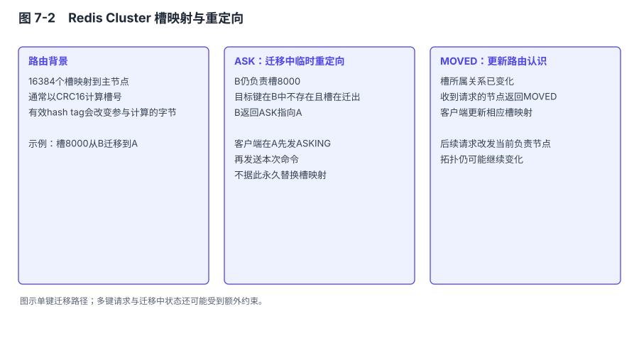
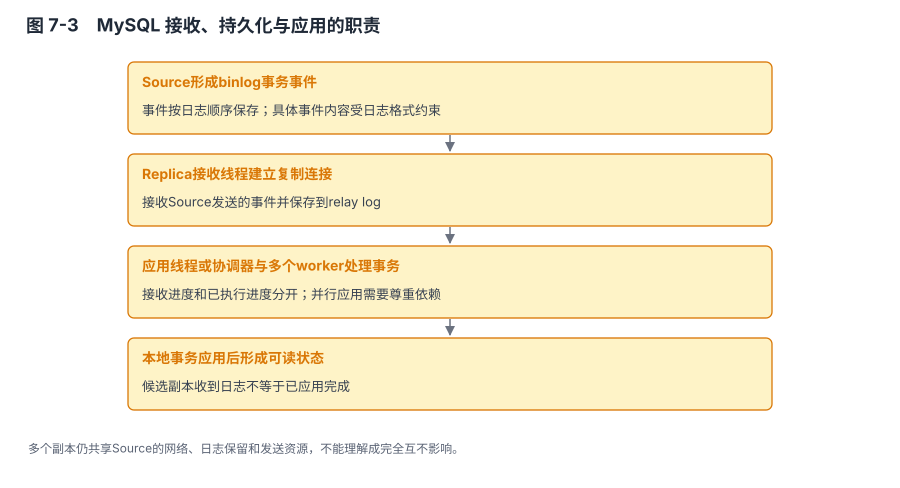
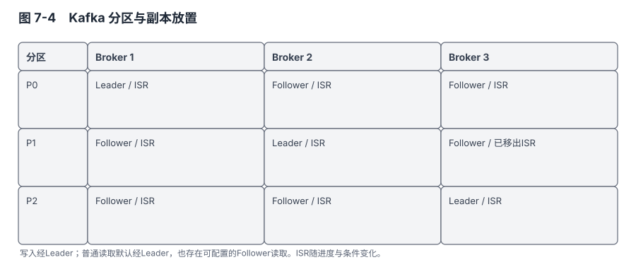
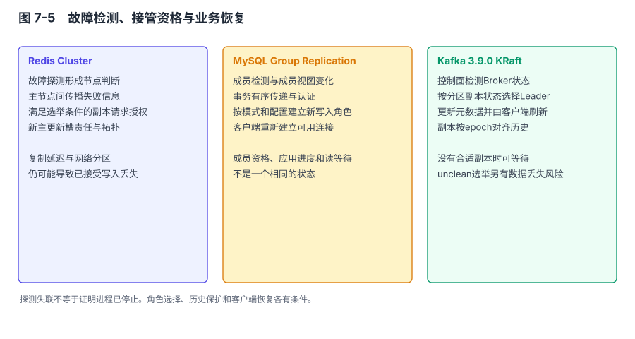

# 第 7 章 集群架构 — 从单点到分布式

## 本章导读

有个同事问我：“Redis 内存快爆了，加个从节点是不是就行了？”

这句话把扩容和复制放在了一起。如果新节点保存的是同一份完整数据，原主节点的内存压力不会因此消失。副本可以为故障后的接管提供数据，也可能分担符合条件的读取，但要容纳更多互不重复的数据，通常需要把数据分开放置。

集群中的很多误判，都来自把一种能力当成另一种能力。自动选主不等于已确认写入不会丢失，数据有多个副本不等于任意节点都能返回最新结果，新增机器也不等于热点自动被摊开。本章沿着数据放置、复制、故障转移和元数据管理四个问题，观察 Redis Cluster、MySQL 复制与组复制、Kafka 分区副本的具体安排。

第 9 章还会深入复制位点与断线恢复。本章先把节点放进拓扑，明确谁保存什么、谁能接受请求，以及一段网络中断会改变哪些行为。

## 7.1 问题的本质：扩展、冗余和协调分别解决什么

### 7.1.1 先确定单机遇到了哪一种上限

内存容纳不了数据，写吞吐达到设备上限，一个热键占满执行线程，以及机器故障后没有接替者，是四种不同问题。分片可以分摊部分容量与访问负担，副本可以保留冗余，但并不保证每一种压力都能被新增节点解决。

如果全部流量集中在一个不可拆分的键或分区上，把其他数据搬走只能释放周边资源，不能让同一个串行操作自动并行。若主要压力来自大范围聚合，分片后还可能增加跨节点读取与结果合并。容量规划不能只画节点数，还要标出一个操作触及多少分片，以及最忙的那一份数据有多大。

副本与备份也不同。副本持续接收变化，因此一次误删除可能很快被复制；备份保存某个可恢复时点，需要独立保留与验证。副本主要改善节点故障时的数据可获得性，备份还用于回退到过去。把同一错误复制到多台机器，并没有形成回到错误之前的能力。

### 7.1.2 分片边界也是操作边界

按范围分片，邻近键容易一起访问，但某个持续增长的范围可能成为热点。按哈希分片，键分布可能更均匀，范围查询却往往需要访问多份数据。这里的均匀性还取决于键及访问分布：键数相等，不代表每个分片收到相同流量。

分片映射可以再加一层中间单位。Redis 的槽把键映射与节点分配分开；Kafka 的分区既限定日志顺序，也是并行处理的单位；关系数据的分片方案则还要处理关联查询与事务范围。选择粒度时，需要同时考虑迁移成本与跨分片操作，不是单纯把单位分得越细越好。

复制是在同一份分片数据之外再放置冗余副本。若有三个分片，每个分片保存三份，逻辑数据仍是三份互不重复的内容，物理上却有九份副本。这个数量示例只用于区分容量口径；实际可用空间还要扣除日志、索引、恢复和迁移所需余量，不能直接把磁盘总容量除以副本数当作可写满的上限。

### 7.1.3 故障检测不能仅凭超时确定原因

一台节点长时间没有回应，可能是进程退出，也可能是网络中断、暂停或过载。观察者通常无法仅凭超时区分这些原因。超时越短，发现真实故障可能越快，但误判和不必要的切换也可能增加；超时越长，则延长部分请求的等待。这是一项具体的检测取舍。

多个观察者达成一致，可以减少单个观察点的偶然影响，但不能保证被怀疑的节点真的已经停止执行。故障转移还需要限制旧主继续作为当前主节点产生影响：例如通过任期、配置版本、资格检查和拒绝旧请求等机制。只选出一个新主，而不处理旧主，仍可能留下两个执行路径。

多数派有交集，是共识协议可以利用的条件，但不是独立的正确性证明。成员如何持久保存投票与日志，新任期如何继承已确定历史，旧节点如何被约束，都决定了协议能否维持保证。不能把“过半投票”推广为任何集群中绝不会出现冲突。

### 7.1.4 CAP 讨论的是特定保证，不是产品等级

CAP 中的一致性通常指线性一致性：操作应当表现得像按一个满足实时先后关系的顺序执行；可用性要求非故障节点收到的请求能够得到相应响应。在网络分区条件下，系统无法同时无条件满足这两项要求。它不是把缓存、数据库和消息系统排成三个固定位置的公式。[R7-01：Brewer’s Conjecture and the Feasibility of Consistent, Available, Partition-Tolerant Web Services](#ref-r7-01)

不能仅凭异步复制中的丢写窗口给系统贴上 AP 标签。丢失已确认写入、读取旧值、拒绝少数派写入和跨节点事务，是相关但不同的问题。一个系统可以在分区后停止某些写入，同时仍因此前的异步复制窗口丢失已确认数据；这正是不能仅靠两个字母理解拓扑的原因。

比较时先给出操作和故障：写已返回成功，随后哪个节点失联，剩余节点保存到哪里，谁有资格接管，客户端又被路由到哪里。这个顺序比先决定产品属于哪一类，更容易发现一项保证的实际边界。

图 7-1　扩展与容错能力的组合：分片、副本、故障转移和元数据管理可以组合，图中不是所有部署必须依次经过的升级路线。

## 7.2 Redis：槽、复制与故障转移分别承担责任

### 7.2.1 主从复制保留数据副本，不拆分键空间

Redis 副本通过复制协议跟随主节点。首次建立完整状态与断线后续传，涉及快照、复制流和 backlog，第 9 章会展开。本章先保留一个事实：普通主从复制下，副本保存与主节点对应的同一份数据，主要写入仍由主节点处理。

从副本读取可以分担部分读负载，但要接受相应延迟和读取语义。如果应用刚写完就需要读取自己的结果，任意选一个尚未追平的副本可能返回旧值。增加副本提供了更多可选读取位置，也增加了需要跟踪的状态，不能只把读吞吐相加。

默认异步复制不会让每次普通写入都等待副本确认。客户端已经收到成功时，相关变化可能还没有进入可接管的副本。如果主节点在这时永久不可用，或者故障转移选择了缺少变化的副本，已确认写入可能丢失。`WAIT` 等机制能够让调用者额外等待复制确认，但其结果与故障转移选择、持久化配置仍需一起判断，不能把它直接称为线性一致性开关。[R7-02：WAIT 命令](#ref-r7-02)

### 7.2.2 Sentinel 有两道不同的门槛

Sentinel 监控一组主从节点，并协调故障转移。单个 Sentinel 根据自身观测形成主观下线判断；达到配置的 quorum 后，可以形成客观下线判断。之后还需要足够 Sentinel 授权某一轮故障转移，由其中一个执行者推进。这两件事不能都简单称作同一次多数派投票。[R7-03：Redis Sentinel](#ref-r7-03)

quorum 是配置的故障判断门槛，授权故障转移又要求满足多数派等条件。把 quorum 调小，不代表少量孤立 Sentinel 就可以不受约束地接管。相反，把 quorum 设得过大，也可能让真实故障发生后无法及时达到判定条件。部署时需要按实际 Sentinel 数量和网络故障域共同检查。

选取新主还需要排除不适合接管的副本，再依据优先级、复制进度及标识等规则选择。把优先级与进度画成一张简单排序表，不能省略候选资格与断连状态。自动化可以按既定条件重复执行转移，但不能据此证明哪个副本具有所有刚刚确认的写入。

Sentinel 的协调与 Redis 数据复制分属两项责任。监控者同意转移，不证明原主真的停止，也不证明新主拥有全部数据。客户端需要发现新主、重新建立连接，并处理进行到一半的请求。对于超时写入，客户端可能不知道原主是否已经执行；新主地址正确，并不能消除这个结果不确定性。

### 7.2.3 槽把键映射与节点数量分开

Redis Cluster 将键空间分成 16384 个槽，通常用 `CRC16(key) mod 16384` 计算键所属槽；哈希标签会改变参与计算的键内容。槽再分配给主节点，因此增加节点时可以迁移一部分槽，而不必因为节点总数变化就重新定义每个键的哈希结果。[R7-04：Redis Cluster 规范](#ref-r7-04)

16384 位的槽位图对应 2048 字节，这是位数与字节之间的直接换算。它不代表整条集群消息只有 2KB，也不代表任意规模集群的通信成本固定。节点身份、消息头、状态传播以及连接数量都还会增加开销。数量在这里用于解释表示方法，不是用来承诺集群可以无条件扩到多少节点。

图 7-2　Redis Cluster 槽映射与重定向：键先映射到槽，槽再关联节点；迁移中需要区分长期映射更新与单次重定向。

`MOVED` 表示请求所对应槽的服务位置需要按返回地址处理，客户端通常会更新或刷新映射；`ASK` 则用于迁移过程中的单次重定向，客户端在目标连接上发送 ASKING 后执行本次请求，不据此永久替换整个槽映射。ASK 不意味着迁移完成后槽一定回到旧节点，它只是避免把过渡状态误当最终拓扑。

哈希标签可以让相关键落在同一个槽。例如，采用相同非空标签的库存键与订单辅助键可以被放在一起，以满足某些多键操作的槽约束。但这个选择同时集中数据与访问：如果所有业务都使用相同标签，就可能把整个集群重新变成一个热点槽。局部原子性与分布式并行度，在这里通过数据放置产生了联系。

### 7.2.4 迁移要同时处理数据和路由

槽迁移不是只改映射表。数据从源节点移动到目标节点期间，部分键可能已经过去，其他键还在原处，客户端也可能保存旧视图。重定向协议用于协调这一阶段，但多键操作还可能遇到暂时无法按原方式完成的情况。所谓在线迁移，应该解释哪些操作继续可用、哪些需要重试，而不是理解为完全没有可见影响。

迁移本身会占用源与目标的 CPU、内存和网络。一个已经接近容量上限的节点，未必有足够余量完成数据移动和复制；迁移速度越快，也可能越明显地影响正常请求。扩容应当留出执行扩容所需的资源，而不能等到最后一点容量用尽才开始。

### 7.2.5 状态传播与选主资格不是同一个机制

Redis Cluster 通过集群总线传播成员、槽和故障等信息。Gossip 帮助节点交换观察，但故障标记、配置版本和副本晋升还有各自的规则。不能因为状态通过 Gossip 传播，就把整个系统概括成“所有节点对等、只需最终一致”。持有槽的主节点与副本在故障转移中的职责不同。

候选副本晋升需要获得相关主节点的授权，并结合配置 epoch 等信息更新槽所有权。这里的多数派按主节点等协议条件判断，不是按谁持有最多槽数判断。一个节点拥有很多槽，并不会因此获得更多选票。把槽数量与投票节点数量混在一起，会误判某种故障分区是否有接管资格。

集群是否继续为其余槽服务，还受到完整槽覆盖等配置影响。即使一侧具有多数主节点，如果缺少某个不可达主节点的可用副本，也不能假定所有数据立即恢复。选举资格、数据所在位置和对不完整覆盖的服务策略，需要同时满足相应条件。

### 7.2.6 从库存事故看已确认写入的边界

我做过一个库存服务，使用 Redis Cluster。大促那天发生网络分区，旧主在失去联系后的短暂窗口里仍接受写入，随后发生主从切换；网络恢复后，那些未保留在新主上的扣减被覆盖，订单与库存出现了矛盾。

这段过程不能简化为“为了快，所以选择丢数据”。真正起作用的是异步复制、故障检测窗口、新主的数据状态，以及应用把成功响应解释成了什么保证。即使没有发生这次网络分区，主节点确认后、复制完成前的故障，也需要单独考虑。

分区持续足够久时，少数派一侧的旧主会依据集群失联规则停止相应服务；这不代表此前窗口内的写入自动进入新主。多数派一侧能否恢复，还要有合适副本等条件。因而“会停写”和“可能丢确认写”可以同时成立。了解这条时间线，比争论一个固定 AP 或 CP 标签更接近事故原因。

第 10 章会把库存系统作为设计推演的起点。本章先保留结论的边界：自动故障转移缩短了部分故障的恢复流程，却没有替业务完成不可丢失状态的设计。

## 7.3 MySQL：复制、提交与读取位置需要共同配置

### 7.3.1 基于 binlog 的复制把接收与应用分开

MySQL 复制源输出 binlog，副本接收相关事件并写入 relay log，再由应用线程推进本地状态。MySQL 8.0 可以配置并行应用，不应把全部 8.0 副本都画成只有一个 SQL 线程逐条执行。网络接收与事务应用分开以后，接收快于应用时，relay log 可以保存尚未处理的工作，但积压仍占用空间并增加读取延迟。

图 7-3　MySQL 接收、持久化与应用的职责：源写 binlog，副本接收进入 relay log，再由一个或多个应用工作线程执行；接收进度不等于应用进度。

基础异步复制不等待副本应用完成才向客户端确认。主库本地提交与副本上的可见结果，存在时间差。若需要写后立即读到结果，读请求应选择满足相应条件的位置，或者显式等待进度；任意读写分离并不自动提供这一语义。

GTID 标识事务，已执行 GTID 集合记录已经执行的事务，有助于发现不同来源之间缺少哪些事务。它不让所有节点拥有一个可直接比较大小的全局序号，也不保证对应 binlog 仍然保留。换主时能够识别差异，与能够从当前来源补齐差异，是两个条件；第 9 章将把身份、进度和历史可获得性分开说明。

### 7.3.2 半同步增加了一种确认，不等于所有副本可读

半同步复制让源在相应等待点等待指定数量副本确认。副本的 ACK 包含将事件写入并刷入 relay log 的语义，不等于应用事务完成。于是，确认成功可以增加故障后的数据可获得性，却仍不能直接证明对该副本发起的查询已经看到新值。[R7-05：半同步复制](#ref-r7-05)

等待点、等待数量和超时后的行为共同决定效果。尤其是超时降级后继续异步写入，保证会发生变化；故障转移选了没有相应确认数据的副本，也可能失去原本希望保留的事务。选主工具需要检查候选节点的状态，不能把“开启半同步”当作其余转移流程的替代。

已经写入 relay log 但尚未应用的数据，不应一概称为丢失。它可能仍可通过正确恢复和应用保留。这里需要区分的是尚不可见、尚未应用与不可恢复，而不是把三个状态都写成“弱一致”。这种区分也影响故障处置：急于开放新主，可能比多等待一段应用过程承担更大业务风险。

### 7.3.3 Group Replication 对事务排序与认证进行协调

MySQL Group Replication（组复制，简称 MGR）将成员组织成组。事务的写集等信息参与传播与认证，组通信为相关事务及成员变化提供一致的顺序基础；成员再根据规则判断事务能否提交，并推进本地应用。XCom 是其组通信实现的重要部分。把整个过程压成“一轮 Paxos，多数节点落盘，所以所有读取强一致”，会丢掉认证、应用和本地持久化的区别。[R7-06：Group Replication](#ref-r7-06)

单主模式将普通应用写入集中到当前主成员，其他成员承担副本角色；多主模式允许多个成员接收写入，但仍需要认证冲突及遵守功能限制。多个节点都能收写，不等于对同一热点行的冲突消失，也不等于吞吐按成员数增长。事务被认证拒绝后，应用仍要处理回滚和重试。

成员保存对应的完整组数据，因此 MGR 不是自动分片方案。新增成员增加冗余与可选择的读取位置，也增加组内传输、应用和管理工作。只要每个成员都要存储并应用同一份业务变化，逻辑数据容量就没有因副本数增加而线性扩大。

### 7.3.4 组的一致性选项影响读取与切换

MySQL 8.0 提供 `group_replication_consistency` 等配置，用于指定事务在相关场景中需要等待哪些进度。默认行为、主切换后的处理，以及事务前后等待可以采用不同安排。应用从任何成员读取时是否能看到先前已提交的写，必须与这些配置及路由策略一起分析。[R7-07：组复制一致性保证](#ref-r7-07)

这解释了为什么一个组已经具有可靠的事务排序，读请求仍可能遇到成员应用进度差异。协调层确定顺序，与每个成员已把所有事务应用到可查询状态，不是同一时刻。等待更多应用进度可以提供更强的读取条件，但也会让慢成员或故障影响等待时间。

本地刷盘同样是另一项工作。共识和组通信说明节点如何接受历史，不自动替代设备、日志配置和备份。讨论“不会丢”时必须说明容忍的是单节点故障、多少成员同时故障，还是整个故障域失去存储。脱离失败模型的数学保证，无法指导实际部署。

### 7.3.5 多数派失联后，不应把读写都概括成停服

组复制在失去多数派通信能力时，不能继续像正常组那样推进需要组协调的事务。故障检测、驱逐超时、失联超时与退出动作等配置，会影响成员等待、退出以及后续可服务状态。某些读取仍可能在相应条件下发生，所以“少数派立即停止所有服务”不是准确的通用描述。

在固定成员集合、依赖过半成员继续决定的简化条件下，三成员组失去一个成员仍能保持多数派，失去两个就不能；五成员组可以失去两个。这个例子说明多数派算术，不证明任意成员故障组合都具有相同恢复时间，也不涵盖强制重组、磁盘损坏等额外操作。

成员分别位于不同故障域才有意义。如果所有副本都在同一台宿主机或同一个会同时失效的存储系统上，进程数并没有变成独立冗余。跨地域放置又会增加通信距离并改变可用多数派分布，不能用“多放几台更安全”代替拓扑分析。

### 7.3.6 Router 与 Shell 把组件组织成可使用的方案

InnoDB Cluster 将 Group Replication、MySQL Router 与 MySQL Shell 的管理能力组合起来。Router 根据元数据和角色选择后端，Shell 提供创建、检查与维护等管理入口。它们减少了应用与运维需要直接处理的细节，但没有改变“全量副本不是分片”的基本事实。

主节点切换后，新连接可以被路由到新的合适节点；正在执行的事务却不能直接迁移过去。旧连接可能中断，应用仍要判断事务结果并决定是否重试。代理提供地址和角色适配，不会使超时结果从不确定变成确定。这与第 5 章讨论的接口失败语义相同，只是现在发生在多节点拓扑中。

如果需要水平分割关系数据，可以另外采用合适的分片层与数据模型设计。但这会增加跨分片查询、事务和迁移问题，不应简单写成“加上中间件即可同时拥有所有能力”。副本组可以成为一个分片的基础，分片之间仍需新的协议与业务边界。

## 7.4 Kafka：分区顺序、副本资格与元数据仲裁

### 7.4.1 分区既划分数据，也限定顺序

Kafka 主题由分区组成，每个分区保存一份有序日志，其副本可以分布在不同 Broker。把不同分区的主副本分散到多台 Broker，可以让它们并行承载请求。但一个单 Broker 部署仍然是可以运行的配置，只是没有跨 Broker 的故障冗余。

图 7-4　Kafka 分区与副本放置：同一分区的副本保存相同日志，不同分区提供独立顺序与并行空间。

生产者决定消息进入哪个分区。对常见的键分区策略，相同序列化键、相同分区数和相同策略有助于保持路由稳定；一旦增加分区、改变序列化方式或使用自定义策略，就不能继续承诺“相同业务键永远在同一个分区”。没有键的消息又可以采用利于批量的分配方式，3.9.0 的具体默认行为应按对应客户端实现与配置理解。[R7-08：生产者配置](#ref-r7-08)

分区内的日志次序不等于所有业务事件天然按因果关系到达。多个生产者之间的协调、重试和业务时钟仍然影响写入先后。消费者并行处理后，完成次序也可能与取出次序不同。因此，日志提供了一项有价值的顺序依据，但应用仍需决定哪些事件必须串行处理、哪些可以并行。

增加分区可以提供更多独立处理单位，却也可能改变后续同键消息的落点，旧消息并不会自动重新分布到符合新哈希映射的位置。若业务依赖按键顺序，扩分区就是语义迁移，不能只视为容量操作。可以选择新主题迁移、固定路由策略或其他明确方案，但都需要处理过渡期。

### 7.4.2 分区数量不是吞吐保证

分区增加文件、索引、状态和管理工作，Broker 的网络与磁盘仍有总上限。消费者也要有足够执行能力，且经典消费组中的分区分配限制了同一组可同时有效工作的消费者数量。把消费者数增加到远超分区数，不会自动得到相同比例的处理并行度。

反过来，分区很多也可能只有少数分区很忙。生产者键分布、批量大小和下游处理耗时都影响热点。如果瓶颈集中在一个业务键上，均匀分配其他键并不能消除它。容量评估至少需要观察最忙分区，而不只是集群平均吞吐。

缺少负载条件的单分区消息条数，不能直接用于推算其他系统的分区数。同样的条数，可以对应截然不同的消息字节数、压缩、复制网络和处理成本。更可靠的规划是使用实际负载形态测出单个资源的约束，再为故障转移、重建和增长保留空间。数据暂时均匀时的峰值，不是失去一台 Broker 后仍能维持的保证。

### 7.4.3 ISR 描述同步资格，不等于所有副本永远一样快

Kafka 为每个分区维护 ISR，即满足相应同步条件的副本集合。Follower 从 Leader 拉取日志，Leader 根据副本追赶情况维护其资格。ISR 可以收缩和扩大，并不要求每一时刻所有成员的日志末端字节完全相等。同步集合描述的是协议所认可的状态，而不是肉眼看到 offset 一样大的瞬间。

正常的干净选举使用符合相应资格的副本，避免直接把缺少已确定历史的落后副本提升为 Leader。若显式允许 unclean leader election，就可能选择不在 ISR 的副本，并承担数据丢失风险。因而“新主只能来自 ISR”需要保留这个配置前提，不能说成任何部署都不可改变的事实。[R7-09：主题配置](#ref-r7-09)

ISR 收缩不会免费消除慢副本影响。如果集合缩到写入要求以下，相关请求会失败；如果仍能写，系统的冗余条件也已经改变。恢复中的副本还要传输和写入历史数据，占用其他节点的资源。移出集合是协议处理当前状态的一种方式，不意味着集群因此恢复了原来的容量与容错余量。

### 7.4.4 acks 与最小 ISR 分别控制等待和准入

`acks=0` 不等待 Broker 返回生产确认，客户端不能据此判断服务端是否接收成功。`acks=1` 等待 Leader 相应追加结果，但不等待所要求的全部同步副本条件。`acks=all` 则按分区同步集合及提交推进规则等待确认；这与本地每条记录都执行 fsync 是不同的机制。

`min.insync.replicas` 与 `acks=all` 共同约束写入能够接受的同步副本条件。例如，一个副本因子为 3、最小 ISR 为 2 的分区，在 ISR 只剩 1 个成员时，不应把写成功当作仍然符合原来的两副本条件。配置关系的意义是让不足以兑现预期冗余的写显式失败，而不是在表中只标一个“强一致”级别。

这里也不能把 `min.insync.replicas=2` 理解成每次只需任意两个副本参与。最小 ISR 是准入与相关校验条件，`acks=all` 的等待依据还涉及当前 ISR 和提交推进。集合可以在请求过程中变化，错误返回还可能出现在已经追加以后；应用不能只凭失败就断言消息绝未进入日志。精确轨迹与第 9 章的 HW、LEO 一起分析。

生产者重试与外部业务结果另有状态条件。第9章9.4.5区分消费位置与业务输出，第10章10.5把重复发布、目标库提交和消费进度放进同一次失败分析；`acks`不能代替这些协议。

### 7.4.5 消费读取与副本复制的用途不同

Follower 保存副本主要服务于冗余和接管，并不意味着应用可以不加条件地把读取平均发往任意 Follower。Kafka 的通常读取路径与配置的副本选择能力有关，基于机架等条件的副本读取又有明确适用方式。本章以常见 Leader 读写路径解释拓扑，不把这个常见安排写成不可变化的协议限制。

消费者还要区分取到消息、处理完成和提交进度。Broker 存在多份日志副本，不能替应用知道外部处理已经完成；读到的消息也可能因为重试再次处理。第 9、10 章会把这些状态放进恢复与业务流程，避免只从 Broker 拓扑推导端到端保证。

### 7.4.6 KRaft 管理元数据，不替业务分区运行同一套选举

Kafka 3.9.0 可使用 KRaft 管理元数据。本书以该模式为主：控制器仲裁组维护元数据日志，活跃 Controller 负责相应集群管理，Broker 根据元数据变化维护自身视图。Controller 可以与 Broker 合并部署，也可以使用独立进程与资源；不同安排的隔离和运维成本不同。[R7-10：KRaft 运维](#ref-r7-10)

元数据日志在实现中有特定标识与存储布局，但不是应用随意生产消费的普通业务主题。它保存成员、主题、分区及相关配置的状态，访问与恢复方式也不同。把它简称为“元数据也放进 Kafka 主题”，会让读者误以为可以用普通生产者绕过控制面直接维护集群。

这里有两种 Leader。控制器之间通过 Raft 确定活跃 Controller；业务分区的 Leader 则由相应控制逻辑依据副本状态和配置选择。Controller 有共识日志，不等于每个业务分区也使用完全相同的 Raft 提交规则。ISR 和 `acks` 仍属于业务日志的责任范围。

ZooKeeper 模式使用外部 ZooKeeper 与 Kafka Controller 协同管理元数据。KRaft 减少了这类跨系统依赖，并改变了元数据传播和管理方式，但不能据此推导任何规模下故障切换都更快。故障检测参数、元数据量和硬件都会影响恢复时间。旧模式具备接管能力，也不应被简化成没有保护的单点。

### 7.4.7 控制面失效与数据面失效可以不同步发生

控制器仲裁暂时不可用时，一些已经建立且不需要元数据变更的工作可能继续，而创建主题、变更副本、处理需要选主的故障等能力会受影响。具体行为要看故障持续时间和 Broker 状态，不能把“控制器失联”直接等价为“所有已有分区立即停止读写”。

这种分离也不是数据面永远不依赖控制面。既有 Leader 失效以后，需要新的有效决策；客户端拿到过期地址以后，需要更新视图。如果控制面迟迟无法恢复，数据服务能力可能逐步下降。评估高可用时，应分别测控制面故障、数据节点故障以及两者同时发生，而不是只删除一个 Broker 验证一次生产成功。

## 7.5 横向对比：把同一故障放进不同拓扑

**表 7-1　选定部署形态的职责对照**

| 问题 | Redis Cluster 7.x | MySQL 8.0 组复制 | Kafka 3.9.0 KRaft |
|---|---|---|---|
| 数据如何分开 | 键到槽、槽到主节点 | 单个组保存完整对应数据，不自动分片 | 主题分区分布到 Broker |
| 冗余单位 | 每个主节点数据的副本 | 组成员的完整数据副本 | 每个分区的副本 |
| 谁处理主要写入 | 槽的当前主节点 | 依单主或多主模式 | 分区当前 Leader |
| 角色变化依据 | 故障状态、资格、授权与配置 epoch | 组成员视图、模式和相关选举规则 | 控制面依据分区副本资格及配置 |
| 控制协调与数据复制 | 不同职责，选举不等于复制完成 | 组通信、事务认证与应用需区分 | Controller Raft 与分区 ISR 需区分 |
| 应用仍要处理什么 | 重定向、连接变化、确认写损失风险 | 连接中断、事务结果不确定、读取进度 | 元数据更新、生产结果不确定、重复处理 |

表格刻意固定了部署形态。若把 Redis Sentinel、MySQL 默认异步复制和 Kafka 单 Broker 混在其中，结论会改变。产品名称本身没有提供足够前提，部署选择必须进入比较。

图 7-5　故障检测、接管资格与业务恢复：检测到失联以后，各系统仍要检查接管条件；新角色产生后，客户端与数据进度还需恢复。

### 一个主节点失联后，还剩哪些判断

在 Redis Cluster 中，先检查其余主节点的可达性与候选副本，再看槽能否被接管及完整覆盖策略；原主确认过的写，可能未进入新主。在组复制中，先看组是否仍能形成有效多数派，再看新主与应用进度、读取策略；原连接上的未决事务仍需要应用处理。在 Kafka 中，先看相应分区是否有可用合格副本，以及控制面是否能够更新 Leader，再看生产确认条件是否仍满足。

这三段过程不能排成简单的快、中、慢。它们检查的状态不同，故障检测参数也不同。比较恢复时间，应从相同起点算到相同终点：是发现失联、产生新主、接受新连接，还是业务重新达到目标吞吐。只给一个“秒级恢复”，可能把其中几段等待漏掉。

### 从指标确认当前状态，而不是只看节点在线

在 Redis Cluster 测试集群中，`CLUSTER INFO` 和 `CLUSTER NODES` 可以帮助检查槽与节点视图；在 MySQL 组复制环境中，可以查看 Performance Schema 的 `replication_group_members`；Kafka 则可通过对应管理工具查看分区 Leader、Replicas 与 ISR。它们报告的是不同层面的状态，不能互相替代。

例如，Broker 在线而 ISR 缩小，意味着进程存活但复制条件改变；MySQL 成员在线而应用积压，意味着可连接不代表数据已追平；Redis 节点在线而槽不可服务，也需要检查更具体的状态。监控“进程还在”是必要的基础，却不是业务保证的完整指标。

## 7.6 架构启示

### 7.6.1 新增节点之前，先写清它将分担什么

开篇“内存满了加副本”的问题，说明节点数量容易遮住数据放置。一个新增节点是保存同一份数据，还是接走一部分数据，是否参与写入，是否仅承担读取，要在扩容之前说清楚。

即使采用分片，也应单独处理热点。某个不能拆开的业务对象可能继续受单节点限制，跨分片事务也可能把原来局部的操作变成分布式协调。扩展收益需要按操作验证，不能以集群总容量增加代替最忙路径已经改善。

### 7.6.2 失败之后的选择，比成功时的吞吐更能区分方案

ISR 不足时拒写、半同步超时后降级、旧主在检测窗口内尚未停写，是会改变业务结果的具体行为。评审这些选择时，我更关心应用能否识别保证变化，以及能否承受相应后果。吞吐相近的两个配置，在故障时可能需要完全不同的后续处理。

有些业务可以暂缓确认，有些可以排队等待，有些允许经过明确流程补偿。不能先把软件设成最宽松行为，再假定业务一定能够修复。故障后的处理必须与成功响应的含义一同设计；如果二者冲突，需要修改确认流程或部署，而不是只增加一个重试循环。

### 7.6.3 元数据是有负载和恢复成本的状态

槽映射、成员视图、分区 Leader 和配置看起来比业务数据小，却决定了数据在哪里可访问。规模增长以后，元数据传播、缓存、变更和恢复也会占用资源。一个集群能容纳多少分区或成员，需要考虑这些工作，不能只依据数据磁盘容量。

但元数据也不是集群上限的唯一原因。网络、磁盘、最忙分片和客户端行为都可能先成为限制。KRaft 改善一种管理方式，不等于任何硬件都能支持“百万分区”。容量数字必须和版本、配置、工作负载及恢复目标一起出现。

### 7.6.4 控制决策与业务数据要分别验证

Sentinel 获得转移授权，不证明新主具有全部写入；Controller 正常选出分区 Leader，不证明客户端先前的失败请求没有进入日志；组复制成员关系正确，也不证明任意读请求都已满足业务进度要求。控制面正确是重要条件，却不是业务端到端正确的全部证明。

一份故障演练记录应同时保留角色变化和数据结果。只看到新主产生，就宣布演练成功，可能漏掉确认写、重复请求和读取旧值。反过来，只核一条记录还在，也不能证明元数据恢复和所有受影响分区已经正常。验证粒度需要对应实际承诺。

### 7.6.5 可配置参数需要明确依赖与失败行为

Redis 有 WAIT 与副本相关写入限制，MySQL 有半同步与组复制一致性选项，Kafka 有 acks 与最小 ISR。三家都在不同位置暴露了可选择行为。

参数并非越多越灵活。使用者必须理解相互依赖以及条件不足时的结果：等待多久，超时后是否降级，错误能否代表未执行，角色变化后规则是否仍成立。好的配置说明不止列取值范围，还解释这些取值怎样改变一个真实请求。第 9 章将沿着复制时间线继续做这件事。

### 7.6.6 迁移与恢复需要预留能力

节点故障以后，剩余节点承担更多请求，还可能同时向新副本传送数据。若平时已经把所有资源用满，故障时的冗余数据虽然存在，服务仍可能因重建负载而持续恶化。副本数量表达了数据冗余，却没有表达资源余量。

恢复目标应进入正常容量规划：允许多久恢复冗余，期间是否降低服务，哪些分片优先重建，是否限制迁移速率。这些不是主路径之外可以永久推迟的附加工作。系统长期运行总会经历成员变化，能够完成变化本身，也是容量的一部分。

## 7.7 小结

分片改变数据放置，副本增加冗余，故障转移改变服务角色，元数据管理使这些变化可以被系统识别和处理。它们可以组合，却不能互相代替。集群比单机多出的能力，需要由这些机制在相同故障条件下共同兑现。

Redis 的槽与重定向、MySQL 的复制与组通信、Kafka 的分区与 ISR，都提供了具体的安排。理解它们，不能停在产品标签或节点数量。更重要的是写清成功响应代表什么、失联后谁有资格继续、剩余数据是否足够，以及应用怎样处理未决请求。

第 8 章把这些状态落到字节布局，检查文件能否定位、校验和恢复；第 9 章再追踪日志历史与复制进度。集群拓扑说明数据应放在哪里，后面两章解释数据实际上怎样保存，以及副本怎样追赶。
