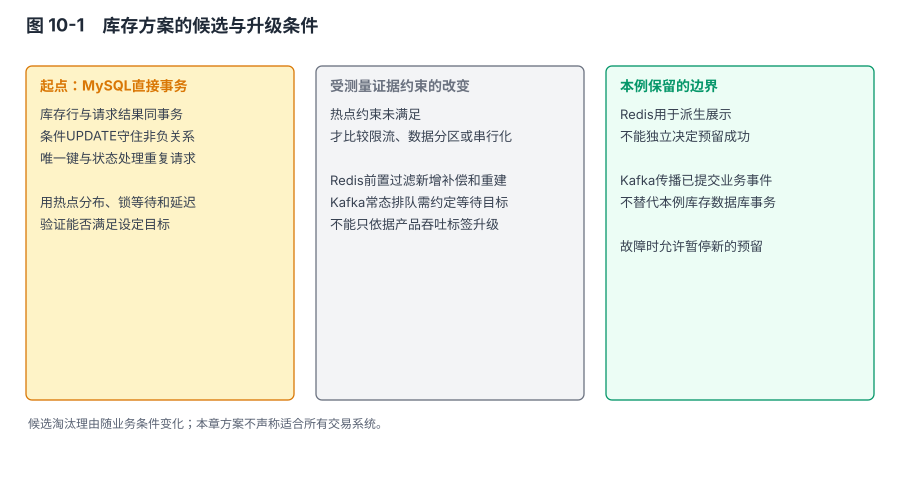
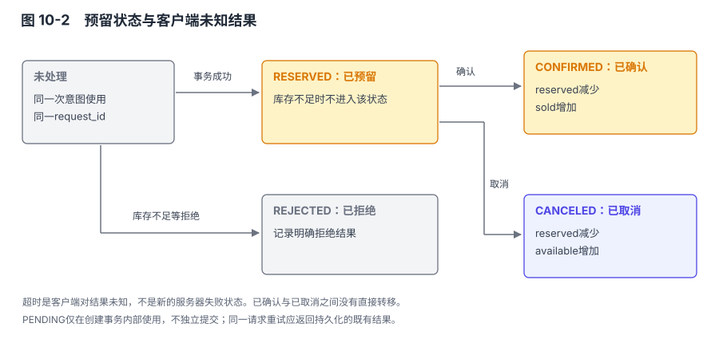

# 第 10 章 把观察用于一次完整设计

## 本章导读

第7章的库存事故最终出现了超卖。后来改成以MySQL记录库存结果，Redis放在前面承担预处理。这是当时作出的调整；本章从它暴露的确认与恢复问题出发，继续检查事务之外的请求与状态。

这段经历不是一份完整设计说明。仅有“MySQL 加 Redis”几个字，无法知道超时怎样处理、预扣后失败怎样回补、重复请求如何识别。本章不把缺少记录的历史细节补写成当年的事实，而是从这个问题出发，构造一个条件明确的库存预留示例，逐步给出可以检查的方案。

以下业务数字、团队条件和实现流程都是本章设定，用于展示推理，不是作者项目的测量结果。示例不会证明一种架构适合所有交易业务；它要证明的是，在这组条件下，哪些决定有根据，哪些仍要经过实验才能作出。

## 10.1 先确定成功意味着什么

### 10.1.1 本章的业务与资源设定

业务是活动商品库存预留。一次请求只预留一种 SKU 的正整数件商品，预留成功后可以确认成交，也可以取消释放。本章不包含付款、跨商家购物车、多 SKU 原子预留和退货补货；这些不是被忽略的异常，而是明确不属于这个事务范围的业务。

活动开始前导入库存，活动期间每个 SKU 的总量固定。预留占用可用库存，确认把已预留数量转成已售，取消把已预留数量还给可用库存。取消与确认互斥，一旦进入任一终态，不允许直接走另一条分支。新的购买意图使用新的请求标识，同一次请求的网络重试沿用原标识。

为使性能问题有具体输入，设定一个小团队维护服务，已有 MySQL 8.0 运维能力，已有 Kafka 用于业务事件，Redis 用于商品展示缓存。峰值预留入口为每秒 2000 次，其中最热 SKU 可能占 40%；单次请求数量上限为 10；正常状态下希望 99% 请求在 200ms 内返回明确结果或可查询的处理中状态。以上均为设计目标与假设，不是任何软件的能力上限。

库存正确性优先于故障期间继续接收新预留。无法确定权威存储可用时，可以拒绝新的预留请求；已经确认的预留不能因为客户端重试而再次扣减。展示库存以正常运行时数秒内更新为目标；展示记录到期且无法从权威库取得有效结果时，返回库存状态未知。最终预留结果必须由权威事务决定。允许展示有货而下单失败，不允许展示缓存单独产生预留成功。

资源与故障范围也要写明。本章先设计一个受控的单写入端数据库方案，允许在数据库主节点故障时暂停预留，恢复或验证切换后再开放；不承诺一个机房和全部数据副本同时丢失时仍然无损。数据库的本地持久化、备份及候选切换需要满足明确运行条件，不能由应用中的一条 SQL 代替。

### 10.1.2 三个不变量

对一个 SKU，定义 `total`、`available`、`reserved`、`sold`。在本章不含补货与退货的范围内，始终要求：

```text
total = available + reserved + sold
available >= 0，reserved >= 0，sold >= 0
```

这是库存数量关系。还需要请求关系：一个请求标识最多创建一份预留结果，相同标识不能被不同用户或不同 SKU、数量复用；预留从已预留状态最多转为已确认或已取消之一。最后是响应关系：服务只能在权威事务提交得到确认后返回预留成功，提交结果未知时不能猜测失败，也不能再用新标识重试。

三个不变量对应不同机制。数量关系依赖对库存行的受控更新；请求关系依赖唯一键和状态转移；响应关系依赖客户端与服务端协议。给数据库设置“双 1”只涉及部分持久化条件，不能自动建立后两项。

### 10.1.3 前九章在这里分别提供什么

**表 10-1　主题知识进入本案例的位置**

| 前文主题 | 在案例中改变的决定 |
|---|---|
| 第1章的约束分析 | 把暂停写入的可接受性与不重复扣减放在产品选择前 |
| 第2章的数据结构与协议 | 请求标识、主键查找、批量事件与数量类型 |
| 第3章的生命周期 | 就绪前停止接单，退出前处理在途事务与结果未知 |
| 第4章的内存与磁盘 | 库存事务持久化，Redis缓存可丢失，恢复来源明确 |
| 第5章的分层 | API输入、库存事务、事件发布和展示缓存分开承担职责 |
| 第6章的访问边界 | 用户只能操作自己的预留，发布器与服务账号分权 |
| 第7章的集群 | 单写入口、故障时停止旧主写入、候选历史验证 |
| 第8章的存储格式 | 事件字段与版本，备份恢复，派生状态重建条件 |
| 第9章的数据同步 | 写后读位置、超时重试、事件重复与消费者结果 |

## 10.2 从候选中选择一个可以验证的起点

### 10.2.1 为什么先考虑数据库直接事务

本案例最核心的修改是：在库存足够时，原子地减少可用量，同时记录请求结果。库存行与请求表可以放在同一个 InnoDB 数据库，用一个事务提交。与跨系统预扣相比，这减少了需要补偿的中间状态，也使相同请求的结果有明确查询来源。

这不说明数据库一定能满足入口峰值。最热 SKU 的行更新仍可能串行竞争，2000 次入口中若有大量请求针对同一行，平均全库吞吐没有决定意义。数据库直接事务只是复杂度较低、正确性容易表达的初始候选，容量要用真实记录宽度、索引、事务长度和热点分布验证。

第二个候选是 Redis 先扣，MySQL 再确认。它可能过滤部分请求，却新增两个系统之间的状态：Redis 已扣但数据库失败、数据库已成功但客户端只看到前置结果、Redis 重建时如何恢复未完成占用。若未经测量就采用，等于先承担这些复杂度，却不知道省下的数据库压力是否值得。

第三个候选是先把请求写入 Kafka，由每个 SKU 的顺序处理逻辑决定结果。它可以让入口接受与最终处理分离，但接口就必须表达排队和稍后查询，不能把消息入队当成库存预留成功。本例允许返回可查询的处理中状态，因此这一候选在接口上可行。暂不采用它的理由是：在直接事务尚未被证明不足之前，无需先承担排队后的状态保存、消费者切换与重复消息处理。异步受理成为常规路径以后，还需要单独约定从受理到最终结果的等待目标。

| 候选 | 本例收益 | 新增负担 | 本轮决定 |
|---|---|---|---|
| MySQL直接事务 | 数量与请求结果在一个事务中 | 热点锁、数据库故障时暂停 | 作为基线实现并测试 |
| Redis预扣加MySQL确认 | 可能减少部分数据库入口 | 两处占用、回补、重建与补偿 | 暂不采用，保留为后续候选 |
| Kafka排队后处理 | 控制处理速率，按键组织任务 | 排队状态、延迟、消费者恢复 | 接口允许；先验证直接事务，再比较是否值得引入 |


图 10-1　先建立直接事务基线；出现被测量证实的瓶颈后，再比较改变入口与状态管理的方案。

### 10.2.2 “先不做”也需要边界

初版不做跨 SKU 原子预留，不意味着以后简单循环执行几次单 SKU 事务即可支持购物车。若要求全成或全不成，就要扩展事务边界，或设计跨分区协调与补偿。这个新要求足以改变当前数据放置方案。

初版不把 Redis 作为准入依据，也不是否定缓存价值。商品标题、图片地址、近似库存展示可以由缓存承接，但库存成功必须回到数据库事务。在这种安排中，Redis 全部丢失主要影响展示与数据库读负载，不改变已经记录的预留结果。

初版不自动提升任意数据库副本。运维可以选择经过验证的高可用方案，但应用在重新开放写入口前必须确认旧写端已被隔离，新写端包含所需历史。若团队暂时做不到，就选择故障期间暂停，不能让“自动恢复可用”成为默认覆盖“不丢确认结果”的理由。

## 10.3 把请求身份和库存放进一个事务

这份方案中，一次成功的预留在数据库事务内完成库存修改、请求结果和outbox事件记录，提交成功后才返回已预留。库存不足时可以提交拒绝结果，但不写预留事件。发布器随后把事件发送到Kafka；本例将结果写入数据库的消费者把派生结果和事件去重记录放在同一个目标库事务中，再提交消费进度。Redis保存展示数据和近似库存，丢失后可以重建，不决定预留是否成功。

下面先写清预留事务，再检查提交结果未知、重复发布和缓存过期时的处理。这里的提交与故障恢复仍遵守前面确定的持久化和接替条件。

### 10.3.1 数据表与约束

下列 SQL 是本章示例的核心表结构，使用 MySQL 8.0.16 及之后的 InnoDB；这一小版本起 `CHECK` 约束才具有这里需要的执行语义。示例使用整数件数和大小写敏感的 ASCII 标识，省略商品描述等非核心字段。[R10-01：CHECK 约束](#ref-r10-01)

```sql
CREATE TABLE inventory (
    sku_id BIGINT PRIMARY KEY,
    total BIGINT NOT NULL,
    available BIGINT NOT NULL,
    reserved BIGINT NOT NULL DEFAULT 0,
    sold BIGINT NOT NULL DEFAULT 0,
    CHECK (total >= 0 AND available >= 0
           AND reserved >= 0 AND sold >= 0),
    CHECK (total = available + reserved + sold)
) ENGINE=InnoDB;

CREATE TABLE reservation (
    request_id VARCHAR(64) CHARACTER SET ascii COLLATE ascii_bin PRIMARY KEY,
    user_id BIGINT NOT NULL,
    sku_id BIGINT NOT NULL,
    quantity INT NOT NULL,
    state VARCHAR(16) CHARACTER SET ascii COLLATE ascii_bin NOT NULL,
    state_version INT NOT NULL,
    created_at TIMESTAMP(6) NOT NULL DEFAULT CURRENT_TIMESTAMP(6),
    updated_at TIMESTAMP(6) NOT NULL DEFAULT CURRENT_TIMESTAMP(6)
               ON UPDATE CURRENT_TIMESTAMP(6),
    CHECK (quantity BETWEEN 1 AND 10),
    CHECK (state IN ('PENDING', 'REJECTED', 'RESERVED',
                     'CONFIRMED', 'CANCELED')),
    CHECK (state_version >= 0)
) ENGINE=InnoDB;

CREATE TABLE outbox (
    event_id VARCHAR(80) CHARACTER SET ascii COLLATE ascii_bin PRIMARY KEY,
    request_id VARCHAR(64) CHARACTER SET ascii COLLATE ascii_bin NOT NULL,
    state_version INT NOT NULL,
    event_type VARCHAR(32) NOT NULL,
    payload JSON NOT NULL,
    sent_at TIMESTAMP(6) NULL,
    created_at TIMESTAMP(6) NOT NULL DEFAULT CURRENT_TIMESTAMP(6),
    UNIQUE KEY request_version (request_id, state_version),
    KEY pending_events (sent_at, created_at)
) ENGINE=InnoDB;
```

`request_id` 是业务重试的身份，由客户端在一次意图形成时生成，服务端限制格式和长度。认证用户、SKU 与数量共同构成请求内容，同一标识再次出现时必须比较这些字段。仅凭标识相同就返回结果，会让错误复用标识的请求得到另一笔操作的回应；仅凭标识难猜也不能省掉用户权限检查。

`PENDING` 只作为创建事务内部的临时状态，不允许它独立提交。事务结束时必须将请求改成 `RESERVED` 或 `REJECTED`；事务失败则整笔回滚，不留下这条临时记录。这个规则不能只靠上述 `CHECK` 自动实现，库存服务的事务流程与测试必须保证它。

outbox 是与业务结果同事务保存的待发布事件，不是另一个库存正本。它解决数据库提交与发送消息不能自然组成原子操作的接口问题。即使 Kafka 暂时不可用，预留结果与需要发布的事件仍可以先在数据库一起提交，后续发布器再传递。[R10-02：事务性 outbox](#ref-r10-02)

表没有给 `sku_id` 添加示例外键，这不意味着可以接受任意未知SKU。入口验证商品存在，事务中的库存 UPDATE 还要检查影响行数；不存在与库存不足都不能产生预留成功。若要给客户端区分两类失败，应在受控读取下确定原因，而不是改变原子扣减条件。

### 10.3.2 一次新请求的成功路径

应用使用同一数据库连接开始事务，先插入请求，再执行条件更新。下列参数以命名占位符表示，由驱动绑定；这些片段描述应用控制流，不是可以直接整段粘贴到 mysql 客户端执行的存储过程。

```sql
START TRANSACTION;

INSERT INTO reservation
    (request_id, user_id, sku_id, quantity, state, state_version)
VALUES
    (:request_id, :user_id, :sku_id, :quantity, 'PENDING', 0);

UPDATE inventory
SET available = available - :quantity,
    reserved = reserved + :quantity
WHERE sku_id = :sku_id AND available >= :quantity;
```

数量在进入事务前被验证为 1 到 10 的整数。UPDATE 把条件检查和修改放在同一条语句中，InnoDB 对匹配的更新记录进行相应加锁；并发请求不能各自拿到旧可用量，再分别无条件写回。[R10-03：UPDATE 与锁](#ref-r10-03)

若影响一行，应用把请求改为已预留，并在同一事务写入版本 1 的事件，再提交：

```sql
UPDATE reservation
SET state = 'RESERVED', state_version = 1
WHERE request_id = :request_id;

INSERT INTO outbox
    (event_id, request_id, state_version, event_type, payload)
VALUES
    (CONCAT(:request_id, ':1'), :request_id, 1, 'ReservationReserved',
     JSON_OBJECT('schema_version', 1,
                 'request_id', :request_id,
                 'user_id', :user_id,
                 'sku_id', :sku_id,
                 'quantity', :quantity,
                 'state', 'RESERVED',
                 'state_version', 1));

COMMIT;
```

只有 COMMIT 得到成功结果后，服务才返回预留成功。事务内的库存变化、请求结果与事件要么一起提交，要么在回滚后都不生效。这个事务不包含 Kafka 消息发送或远程服务调用；把这些操作放进事务会延长持锁时间，也不会使跨系统提交自动具有原子性。[R10-04：事务提交与回滚](#ref-r10-04)

如果库存 UPDATE 影响零行，应用将请求改为 `REJECTED`、版本设为 1，然后提交拒绝结果；库存没有变化，本例不发布库存状态事件。同一个请求标识以后仍然得到这次拒绝，不能因为后来库存释放就突然成为成功请求。用户重新发起购买意图，才使用新标识。

若任何 SQL 出现错误、约束失败或连接中断，应用不能继续执行后续成功分支。明确回滚或关闭不可用连接，并进入结果查询与重试流程。死锁可能使数据库选择一个事务回滚；锁等待超时也需要应用按规定结束事务，不能以为每种错误都自动回滚了所有先前语句。

### 10.3.3 同一请求同时到达两次

两个服务实例可能同时收到同一个 `request_id`。唯一主键决定只能存在一份记录，但重复插入的处理不能随意用 `INSERT IGNORE` 忽略后继续扣库存。忽略错误后进入更新，会把重复请求当成新请求执行。

本例把插入成功作为新请求流程的入口。重复键时，当前尝试结束并回滚，随后在权威写入端的新事务中查询已有结果，比较用户、SKU和数量；内容相同则返回已记录状态，内容不同则返回标识冲突。若另一事务回滚而记录不存在，可以用同一请求标识重新走插入流程。

并发唯一键竞争还可能等待或产生死锁。应用需要有界重试，保留相同业务标识，并对数据库错误类别作区分。重试次数耗尽时返回可查询的未知结果，而不是替用户生成新标识。MySQL 的锁与死锁处理提供数据库层行为，业务协议规定接下来怎样对外回应。[R10-10：死锁处理](#ref-r10-10)

这个安排把幂等建立在持久化结果上。服务实例的本地内存去重、短期 Redis 键或客户端按钮置灰，都可以减少重复入口，但它们丢失后不应改变库存事务的正确性。请求结果保留期限也因此属于业务协议；删除太早，会让很晚到达的重试再次变成“新请求”。

## 10.4 确认与取消怎样互斥

### 10.4.1 服务端状态与客户端未知

服务端的预留状态是 `RESERVED`、`CONFIRMED`、`CANCELED` 或 `REJECTED`。客户端超时是一种观察结果，不是新的库存状态。一个超时请求在服务端可能已经成功，也可能不存在；因此查询接口是写接口的组成部分，而非可有可无的运维功能。


图 10-2　已预留可转为已确认或已取消；超时表示客户端尚不知道结果，不触发自动重复扣减。

本例查询接口从权威写入端读取，并校验用户身份。它返回请求参数、当前状态与版本；客户端看到 `RESERVED` 才能继续确认，看到 `REJECTED` 则结束该请求。不存在的记录在有在途事务时不能证明未来不会提交，安全的后续动作仍是携带同一标识重试原请求，由唯一键协调。

`CONFIRMED` 与 `CANCELED` 是本例终态。若用户已取消后又要买，需发起新预留；若已确认后需要退货，属于本章范围之外的新业务状态，不能把已确认直接改回可用。这样可以让每一份数量变化有对应的业务原因。

### 10.4.2 锁住一份预留，再转移数量

确认事务先按主键锁定预留记录。锁定读取在事务内生效，读取到当前可用于修改的状态，而不是依赖先前非锁定查询的旧快照。[R10-05：InnoDB 锁定读取](#ref-r10-05)

```sql
START TRANSACTION;
SELECT user_id, sku_id, quantity, state, state_version
FROM reservation
WHERE request_id = :request_id
FOR UPDATE;
```

应用验证记录归属和状态。已确认则提交空操作并返回当前结果；已取消或已拒绝则返回不允许确认；只有已预留进入数量转移。SKU和数量来自锁定后的记录，不接受客户端再次提交一个不同数量。

记录不存在、身份不符或状态不允许时，应用先回滚本次未修改数据的事务，再返回相应结果；不能把仍处于事务中、可能持有锁的连接直接交回连接池。若连接已经不可用，则丢弃连接并按结果未知规则处理。取消接口也遵守同样的事务结束要求。

```sql
UPDATE inventory
SET reserved = reserved - :stored_quantity,
    sold = sold + :stored_quantity
WHERE sku_id = :stored_sku_id
  AND reserved >= :stored_quantity;

UPDATE reservation
SET state = 'CONFIRMED', state_version = state_version + 1
WHERE request_id = :request_id;
```

应用必须确认库存 UPDATE 的影响行数为 1，否则回滚并报告不变量异常，不得只更新请求状态。随后写入版本 2 的 `ReservationConfirmed` 事件，携带完整请求身份、数量、终态与版本，和前述操作一起提交。事件ID为请求标识加 `:2`，唯一键防止同一状态版本被重复创建。

取消使用相同的加锁顺序：先请求记录，再库存行。只在 `RESERVED` 状态下把 `reserved` 减少、`available` 增加，状态改成 `CANCELED`，版本加一，并写入版本 2 的取消事件。若两条路径并发，先取得该请求记录的锁并提交事务的一方确定终态，另一方随后读取终态，不再修改库存。

新预留也先创建并锁定请求身份再更新库存，三个修改流程保持相同顺序，减少反向锁顺序导致的死锁机会。但相同顺序不能保证永远无死锁，其他索引和维护操作仍可能形成竞争；有界事务重试仍是正常设计的一部分。

### 10.4.3 到期取消怎样参与竞争

本例可以增加一个到期扫描任务，但“时钟到了”本身不修改库存。任务找出候选预留，再执行与用户取消相同的受控状态转移。如果确认已经完成，取消读取到终态便停止；如果取消先完成，迟到确认被拒绝，由上层业务处理后续行为。

候选扫描可以使用数据库时间和明确的到期字段，索引帮助减少扫描；扫描结果只是候选，真正修改前仍要重新锁定并检查状态与到期条件。否则扫描到某条记录后，另一请求已经改变状态，旧候选就可能造成重复释放。

本章核心表没有加入付款与到期字段，因为没有假定库存服务决定付款是否成功。若业务要求“已经扣款就不能超时取消”，确认消息可能迟到的问题就进入跨系统协议，必须补上支付结果查询、补偿或仲裁规则。不能只在表里加一个过期时间，就宣称完成了整个交易闭环。

## 10.5 事务内记录事件，事务外发布消息并维护缓存

### 10.5.1 发布器为什么允许重复

outbox 行与预留结果一起提交以后，发布器扫描未发送事件，将其写入 Kafka，取得规定的生产者确认后再标记 `sent_at`。本例先采用一个受控的发布工作进程，避免在基本说明中引入多工作进程抢占与租约协议；工作进程故障后可以重启继续扫描。

发送成功与标记已发送之间仍有窗口。如果 Kafka 已接受事件，发布器在更新 `sent_at` 前崩溃，重启后会再次发送。反过来，若先标记再发送，就可能在崩溃后永久跳过尚未发布的事件。因此本例选择允许重复，并让消费者用事件身份处理重复。

Kafka 生产者幂等有助于处理其协议范围内的重试，但不能把发布器重启后从 outbox 重新提交同一业务事件自动合并成一次业务发布。`event_id` 与消费者的结果记录仍然需要保留。成功写 Kafka 也不表示下游数据库已经提交，发布器只完成了自己的阶段。[R10-06：Kafka 生产者幂等配置](#ref-r10-06)

未发送事件不能仅凭创建时间过旧就删除。它记录尚未完成的发布任务；清理前要满足已确认发布和规定审计保留期。发布器持续失败会使 outbox 增长，容量告警、发布延迟和故障处理因此成为系统运行要求。事务性 outbox 消除了业务提交与记录发布意图之间的空缺，没有消除消息系统依赖。

### 10.5.2 不依赖消息到达顺序重建状态

事件携带请求标识、SKU、数量、完整目标状态和 `state_version`。一个请求的 `RESERVED` 为版本1，终态为版本2。消费者维护各请求已应用的版本，只有更大版本到达时才更新该请求的派生状态；重复或更旧版本可以识别后忽略。

这样即使版本2先到，也能够把派生记录直接设为完整终态，后到的版本1不会把它改回已预留。前提是事件携带足够的完整状态，消费者更新不依赖“先减一次、再加一次”的增量运算。若业务需要严格按每一步产生副作用，就不能用简单版本覆盖替代事件顺序处理。

本例不让消费者通过所有事件的增减自行决定权威库存。报表可以维护每份预留的派生状态，再汇总；展示缓存可以失效后从数据库重载。消息中的顺序与重复由此影响展示新鲜度和处理效率，而不是库存成功的判定。

版本也不是跨所有请求的全局时钟。两个请求都具有版本2，不表示同时发生，也不能比较先后。该整数只在同一 `request_id` 内有意义。这与第9章的 GTID、epoch 讨论相通：可比较范围必须跟着标识一起保存。

### 10.5.3 消费者把去重与输出一起提交

如果消费者将结果写入另一个关系数据库，可以在同一个目标库事务中保存已处理 `event_id` 和派生状态更新。唯一键阻止同一事件重复修改输出，版本检查阻止旧状态覆盖新状态。只有目标库事务成功，消费者才推进相应 Kafka offset；遇到崩溃重读，去重记录帮助识别已经处理的内容。

这里有一个必要细节：提交位置只能覆盖该分区已交付记录中处理完成的前缀。这里不要求 offset 的整数连续；compaction 或事务过滤可能使可见记录之间存在空洞。若并行处理时后一条先完成，不能直接提交越过前面尚未处理完的已交付记录，否则重启后可能跳过它。本例消费者按分区顺序完成数据库处理，以减少这个额外的协调问题。

数据库提交后、offset提交前崩溃，事件会重复读取，但输出事务已经保存了事件身份。offset提交失败不能通过删除去重记录解决；应保留已提交业务结果并允许再次读取。反过来，去重记录若提前提交而输出失败，就会制造“看似已处理、结果却没有”的空缺，因此二者必须在同一目标库事务。

这是一组条件下的业务幂等处理，不是对短信、邮件或任意第三方接口的全局 exactly-once 承诺。外部副作用需要对方提供幂等标识或可查询结果，否则仍会存在未知窗口。Kafka 的自动提交配置和客户端提交接口只管理消费位置，不替应用完成这项协调。[R10-07：消费者进度提交](#ref-r10-07)

### 10.5.4 Redis 丢了以后恢复什么

Redis 保存商品展示与近似库存，不保存本例唯一的预留结果。实例丢失后，可以限流回源并逐步重建缓存；在重建期间，预留结果仍由数据库事务判定，展示接口则可以暂时返回简化内容或降低请求量。

本例给展示记录设置5秒使用期限，这个数值是示例策略。期限从发起权威数据库读取时计算，查询耗时也计入这5秒，不能在查询完成后重新计时。

缓存记录带上这一时点。展示服务使用统一时间基准，并将时钟误差保守地计入期限；时间基准无法确认时，不继续把记录当作有效库存。

到期后若回源失败，接口返回库存状态未知，不继续报告旧数量。缓存缺失也遵循这个分支。

缓存失效不保证下一次读到的就一定是查询瞬间的最新提交。并发回源可能取到不同时间的结果并反向覆盖，因此本例从权威写入端用新的读取事务取得结果，写缓存时保留原读取时点，不让晚到的旧查询重新获得5秒期限。这个策略限制展示记录的使用时间，正常更新延迟仍需监控；它不是跨数据库、缓存和客户端的线性一致性承诺。更严格的新鲜度需要额外的版本检查或读取协议。

缓存中“已售罄”也可能因取消释放而过期。本例不据此永久拒绝预留，避免把一个派生旧值提升成权威决定。如果未来为了入口压力允许缓存直接拒绝部分请求，应把可能的误拒作为新的业务代价，经明确选择后再实现。

## 10.6 把每个失败点走一遍

### 10.6.1 成功路径不够证明方案

**表 10-2　预留与发布的失败分支**

| 失败时点 | 可能已经发生的事 | 下一步行为 | 保持的关系 |
|---|---|---|---|
| 请求未到服务端 | 数据库没有相应事务 | 同标识重试 | 不因网络重发形成新意图 |
| 请求行插入后，事务未提交 | 只有未提交变化 | 回滚；重试仍用原标识 | 无独立提交的PENDING |
| 库存已更新，事件插入失败 | 同事务内部分语句成功 | 整体回滚 | 库存、结果、事件一起生效 |
| COMMIT已成功，响应丢失 | 预留与事件已提交 | 查询或同标识重试 | 只返回已有结果，不再次扣减 |
| COMMIT连接中断，结果未知 | 可能提交，也可能回滚 | 权威端查询，同标识协调 | 不猜测失败，不换新标识 |
| Kafka暂时不可用 | 预留已提交，事件待发送 | 继续保留outbox并重试发布 | 消息故障不回滚已确认库存 |
| 事件发出后发布器崩溃 | Kafka可能已有消息，sent_at未更新 | 重发同event_id | 消费者识别业务重复 |
| 消费输出已提交，offset未提交 | 派生结果与去重记录已在 | 允许重读，按event_id去重 | 不提前跨越未处理进度 |
| Redis全部丢失或展示记录到期 | 展示缓存不可用或超出使用期限 | 限流回源；失败则显示库存未知 | 权威预留仍从数据库读取，不继续报告过期数量 |
| 确认与取消同时到达 | 同一预留存在竞争 | 按锁定后的状态仅允许一条转移 | 不重复释放或同时成交取消 |

表里的“结果未知”不是容错失败，而是分布式请求必须表达的一种现实。服务端收到超时不应自动释放库存，因为原事务可能已经成功；客户端也不应无条件再减一次。查询、稳定请求标识和可重入状态转移共同使未知结果可以收敛。

### 10.6.2 数据库故障时，谁可以重新开放入口

应用事务正确的前提是受控的写入历史。若数据库主节点失联，本例停止新的预留写入，避免应用自行轮询多个地址寻找“能写的那一个”。服务发现返回一个可连接实例，不证明它具有此前确认的全部事务。

恢复原写端或切换前，需要确认旧写端不能继续接收有效业务写入，并检查恢复后历史与已确认结果的关系。采用异步复制时，落后副本可能缺少已经返回成功的事务；MySQL本地双1不能消除这个复制窗口。若无法证明候选具有要求的历史，就继续暂停并使用受控恢复流程，而不是把数据缺失当作正常回滚。

本案例接受这种暂停，换取不盲目扩大写入历史。若新的需求是主机故障时仍须立即自动恢复且不丢已确认结果，就需要选择并验证相应高可用协议、故障检测与隔离安排。这可能增加节点、网络和运维成本，属于条件变化后的重新设计。

数据库本地持久化也需要实测和运行保障。`innodb_flush_log_at_trx_commit=1` 与 `sync_binlog=1` 表达日志同步策略，依赖存储正确兑现同步请求；它们不能防止全部存储损毁、误删或恶意修改。备份恢复应与复制分开演练，恢复点和恢复时间分别记录。[R10-08：InnoDB 与事务持久性](#ref-r10-08)、[R10-09：binlog同步](#ref-r10-09)

### 10.6.3 从观测判断问题位于哪一层

入口延迟变高时，至少区分等待连接、等待行锁、SQL执行、日志提交和应用处理。若热点 SKU 的行锁等待占主要部分，增加无关索引或扩大 Kafka 批大小不会改善这个瓶颈。若提交阶段占比高，比较存储和日志同步才有依据。

事件延迟则拆成数据库提交到发布、发布到 Kafka 确认、消息到达消费者、消费者输出提交。把总延迟只标为“Kafka慢”，会掩盖 outbox 扫描停滞或目标库锁等待。每个阶段的成功计数与失败计数还要能以请求或事件身份关联。

数量检查定期验证 `total=available+reserved+sold`，并把 `reserved`、`sold` 与预留记录在同一一致性视图下的汇总对照。不同事务时刻分别读取两张表，可能出现检查过程自身制造的短时不一致；对账需要统一快照或适当暂停条件。

对账发现异常不能直接以展示缓存覆盖数据库。应保留异常证据，确定涉及哪些请求、哪条维护操作和哪段历史，再决定修复。把任何一张表称为正本，不意味着它永远不会因程序缺陷或人工操作而错误。

## 10.7 验证容量，再决定是否增加组件

### 10.7.1 性能实验必须保留热点

本案例的入口目标为每秒2000次，其中最热SKU占40%。测试如果把请求均匀分散到十万种商品，就回避了最难的行锁竞争。至少要分别测试均匀分布、设定热点，以及极端集中到一个SKU的情况，并观察每种条件下的吞吐与尾延迟。

数据也要接近运行形态：请求表已经有历史记录、outbox有一定待发量、索引存在、日志持久化与生产一致。空表、关闭刷盘、仅执行库存UPDATE的基准，不能代表包含幂等与事件记录的完整事务。

度量还要区分业务成功、库存不足拒绝、系统错误和客户端超时。库存耗尽后，大量请求走快速拒绝分支，可能使表面吞吐升高，却没有说明正常预留能力改善。性能测试应控制库存补充或分组重置，明确各分支比例，重置属于测试管理而非本章生产事务。

### 10.7.2 热点瓶颈出现后的选择

若基线达不到目标，先检查实现是否遵守前面限定的事务范围：是否混入了远程调用，是否增加了不必要的索引写入，以及单请求数量是否仍限制在1到10件。偏离这些约定的实现应先调整，再重新测量。

符合基线后，仍需根据事务工作量设置连接池并发。并发连接更多并不代表同一库存行能同时被更多事务修改；排队过长还会放大超时与重试。

可以在入口按SKU限流，把超出处理能力的请求明确拒绝或排队。它不增加库存行的实际更新能力，但能避免系统用无限等待掩盖容量不足。此时响应协议也要区分库存不足与服务繁忙，前者是业务结果，后者通常允许同一请求标识稍后重试。

进一步按SKU分区可以把不同商品放到不同写入单元，提高跨SKU的并行能力，却不能自动解决一个SKU特别热的问题。把同一SKU的库存拆成多个额度桶，可以增加并行性，但要分配额度、防止跨桶重复，并处理某桶售罄而其他桶尚有剩余的协调。它改变数据模型，不是简单增加数据库分片。

如果测量表明需要把更多请求转为排队处理，可以重新比较Kafka方案：按SKU组织处理，入口返回请求已受理，最终预留结果另行查询。本例已允许处理中状态，但常态排队仍需约定最终结果的等待目标与积压上限。选择它的理由应是这些安排能满足已测出的容量需要，而不是“Kafka吞吐高，所以库存一定适合放Kafka”。

Redis前置预扣也可以重新进入候选表，但必须量化过滤比例，并完整设计回补与恢复。前置层占用成功后数据库失败，若只设置TTL等待自动释放，重复释放、迟到成功和重新加载时的未决占用仍需处理。多一个高速组件不能替代这些状态关系。

### 10.7.3 一个具体的验收集合

下面列出的检查是本案例的验收设计，不宣称已经在作者项目或生产环境执行。它们可以在隔离环境逐步自动化，并保存版本、配置、输入种子与观测记录。

| 检查 | 输入与故障安排 | 通过条件 |
|---|---|---|
| 不超额预留 | 总量有限，多客户端同时请求，需求合计超过库存 | 成功预留总量不超过总量；数量关系成立 |
| 相同请求重发 | 同ID同内容并发重发，包含响应丢失 | 只有一份预留结果与一次有效扣减 |
| 标识错误复用 | 同ID换用户、SKU或数量 | 拒绝冲突，不返回他人结果，不追加扣减 |
| 确认取消竞争 | 对同一预留并发发起两种操作 | 一个终态，数量仅转移一次 |
| 事务中断 | 在插入请求、更新库存、写事件后分别终止连接 | 未提交事务不留下部分业务结果 |
| 提交结果未知 | 在提交完成附近切断响应 | 同标识查询/重试最终收敛，无新ID重复扣减 |
| 发布重复 | 发送后、标记前停止发布器，再启动 | 允许重复消息，派生结果不重复累计 |
| 消费乱序与重复 | 版本2先于版本1，同事件多次到达 | 终态不被旧版本覆盖，输出与去重同事务 |
| 缓存故障与过期 | 清空或停止测试Redis；延迟权威读取并使展示记录到期 | 不改变权威预留；旧查询不重新获得完整期限；回源失败显示未知 |
| 写端失联 | 隔离数据库写入口并验证恢复流程 | 停止新预留；未知结果不被猜测为失败 |

这些检查通过，仍不意味着可以省去安全和操作验收。服务账号只能执行所需数据操作，发布器无需修改库存，消费者不应持有库存写权限。请求结果查询必须验证所有权；记录日志时要避免暴露认证信息和不必要的个人数据。第6章的访问边界在这里对应具体账号与接口，而不是一张通用安全清单。

发布前还要验证生命周期。服务只有在数据库连接、必要配置和写端身份确认后才就绪；退出时先停止接收新写，再让在途事务结束或返回未知状态。进程被强制终止后，数据库事务恢复与客户端同标识重试共同继续处理，不依赖退出钩子一定执行。

## 10.8 回到架构判断

### 10.8.1 这次选择接受了什么代价

本案例选择数据库事务作为库存结果的确认点，接受热点行竞争与数据库故障时暂停新预留。选择outbox允许事件稍后发布，接受额外表空间、发布延迟和消费者去重。选择Redis只承担派生展示，接受缓存故障时展示降级与回源压力。

这些代价不是设计结束后的附注，它们构成方案本身。若业务不接受故障暂停，当前高可用安排就不够；若不接受展示陈旧，缓存更新与读取条件就要变；若每次购买必须跨多个SKU原子完成，单SKU事务也必须重做。条件变化足以改变方案，不必等到某个软件被证明“不先进”。

数据库维护本例容易放在一个事务里的不变量，可延后传递的事件通过Kafka发送，Redis保存可以重新加载的展示数据。改变业务对象后，这些职责的分工也可能改变。

### 10.8.2 观察的结果应当能够被质疑

前几章分析成熟系统，容易看到最终成形的实现，却看不到它曾经面对的所有候选。本章把候选和失败分支写出来，是为了让判断能够被检查：如果热点分布不同，数据库基线是否还成立；如果事件消费者不支持幂等，outbox的重复该由谁承担；如果副本落后，谁有权恢复写入。

我在设计评审里更愿意留下这样的记录：当前约束是什么，选择省掉了哪一步，新增了哪些状态，什么证据会使我改判。它未必比一张漂亮的产品架构图简短，但后来发生故障或业务变化时，团队知道需要重新检查哪一个前提。

一本观察笔记无法替读者确定生产环境的全部条件。它能提供的是有边界的机制解释，以及把机制转成判断的过程。Redis的复制身份、InnoDB的页与事务、Kafka的批和历史位置，都不是待背诵的标签；它们说明系统怎样保存必要证据，怎样在限制之内继续工作。

本章的设计也保留了未覆盖范围：支付与履约、跨SKU事务、多地域无损切换，以及任意第三方副作用的原子完成。明确范围后，范围之内的行为仍要经过测试和运行验证。到这里，选择已经足够具体：有可实现的数据关系，有失败后的动作，有能够推翻当前选择的指标。后续优化可以围绕这些证据推进，而不必再次从产品印象开始。
