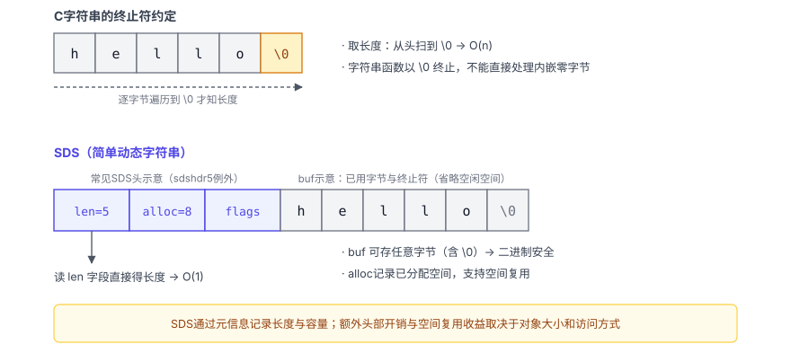
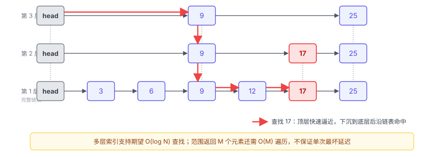
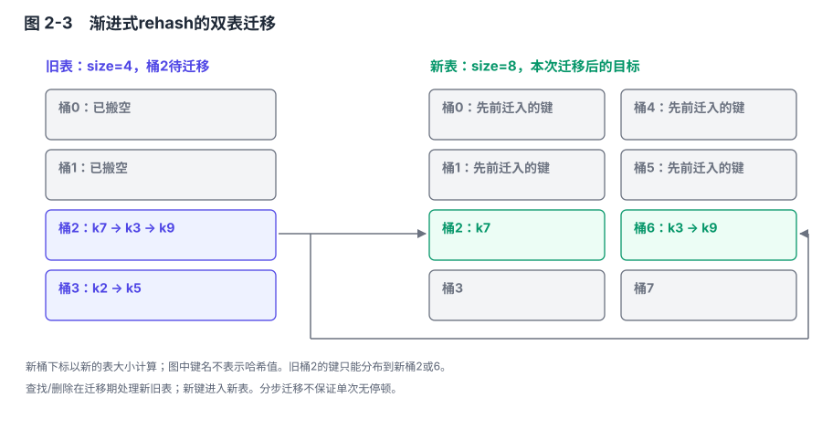
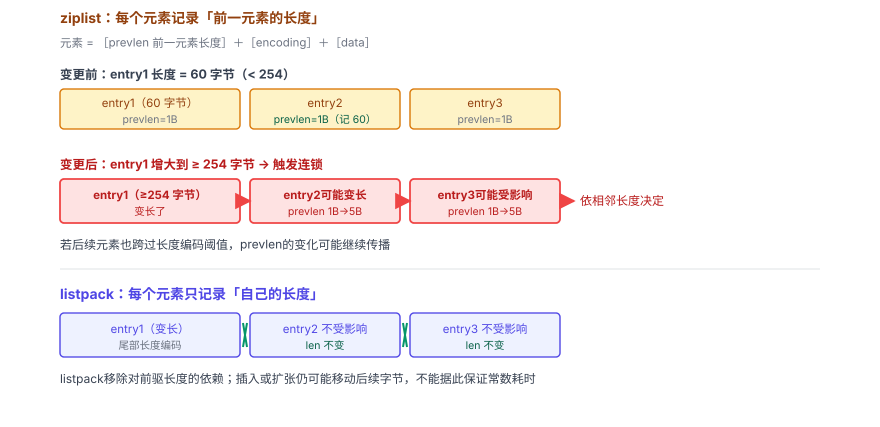
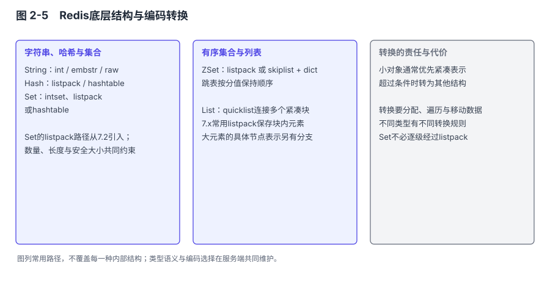
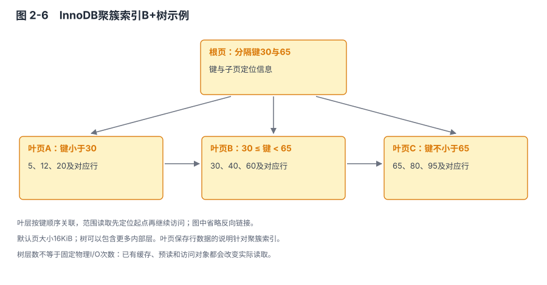
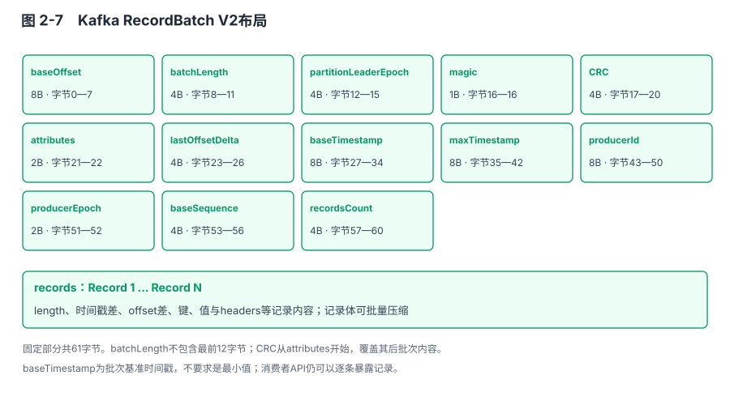
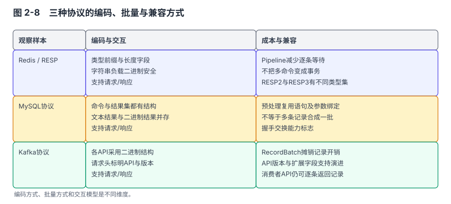

# 第 2 章 数据结构与协议：为各自的目标而设计

## 本章导读

我做过一个排行榜测试。MySQL表没有score索引时，`ORDER BY score DESC LIMIT 100`在数据少的时候很快，增长到数百万行后，查询耗时明显上升。加上适用的索引以后，有序扫描改善了查询。这段经历不能证明数据库不适合排行榜，它首先说明：同一句SQL，执行工作可能从扫描、排序变成沿索引读取。

后来使用Redis有序集合，问题又变成高频更新的成本、按分数读取的代价，以及排行榜是否需要与其他业务状态一起提交。跳表和B+树都能提供有序访问，但所在介质、节点组织和事务要求不同。仅比较复杂度，解释不了一次完整请求。

本章沿两个对象展开：数据在服务端怎样表示，请求在网络中怎样表示。前者决定一次访问需要查找、移动或维护多少内容，后者决定双方怎样划定消息边界、复用工作和处理版本变化。它们有关联，却没有“某种结构必然配某种协议”的一一对应。

## 2.1 先把一次操作拆开

### 2.1.1 相同的数据，可能要求不同的访问

一组用户和分数，可以按用户查分数，也可以取分数最高的一百名，还可以查询分数落在某区间的人。三个请求返回的数据来自同一集合，但需要的组织不同。哈希查找帮助定位成员，有序结构帮助定位范围，范围结果还需要逐个输出。查找起点的成本与返回M个元素的成本应分别计算。

如果分数持续变化，有序结构还要更新位置。如果每次变化都产生一条历史事件，追加日志能够保存过程，但仅凭日志无法直接获得当前完整排名，仍需处理和维护相应状态。这样比较，才能看清Redis有序集合、MySQL索引和Kafka事件记录各自承担了哪部分工作。

操作发生在哪里同样重要。随机访问内存也有缓存未命中和指针跳转成本，并非免费；访问不在缓冲池中的数据库页可能需要存储I/O。数据结构的一个节点是小对象还是整页，会影响一次查找触及多少内存位置、多少页，以及修改以后要维护哪些关系。

### 2.1.2 复杂度没有包含完整的请求时间

O(1)、O(log N)描述的是操作规模增长时某类工作如何变化，不能直接当成延迟等级。读取一个很长的值，即使通过哈希表很快找到它，复制和发送仍与结果大小有关。一次O(N)扫描如果N很小且数据连续，也可能比指针较多的结构更经济。

扩容又增加了另一种区别：平均每次承担多少工作，与最慢一次承担多少工作。预留空间和渐进迁移可以摊薄集中开销，却未必提供严格的单次耗时上限。评价服务端结构时，需要把平均成本、尾部延迟和过渡期占用分开。

协议也要分维度。编码说明一个整数或字符串变成哪些字节；消息边界说明接收多少字节才算一条完整消息；交互方式说明谁先发送、是否等待以及怎样匹配响应；版本规则说明旧客户端遇到新服务端会怎样。文本与二进制属于编码问题，请求/响应属于交互问题，不能放在同一排作为互斥路线。

## 2.2 内部数据结构：访问过程比结构名称更重要

### 2.2.1 Redis字符串：长度、容量与重新分配

Redis内部广泛使用SDS（简单动态字符串，Simple Dynamic String）。它在字节内容之前保存长度等元数据，使字符串不必依靠结尾的零字节确定有效长度。保存一段含有零字节的数据时，显式长度也避免了C字符串终止规则造成的歧义。

常用SDS头保存已用长度`len`、可用容量相关字段`alloc`和类型标记`flags`。不同宽度的头适配不同长度，极短字符串使用的sdshdr5把长度编码在标志字节里，不具有与其他头完全相同的容量字段。对外仍得到一个指向内容的指针，内部操作通过头部取得必要信息。图2-1说明这份元数据放在哪里。


图 2-1　SDS与C字符串的内存布局：SDS显式记录有效长度，示意头部不代表所有头类型具有相同字段。

多保存长度，会增加头部占用，却避免每次计算长度都遍历内容。这一收益适用于反复需要长度的操作；它并没有使字符串搜索、复制或比较也变成O(1)。一个字段解决的是一个具体问题，不能据此把整个字符串实现标成常数时间。

追加内容时，还需要区分长度与容量。已有空闲空间足够，就写入新内容并修改长度；空间不足，才申请扩大的存储。在Redis7.2.5的SDS实现中，允许预分配的扩容路径会在较小容量时按倍数扩展，达到`SDS_MAX_PREALLOC`后改为增加固定余量；同时也存在只分配当前所需空间的路径。这是调用策略，不是每次扩容都无条件翻倍。[SDS实现](https://github.com/redis/redis/blob/7.2.5/src/sds.c)可核对两条路径。

把容量预留给后续追加，可以减少反复重新分配，但空闲容量仍占用内存。缩短内容也不必立即归还全部空间；需要收缩时，相关接口可以调整分配。因此“取长度更快”“减少重新分配”和“实际容量最小”是不同目标，SDS用头部和容量管理明确处理这些目标之间的关系。

### 2.2.2 有序集合：成员定位与顺序访问分别解决

Redis较大的有序集合使用字典配合跳表。字典帮助按成员查找已有分数，跳表按照分数及同分时的成员顺序组织节点。更新一个成员的分数时，要先知道它是否存在，再维护排序关系；只用一种索引很难同时让两类访问都直接。

跳表底层包含完整的有序节点，上层保存较稀疏的前向连接。查找时，从高层向前，遇到再前进就会超过目标的位置时向下一层继续。插入时根据节点随机获得的层数，修改相应前驱的连接。Redis还维护跨度信息，用于计算排名或按名次定位；底层反向连接则服务于逆序遍历。

图2-2以查找17为例。上层连接让查找跳过部分节点，最终仍需要在接近目标的位置确认具体顺序。


图 2-2　跳表的多层索引与查找路径：查找17时逐层缩小候选范围。

在随机层数假设下，跳表查找、插入和删除具有期望O(log N)成本。查询一个范围时，先定位起点，再顺序输出M个结果，成本应写成O(log N+M)，而不是把整个请求都记为O(log N)。这正是开篇排行榜需要区分的两项工作：找到排名起点，与返回一百个成员。

跳表不需要平衡树的旋转过程，但仍有节点、指针和跨度的维护成本。它与红黑树谁更节省缓存访问，取决于节点布局和具体实现，不能由名字作总判断。这里值得观察的是，Redis选择了能够直接表达范围和排名操作的组织，并用另一份字典补足成员查找。

较小的有序集合还可以采用紧凑编码。此时查找可能需要扫描连续内容，但在规模受限时，减少分配和指针开销的收益可能更大。客户端使用的是同一组有序集合命令，因此必须根据实际编码和数据规模理解成本，不能认为每次ZSET操作必定走跳表。

### 2.2.3 字典：迁移状态如何进入正常操作

字典用于Redis键空间，也用于若干对象的内部表示。通过哈希值找到桶，桶内处理冲突，能够在合适负载和分布条件下获得平均常数级的查找。哈希函数、冲突链长度以及键本身的计算成本，仍会影响一次操作。

扩容时，如果一次性迁移所有元素，工作会集中到某个时刻。Redis采用渐进式rehash：先建立新表，在一段过渡期内同时保留旧表和新表，并记录迁移位置。后续部分字典操作及相应维护过程推进迁移。新元素放入新表，查找和删除按照迁移状态检查可能存在元素的位置。

图2-3表现迁移尚未完成时的状态。图中旧表和新表的名字是示意，不要求读者把它们当成某个小版本的结构字段名。


图 2-3　渐进式rehash的双表迁移：过渡期允许元素分布于两张表中。

扩容后，一个旧桶的元素未必仍在同一新桶。需要根据新表大小确定目标位置，随后更新连接并减少旧表中的元素计数。迁移完成后，旧表释放，正常查找改用新表。能够正确处理“尚未迁移”和“已经迁移”的元素，是把工作分步进行的前提。

分步不等于每次没有停顿。一次迁移步骤可能处理一个桶中的多个元素，新表申请也需要资源；实现还要限制扫描空桶的工作，避免空桶过多时一次调用持续过久。Redis7.2.5的`dictRehash`明确包含空桶访问限制，以及迁移桶内全部元素的过程。[字典实现](https://github.com/redis/redis/blob/7.2.5/src/dict.c)支持的是分摊集中工作，不能推出严格的单次延迟保证。

过渡期还会同时占用两份表结构，查找也可能多检查一个位置。这里的设计取舍十分具体：降低一次性迁移的集中成本，增加一段时间的状态管理和资源占用。SDS预留容量与字典渐进迁移都处理增长，但前者先多分配空间，后者让旧新布局并存，不能只用“摊还”两个字略过差别。

### 2.2.4 紧凑编码：减少指针以后，修改怎样进行

listpack把多个条目放在连续内存中，条目按内容选择编码，并保存足够的信息支持向前或向后遍历。没有为每个元素分配独立节点和指针，可以提高小对象的内存密度。代价是中间插入、删除或变长修改可能移动后面的字节；连续布局不会让任意修改变成常数时间。

理解listpack为什么这样安排，需要看一项历史对照。旧ziplist的条目保存前一个条目的长度。前一个条目变长时，后一个条目用于保存前驱长度的字段可能扩展；这一扩展又改变了后一个条目的总长度，使变化继续传播。长度小于254时可用短字段表示，越过边界可能改用更长表示，形成连锁更新。

listpack把用于反向遍历的长度信息放到条目自身尾部，描述本条目，而不依赖前一个条目的长度。一个条目变长，不再迫使后续条目因为“前驱长度字段不够”而逐个扩展。图2-4比较的正是这种依赖关系。


图 2-4　ziplist与listpack的长度依赖：listpack消除前驱长度变化引起的连锁扩展，仍可能移动连续数据。

这里的改善是局部编码不再引用会变化的相邻条目长度，不是所有写入都不再搬动数据。Redis7.x使用listpack实现相关紧凑编码，旧格式出现在本书时属于演化背景。文件中怎样兼容历史格式，第8章另行讨论。

列表还需要避免一块连续存储无限增大。quicklist用链表连接多个紧凑块，Redis7.x的相关块采用listpack。跨块访问需要沿链移动，块内修改则在较小的连续区域内完成。块太小会增加节点和指针开销，块太大又可能增加局部移动与压缩的成本。它是在整体链式结构中保留局部连续布局，并非必须在链表和数组之间二选一。

intset则针对小整数集合：所有元素采用统一宽度，保持有序，查找可以二分。插入超过当前整数宽度范围的值时，需要扩大表示并转换已有元素；有序插入本身仍可能移动数组内容。原有较窄值不会因为新值较宽而丢失，但转换不免费。删除大值以后，也不应假定每次都会立即回到最窄表示。

对象类型相同，具体编码可以变化。Redis7.2增加了集合的listpack编码；intset遇到非整数内容时，能否转成listpack，还受元素数量、元素长度和安全大小检查等条件约束，不是“小于某个数量就一定转换”。超过适用边界会使用哈希表。版本和转换条件可核对[Redis7.2.5集合实现](https://github.com/redis/redis/blob/7.2.5/src/t_set.c)。

图2-5汇总的是不同结构承担的工作，以及小规模对象可能进行的编码转换。


图 2-5　Redis底层结构与编码转换：转换受类型、数量、元素大小和版本条件约束。

结构转换对命令语义可以透明，对延迟和占用却未必透明。一个键跨过转换条件后，数据仍然相同，分配、查找和修改路径已经改变。这也是容量测试不能只使用几个极小键的原因。

### 2.2.5 InnoDB：把有序访问组织成页

InnoDB的常规表和索引以B+树组织，节点对应页。与跳表每个节点保存少量对象不同，一个内部页可以容纳多个分隔键和子页引用。一次取得页后，可以在页内缩小查找范围，再访问目标子页。较高的分支数量使树不必很高，但实际高度取决于键宽、行宽、填充情况和数据量。

聚簇索引叶子页保存行记录，二级索引叶子页则主要包含索引键及用于定位聚簇记录的主键信息。两者不能都画成“叶子保存完整行”。如果查询需要的内容不在二级索引中，定位后可能还要访问聚簇索引；如果满足覆盖条件，则可能减少这一步。索引选择因而与返回哪些列有关。

图2-6画的是聚簇索引的示例树。图中采用默认16KB页作说明，不表示所有InnoDB实例都只能使用这种页大小。


图 2-6　InnoDB聚簇索引B+树示例：内部页帮助定位，叶子页保存记录并支持有序扫描。

按键查找沿树向下；范围查询先定位起点，再沿叶子页顺序访问。树高不等于磁盘I/O次数：根页和内部页可能已经在缓冲池，目标页也可能命中内存。一次查询还可能访问多个索引或返回大量数据，因此“两三次I/O即可查任意数据”并不是由B+树结构保证的。

插入时，目标页可能没有足够空间，需要分裂并调整父层引用。首先改变的是内存中的页和相应恢复记录，脏页何时写回另由存储管理处理，不是每次分裂都立即独立写一次磁盘。分裂还会影响空间利用率和后续扫描的页分布。第4章会接着解释写回与日志先后次序。

行格式决定一条记录在页里怎样表达。DYNAMIC行格式需要记录变长字段长度、NULL信息和列内容，聚簇记录还带有事务及回滚相关信息。较长变长列可以放到页外，行内保留20字节引用；是否外置依赖整行大小、页大小和列内容，不是列被声明为TEXT就必定不在页内。[MySQL8.0行格式说明](https://dev.mysql.com/doc/refman/8.0/en/innodb-row-format.html)给出了这些条件。

页外存储使一个长字段不必占据过多索引页空间，却使读取该字段增加访问步骤。只查询短字段与查询完整大对象，成本可能不同。因此“页尽量装满”也不是唯一目标：保留修改空间、控制长列影响和满足访问需求，都要进入组织过程。精确字段布局留到第8章，本章关注它怎样改变访问。

自适应哈希索引是另一个例子。InnoDB根据观察到的搜索模式，为缓冲池中部分索引内容建立基于键前缀的哈希访问路径；它没有取代B+树，也不是为每一个热点键单独生成一套完整索引。维护和并发访问本身有成本，某些负载可能收益不足。[自适应哈希索引说明](https://dev.mysql.com/doc/refman/8.0/en/innodb-adaptive-hash.html)因此要求结合负载比较其收益。主存储保持有序，热点路径可以另加辅助结构，两者解决的是不同层面的访问问题。

### 2.2.6 Kafka：把重复元数据集中到批次

Kafka日志由记录批次RecordBatch组成，一个批次可以包含一条或多条记录。生产者按分区积累记录，达到大小条件或等待条件后形成可发送批次；一个网络请求又可以携带多个分区的数据。因此批次、请求和日志段是三个不同单位，不能因为都支持批量就混为一谈。

把元数据集中在批次头，能够避免每条记录都重复保存完整的基础信息。记录使用相对批次起点的offset差值和相对基准时间戳的差值，批次级属性说明压缩、事务等状态。小差值配合变长整数可以减少部分编码开销，但具体收益仍取决于内容和数值，不是每条元数据恒定只需几个字节。

表2-1保留V2批次的关键头字段，详细字节边界将在第8章与恢复、兼容一起讨论。

**表 2-1　RecordBatch V2的主要字段与职责**

| 字段 | 作用 |
|---|---|
| `baseOffset`、`batchLength` | 给出批次起点和长度；长度不包含最前面的这两个字段 |
| `partitionLeaderEpoch`、`magic` | 标识相关主节点任期与记录格式版本 |
| `CRC` | 校验规定覆盖范围的批次内容，不是整个请求的校验 |
| `attributes` | 编码压缩、时间戳类型、事务与控制批次等属性 |
| `lastOffsetDelta` | 相对起点的末尾offset差值 |
| `baseTimestamp`、`maxTimestamp` | 记录时间戳编码与范围所需信息 |
| `producerId`、`producerEpoch`、`baseSequence` | 支持幂等生产和事务相关检查的状态 |
| `recordsCount` | 批次内记录数量 |

图2-7展示批次头与记录的关系。


图 2-7　Kafka RecordBatch V2布局：61字节固定部分与其后的记录；CRC覆盖范围按格式定义。

格式的固定部分占61字节，但批次成本不止这61字节。记录还有自己的长度、键值、头信息，压缩和协议封装也要参与计算。一个批次内相似内容可能更容易压缩，不相似或已经压缩的数据则未必获得相同收益。具体字段与校验范围可核对[Kafka3.9消息格式](https://kafka.apache.org/39/implementation/message-format/)。

Broker可以在满足格式和配置条件的路径上保留批量表示，但接收过程仍需要校验，并可能涉及压缩或格式相关处理。批次并不都原样落盘，单条记录也可能需要检查。同样，消费者API最终可以向应用逐条提供记录，线上传输的批次边界不等于应用只能一次处理完整批次。

日志索引提供从offset到附近文件位置的定位，之后再扫描找到相应记录；它不是按任意业务字段建立的数据库索引。若业务需要按用户查询历史记录，需要另外组织状态或索引。Kafka保留了顺序日志这一主要访问路径，也把任意字段查询的工作留给了其他处理环节。

## 2.3 通信协议：编码、边界与交互分别比较

### 2.3.1 RESP：可读控制信息与二进制安全内容并存

RESP（Redis序列化协议，Redis Serialization Protocol）通过类型前缀和长度等信息表示数据。客户端通常把命令及参数编码成字符串数组，服务端返回相应类型。普通命令采用请求/响应，Pipeline允许连续发送多个请求再接收响应，订阅与RESP3 Push等机制还包含主动推送。因此请求/响应并不是Kafka独有的属性。

RESP2的常见前缀包括简单字符串`+`、错误`-`、整数`:`、批量字符串`$`和数组`*`。下面用可见转义表示`SET key value`请求的字节，`\r\n`表示回车与换行，不是要把反斜杠字符直接发给服务端。

```text
*3\r\n$3\r\nSET\r\n$3\r\nkey\r\n$5\r\nvalue\r\n
```

`*3`声明三个数组元素，每个`$`之后给出内容的字节长度。接收方知道有效载荷应读多少字节，因此值可以包含零字节或换行，不依赖“看到换行就结束整个值”。RESP具有ASCII控制表示，不应简写成只能发送可打印内容的纯文本协议。

长度前缀还要求解析器处理分包。一次网络读取可能只收到半个长度字段，也可能收到几条完整请求及下一条的一部分。解析状态需要保留，直到取得声明的内容和结束标记。协议容易辨读，可以帮助调试，却不能消除边界检查、长度限制和错误处理。

Pipeline主要减少逐请求等待的网络往返，命令仍独立编码和执行。它不是事务，也不保证多条命令要么全部成功、要么全部失败；发送很多请求还可能积累客户端与服务端缓冲。减少往返和减少服务端计算是不同目标。

Redis6.0引入RESP3与`HELLO`协商。7.x客户端可以使用RESP2，也可以协商RESP3；Map、Set、Boolean和Push等类型使一些返回值更精确。譬如哈希内容不再只能依靠命令上下文解释一串扁平数组。切换协议需要客户端正确处理返回类型，不能只认为“换了版本号，应用不受影响”。这些行为见[RESP规范](https://redis.io/docs/latest/develop/reference/protocol-spec/)。

### 2.3.2 MySQL：握手能力、SQL与结果编码不是同一层

MySQL经典协议先进行连接握手与认证，再进入命令阶段。能力标志帮助双方约定支持的特性，认证过程由插件及连接条件决定；认证响应并不都采用“把密码加密后传回”的方式。TLS提供的传输保护与认证响应怎样计算，也属于不同机制，第6章会进一步说明。

协议包有长度和序号等边界信息，负载中还可以有定长整数、长度编码整数和长度编码字符串。长度编码整数用不同前缀区分后续宽度，某些标记还具有NULL等专门含义。它们解决如何解析字段的问题，并不意味着所有结果列都以最紧凑的二进制数值发送。

普通`COM_QUERY`对应的文本结果集，与预处理语句使用的二进制结果集需要分开。文本结果集中，行的列值主要以长度编码字符串等方式传递；二进制结果集结合NULL位图和字段类型使用相应编码。MySQL官方分别定义[文本结果集](https://dev.mysql.com/doc/dev/mysql-server/latest/page_protocol_com_query_response_text_resultset.html)与[二进制结果集](https://dev.mysql.com/doc/dev/mysql-server/latest/page_protocol_binary_resultset.html)。

这使“二进制一定更小”也成为需要条件的判断。一个小整数的十进制文本可能很短，一个较大的整数可能用定长二进制更紧凑；字符串还需要长度与内容。比较应该以实际列类型和结果分布计算，而不是仅看协议类别。

预处理语句则复用另一类工作。客户端发送带占位符的SQL，服务端返回语句标识；随后执行可以携带标识和参数。这里示意的是协议过程，不是可直接输入mysql客户端的命令。

```text
COM_STMT_PREPARE  "SELECT score FROM ranking WHERE user_id = ?"
服务端返回 statement_id 及参数、结果元信息
COM_STMT_EXECUTE  statement_id + 参数类型与参数值
```

复用语句表示可以减少反复发送和解析相同SQL结构的部分工作，参数传递也有明确类型。它不意味着执行计划永不调整、元数据变化不再检查，更不意味着多次执行天然合成一个批次。Pipeline节省等待往返，预处理复用语句，批量INSERT把多行纳入一个语句，它们优化的工作不同，可以同时存在。

### 2.3.3 Kafka：每类API的版本与批量边界

Kafka经典请求头包含API标识、API版本和用于匹配响应的`correlation_id`，常用头版本还包含`client_id`。这里的`client_id`用于识别客户端请求来源，不等于经过认证的用户身份。请求体按API及版本解释，例如Produce、Fetch与Metadata具有不同字段。

头部也存在版本。支持灵活版本的头可以包含tagged fields，不应把所有请求说成完全相同的固定四字段格式。客户端通过ApiVersions了解Broker支持范围，再选择双方共同支持的API版本；若不存在共同版本，就应处理不兼容，而不是仅凭文件里有一个版本字段就自动兼容。具体规则见[Kafka3.9协议](https://kafka.apache.org/39/design/protocol/)。

版本号解决的是按哪种结构解析。仅凭版本号不能确定未知字段是否可以忽略、字段含义是否变化，以及旧客户端是否能理解新行为。可选扩展可以降低升级联动，改变核心语义仍可能要求显式版本升级和调用者适配。

Produce请求可以包含多个分区的数据，每个分区部分携带记录批次。Fetch请求给出要读取的分区和起点等条件，返回相应记录内容。一次请求能带多条记录，不等于协议不允许单条记录；在低流量下，批次可能很小，等待凑批与立即发送之间仍有代价。

传输也不保证每次都采用相同的零拷贝路径。加密、解压、格式转换或其他处理会改变数据是否需要进入用户态。协议布局提供了批量传递的条件，具体实现能否避免额外复制，需要结合配置与路径判断。第4章会从页缓存和I/O再解释这一点。

图2-8按相同维度对比三者。编码方式、批量形式与兼容规则各有自己的位置。


图 2-8　三种协议的编码、批量与兼容方式：RESP、MySQL经典协议与Kafka协议都不能由单一标签概括。

消息边界和请求关联信息解决解析与匹配，不能证明业务执行成功。连接断开以后，客户端可能不知道最后一个请求是否已经执行。协议有响应，并不消除响应丢失后的业务重试问题；这个边界在第10章会重新出现。

## 2.4 横向对比：优化的是哪部分工作

**表 2-2　数据表示与协议的共同问题**

| 问题 | Redis | MySQL/InnoDB | Kafka |
|---|---|---|---|
| 怎样快速定位 | 字典、跳表或小对象扫描 | B+树，部分访问可用辅助哈希 | 按分区offset定位到日志附近 |
| 怎样连续访问 | 有序集合底层遍历、紧凑块 | 叶子页和页内记录顺序 | 批次与日志段顺序读取 |
| 小对象怎样减少开销 | SDS小头、listpack、intset | 行格式、页内记录组织 | 批次共享头、差值编码 |
| 增长与修改的成本 | 编码转换、rehash、连续数据移动 | 页修改、分裂、索引维护 | 新批次追加及后续保留清理 |
| 怎样减少重复交互 | Pipeline连续发送独立命令 | 预处理复用语句；可另用多行语句 | 按分区积累批次，请求承载多个批次 |
| 返回值怎样编码 | 有类型前缀与长度，内容二进制安全 | 文本/二进制结果集按命令路径区分 | API定义的二进制字段与记录批次 |
| 兼容如何表达 | HELLO选择RESP版本，命令返回类型约定 | 握手能力、协议及认证插件约定 | ApiVersions、每API版本和扩展字段 |

三者都在减少重复工作，但减少的位置不同。保存长度避免重复扫描，辅助索引避免重复走某段查找路径，批次避免每条记录重复保存相同元数据。采用其中一种办法，还需要支付维护这份额外状态的代价。结构越复杂不一定越好，状态维护与实际访问是否匹配才决定收益。

## 2.5 把开篇排行榜再检查一次

先只比较“读取前一百名”这个操作。没有适用索引的SQL可能扫描并排序，有序索引可能使它沿序读取；Redis有序集合也可以先定位再返回结果。这一层比较需要确认执行计划、集合编码和返回数量，不必先给数据库或缓存排快慢。

然后增加“分数频繁变化”。数据库要维护有关索引，Redis也要维护成员查找与顺序关系；两边都不是仅改一个整数即可。再增加“分数与付款状态一起生效”，事务和跨系统写入开始影响选择。如果Redis里的排名是从已提交业务记录派生，还需要定义刷新延迟与重建过程。这时Redis仍可能适合，但理由已经从“跳表复杂度低”扩大到了完整的状态职责。

下面的SQL只展示如何检查索引是否帮助这类查询，假定存在测试表`ranking(user_id, score)`及适用索引；`EXPLAIN`查看计划，不执行负载基准。

```sql
EXPLAIN SELECT user_id, score
FROM ranking
ORDER BY score DESC
LIMIT 100;
```

计划中的访问路径与排序信息比SQL外形更能说明工作量。实际耗时还受缓冲池、并发更新、数据分布等影响。这段检查不能证明生产性能，也不能决定是否迁移到另一个系统；它只检验“现有索引是否可能支持本次有序访问”这一命题。

如果通过补一个索引即可满足要求，引入第二个状态系统可能不值得；如果高频排名和业务事务能够清楚分离，采用派生排名又可能降低热点查询压力。两种选择都需要证据。开篇那次测试告诉我的首先是要检查实际访问过程，而不是把一次对比变成产品结论。

## 2.6 架构启示：明确改变了什么成本

### 2.6.1 结构选择与具体操作

决定表示之前，我会先列出最常发生的访问及其返回规模，再看修改会维护哪些状态。一个只有“查找快”的说明不足以支持排行榜，一个只有“追加快”的说明也不足以支持当前状态查询。字典加跳表、B+树加辅助哈希表明，同一份数据可以有多个访问路径；增加路径以后，写入要处理各路径的一致性，恢复还要区分哪些索引直接加载、哪些可以重新生成。

我也不会把平均复杂度当成延迟承诺。渐进rehash已经减少集中迁移，但一次桶迁移的工作与分配成本仍然存在。对尾部延迟敏感的接口，需要观察转换、扩容和返回大结果时的行为，而不能只测已经稳定的小集合。

### 2.6.2 小对象策略要连同转换过程一起评价

紧凑编码为小数据节省空间，但其价值依赖规模约束。应用中的键可能缓慢增长，也可能一次写入大量元素。若只比较转换前的占用，就遗漏了转换时的临时内存、复制成本和转换后的长期占用。

这一点也适用于自己设计的数据结构。可以先采用紧凑布局，但需要说明何时改变表示、过渡期谁负责解释旧新结构、失败后如何恢复。Redis的编码切换和字典双表迁移提供了具体例子，不意味着所有结构都应该自动升级。

### 2.6.3 协议简单，应体现为责任明确

我自己设计新协议，会提前写出第二个版本要怎样出现。若改变返回类型，旧客户端如何辨别；若增加可选字段，无法识别它的解析器如何继续；若连接中断，调用者怎样判断能否重试。这些行为比“头部里预留一个版本号”更接近兼容设计。

协议易读有帮助，能够直接看见控制字段可以降低部分排障成本；二进制字段也能借助工具检查。客户端实现是否可靠，还取决于分包、错误、认证、超时和资源限制。不能用几行示例代码或一个下午的开发时间，替代对这些职责的评价。

## 2.7 小结

数据结构的收益落在具体操作上，查找、输出、修改和转换的成本需要分别说明。SDS、渐进rehash、紧凑编码、B+树和RecordBatch都减少了某类重复工作，同时增加了相应的状态或限制。协议比较应分开编码、消息边界、交互与兼容，不能用三个不同维度的标签代替分析。下一章把对象从一条数据扩展到整个进程：这些结构和外部接口按什么顺序准备好，才可以接受业务请求。
