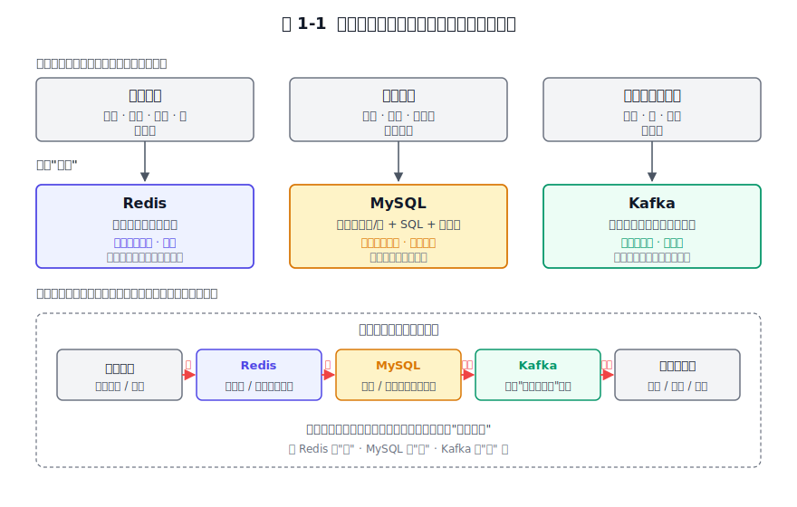
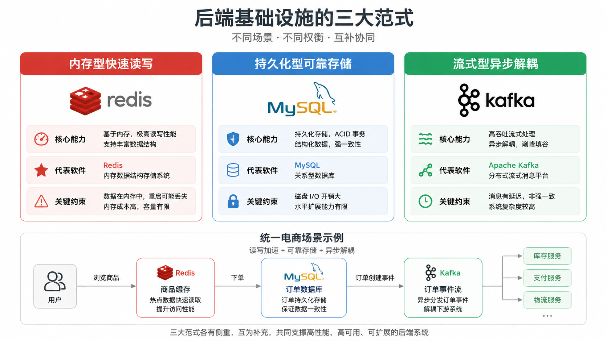
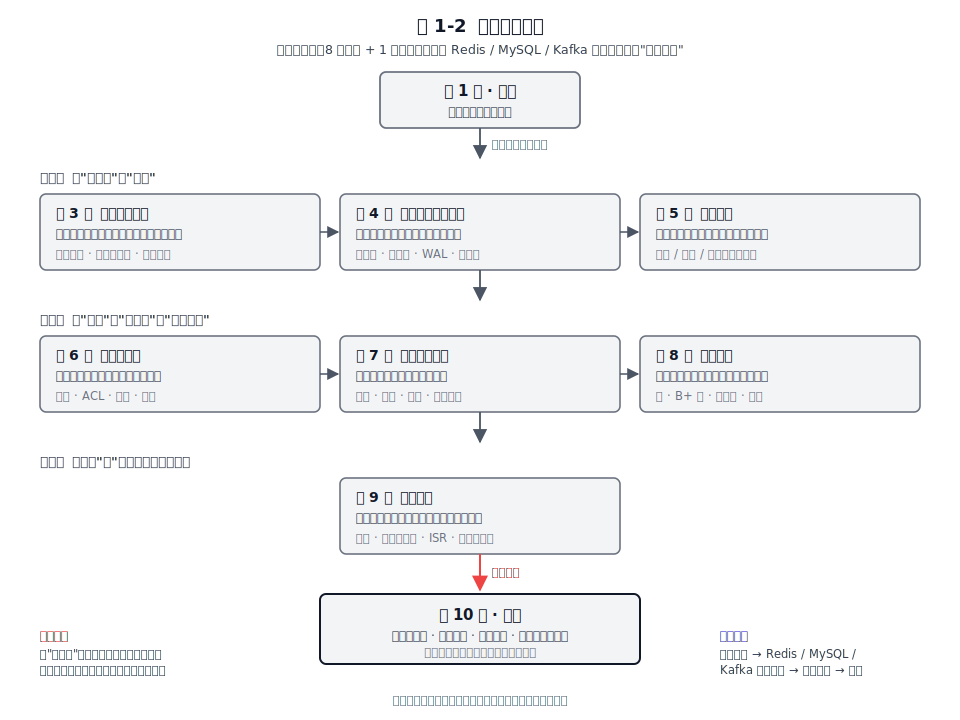
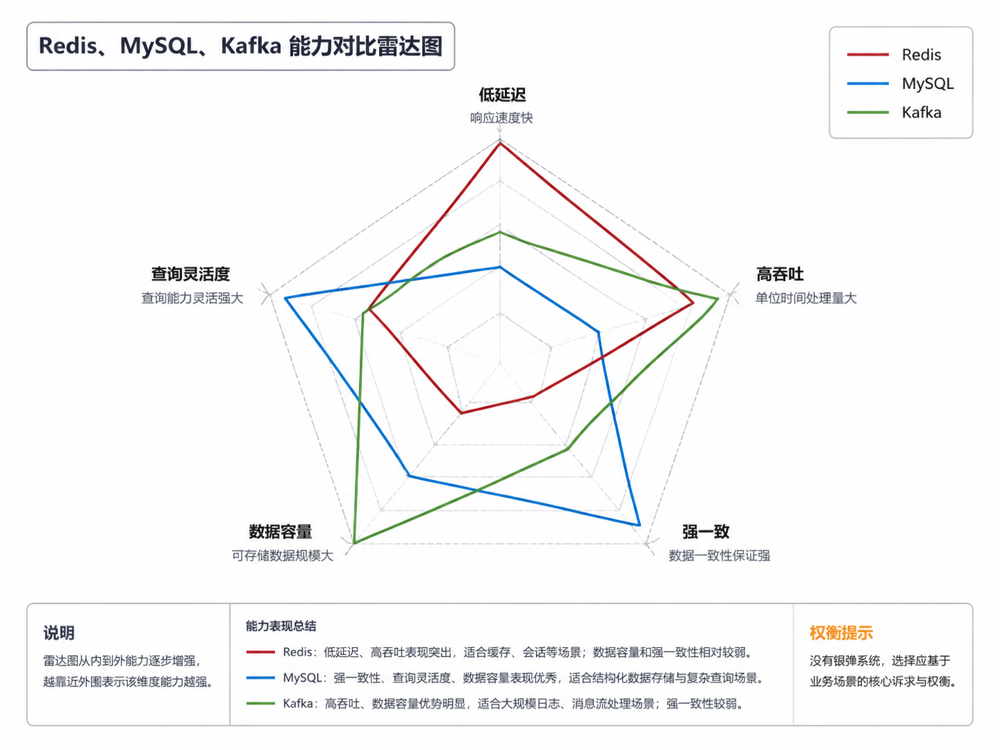
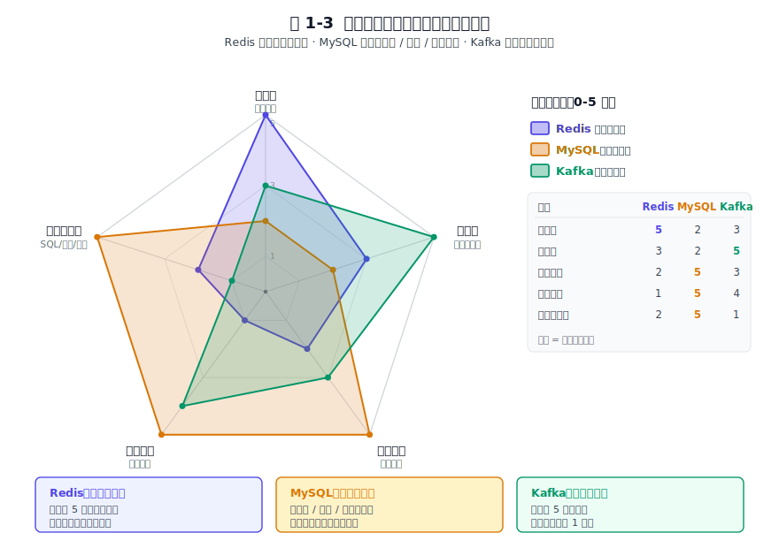

# 第 1 章 引言 — 为什么是这三个软件

## 本章导读

我面试过数百名高级开发和架构师候选人，在面试中，我发现大多数后端开发者都能熟练使用 Redis、MySQL 和 Kafka。但当问题从"怎么用"换成"底层实现"和“为何如此设计”，比如：Redis为什么采用单线程执行命令、MySQL为什么用B+树、Kafka为什么只追加不能修改，这些问题很多人都答不清楚。在面试一些架构师岗位时，无论是谈及对某个优秀软件的了解还是谈自己的架构设计思路，很少有人提及“取舍”和“平衡”，而本书就是为此而写的。这一章先回答三个问题：为什么选这三个软件、它们各自是什么样、以及"架构视角"和"使用视角"看到的到底有什么不同。

## 1.1 为什么是这三个软件

我认为这三个软件恰好覆盖了后端基础设施最核心的三种范式，且各自把一种设计取向做到了其他系统很少触及的深度。放在一起，能看清取舍的全貌。而且这三个软件也已经被大家所熟悉，有利于本书核心价值的传递。

### 1.1.1 后端基础设施的三种核心范式

绝大多数后端系统，拆到最底层，都绕不开三类基础能力。

第一类是**快速读写**。缓存热点数据、维护计数器、存放会话、做分布式锁，这些场景的共同诉求是低延迟、高并发，而对持久化的要求往往是"尽力而为"或"可以重建"。这类能力的核心要求是低延迟。

第二类是**可靠存储**。订单、账户、交易记录，这些数据一旦写下去就不容丢失、不容错乱，还要支持复杂查询和事务。这类能力的核心约束是一致性与持久性。

第三类是**异步解耦与流转**。系统之间的通知、事件的分发、日志的汇聚、数据的搬运，都需要一个中间介质把生产者和消费者解耦。这类能力的核心约束是吞吐与可扩展。

这三类能力是互补的，各管一块。一个典型的电商订单系统常常会同时用到三者，比如Redis来保存购物车与库存计数、MySQL保存订单与账户、Kafka把"订单已创建"这个事件广播给履约、推荐、风控等下游。

我们给三类能力各指定一个代表：内存 → Redis；磁盘数据库 → MySQL；消息与流 → Kafka。下图把这种对应关系固定下来。

*图 1-1 后端基础设施的三种核心范式与代表软件 GPT 生成版*
*图 1-1：后端基础设施的三种核心范式与代表软件。内存型 / 持久化型 / 流式型三类能力分别由 Redis、MySQL、Kafka 承担。*

### 1.1.2 为什么是这三个软件

三种范式各有不少候选实现，但能同时满足"成熟、典型且有代表性"的并不多。Redis、MySQL、Kafka 恰好各居其一。

在内存数据结构存储领域，**Redis** 是最广泛使用的实现之一。它的独到之处在于提出了"数据结构服务器（data structure server）"这一抽象：它对外暴露结构化类型（字符串、哈希、列表、集合、有序集合、Stream 等），命令直接在结构上做原子操作。这一抽象让它能同时充当缓存、排行榜、消息队列、锁服务等多种角色，用一套原语统一了丰富的使用场景。

**MySQL** 是全球使用最广的开源关系型数据库之一。它的 InnoDB 引擎几乎成了关系型存储的教科书实现：事务、多版本并发控制（MVCC，Multi-Version Concurrency Control）、B+ 树聚簇索引、预写日志（WAL，Write-Ahead Log）。更难得的是它的演化史几乎就是一部关系库架构演进史，从早期的 MyISAM 到 InnoDB 默认化，再到组复制（MGR，MySQL Group Replication），每一步都是为应对真实需求而做的迭代。顺着这条演化线看下来，关系库在"怎么把数据存对"上反复权衡的脉络也就清楚了。

**Kafka** 从 LinkedIn 内部的日志采集系统起步，逐步演化为一个分布式流平台。几台普通服务器组成的小集群就能撑起百万级每秒写入：LinkedIn 公开基准里 3 台廉价机曾测到约 200 万次写入/秒（TPS，Transactions Per Second；该基准来自 2014 年 LinkedIn 工程博客，Kafka 0.8.1, 100 字节消息，作为历史参考；3.x 在同类硬件上吞吐通常更高）。它"日志即核心"的设计哲学，把整个系统构建在追加写日志之上，影响了后面的 Pulsar、各种事件溯源（Event Sourcing）方案和 CDC（Change Data Capture）管道等一大批系统。

三种范式最终落到这三个软件上，因为它们各自在一条设计取向上走得足够远。Redis 把"快"和"简单"顶到底，代价是容量受内存约束；MySQL一直把"对"排在"快"前面，宁可慢也不丢不错；Kafka 则用顺序写换吞吐，把"多"和"广"做到了极致。

### 1.1.3 从它们身上能学到什么

如果只用一句话概括这三个软件各自的强项：Redis 的强项是极简与单点性能，MySQL 在严谨与一致性上最较真，Kafka 则以吞吐和可扩展立身。

但面对架构难题，它们采用的方案不同，代价也不同。并发怎么控、数据怎么不丢、副本怎么同步、系统怎么扩展，这些是后端系统普遍会面对的问题。后面 8 章的主题式深讲贯穿全书。

这三个软件最核心的设计，集中在这几条上：
- **Redis**：用"内存 + 单线程命令执行"换极简与低延迟，代价是数据量受物理内存约束、复杂聚合让位给网络往返。
- **MySQL**：用"B+ 树 + 预写日志 + MVCC"换强一致与通用查询，代价是写放大、事务开销和调优门槛。
- **Kafka**：用"追加写日志 + 顺序 I/O + 分区并行"换极致吞吐与线性扩展，代价是延迟偏高、不适合随机查询。
这三组设计就是本书的主线，后面每章都是它们在不同问题上的展开。

## 1.2 这三个软件速写

先给这三个软件各写一段设计概览，涵盖出身、核心抽象、设计哲学、典型场景、一句话定位，最追求什么，舍弃什么，为后文所有的取舍分析定调。

### 1.2.1 Redis：内存即数据

Redis 的起点很朴素。2009 年，意大利开发者 Salvatore Sanfilippo在为自己的实时 Web 分析项目找一个能扛住高频访问统计的数据存储时，发现市面上的工具要么不够快、要么能力太单薄，于是干脆自己写了一个。Redis 就是这么一步步为解决一个真实问题做出来的。

Redis 最有价值的贡献，是提出了**数据结构服务器**这一核心抽象。传统缓存如 Memcached 对外只暴露扁平的字符串键值，复杂操作要靠客户端读出来、改完再塞回去。Redis 则走了相反的路：把字符串、哈希、列表、集合、有序集合、Stream 等结构化类型直接作为一等公民对外暴露，每条命令都是在某个结构上做一次原子操作。比如对有序集合做 `ZADD` 和 `ZRANGEBYSCORE`，对列表做 `LPUSH` 和 `BRPOP`。这套抽象的好处是：一套原语就能同时覆盖缓存、排行榜、消息队列、计数器、分布式锁这些角色，省去了在每个场景各搭一套轮子的麻烦。

Redis 把全部数据放在内存中，命令执行在很长一段历史里都是单线程的（自 6.0 起引入了可选的多线程 I/O 来加速网络读写，但命令执行仍是单线程）。持久化靠 RDB 快照与 AOF（Append-Only File，仅追加文件）两种方式互补。网络层采用事件驱动模型。这些选择都围绕同一个目标：**用最少的机制，把延迟压到最低、实现做到最简**。

这种选择的代价：数据量受物理内存约束，若把 Redis 当成 MySQL 用很快就会碰到内存上限。CPU 单核吞吐有上限，对一个键做重计算会卡住后面所有命令。复杂聚合与多表关联不是它的强项，要做就得把数据拉回应用层处理。这些短板的成因是明确的：这些场景该交给别的系统，它的设计定位就在这个子集里。

典型场景因此也高度集中在它的核心优势领域：缓存、分布式锁、计数器、排行榜、会话存储、轻量级消息。这些场景的共同点是访问频繁、结构清晰、对延迟敏感。

一句话定位：**Redis 是为"快"和"简单"两个目标设计的内存数据结构存储。**

### 1.2.2 MySQL：以"不丢、不错"为第一优先级的关系库

MySQL的发展历史是一部商业与工程交织的演化史。它 1995 年起源于瑞典 MySQL AB，2008 年被 Sun Microsystems 收购，2010 年随 Sun 被 Oracle 收购后正式归入 Oracle 旗下。这条路径并不平坦：它经历过商业化收购的震荡、催生了 MariaDB 这样的分支分叉，也经历了存储引擎从 MyISAM 到 InnoDB 默认化的更迭。但至今它仍是 Web 应用最常用的关系型数据库之一，原因在于它把一件最难的事做得足够稳，即**保证数据不丢、不错**。

MySQL 的核心抽象是**关系（表与行）+ SQL + 可插拔存储引擎**。上层是统一的 SQL 接口与基于成本的查询优化器，对应用屏蔽底层差异；下层是 InnoDB 等可替换的引擎，负责真正的存取。这种分层让 MySQL 既能提供标准化的访问方式，又能在存储层做差异化取舍。InnoDB 是默认引擎，本书讨论 MySQL 时以它为主，它把数据组织成**页（page，默认 16KB）**，以 B+ 树聚簇索引为中心来管理整张表。

支撑 MySQL 设计哲学的是一整套为正确性服务的机制。InnoDB 提供完整的 ACID（原子性、一致性、隔离性、持久性）事务、靠 MVCC 实现的非阻塞读、行级锁；它维护着三套日志：重做日志（redo log）记录物理修改、回滚日志（undo log）支撑回滚与 MVCC、二进制日志（binlog）用于复制与时间点恢复；查询靠基于成本的优化器自动选择执行计划；数据访问先经过缓冲池（Buffer Pool），把热点页留在内存里减少磁盘随机 I/O。这些机制的核心目的是让数据在并发和故障面前都对得上。

代价当然存在。为保证持久性，事务提交要做日志落盘（fsync）；为保证一致性，写操作伴随 redo 与 binlog 的两阶段提交开销；为支持 MVCC，旧版本数据要靠 undo 链维护，长事务会拖累性能；调优门槛高，缓冲池、刷新策略、隔离级别都需要根据负载仔细配置。此外，单机扩展有天花板，纵向加内存加 CPU 容易，横向分库分表则代价不菲。它的优先级一直是"对"排在"快"前面：可以慢，但不能错。

典型场景因此集中在核心业务：交易系统、订单与账户、任何需要强一致与复杂查询的主数据存储。这些场景的共同点是数据价值高、查询模式复杂、容错空间小。

一句话定位：**MySQL 是事务关系型数据库领域应用最广泛的存储方案。**

### 1.2.3 Kafka：以"日志"为核心抽象的流平台

Kafka 的出身决定了它的一切。2010 年前后，LinkedIn 内部需要把海量的活动日志（用户行为、监控指标、审计流水）从各处采集出来，分发给下游的分析与处理系统。传统的企业级消息队列在那个规模下要么吞吐不够、要么运维太重。于是 LinkedIn 自己写了一套以"日志"为核心的系统，2011 年捐给 Apache，逐步演化为今天功能完备的分布式流平台。

Kafka 最核心的抽象，是**追加写日志（append-only log）**。一个主题（Topic）被切成多个分区（partition），每个分区本质上就是一条只追加、按偏移量（offset）寻址的有序日志。生产者只往尾部追加，消费者各自维护自己的偏移量向前读。这种"只追加、不修改、按偏移量定位"的模型看着朴素，但消息队列、事件流、数据管道、流处理都能用它实现。因为这些形态要的都是同一件事：有序事件的持续流转。

把日志抽象推到工业级，Kafka 依赖的是一组为吞吐而生的机制。分区水平扩展，吞吐随节点数线性增长；磁盘 I/O 走顺序写，配合操作系统的页缓存（PageCache）与零拷贝（sendfile）把单机吞吐压到极限。可靠性靠副本（replica）与 ISR（In-Sync Replicas，同步副本集合）保障，只有落在 ISR 中的副本才算"安全"。

只追加不修改的代价同样明显，随机查询就不是它的强项；批量与顺序优先，单条消息的延迟天然高于内存型系统；消息默认按时间或大小保留，删除与更新要靠压实（compaction）这种迂回方式实现。这些约束在 Kafka 中被视为合理代价，它优先保证吞吐与可扩展。

所以 Kafka 用得最多的是高吞吐的流转场景：日志与事件采集、异步解耦、流处理管道、数据同步（CDC 的下游消费端）。这些场景都是数据量大、生产消费要解耦、能容忍一点延迟。

一句话定位：**Kafka 是建立在日志抽象之上的高吞吐分布式流平台。**

### 1.2.4 三个软件速写小结

把这三段概览并排放进一张表，差异在六个维度上就清楚了。

**表 1-1 三个软件设计概览对比**

| 维度 | Redis | MySQL | Kafka |
|------|-------|-------|-------|
| 出身 | 2009，antirez 个人项目，为解决真实访问统计问题而生 | 1995，MySQL AB，经 Sun 入 Oracle，关系库常青树 | 2010，LinkedIn 内部日志系统，2011 捐 Apache |
| 核心抽象 | 数据结构服务器（结构化类型 + 原子命令） | 关系 + SQL + 可插拔存储引擎（InnoDB 为默认） | 追加写日志（分区 + 偏移量） |
| 设计哲学 / 核心追求 | 快与简单（低延迟、实现极简） | 不丢、不错（强一致与持久性） | 吞吐与可扩展（线性扩容、高 TPS） |
| 关键取舍 / 可舍弃 | 内存容量与复杂聚合 | 极致写性能 | 低延迟与灵活查询 |
| 性能取向 | 低延迟 | 稳定事务语义 | 高吞吐 |
| 典型场景 | 缓存、锁、计数器、排行榜、会话 | 交易、订单、账户、核心业务库 | 日志采集、异步解耦、流处理、CDC |

*表 1-1：三个软件设计概览对比。三栏顺序固定为 Redis | MySQL | Kafka。*

把这种"追求的东西不同"画成一张雷达图。把低延迟、高吞吐、强一致、数据容量、查询灵活度五个维度摊开，三个软件的轮廓各不相同。Redis 在低延迟维度突出，MySQL 在强一致与查询灵活两个维度较强，Kafka 在高吞吐维度领先。没有谁能占满五个角，每一款的强项恰好是另一款的弱项。

*图 1-2 三个软件在五个维度上的定位雷达 GPT 生成版*
## 1.3 架构视角 vs 使用视角

同一个系统，从使用视角和架构视角去看，关注的是完全不同的内容。我们研究学习的核心方法是反复追问"为什么这样设计 / 反过来会怎样"，把视线从配置参数移到设计决策。

### 1.3.1 两种视角看到的同一个系统

面对同一个问题："Redis 是单线程的"，使用者关心的是"我要避免在一个命令里跑 `KEYS *`，避免在大集合上做重计算，否则会卡住整个实例"。架构师追问的是：**单线程反而更快的原因、多线程 I/O 的嵌入方式、这套设计在什么规模下开始吃亏、以及换成多线程执行需要付出的代价。**

这两种视角的差别，在于使用者盯的是"怎么配"，架构师盯的是"为什么这么选"。下面这张对照表把同一个系统在两种视角下关注的东西并排列出来。

**表 1-2 使用视角 vs 架构视角对照**

| 关注维度 | 使用视角（怎么做） | 架构视角（为什么这么做） |
|---------|-------------------|------------------------|
| 提问方式 | 怎么配？怎么调？踩过哪些坑？ | 为什么这么选？反过来会怎样？边界在哪？ |
| Redis 单线程 | 避免 `KEYS`、避免重计算、压到多少 QPS | 单线程为何反而快？多线程 I/O 如何嵌入？瓶颈何时出现？ |
| MySQL 日志 | 开 binlog、设 sync_binlog、配主从 | redo 与 binlog 为何要两阶段提交？日志即数据的边界在哪？ |
| Kafka 副本 | 设 acks=all、min.insync.replicas=2 | ISR 为何要"动态收缩"？主副本切换与一致性如何兼顾？ |
| 知识形态 | 配方、参数、最佳实践 | 取舍、约束、演化逻辑、可迁移的设计思想 |
| 终极目标 | 把现有系统用好、用稳 | 理解设计决策，并在自己的系统里做对取舍 |

*表 1-2：使用视角 vs 架构视角对照。同一个系统，在两种视角下关注的东西。*

两边回答的是不同的问题。使用视角问"怎么做"，架构视角问"为什么这么做、反过来会怎样、这套思想能否迁移到我自己设计的系统"。两者不可互相替代：使用视角回答"怎么做"，架构视角回答"为什么这么做"——两者互补。本书要给你的，就是架构视角。

### 1.3.2 架构视角的三把钥匙

架构视角落到实处，有三把可以反复使用的"钥匙"。

**第一把：看约束。** 任何设计都是在特定约束下的取舍。要理解一个决策，先还原它面对的约束：目标场景是什么、性能要求多高、可靠性要求多严、维护成本能不能承受。Redis 选择单线程命令执行，背后的约束是"内存访问远快于网络往返，CPU 不是瓶颈，单线程能省掉所有锁的开销"；MySQL 选择 B+ 树而不是哈希索引作为主索引，背后的约束是"要支持范围查询和排序，磁盘随机访问昂贵，需要一种能批量读相邻键的结构"。脱离约束谈设计好坏，没什么意义；同一个选择换个约束，可能就成了灾难。

**第二把：看演化。** 架构是需求逼出来的。Redis 从单机到哨兵（Sentinel）再到 Cluster，是因为单机扛不住可用性与扩展性的双重压力；MySQL 从 MyISAM 到 InnoDB 默认化再到 MGR，是因为业务对事务与高可用的要求不断抬高；Kafka 从依赖外部 ZooKeeper 到内置 KRaft，是因为外部元数据依赖在大规模部署下成了运维负担与单点风险。理解"为什么变"，关键是看到约束在变，设计就得跟着变。今天看起来"不合理"的旧设计，往往只是被新约束淘汰了而已。

**第三把：看抽象。** 架构师需要抽象出问题的本质。Redis暴露的是数据结构，MySQL暴露的是页与索引，Kafka暴露的是日志的追加，三种抽象把各自的复杂问题都简化成了少数几个原语。**抽象的选择在很大程度上决定了方案能否顺畅推进。** 后面每一章都会回到这条主线，抽象能力是架构师的核心能力之一。

三把钥匙合在一起，就是架构视角的完整方法论：先看约束还原决策的上下文，再看演化理解决策的来龙去脉，再看抽象判断决策是否抓住了问题本质。本书每一章都会反复用到这三把钥匙。

### 1.3.3 一个贯穿全书的例子

一个后端最经典的问题：保存数据怎么保证不丢？

架构视角需要把这个问题拆成三个层次的追问。
**第一，先写日志还是先改数据？** 可靠存储系统的常见做法是先写日志（WAL）。原因是日志是顺序写，恢复时按顺序重放，比直接改散落各处的数据页快得多、也安全得多。
**第二，日志落盘的粒度多细？** 是每条命令落盘、每秒落盘，还是交给操作系统决定何时刷盘？粒度越细越安全，但吞吐代价越大。
**第三，日志记的到底是什么？** 这三个软件在这里分歧最大：记"做了什么操作"（逻辑日志），还是记"哪个字节改成什么样"（物理日志）？

逻辑日志紧凑、跨版本友好，但重放时要重新执行操作，速度慢且要小心幂等；物理日志啰嗦、占空间，但重放就是机械地改页，又快又稳。三者各选了一套方案。
**Redis** 走 AOF 命令日志，即逻辑日志，记的是"做了什么命令"，重放即重新执行命令。
**MySQL** 走 redo 日志加两阶段提交，redo 记的是"页上哪个字节改成什么样"（严格说是物理到页、逻辑到操作的混合日志，详见第 8 章），恢复时机械重放，再配合 binlog 这种逻辑日志做复制。
**Kafka** 最彻底，直接把日志当成数据本体：它没有"日志"和"数据"之分，日志就是数据本身，消费者从日志里读，副本把日志复制过去，连"恢复"这一步都不需要了。

三种答案，一条共同主线：**顺序写的日志保证故障后可恢复，落盘粒度调节安全与吞吐的平衡。** 这条主线贯穿第 4 章（内存与磁盘的舞蹈）与第 9 章（数据同步），并在每一章里以不同的面貌重新出现。

## 1.4 如何读本书

这一节说明本书的组织方式、读者画像、版本基线、图表约定和推荐阅读路径。

### 1.4.1 谁应该读，前置要求是什么

本书面向三类读者。第一类是 2 年以上经验的后端开发者：你已经用过 Redis、MySQL、Kafka 中的至少一种，能把系统跑起来，但想搞清楚"为什么这样设计"。第二类是负责技术选型的架构师：你需要在多种方案之间做权衡，而权衡的前提是理解每种方案的设计取向与代价。第三类是想建立团队技术体系的技术负责人：你需要一套可以传授、可以复用的架构认知框架。

前置要求并不高，仅需要基本的数据结构与算法常识，哈希表、树、跳表这些名词不陌生；你需要操作系统常识，进程与线程、内存层次、I/O 模型（阻塞、非阻塞、I/O 多路复用）能大致说清；你至少实际用过三者之一，知道客户端怎么连、命令或 SQL 怎么写。我**不假设**你具备以下能力：分布式一致性算法（Paxos、Raft）的完整推导、操作系统内核或数据库源码的阅读经验。这些会在用到时补到"够用"的程度，不会成为阅读障碍。

### 1.4.2 本书的组织方式：主题式而非软件式

本书采用**主题式**的组织。每一章围绕一个架构主题（数据结构与协议、生命周期管理、内存与磁盘、分层架构、安全与权限、集群架构、存储格式、数据同步），先分别看 Redis、MySQL、Kafka 在该主题下的实现，再做横向对比与架构启示。我们**没有**采用"先把 Redis 整本讲完、再把 MySQL 整本讲完"的软件式组织。

这样做的好处有三。第一，避免知识孤岛：主题式组织可以把这三个软件放在同一坐标系里看，形成对比。第二，突出架构共性：同一个问题（比如持久化、比如副本同步）反复出现，你就会发现它们给出的差异性方案和背后的相似规律，而这就是本书要提炼的东西。第三，训练对比分析能力，这是技术选型的核心能力。能说清"在 A 约束下选 Redis、在 B 约束下选 MySQL、在 C 约束下选 Kafka"的人，远比只会其中一款的人有价值。

下面这张图给出全书的章节地图，帮你建立全局感。

*图 1-3 全书章节地图 GPT 生成版*

*图 1-3：全书章节地图。8 个主题章加第 10 章总结，按"生与死 → 内存与磁盘 → 分层 → 安全 → 集群 → 存储格式 → 数据同步 → 总结"的逻辑递进。*

这张图的要点是：每一章解决的是同一个底层问题在不同软件里的不同实现，章与章之间是递进的关系。从第 3 章的"生与死"出发，经过内存与磁盘、分层架构、安全、集群、存储格式、数据同步，最终在第 10 章汇成共性规律与取舍之道。

### 1.4.3 版本基线与图表约定

凡涉及具体行为、参数或默认值的地方，都以这个版本基线为准：**Redis 7.x、MySQL 8.0.x、Kafka 3.x（Tiered Storage 相关讨论以 3.9+ 为准）**。涉及版本差异时我会显式说明。**版本状态提示（2026 年 7 月）**：MySQL 8.0 已结束官方支持（建议新项目使用 8.4 LTS 或 9.x），Kafka 3.x 已进入生命周期末期（4.0 起 KRaft 为唯一模式、ZooKeeper 彻底移除），Redis 7.x 仍处于维护期。本书讨论的架构规律（B+ 树、WAL、状态机复制、CAP 取舍等）不受版本演进影响；具体参数默认值和命令行为请以最新官方文档为准。几条版本相关的演化包括：Redis 在 6.0 引入了多线程 I/O 和 ACL（访问控制列表），7.x 又带来了 Function（函数）、Sharded Pub/Sub 等改进；MySQL 8.0.x 带来了原子 DDL、新版 redo log、降序索引、直方图，组复制（MGR）也在这一代走向成熟；KRaft 在 Kafka 3.3 达到生产可用（去掉 ZooKeeper），分层存储（Tiered Storage）在近几个版本逐步落地，而生产者幂等与事务早在 0.11 就已引入。

图表约定如下。图编号统一为 `图 N-M`（第 N 章第 M 张图），表编号统一为 `表 N-M`（第 N 章第 M 张表），图与表各自独立连续编号。每张图、每张表必有正文导语引出、正文段落解读，不允许"裸奔"。本章用到三张图（图 1-1、图 1-2、图 1-3）与两张内联表格（表 1-1、表 1-2）。

术语约定如下。全书术语统一译法，首次出现以"中文（英文）"标注，之后用中文。例如重做日志（redo log）、缓冲池（Buffer Pool）、分区（partition）、副本（replica）、压实（compaction）。遇到本书术语表未列的术语，我们会在首次出现时同样标注英文原词。

### 1.4.4 推荐阅读路径

本书提供三条阅读路径，按你的目标选择。

**路径 A：系统建立。** 从第 1 章顺序读到第 10 章。适合想建立完整架构认知的读者。每一章都建立在前一章的基础上，读完整本书你会对后端基础设施的设计逻辑有一个连贯的理解。这是最推荐的路径，也是本书写作时假定的阅读顺序。

**路径 B：按需精读。** 先读第 1 章和第 10 章建立全局观，再按工作场景跳读主题章。比如你正在排查持久化问题，直接看第 4 章；正在做高可用选型，直接看第 7 章；正在优化存储成本，直接看第 8 章。这条路径适合已经有相当经验、只想补某一块认知的读者。

**路径 C：对比驱动。** 每章只重点看横向对比与架构启示（多数章在偏后的小节），再按兴趣回看具体实现。这条路径适合想快速吸收"设计取舍"精华的读者，但前提是你对这三个软件已经有基本了解，否则对比看不出门道。

建议的阅读路径：每章先读导读立问题，读完后看小结收束。把每章的"架构启示"作为可参考的设计原则。

### 1.4.5 全书脉络一句话

第 2 章讨论三个软件的内部数据结构和通信协议，这是后面所有章节的地基。接着从最朴素也最容易被忽视的"生与死"（软件的启动与关闭）讲起（第 3 章生命周期管理）。接着进入存储系统的核心命题"内存与磁盘的舞蹈"（第 4 章），看它们如何处理"快"与"不丢"这对矛盾。然后退后一步看"分层架构"（第 5 章），理解每个软件是怎样把复杂系统切分成可独立演化的层次。中间两章是横向的"安全与权限"（第 6 章）与"集群架构"（第 7 章），分别讲访问控制和高可用。再深入到"存储格式"（第 8 章）看数据在磁盘上到底长什么样，最后用"数据同步"（第 9 章）把副本、日志、一致性这条暗线收束起来。八条主线汇到第 10 章，提炼成共性规律和取舍方法。

这条主线本身就是后端基础设施的核心骨架。你以后了解和学习任何一款新的存储或中间件，都可以用这套框架去对它进行对比分析。

## 本章小结

这一章回答了三个问题。为什么选 Redis、MySQL、Kafka 当样本：因为它们正好覆盖了内存型、持久化型、流式型三种核心范式。用"数据不丢"这个例子做了分析：我们回到"先写日志还是先改数据、落盘粒度多细、记逻辑还是记物理"这三层追问。导读里我说"架构视角更值钱"，值钱在哪？就值钱在这三层追问：好的技术方案大概率换一个软件就失效，而务实准确的架构决策能跨软件复用，是架构师的底气。
