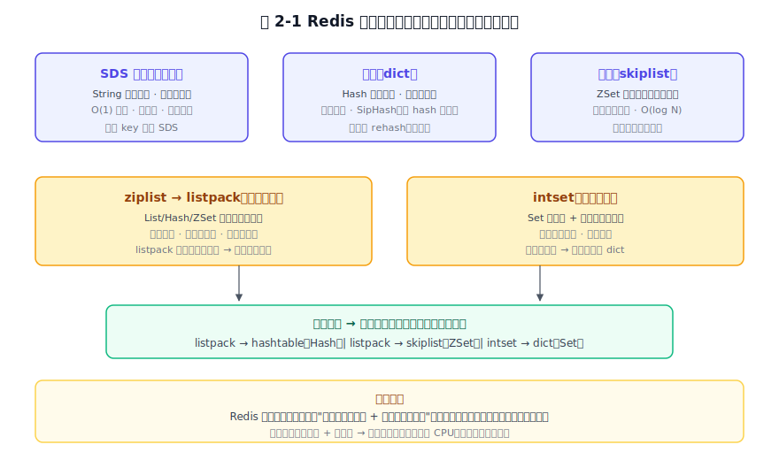
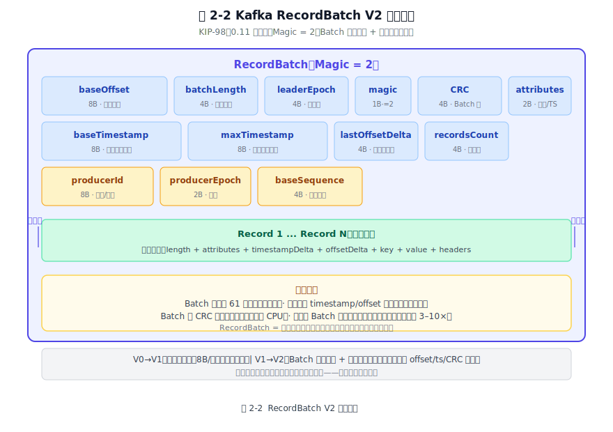
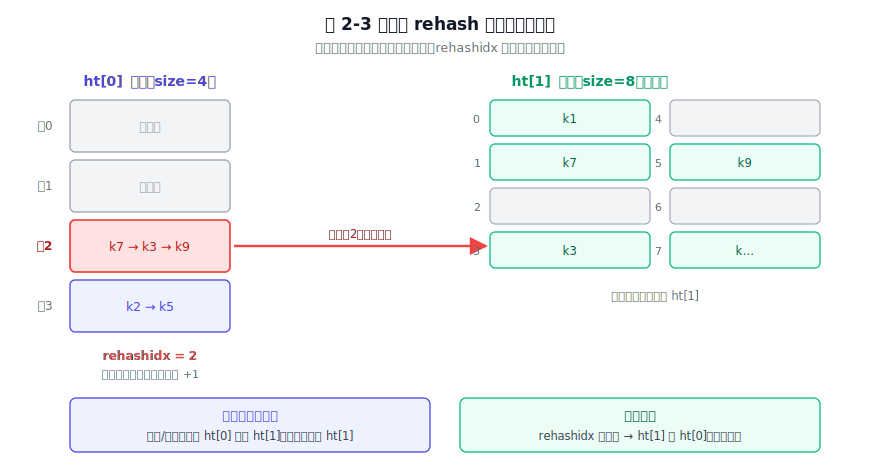

# 第 2 章 数据结构与协议 —— 为各自的目标而设计

## 本章导读

三个系统，三种核心目标。Redis 要极低的延迟。每条命令微秒级返回。MySQL 要通用可靠。随便怎么查、随便怎么改，数据不能错。Kafka 要海量吞吐。每秒几十万条消息，顺序写入、批量发出。

目标不同，选的数据结构和用的协议，自然也不同。这一章只问一个问题：**每个系统为了自己的核心目标，选了什么样的内部数据结构、用了什么样的通信协议？** 数据结构决定了它能做什么、不能做什么；协议决定了客户端和服务端怎么互相理解。读完这一章，如果只记住"Redis 有跳表、Kafka 有 RecordBatch"这些名词，那还不够。更实在的收获是看出：每种数据结构都天然适合某一种访问模式，每种协议都在为某个目标优化。后面七章都从这里往下挖：内存怎么管、磁盘怎么摆、副本怎么传。

## 2.1 问题的本质

任何一个有客户端和服务端的软件，都要做两个最基础的决定。

第一，数据在内部怎么表示。这个决定直接关系到操作复杂度、内存开销、以及"哪些查询快、哪些查询慢"。数据结构不是中性的。它天生偏爱某些访问模式、惩罚另一些。跳表偏范围扫描和有序操作，哈希表偏 O(1) 点查，B+ 树偏磁盘页对齐和范围扫描，紧凑列表偏内存密度和批量加载。

第二，客户端和服务端怎么对话。这背后是三个张力：发纯文本还是紧凑二进制（可读 vs 紧凑），每条消息独立处理还是批量打包（简单 vs 效率），协议固定还是带版本号可演进（固定 vs 可演进）。

三个软件用了三套不同的方法，每一套都从自己的核心目标倒推出来。

对 Redis 来说，核心目标是**极低延迟**。所以它的数据结构全部活在内存里，操作复杂度 O(1) 到 O(log N)，内存紧凑是第二考量。协议选了纯文本 RESP，调试时人眼就能读，服务端解析几乎不费 CPU。性能和可读性两头都不用让。

对 MySQL 来说，核心目标是**通用可靠**。它要支持任意 SQL、事务 ACID、磁盘持久化，所以它的核心数据结构 B+ 树必须对齐磁盘的 16KB 页，让一次磁盘 I/O 读到的每一字节都有用。协议选了紧凑二进制，因为多取一行、多传一个字段在 OLTP 场景下积少成多，且预编译语句能让 SQL 解析只做一次。

对 Kafka 来说，核心目标是**高吞吐**。所以它的核心数据结构 RecordBatch 把多条消息打成一个包。压缩、传输、落盘都以 Batch 为单位，批量化成了格式本身的内置属性。协议选了带版本号的请求/响应模型。统一头部 + 逐 API 版本化，让不同版本客户端可以和同一个 Broker 对话，演进能力直接靠版本号字段实现。

## 2.2 内部数据结构：为目标而定

### 2.2.1 Redis：活在内存里的简洁数据结构

Redis 的数据结构都受同一个约束限制：**全部驻留内存**。内存意味着随机访问几乎免费、CPU 开销比 I/O 更敏感、容量被物理上限锁死，所以数据结构要尽量省内存、尽量少 CPU 操作。

**SDS（简单动态字符串）** 是 Redis 最基础的字符串实现。C 语言原生的 `char*` 有两个致命弱点：取长度要 O(n) 遍历到 `\0`，且二进制不安全（`\0` 被当作字符串结尾，不能存图片、序列化对象等任意字节）。SDS 在字符串头部存了长度和剩余容量，取长度 O(1)，内容可以是任意二进制字节。内存预分配策略让频繁追加不用反复 `realloc`，惰性释放让缩短后多出来的空间先留着，下次增长时直接复用。省掉频繁的系统调用。

**跳表（skiplist）** 是 Redis 有序集合（ZSET）底层两种结构之一。一个跳表是多层有序链表。最底层是一条完整的有序双向链表，上面几层是"快速通道"，每隔几个节点跳一次。查找时从最顶层快速定位到目标附近，再逐层下沉到精确位置。平均 O(log N) 的查找、插入、删除，且实现比红黑树简单得多。跳表的插入只需要改前后节点的指针，不需要旋转和染色。antirez 选跳表而非红黑树，就是出于实现简单和内存友好的考量。跳表的缓存局部性确实不如红黑树，但在内存里这点差异被 DRAM 的随机访问速度盖过了。

**字典（dict）** 是 Redis 哈希类型的底层结构，也是 Redis 内部键空间本身。它是一个链式哈希表，用 SipHash 做哈希函数（Redis 4.0 起为防 hash 洪泛攻击，从 MurmurHash2 改用带随机种子的 SipHash），冲突用链表解决。渐进式 rehash 是 Redis 字典最特别的设计：当负载因子过高时，搬迁被分摊到每次字典操作里，而不是一次性把所有键搬到新表（那会阻塞主线程）。每次增删改查顺带搬几个桶，保证单次操作不会因为 rehash 而卡顿。这和其他地方提到的 Redis 设计思想一致：**用摊还替换集中，把不能删的活拆成碎片，塞进每次操作的缝隙里**。

**压缩列表（ziplist）与紧凑列表（listpack）** 是 Redis 把内存密度推到最高的数据结构。ziplist 是一块连续内存，所有元素紧挨着存，没有指针开销。每个元素存的是"前一个元素长度 + 自己的编码 + 自己的数据"。这带来极高的内存密度，但也带来连锁更新问题：如果一个元素变长，它的"前一个元素长度"字段可能从 1 字节扩成 5 字节，导致后一个元素的同名字段也跟着扩，最坏退化成 O(n²)。listpack（7.0 起逐步替代 ziplist）把"前一个元素长度"改成了"自己的长度"。每个元素只自记长度，不再管前面是谁，连锁更新从根上消除。内存密度不降，写复杂度从 O(n²) 回到 O(n)。

**整数集合（intset）** 是 Redis 集合类型在小数据且全为整数时的底层编码。它是一块连续的有序整数数组，查找用二分。当集合里插入一个非整数元素时，自动升级为哈希表。这和 ziplist → hashtable、listpack → skiplist 的升级逻辑是一样的。**小数据用紧凑结构省内存，膨胀后无缝切换到复杂结构**。所有升级对上层命令透明。

图 2-1　Redis 五种底层数据结构：SDS 做字符串，字典做键空间，跳表服务有序集合，ziplist/listpack 和 intset 在小数据下省内存，都为"内存快速存取"这个目标服务。

### 2.2.2 MySQL：为磁盘页和通用查询而生的 B+ 树与行格式

MySQL（InnoDB）的数据结构受另一个约束：**数据在磁盘上，一次 I/O 取一页（16KB）**。这个约束是决定性的。内存访问是纳秒级，磁盘 I/O 是微秒到毫秒级，差着三到五个数量级。所以 InnoDB 的核心数据结构只有一个目标：**让每一次磁盘 I/O 读上来的 16KB，每一个字节都有用**。

**B+ 树** 是 InnoDB 唯一的主索引结构。一棵 B+ 树从上到下：根节点、内部节点（非叶子）、叶子节点。内部节点只存键和子节点指针（几百个键就能挤进一个 16KB 页，树极矮），叶子节点存完整行数据，且叶子之间用双向链表串联。这套设计同时解决三个查询需求：点查（从根走到叶，O(log n)，两到三次 I/O）、范围扫描（定位到起始叶子后顺着链表往后扫，不需要反复从根定位）、排序（叶子层天然有序，B+ 树的键序就是排序序）。如果换哈希索引，点查 O(1) 更快，但范围和排序完全做不到。MySQL 要的是通用查询能力，B+ 树把所有常见的查询模式都覆盖了。第 8 章会展开 InnoDB 页内七段布局和 Page Directory 的细节，本章只抓一个核心。**B+ 树就是以 16KB 页为基本 I/O 单位的磁盘友好索引。**

**行格式（Row Format）** 决定了一行数据在页内怎么摆。以 8.0 默认的 Dynamic 行格式为例：行头存变长字段长度列表（逆序存放，从右往左解析时自然读到每个字段的边界）和 NULL 位图，后面是各列数据。大字段（VARCHAR/BLOB/TEXT）超过约页大小一半时溢出到独立溢出页，行内只留一个 20 字节指针。不让大对象拖累整页，也不让跨页撕裂把一次读变成多次 I/O。这是"页内紧凑"与"大对象不污染整页"的折中。

**自适应哈希索引（Adaptive Hash Index）** 是 InnoDB 在 B+ 树之上的额外一层。当某个 B+ 树页被频繁以相同键值点查时，InnoDB 在内存里自动为它建一个哈希索引，后续相同键值的点查直接走哈希 O(1)，不再走 B+ 树 O(log n)。这是"冷数据走磁盘、热数据走内存、极热数据走哈希"的三级加速。数据结构会随访问模式自动调整。

### 2.2.3 Kafka：为批量、顺序和演进而生的 RecordBatch

Kafka 的数据结构要同时满足三件事：**磁盘顺序追加 + 批量压缩 + 格式可演进**。满足这三件事的结构就是 RecordBatch，一个专为"把多条消息打成一个包"设计的结构，既不是树也不是哈希。

**RecordBatch 就是 Kafka 的基本存储单元。** 生产者会把消息攒够一批（按 `batch.size` 或 `linger.ms`）再压成一个 Batch 发到 Broker，而不是一条一条往外发。Broker 收到后把整个 Batch 原样追到日志段末尾。不对单条消息做任何拆分或索引。消费者拉取时，拿到的也是一整个 Batch。

**RecordBatch 的字段布局讲了 Kafka 的所有设计取向。** 从 V2（KIP-98，0.11 引入）起，一个 Batch 的头部包括：`baseOffset`（这批消息的起始位移）、`batchLength`（整个 Batch 的字节长度，用于快速跳到下一个 Batch）、`partitionLeaderEpoch`（哪一任 Leader 写了这批）、`magic`（格式版本号，V2 = 2）、`CRC`（整批一条校验，而非每条消息各自 CRC）、`attributes`（压缩类型 + 时间戳类型 + 事务标记）、`lastOffsetDelta`（最后一条消息距离 baseOffset 的差值）、`baseTimestamp` 和 `maxTimestamp`（这批的时间范围）、`producerId` / `producerEpoch` / `baseSequence`（幂等+事务所需的 Producer 状态）、`recordsCount`（这批有几条记录）。

头部之后是实际的消息记录。**每条记录不存绝对 offset 和绝对时间戳**，而是存它和 `baseOffset` / `baseTimestamp` 的差值。差值编码在一个 Batch 内能把编码空间省到很小。V0/V1 每条消息存绝对位移和绝对时间戳、每条消息带独立的 CRC，V2 把这些冗余全部消除。

图 2-2　Kafka RecordBatch V2 字段布局：Batch 级头部存 BaseOffset/BatchLength/CRC/Producer 状态，记录级字段只存差值；批量压缩、差分编码、单 CRC 校验，全部为吞吐服务。

这套设计的取舍摆在明面上。批量让压缩在相似消息聚集时达到 3-10 倍（zstd），差值编码让每条记录元数据开销降到个位数字节，Batch 级 CRC 省了逐条校验的 CPU，`magic` 让格式版本自描述、新旧格式可共存。代价也摆在明面上：消费必须按 Batch 边界来，随机按 key 点查完全做不到。但 Kafka 根本不需要随机点查，写入永远追加、消费永远顺序，Batch 恰好和顺序写入、批量拉取这两条最热的路径对齐。

## 2.3 通信协议：客户端和服务端怎么对话

RESP 是纯文本协议，用 `nc` 连上 6379 端口直接打字就能交互。在那个几乎所有后端协议都选紧凑二进制的年代，这个"原始"的选择背后是一个判断：瓶颈从来不在带宽。

### 2.3.1 Redis RESP：能被人眼读懂的极简协议

Redis 的协议叫 RESP（REdis Serialization Protocol）。它的设计目标非常明确：实现简单（服务端解析不费 CPU）、人眼可读（调试时 `nc` 连上去直接打字就能交互）、能表达所有 Redis 命令和返回值。

RESP 用每种数据类型的第一个字节区分类型。`+` 是简单字符串（如 `+OK\r\n`），`-` 是错误（如 `-ERR unknown command\r\n`），`:` 是整数（如 `:1000\r\n`），`$` 是批量字符串（如 `$5\r\nhello\r\n`，先告长度再跟内容，天然二进制安全），`*` 是数组（如 `*3\r\n$3\r\nSET\r\n$3\r\nkey\r\n$5\r\nvalue\r\n`，先告元素个数再逐个展开）。五种前缀字符就够用了：既无固定头部，也无版本号；长度只出现在批量字符串里（那是内容长度，不是协议头部）。

代价跟着简单一起来。RESP 是纯文本协议，体积比二进制大：`SET key value` 变成 `*3\r\n$3\r\nSET\r\n$3\r\nkey\r\n$5\r\nvalue\r\n` 有三十多个字节。每条命令独立，没有 Batch 概念（Pipeline 只是多条命令一起发，每条仍然独立编码和返回）。版本演进靠手工约定。Redis 6.0 之前没有认证协商，客户端假设服务端支持什么就发什么，不支持就报错。

**但 RESP 的"简单"恰好匹配了 Redis 的核心目标。** Redis 命令本身都很短小，协议开销在内存访问的纳秒级延迟面前可以忽略；人眼可读让调试和运维成本趋近于零。连上 `redis-cli` 敲命令就是它的协议原生交互。用复杂的二进制协议换那点带宽和解析开销，对 Redis 来说是过度设计。

### 2.3.2 MySQL 二进制协议：为效率和预编译而生

MySQL 的协议和 Redis 正相反。它选了**紧凑二进制**。原因在 OLTP 场景下客户端和服务端之间的通信量：一条 SQL 可能返回几百列、几万行，用文本协议传输的膨胀会倍数级放大；同时 SQL 解析本身很贵，频繁提交相同结构的 SQL 时重复解析是巨大的无谓 CPU 开销。

MySQL 协议分为几个阶段：握手（服务端发送能力标志和认证随机数、客户端回传加密后的凭证）、命令（客户端发送 SQL 或预编译语句 ID）、响应（服务端返回结果集或 OK/ERR）。整个过程中，整数用定长小端编码（`LengthEncodedInteger`，1/3/4/8 字节自适应），字符串用长度前缀（`LengthEncodedString`），结果集列信息先发列数和每列的类型/长度元数据，再发行数据。接收方在收到第一个字节时就知道后面还有多少字节。

**预编译语句** 是 MySQL 协议在"效率"上做到的最关键设计。客户端先发 `COM_STMT_PREPARE` 把一条带占位符 `?` 的 SQL 模板发给服务端，服务端解析一次生成执行计划、返回一个 `statement_id`。此后每次执行只需发 `COM_STMT_EXECUTE` + `statement_id` + 占位符的值。解析和优化只做一次，反复执行时省掉最贵的 CPU 步骤。这和 Redis Pipeline 的"少轮 RTT（网络往返，Round-Trip Time）"不同：Pipeline 少的是网络往返，预编译语句少的是服务端 CPU。同一类效率问题，两种解法对应两个不同的瓶颈。

**二进制结果集** 让行数据以紧凑的二进制格式传输，比同等数据的文本表示体积更小（数值与字符串列越密集，省得越多）。代价是：你没法用 `nc` 连 MySQL 看结果集，每一字节都是编码过的。如果不对照协议文档，无法直接从字节流里辨读内容。人不可读这个代价，是为省下 OLTP 场景的带宽和解析开销而支付的。

### 2.3.3 Kafka 请求/响应协议：统一头部、版本化、批量优先

Kafka 的协议模型换了思路。它是一个**分门别类的请求/响应体系**，而不是"客户端发命令、服务端回结果"的问答题。Produce、Fetch、Metadata、JoinGroup、SyncGroup……几十种请求类型，每种请求有自己独立的 Schema，每种 Schema 有自己的版本号。

所有请求共用同一个固定头部：`api_key`（2 字节，标识这是什么类型的请求，如 Produce = 0, Fetch = 1, Metadata = 3……）、`api_version`（2 字节，标识用哪个版本的 Schema）、`correlation_id`（4 字节，客户端自定，服务端原样抄到响应里用来匹配请求和响应）、`client_id`（变长字符串，标识客户端身份）。这个四元组头部是 Kafka 协议最关键的设计。`api_key` + `api_version` 让同一类请求可以同时存在多个版本，Broker 根据客户端声明的版本号调整解析方式和返回字段。这意味着：不强制所有客户端升级。3.0 的 Broker 可以和 0.11 的客户端对话，双方用各自能理解的最早版本号做协商。

**批量优先** 是 Kafka 协议区别于 Redis 和 MySQL 最根本的特征。Produce 请求把多条消息打成一个 RecordBatch 一起发给 Broker，Fetch 请求一次拉取指定 `(topic, partition, offset)` 起始的一段数据（`min_bytes` + `max_bytes` 控制拉取量），Broker 用零拷贝把一批消息直接从页缓存推到网卡。单条消息从不独立出现在协议层面。一切以 Batch 为单位。这和 RecordBatch 在存储层的设计是同一个思路：协议层不做单条操作，是 Kafka 把吞吐放在第一位的必然结果。

图 2-3　三款软件通信协议对比模型：Redis 走极简文本（人类可读，单条命令），MySQL 走紧凑二进制（预编译，列式结果集），Kafka 走请求/响应体系（统一头部，版本化，批量优先）。

## 2.4 横向对比

把这三款软件的内部数据结构和通信协议放进同一张表，能看清楚"目标 → 数据结构 → 协议"这条因果链。

**表 2-1 三款软件数据结构与协议的横向对比**

| 维度 | Redis | MySQL | Kafka |
|------|-------|-------|-------|
| 核心目标 | 极低延迟（微秒级） | 通用可靠（ACID + SQL） | 高吞吐（每秒几十万条） |
| 存储介质定位 | 全内存（磁盘仅为恢复） | 磁盘是家（内存是缓存） | 磁盘日志本体（顺序追加） |
| 核心数据结构 | SDS / 跳表 / 字典 / listpack / intset | B+ 树 + Dynamic 行格式 + 自适应哈希 | RecordBatch V2（批量+差值编码） |
| 数据结构优化目标 | O(1)/O(log N) + 低内存占用 | 每 16KB 页利用率最大化 + 通用查询 | 批量压缩 + 顺序追加 + 格式可演进 |
| 协议类型 | RESP 纯文本 | 紧凑二进制 | 请求/响应 + 统一头部 |
| 协议核心设计 | 5 种前缀字符，人眼可读 | 预编译语句 + 二进制结果集 | api_key + api_version + correlation_id |
| 批量策略 | Pipeline（多条独立命令一次性发） | 预编译语句（解析一次，执行多次） | RecordBatch（多条消息打成一个包） |
| 版本演进方式 | 手工约定（客户端盲猜） | 能力标志位（握手时交换） | api_version（每种请求独立版本号） |
| 人机可读性 | ✅ `nc` 连上直接交互 | ❌ 纯二进制，不可读 | ❌ 二进制 + 编码，不可读 |
| 最大优势 | 解析极简、调试友好 | 带宽压降、CPU 省解析 | Batch 吞吐、独立演进不互锁 |
| 最大代价 | 体积大、无 Batch | 不可读、实现复杂 | 协议复杂性、学习曲线 |

**核心目标决定数据结构。** Redis 要极低延迟，数据结构全放内存、操作 O(1) 到 O(log N)。MySQL 要通用可靠，B+ 树用一种结构同时满足"点查 + 范围扫描 + 排序"三种需求，行格式在 16KB 页内精打细算。Kafka 要高吞吐，RecordBatch 让批量化、压缩和演进都成了格式的内置属性。

**数据结构决定协议形态。** Redis 的数据结构操作简单、返回轻量，协议自然就是短小的文本行，适合偶尔单条交互。MySQL 返回的结果集可能有几百列几万行，所以协议走紧凑二进制 + 列先于行的元数据前置，客户端一口气读完一批行，无需逐行解析。Kafka 的操作以 Batch 为单位收发数据，命令分几十种类型，于是协议用带版本号的统一请求头，让不同版本客户端可以和同一个 Broker 共存演进。

**协议看似只是技术细节，但接入门槛高低，决定了一个系统能长出多大的生态。** RESP 把 Redis 的门槛拉到了最低。任何语言只需收发文本就能和它对话。MySQL 的二进制协议把 SQL 能力封装在预编译和类型安全中：代价是实现一个 MySQL 客户端要用到所有数据库原语，门槛远高于 RESP。Kafka 的版本兼容靠协议头部的设计直接保证。一个生产集群里同时跑着十几个不同版本的客户端是常态，协议头部把这层兼容性做进了格式本身，任何一方的升级都不该逼着所有人同步跟进。

## 2.5 架构启示

下面这四条启示，是这三款软件共同说明的设计规律。

**启示一：数据结构服务于核心目标。** Redis 要快，所以 SDS 取长 O(1)、字典做渐进式 rehash、跳表牺牲缓存局部性换实现简洁。MySQL 走另一条路，为了对齐磁盘页，B+ 树内部节点只存键不存数据（树必须矮），叶子和叶子之间用双向链表串起来，范围扫描不用回头。Kafka 又不一样，它的吞吐需求最大，于是 RecordBatch 把一批消息当成一个不可分割的存储与传输单元，压缩、校验、读写全部以 Batch 为单位，格式还带 magic 版本号让新旧格式可以共存。因为每款软件都按核心目标选结构，所以结构本身会把它要什么说出来。看 B+ 树对齐 16KB 页，就知道它要通用可靠；看 RecordBatch 让批量化成了格式内置属性，就知道它要吞吐。

**启示二：协议是数据结构的外部映射。** Redis 操作简单、返回轻量，适合偶尔单条交互。RESP 用短小的文本行匹配它。MySQL 动辄返回几十列几万行。预编译 + 二进制列式结果集，把"解析一次、复用千万次"做到了极限。Kafka 有几十种请求类型、以 Batch 为单位收发。请求/响应头用 api_key + api_version，让同一集群同时服务不同版本客户端。**设计自己的服务端协议时，先问你的数据结构的访问模式长什么样。** 一条一条地小包收发，还是按批往返，决定了协议定长、变长、和版本管理策略。

**启示三：简单协议的接入成本最低。** RESP 只有五个前缀字符，任何语言在几分钟内就能写一个能用的 Redis 客户端。这个零门槛让 Redis 的生态覆盖了几乎所有编程语言和平台。协议简单本身就是最好的推广。Redis 成为基础设施，不是因为快，是因为接入它几乎没有成本。评估一个服务端的对外接口时，看文档页数不如看协议用几行代码就能干活。

**启示四：版本字段是给未来留的口子。** MySQL 在握手时交换能力标志，Kafka 在每个请求头里带版本号。没有版本协商的协议（如 RESP）只能通过后续手工约定来补，而一旦客户端生态已经铺开，任何 Breaking Change 都是几乎不可能的。设计一个新协议时，先从第二个版本开始。第一个版本你肯定没把边界想全。留出能力标志或版本字段，是为了将来想做改动时不必推倒重来。

## 2.6 小结

这三款软件为了各自的核心目标，选择了完全不同的内部数据结构和通信协议。Redis 为极低延迟选了全内存的简洁数据结构和文本协议，MySQL 为通用可靠选了 B+ 树页式结构和紧凑二进制协议，Kafka 的 RecordBatch 则把批量化、压缩和版本演进都做进了格式本身，吞吐因此成了它的默认设定。每一组选择都是"核心目标 → 数据结构 → 协议形态"这条因果链的完整展开。读完这一章，再往后看它们怎么管理内存和磁盘（第 4 章）、怎么分层（第 5 章）、怎么同步数据（第 9 章），你会发现每一层都在为这些最底层的数据结构服务。数据结构决定了内存怎么管、协议决定了分层怎么切。一个可带走的判断是：选数据结构的第一标准，不是看哪个结构"更高级"，而是看哪个结构最偏爱你的最热访问路径：Redis 最热是点查所以用哈希，MySQL 最热是范围扫描所以用 B+ 树，Kafka 最热是顺序追加所以用 append-only Batch。
