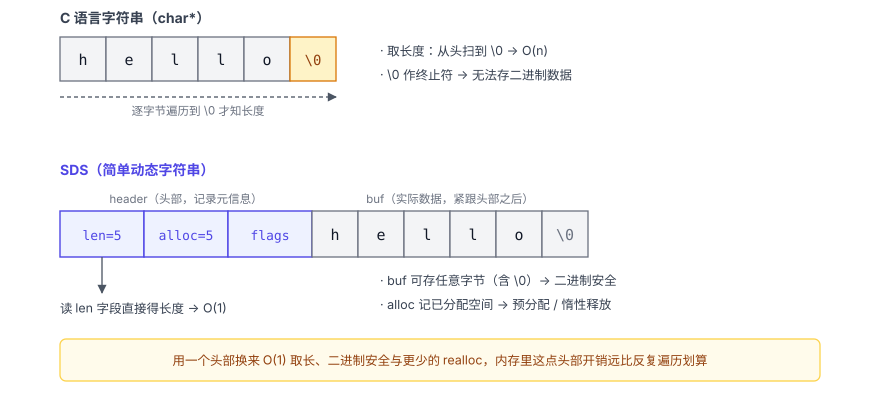
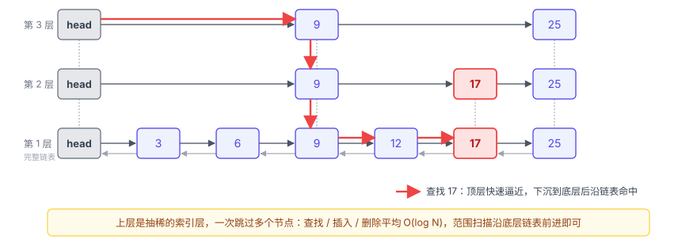
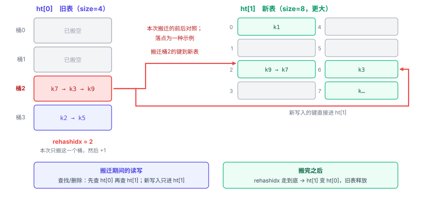
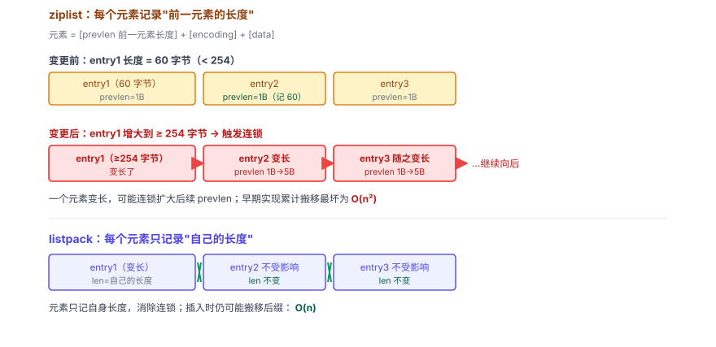
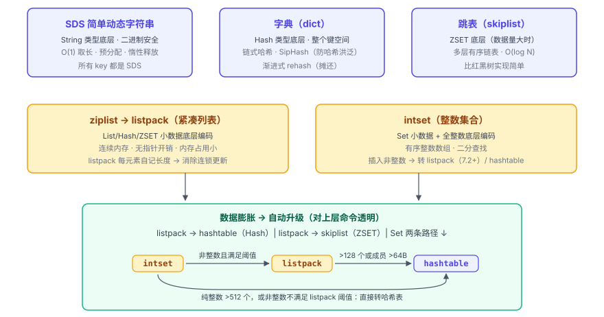
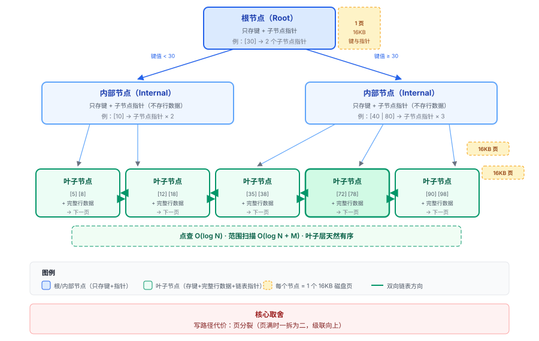
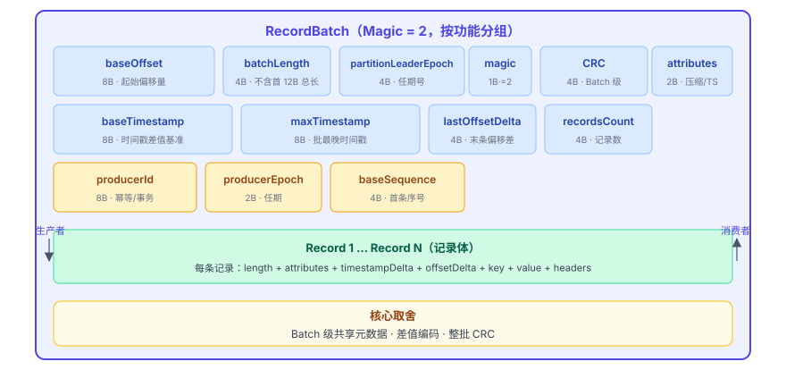
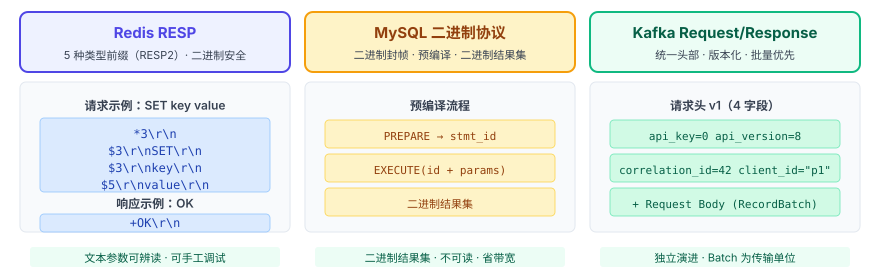

# 第 2 章 数据结构与协议 — 为各自的目标而设计

## 本章导读

我做过一个测试：MySQL 一张没有 score 索引的表跑 `ORDER BY score DESC LIMIT 100`，数据量小的时候跑得很快，当表中数据涨到数百万级之后，每次刷新排行榜要把整张表捞出来排序（filesort），查询落到秒级。当然，给 score 建了索引之后，这个查询走索引有序扫描、毫秒级就能返回。

读是快了，改分和查名次没有跟着快。改一次分，score 的二级索引上要删一条旧条目、插一条新条目，页满了还要分裂。问某人第几，没有捷径，B+ 树不记每个节点底下有多少条，MySQL 只能把分数比他高的人挨个数过去。后来我把整张榜挪到 Redis 的有序集合（ZSET）上，底下是跳表，改分不过是动几个指针，名次一条 ZREVRANK，两样都是 O(log N)，没有页，也就没有分裂。B+ 树是为磁盘上的点查和范围扫描设计的，改分和查名次都不在这一类里。选数据结构的标准，是看哪个结构最匹配你的**核心访问方式**。

目标不同，选的数据结构和用的协议也不同。这一章的核心问题是：**每个系统为了自己的目标，选了什么样的内部数据结构、用了什么样的通信协议。** 数据结构决定了它能做什么、不能做什么；协议决定了客户端和服务端怎么互相理解。三家的取向第 1 章的雷达图已经画过，本章每个结构与协议的选择，都是那三个目标的推论。

没有全能的数据结构：不同结构擅长的访问模式不同，超出主要优化目标时，操作成本可能上升。协议也一样，三家的选择都在为各自的目标优化。后面七章的内存管理、磁盘布局、数据同步，都从这里的结构选择出发。

## 2.1 问题的本质

任何一个有客户端和服务端的软件，都绕不过这两个问题：

第一，数据用什么格式来组织。这个问题直接关系到操作复杂度、内存开销以及"哪些查询快、哪些查询慢"。跳表适合范围扫描和有序操作，哈希表适合 O(1) 点查，B+ 树为磁盘页对齐和范围扫描而设计，紧凑列表胜在内存密度。

第二，客户端和服务端怎么对话。有三个关键点：发纯文本还是紧凑二进制（可读 vs 紧凑），每条消息独立处理还是批量打包（简单 vs 效率），协议固定还是带版本号可演进。

Redis 要的是**极低延迟**。所以它的数据结构全部在内存里，常用的点查和有序定位可分别做到 O(1) 和 O(log N)，内存紧凑是第二考量。协议选了 RESP，类型和长度使用可读的前缀，参数也能包含二进制数据，服务端解析几乎不费 CPU。
MySQL 的核心目标是**通用可靠**。它要支持任意 SQL、事务 ACID、磁盘持久化，所以它的核心数据结构 B+ 树必须对齐磁盘的 16KB 页，让一次磁盘 I/O 读到的每一页都装满了索引键，而不是半页索引半页无用数据。协议选了二进制封帧——经典查询的结果行走文本，减少传输体积的收益，要到预编译语句的二进制结果集才体现出来；预编译也让 SQL 解析只做一次。
Kafka 把**高吞吐**当成第一目标。所以它的核心数据结构 RecordBatch 把多条消息打成一个包，压缩、传输、落盘都以 Batch 为单位，批量化成了格式本身的内置属性。协议选了带版本号的请求/响应模型。统一头部 + 逐 API 版本化，让不同版本客户端可以和同一个 Broker 对话，演进能力直接靠版本号字段实现。

## 2.2 内部数据结构：为核心目标而设计

### 2.2.1 Redis：驻留内存的简洁数据结构

Redis 的数据结构都受同一个约束限制：**全部驻留内存**。内存意味着随机访问几乎免费、对 CPU 开销比对 I/O 更敏感、容量有物理上限，所以数据结构要尽量省内存、尽量少 CPU 操作。下面五个结构都是对这条约束的回应：SDS、跳表、字典（dict）偏重查询效率，ziplist/listpack 和 intset 偏重内存密度。

**SDS（简单动态字符串）** 是 Redis 最基础的字符串实现。不用 C 语言的 `char*`，而是自己另做了一套结构。C 语言的字符串取长度要遍历到 `\0` 才能知道，SDS 读取头部的 `len` 字段就能得到长度。SDS 还能存储任意二进制数据，不需要依赖终止符。

它的头部（header）记录了 `len`（当前字符串长度）、`alloc`（已分配的总字节数，不包括头部和结尾 `\0`）和 `flags`（标记 SDS 类型）。Redis 按长度分 sdshdr5/8/16/32/64 共五种，短字符串用小头省内存。其中 sdshdr5 最省，整个头只有 1 字节，长度直接嵌在 flags 的高 5 位里。实际存数据的 `buf` 紧跟在头部后面。

**预分配**：追加触发的扩容默认走翻倍策略，新长度小于 1MB 直接翻倍，超过 1MB 则每次只多申请 1MB，连续追加时不会每次都触发 `realloc`。网络层读客户端命令缓冲（querybuf）的大参数是个例外：走 `sdsMakeRoomForNonGreedy` 按需扩容，知道读多少就分配多少，不为单个大参数白占一倍内存。
**惰性释放**：缩短字符串时不立即归还内存，只改 `len` 字段（`alloc` 不动，保留已分配空间），把多余空间留作未来的追加缓冲；想真正归还内存需要显式调用 `sdsRemoveFreeSpace`，SDS 自身从不在缩短路径上自动 `realloc`。这组策略把频繁操作中的系统调用次数降到最低，让 Redis 在最常用的操作上做到摊还 O(1)。图 2-1 把两种字符串的内存布局并排画出来。

图 2-1　SDS 与 C 字符串的内存布局对比：同一个 hello 的两种存法，差别集中在 SDS 的头部。

对照上下两行，开销的位置不同：C 字符串省了头部，代价摊在每次取长度的遍历里；SDS 多存一个头部，取长度变成读一个字段。Redis 选的是后一种：增加固定的小开销，免去每次取长度时的遍历。

**跳表（skiplist）** 是 Redis 有序集合底层两种结构之一。skiplist 编码的 ZSET 内部是 dict + 跳表两个结构并联：member→score 的查找走 dict，ZSCORE 是 O(1)；按顺序读取一段元素走跳表，ZRANGE 是 O(log N + M)，M 为返回元素数。单一结构顾不全，就并联两个，各管一条访问路径。

跳表是多层有序链表，最底层是一条完整的有序双向链表，上面几层是抽稀的索引层，每隔几个节点保留一个指针。查找时从最顶层快速定位到目标附近，再逐层下沉到精确位置。查找、插入和删除的平均时间复杂度都是 O(log N)。范围扫描只需沿底层链表前进（O(log N + M)），比红黑树的中序遍历更直接。插入时按新节点的随机层数，逐层更新前驱节点的前向指针和跨度（span），不需要旋转或再平衡。节点层数按随机结果决定，跳表高度大概率落在 O(log N)。span 逐层累加就是名次，排行榜里"查某人排第几"能 O(log N) 出结果，靠的就是它。

选跳表而非红黑树，是因为实现更简单、范围操作更直接。跳表的缓存局部性确实不如红黑树，但在 Redis 的典型数据规模下，这点差异不是主导因素。多层索引长什么样、查找怎么走，见图 2-2。

图 2-2　跳表的多层索引与查找路径：以查找 17 为例。

图 2-2 中从 head 到 17 的路径：每一步要么前进、要么下沉，越往下一次跨过的节点越少，到底层逐个对齐。本章开头排行榜的例子同样分成两段：按分数定位起点走这条下沉路径，按名次拉一段沿底层链表前进。

**字典（dict）** 是 Redis 哈希类型的底层结构，也是 Redis 内部键空间（实例里所有 key 组成的整体）本身。它是一个链式哈希表，用 SipHash 做哈希函数（Redis 4.0 起为防哈希洪泛攻击，从 MurmurHash2 改用带随机种子的 SipHash），冲突用链表解决。

渐进式 rehash 是 Redis 字典最特别的设计，实现上依赖一个双表结构：每个字典内部同时持有两张哈希表，`ht[0]` 和 `ht[1]`。正常情况下只用 `ht[0]`，`ht[1]` 是空的。当负载因子（`used / size`）超过扩容阈值（通常为 1）或低于缩容阈值（0.1）时，Redis 不会一次性把所有键从 `ht[0]` 搬到 `ht[1]`，因为那会阻塞主线程。它先给 `ht[1]` 分配一个更大的（或更小的）空间，设一个游标 `rehashidx = 0`，表示"搬迁进行中"。此后每次对这个字典做增删改查时，Redis 会从 `rehashidx` 起搬走第一个非空桶（空桶直接跳过），然后 `rehashidx++`。同时，新写入的键直接进 `ht[1]`，查找和删除则先查 `ht[0]` 再查 `ht[1]`。当 `rehashidx` 走完所有桶，`ht[1]` 变成新的 `ht[0]`，旧表释放，`rehashidx` 重置为 -1，rehash 结束。

这套机制把搬迁工作分摊到后续操作里，减少一次性搬迁造成的长停顿；但一次搬迁需要处理一个桶中的全部元素，并不构成单次操作延迟的硬上限。命令触发的只是其中一路，定时任务还会为数据库的键字典和过期字典推进 rehash，每次调用以约 1ms 为目标；这个时间按批次检查，也不是每个字典每周期都能得到的预算。生成 RDB/AOF 的子进程运行期间，定时搬迁暂停。这与前文 SDS 的做法是同一个思想：**把省不掉的工作分摊到后续每次操作里**。这套双表搬迁画出来就是图 2-3。

图 2-3　渐进式 rehash 的双表搬迁过程：搬迁进行到一半的一个时刻。

搬迁不是整桶平移：旧表桶 2 里的 k7、k3、k9 搬过去之后分别落在 `ht[1]` 不同的桶里，键要按新表的尺寸重新散列。这笔重新散列的开销和搬移一起，摊在每次操作顺带的那一小步里。

**压缩列表（ziplist）与紧凑列表（listpack）** 是 Redis 用来提高内存密度的数据结构。ziplist 是一块连续内存，所有元素紧挨着存，没有指针开销。每个元素存的是"前一个元素长度 + 自己的编码 + 自己的数据"。这带来较高的内存密度，但也带来连锁更新问题：一个元素变长后，下一个元素里记录"前一个元素长度"的字段可能从 1 字节扩成 5 字节，再后面的元素又因此逐个跟着扩。早期实现（如 Redis 6.0）每扩一个字段都搬移后方字节，最坏会出现 O(n²) 的累计搬移；6.2 已改为先统计扩张量，再集中扩容和搬移，但元素之间的长度依赖仍在。listpack（7.0 起取代了 ziplist 的全部内部用途，旧格式代码保留兼容）把"前一个元素长度"改成了"自己的长度"。每个元素只自记长度，不再管前面是谁，连锁更新从根上消除；插入时仍可能搬移后方字节。连锁怎么发生、怎么被消除，并排画在图 2-4 里。

图 2-4　ziplist 连锁更新与 listpack 的消除：同一个元素变长，在两种格式里的不同后果。

触发点在 254 这个长度上（0xFF 留作整个 ziplist 的结束标记，0xFE 用作 5 字节编码的信号，1 字节能自由编码的长度只有 0–253）：比它短的长度用 1 字节就装得下，跨过它，字段要从 1 字节扩成 5 字节。连锁只向后传播，因为每个元素只依赖前一个元素的长度。

**整数集合（intset）** 是 Redis 集合类型在小数据且全为整数时的底层编码。它是一块连续的有序整数数组，查找用二分。intset 的升级有两条路径。

第一条是**编码升级**。intset 内部用统一的整数编码存储所有元素：能存 int16 就不上 int32，能存 int32 就不上 int64。但一旦插入一个值越过了当前编码的范围（比如当前所有元素都是 int16，突然插入一个 50000），intset 不会报错，而是把整个数组的所有元素统一升级到更宽的编码（int16→int32 或 int32→int64），然后插入新值。升级后旧的窄编码数组被释放。编码只升不降：哪怕后来所有大值都被删了，编码仍然是宽的。因为降级要多出一次全量重分配，而"删掉大值"的概率太低，不值得。

第二条是**类型升级**。当集合里插入一个非整数元素时，intset 作为纯整数结构装不下，会自动升级：7.2 起小集合先转 listpack，超过阈值（默认 128 个元素）再升级为哈希表；7.2 之前直接升级为哈希表。

纯整数集合另有元素数量阈值——元素数超过 set-max-intset-entries（默认 512）时直接转哈希表，不经 listpack，与 listpack 的 128 个元素阈值对应不同的转换路径。

listpack → hashtable 的转换，和 Hash 类型小数据编码的升级是同一套逻辑。**数据量小时用紧凑结构省内存，膨胀后自动切换到复杂结构**。所有升级对上层命令透明。五种结构与它们的切换关系，汇总在图 2-5。

图 2-5　Redis 五种底层结构与升级路径：五种结构各成卡片，底部标出小数据编码的升级去向，其中 Set 是两条独立路径。

升级路径的方向一致：起点都是紧凑编码，终点都是面向查询的结构。

### 2.2.2 MySQL：面向磁盘页和通用查询的 B+ 树与行格式

MySQL（InnoDB）的数据结构受到一个关键限制：**数据在磁盘上，一次 I/O 取一页（16KB）**。这个限制是决定性的。内存访问是纳秒级，而磁盘 I/O 是微秒到毫秒级，差着三到五个数量级。所以 InnoDB 的核心数据结构要解决的正是这个问题：**让每一次磁盘 I/O 读上来的 16KB，每一个字节都有用**。

**B+ 树** 是 InnoDB 唯一的主索引结构。一棵 B+ 树从上到下：根节点、内部节点（非叶子）、叶子节点。内部节点只存键和子节点指针（一个 16KB 页就能容纳几百个键，两层内部节点、每叶几十行，千万行的表整棵树也只有三层，树极矮），叶子节点存完整行数据——这是聚簇索引，InnoDB 的表本体就按主键组织成树。二级索引的叶子只存索引键加主键值，查完还要拿主键回聚簇索引取整行（这一步叫回表）。叶子之间用双向链表串联。

这套设计同时满足三个查询需求：点查（从根走到叶，O(log N)，两到三次 I/O）、范围扫描（定位到起始叶子后顺着链表往后扫，不需要反复从根定位）、排序（叶子层天然有序，B+ 树的键序就是排序顺序）。如果换哈希索引，点查 O(1) 更快，但范围和排序完全做不到。MySQL 要的是通用查询能力，B+ 树把所有常见的查询模式都覆盖了。第 8 章会展开 InnoDB 页内七段布局和 Page Directory 的细节。

B+ 树的代价在写路径：插入新键可能触发页分裂（页满时一拆为二，级联向上），每次分裂都是一次额外的磁盘写入。跳表插入只做局部的指针更新，没有页分裂；页分裂是磁盘 16KB 页约束下特有的代价，也是 MySQL 为通用查询能力付出的成本。图 2-6 画了一棵三层的示例树。

图 2-6　InnoDB B+ 树三层结构：一棵示例树，每个方框对应一个 16KB 磁盘页。

这张图与图 2-2 的跳表对照：两者都为顺序访问准备了底层结构，差别在于，跳表按单个内存节点组织数据，B+ 树则把一整个 16KB 磁盘页作为节点——节点的大小，对齐的是所在介质的访问单位。

**行格式（Row Format）** 决定了一行数据在页内怎么存放。以默认的 Dynamic 行格式为例，行头存变长字段长度列表和 NULL 位图，后面是各列数据。长度信息按与字段相反的顺序存放，解析时从记录头附近读取这些长度，再确定各字段的边界。行太长放不下时才动用溢出页，且按整行判定：超限就把最长的变长列（VARCHAR/BLOB/TEXT）整列挪去独立溢出页、行内只留一个指针，很短的 TEXT/BLOB 始终留在行内（字节级阈值与挪列顺序见第 8 章）。这是"页内紧凑"与"大对象不污染整页"的折中。

**自适应哈希索引** 是 InnoDB 在 B+ 树之上的额外一层。当某个 B+ 树页被以相同键值频繁点查时，InnoDB 在内存里自动为它建一个哈希索引，后续相同键值的点查直接走哈希 O(1)，不再走 B+ 树 O(log N)。冷数据留在磁盘，热点页进缓冲池，被反复点查的页再由自适应哈希接管。数据结构会随访问模式自动调整。哈希表要多占一块内存，高并发点查的竞争又集中在它的保护锁上，5.7.8 起拆成 8 个分区，生产上仍常常直接关掉。

### 2.2.3 Kafka 的 RecordBatch：批量、顺序、演进

Kafka 的数据结构要同时满足三件事：**磁盘顺序追加 + 批量压缩 + 格式可演进**。满足这三件事的结构就是 RecordBatch，一个专为"把多条消息打成一个包"设计的结构，既不是树也不是哈希。

**RecordBatch 就是 Kafka 的基本存储单元。** 生产者会把消息积累成一批（攒够 `batch.size` 字节，或等到 `linger.ms` 毫秒）再打成一个 Batch 发到 Broker，而不是一条一条往外发。Broker 收到后把整个 Batch 原样追加到日志段末尾。不对单条消息做任何拆分或索引。消费者拉取时，拿到的也是一整个 Batch。原样追加的前提是生产者的压缩类型与 topic 的 `compression.type` 一致；不一致时 Broker 要逐批解压再重新压缩，老版本客户端拉取时还要触发格式降级转换。这两处都是 Broker 端 CPU 尖刺的常见来源。

每个分区有多份副本，同一时刻只有一台 Broker 当 Leader、写入都落在它身上；Leader 宕机就换任，`partitionLeaderEpoch` 随换任加一，标记的是这批数据出自哪一任。

从 V2（KIP-98，0.11 引入）起，一个 Batch 的头部字段如下：

**表 2-1　Kafka RecordBatch V2 头部字段**

| 字段 | 作用 |
|---|---|
| `baseOffset` / `batchLength` | 这批消息的起始偏移量 / 整个 Batch 除最前 12 字节（`baseOffset` 与 `batchLength` 自身）外的字节长度（用于快速跳到下一个 Batch） |
| `partitionLeaderEpoch` / `magic` | 哪一任 Leader 写了这批 / 格式版本号（V2 = 2） |
| `CRC` | 整批一条校验，而非每条消息各自 CRC |
| `attributes` | 压缩类型 + 时间戳类型 + 事务标记 |
| `lastOffsetDelta` | 最后一条消息距离 baseOffset 的差值 |
| `baseTimestamp` / `maxTimestamp` | 这批消息的时间范围 |
| `producerId` / `producerEpoch` / `baseSequence` | 幂等 + 事务所需的 Producer 状态（Broker 按序列号对重试去重） |
| `recordsCount` | 这批有几条记录 |

头部之后是实际的消息记录。**每条记录不存绝对偏移量和绝对时间戳**，而是存它和 `baseOffset` / `baseTimestamp` 的差值。V0 每条消息存绝对偏移量、带独立的 CRC，V1 在此之上给每条消息加上了时间戳；V2 把这些冗余全部消除，完整的字段排布见图 2-7。

图 2-7　RecordBatch V2 字段布局：61 字节头部共享整批元数据，每条 Record 只存与 base 的差值。

这套设计的取舍摆在明面上。相似消息聚成一批，压缩收益通常可达数倍（zstd，压缩比取决于消息内容相似度与压缩级别，基准测试中常见 2–6 倍）；差值编码把每条记录的元数据开销降到个位数字节；CRC（循环冗余校验）对整批只计算一个校验值，省掉逐条校验的 CPU 开销；`magic` 字段标明格式版本，新旧格式可以共存。代价同样直接：消费必须按 Batch 边界来，随机按 key 点查完全做不到。但 Kafka 根本不需要随机点查，写入永远追加、消费永远按序，Batch 恰好和顺序写入、批量拉取这两条最常走的路径对齐。

## 2.3 通信协议：客户端和服务端怎么对话

三个软件的协议走了三条路：Redis 用带可读前缀的 RESP，MySQL 用二进制封帧，Kafka 用带版本号的请求/响应。先从最"原始"的 RESP 看起——在二进制协议正当红的年代，这个选择背后是一个判断：优先保持协议实现简单。

### 2.3.1 Redis RESP：能被人眼读懂的极简协议

Redis 的协议叫 RESP（REdis Serialization Protocol）。它的设计目标非常明确：实现简单（服务端解析不费 CPU）、便于人工调试（文本参数可以直接辨读，也能用 `nc` 手工发送简单命令）、能表达所有 Redis 命令和返回值。

RESP 根据序列化数据的首字节区分数据类型。`+` 是简单字符串（如 `+OK\r\n`），`-` 是错误（如 `-ERR unknown command\r\n`），`:` 是整数（如 `:1000\r\n`），`$` 是批量字符串（如 `$5\r\nhello\r\n`，先告知长度再跟内容，天然二进制安全），`*` 是数组（如 `*3\r\n$3\r\nSET\r\n$3\r\nkey\r\n$5\r\nvalue\r\n`，先告知元素个数再逐个展开）。五种前缀字符就够用了：既无固定头部，也无版本号；长度信息只出现在两处——数组首行的元素个数和批量字符串的内容长度，都是内容自述，不是固定协议头。

但简单也有代价。RESP 用文本表示类型、长度和部分数值，这些前缀也占空间：`SET key value` 编码成上面那串字节，有三十多个字节。每条命令独立，没有 Batch 概念（Pipeline 只是多条命令一起发，每条仍然独立编码和返回）。版本演进靠手工约定。Redis 6.0 之前没有版本协商，客户端假设服务端支持什么就发什么，不支持就报错。

**但 RESP 的"简单"恰好匹配了 Redis 的核心目标。** 对于短小的 Redis 命令，RESP 的解析较简单；可读的前缀与文本参数也便于人工检查，能降低协议调试的成本。用 `redis-cli` 连上实例敲命令，就是其协议的原生交互方式。为了省那点带宽和解析开销而换用复杂的二进制协议，对 Redis 来说是过度设计。

Redis 6.0 引入的 RESP 3 补上了版本协商这个缺口：客户端用 `HELLO` 命令在握手时声明协议版本，服务端始终兼容 RESP 2；切到 RESP 3 后部分命令的返回类型会变（如 `HGETALL` 从扁平数组变为 Map），需要客户端显式适配。MySQL 和 Kafka 的版本协商是内建的，RESP 用了十年才补上，补的形式还是一条文本命令。

### 2.3.2 MySQL 二进制协议：封帧与预编译

MySQL 的协议和 Redis 正相反。它选了**二进制封帧**：握手、长度前缀、整数编码是二进制的，但经典查询返回的结果行缺省是文本——非 NULL 值以长度编码的字符串传输，其中数值用文本表示，字符列受结果字符集控制，二进制列仍可包含任意字节；真正紧凑的二进制行格式要走预编译语句。收益集中在高并发 OLTP（联机事务处理）：预编译通常可复用解析结果，元数据变化等情形仍会触发重新预处理；二进制结果集则可减少部分数据类型的传输开销。

MySQL 协议分为几个阶段：握手（服务端发送能力标志和认证随机数、客户端回传加密后的凭证）、命令（客户端发送 SQL 或预编译语句 ID）、响应（服务端返回结果集或 OK/ERR）。

报文里的整数编码分两套。定长小端整数低字节在前，类型为 int<1>/int<2>/int<4>/int<8>。另一套是首字节分档的变长整数（`LengthEncodedInteger`）：首字节小于 0xFB 时，它就是值本身，占 1 字节；0xFC/0xFD/0xFE 前缀分别后跟 2/3/8 字节，总长 1/3/4/9 字节。

字符串用长度前缀（`LengthEncodedString`）。结果集先发列数和每列的类型/长度元数据，再发送各行数据。0xFB 不是长度编码，在结果集行里它标记 NULL。接收方在收到第一个字节时就知道后面还有多少字节。

**预编译语句** 是 MySQL 协议在"效率"上的关键设计。客户端先用 `COM_STMT_PREPARE` 把一条带占位符 `?` 的 SQL 模板发给服务端，服务端完成解析与语义检查、返回一个 `statement_id`。此后每次执行只需发 `COM_STMT_EXECUTE` + `statement_id` + 占位符的值。解析只做一次，执行计划则在每次执行时按当时的统计信息重新生成，反复执行时省掉的是逐次解析的 CPU 开销。这和 Redis Pipeline 不同：Pipeline 省的是网络往返（RTT，Round-Trip Time），预编译语句省的是服务端 CPU。同一类效率问题，两种解法对应两个不同的瓶颈。

**二进制结果集** 让行数据以紧凑的二进制格式传输，比同等数据的文本表示体积更小（数值与日期时间列越密集、值越长，省得越多；字符串列两种编码几乎一样大）。可读性在这里丢了：每一字节都是编码过的，不对照协议文档，无法直接从字节流里辨读内容。这是为省下 OLTP 场景的带宽和解析开销而支付的代价。

### 2.3.3 Kafka 请求/响应协议：统一头部、版本化、批量优先

Kafka 的协议按请求类型组织。Produce、Fetch、Metadata、JoinGroup、SyncGroup……几十种请求类型，每种请求有自己独立的 Schema，每种 Schema 有自己的版本号。

Kafka 的请求头有自己的版本。常见的 v1 包含四个字段：`api_key`（2 字节，标识这是什么类型的请求，如 Produce = 0、Fetch = 1、Metadata = 3……）、`api_version`（2 字节，标识用哪个版本的 Schema）、`correlation_id`（4 字节，客户端自定义，服务端原样抄到响应里用来匹配请求和响应）、`client_id`（变长字符串，标识客户端身份）。v0 请求头没有 `client_id`，v2 则在这四个字段后增加 tagged fields 区域。请求头版本由 API 及其版本决定。`api_key` + `api_version` 让同一类请求可以同时存在多个版本，Broker 根据客户端声明的版本号调整解析方式和返回字段。这意味着不强制所有客户端同步升级。3.0 的 Broker 可以和 0.11 的客户端对话，双方用彼此都支持的最高版本号做协商。

**批量优先** 是 Kafka 协议区别于 Redis 和 MySQL 最根本的特征。Produce 请求把多条消息打成一个 RecordBatch 一起发给 Broker，Fetch 请求一次拉取指定 `(topic, partition, offset)` 起始的一段数据（`min_bytes` + `max_bytes` 控制拉取量），常规路径上数据要在磁盘、内核、用户态、socket 缓冲之间来回搬，零拷贝让一批消息不进用户态，直接从页缓存送到网卡。一切以 Batch 为单位。这和 RecordBatch 在存储层的设计是同一个思路：协议层不做单条操作，是 Kafka 把吞吐放在第一位的必然结果。

三家的协议差异，放到同一张图上对照最直观。

图 2-8　三个软件通信协议对比：RESP 的可读前缀便于调试并简化解析，二进制省的是带宽与解析开销，版本化请求头保的是演进兼容。

图里三家各带了一段实例：RESP 那段是 `SET key value` 实际发出去的字节，MySQL 那两步是预编译的两次往返，Kafka 那行请求头把 `api_key`、`api_version` 放在最前面，版本协商就发生在这几个字节上。

## 2.4 横向对比

把这三个软件的内部数据结构和通信协议放进同一张表，能看清楚"目标 → 数据结构 → 协议"这条因果链。

**表 2-2　三个软件数据结构与协议的横向对比**

| 维度 | Redis | MySQL | Kafka |
|------|-------|-------|-------|
| 核心目标 | 极低延迟（微秒级） | 通用可靠（ACID + SQL） | 高吞吐（每秒几十万条） |
| 存储介质定位 | 全内存（磁盘仅为恢复） | 磁盘为主（内存是缓存） | 磁盘日志本体（顺序追加） |
| 核心数据结构 | SDS / 跳表 / 字典 / listpack / intset | B+ 树 + Dynamic 行格式 + 自适应哈希 | RecordBatch V2（批量+差值编码） |
| 数据结构优化目标 | O(1)/O(log N) + 低内存占用 | 每 16KB 页利用率最大化 + 通用查询 | 批量压缩 + 顺序追加 + 格式可演进 |
| 协议类型 | RESP 分帧，参数二进制安全 | 二进制封帧（经典查询的结果行按文本传输，预编译走二进制行格式） | 请求/响应 + 统一头部 |
| 协议核心设计 | 5 种前缀字符（RESP2），人眼可读 | 预编译语句 + 二进制结果集 | api_key + api_version + correlation_id |
| 批量/复用策略 | Pipeline（多条独立命令一次性发） | 预编译语句（解析一次，执行多次） | RecordBatch（多条消息打成一个包） |
| 版本演进方式 | HELLO 版本协商（6.0 起，此前靠手工约定） | 能力标志（握手时交换） | api_version（每种请求独立版本号） |
| 人机可读性 | ✓ `nc` 连上直接交互 | 部分（SQL 与默认文本结果集明文，预编译结果集二进制） | ✗ 二进制 + 编码，不可读 |
| 最大优势 | 解析极简、调试友好 | 省带宽、解析省 CPU | Batch 吞吐、独立演进不互锁 |
| 最大代价 | 体积大、无 Batch | 半可读（封帧二进制、载荷文本）、实现复杂 | 协议复杂性、学习曲线 |

表中几项设计里，协议的版本兼容最容易被低估：一个生产集群里同时跑着十几个不同版本的客户端是常态，协议头部把这层兼容性做进了格式本身，单个客户端的升级不该迫使其他客户端同步升级。

## 2.5 架构启示

数据结构和协议是软件最底层的两个决策，定下来就难反悔。这四条启示，都从前文三家的结构选择与所付代价里来。

### 启示一：数据结构服务于核心目标

Redis 要快，所以 SDS 取长度的时间复杂度是 O(1)，字典做渐进式 rehash。跳表在缓存局部性上付出了代价，换来实现的简洁。MySQL 走另一条路，为了对齐磁盘页，B+ 树内部节点只存键不存数据（树必须矮），叶子和叶子之间用双向链表串起来，范围扫描不用回头。Kafka 又不一样，它的吞吐需求最大，于是 RecordBatch 把一批消息当成一个不可分割的存储与传输单元。

### 启示二：协议是数据结构的外部映射

Redis 操作简单、返回轻量，适合单条交互，RESP 用短小的文本行匹配它。MySQL 查询可能返回几十列几万行，二进制结果集可减少数值、日期时间等数据的传输开销；同一条预编译语句反复执行时，通常可以复用解析结果，元数据变化等情形仍可能触发重新预处理。Kafka 有几十种请求类型，头部就给每种请求留了独立的版本号，收发则以 Batch 为单位。设计服务端协议时，先看数据结构的访问模式——一条一条地收发小包，还是按批往返——再确定协议中定长和变长编码的使用方式，以及版本管理方式。

### 启示三：简单协议的接入成本最低

RESP 2 只有五种类型前缀，基础协议解析较容易实现，降低了不同编程语言接入的门槛。评估一个服务端的对外接口时，看文档页数不如看写个客户端要几行代码。

### 启示四：版本字段是为未来演进预留的扩展点

MySQL 在握手时交换能力标志，Kafka 在每个请求头里带版本号。没有版本协商的协议（如 6.0 之前的 RESP）只能通过后续手工约定来补，而一旦客户端生态已经铺开，Breaking Change 几乎是不可能的。我自己设计新协议，会先从第二个版本开始——第一个版本很少有人能把边界想全。留出能力标志或版本字段，是为了将来想做改动时不必推倒重来。

## 2.6 小结

三个软件的选择各不相同，但都服从同一条因果链：核心目标 → 数据结构 → 协议形态。基本访问模式同样在这里定型：Redis 最频繁的是点查，所以用哈希；MySQL 范围扫描多所以用 B+ 树；Kafka 几乎只有顺序追加，append-only Batch 就够用。回头看本章开头的排行榜，MySQL 输的不是索引，是访问方式与结构不匹配：索引把读优化到了毫秒级，改分的高频写和数出某人排第几却不是 B+ 树擅长的路径。所以我自己定数据结构或协议前，先把最热的两三种访问模式列出来，再对着结构核对；顺序反过来，挑中的多半是最近用熟的那个。

内存怎么管、分层怎么切、同步怎么追平，都被这里的结构选择限定，第 4、5、9 章会接着展开；下一章先看进程，从启动、崩溃到恢复，三家在进程这一层另有各自的对策。
