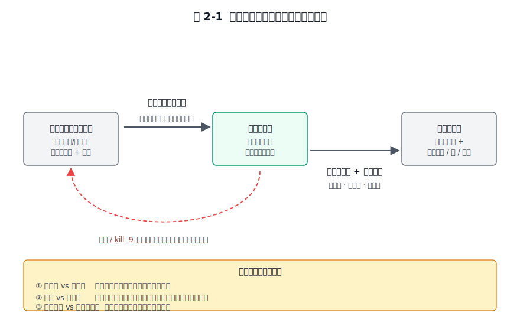
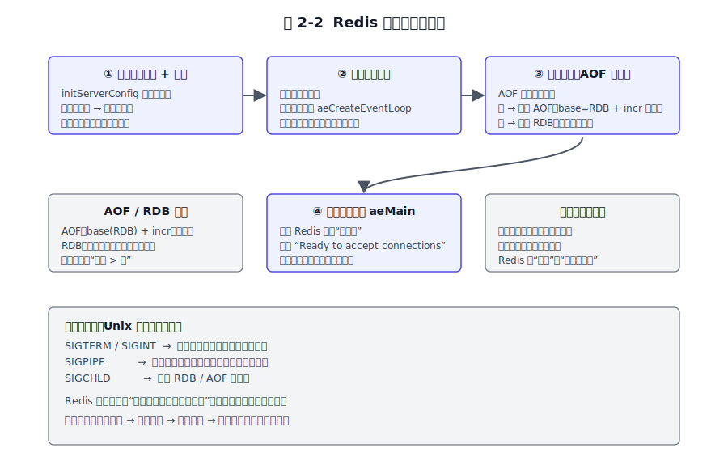
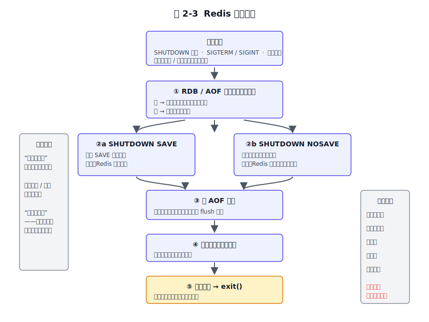
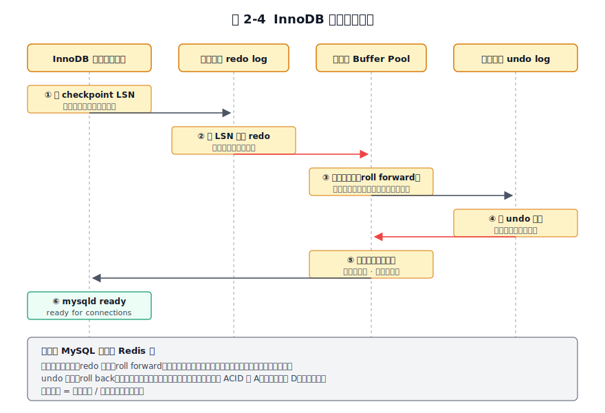
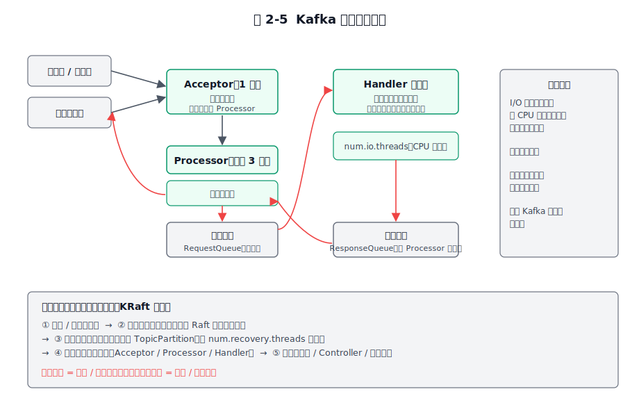
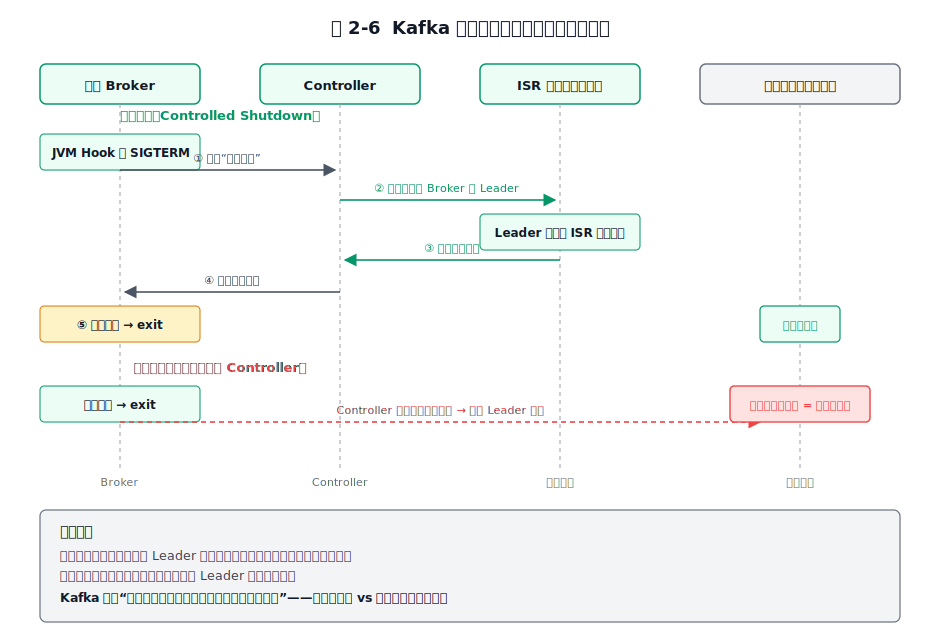

# 第 2 章 生命周期管理 — 优雅启动与关闭的艺术

## 本章导读

凌晨三点发版，你敲下 `kill -9` 想快速重启服务，结果第二天发现丢了十几条刚写入的订单。启动和关闭看似只是"开关"，实际上藏着最危险的状态转换——进程从"可执行文件"到"可对外服务"中间要恢复内存状态、重放未完成的事务、重建连接；关闭时则要保证正在处理的请求不丢、内存里的数据落盘、该移交的职责交接清楚。一次粗暴的断电式停机，丢的可能是几秒数据，也可能是整整一批事务。

同样是"杀进程"，后果却天差地别。同样是 `kill -9`，对 Redis 通常只是丢掉最近一小段时间的数据（具体取决于 AOF 的 fsync 策略——`everysec` 默认是约 1 秒量级的数据窗口，`always` 风险更低，纯 RDB 则丢自上次快照起的全部），对 MySQL 可能要做崩溃恢复（crash recovery），对 Kafka 则可能触发分区的 Leader 重选、让上游业务短暂抖动。差别为何如此之大？因为三家的启动和关闭承载着截然不同的承诺——Redis 主要对自己负责，MySQL 要守护事务语义，Kafka 还要对整个集群负责。

**一个进程从可执行文件到"可对外服务"中间必须完成哪些事；为什么不能直接断电；以及"优雅（graceful）"二字到底优雅在哪里。**同样是 `kill -9`，为什么 Redis 只丢几秒、MySQL 要崩溃恢复、Kafka 要重选 Leader？答案藏在它们对"启动和关闭"这件事截然不同的承诺里。

## 2.1 问题的本质

**启动的本质是状态机重建。** 进程一旦重启，内存里的状态全部归零。启动要做的，是把"上次崩溃或关闭时落到磁盘的那份不完整状态"重建为"一个一致、可对外服务的新状态"。一个数据库启动后如果还能看到崩溃前那一刻已经提交的事务，那是它在启动期老老实实重放了日志。一个缓存启动后看到的是几秒前的数据，那是它接受了"快但不全"的承诺。所以判断启动有没有"成功"，是看它恢复出来的状态是否可信。

**关闭的本质是状态机快照加上资源释放。** 关闭要回答两个问题：当前内存里哪些状态必须落盘？对外占用（连接、文件锁、集群成员身份）怎么干净地交还？没做完这两件事就退出，等于给下次启动埋雷。Redis 的 `kill -9` 之所以"只是丢几秒数据"，是因为它本来就把内存当主战场，磁盘只是辅助。MySQL 的 `kill -9` 之所以要崩溃恢复，是因为它承诺了事务语义，必须在启动期把"崩溃那一刻到底哪些事务算数"重新算清楚。

贯穿全章的有三对共同矛盾，它们会在后文三家做法中反复出现：

1. **一致性 vs 可用性。** 启动时多恢复一步更安全，但用户等得更久。关闭时多刷一页更安全，但停服时间更长。
2. **速度 vs 确定性。** 是追求快速就绪（懒加载、跳过校验），还是追求启动后处于"已知的确定状态"（全量校验、预分配）。
3. **单机视角 vs 分布式视角。** 单机软件的关闭只关心自己。分布式组件的关闭是一个集群事件，要让 Leader 迁移、让副本同步可见。

图 2-1 把启动与关闭画成一对"对称"的过程：启动是重建，关闭是快照，中间任何一次崩溃或 `kill -9` 都会把系统强行推回"不完整状态"，逼着下次启动多做恢复工作。三对矛盾标在图的右侧，作为本章后续展开的红线。

图 2-1　启动与关闭作为状态机重建与快照的对称过程，三对矛盾贯穿全章。

三家的约束差异在这里先用一句话带过，具体留到深讲节。Redis 是单线程内存数据库，启动关闭要快，数据量直接决定恢复时长。MySQL 是关系型加 WAL（预写日志）的系统，启动必须做崩溃恢复，关闭必须保证事务语义。Kafka 是分布式加追加写日志（append-only log）的系统，启动要恢复分区日志，关闭要协调集群。

## 2.2 Redis 的做法

Redis 的生命周期以"快"著称，但快的背后是一组很硬的设计取舍。本节把 Redis 从启动到关闭的完整链路拆成四段启动、两条关闭路径来理解，重点看它在每个分叉口选了什么、弃了什么。

### 启动四段式

**第一段：配置默认值加覆盖。** Redis 先用 `initServerConfig` 给所有参数设一个合法的默认值（比如端口 6379、TCP backlog 511），再依次读配置文件、解析命令行参数逐层覆盖。这里的设计取舍是"先全量设默认值再逐层覆盖"，好处是任何参数在任何时刻都有合法值，整个生命周期里都不会出现"未初始化"这个 bug 类别。很多线上事故就栽在某个配置项忘了初始化。

**第二段：基础设施就位。** 这一段做四件事：注册信号处理器（SIGTERM/SIGINT 触发优雅关闭、SIGPIPE 忽略、SIGCHLD 回收 RDB/AOF 子进程）。调用 `aeCreateEventLoop` 创建事件循环。分配数据库数组。打开监听端口。这里有一个关键的取舍——**核心数据结构在启动期预分配而非懒加载**。Redis 会在启动期就把数据库数组、共享对象（shared objects，例如预创建 0–9999 共 10000 个共享整数对象以复用常见小整数）等核心结构一次性分配好，而不是等到运行期第一次用到时才分配。代价是启动即占用基线内存，换来的是运行期内存行为的确定性：核心路径上不会因为首次分配而出现意外的延迟毛刺。Redis 优先保证启动确定性，代价是基线内存占用。

**第三段：数据恢复——AOF 优先于 RDB。** 如果 AOF（仅追加文件）开启且存在，Redis 就加载 AOF；否则加载 RDB（快照文件，二进制格式，快但只到上次快照点）。图 2-2 完整呈现了这段流程。Redis 7.0 引入了多分片 AOF（multi-part AOF），AOF 目录里的 base 文件本身就是 RDB 格式，后面才跟着记录增量写命令的 incr 文件——所以"加载 AOF"其实是先按 RDB 二进制快速加载 base，再重放 incr 里的命令，加载速度比 4.x 以前那种"纯命令重放"快很多。

图 2-2　Redis 启动四段式：配置 → 基础设施 → 数据恢复 → 事件循环，数据恢复段含 AOF/RDB 分支。

AOF 优先是因为它携带的信息严格多于单独的 RDB。即便 7.0 之后 base 文件本身是 RDB 格式，AOF 目录里还多了一份记录"上次重写之后所有写命令"的 incr 文件——加载 base 只能恢复到重写点，再重放 incr 才能恢复到最近一次刷盘。RDB 单独存在时则只有那一个时点。完整优先于快。RDB 在做全量备份、副本同步、快速重启这些场景里仍然是主力，只是在"启动恢复"这个具体场景，AOF 信息更全就该让位给它。

**第四段：进入事件循环。** `aeMain` 一启动，Redis 才真正算"可服务"。控制台会打印一条 `Ready to accept connections` 日志——这是状态机就绪的外显里程碑，不是普通的输出，运维脚本就是靠 grep 这一行来判断 Redis 是否就绪。这种"在每个阶段切换处打一条语义明确的日志"的纪律，会在 2.6 节作为一条架构启示展开。

### 关闭：三种触发，两条路径

关闭有三种触发方式：客户端发 `SHUTDOWN` 命令、收到 SIGTERM/SIGINT、守护条件触发（比如内存超限被父进程监视退出）。无论哪种触发，进入的处理流程都一样，只是"存不存数据"这一步的选择不同。

图 2-3 画出了完整的关闭流程。

图 2-3　Redis 关闭流程：先处理 RDB/AOF 重写子进程，再按 SAVE/NOSAVE 决定存盘与否。

**第一步先看后台有没有 RDB 或 AOF 重写子进程在跑。** 如果有，要么等它完成，要么杀掉子进程。这是为了不留下半成品文件——RDB 和 AOF 都用"写临时文件再 rename"的方式落盘，子进程被杀意味着临时文件还在磁盘上，虽然不影响正确性（rename 不会发生），但会留下垃圾。等子进程完成更干净，代价是关闭耗时增加。

**第二步：刷盘与否由用户决定。** `SHUTDOWN SAVE` 会触发一次阻塞式 `SAVE` 落盘（主进程直接写 RDB，不 fork 子进程），适合 Redis 当主存用的场景；`SHUTDOWN NOSAVE` 直接跳过落盘，适合 Redis 当缓存用的场景，能做到秒级退出。这个设计反映了 Redis 对自身定位的包容——它不替你假设你是缓存还是主存，而是把选择权交给你。这种"配置即承诺"的思路在后文 MySQL 那里会以另一种形式出现。

**第三步刷 AOF 缓冲**，把内存里尚未落盘的追加命令 flush（刷盘）出去（如果开了 AOF）。**第四步关闭所有客户端连接**，通知对端、释放连接资源。**第五步释放资源并 exit**，交还文件锁、内存、进程身份。

### 信号即协议

Redis 把 SIGTERM/SIGINT 当作"操作系统请求我优雅退出"的信号，而不是立即终止的命令。这是 Unix 服务程序的经典范式——进程和操作系统之间通过信号协商，而不是被暴力杀死。`systemctl stop redis` 背后其实就是发一个 SIGTERM，Redis 收到后走完整的关闭流程。只有 SIGKILL（`kill -9`）才是操作系统不可屏蔽的"立即终止"，会跳过所有清理逻辑直接把进程拽走，留下没刷完的脏数据和没清理的临时文件。

这条信号即协议的范式，MySQL 也是这么做的；Kafka 稍有不同，它的进程跑在 JVM 里，SIGTERM 先由 JVM 的 Shutdown Hook 捕获，再交给应用代码走清理流程。范式相通，实现的层次不同。

到这里可以提炼出本节的设计原则：**Redis 把"关闭时是否落盘"交由用户选择——它不替你假设你是缓存还是主存。** 这种把承诺交给使用者、让使用者显式承担代价的设计，是 Redis 在"快速缓存"和"持久化主存"两种身份之间游走的根本原因。

## 2.3 MySQL 的做法

MySQL 的生命周期复杂度是三者中最高的。原因在于它必须守护一种 Redis 不需要操心、Kafka 也不严格保证的东西——事务语义（ACID）。这迫使 MySQL 在启动期多做一件 Redis 没有的事：崩溃恢复；在关闭期多做一件 Redis 没有的取舍：把数据清理工作在关机和开机之间来回搬运。

### 启动链路：多了"恢复"这一关键环节

MySQL 的启动分四段：配置加载、InnoDB 存储引擎启动、网络层加权限系统、服务循环。第二段是启动耗时的大头，也是和 Redis 的本质区别。

**配置加载段**按固定优先级搜索多个 my.cnf 路径（`/etc/my.cnf` 优先于 `~/.my.cnf` 等），再叠加命令行覆盖。取舍：多文件叠加给运维灵活性，代价是"配置到底在哪生效"成了常见的排障点——一个排查了一下午的"参数没生效"问题，根因往往是被 `/etc/my.cnf` 里某个默认值覆盖了。

**InnoDB 存储引擎启动段**是启动耗时的大头，分三步：

1. 初始化缓冲池（Buffer Pool），这是 InnoDB 缓存数据页的内存区。
2. 加载系统表空间（ibdata 文件），拿到数据字典（MySQL 8.0 起数据字典已迁移到独立的 `mysql.ibd` 文件，`ibdata1` 只存储 change buffer 和可选的 undo 日志；5.7 及更早版本数据字典仍在 `ibdata1` 中）。
3. **崩溃恢复**——读 checkpoint LSN（日志序列号），从该位置扫描重做日志（redo log），把 redo 里记录的所有页修改原样重放回数据页（这一步不分事务是否提交，先把崩溃那一刻缓冲池里的页状态原样还原），再用回滚日志（undo log）回滚所有未提交事务。

第三步是 MySQL 启动比 Redis 慢的根本原因。它必须把"崩溃那一刻内存里未持久化的页修改"和"事务的提交状态"分开处理：redo 重放先无差别地把所有页修改补回去（恢复出崩溃瞬间的物理页状态），undo 回滚再撤掉未提交事务留下的痕迹，最终恢复出严格的事务一致性——已提交的全部保留，未提交的全部回滚。这是 ACID 里原子性（Atomicity）和持久性（Durability）在启动期的兑现。图 2-4 把崩溃恢复画成时序。

图 2-4　InnoDB 崩溃恢复：从 checkpoint LSN 扫描 redo 无差别重放所有页修改，再用 undo 回滚未提交事务。

注意 redo 重放和 undo 回滚是两个方向相反的动作，分工也不同。redo 重放是"往前补"——把已经写入 redo 但还没刷到数据页的修改无差别补回去，恢复出崩溃瞬间的物理页状态（这一步不区分事务是否提交，redo 本身只记录页级物理修改）；undo 回滚是"往后撤"——根据事务提交状态，把尚未 commit 的事务对数据做的修改撤销掉。一进一退之后，缓冲池里的数据页状态恰好停在"所有已提交事务都生效、所有未提交事务都消失"的一致点上。MySQL 启动慢但启动后状态可信——它把崩溃那一瞬间事务的中间状态重新算了一遍。

崩溃恢复的耗时取决于崩溃那一刻 redo log 里有多少未落盘的修改、有多少未提交的事务。大事务一旦在崩溃点未提交，启动期的 undo 回滚会非常慢，因此 DBA 不建议让大事务长跑。

**网络层加权限系统段**建立 Unix 和 TCP 监听 socket，从 mysql 系统表加载用户权限到内存。改完权限之后要执行 `FLUSH PRIVILEGES`——内存里的权限快照和磁盘表对不上，需要重新加载。

**服务循环段**进入"每连接一线程"（或线程池）的连接处理。至此 MySQL 才对外打印 `ready for connections`。

### 关闭的三档模式：本章重头戏

MySQL 把"关闭时做多少清理"做成一个可配置参数 `innodb_fast_shutdown`，取 0、1、2 三档。这是"一致性 vs 可用性"在关闭场景的具象化——你愿意为安全付出多少停服时间。表 2-1 把三档的取舍并排放出来。

**表 2-1　innodb_fast_shutdown 三档对比**（这是 MySQL 专属参数，Redis 与 Kafka 无对应概念）

| 维度 | 0 = 完全关闭 | 1 = 快速关闭（默认） | 2 = 模拟崩溃 |
|------|--------------|----------------------|--------------|
| 关闭时做什么 | 刷所有脏页 + 完整 purge（清理已无用的 undo 记录）+ change buffer 合并 + 完整 checkpoint | 刷脏页但跳过完整 purge 与 change buffer 合并，留给下次启动或后台线程处理 | 只刷 redo 不刷数据页，近乎 `kill -9` |
| 启动时做什么 | 几乎不需要崩溃恢复，启动快 | 少量恢复工作（清理上一次关闭遗留项） | 完整崩溃恢复，启动慢 |
| 适用场景 | 升级、大版本切换前，确保下次启动不踩坑 | 日常关闭重启 | 仅紧急停服，能接受较长启动恢复 |
| 关闭速度 | 慢 | 中等 | 快 |
| 启动速度 | 快 | 中等 | 慢 |

解读这张表的关键在一句话：同一份数据清理工作，要么在"关闭时"做，要么在"下次启动时"做。档位 0 把工作前置到关闭期，换下次启动快。档位 2 把工作全部推迟到启动期，换关闭快。档位 1 在中间取折中。**所有"快"都是把工作推迟到另一个时刻**——后文 2.6 节会反复引用这条规律。

默认设为 1 而不是 0，因为运维的真实诉求通常是"关闭和启动总体可预测"——完全关闭会让关闭本身不可预测（脏页多时可能要等几分钟），而默认档把不确定的部分留给了启动期，至少启动慢是可预期的，关闭慢则往往是计划外停服，影响更大。

### 关闭慢的常见根因

实际运维中"为什么 mysqld 关不掉"是高频排障问题，常见根因有几类：大量脏页待刷（缓冲池大、写入密集，刷盘是随机 I/O，吞吐有上限）、长事务在跑（关闭时这些事务会被回滚，回滚使用 undo log 通过逻辑逆操作逐条撤销——注意 undo log 和 redo log 是两套独立的日志系统，回滚不是 redo 物理重放的"逆过程"，而是 undo 做逻辑回撤；回滚通常比正向写入更慢，事务越长越慢）、从节点二进制日志（binlog）同步等待（关闭要等从节点把 binlog 拉完）、全文检索（FTS）索引优化在跑。这些根因都指向同一个事实：**关闭不是孤立动作，它是事务、复制、后台任务的交汇点**。理解了这一点，再去读 `SHOW PROCESSLIST` 在关闭期的输出就能精准定位卡点。

**MySQL 用三档关闭参数把"数据清理工作"在关机和开机之间搬来搬去——所有"快"都是把工作推迟到另一个时刻。** 这条规律不仅适用于 MySQL，也适用于 Redis 的 SAVE/NOSAVE 和 Kafka 的普通关闭 vs 受控关闭，是生命周期设计里普适的取舍骨架。

## 2.4 Kafka 的做法

Kafka 的生命周期是分布式加追加写日志的范式。**关闭是一个集群事件。** 一个 Broker 下线，意味着它承载的那些分区副本从集群里消失，需要 Controller 重新计算谁是 Leader、哪些副本要补数据。所以 Kafka 的关闭设计核心不在"怎么刷自己的盘"，而在"怎么把自己的离开对集群的冲击压到最小"。本节先讲启动，再讲关闭，重点剖析受控关闭（Controlled Shutdown）和 KRaft 模式带来的变化。

### 启动链路：八阶段

Kafka Broker 的启动可以拆成八个阶段，其中元数据初始化、日志恢复、三层网络这三段，是理解 Kafka 启动的关键。

1. **日志与配置初始化。** 加载 `server.properties`，初始化日志目录。
2. **元数据管理初始化（KRaft 核心）。** KRaft 模式自 3.3 起对新集群进入生产可用（KIP-833），3.5 起 ZooKeeper 模式被标记弃用，ZK→KRaft 迁移工具在 3.4 以 Early Access 引入、3.5–3.6 为 preview、3.8 起进入生产可用；3.9 是最后一个支持 ZK 模式的 bridge release，4.0 彻底移除 ZooKeeper。在这个模式下，元数据本身变成了一份用 Raft 复制的日志。节点启动时要先追上这份元数据日志，才能知道"自己是谁、该服务哪些分区、当前 Controller 是谁"。这是 KRaft 模式与旧 ZK 模式启动流程的最大分水岭：旧模式下这些信息来自外部 ZooKeeper 集群，KRaft 模式下元数据和数据日志住在一起、用同一套机制管理。
3. **日志管理器启动（恢复重头戏）。** 加载每个数据目录，为每个 TopicPartition（主题分区）恢复日志：校验日志段（segment）、恢复活跃段、重建索引。当集群分区数巨大时（比如上万分区），这一段是启动瓶颈，靠 `num.recovery.threads.per.data.dir` 并行加速。为什么分区恢复是瓶颈？因为每个分区都要单独校验、单独重建索引，没有"批量恢复"这种捷径，只能靠多线程把活分摊开。
4. **三层网络架构。** 图 2-5 画出了它的布局。

图 2-5　Kafka 三层网络架构：Acceptor 接连接、Processor 解析协议、Handler 线程池执行，请求与响应走队列。

三层网络的设计意图是把 I/O 密集（收发包）和 CPU 密集（业务处理）分到不同的线程池，避免互相拖累。最外层 Acceptor（1 个）负责接收新连接，轮询分发给 Processor。Processor（默认 3 个，对应 `num.network.threads`）负责解析协议帧，把请求塞进共享的请求队列。Handler 线程池（`num.io.threads` 控制，默认 8）从请求队列里取请求执行真正的业务（读写日志、副本同步），把响应塞回每个 Processor 一个的响应队列，由 Processor 发回客户端。这种"多队列、多线程池"的分层让收发和处理解耦——处理慢不会阻塞收发，收发慢也不会饿死处理线程。第 4 章会从分层架构的角度再次回到这个设计。

5. **副本管理器启动**，开始拉取或等待副本同步。
6. **控制器启动**（如果该节点是 Controller 候选），接管集群元数据的协调。
7. **注册到集群**，对外宣告"我在线了"。
8. **后台线程启动**，进入服务态。

八个阶段全部走完，Kafka 才对外打印 `[KafkaServer id=0] started` 这条就绪日志。和 Redis 的 `Ready to accept connections`、MySQL 的 `ready for connections` 一样，这条日志是状态机的里程碑标记，运维靠它判断就绪。

### 关闭：普通关闭 vs 受控关闭

Kafka 的关闭分两种路径，普通关闭和受控关闭，区别在于"是否提前告知 Controller 自己要走"。JVM 进程收到 SIGTERM 后，先触发 JVM Shutdown Hook，Hook 内部再走应用层的关闭流程。

**普通关闭**（受控关闭被禁用或失败时）的步骤是：标记停服（停收新请求）→ 关网络层（处理完在途请求）→ 停控制器 → 停副本管理 → **强制刷盘所有日志** → 清临时文件和锁 → 退出。这条路径发生在受控关闭被禁用（`controlled.shutdown.enable=false`）或受控关闭失败时。此时 Broker 自己该做的清理都做了，但它**不主动告知 Controller 自己要走**——Controller 是在 Broker 退出后通过心跳 / 会话超时才发现它没了，这时候才去重新选举那些原本由它当 Leader 的分区。选举期间分区短暂不可用，客户端会看到抖动。注意，默认配置下 Kafka 走的是受控关闭路径（见下一段），普通关闭只是降级兜底。

**受控关闭（Controlled Shutdown）**让 Broker 在真正退出之前，先发请求给 Controller，告诉它"我要走了"。Controller 收到后，**提前把该 Broker 上的 Leader 副本迁移到 ISR（同步副本集合）里还活着的其他副本**——它会向这些副本发 LeaderAndIsr 请求，让它们接任 Leader。等所有 Leader 都迁移完，Controller 回执"你可以走了"，Broker 才走完整的刷盘退出流程。图 2-6 把这条时序和普通关闭画在一起做对照。

图 2-6　受控关闭：Broker 先告知 Controller，Controller 提前迁移 Leader 后才放行；对照普通关闭的抖动窗口。

两种关闭的取舍：普通关闭快，但客户端会看到分区短暂不可用的抖动窗口；受控关闭慢（要等 Leader 迁移完成），但客户端感受到的抖动更小。Kafka 的取舍是：牺牲关闭速度换取集群稳定性——Broker 退出前多做一段协调工作，换来的是上游业务少经历一次突兀的 Leader 重选。在以可用性为首要目标的中间件场景里，这种取舍成立。

受控关闭也不是万能。如果 Controller 不可达，或者迁移超时（受控关闭有超时阈值），Broker 会退化为普通关闭，不再死等。这是分布式系统常见的"有更好选项时就用，没有就降级"的工程化思路。受控关闭由开关 `controlled.shutdown.enable`（默认开启，只读参数）控制是否启用；`controlled.shutdown.max.retries` 与 `controlled.shutdown.retry.backoff.ms` 控制重试次数与退避间隔——这些参数名在 KRaft 与 ZK 模式下保持一致。

### 追加写日志对生命周期的影响

Kafka 的日志是 append-only（仅追加）的，这一性质对生命周期有决定性影响。恢复时，Kafka 只需要"找到最后一段完整写入的位移（offset）并截断未完整部分"，不需要像 MySQL 那样重放事务或回滚事务。一条日志要么完整写入、要么不写，不存在"写了一半"的中间状态需要回滚。Kafka 的日志恢复通常比 MySQL 崩溃恢复轻——**数据结构越简单，恢复语义越简单。** 这个结论是横向对比里的一条主线，2.5 节会再次回到这里。

**在分布式系统里，优雅关闭是给集群留出交接职责的时间。** 受控关闭把这条原则落实成了具体协议——它不强求 Broker 走得快，只要求它在退出之前先把 Leader 的职责迁移到其他副本。

### 容器化环境下的生命周期

多数生产部署现已跑在 Kubernetes 上。K8s 给优雅关闭加了一道硬约束：SIGTERM → `terminationGracePeriodSeconds`（默认 30 秒）→ SIGKILL。SIGKILL 即 `kill -9`，跳过一切清理。各系统必须在 grace period 内完成受控关闭，否则被强行杀死。

**Redis** 的 AOF 重写子进程可能远超 30 秒，被 SIGKILL 则新写入数据没落盘。preStop hook 里先触发 `BGSAVE` 再走正常关闭，或调长 grace period。

**MySQL** 默认 `innodb_fast_shutdown=1`，被 SIGKILL 打断时 redo log 可能不完整。设 `innodb_fast_shutdown=0` 并给 120 秒以上 grace period，确保完整刷脏和 checkpoint。

**Kafka** 受控关闭要等 Controller 迁移 Leader，若 Controller 负载高则 `controlled.shutdown.max.retries` 可能 30 秒内耗尽，退化为普通关闭。调大重试次数和背压间隔，grace period 设到 60-120 秒。

**实践清单：** preStop hook 主动检查条件而非 sleep；grace period = 刷盘/迁移耗时 + 30 秒余量；关闭期间 readiness probe 返回 false，避免 K8s 反复重启——印证 2.6 节"可观测性是状态机的外显"。

## 2.5 横向对比

把三家的启动与关闭做法并排放出来，可以看出"为什么不同"。表 2-2 沿六个维度展开，三栏顺序固定 Redis | MySQL | Kafka。

**表 2-2　三家生命周期六维对比**

| 维度 | Redis | MySQL | Kafka |
|------|-------|-------|-------|
| 启动复杂度与耗时主因 | 文件加载（AOF 加载 base+incr / RDB 读），快 | 崩溃恢复（redo 重放 + undo 回滚），最重 | 分区日志恢复 + 元数据同步，分区多时偏重 |
| 数据恢复语义 | 尽量恢复到最近（AOF 优先于 RDB） | 严格恢复出事务一致性（已提交保留、未提交回滚） | 截断到最后一致位移（append-only 的天然优势） |
| 关闭时的数据承诺与可配置性 | 用户可选存不存（SAVE / NOSAVE） | 默认最保守，三档可调（`innodb_fast_shutdown`） | 强制刷盘，无选项 |
| 关闭对集群 / 外部的影响 | 单机私事，不影响他人 | 单机私事（主从复制除外） | 集群事件（Leader 迁移、副本重平衡） |
| 关闭速度与可预测性 | 快（仅刷脏） | 慢且不可预测（事务回滚 + 脏页） | 中等（取决于受控关闭时 Leader 迁移耗时） |
| 与 OS / 运行时的交互范式 | 信号协议（SIGTERM） | 信号协议（SIGTERM） | JVM Shutdown Hook（底层仍是信号） |

从表里能读出四组结论。

**第一，复杂度排序与"数据结构 + 一致性承诺"强相关。** 启动复杂度大致是 MySQL > Kafka > Redis，关闭复杂度也大致同序。原因是承诺越强（事务语义、复制一致性），恢复时要算的账越多。Redis 的数据结构最简单（内存键值对 + 单线程），恢复就是重放命令。Kafka 的日志结构次之（追加写 + 位移），恢复就是截断。MySQL 的关系模型加事务最复杂，恢复要做 redo + undo 双向算账。承诺越强，恢复时的算账越多。

**第二，关闭的"可配置性"反映了各家的定位。** Redis 给出 SAVE/NOSAVE 两个开关，因为它要同时服务缓存和主存两种用户。MySQL 给出三档参数，让 DBA 按场景在关机和开机之间搬运工作。Kafka 不给单机选项，因为它的关闭本来就是集群事件，单机的"存不存盘"不构成问题（日志在 Leader 迁移后还能从其他副本恢复），真正的问题是"Leader 走了谁来接"。配置项的有无反映了设计取向。

**第三，单机 vs 分布式是分水岭。** Redis 和 MySQL 的关闭都是"对自己负责"——刷自己的盘、释放自己的资源、保证自己启动后状态正确。Kafka 的关闭是"对集群负责"——它的关闭动作里相当一部分是在和 Controller 通信，把 Leader 的职责交出去。这条分水岭在第 6 章（集群架构）会更深入展开，届时我们会看到 Leader 选举、ISR 维护等机制如何和这里的受控关闭衔接。

**第四，"快"的代价在不同家身上以不同形式呈现。** Redis 的快靠"内存优先 + 可选不落盘"。MySQL 的快靠"把清理工作推迟到启动期"。Kafka 的快靠"append-only 让恢复变简单"。三种快对应三种数据结构哲学，都在"减少启动期要算的账"。横向看下来，2.3 节那条"所有'快'都是把工作推迟到另一个时刻"在 Redis 和 MySQL 身上很直接，在 Kafka 身上则需要补一句：Kafka 的快还多一个来源——它压根没承诺要做那么多工作。

## 2.6 架构启示

从三家具体做法里提炼出五条可复用的生命周期设计原则。

### 启示一：确定性优先于速度

启动要到达一个"已知的、确定的状态"。Redis 预分配核心结构、MySQL 跑崩溃恢复、Kafka 恢复每个分区日志，本质都是为了启动后系统处于可预测状态——出问题时运维能精准定位"死在哪一步"。懒加载启动看似快，但运行期首次访问时才报错，故障更难定位；而且懒加载意味着"什么时候暴露问题"取决于负载，问题变得不可预测。

> **箴言一：系统的可靠性从启动那一刻就开始计息——启动要到达的是"确定"。**

这条原则的边界条件是：当启动时间本身成为可用性瓶颈时（比如 Kafka 万分区启动要几分钟），要靠并行恢复、检查点（checkpoint）等手段把确定性成本摊薄，而不是牺牲确定性。

### 启示二：优雅关闭 = 完成承诺 + 交还职责

优雅关闭做三件事：完成已接受的请求（履约）、持久化脏状态（守数据）、释放对外占用（清责）。在分布式系统里还要加第四件：把职责移交给别人（Kafka 受控关闭）。这四件事的顺序很重要——先履约、再守数据、再清责、最后移交，任何一步颠倒都可能造成"承诺未兑现就被打断"的窗口。

> **箴言二：关机是逐项兑现你启动时立下的全部承诺。**

这条原则的工程含义是：写一个服务的关闭流程，要回头问"启动时我对客户端、对存储、对集群分别立了什么承诺"，关闭流程就是把这些承诺一个一个兑现的过程。漏掉任何一个，下次启动就会用崩溃恢复或副本同步来替你补课——代价更高。

### 启示三："快"的本质是把工作推迟

MySQL 三档关闭、Redis SAVE/NOSAVE、Kafka 普通关闭 vs 受控关闭——所有"更快"的选项都是把某部分清理或迁移工作挪到别的时间点（下次启动、集群其他节点、或直接丢弃）。设计自己的系统时，要清醒地知道每个"快"背后被推迟的代价由谁承担。一个常见的坑是：为了让关闭看起来快，把清理工作全部推到启动期，结果启动期变成不可预测的黑洞，运维反而更难处理。合理的做法是让"快"对应可预测的推迟，而不是无限推迟。

### 启示四：分层 + 依赖先行

三家启动都遵循"配置 → 基础设施 → 核心服务 → 数据恢复 → 对外服务"的顺序。这个顺序是依赖关系的硬约束：网络层依赖存储引擎就绪（否则客户端连进来会拿到错误的错误信息），存储引擎依赖配置（否则不知道数据目录在哪），配置依赖默认值（否则未指定的参数无定义）。违反这个顺序（比如先开端口再初始化存储）会让客户端连进来得到错误的错误信息——系统处在半初始化状态，表现更为诡异。第 4 章会从更通用的角度展开"分层 + 依赖"的设计哲学。

### 启示五：可观测性是状态机的外显

"Ready to accept connections" / "mysqld: ready for connections" / "[KafkaServer id=0] started" 是状态机的里程碑标记，不是日志噪音。运维脚本靠 grep 它们判断就绪，故障复盘靠它们定位卡在哪一段。设计生命周期时，要在每个阶段切换处打一条语义明确、格式稳定的状态日志。日志的价值在于"出问题时能精确指认位置"——这要求日志在每一段都有，且文案稳定（不要随版本随意改），这样旧脚本和旧排障手册仍能用。本章 2.3 节 MySQL 关闭慢的排障、2.4 节 Kafka 受控关闭的超时定位，本质上都依赖这些里程碑日志。

五条启示相互关联。确定性优先（启示一）要求启动可预测，可观测性（启示五）是它的前提。分层依赖先行（启示四）是实现确定性优先的工程手段。优雅关闭（启示二）和"快即推迟"（启示三）则从关闭侧给出了和启动侧对称的两条规律。把它们合起来，就是一套从启动到关闭、从单机到分布式的完整生命周期设计纪律。

## 2.7 小结

启动是状态机重建——把不完整的磁盘状态重建为一致的可服务状态。关闭是承诺兑现——履约、守数据、清责，分布式场景下还要移交职责。优雅关闭需要为确定性和他人付出时间。三家从单线程内存（Redis）、关系型事务（MySQL）到分布式集群（Kafka），生命周期管理的复杂度随"承诺的范围"递增。归根结底，生命周期管理集中体现了软件工程里资源管理、错误处理与状态机设计这三件事。

其一是关闭时的"刷盘"承诺——Redis AOF/RDB、MySQL redo log、Kafka append-only log 的持久化语义，本质上都是"快与持久"的取舍，这正是第 3 章（内存与磁盘的管理）要展开的核心矛盾。其二是"分层 + 依赖先行"的初始化纪律，将在第 4 章（分层架构）从更通用的角度继续展开。
