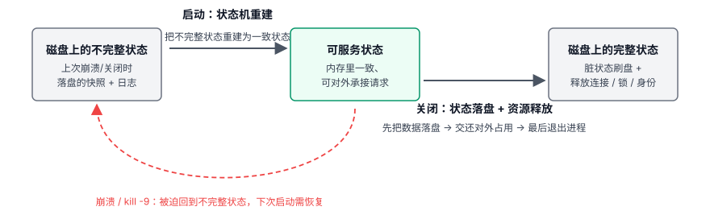
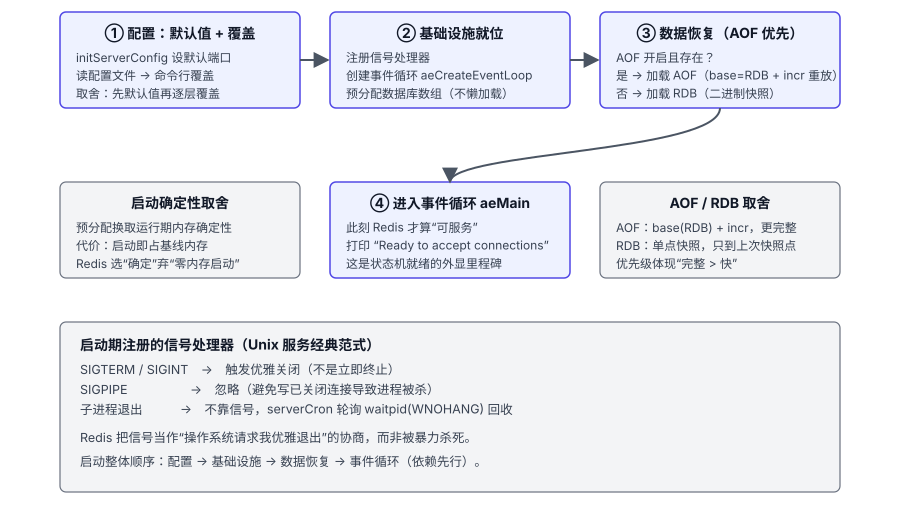
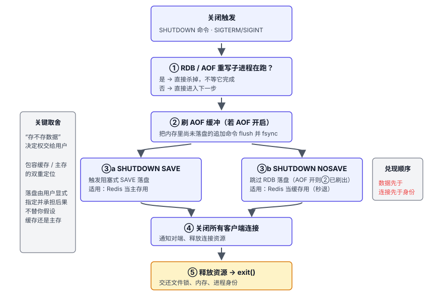
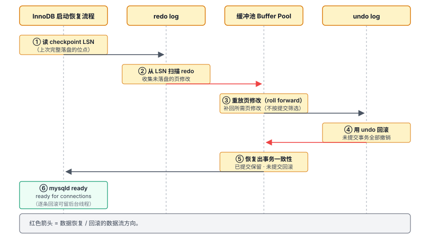
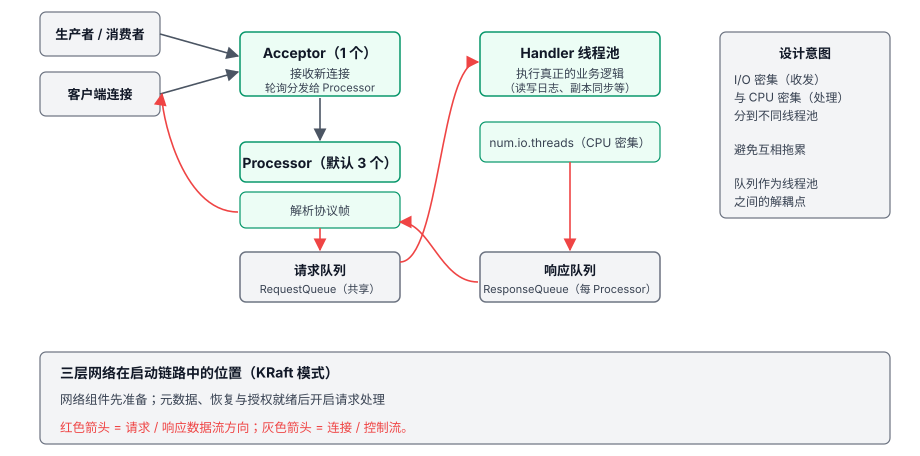
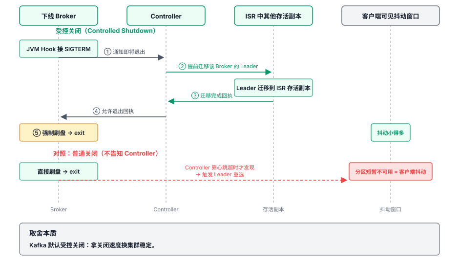

# 第 3 章 生命周期管理 — 优雅启动与关闭

## 本章导读

凌晨三点发版，你敲下 `kill -9`，打算结束进程后重新启动。我在真实项目里这么干过，第二天发现丢了数据——进程被强制结束，没有机会完成清理和持久化收尾。启动和关闭看似只是"开关"，实际要处理的却是：启动时恢复数据、确认事务状态、准备对外服务；关闭时处理在途请求、保存必要的数据、交接集群职责。忽略其中一步，重启就可能变成一次事故。

同样是 `kill -9`，Redis 可能丢失尚未持久化的数据（丢多少取决于持久化配置，详见第 4 章），MySQL 可能要做崩溃恢复（crash recovery），Kafka 则可能触发分区的 Leader 重选、让上游业务短暂抖动。影响范围还取决于部署方式：单机实例需要恢复本地状态，Redis、MySQL 的复制或集群部署也可能触发故障转移，Kafka Broker 下线则会影响它承载的分区。

它们要恢复的状态不同，退出时需要收尾的任务也不同。

## 3.1 问题的本质

**启动的本质是状态机重建。** 对这些有状态软件来说，就是依据配置和已有数据，重新建立可以处理请求的运行状态：Redis 重建内存键空间，MySQL 确定事务状态，Kafka 恢复分区日志和节点职责。除了进程有没有跑起来，还有它能否正确处理接下来的请求。

**关闭的本质是状态保存与职责交接。** 退出前要想清楚：哪些数据必须保存，哪些工作可以留到下次启动，哪些职责需要交给其他节点。Redis 的持久化配置、MySQL 的关闭档位、Kafka 的 Leader 交接，都在处理这些问题。强制终止跳过了正常收尾，后果取决于当时还有什么工作没完成。

贯穿全章的有三对共同矛盾，它们会在后文中多次出现：

1. **收尾工作与停服时间。** 哪些清理必须在退出前完成，哪些可以留到下次启动或后台处理？MySQL 的关闭就是这种选择。
2. **提前准备与按需初始化。** 哪些资源要在启动时准备好，哪些可以等到用时再创建？前者增加启动时间与初始占用，后者把一部分等待留给首次访问。
3. **单机视角 vs 分布式视角。** 单机软件的关闭只影响自身。分布式组件的关闭是一个集群事件，要让 Leader 迁移、让副本同步可见。

图 3-1 把启动与关闭画成一对"对称"的过程：启动是重建，关闭是保存与交接，中间任何一次崩溃或 `kill -9` 都会把系统重新拉回"不完整状态"，下次启动就需要做一些恢复工作。

图 3-1　启动与关闭作为状态机重建与保存的对称过程。

## 3.2 Redis 的做法

**Redis 的全部数据都在内存里**，这是其生命周期设计的前提。 一旦进程重启，所有键值对全部消失。不像 MySQL 有磁盘上的数据文件兜底，也不像 Kafka 有磁盘上的日志段做持久化。Redis 启动的本质，就是从磁盘上的 RDB 快照或 AOF 日志里，把数据一条条加载回内存，重建整个键空间。数据量越大，这个过程越久。一个几十 GB 的实例从加载到就绪可能要几分钟，这期间整个实例不可用。所以 Redis 的启动链路把能省的步骤都省掉，能并行的就并行。

同样，Redis 的关闭也要快。但快的同时还必须考虑一个核心问题：退出前要不要把内存里的最新数据再落一次盘？还是接受丢掉最近几秒的写入？这个选择取决于Redis是作为缓存还是主存。

### 启动四阶段

**第一段：先设默认值，再逐层覆盖。** Redis 先给所有参数设一个合法的默认值（比如端口 6379、TCP backlog 511），再依次读配置文件、解析命令行参数，逐层覆盖。好处是未显式配置的参数也有默认值，后续初始化阶段不必依赖未初始化的配置项。很多线上事故就出在某个配置项忘了初始化。

**第二段：基础设施就位。** 注册信号处理器、创建事件循环、分配数据库数组、打开监听端口。这些准备完成后，进程才具备加载数据和处理请求的基础。SIGTERM/SIGINT 如何触发优雅关闭，下文再讲。

这里有一个关键的取舍：**核心基础结构在启动期就一次性预分配，不做懒加载**。启动段就把数据库数组、共享对象（shared objects，例如预创建 0–9999 这 10000 个整数对象供复用）等结构分配到位，留到运行期第一次用到时直接取用。代价是启动时就会占用相应的内存，换来的是运行期内存行为的确定性：核心路径上不会因为首次分配而出现意外的延迟毛刺。

**第三段：数据恢复。AOF 优先于 RDB。** 启用 AOF 时，Redis 按 AOF 路径恢复；未启用时，才尝试加载独立 RDB。AOF 文件缺失不会自动触发向独立 RDB 的回退。Redis 7.0 的多部分 AOF 通常先加载 RDB 格式的 base，再重放 incr 中的增量命令。图 3-2 展示启动流程，文件组织的演进留到第 8 章。

图 3-2　Redis 启动四段式：配置 → 基础设施 → 数据恢复 → 事件循环，数据恢复段含 AOF/RDB 分支。

AOF 通常比定期生成的独立 RDB 快照保留更多近期写入，所以恢复优先走 AOF。这里优先考虑的是恢复点，而不是只比较哪种文件加载更快；独立 RDB 仍适合备份与全量同步。

**第四段：进入事件循环。** 完成本地数据加载等准备后，Redis 打印 `Ready to accept connections`，随后进入 `aeMain` 处理事件。启动日志让运维知道流程走到了哪一步。

### 关闭：两种触发，一套流程

关闭有两种触发方式：客户端发 `SHUTDOWN` 命令，或进程收到 SIGTERM/SIGINT 信号（systemd stop、容器编排的滚动重启最终都落到这条信号路径上）。无论哪种触发，进入的处理流程都一样，只是"存不存数据"这一步的选择不同。7.0 起，流程之前还多一道等待：还有落后副本时，先暂停写入，等它们追平复制位点再开始关闭，最多等 `shutdown-timeout`（默认 10 秒），超时就记下落后副本，照常退出；`SHUTDOWN NOW` 可跳过这道等待。

图 3-3 画出了关闭流程的主体。

图 3-3　Redis 关闭流程：先处理 RDB/AOF 重写子进程，刷 AOF 缓冲，再按 SAVE/NOSAVE 决定 RDB 落盘与否。

**第一步先看后台有没有 RDB 或 AOF 重写子进程在跑。** 一般会终止这些子进程，不等它们完成。但如果首次 AOF 重写尚未完成、还没有可用的 AOF 正本，普通关闭会被拒绝，以免退出后无法恢复数据；`SHUTDOWN FORCE` 可以跳过这项保护。已有持久化正本时，终止未完成的后台生成任务不会把临时结果切换为正本。

**第二步刷 AOF 缓冲**，把内存里尚未落盘的追加命令刷（flush）出去并 fsync 到磁盘（如果开了 AOF）。

**第三步是否生成 RDB 由用户决定。** `SHUTDOWN SAVE` 由主进程生成一次快照，`SHUTDOWN NOSAVE` 跳过这项工作，省去生成快照的时间。NOSAVE 跳过的只是 RDB；AOF 已开启时仍要刷盘。是否需要这次快照，由用户根据恢复需要选择，同一套关闭流程因此可以服务不同场景。

**第四步关闭所有客户端连接**，通知对端、释放连接资源。**第五步释放资源并 exit**，交还文件锁、内存、进程身份。

### 用信号触发优雅关闭

Redis 把 SIGTERM/SIGINT 当作"操作系统请求我优雅退出"的信号，收到后走完整的关闭流程，而非立即终止。这是 Unix 服务程序的经典范式。进程和操作系统之间通过信号协商退出，避免被暴力杀死。`systemctl stop redis` 背后其实就是发一个 SIGTERM。只有 SIGKILL（`kill -9`）才是操作系统不可屏蔽的"立即终止"信号，会跳过所有清理逻辑直接结束进程，留下没刷完的脏数据和没清理的临时文件。

这种用信号触发优雅关闭的做法，MySQL 也一样；Kafka 稍有不同，它的进程跑在 JVM 里，SIGTERM 先由 JVM 的 Shutdown Hook 捕获，再交给应用代码走清理流程。思路相通，只是实现的层次不同。

## 3.3 MySQL 的做法

MySQL 的生命周期管理需要保住事务语义（ACID）。这使它在启动期需要处理崩溃恢复，在关闭期需要权衡：同一批数据清理工作，是关机时做完，还是留到以后处理。

### 启动链路：事务恢复是关键环节

MySQL 的启动分四段：配置加载、InnoDB 存储引擎启动、网络层与权限系统、服务循环。第二段涉及事务恢复。Redis 主要重建内存键空间，InnoDB 还需要确定事务的提交状态，并处理重做与回滚。

**配置加载段**需要汇总配置文件、命令行和持久化变量等来源。常规配置先读文件，再处理命令行；启用持久化变量加载时，`mysqld-auto.cnf` 中的设置还会参与后续处理。多来源方便运维，也让"我改了配置，为什么没生效"成为常见问题。排查时，要看最终值来自哪里，而不只看刚修改的那个文件。

**InnoDB 存储引擎启动段**是启动耗时的大头，分三步：

1. 初始化缓冲池（Buffer Pool），这是 InnoDB 缓存数据页的内存区；页读进内存后被改过、还没刷回磁盘的版本称为脏页（dirty page）。
2. 读取表空间和数据字典，获得表、索引等元数据，为恢复和访问数据做好准备。
3. **崩溃恢复**。读 checkpoint 对应的 LSN（日志序号），checkpoint 标记"此位点之前的脏页都已刷回数据文件"。从该位置扫描 redo log，重放其中的页修改，再用 undo log 回滚未提交事务。

第三步会增加 MySQL 的启动工作量。MySQL 必须把"崩溃那一刻内存里未持久化的页修改"和"事务的提交状态"分开处理，最终恢复出严格的事务一致性：已提交的全部保留，未提交的全部回滚。图 3-4 把崩溃恢复画成时序图。

图 3-4　InnoDB 崩溃恢复：从 checkpoint LSN 扫描 redo 重放所需页修改，不按事务是否已提交筛选，再用 undo 回滚未提交事务。

redo 重放和 undo 回滚分工不同。redo 是"往前补"：依据已有日志补上需要恢复的页修改，这一步不按事务是否已提交来筛选。undo 是"往后撤"：撤销未提交事务留下的修改。先恢复页，再处理事务状态，两项工作配合，才能恢复出一致的数据。

恢复耗时主要看两项工作量：多少已记录在 redo 中的修改还没写回数据页，多少未提交事务需要回滚。大事务会增加回滚负担，所以通常建议是：大事务不许长时间运行，再急也要拆小。

回滚不一定全部挡在启动前。InnoDB 完成必要的 redo 恢复后，可以先接受连接，再由后台继续回滚；新请求仍可能因这些事务持有的锁而等待。因此，`ready for connections` 不代表业务延迟已经恢复正常。

**网络层与权限系统段**建立 Unix 和 TCP 监听 socket，从 mysql 系统表加载用户权限到内存。

**服务循环段**进入"每连接一线程"（或线程池）的连接处理模式。至此 MySQL 才对外打印 `ready for connections`。

### innodb_fast_shutdown：把清理工作在关机与开机之间分摊

MySQL 把"关闭时做多少清理"做成一个可配置参数 `innodb_fast_shutdown`，取 0、1、2 三档。三档之间主要权衡清理工作的时机：关闭前做得越少，下次启动可能需要完成的恢复工作就越多。三档都以保留已提交事务为前提，不能把更慢的关闭直接等同于更高的一致性。表 3-1 把三档的取舍并排放出来。

**表 3-1　innodb_fast_shutdown 三档对比**

| 维度 | 0 = 完全关闭 | 1 = 快速关闭（默认） | 2 = 模拟崩溃 |
|------|--------------|----------------------|--------------|
| 关闭时做什么 | 刷所有脏页 + 完整 purge（清理已无用的 undo 记录）+ 修改缓冲合并 + 完整 checkpoint | 刷脏页但跳过完整 purge 与修改缓冲合并，留给下次启动或后台线程处理 | 刷 redo，不刷数据页；Server 层仍有序收尾，下次启动依靠崩溃恢复 |
| 启动时做什么 | 几乎不需要崩溃恢复，启动快 | 正常快速关闭后启动；未做完的清理在运行期继续 | 完整崩溃恢复，启动慢 |
| 适用场景 | 升级、大版本切换前，确保下次启动不出问题 | 日常关闭重启 | 仅紧急停服，能接受较长启动恢复 |
| 关闭速度 | 慢 | 中等 | 快 |
| 启动速度 | 通常较快 | 通常较快 | 需进行崩溃恢复 |

这是 MySQL 专属参数，另外两家没有对应概念。三档对比下来，规律只有一条：**每种"快"的做法，都是把一部分工作推迟到别的时刻完成**。

默认设为 1 而不是 0，是因为完整 purge 和修改缓冲合并在繁忙库上可能耗时很久。这些工作可以留到启动后由后台线程逐步处理，日常重启时通常不必为它们延长关闭时间；退出仍要处理脏页刷盘和事务回滚。只有升级、大版本切换这类希望下次启动干干净净的场景，才值得提前用档位 0 关一次。

### 关闭慢的常见根因

实际运维中"为什么 mysqld 关不掉"是高频排障问题，常见根因有几类：

1. **大量脏页待刷。** 缓冲池大、写入密集，刷盘是随机 I/O，吞吐有上限。
2. **长事务在跑。** 关闭时这些事务会被回滚。回滚通过 undo log 的逻辑逆操作逐条撤销修改，通常比正向写入更慢，事务越长越慢。
3. **从库要等复制线程退出。** 从库关闭要等 SQL 线程回放完当前事件组再停；主库关闭则直接断开 dump 线程，并不等从库把 binlog 拉完。
4. **全文检索（FTS）索引优化在跑。**

这些根因都指向同一个事实：**关闭是事务、复制、后台任务的交汇点**。发起关闭前，`SHOW PROCESSLIST` 可以帮助检查活动会话和长事务；关闭开始后，服务器会停止接入并断开已有连接，后续进度需要结合错误日志和存储 I/O 状态判断。

## 3.4 Kafka 的做法

Kafka 的生命周期管理围绕分布式追加写日志展开。**关闭是一个集群事件。** 一个 Broker 下线，意味着它承载的那些分区副本从集群里消失，需要 Controller（Kafka 的集群控制器角色）重新计算谁是 Leader、哪些副本要补数据。所以 Kafka 关闭设计的核心是"怎么把 Broker 下线对集群的冲击降到最小"，关闭时刷盘只是最基础的一步。

### 启动链路：服务就绪前的依赖

以 Kafka 3.9 的 KRaft 模式为例，启动过程里最要紧的是元数据、日志恢复和网络服务之间的依赖，部分准备工作会交错进行。

1. **准备配置与节点角色。** 加载配置、检查日志目录，确定进程承担 Broker、Controller，还是两种角色。合并部署时先启动 Controller 组件；独立 Broker 则连接 Controller 组。
2. **取得元数据，恢复本地日志。** Broker 需要知道自己负责哪些分区，再检查相应日志、恢复日志段和索引。元数据追赶与部分准备工作可以交错进行，分区多时，日志恢复可能成为启动瓶颈。
3. **满足条件后才接请求。** 网络组件准备好，不等于已经能对外服务。必要的恢复、元数据同步和授权准备完成，并获得控制面允许后，Broker 才开启请求处理。

以 Kafka 3.9 的 KRaft 模式、`node.id=0` 为例，启动完成后会打印 `[KafkaRaftServer nodeId=0] Kafka Server started`。它和 Redis 的 `Ready to accept connections`、MySQL 的 `ready for connections` 一样，都可用来识别启动完成。

元数据管理正处在从 ZooKeeper 到 KRaft 的换代中——KRaft 自 3.3 起对新集群达到生产可用状态，Kafka 自 4.0 起彻底移除 ZooKeeper（完整编年史见第 7 章）。

图 3-5　Kafka 三层网络架构：Acceptor 接连接、Processor 解析协议、Handler 线程池执行，请求与响应走队列。

图 3-5 展示了请求如何进入 Broker：Acceptor 接收连接，Processor 负责网络读写，Handler 处理请求，队列在它们之间传递工作。对本章而言，关键是这些组件准备好之后，还要满足启动条件，才能处理业务请求。线程分工与队列背压的取舍，留到第 5 章展开。

### 关闭：普通关闭 vs 受控关闭

Kafka 的关闭分两种路径，普通关闭和受控关闭；受控关闭在退出前协调 Leader 迁移，并等待 Controller 批准。JVM 进程收到 SIGTERM 后，先触发 JVM Shutdown Hook，Hook 内部再走应用层的关闭流程。

受控关闭被禁用（即 `controlled.shutdown.enable=false`）或执行失败时，Broker 会执行**普通关闭**。以 Kafka 3.9 的 KRaft 模式为例，Broker 先停止网络请求处理并关闭连接，再关闭请求处理线程、协调器和副本管理等组件，由日志管理器刷盘并收尾后退出。这里不保证所有在途请求都能完成并把结果返回客户端；连接中断时，客户端可能无法确定某个请求的执行结果。如果同一进程还承担 Controller 角色，会在 Broker 关闭后再关闭 Controller。普通关闭没有提前完成 Leader 迁移的保证；对于尚未迁移的 Leader 分区，Controller 检测到 Broker 不可用后再选举 Leader，期间分区可能短暂不可用。

**受控关闭（Controlled Shutdown）**会先通知 Controller：这个 Broker 准备退出。Controller 把可交接的 Leader 职责安排给其他存活的同步副本；满足交接条件后，再允许 Broker 完成退出。这里迁移的是已有副本之间的角色，不是等到关机时才把全部消息搬走。它把"节点消失后再选主"，改成"退出前先安排接替"，图 3-6 对照了两条路径。

图 3-6　受控关闭：Broker 先告知 Controller，Controller 提前迁移 Leader 后才放行；对照普通关闭的抖动窗口。

两条路径的差别在客户端感受：普通关闭快，代价是选举期间的分区抖动；受控关闭慢，要等 Leader 迁移完成，但抖动窗口小得多。Kafka 默认走的是后者，拿关闭速度换集群稳定。Broker 退出前多做一段协调工作，换来的是上游业务少经历一次突兀的 Leader 重选。Kafka 是面向高可用的中间件，这个交换是划算的。

受控关闭也有前提：Controller 必须可达；要完成 Leader 迁移，相关分区还需有位于其他 Broker 上、可接替的存活副本，并在超时阈值内完成迁移。否则 Broker 会退化为普通关闭，不再继续等待。受控关闭由开关 `controlled.shutdown.enable`（默认开启，只读参数，改动需重启）控制是否启用；在 ZooKeeper 模式下，`controlled.shutdown.max.retries` 与 `controlled.shutdown.retry.backoff.ms` 控制请求重试。KRaft 使用 Broker 生命周期心跳请求受控关闭，并在关闭期限内等待 Controller 批准，不使用这两个参数安排重试。

### 追加写日志对恢复的影响

Kafka 的消息本身就保存在追加日志里。异常退出后，恢复过程检查日志记录的完整性，截断残缺尾部，并恢复索引及生产者等状态。它不需要像 InnoDB 那样，再把这些消息重放成另一套业务数据页。这里省去的是数据结构重建的工作，并不是省掉日志检查与状态恢复。

### 延伸：容器环境给三类软件增加的启停约束

部署到 Kubernetes（K8s）后，进程退出还要受到终止宽限期的约束。`terminationGracePeriodSeconds` 默认 30 秒；计时开始后，先执行配置的 preStop hook，随后通常发送 SIGTERM，请求进程退出。超时仍未结束，进程会被强制终止。hook 和应用退出共用这段时间。

**Redis** 退出前可能需要生成 RDB 快照，并完成已开启的 AOF 刷盘。大实例的保存时间可能超过默认宽限期，因此应把持久化收尾计入停机预算。

仅靠 RDB 恢复时，最终快照需要覆盖停写前已接受的写入，不能把"后台保存已启动"当成"保存已完成"。hook 与退出共用同一宽限期，加入后台命令并不会自动延长这段时间。

**MySQL** 默认 `innodb_fast_shutdown=1`，受控关闭时刷脏页但跳过完整 purge 与 change buffer 合并；一旦被 SIGKILL 强杀，连快速关闭流程都没机会走，只能交给下次启动的崩溃恢复。容器里我会保留默认 `innodb_fast_shutdown=1`（它已包含脏页刷盘），grace period 给到 120 秒以上；只有升级、大版本切换等需要干净下线的场景才设 0，按 3.3 节的提示，为档位 0 预留几分钟到几十分钟甚至更久的时间。

**Kafka** 受控关闭要等 Controller 迁移 Leader，Controller 负载高时可能超时并转入普通关闭。ZooKeeper 模式下可以检查受控关闭请求的重试次数与退避间隔；KRaft 的等待由另一条生命周期流程管理，调大这两个旧参数并不能延长它的关闭预算。我会根据分区数、迁移耗时和本地刷盘耗时设置 grace period，并用滚动重启演练验证。

K8s 的探针（probe）有三类，职责各不相同：startup 探针在成功之前抑制另外两类，给慢启动的数据库留出整段恢复时间；liveness 失败触发容器重启；readiness 失败只摘流量、不重启。把"数据库还在恢复"当成存活失败，我见过不止一次：编排系统反复重启它，恢复一次次被打断重来。慢启动应该交给 startup 探针兜底；恢复期要摘的是流量，不是进程。

**实践清单：** 需要等待摘流传播时预留时间；保存和交接看完成信号，不仅看等了多久。宽限期覆盖 hook 与应用退出的总耗时，再结合停机演练留出余量。

## 3.5 横向对比

表 3-2 按六个维度对比 Redis、MySQL、Kafka 的启动与关闭做法。

**表 3-2　三个软件生命周期六维对比**

| 维度 | Redis | MySQL | Kafka |
|------|-------|-------|-------|
| 启动复杂度与耗时主因 | 加载持久化文件（AOF 加载 base+incr / RDB 读），受文件规模影响（大实例可能为数分钟） | 崩溃恢复（redo 重放 + undo 回滚），受待恢复日志和未完成事务影响 | 分区日志恢复 + 元数据同步，受分区规模和日志状态影响 |
| 数据恢复语义 | 尽量恢复到最近（AOF 优先于 RDB） | 严格恢复出事务一致性（已提交保留、未提交回滚） | 截断到最后一致偏移量（append-only 的天然优势） |
| 关闭时的数据保证与可配置性 | 可选是否生成 RDB（SAVE / NOSAVE）；已开启的 AOF 仍会刷盘 | 默认快速关闭档（=1），三档可调（`innodb_fast_shutdown`） | 强制刷盘，无选项 |
| 关闭对集群 / 外部的影响 | 单机退出影响本实例；有副本时涉及追平等待与接管 | 单机退出影响本实例；复制或集群部署还涉及副本与角色接管 | Broker 退出影响其分区职责；受控关闭先协调 Leader 交接 |
| 关闭速度与可预测性 | 取决于是否保存全量 RDB、AOF 刷盘及副本追平等待（`shutdown-timeout` 默认 10 秒） | 取决于关闭档位、事务回滚和脏页刷盘 | 取决于日志刷盘及受控关闭时的 Leader 迁移 |
| 与 OS / 运行时的交互范式 | 信号协议（SIGTERM） | 信号协议（SIGTERM） | JVM Shutdown Hook（底层仍是信号） |

**第一，启动与关闭要做的工作取决于数据结构和一致性要求。** Redis 要恢复内存键空间，并按配置处理退出前的持久化；MySQL 要处理事务恢复与数据清理；Kafka 要恢复分区日志，并在受控关闭时协调 Leader 交接。实际耗时还取决于数据量、待恢复或清理的工作量、关闭方式和集群状态。

**第二，关闭参数暴露了不同的取舍。** Redis 可以选择本次是否生成 RDB；MySQL 可以选择哪些清理留到以后；Kafka 的受控关闭则决定是否在退出前主动安排 Leader 交接。

**第三，"快"的代价在不同软件上以不同形式呈现。** Redis 的快来自内存优先，加上可以选择不落盘；MySQL 的快来自把清理挪出关键路径。Kafka 直接以日志保存消息，省去了把日志重放成另一套业务数据结构的工作，但仍需检查日志并恢复辅助状态。

## 3.6 架构启示

### 启示一：先确定服务就绪的条件

启动时，先完成会影响请求正确性的准备，其余工作可以按需要留到后台。InnoDB 先完成必要的 redo 恢复，再接受连接并继续回滚，就是本章的一个例子。

我判断一个初始化步骤该放在哪里，会先问：没有它，接下来的请求能不能正确执行？必须依赖的步骤放在就绪之前；可以延后的，明确首次访问的代价和失败处理。这样才能缩短启动时间，而不让请求落进半初始化的系统。

### 启示二：优雅关闭 = 兑现保证 + 交还职责

优雅关闭先停止接收新工作，并按系统语义处理在途请求：有的完成，有的回滚或终止。退出前还要完成必要的持久化；承担集群角色时，要安排职责交接，再释放资源。Kafka 受控关闭就是先安排其他副本接替 Leader，再退出。

### 启示三：快速关闭省下了哪些工作

前面那些缩短关闭时间的选项，处理未完成工作的方式并不相同。MySQL 可以把部分清理留到以后完成，档位 2 还把崩溃恢复留给下次启动；Kafka 普通关闭后，由集群检测退出并重新选举 Leader；Redis 的 NOSAVE 则省略本次 RDB 快照，启用 AOF 时仍要刷盘。我自己设计系统时，会先想清楚每个"快"省去了哪一步，后续工作何时完成、由谁承担，省略操作又会改变什么保证。如果把清理工作全部推到启动期，却没有控制遗留的工作量，启动耗时就更难预测，运维也更难处理。需要延后的工作，应当有可预测的完成条件，不能无限推迟。

### 启示四：分层 + 依赖先行

启动顺序由依赖决定：读取存储配置后才能初始化引擎，完成必要恢复后才能处理相应请求。互不依赖的工作可以并行，有依赖的步骤不能颠倒。设计启动流程时，先把依赖关系画清楚，比统一分成几段更重要。

### 启示五：可观测性是状态机的外显

三家的就绪日志标明了状态机所处的阶段，故障复盘靠它们定位卡在哪一段。设计生命周期时，我会要求每个阶段切换处都有一条语义明确、格式稳定的状态日志。这样，出问题时能精确指认位置；文案不随版本随意变化，旧脚本和旧排障手册也仍能用。本章 3.3 节 MySQL 关闭慢的排障、3.4 节 Kafka 受控关闭的超时定位，都依赖这些里程碑日志。

开头说的那次事故就是这样：图省事，觉得"Redis 重启就好了"，没等 AOF 刷完就杀了进程，第二天丢了十几条订单数据。Redis 本来是会落盘的，问题出在我没给它落盘的时间。从那以后，我把优雅关闭当作必须遵守的操作纪律。

## 3.7 小结

启动是状态机重建，关闭是逐项兑现启动时做出的保证。Redis 的内存键空间、MySQL 的事务状态、Kafka 的分区日志与集群职责，各有不同的恢复和交接要求。优雅关闭宁可多花时间，也要保证确定性、完成职责交接。

其一，关闭时的刷盘保证：Redis AOF/RDB、MySQL redo log、Kafka append-only log 在"快与持久"之间的取舍，正是第 4 章内存与磁盘管理的核心主线。其二，分层与依赖先行的初始化纪律：第 5 章会从更通用的角度讨论同样的问题——为什么要分层、分多深才值。
