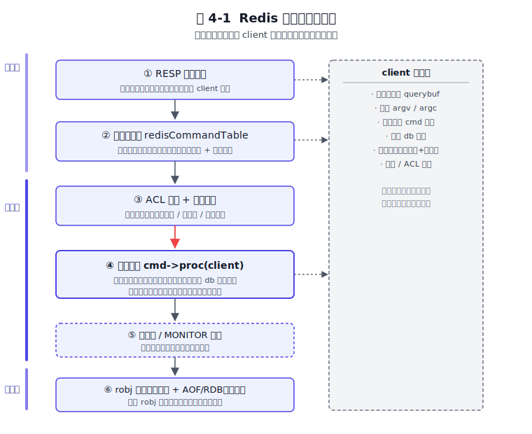
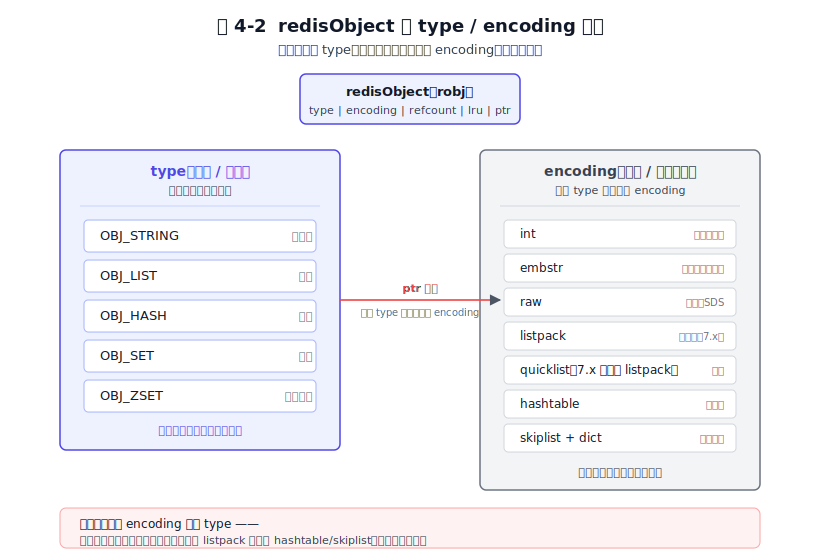
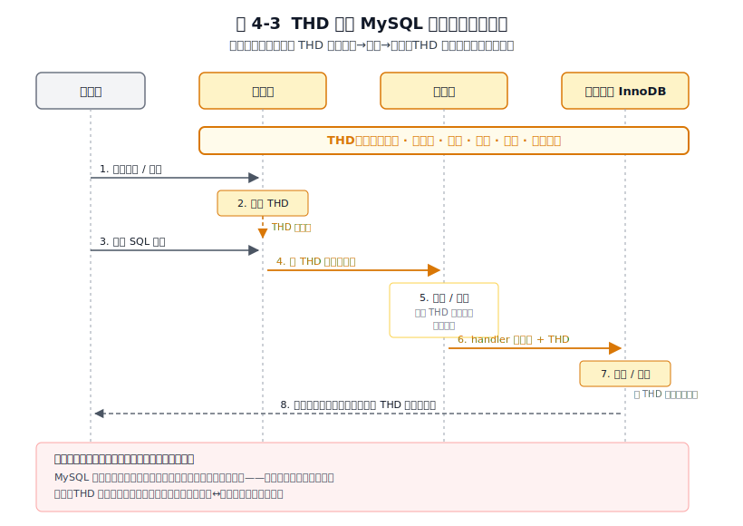
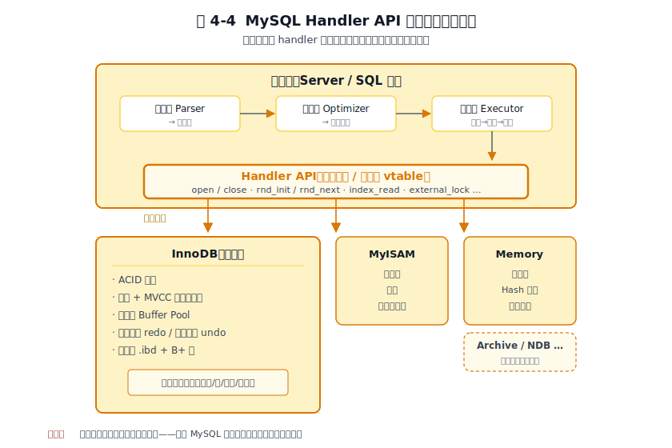
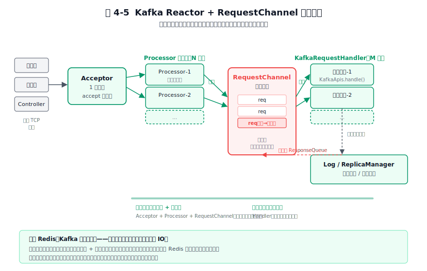
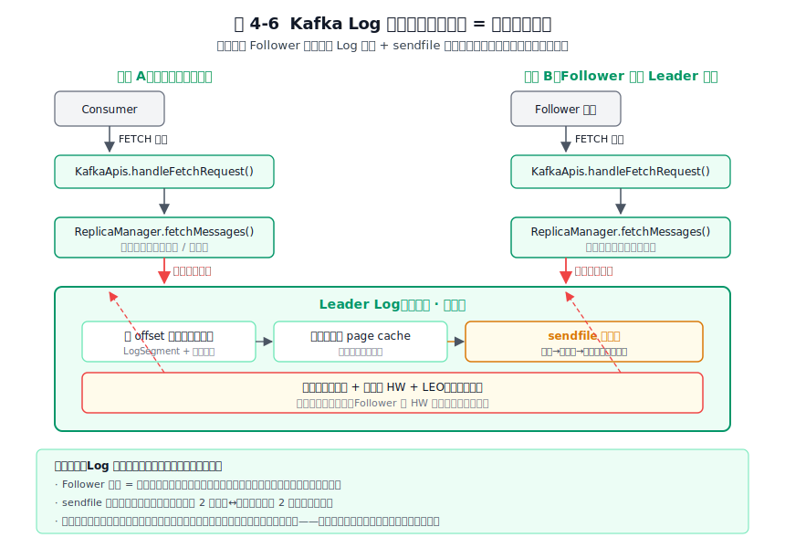
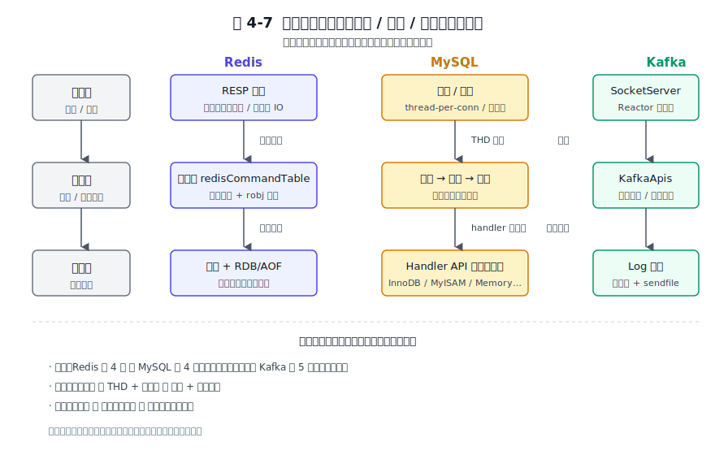

# 第 4 章 分层架构设计 — 存储层 / 逻辑层 / 交互层

## 本章导读

把任何一款成熟的系统软件拆开看，外表差别很大，骨子里却都在做同一件事：把"对外收发消息、内部决定逻辑、底层落地数据"这三件事分开。这一章要回答的问题是：为什么一定要分开？分多深？分完之后，三层之间拿什么传话？

分层是软件设计里最普适的模式，但它有代价——每多一层，就多一次上下文切换、多一份接口要维护。Redis、MySQL、Kafka 在"分几层、层之间耦合多松、谁可以替换"上做出了截然不同的选择，恰好覆盖了分层设计最关键的取舍空间：单机极致延迟、标准化生态、分布式水平扩展。

读完这一章，你会得到一套判断"自己的系统该分几层、什么时候分层过度、层间接口怎么定才稳"的决策框架，并能看懂 Redis、MySQL、Kafka 源码目录为什么这样组织。我们用一条贯穿全章的主轴——交互层、逻辑层、存储层三段式——把三家重新摆进同一个坐标系里观察，看清共性在哪里、分歧又从何而来。

---

## 4.1 问题的本质：为什么必须分层

"分层"这个词被喊得太多，以至于快要失去意义。要把它从口号还原成工程问题，得先问一句：不分层会怎样？

设想一个把所有事情揉在一起写的服务：直接监听 TCP，收到字节后就地解析命令、就地读数据库、就地拼成报文发回去。这种代码在原型阶段跑得很快，但只要复杂度上升一档，它就会从四个方向同时出问题。第一是认知负担——改任何一行都要同时理解协议、SQL 和内存模型。第二是修改的爆炸半径——换网络库或改存储格式都会牵动整个文件。第三是可测试性差——业务逻辑无法脱离网络做单元测试。第四是演进被锁死——升级存储格式时会发现协议处理代码里塞满了对旧格式的硬编码假设。

分层正是为了对症下药。它解决三件事：**关注点分离（Separation of Concerns）**，让每一层只操心一种关注点；**修改的局部性**，改一层不动另一层；**可替换性**，接口不变、实现可换。这三件事不是抽象口号，而是工程上可验收的指标——你能不能独立测试某一层？换掉某层实现会不会牵动别层？这层有没有引入新的抽象边界？后面 4.6 节会把这三问当作"分层是否合理"的体检表。

无论哪种系统软件，请求的旅程都是一样的：从"外部不可信的输入"出发，穿过一道道边界，最终走到"确定性的存储操作"，再原路返回。每穿过一层，都要做一次抽象与代价的交换——拿掉一些细节（比如丢弃客户端的 TCP 句柄、丢弃 SQL 的语法糖），换来一次更纯净、更可操作的中间表示。分层好不好，本质上就是问这些交换值不值。

这套旅程对 Redis、MySQL、Kafka 都成立，但它们各自的特化约束把共同路径拉向了完全不同的形态。

Redis 的约束是**单机极致延迟**。它要把每条命令的端到端时间压到亚毫秒，于是层数越少越好，跨层调用最好是直接函数调用，连虚函数都嫌多。在 Redis 的世界里，"薄"才是美。

MySQL 的约束是**SQL 语义 + 多种存储后端**。SQL 标准要求它必须有一套与具体存储无关的逻辑层；而现实的存储介质又千差万别——事务型、内存型、归档型——这逼着它必须提供一套可插拔的接口。MySQL 的分层形态是被 SQL 标准和生态多样性共同塑造的。

Kafka 的约束是**天生分布式**。它的层与层之间天然就有网络边界——Broker 与 Broker 之间、Producer 与 Broker 之间，全是 TCP。这意味着 Kafka 的分层不是为了"好看"，而是为了水平扩展：每一层都要能在多台机器上并行跑起来。

为了用一个统一视角对照这三家，本章采用"交互层 / 逻辑层 / 存储层"三段式作为主轴。这里要做一次概念校准：这三段并不与各家源码目录的字面命名一一对应。Redis 的源码里是 `networking.c` + `server.c` + `db.c`，MySQL 是 `sql/` + `storage/`，Kafka 是 `network` + `api` + `log`。我们做的是**语义映射**——把各家不同名字的模块映射到同一种功能职责上，再放在一起比较。这种统一视角正是本章的差异化价值，而不是照搬各家术语。

最后预告一点：分层不是越多越好。镜像分层、空洞透传、循环依赖这些"看起来分层了、实际没分到价值"的情况，会在 4.6 节展开。判断"该分几层"的唯一标准是：你愿意为这次抽象付多少延迟和复杂度。带着这个标准，我们先看 Redis 如何把分层做到最薄。

---

## 4.2 Redis 的做法

Redis 的分层哲学可以一句话概括：**该有的边界都有，但跨层几乎零开销**。它用极少的层加进程内直接函数调用，把"关注点分离"和"延迟敏感"两个看起来冲突的目标同时实现。我们抓三个机制来看：单线程 Reactor 把交互与逻辑压在一起、命令表把逻辑层做成一张可查的表、`redisObject` 的类型/编码分离让逻辑层与存储层解耦。

### 4.2.1 交互层：RESP 与单线程多路复用

Redis 与客户端之间用 RESP（Redis Serialization Protocol，Redis 序列化协议）通信。RESP 的设计极简：每段数据用前缀字符区分类型（`+` 简单字符串、`-` 错误、`:` 整数、`$` 批量字符串、`*` 数组），用 `\r\n` 分隔。这种结构让解析器可以**边读边解析**——读到一行就处理一行，不需要等整个命令到齐。对 `SET key value` 这种短命令，协议层几乎是一个零成本的拼接。

承载这套协议的是单线程 Reactor 模型。在 6.0 之前，Redis 的网络 IO 和命令执行在同一个线程里：主线程用 epoll/kqueue 多路复用监听所有客户端连接，有事件就处理，处理完再回到事件循环。这套设计的关键不在"单线程跑得快"，而在"没有跨层线程切换"。交互层和逻辑层贴在同一线程的内存里，命令从解析到执行到写回，全程不需要锁、不需要队列、不需要上下文切换——这是 Redis"看起来分层薄"的根因。

6.0 引入、7.x 沿用的多线程 IO 只动了一件东西：把协议的**读写**（`read`/`write` 系统调用和大块 buffer 拷贝）拆给一组 IO 线程，**命令执行依然在主线程单线程串行**。为什么宁可费这么大劲也不让逻辑层并发？因为 Redis 的整个内存模型（无锁数据结构、惰性删除、对象共享）都建立在"单线程修改"的前提上，一旦放开并发，要么大面积加锁牺牲延迟，要么重写全部数据结构。Redis 的取舍很清晰：可以分层，但绝不让逻辑层并发。这一句话也解释了为什么 7.x 默认仍然关闭多线程 IO——它是个可选优化，不是默认形态。

交互层还有一个容易被忽视的细节：**客户端输出缓冲区（client output buffer）**。每个客户端连接有两个写缓冲区，一个固定大小（默认 16KB），一个动态增长。固定区吸收小响应，避免每次回复都 malloc；动态区承接大响应，但有上限（可配置 `client-output-buffer-limit`），超限就强制关闭连接。这是交互层在内存上是"贴着"逻辑层的情况下，唯一能拿出来的解耦手段——防止一个慢客户端把整个进程的内存拖垮。换句话说，Redis 在交互层与逻辑层之间没有真正的"接口"可言，唯一的缓冲就是这块输出缓冲区。

这一小节的取舍点很明确：**Redis 用薄分层换延迟**。交互层和逻辑层在内存上贴着，跨层没有任何抽象代价，代价是它们也无法独立演进——你不可能像换 MySQL 引擎那样换掉 Redis 的网络层。

### 4.2.2 逻辑层：命令表 + robj 统一抽象

逻辑层是 Redis 的"大脑"，但它没有一个面向对象式的类层级，而是用一张表把所有命令组织起来。这张表叫 `redisCommandTable`，定义在 `server.c` 里，每条命令占一行。每一行包含命令名、处理函数指针、参数数量校验规则（arity）、命令标志位（read/write、是否阻塞、键在第几个参数位置、是否能在订阅态执行等等）。

命令执行的流水线是这样跑的：RESP 解析完得到参数数组 `argv` 和参数个数 `argc` → 用命令名做一次 dict 哈希查到命令表条目 → ACL 权限校验和 arity 校验 → 调用 `cmd->proc(client)` 执行 → 跑慢查询日志和 MONITOR 钩子。下面这张图把这条流水线和它如何用 `client` 结构体衔接交互层与逻辑层画了出来。

*图 4-1　Redis 命令处理流水线：交互层与逻辑层用 client 结构体衔接，全程无序列化。*

图里最值得注意的不是纵向的六步流程，而是右边那个贯穿全程的虚线框——`client` 结构体。它持有查询缓冲区、参数数组、当前命令指针、当前 db 索引、输出缓冲区、用户与 ACL 标志。换句话说，**整个会话上下文都挂在一个对象上**。交互层往里写、逻辑层往外读、存储层从里面取 db 索引，三段之间不传参数，只传这个对象。这与 MySQL 的 THD 是同一种思路（后面 4.3 节会细讲），区别只在 Redis 把交互层和逻辑层压在了同一线程，所以这个对象甚至不需要跨线程。

这里有一个关键的设计取舍：**把命令做成数据，而不是做成代码分支**。`redisCommandTable` 是一张可查的表，新增命令只需要在表里加一行，运行时也可以通过模块（Modules）API 往表里塞新命令。这换来运行时可扩展，代价是表项的字段（命令标志位）一旦定下就很难改——加一个新标志位意味着要改遍所有命令的声明。

命令的统一抽象靠 `redisObject`（业内简称 robj）完成。robj 是 Redis 把所有数据类型装进同一个壳子的关键。它的设计核心是把**类型（type）与编码（encoding）分离**。type 决定语义——这个对象是字符串、列表、哈希、集合还是有序集合，它决定了能执行哪些命令；encoding 决定内存表示——同一个 type 可以挂不同的 encoding，比如一个哈希在小数据量时用 listpack（紧凑连续内存），膨胀到阈值后自动升级为 hashtable。下面这张图把 type 和 encoding 的解耦关系画了出来。7.0 起 listpack 全面取代了旧版 ziplist，成为哈希、列表（作为 quicklist 的节点）、有序集合这三种小集合场景的紧凑编码——这是为了消除 ziplist 著名的"连锁更新"问题（一个元素长度变化引发 O(n²) 级联搬移）。

*图 4-2　redisObject 的 type / encoding 解耦：逻辑层只看 type（语义），存储层只看 encoding（内存表示）。*

这张图的解读只有一句话，但分量很重：**逻辑层只看 type，存储层只看 encoding**。命令代码里写的是"对这个列表做 LPUSH"，它不关心底层是 listpack 还是 quicklist；内存管理代码关心的是"这块 listpack 还能不能塞进去"，它不关心这是列表还是哈希。换 encoding 不动 type，意味着集合膨胀时的编码升级对逻辑层完全透明，命令代码一行都不用改。这是一个干净的分层解耦——用一组分离的字段，把"做什么"和"怎么存"切得彻底分开。7.x 用 listpack 替代了部分旧版 ziplist 的场景，进一步省内存，但这个改动完全发生在 encoding 一侧，逻辑层无感。

### 4.2.3 存储层：内存管理 + 持久化双轨

Redis 的存储层做了一件很多人没注意到的事：**它不抽象出"可插拔引擎"**。这与 MySQL 形成最尖锐的对比。原因很简单：内存数据库的存储介质只有一种——内存。换不同的内存分配器（jemalloc / tcmalloc）是优化，不是抽象引擎；它不会像换 InnoDB 换成 MyISAM 那样改变语义、改变事务支持。

存储层的实际职责有三块。第一是内存分配，Redis 默认用 jemalloc，配合引用计数管理对象生命周期。第二是淘汰策略，当内存达到 `maxmemory` 上限时，按配置的策略（`noeviction`、`allkeys-lru`、`volatile-lru`、`allkeys-lfu` 等）选出该被清理的键。LRU 用近似实现——每次随机采样若干个键，从中淘汰最久未用的，避免维护全局 LRU 链表的开销；LFU 用计数加衰减，让访问频率随时间淡化。第三是惰性删除（lazy free），4.0 引入：删除大对象（比如一个百万元素的集合）时不在主线程里同步释放内存，而是把它丢给后台 BIO 线程异步释放，避免阻塞主线程。

持久化是存储层的"可选职责"，这是另一个 Redis 与传统数据库的根本差异。RDB（快照文件）做全量快照，AOF（仅追加文件）做增量日志，4.0 起支持混合重写（重写时把当前快照作为 AOF 的开头）。关键是：**两者都可以关闭**。你可以把 Redis 跑成纯内存、重启即丢的缓存，也可以开启 AOF 做到秒级恢复。Redis 把持久化当作附加项，而不是内建的强约束——这与"存储是数据库第一公民"的传统观念正好相反。

这一小节的取舍点是：**存储层不抽象引擎，因为只有一种介质**。代价是 Redis 无法像 MySQL 那样换后端——你不能给 Redis 配一个"磁盘引擎"让它变成磁盘数据库（这恰恰是后来 RocksDB-Cloud、Redis on Flash 这类项目想补的空缺，但它们是外部方案，不是 Redis 内建能力）。

### 4.2.4 层间通信

把 Redis 三层的通信机制汇总成一句话：**全程无序列化、无虚函数**。交互层到逻辑层走 `client` 结构体加直接函数调用；逻辑层到存储层走 `robj` 指针加直接内存访问。命令分派用的是函数指针（`cmd->proc(client)`），但它不是面向对象意义上的多态 vtable——它就是一张静态表里的一次跳转。这种"零抽象"的层间通信是 Redis 把延迟压到亚毫秒的根本。

到这里 Redis 的画像清楚了：四层结构（RESP 解析、命令分派、robj 抽象、内存存储），层数少、粒度粗，跨层全是直接调用。它用薄换延迟，用"不抽象存储"换简单，用"命令表数据化"换可扩展。这是为单机内存数据库量身定做的分层形态，但它教给我们的原则——**性能敏感处，分层要薄，跨层要直接**——是普适的。

---

## 4.3 MySQL 的做法

MySQL 的分层与 Redis 截然相反：它的核心命题不是延迟，而是**用一套标准化接口把存储层做成可插拔**。这是它与 Redis、Kafka 最根本的分层差异。这一节抓三件事来看：连接层用 `THD` 贯穿全链路、服务层把 SQL 处理切成解析/优化/执行三段、存储引擎层用 Handler API 定义"行操作"契约。

### 4.3.1 交互层：连接、认证与线程模型

MySQL 的连接层在协议上比 Redis 复杂得多。它支持四种连接方式：TCP/IP（最常用）、Unix Socket（本机通信）、共享内存（Windows）、命名管道（Windows 历史遗留）。每一种都对应一套握手与认证流程。

认证本身是可插拔的——MySQL 8.0 默认使用 `caching_sha2_password`（带缓存的 SHA-2 认证，比旧的 `mysql_native_password` 更安全，并支持 TLS 证书协商）。SSL/TLS 在握手阶段协商，可以选择性启用。认证插件机制让 MySQL 能对接 LDAP、Kerberos、PAM 等外部身份系统，这是企业场景必备的能力。

线程模型有两种。默认是 thread-per-connection：每个客户端连接分配一个独立线程，全程服务这个连接，断开时销毁。优点是隔离好、实现简单，缺点是高并发下线程数爆炸，线程切换和内存占用都会成为瓶颈。另一种是线程池（企业版、Percona、MariaDB 提供）：用一组固定数量的工作线程服务所有连接，连接进来后排队等空闲线程。优点是切换开销低、内存可控，缺点是某个慢查询会"队头阻塞"同一池子里的其他请求。两种模型的取舍是典型的隔离与吞吐之争，没有绝对的好坏，只有匹配不匹配场景。

无论用哪种线程模型，MySQL 都有一个贯穿全链路的对象：**`THD`（类名 `THD`，源码里通常理解为 thread descriptor / 线程描述符，MySQL 官方文档并未给出权威展开）**。每个连接创建一个 THD，里面塞着当前库、当前事务、会话变量、权限位图、错误栈、字符集、临时表列表……所有这条连接在生命周期内需要的状态。THD 会跟着请求穿过连接层、服务层、存储引擎层，每一层都从它里面读写自己关心的字段。下面这张时序图把 THD 如何贯穿三层画了出来。

*图 4-3　THD 贯穿 MySQL 三层的会话上下文：THD 是跨层共享的可变状态。*

图里能看到两件事。第一，THD 是一条横贯三层的"血管"——连接层新建它、服务层读它的变量和事务、引擎层取它的事务上下文去做加锁和 MVCC。第二，连接层和服务层之间没有真正的解耦点——它们共享 THD 这个可变对象。这带出一个重要的判断：**MySQL 的分层在顶上是"软"的**。它用"一个贯穿全程的对象"替代了"层层复制参数"——边界靠对象，不靠拷贝。这与 Redis 的 `client` 结构体是同一种思路，但 MySQL 因为跨了线程、跨了引擎，THD 的复杂度要高得多。

### 4.3.2 逻辑层：SQL 全生命周期的三段切分

MySQL 的逻辑层在文档里统称"服务层"（Server 层 / SQL 层），但它内部其实是一条清晰的三段流水线：解析器、优化器、执行器。

**解析器（Parser）** 由 bison 生成（语法文件 `sql_yacc.yy`）。它先把 SQL 文本切成词法 token，再按 SQL 语法规则建出解析树，然后进入预处理阶段做语义检查（表存不存在、列存不存在、权限够不够），最终生成一个预处理查询树。这一段不做任何执行决策，只负责"这句话说得对不对、说得清不清楚"。

**优化器（Optimizer）** 是 MySQL 的核心智力所在。它接受查询树，输出一个执行计划。优化手段包括：常量折叠（编译期可算的结果提前算）、常量表检测（小表优先做）、范围优化（把 OR 改写成 UNION 各自走索引）、基于直方图（8.0 新增）选择索引、JOIN 顺序搜索。8.0 之前优化器主要靠启发式规则和简单的成本估算，8.0 引入直方图（histogram）让它能对没有索引的列做数据分布感知的判断。优化器的产物是一个执行计划——它不是 SQL，也不是机器码，而是一组结构化的"该按什么顺序、用什么索引、走什么 JOIN 策略"的指令。

**执行器（Executor）** 拿到执行计划后开始真正干活。它的主循环很朴素：调用 handler 接口读一行 → 评估 WHERE 条件 → 聚合或返回 → 再读下一行。每一行读写都是一次对存储引擎的虚函数调用。这个"读一行评估一行"的循环看似低效，但它是 SQL 语义的自然形态——SQL 是声明式的，执行器只能一行一行地走。

这里有一个"分层失败案例"：**查询缓存（Query Cache）**。MySQL 5.x 时代有个功能：把 SELECT 的结果按 SQL 文本做 key 缓存，下次同样的 SQL 直接返回。它听起来很美，却在 8.0 被彻底移除。失败的原因正是分层的错位：缓存做在服务层，而数据失效的源头在引擎层。任何一张表的任何一次写，都要去检查所有引用了这张表的缓存项并使之失效；在高写入负载下，缓存维护的开销远超它带来的收益。这是典型的"在错的层做了对的事"——缓存本应做在引擎层内部（InnoDB 的缓冲池就是），而不是跨在服务层。这个案例 4.6 节会作为"该砍的层要砍"的例证再用一次。

服务层内部的三段切分说明一件事：**子层之间用结构化中间表示（解析树、执行计划）传话，而不是函数调用**。这是 SQL 系统的特征——SQL 是声明式语言，必须有一个"中间表示"来承载语义，于是分层天然变成了"生成 IR → 变换 IR → 消费 IR"的三段。这与 Redis"直接函数调用"形成了鲜明对比。

### 4.3.3 存储层：Handler API 与可插拔引擎

存储层是 MySQL 分层的灵魂，它的核心是 **Handler API**。这是 MySQL 与存储引擎之间的契约——一套方法签名，规定了"引擎必须能做什么"。表级的方法（`open` / `close`）、行级的方法（`rnd_init` / `rnd_next` 顺序扫描、`index_init` / `index_read` 索引扫描）、事务相关的方法（`external_lock` / `start_stmt` / `commit` / `rollback`）——所有这些组合起来，定义了"一个能被 MySQL 调用的存储引擎"长什么样。

只要实现了这套接口，就能作为一个引擎挂进来。InnoDB 是默认引擎，提供 ACID 事务、行锁、多版本并发控制（MVCC，Multi-Version Concurrency Control）、缓冲池、重做日志与回滚日志，是 OLTP（联机事务处理）场景的标配。MyISAM 是老引擎，无事务、表锁，但全文索引曾经比 InnoDB 好。Memory 引擎把数据放内存、用哈希索引、重启即失。此外还有 Archive（压缩归档）、NDB（Cluster）、第三方引擎如 RocksDB（Percona 的 MyRocks）等数十种，可以在同一个 MySQL 实例里并存——同一份数据库里，不同表可以挂不同引擎。下面这张图把这套可插拔结构画了出来。

*图 4-4　MySQL Handler API 与可插拔存储引擎：服务层通过 handler 虚函数向下调用，引擎可并存、可替换。*

这张图的关键不在上半部分（解析→优化→执行），而在中间那条粗黄线——Handler API 接口契约。它把服务层与引擎层彻底切开。下面的引擎们各自实现这套接口，互不干扰，可并存。需要注意的是，InnoDB 自己又是多层：事务管理 → 锁与 MVCC → 缓冲池（Buffer Pool）→ 重做日志与回滚日志 → 页与 B+ 树。这些子层全部封装在 InnoDB 内部，对服务层不可见——服务层看到的只是一个"实现了 Handler 接口的黑盒"。文件组织上，InnoDB 用 `.ibd` 表空间存数据和索引、`ib_logfile` 存重做日志、`undo_*` 存回滚日志，再配合双写缓冲（doublewrite buffer）防止页撕裂。这些细节会在第 7 章存储格式里展开。

这一小节的关键取舍是：**接口标准化带来生态，代价是多态开销**。handler 通过虚函数（vtable）多态调用，每次行操作都过一次虚函数表。这意味着一个全表扫描的每一行、一个索引查找的每一次定位，都是一次间接调用，无法被内联优化。这是 MySQL 相对那些"硬编码引擎"的数据库（如 PostgreSQL 的 table access method 虽然也抽象但与执行器结合更紧）的固有开销。MySQL 用这个代价换来了可插拔——这个交换是否值，取决于你怎么用 MySQL：如果你只用 InnoDB，这笔开销就是纯成本；如果你需要混合引擎（比如热数据 InnoDB、冷数据 RocksDB），这笔开销就是生态红利。

### 4.3.4 层间通信

MySQL 的层间通信有三种形态，分别对应三条边界。连接层到服务层：THD 对象加函数调用，跨线程但同进程。服务层到引擎层：handler 虚函数，多态调用，每次行操作都过 vtable。引擎层到操作系统：文件 API（`pread` / `pwrite`）和 Native AIO（Linux 上的 `io_submit`）。这三段通信机制形态各异，但有一个共同点：**它们都是为"一个进程内的多层"设计的**——MySQL 是单机软件，所有的层间通信都不跨网络。这一点与 Kafka 形成鲜明对照，下一节展开。

MySQL 的画像到这里也清楚了：四层结构（连接、服务、Handler 接口、引擎），服务层内含三段子层（解析、优化、执行），引擎层用标准接口实现了几十种可替换实现。它用"标准化接口"换生态，用"虚函数多态"换可插拔，用"THD 贯穿全程"换会话上下文的传递效率。它教给我们的原则——**标准化接口能让生态长出来，但要为多态付开销**——同样是普适的。

---

## 4.4 Kafka 的做法

Kafka 的分层与前两者又不一样。它的核心命题是**水平扩展与高吞吐**，于是分层天然为分布式服务：每一层都要能跨机器并行。这一节抓三件事来看：网络层用 Reactor 加 RequestChannel 把"收发"和"处理"在多线程间解耦、API 层用统一的 `handle` 分派把"请求类型"做成可枚举的协议、Log 层把存储抽象成"追加写加位移寻址"，使存储层与复制层共享同一份数据。最后单列一段讲 Kafka 独有的"协调层"。

### 4.4.1 交互层：SocketServer 与 Reactor 多线程模型

Kafka 的网络层是三者里最"重"的。它受 Netty 的 Reactor 模式启发，但用 Scala 实现，分成四级：Acceptor、Processor、RequestChannel、KafkaRequestHandler。

**Acceptor** 是单线程，只做一件事：`accept` 新连接。它用 Java NIO 的 Selector 监听服务端 socket，每来一个新连接就按轮询策略交给某个 Processor。

**Processor** 是一组线程（数量可配，典型几个到十几个），每个 Processor 管理一批连接的网络读写和协议编解码。它把客户端发来的字节流按 Kafka 协议解析成 `Request` 对象，塞进 RequestChannel；同时把 `Response` 从 RequestChannel 取出来，序列化写回客户端。

**RequestChannel** 是 Processor 与业务线程之间的桥梁——一个**有界阻塞队列**。它有界是关键：当业务线程处理不过来、队列填满时，Processor 的入队操作会阻塞，进而阻塞网络 IO。这是一个天然的背压（backpressure）点——消费慢的时候压力会一路回传到上游，避免内存被请求堆积拖垮。这种"用有界队列当流量调节器"的模式，是高吞吐系统的标配。

**KafkaRequestHandler** 是一组业务线程（数量可配，等于 `num.io.threads`），每个线程从 RequestChannel 里取请求，调用 `KafkaApis.handle()` 处理。下面这张图把这套四级结构画了出来。

*图 4-5　Kafka Reactor + RequestChannel 线程模型：网络线程与业务线程通过有界队列解耦，队列满时天然回压上游。*

这张图的解读有三个层次。第一，网络线程和业务线程是**完全分离**的两组，它们之间唯一的耦合是 RequestChannel。这与 Redis 的"单线程全包"和 MySQL 的"thread-per-connection 一个线程跑全程"都不一样。第二，有界队列是天然的背压点——这是 Kafka 在生产级负载下不崩内存的关键。第三，重交互层换来单机能榨干多核（N 个 Processor + M 个 Handler 撑满 CPU），且网络层与业务层可独立调参。

为什么 Kafka 必须多线程、而 Redis 不能？因为 Kafka 单机要同时处理多分区、多副本的并发 IO——一个 Broker 可能挂几百个分区，来自生产者、消费者、Controller 的请求并发涌进来，单线程根本来不及。Redis 的负载模型是"短命令、低延迟"，Kafka 是"批量、大传输、高吞吐"，两者对并发的要求差了一个量级。这一小节的取舍点是：**Kafka 用最重的交互层换多核与水平扩展，延迟比 Redis 高，但吞吐量级不同**。

### 4.4.2 逻辑层（API 层）：请求类型分派

Kafka 的"逻辑层"在源码里叫 `KafkaApis`，它做的事比 MySQL 的服务层要薄得多——它不做解析（解析在 Processor 完成），不做优化（Kafka 没有"查询优化"的概念），它只做**协议适配加请求分派**。

Kafka 把所有请求类型枚举成 ApiKeys：PRODUCE（生产）、FETCH（消费/复制）、LIST_OFFSETS（按时间找位移）、METADATA（元数据查询）、LEADER_AND_ISR（Controller 管理 Leader 和 ISR）、STOP_REPLICA（停止副本）、CREATE_TOPICS、ALTER_CONFIGS……每一种请求都有自己的版本号（Kafka 协议会随版本演进，老客户端发 v1、新客户端发 v5，Broker 都要兼容）。`KafkaApis.handle()` 拿到一个 `RequestChannel.Request`，按 ApiKeys 走 switch 分派到对应的 `handleXxx` 方法。

这一层还负责横切关注点：**鉴权、配额（quota）、版本协商**。鉴权在每个 handler 入口检查这个用户有没有权限操作这个资源；配额机制限制单个 client 每秒能产生的字节或请求数，防止单一客户端压垮集群；版本协商在协议层完成，Broker 选一个客户端支持的最高版本回应。

这里有一个容易被忽略的设计决策：**Kafka 把"逻辑层"切成"协议分派"和"领域逻辑"两段**。`KafkaApis` 这一层只做协议适配和分派，真正的领域逻辑在更下层——`Log`（写消息）、`ReplicaManager`（副本管理）、`GroupCoordinator`（消费者组协调）、`Controller`（集群元数据）。为什么必须分两段？因为分布式系统里协议版本演进和领域逻辑演进的节奏不同——协议格式三年才加一个新版本，但副本管理算法可能半年调一次。把它们绑在一起，协议一改就得动领域逻辑；分开之后，协议层只管"怎么收发"，领域层只管"怎么处理"。

### 4.4.3 存储层：Log 抽象 + 零拷贝

存储层是 Kafka 最具特色的一层。它的核心抽象是 **`Log`**——不是"日志"这个宽泛概念，而是一个非常具体的对象：一组顺序追加的日志段（LogSegment）。每个分区对应一个 Log，每个 Log 由多个 LogSegment 组成，每个 LogSegment 在磁盘上是三个文件：消息数据文件（`.log`）、位移索引文件（`.index`）、时间戳索引文件（`.timeindex`）。这套字节布局会在第 7 章详讲，这里只看它作为"存储层抽象"的形态。

**写入路径**极其简单：生产者发来一批消息，Broker 把它**顺序追加**到当前活跃 LogSegment 末尾，写入页缓存（page cache），可选地按策略刷盘（fsync）。没有 B 树、没有索引重建、没有写放大——追加写是磁盘上最快的写法。刷盘策略可配：`flush.messages`（每多少条刷一次）或 `flush.ms`（每多少毫秒刷一次），也可以完全不刷交给 OS 决定（依赖副本数保证持久性，单机丢页不丢数据）。

**读取路径**有一个关键技巧：按位移二分定位日志段，再在段内用稀疏索引找具体位置。索引是稀疏的——不是每条消息都有索引项，而是每隔一段距离（默认每 4KB）记一项，这把索引大小压得很小，常驻内存。命中索引后，从消息文件里读出一段连续数据返回。如果数据已经在页缓存里（消费历史数据时经常命中），读取就是一次内存拷贝，不需要真去磁盘。

这里要重点讲一个让 Kafka 吞吐显著提升的机制：**零拷贝（sendfile）**。传统读取流程是：磁盘 → 内核缓冲区 → 用户态缓冲区 → 内核 socket 缓冲区 → 网卡，四次拷贝加四次上下文切换（`read` 与 `write` 各自一对进出内核态）。Kafka 用 Linux 的 `sendfile` 系统调用，让内核直接把页缓存的数据传到网卡 socket：磁盘 → 页缓存 → 网卡，**跳过用户态**，省掉两次拷贝（在支持 scatter-gather DMA 的网卡上连这两次也免了，只剩 DMA 自身的拷贝）和两次上下文切换。这对消费历史数据（数据往往在页缓存里）的场景，性能提升是数量级的。

但零拷贝有一个前提：**数据必须是从文件到 socket 的纯转发，中间不能被修改**。这恰好契合 Kafka 的语义——消息是不可变的字节流，Broker 拿到什么就转发什么。Kafka 把自己的存储设计成"零拷贝友好"，这是它性能的根因之一。

下面这张时序图展示了 Kafka 的一个标志性设计：**消费者读路径和副本同步路径是同一条**。

*图 4-6　Kafka Log 复用：消费读路径 = 副本同步路径，存储层与复制层共享一份代码。*

这张图的解读直击 Kafka 分层的核心：消费者发 FETCH 请求，Follower 也发 FETCH 请求——它们走同一条 `KafkaApis.handleFetchRequest` → `ReplicaManager.fetchMessages` → Log 读取 → sendfile 路径，**只是请求里的标志位不同**（普通消费者 vs 副本同步）。换句话说，**Follower 复制本质上就是"一个特殊的消费者"**。

这是 Log 抽象带来的巨大红利：**存储层和复制层共享同一份代码**。Kafka 不需要为副本同步单独写一套读路径、单独维护一套状态机——复用消费读路径意味着任何对读路径的优化（零拷贝、索引、缓存）都同时惠及复制；任何 bug 修复只改一处。对比一下：很多系统的"主从复制"是独立模块，复制代码和读写代码各写一份，长年累月就会漂移、出 bug。这是 Kafka 在第 8 章数据同步里能讲得简洁的根本原因。

这一小节的关键取舍是：**Kafka 把存储做得极薄（就是追加写日志），把复杂度推给上层（索引、复制、压实）**。代价是存储层几乎不可插拔——你不能换 Kafka 的"日志引擎"，因为整个系统对"Log 是顺序追加、按位移寻址"的假设贯穿各层。换来的是存储层极快、零拷贝路径极简、复用红利巨大。

### 4.4.4 协调层：在 Log 之上的额外一层

到这里需要点出一个 Redis 和 MySQL 都没有、Kafka 独有的层：**协调层**。它包括 ReplicaManager（副本管理）、Partition（分区对象）、Controller（集群控制器），以及 3.3 起达到生产可用（production ready）、用于取代 ZooKeeper 元数据管理的 KRaft 模式。3.x 默认仍可使用 ZK 模式，4.0 起彻底移除 ZK；精确的默认开关点留给第 6 章深讲。

为什么需要这一层？因为 Kafka 是分布式系统。一个分区的 Leader 在哪台 Broker 上、ISR（同步副本集合）里有谁、哪个副本落后了要从 ISR 踢出去、Controller 怎么协调全集群的分区重分配——这些都是分布式协调的事，不属于交互层、不属于 API 层、也不属于存储层。它是一个独立的关注点：**让多个 Broker 上的副本达成一致**。

所以 Kafka 实际上是"交互 + API + 存储 + 协调"四段，比三段式多出一段。深讲留给第 6 章集群架构，本章只点明：**协调层是分布式系统独有的、单机软件没有的层**。Redis Cluster 的槽路由、MySQL MGR（组复制）的多数派投票都属于类似的关注点，只是没像 Kafka 那样独立成代码上一个清晰的模块层。

### 4.4.5 层间通信

Kafka 的层间通信有三种形态，每一种都与部署形态严格匹配。交互层到 API 层是 RequestChannel 队列，**跨线程**但同一 JVM 内；API 层到存储/协调层是对象方法调用，**同 JVM 内**直接调用，无网络、无序列化；跨 Broker 之间永远是**网络协议**，无论 ReplicaManager 找另一个 Broker 的 Leader 拉数据，还是 Controller 下 STOP_REPLICA 指令，都封装成 Kafka 协议请求走 TCP。这是 Kafka 分层的天然边界。

这种"层间通信机制与部署形态绑定"是 Kafka 最鲜明的分层印记：单机内的层用对象调用，跨机器的层用网络协议，没有"高级低级"之分，只有匹不匹配。

Kafka 的画像到这里也清楚了：五层结构（SocketServer、KafkaApis、Log、ReplicaManager/Controller 协调层、跨 Broker 协议），交互层最重、存储层最薄、协调层是分布式独有。它用"重交互层"换多核与水平扩展，用"薄存储加 Log 抽象"换极致吞吐与读写复用。它教给我们的原则——**分布式系统的层间边界天然是网络，分层要为水平扩展服务**——是这一章最重要的提醒之一。

---

## 4.5 横向对比

讲完三家，把它们压到同一个坐标系里看，才能看清"为什么不同"。这一节先用总览图建立视角，再用一张三栏对比表把六个维度并排放，最后解读分歧的根因。

先用一张总览图把三段式视角如何映射到三家画出来。

*图 4-7　三家软件映射到「交互 / 逻辑 / 存储」统一视角：同样的三段职责，落进完全不同的层形态。*

这张图建立的是本章坐标系——同样的交互、逻辑、存储三段，在 Redis 那里是粗 4 层、函数调用衔接；在 MySQL 那里是中 4 层（服务层内含子层）、THD 加虚函数衔接；在 Kafka 那里是细 5 层（含协调层）、队列加网络协议衔接。图里三个色块的颜色不是为了好看，是为了在下一张表里一一对应。

接下来用一张三栏对比表把六个核心维度并排，列序固定为 Redis | MySQL | Kafka，维度作为行。

**表 4-1 三家分层形态横向对比**

| 维度 | Redis | MySQL | Kafka |
|------|-------|-------|-------|
| 核心抽象 | `robj` 键值对象（type/encoding 分离） | 关系表 + 索引（SQL 行模型） | 追加日志（Log / LogSegment） |
| 主要存储介质 | 内存（持久化为辅） | 磁盘（缓冲池做内存缓存） | 磁盘（重度依赖页缓存） |
| 层数与粒度 | 粗 4 层 | 中 4 层（服务层内含解析/优化/执行子层） | 细 5 层（含 ReplicaManager/Controller 协调层） |
| 层间通信机制 | 函数调用 + 对象指针（无序列化） | THD 对象 + handler 虚函数 | RequestChannel 队列 + 跨网络协议 |
| 可插拔性 | 无引擎可换（仅内存） | Handler API 支持多引擎并存 | 存储不可换，但有 Connect/Streams 插件生态 |
| 分层的首要目标 | 低延迟（层数越少越好） | 兼容性与生态（标准接口） | 水平扩展与高吞吐（网络边界） |

*表 4-1：三家分层形态横向对比（列序：Redis | MySQL | Kafka，维度为行）。*

这张表怎么读？不要按"哪家更好"读，因为没有绝对优劣，只有匹配场景。要按"每一行的差异由什么决定"读，差异的根因集中在三件事上。

**第一，存储介质决定能不能分层。** Redis 的存储介质只有一种——内存——所以它没必要做引擎抽象，做了反而是负担。MySQL 的存储介质千差万别（事务型、内存型、归档型），所以它必须做可插拔，否则无法覆盖这些场景。Kafka 的存储高度专用（追加写日志），它的存储不是"可不可以换"的问题，而是"换了就不是 Kafka"的问题——它的零拷贝、复制路径复用全部建立在"Log 是顺序追加"的假设上。一句话：**介质的多样性决定了引擎抽象的必要性**。

**第二，通信机制与部署形态绑定。** 单机进程内的层用函数调用（Redis、MySQL 的服务层到引擎），跨网络部署的层用协议（Kafka 的跨 Broker）。这不是设计偏好，是物理约束——进程内调用的延迟是纳秒级，网络调用的延迟是毫秒级，差了六个数量级。任何"在进程内硬塞网络协议"或"在跨机器间硬塞函数调用"的尝试都会失败。所以 Redis 的薄分层适合单机，Kafka 的厚分层适合分布式，没有"高级低级"之分。

**第三，可插拔不是越高越好。** MySQL 的可插拔带来生态（几十种引擎），也带来 vtable 开销——如果你只用 InnoDB，这笔开销就是纯成本。Kafka 的存储不可插拔，反而让零拷贝路径极简，没有"为了抽象而抽象"的负担。判断可插拔要不要做的标准只有一个：**这层的实现多样性是否真实存在**。如果存在（如 MySQL 的引擎），就值得抽象；如果不存在（如 Redis 的内存、Kafka 的日志），抽象就是负担。

这张表把三家压在同一坐标系下，但要记住：坐标系是观察工具，不是评判标准。下面一节会从这些差异里提炼出可复用的设计原则。

---

## 4.6 架构启示

这一章具体实现讲得够多了，现在要从中提炼出可复用的东西。下面五条启示，每一条都对应前面某一节的具体取舍，并能独立应用到任何系统的分层设计里。

**启示一：分层深度匹配性能目标，而非追求"标准层数"。**

很多人有种错觉：好系统就该分层多、抽象高。三家的实现直接反驳了这一点。Redis 的目标是低延迟，它就把层数压到最少，跨层全是函数调用；Kafka 的目标是高吞吐，它就把交互层做到最重，用四级线程结构榨干多核。脱离性能目标谈"该分几层"是无意义的——你的系统要的是纳秒级响应、毫秒级响应、还是秒级批处理？目标不同，最优分层形态天差地别。这一条对应的设计原则是：

> **分层的厚度，等于你愿意为这次抽象支付的延迟预算。**

你要为这次抽象付多少纳秒、多少毫秒的延迟？这是分层的唯一计量单位。Redis 的答案是"几乎为零"，所以它的层数少、跨层全是直接调用；Kafka 的答案是"毫秒级可以接受，以换取吞吐"，所以它的层多而厚。

**启示二：接口稳定性优先于接口优雅性。**

回看三家最成功的接口：Redis 的 `robj`（type/encoding 分离）、MySQL 的 Handler API（行操作契约）、Kafka 的 Log 格式（顺序追加、按位移寻址）。这三者都不是"最优雅"的设计——`robj` 用一个联合体加指针搞定了所有类型，Handler API 的方法签名又多又碎，Kafka 的 Log 是最朴素的"一段一段的文件"。但它们有一个共同点：**多年不变**。`robj` 从 Redis 早期到现在核心结构没动过；Handler API 自 MySQL 5.x 插件化以来接口形态稳定；Kafka 的日志格式虽然有版本演进，但"顺序追加 + 位移寻址"的根基没变。

稳定的接口是生态的根。Redis 的模块生态、MySQL 的几十种引擎、Kafka 围绕 Log 的零拷贝与复制复用——全都建立在这些接口"十年不动"之上。一个反复重构的接口再精致也没人敢依赖。这一条对应的设计原则是：

> **最好的分层接口，是十年后仍然不需要改动的那一层。**

设计接口时，与其追求当下的优雅，不如问一句：十年后这个接口还能适应需求演进吗？能适应的，哪怕丑一点，也比反复重构的接口有价值。

**启示三：让"可替换"出现在最值得替换的地方。**

不是每一层都要可插拔。MySQL 把可插拔放在存储层——这正是它实现多样性最真实存在的地方（事务型、内存型、归档型引擎并存）。Redis 干脆不做存储抽象，因为内存只有一种介质，"可替换"是个伪需求。Kafka 把扩展点放在边缘——Connect（数据进出 Kafka 的连接器）、Streams（流处理 SDK）——而不是放在存储核心，因为存储的"可替换"会破坏它的核心性能假设。

判断标准只有一个：**这层的实现多样性是否真实存在**。存在就做接口（如 MySQL），不存在就硬编码（如 Redis 的内存、Kafka 的日志）。最糟糕的做法是"为了显得架构高级"而强行做可插拔——你得到了一个没人用的扩展点，付出了接口维护成本和调用开销，还可能把简单问题复杂化。

**启示四：警惕分层的反模式。**

不是把代码切成几块就叫分层。三种典型反模式要警惕。

第一，**镜像分层**：每一层只是给上一层改个名字。比如 Service 层调用 Manager 层、Manager 层调用 Dao 层、Dao 层调用 Mapper，但每一层都只是把参数原样转交。这种"分层"没有引入任何抽象，只是增加了认知负担和调用栈深度。

第二，**空洞透传**：一层只做转发不加价值。比如一个 API 网关收到请求后，不做任何鉴权、限流、转换，直接转发给后端——那它存在的意义是什么？

第三，**循环依赖**：A 层依赖 B 层、B 层又依赖 A 层。这破坏了分层的封闭性——本意是"修改局部化"，循环依赖却把两个层的修改耦合在了一起。

检验分层是否合理的体检表只有三问：**这一层能不能独立测试？换掉这层的实现会不会牵动别层？这一层有没有引入新的抽象、把关注点收窄？** 三个都能答"是"，分层就是有价值的；任何一个答"否"，这层就是冗余。

**启示五：会"砍掉一层"也是分层能力。**

分层不是只增不减。MySQL 8.0 移除查询缓存就是一个典型例证——查询缓存在 5.x 时代是服务层的一个组件，看起来"分层更完整"，但它的价值（缓存 SELECT 结果）已经抵不过它带来的协调成本（任何写都要去失效相关缓存）。8.0 砍掉它之后，整体性能在高写入场景下反而更好。

这个案例的教训是：**当一层的价值不再抵得过它带来的协调成本，就该删**。很多团队的代码里都有这种"曾经有用、现在只增加复杂度"的层——可能是早期的兼容层、可能是没人用的抽象接口、可能是为了"将来可能需要"而预留的扩展点。识别并砍掉它们，是比"加新层"更稀缺的设计能力。

把这五条放在一起，能看到一个更高层的规律：**优秀的架构不是一次定稿，而是保留扩展点让层次自然生长**。Redis 从一个缓存工具长成支持多种数据结构、Function、Cluster 的多模数据库，它的核心层（robj、命令表）一直是稳定的根，新功能长在边缘。MySQL 从单引擎（早期只有 ISAM/MyISAM）长成多引擎体系，Handler API 是它长出来的关键接口。Kafka 从一个消息队列长成流平台（Kafka Streams、Connect、KSQL），Log 抽象始终是它的核心。三家都没有"重写架构"，都是在保留稳定核心层的前提下让边缘自然扩展。这是分层设计最深的回报——它让系统可以演进，而不是被一次性设计锁死。

---

## 4.7 小结

回到本章开头的问题：为什么必须分层？分多深？层间拿什么传话？三家用截然不同的形态回答了同一个问题——怎么把交互、逻辑、存储分开，且分得值。

Redis 教我们：**性能敏感处，分层要薄，跨层要直接**。它用极少的层和函数调用，把延迟压到亚毫秒，代价是放弃存储的可插拔。MySQL 教我们：**标准化接口能让生态长出来，但要为多态付开销**。它用 Handler API 撑起了几十种引擎，代价是每次行操作的虚函数调用。Kafka 教我们：**分布式系统的层间边界天然是网络，分层要为水平扩展服务**。它用最重的交互层换多核，用最薄的存储换吞吐，用网络协议当天然的层间边界。

把这三条压缩成一句可引用的总纲：

> **分层不是把系统切碎，而是为每一次"该改在哪里"画出边界。**

好的分层让"加新功能改哪里"、"换实现改哪里"、"修 bug 改哪里"都有清晰的答案；坏的分层让每一次修改都牵动全局。区分好坏的，不是层数多少，而是边界画得准不准。

本章画好了边界，下一章（第 5 章 安全机制）会看这些边界如何被守护——交互层的认证、逻辑层的鉴权、存储层的加密，分出来的每一层都对应一组独立的安全关注点。再往后，第 6 章集群架构会展开 Kafka 的协调层、Redis Cluster 的槽路由、MySQL MGR 的多数派，那是分布式系统独有的、单机软件没有的那一层。
