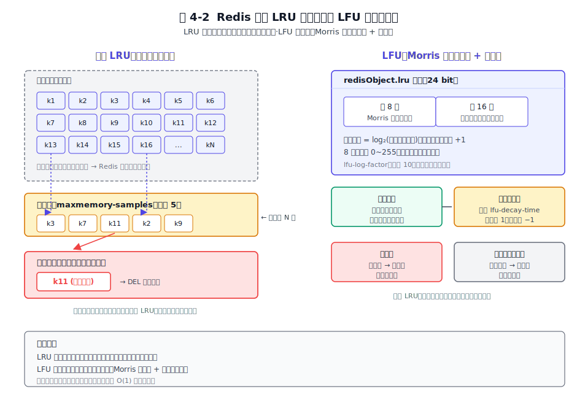
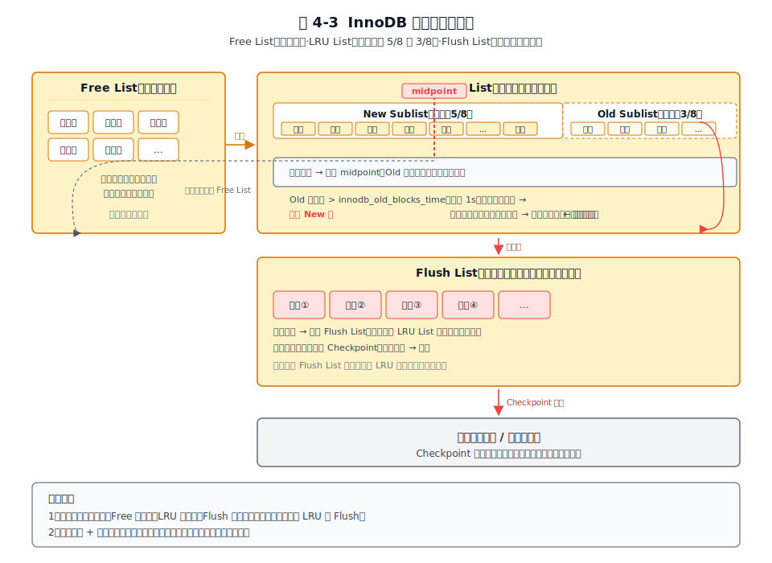
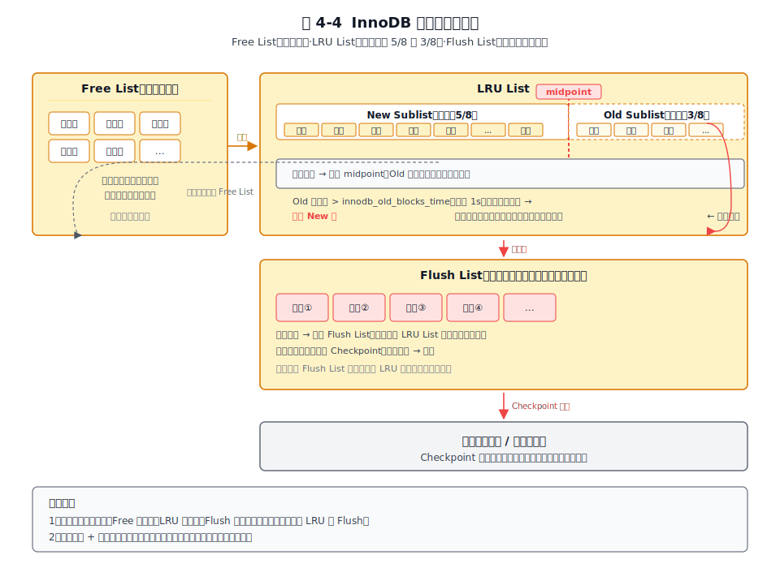
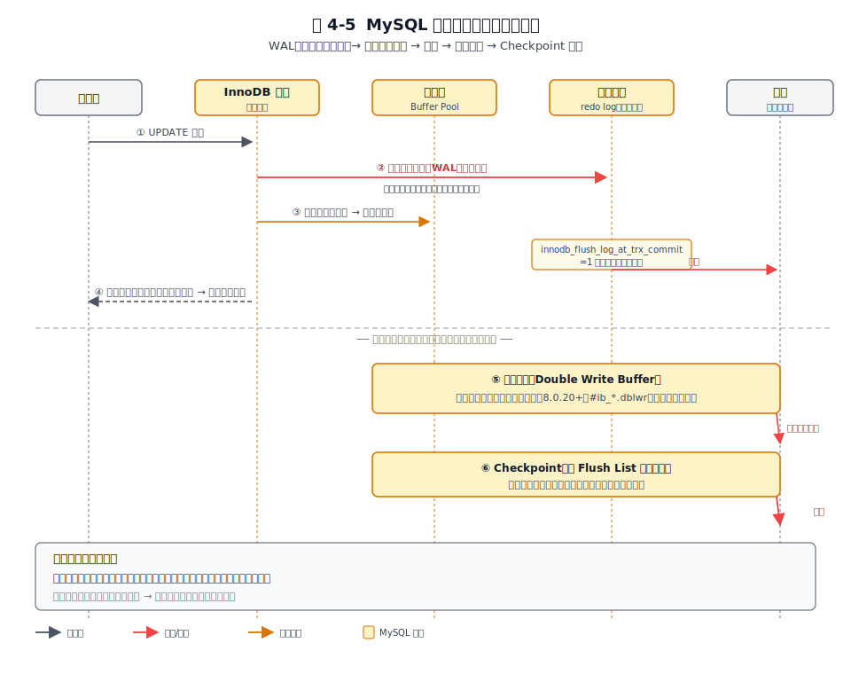
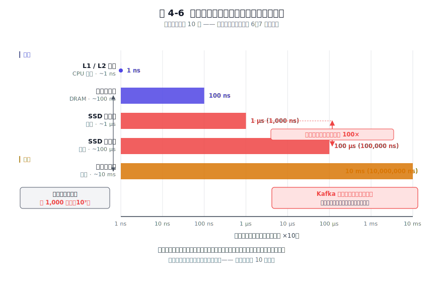

# 第 4 章 内存与磁盘的舞蹈 — 速度与持久化的平衡

## 本章导读

系统数据越堆越多。全放内存？快是快，可内存贵、容量有限，几十个 G 就到顶，断电还全没。全放磁盘？便宜量大也持久，可一次随机读写就要毫秒级，用户根本等不了。"既要快、又要稳、还要省"。这三样没法同时拉满，做存储系统都得在它们之间做取舍。

面对同一道题，Redis、MySQL、Kafka 走向了三个几乎相反的答案：Redis 以内存为主、磁盘只做备份；MySQL 以磁盘为主、内存只做加速；Kafka 以磁盘上的顺序日志为主，连加速都交给了操作系统内核。这三个选择各自从所服务的访问模式倒推出来。理解了这个分叉，它们后续的性能特征和取舍就都能对上：Redis 把数据直接放内存，容量就被内存锁死；MySQL 的内存只是磁盘页的副本，延迟就取决于缓冲池命中率；Kafka 把加速交给操作系统的 PageCache，吞吐能做得很高却几乎不自己管内存。

说到底就是一个选择：数据放在哪里。放内存、放磁盘、还是追加写日志，这个选择决定了后面所有的访问模式和性能特征。后面第 7 章集群、第 9 章同步，都要回到这里找答案。

## 4.1 问题的本质

任何存储软件都活在同一组物理约束之下。先把这组约束量化。

先看一张把存储介质访问延迟摆出来的表，建立直觉。表中数字用于建立数量级，不是硬件基准；真实值会随 CPU、磁盘、文件系统、队列深度与负载模型变化。

**表 4-1　存储介质的访问延迟数量级**

| 存储介质 | 典型访问延迟 | 相对内存（以内存为 1） | 是否持久 |
|----------|-------------|----------------------|---------|
| CPU L1 缓存 | ~1ns | 0.01× | 否 |
| 内存（DRAM） | ~100ns | 1× | 否 |
| SSD（随机读） | ~100μs（基准值；生产负载下 NVMe 典型在 100–500μs，受 I/O 深度与队列效应影响） | ~1000× | 是 |
| SSD（顺序写） | ~300–500MB/s（SATA）~2–14GB/s（NVMe，随 PCIe 代际递增，Gen3 约 3GB/s、Gen4 约 5-7GB/s、Gen5 可达 10+GB/s） | 吞吐可追平内存随机访问 | 是 |
| 机械盘（随机寻道） | ~10ms | ~100 000× | 是 |
| 机械盘（顺序写） | ~100–200MB/s 吞吐 | 顺序吞吐高出随机寻道约两个数量级 | 是 |

这张表里有三个事实值得记住。内存比任何持久介质都至少快一个数量级；顺序 I/O 的吞吐能逼近内存随机访问；而持久性，总是要拿延迟或复杂度去换。把这套数量级换成体感：如果内存访问算 1 秒，SSD 一次随机访问就是 17 分钟，机械盘一次随机寻道是 28 小时。纳秒、微秒、毫秒之间隔着三到五个数量级，存储软件要在内存的纳秒和磁盘的毫秒之间跨过这道鸿沟，所有"内存-磁盘"设计都从这里起步。

> **关键数字**
> 
> - **Redis fork 开销：随实例内存增长**。fork 要拷贝页表，阻塞时间随实例内存线性上升，小实例几十毫秒，大实例（几十 GB 以上）可达数百毫秒，还受页表大小和是否开启透明大页（THP）影响。fork 期间主线程停等，客户端可见超时。
> - **InnoDB 缓冲池：生产典型 8–128GB**。命中率在工作集接近或超过缓冲池大小时断崖下跌；1TB 数据库用 64GB 缓冲池，一次未命中 ≈ 一次磁盘随机 I/O，延迟比命中慢三个数量级。
> - **Kafka PageCache：Linux 默认 `vm.dirty_background_ratio`=10%、`vm.dirty_ratio`=20%**。前者达到时内核 flush 线程**异步**后台刷盘、写进程不阻塞；后者达到时写进程被**同步阻塞**强制刷盘。64GB 机器相当于约 6.4GB 的异步写缓冲区（按 10% 计），写满前内核批量刷盘。这是 Kafka 不强制 fsync 仍能达到磁盘吞吐上限的物理基础。

这套数量级差距，用一张对数坐标图看会更直观。表格里的数字是抽象的，图上柱长的差异是肉眼可辨的。

*图 4-1　存储层次访问延迟数量级（对数坐标）：内存比机械盘快约十万倍；同一块 SSD，顺序读比随机读快 100 倍。*

图中两处标注最该记住。第一，内存柱与机械盘柱的长度差。直接说明了为什么要有缓冲池、为什么 Redis 把数据放进内存。第二，SSD 顺序读与随机读两条柱的对比。同一块盘，访问模式从顺序换成随机，延迟就涨了两个数量级。Kafka 坚持顺序写、InnoDB 用 WAL 把随机写改造成顺序写。

这组数字引出三个根本约束。

第一，内存易失。断电瞬间内存里的内容归零，所有还没写到持久介质上的数据都会消失。任何承诺"持久化"的系统都必须在某个时刻把数据搬到一个断电也不丢的地方。

第二，内存昂贵且容量有限，磁盘便宜且容量大。同价位下，磁盘容量通常是内存的上百倍。这意味着"全内存"系统天生有容量天花板，而"磁盘为主"系统天然适合存海量数据。

第三，随机 I/O 远慢于顺序 I/O。机械盘的随机寻道是一次旋转加一次磁头移动，时间在毫秒级；而顺序读写可以让磁头连续扫过扇区，吞吐能到上百 MB/s。SSD 没有机械结构，但顺序写仍然比随机写对闪存更友好，因为它能减少写放大与擦除开销。

把这三个约束翻译成对存储软件的要求，就得到一个共同难题："读路径要快、写路径要可靠、容量要够、成本要控"这四件事的折中系统。可以把这个折中拆成两条轴。一条轴是**数据住哪里**：以内存为主、以磁盘为主，还是以磁盘上的顺序日志为主。另一条轴是**持久化怎么做**：同步落盘（每条写都等磁盘确认）、异步落盘（攒一批再落），还是干脆依赖操作系统的 PageCache 自己决定。

Redis、MySQL、Kafka 在这两条轴上各自站到一个位置，构成贯穿全章的三种范式：

- **全内存范式**（in-memory first）。数据以内存为家，磁盘只做备份。Redis 是代表。
- **缓存磁盘范式**（buffer-first）。数据落在磁盘，内存当加速层。MySQL（InnoDB）是代表。
- **顺序日志范式**（log-first）。数据就是磁盘上的顺序日志，靠操作系统 PageCache 加速。Kafka 是代表。

三款软件服务的访问模式不同。Redis 服务"小而热"的快速读写，MySQL 服务"大而杂"的事务查询，Kafka 服务"大而流"的追加写与顺序消费。下面三节逐一分析各自的做法。

## 4.2 Redis 的做法

Redis 在官方文档里把自己定义为"内存数据结构存储（in-memory data structure store）"，而不是"带内存的缓存"。这一定位下，Redis 的一切取舍围绕一个前提：所有数据默认住在内存里，跳表、紧凑列表（listpack）、哈希表等结构（详见第 2 章）原生跑在内存中，复杂度 O(1) 到 O(log N) 的操作直接在内存完成。数据都在内存，延迟自然低，常见本地或同机房访问能落在亚毫秒到毫秒级；代价是容量被内存的物理上限锁死。

Redis 敢假设"数据全在内存"，是因为它的目标场景就是"小而热"。一个会话缓存、一个排行榜、一个限流计数器，这些数据天然体量不大、访问频率极高、对延迟敏感。把这类数据放在内存里，每次访问都省掉了从磁盘捞页的开销，延迟通常能比磁盘随机访问低几个数量级。Redis 能在缓存场景站稳，靠的就是这个延迟优势；后来加的数据结构、Stream、Function 也都建立在这个基础上。

但"全内存"假设确立后，必须面对两个绕不开的问题：内存满了怎么办，断电了数据还在不在。Redis 用"内存淘汰"回答第一个问题，用"持久化两条腿"回答第二个。

### 内存淘汰的真实实现

教科书里的 LRU 维护一个双向链表，每次访问把节点移到链表头，淘汰时摘掉链表尾。这个方案准确但代价大：每次访问都要动链表指针，访问量上去之后链表操作的 CPU 开销不可忽视。

Redis 用了**近似 LRU**：淘汰时从全部键里随机采样 N 个（由 `maxmemory-samples` 控制，默认 5），从中淘汰最久未用的那一个。采样数越大越接近精确 LRU，CPU 开销也越高。这是一次典型的精度与性能取舍：取 5 个随机样本就足以近似真实 LRU，代价只是常量级的随机采样。

近似 LRU 有一个老问题：只看时间维度，看不出"频率"。一个被扫描过一次的冷数据，会因为"刚被访问过"而排在热数据前面，把真正的热数据挤走。Redis 4.0 引入了 **LFU（Least Frequently Used，最不经常使用）** 来补这个洞。LFU 给每个对象维护一个访问频次计数器。为了不在这个计数器上花太多内存，它用的是 **Morris 近似计数器**：只用 8 位。普通 8 位计数器最大只能到 256，而 Morris 用对数刻度，每加 1 代表的真实访问次数近似翻倍——所以 8 位能近似记到百万级。LFU 不需要精确计数，只需要区分热和冷，精度换内存，这笔交换值。LFU 配合衰减机制，让长时间没访问的计数器自然回落。关键参数 `lfu-log-factor` 控制增长快慢，`lfu-decay-time`（分钟）控制多久没访问降一级。

LFU 看频率、LRU 看时间，这是两者的本质差异。举个具体场景：你跑一次全表扫描把一批冷数据读进 Redis，过几秒又来一波真正的热点查询。LRU 下，刚被扫到的冷数据"最新"，会顶掉前面的热数据；LFU 下，冷数据的计数器还是低值，热数据因为高频访问计数器已经爬高，被顶掉的会是冷数据。所以全表扫描后再来热点查询，LFU 能保住热数据不被冷数据顶掉，这就是它在全表扫描场景下比 LRU 强的地方。

Redis 把淘汰策略做成八种，可以归成三组。`noeviction` 是内存满了直接报错、不淘汰，适合"数据不能丢"的场景。`allkeys-lru` / `allkeys-lfu` / `allkeys-random` 在全部键里挑淘汰对象。`volatile-lru` / `volatile-lfu` / `volatile-random` / `volatile-ttl` 只在设置了过期时间（TTL）的键里挑淘汰对象。第三组的存在是为了混合场景：同一份 Redis 既当缓存（带 TTL，可淘汰）又当小型持久存储（不带 TTL，永不淘汰）。理解了这层意图，选策略。

下图把内存淘汰的真实实现画出来，看清近似 LRU 的采样淘汰与 LFU 计数器衰减的内存布局。

图 4-2 把近似 LRU 的随机采样池和 LFU 的 Morris 对数计数器并排画出。LRU 一侧，淘汰线程从键空间随机取若干样本，比较的是最近访问时间戳；LFU 一侧，每个对象记录的是带衰减的对数频次，淘汰时比较这个频次。两者共享同一个"采样 + 比较最差者"的淘汰骨架，只是比较维度从时间换成了频率。

### 持久化的两条腿

内存淘汰回答的是"满了怎么办"，持久化回答的是"断电了还在不在"。Redis 给了两条腿：RDB 和 AOF。

**RDB（快照文件）** 是某一时刻内存数据的全量二进制快照。生成方式是 `fork` 一个子进程，子进程拿到父进程内存的副本（依赖操作系统的写时复制 COW 机制），把这份副本序列化写盘。fork 之后父进程继续接写请求，子进程专心写快照，父子进程通过 COW 隔离，各干各的。这套机制在理想路径上确实不阻塞主线程，但有一个真实代价：fork 本身在父进程这一侧是同步的，实例内存越大，fork 拷贝页表的时间越长。一个几十 GB 的实例 fork 一次可能阻塞主线程数百毫秒，期间整个实例看上去像卡住了。生产环境里这种卡顿通常表现为一波客户端超时告警，排查时若发现告警间隔正好等于 `save` 规则的触发周期，基本就能锁定是 fork。这就是大实例要控制容量的核心原因之一。

**AOF（仅追加文件）** 走另一条路：它不存数据本身，而是把每一条写命令追加到日志末尾。恢复时按顺序回放这些命令重建内存状态。AOF 的核心旋钮是 `appendfsync`，它决定了日志什么时候真正落到磁盘：

- `always`：每条命令都执行一次 `fsync`（落盘），最安全，但每条写都要等磁盘，性能最差。
- `everysec`：每秒 `fsync` 一次，默认值。崩溃时约丢最近 1 秒量级的数据（取决于后台 fsync 周期与崩溃时点），性能与可靠性平衡。
- `no`：把刷盘时机完全交给操作系统。Redis 不主动 `fsync`，由 OS 决定什么时候把 PageCache 写回磁盘。最快，但崩溃可能丢较多数据。

这三档本质上是"可靠性 vs 性能"这条连续谱上的三个采样点。很多生产环境会选择 `everysec`，因为它把潜在丢失控制在约 1 秒量级，代价是每秒一次的 `fsync`。需要说明：`appendfsync` 的默认值确实是 `everysec`，但 Redis 7.x 出厂默认并不开启 AOF（`appendonly no`，即 RDB-only）；只有显式打开 AOF 后，`appendfsync` 才以 `everysec` 为默认档（详见第 8 章）。

AOF 有一个绕不开的问题：日志只会越写越长。一个键被反复 `INCR` 一万次，AOF 里就有一万条 `INCR`。**AOF 重写** 解决这个问题。重写是按内存当前状态重新生成一份最小的命令集（把那一万条 `INCR` 压成一条 `SET key 10000`）。重写期间新来的写命令会同时写旧日志和内存里的重写缓冲区，重写完成后用缓冲区补齐增量，再原子替换旧 AOF 文件。这套机制保证了重写过程不丢数据。

Redis 4.0 又推出了**混合持久化**：AOF 重写时先按 RDB 格式生成一份全量快照作为基底，再把重写期间的新增命令以 AOF 格式接在后面。恢复时先加载 RDB 基底（快），再回放增量（少），兼得 RDB 的恢复速度和 AOF 的低丢失率。`aof-use-rdb-preamble` 在 5.x–6.x 中默认即为 `yes`；7.0 多部 AOF 改造后该配置项已移除，base 文件始终为 RDB 格式，行为等效。

**7.0 的多部 AOF（Multi-Part AOF）改造**做了几件事。7.0 之前 AOF 是一个单文件（RDB 前导 + 增量命令挤在一起）；7.0 把它拆成了一个目录（`appendonlydir/`），里面由清单文件（manifest）统一管理三类文件：至多一个**基础文件（base，RDB 格式）**、零或多个**增量文件（incr，AOF 命令）**、以及重写后被标记为历史（history）待删的旧文件。这套改造解决了"重写中途崩溃会破坏现有 AOF"的老问题，也让"混合持久化"从"一个文件两段拼接"变成了"base + incr 多文件 + manifest 编排"。下面图 4-3 里画的"AOF 增量后半"对应的就是 7.x 的 incr 文件；本章关心的是 base / incr / history 三类角色和 manifest 编排关系，不依赖具体文件名。7.0 多部 AOF 的字节级布局详见 8.2.4。

下图把一条写命令通往内存与两类持久化产物的数据流画出来，呈现 Redis"内存为主、磁盘为辅"的根本定位。

图 4-3 展示了一条写命令进入 Redis 后如何通往内存与持久化。命令先在内存里执行；RDB 是另一条独立的全量快照路径（fork 触发），而 AOF（含 7.x 默认的混合持久化）走的是追加日志路径，产物落在 `appendonlydir/`。也就是说，内存是主，磁盘是从，持久化只是给内存数据留一份后手。

### 取舍总账

Redis 的取舍可以一句话概括：它用内存和秒级持久化，换来读写延迟低、原生支持多种数据结构。这套取舍在缓存和快速键值场景成立。访问频繁、对延迟敏感、数据可重建或可容忍少量丢失；但它要求容量受物理内存约束。生产实践中通常会主动控制单实例内存规模，主要原因是控制 fork 阻塞时间与 RDB 加载时间。继续增长时，要么上 Redis Cluster 分片（详见第 7 章），要么改用基于磁盘的系统（如 MySQL 或 Kafka）。

Redis 的"全内存 + 持久化兜底"与 MySQL 的"磁盘为主、内存加速"形成直接对照。

## 4.3 MySQL 的做法

MySQL 默认的存储引擎是 InnoDB。InnoDB 的核心假设与 Redis 几乎相反：数据最终必须落盘，内存只是减少磁盘 I/O 的缓冲。数据落盘后，容量几乎无限、ACID 可靠；代价是延迟受缓冲池命中率支配。一旦缓存未命中（cache miss），延迟立刻从内存级跌到磁盘级。

### 核心假设

InnoDB 假设数据量会远超内存。这意味着任何一个时刻，磁盘上的大部分页都不在内存里。一次查询命中内存里的页通常很快，没命中就要去磁盘捞，延迟会高出两三个数量级。所以 InnoDB 的一切设计都围绕一个目标：尽量让访问命中内存，尽量减少对磁盘的随机 I/O。

由于这个假设，MySQL 的延迟不是常数，它取决于"你访问的页此刻在不在内存里"。一个刚启动的实例缓冲池是空的，所有访问都打磁盘，延迟很高。跑稳之后热数据进了内存，延迟降下来。某次大扫描把热数据替换出去了，延迟又会显著上升。在生产里这种现象很常见：平时几十毫秒的查询，某天有人跑了一个大报表，之后整个库的延迟集体飙上去，要等热数据被重新访问重新加载进内存才慢慢回落。这就是缓冲池被污染，延迟跟着命中率一起起伏，没有稳定值。

### 缓冲池的三分链表

缓冲池（Buffer Pool）是 InnoDB 在内存里缓存磁盘页的地方。它由三条链表管理，不是简单的页数组：

- **Free List**：空闲页池。需要从磁盘读入新页时，从这里申请一个空闲页。
- **LRU List**：活跃页链表，按访问热度排序。这是缓冲池的主体。
- **Flush List**：脏页链表。被改过但还没刷盘的页按最早修改时间排队，后台线程依此做 checkpoint 刷盘。

LRU List 是缓冲池的核心，InnoDB 没有直接用朴素 LRU，而是把它改良成了"新老分区"。整个 LRU List 被一个叫 `midpoint` 的点分成两段：靠头的 **New Sublist** 占约 5/8，是热区；靠尾的 **Old Sublist** 占约 3/8，是冷区。一个从磁盘新读入的页不进热区头部，而是被插到 `midpoint`，也就是冷区的头部。它必须在冷区停留超过 `innodb_old_blocks_time`（默认 1000 毫秒）之后再次被访问，才有资格晋升进热区。

这个改良专门为了对付**全表扫描污染缓冲池**。一次大扫描会把成千上万个页读进来，这些页大多只被访问一次，之后再也不碰。朴素 LRU 会让它们顶掉热数据，造成"扫描过后性能反而变差"。改良版下，这些一次性页先进冷区，如果一秒内没有被再次访问，下次被淘汰时根本进不到热区，真正的热数据不受影响，在全表扫描场景下能把热数据命中率维持在高位，代价只是冷区管理的一点额外开销。

下图把三分链表和 midpoint 的位置画出来。

图 4-4 把 Free List、改良版 LRU List（含 New / Old 子链表与 midpoint）、Flush List 并排画出，箭头标出页在链表间的流转路径：新页从 Free List 进入 LRU 的 midpoint，停留超时后晋升 New 区；被修改的页同时进入 Flush List，等待后台线程刷盘。这张图是理解 InnoDB 内存管理的骨架。

### WAL 与崩溃恢复

写一页之前，InnoDB 先把"这页要怎么改"写进**重做日志（redo log）**。重做日志是顺序追加写的。崩溃之后，InnoDB 用重做日志重放，把缓冲池里没来得及刷盘的修改补回磁盘的数据页。这就是 **WAL（Write-Ahead Logging，预写日志）** 的核心：先写日志，后改数据页。

InnoDB 选择用顺序日志替代直接随机写数据页，因为顺序写远快于随机写。一条事务的修改可能散落在表空间的多个页上，直接刷这些页是大量随机 I/O；而把这些修改先打包成顺序日志追加写，只产生顺序 I/O。日志写完后这条事务就算"持久了"，脏页可以慢慢往后刷。这个设计把"事务提交"的延迟从"随机写一堆页"压到了"顺序写一条日志"。

"持久"的程度由 `innodb_flush_log_at_trx_commit` 控制，三个档位对应三种可靠性选择。**1（默认）**：每次事务提交时 fsync 日志文件，事务返回 OK 意味着日志已落盘，单节点不丢数据，代价是每次提交等一次 fsync。**2**：每次提交时把日志写到 OS 页缓存，由后台线程每秒统一 fsync 一次，提交不卡 fsync 但 OS 崩溃会丢最近约 1 秒的事务。**0**：提交时不写日志，由后台每秒写一次并 fsync，MySQL 崩溃也丢约 1 秒事务，生产极少使用。这三档和 Redis 的 `appendfsync`、Kafka 的 `acks` 是同一道选择题的不同答案——4.6 启示三会回看这条谱系。

下图展示一次写操作在时间轴上的全链路。

图 4-5 在时间轴上画出 WAL、双写缓冲、checkpoint 三件事的先后与依赖：事务提交时先把重做日志写到日志文件并落盘（保证持久性）。脏页随后进入 Flush List。后台线程把脏页先写到双写缓冲再写到表空间。最后推进 checkpoint，标记之前的日志可以回收。从这条时序能看到，InnoDB 的写路径有好几道保险。

### 三个辅助结构：双写、修改缓冲与自适应哈希

InnoDB 还有三个辅助结构，每一个都是为某个具体的故障或性能陷阱设计的。

**双写缓冲（Double Write Buffer）**：InnoDB 的页是 16KB，操作系统和磁盘的扇区通常是 4KB 或更小。如果写一个 16KB 页写到一半断电，这个页就损坏了，而且损坏的是数据本身、不是日志。重做日志也救不回来，因为它记录的是"怎么改这个页"，前提是这个页本来是好的。双写缓冲的解法是：脏页刷到表空间之前，先顺序写到一块连续区域。MySQL 8.0.20 起把双写缓冲从共享表空间（`ibdata1`）里独立出来，改成独立的 doublewrite 文件。这里关心的是双写缓冲从"共享表空间内的一段区域"演进为"独立管理的文件"，具体文件名无关紧要。如果写到一半断电，恢复时可以从双写缓冲拿回完整的页。多写一份顺序数据，换来的是断电时页不会撕裂。这笔代价不大，因为顺序写本身开销很低。

**修改缓冲（Change Buffer）**：InnoDB 的二级索引是 B+ 树，更新一个二级索引项可能要修改一个当前不在缓冲池的页。如果每次都把这个页从磁盘捞上来，就是一次随机 I/O。修改缓冲的做法是：先把这次修改记下来（缓存），等这个页因为别的原因被读入缓冲池时，再把缓存的修改合并（merge）进去。这样就把"为改一个索引项触发一次随机读"延迟成了"等页自然读入时顺便合并"。修改缓冲只对二级索引的非唯一索引生效，因为唯一索引必须立刻检查约束。

**自适应哈希索引（AHI）**：InnoDB 监控热点访问模式，如果发现某些 B+ 树路径被频繁遍历，就自动给这些路径建哈希，把 3 到 4 次页访问压成 1 次。它无需配置、对用户透明，但只在负载稳定、热点集中时才有收益；负载剧烈变化时它反而可能成为开销。这是"在通用引擎里嵌入专用优化"的取舍。

### 取舍总账

总结 MySQL 的取舍：它用"复杂的缓冲池 + 多套日志 + 一堆辅助结构"换来"大容量 + ACID 可靠 + 通用 SQL 查询能力"。它的复杂度极高，调优参数上百个，但这是通用 OLTP 数据库必须付的代价。你要存几十 TB 数据、要事务、要复杂查询，Redis 的全内存范式撑不了这个容量，Kafka 的顺序日志范式给不了随机查询，剩下能选的就是 MySQL 这种"磁盘为主、内存加速"的复杂系统。

MySQL 把磁盘当主、内存当缓存，Kafka 则干脆把"自己管内存"都省掉。三种范式之间的距离由此清晰。

## 4.4 Kafka 的做法

Kafka 给自己的定位是分布式事件流平台，核心使命是高吞吐地搬运消息。它的访问模式很纯粹：生产者只追加写，消费者只顺序读，几乎不存在随机点查。从这个访问模式倒推，Kafka 做了一个干脆的决定：不在进程里维护自己的缓冲池，把"加速"这件事几乎全部交给操作系统的 PageCache。这么做，顺序写正好吃满 OS 预读、高吞吐就来了；内存也交给内核管，进程自己不用再维护缓存。

### 核心假设

Kafka 假设自己的访问模式是"追加写 + 顺序读"，且数据量天然远超内存。在这种模式下，操作系统内核的预读（readahead）和回写（writeback）机制已经能把磁盘的顺序 I/O 调度得很好，Kafka 再在用户态造一个缓冲池意义不大。

这个假设下，Kafka 放弃随机访问能力，换来几乎零成本的内存管理与进程重启后缓存还在。前者是 Kafka 不能当数据库查的根本原因（它只能按偏移量区间顺序消费，不能像 MySQL 那样按主键随机点查）；后者是 Kafka 的一个隐性收益。消费者读的数据如果还在 PageCache 里，Kafka 进程哪怕重启过，消费者依然按内存速度读，没有冷启动惩罚。这是靠把内存交给 OS 才有的，自己管内存的 Redis 和 MySQL 都拿不到。

### 顺序写为什么够快

SATA SSD 顺序写吞吐约 300 到 500MB/s，NVMe SSD 可达 2–14GB/s（随 PCIe 代际递增，Gen3 约 3GB/s、Gen4 约 5-7GB/s、Gen5 可达 10+GB/s），机械盘顺序写约 100-280MB/s（取决于 RPM 与记录密度；消费级偏下限，企业级近上限）。作为参照，内存随机读在单线程条件下约几百 MB/s、多通道下可达 GB/s 量级（取决于访问模式与并发）。注意这是不同操作类型（写 vs 读）和不同介质（磁盘 vs 内存）之间的量级参照，不是同口径对比——真正的取舍在于：顺序写盘用吞吐换掉随机查找能力，Kafka 选的就是这条路线。

Kafka 的存储单位是**日志段（segment）**。一个分区（partition）的日志被切成多个段，每个段默认 1GB（可配）。生产者写入的消息被追加到当前活跃段的末尾，绝不原地修改；段写满就滚动开新段。整个写路径天然顺序。删除是把整个旧段文件丢弃（按保留策略清理），不是原地删。由于文件只追加、不修改、按段清理，磁盘始终在做顺序写，随机 I/O 在写路径上基本不存在。

### 为什么不做自己的缓冲池

Kafka 不在用户态造缓冲池，有三个理由。

第一，访问模式简单且顺序。Kafka 不需要 InnoDB 那种"新老分区 + 抗扫描污染"的复杂 LRU，因为它的读本身就是顺序的，操作系统预读机制能把"消费者将要读的下几 MB"提前加载进 PageCache，命中率天然就高。

第二，自己管内存会和 PageCache 形成"双份缓存"。如果 Kafka 在用户态也缓存一份数据，那同一份数据就在内核 PageCache 和用户态各占一份内存，白白浪费一倍。在大吞吐场景下，这点浪费很可观。

第三，进程重启后 PageCache 仍在。这是把内存交给 OS 才有的好处，Redis 和 MySQL 都没有。Redis 重启后内存是空的、MySQL 重启后缓冲池是空的，都要经历一段冷启动；Kafka 重启后，只要操作系统没重启，PageCache 里之前缓存的数据还在，消费者继续按内存速度读。这对运维极友好。升级 Kafka 不等于让读性能掉回冷启动水平。

下图把 Kafka 生产-存储-消费的零拷贝数据流画出来，对比传统拷贝路径。

图 4-6 对比了传统发送路径与零拷贝路径。传统路径：磁盘 → 内核缓冲 → 用户缓冲 → Socket 缓冲 → 网卡，4 次拷贝加 4 次上下文切换，数据要穿过用户空间。零拷贝路径（基于 `sendfile` / Java NIO `transferTo`）：磁盘 → 内核 PageCache → 网卡（由 DMA 完成实际搬运），数据全程不进用户空间，只有 2 次上下文切换。这里的"2 次拷贝"指的是 DMA 层面的拷贝（磁盘到 PageCache、PageCache 到网卡），CPU 不参与数据搬运，因此被称为零拷贝。零拷贝只在消费者读"已经缓存在 PageCache 里的数据"时才生效；冷数据还是要走磁盘 I/O，这是它的边界。

### 可靠性旋钮

Kafka 默认不强制每条消息 `fsync`，刷盘时机交给操作系统。这是又一次"相信操作系统"的选择。要更强的本地持久性，可以显式配置 `log.flush.interval.messages`（攒多少条消息刷一次）和 `log.flush.interval.ms`（多久刷一次），但开启后吞吐会大幅下跌（强 fsync 下常掉到原来的几分之一），通常只在特殊合规要求下使用。这是"吞吐 vs 本地持久性"的旋钮。

更常用的可靠性旋钮是生产者端的 `acks`：

- `acks=0`：生产者发出去就不管，不等任何确认。吞吐最高，可能丢消息。
- `acks=1`：只要主节点（leader）把消息写到本地日志就确认。主节点崩溃且未同步到从节点时，这条消息可能丢。
- `acks=all`（也叫 `acks=-1`）：消息必须被 ISR（同步副本集合，In-Sync Replicas）里的全部副本确认才算成功。配合合理的副本数和 `min.insync.replicas`，这是最强的"不丢"保证，吞吐也会下降。

这三档同样是"吞吐 vs 不丢"这条连续谱上的采样点，和 Redis 的 `appendfsync`、MySQL 的 `innodb_flush_log_at_trx_commit` 同构。只是被搬到了分布式语境。

下表把一个 Kafka 日志段相关的几类文件列出来，看清它们的职责。

**表 4-2　Kafka 日志段（segment）与索引文件布局**

| 文件 | 职责 | 触发条件 / 何时写入 |
|------|------|--------------------|
| `.log` | 实际消息数据，追加写 | 生产者每条消息追加到当前活跃段末尾 |
| `.index` | 偏移量索引，记录"偏移量 → 物理偏移"的稀疏映射 | 每写入 `log.index.interval.bytes`（默认 4KB）追加一条索引项 |
| `.timeindex` | 时间戳索引，记录"时间戳 → 偏移量"的稀疏映射 | 与 `.index` 同步追加，支持按时间消费 |
| `.snapshot` | 生产者状态快照（事务与幂等） | 事务与幂等生产者周期性落盘 |

这张表说明了 Kafka 的存储是"数据 + 两套稀疏索引"的组合。索引是稀疏的（不是每条消息都建索引项），是为了让索引文件本身也保持紧凑、能放进 PageCache；消费者按偏移量定位消息时，先用索引二分找到最近的索引项，再在 `.log` 里顺序扫描到目标偏移量。

### 取舍总账

Kafka 的取舍：它用"放弃随机访问 + 接受默认不强制落盘"换来"高吞吐与简单的内存管理"。代价是不能当数据库查。没有按主键点查、没有复杂过滤，只能按偏移量区间顺序消费。这是流式日志与通用数据库的分水岭。一旦你的场景从"流式搬运"变成了"随机查询"，就该换 MySQL 或别的检索系统了。

理解了 Kafka 的"顺序日志 + OS 托底"，再回头看这三款软件，就能在一张表里把三种"内存-磁盘"哲学并列摆出来了。

## 4.5 横向对比

我参与过一次选型争论：缓存到底该用 Redis 还是 MySQL？有人坚持"MySQL 有内存表和 Query Cache，够用了"。我花了一下午把两者的访问模式拉了一张表：Redis 是"小而热"的 O(1) 内存访问，MySQL 再快的缓存本质也是磁盘页的副本。争论在数据面前自然熄火了。与其比较哪个"更好"，不如看哪个更匹配你的访问模式。

把这三款软件的"内存-磁盘"哲学并列，重点是说清楚每个选择背后的访问模式与业务约束。三栏表把六个关键维度摆出来，列序固定 Redis、MySQL、Kafka。

**表 4-3　三款软件"内存-磁盘"哲学横向对比**

| 维度 | Redis | MySQL | Kafka |
|------|-------|-------|-------|
| 数据住哪里 | 内存为主，磁盘做备份 | 磁盘为主，内存做加速 | 磁盘顺序日志为主，PageCache 加速 |
| 持久化机制 | RDB 快照 + AOF 日志 + 混合持久化 | 重做日志（WAL）+ 脏页刷盘 + 双写缓冲 | OS 异步刷盘 + 生产者 `acks` + 副本 |
| 内存管理主体 | 进程内（jemalloc + 淘汰策略） | 进程内（缓冲池三分链表） | 操作系统内核（PageCache） |
| 随机访问能力 | 原生支持（O(1)~O(log N)） | 原生支持（B+ 树） | 不支持（只能按偏移量顺序消费） |
| 崩溃恢复代价 | 加载 RDB / 回放 AOF（大实例数分钟） | 重放重做日志 + 恢复脏页 | 几乎无（PageCache 热度取决于 OS） |
| 典型故障模式 | fork 阻塞、OOM、淘汰风暴 | 缓冲池抖动、磁盘 I/O 打满 | 消费者追不上（fetch 落到磁盘） |

逐维度解读，要点都在"为什么不同"。

**数据住哪里**。它们在这条轴上的选择决定了容量上限。Redis 选内存，容量被内存锁死，所以单实例通常会被控制在便于 fork、备份和恢复的范围内。MySQL 选磁盘，容量主要看存储和运维。Kafka 同样把数据放在磁盘上，但它选的是顺序日志，额外要付出放弃随机访问的代价。

**持久化机制**。它们的持久化都是"日志 + 某种全量"的组合，但日志的形态不同。Redis 的 AOF 是命令日志，MySQL 的重做日志是物理页变更日志，Kafka 的日志就是数据本身（消息序列）。这三种日志形态决定了崩溃后的风险边界。Redis 开启 AOF 后默认 `everysec`，约 1 秒量级的数据窗口（出厂默认不开 AOF，见第 8 章），MySQL 默认（`innodb_flush_log_at_trx_commit=1`）保护已提交事务，Kafka 默认依赖 OS 刷盘、本地可能丢但靠副本兜底。

**内存管理主体**。这是它们最大的差异。Redis 和 MySQL 都在进程内管内存，调优对象是进程参数（Redis 的淘汰策略、MySQL 的缓冲池大小与链表策略）。Kafka 把内存管理交给操作系统，调优对象变成了 OS 参数（脏页比例、预读大小、Swap 策略）。这意味着 Kafka 的运维门槛在某种程度上从"调 Kafka 参数"转到了"调操作系统参数"，这点常被忽略。

**随机访问能力**。Redis 和 MySQL 都原生支持随机读写，Redis 是 O(1) 到 O(log N) 的内存访问，MySQL 是 B+ 树的几次页访问。Kafka 不支持随机访问，只能按偏移量区间顺序消费。这条决定了适用场景。你需要按主键查一行数据，Kafka 直接出局。

**崩溃恢复代价**。Redis 大实例加载 RDB 或回放 AOF 可能要数分钟，这段时间实例不可用，是 Redis 高可用方案必须面对的冷启动问题。MySQL 重放重做日志通常较快（重做日志设计上就是为了快速恢复），但缓冲池冷启动要慢慢预热。Kafka 进程本身几乎不需要恢复，因为数据在磁盘、缓存归 OS 管，重启后立刻能服务。唯一受影响的是 PageCache 是否还热。

**典型故障模式**。每种范式都有自己最常踩的坑。Redis 是 fork 阻塞与淘汰风暴，MySQL 是缓冲池抖动与磁盘 I/O 打满。Kafka 最典型的是消费者追不上生产者：消费速度低于生产时，消费者读的数据被挤出 PageCache、落到磁盘读，延迟从毫秒级掉到十毫秒以上；监控上表现为消费 lag 和磁盘读 I/O 同时上涨，这是把缓存交给 OS 的隐性代价。

三个选择的关键是匹配。Redis 对"小而热"、MySQL 对"大而杂"、Kafka 对"大而流"，把你的场景对号入座即可。

## 4.6 架构启示

把这三款软件的具体实现放在一起，能提炼出几条可复用的设计原则。这些原则不只适用于存储软件，任何要在"速度与持久化"之间做权衡的系统都能用上。

### 启示一：先问访问模式，再选存储范式

三种范式是按访问模式匹配的。访问模式是纯顺序追加，日志范式（Kafka）最合适，因为顺序写几乎不用做改造；要随机读写又得扛大容量，缓存磁盘范式（MySQL）更合适，代价是维护一整套复杂的缓冲池；数据体量不大、结构又复杂，全内存范式（Redis）最合适，代价是容量被内存锁住。脱离访问模式谈谁更好，没意义。

> 选存储范式，真正决定的是你的访问模式是随机还是顺序、是点查还是扫描。

这条原则可以直接拿去用。做选型时，先画出你的读写比例、读写大小、访问是否随机、容量上限、延迟敏感度，再回这张表对照，结论会自动浮现。反过来，如果你发现某个团队用 Kafka 做随机查询、或用 Redis 存几十 TB 数据，几乎可以断定他们用错了访问模式。

### 启示二：缓存层该建在哪一层

把它们的缓存建层选择并列：Redis 把缓存建在进程内（它自己就是缓存）；MySQL 把缓存建在进程内的磁盘页缓冲（缓冲池）；Kafka 把缓存建在操作系统内核（PageCache）。层级越靠下，复用面越广（同一台机器上的所有进程共享 PageCache），但控制力越弱（你只能调 OS 参数，不能精细控制淘汰逻辑）。

> 能交给操作系统的缓存，就不要在用户态再造一份。除非你需要它给不了的精度。

Redis 和 MySQL 之所以要自己管内存，是因为它们要的精度操作系统给不了：Redis 要的是 O(1) 的精确淘汰、MySQL 要的是抗扫描污染的新老分区 LRU。Kafka 不要这种精度，所以它直接用上了 OS 缓存的复用面与"重启不冷"的好处。这条原则在中间件设计里反复出现：你在用户态造的每一段缓存，都是在与 OS 缓存抢内存，要确认这份抢占换来的精度值这个价。

### 启示三：持久化是"可靠性 vs 性能"的连续谱，不是开关

它们的每个刷盘旋钮，都是同一道选择题的不同档位。Redis 的 `appendfsync`（always / everysec / no）、MySQL 的 `innodb_flush_log_at_trx_commit`（1 / 2 / 0）、Kafka 的 `acks`（all / 1 / 0）与 `log.flush.*`。把这些旋钮画在同一根轴上，你会发现它们的位置几乎一一对应：最严的那档"每条都落盘"对应最强不丢，最松的那档"交给 OS"对应最高吞吐。

理解了谱系，调参才有方向。你该问的是"我愿意为多强的持久性牺牲多少吞吐"。很多时候答案是中间档。Redis 的 `everysec`、MySQL 的 1（或某些场景的 2）、Kafka 的 `acks=1`（3.0 之前的默认；3.0 起默认已升至 `acks=all`，这里指主动下调到中间档的场景）。

### 启示四：用顺序写对抗随机写，是跨范式的共性手段

它们的写路径都把随机写转成了顺序写：Redis 的 AOF 把"修改内存数据结构"转成"追加写命令日志"。MySQL 的重做日志把"修改散落各处的数据页"转成"追加写物理变更记录"。Kafka 更干脆，数据本身就是顺序日志，没有"转换"这一步。这是因为在所有持久介质上，顺序写都远快于随机写。

这条规律在系统设计里普适。你要写一个高吞吐的审计日志、一个 WAL、一个事件溯源（event sourcing）系统，都该先想"能不能把写做成顺序追加"。任何把"高频随机写"当核心路径的设计，在数据量上来后都会因磁盘的随机寻道而性能急剧下降。

### 给实践者的三条告诫

把上面四条浓缩成可操作的告诫：

第一，别用 Redis 当主库存全量数据。Redis 的容量过不了内存这道坎，大实例还有 fork 阻塞风险。当缓存和快速 KV 用，是它的强项；当唯一真相之源存几十 TB 数据，会同时撞上容量墙和 fork 阻塞两道坎。

第二，Kafka 想要高吞吐就别动 fsync。它的范式假设是"相信 OS 顺序写 + 不强制落盘"，强行开 `log.flush.interval.*` 等于违背设计前提，吞吐会急剧下跌。要更强持久性，靠副本（`acks=all` + 合理副本数），不靠本地强制刷盘。

第三，别忽略缓冲池命中率与 PageCache 命中率这两个核心指标。它们决定了你的延迟是内存级还是磁盘级。MySQL 的缓冲池命中率掉到 95% 以下、Kafka 的 PageCache 命中率掉下来，未命中的读操作将退化为磁盘随机 I/O，延迟从微秒级跳到毫秒级——跨两到三个数量级。监控这两个数字，比调任何参数都重要。

## 4.7 小结

内存与磁盘的速度鸿沟不会消失，存储软件的职责就是在这道鸿沟上做平衡。三款软件的答案落在三个不同位置：Redis 把数据放进内存换速度，容量被内存锁死；MySQL 把磁盘当主、内存当缓冲换稳定，要为通用性背上上百个调优参数；Kafka 走第三条路，数据直接写成顺序日志、加速交给操作系统内核，用吞吐换掉了随机访问。

内存-磁盘关系怎么选，取决于你的访问模式。先问访问模式是什么形状，再选范式。三种范式真正的分水岭，是谁负责让热数据留在快介质上：Redis 自己决定（淘汰策略）、MySQL 自己决定（缓冲池链表）、Kafka 把这副担子卸给了操作系统内核。

讲完了"数据住哪里"，下一章我们把镜头拉远一层，看软件本身怎么分层组织。第 5 章《分层架构》。
