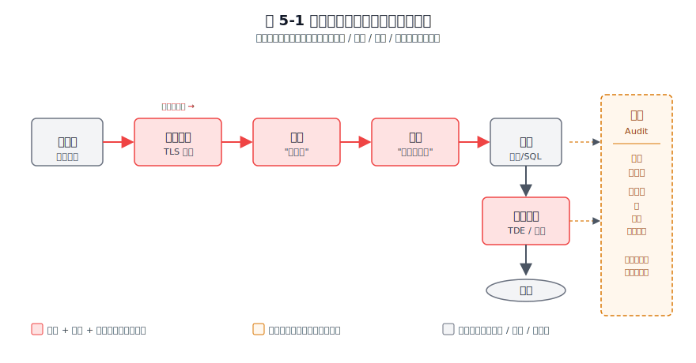
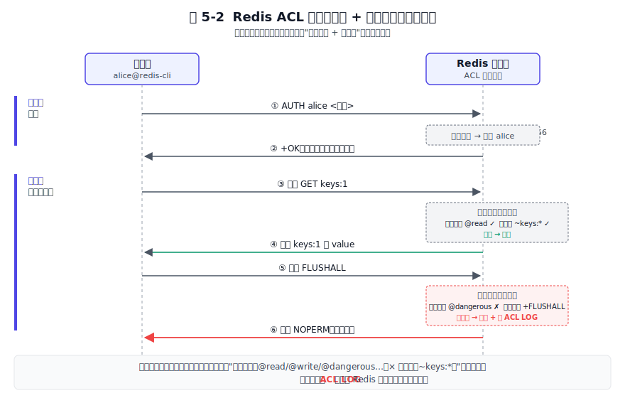
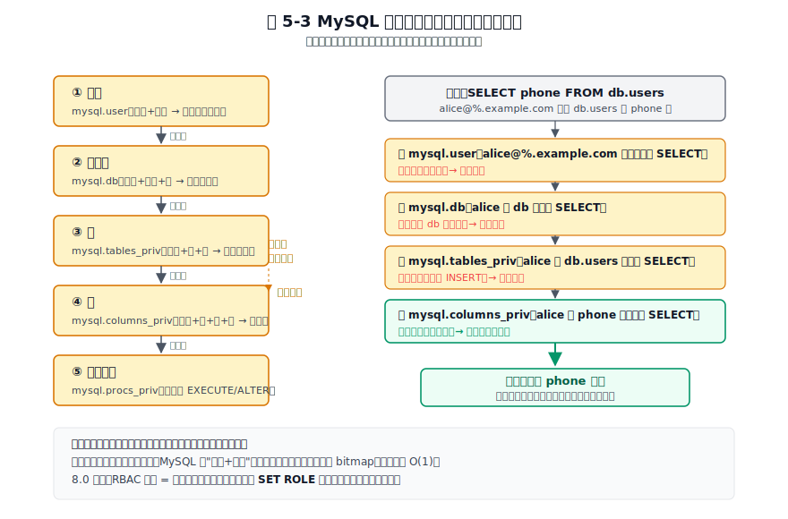
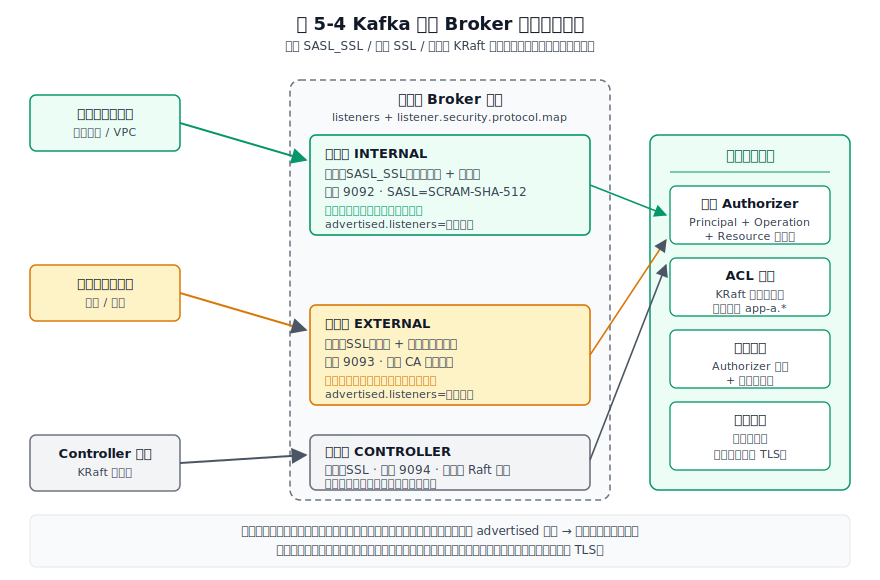

# 第 5 章 安全机制 — 权限、加密、审计

## 本章导读

一个数据系统被攻陷，损失的是全公司的数据。安全机制要回答四件事：你是谁（认证）、你能做什么（授权）、数据在路上和落盘时是否被窃听或篡改（加密）、事后能否查清谁干了什么（审计）。这四件事构成贯穿全章的分析骨架。

本章把三款定位迥异的软件放进同一张安全分析表里。Redis 重性能，长期把安全让位给网络隔离；MySQL 重企业级完整，一开始就把权限下沉到列级；Kafka 重分布式协作，因为天生多跳（客户端 → Broker → 副本 → KRaft 控制面），必须在每一跳都重新谈一次身份。读完本章，你会建立一个"认证—授权—加密—审计"四维分析框架，理解三家的安全模型为何如此分叉，并拿到几条能直接用在选型和评审里的设计原则。

## 5.1 问题的本质

在拆解三家实现之前，先把"数据系统的安全"抽象成一个共性问题。任何一个面向多用户的数据系统，都要在四条线上同时把守。

第一条是**认证（Authentication）**，回答"你是谁"。它要解决凭证的存储、传输、校验和防暴力破解。第二条是**授权（Authorization）**，回答"你能做什么"。它把一个已认证身份映射到一组可执行的操作集合，集合的边界越精细，越能控制误操作和越权带来的伤害。第三条是**加密（Encryption）**，分为传输加密和存储加密：传输加密保证机密性与完整性在路上不被破坏，存储加密保证数据落盘后即使磁盘被盗也无法直接读取。第四条是**审计（Audit）**，回答"事后能否查清谁在什么时候做了什么"，是合规取证和事后复盘的依据。这四条线不是孤立的，它们在一次"客户端发起请求到数据落盘"的链路上各管一段。

下面这张总览图把四维模型落在一次请求链路上，让你直观看到它们各自负责的范围。


图 5-1：从客户端发起请求到数据落盘，认证、授权、加密、审计各负责链路中的一段。

如上图所示，客户端的请求先穿过传输加密建立的 TLS 隧道，进入服务端后由认证确认身份，由授权决定能不能执行这条命令或 SQL，执行结果写入磁盘时由存储加密保护，而整个过程的关键事件由审计留痕。四维在一条请求上接力，任何一段缺位都构成漏洞。

数据系统和普通的 Web 应用在安全上有几个特殊约束。首先是**长连接加高频小操作**。Redis 单条 GET、MySQL 单条主键查询的耗时是微秒到亚毫秒级，如果每条操作都走完整的认证握手，性能会被吃光。于是三家都在"会话级认证一次、每操作级授权一次"的模型上做缓存与简化。其次是**多租户共享存储**。同一个 Redis 实例、同一个 MySQL 实例、同一个 Kafka 集群往往承载多个应用的不同键、表、主题，授权必须做到细粒度的资源隔离。最后是**复制与分布式协调**。主从之间、Broker 之间、Broker 与 KRaft 控制面之间也要互相认证，身份不止"客户端对服务端"这一种，节点对节点、控制面对数据面都要谈身份。

三家的先天约束差异，决定了它们的安全走向。Redis 的内核追求极简和单核十万级 QPS，安全特性长期被"性能优先加内网部署"的假设推迟。MySQL 面向企业市场，权限模型从第一天就追求列级、多层级、可审计。Kafka 天生分布式、多跳通信，安全设计必须可组合，于是它选了 SASL 框架加监听器分层这条路。这些差异在 5.5 节会系统对比，这里先立靶。

## 5.2 Redis 的做法

Redis 的安全史是一部"先放弃、再补课"的演进史。它把性能和极简内核摆在第一位，安全能力长期被推迟，直到 6.0 才一次性补上 ACL 和 TLS。理解这条演进路径，比记住配置项更重要。

### 5.2.1 认证：从全局密码到 ACL 用户

6.0 之前的 Redis 只有一个 `requirepass` 全局密码，所有客户端共享，无法区分身份。这是"安全让位给极简内核"的典型决策：内核不知道调用者是谁，只校验一个共享口令。这种模型在内网可信环境里够用，但一旦 Redis 被错误地暴露到公网，攻击者拿到密码就等于拿到最高权限，历史上未授权 Redis 写 SSH 公钥、写定时任务导致远程代码执行（RCE）的案例多到成梗。

6.0 引入 ACL（Access Control List，访问控制列表）是一次结构性补课。ACL 的核心是"用户"这个一等概念，每个用户有自己的密码集合、命令权限和键模式。一条典型的规则长这样：

```
ACL SETUSER alice on >pwd ~keys:* +get +set
```

这条语句创建用户 alice，启用状态、设置密码、允许访问匹配 `keys:*` 的键、授予 `GET` 和 `SET`。每一项都是"最小可表达单元"的取舍。一个关键问题是：为什么不搞 RBAC（基于角色的访问控制）角色？答案是 Redis 内核要轻。Redis 实例上的用户数通常很少，几台应用机器各对应一个用户就够，引入"角色—用户"两层语义会让内核背上不必要的复杂度。把组角色这类复杂语义留给外部的身份管理系统（IAM），是 Redis 一以贯之的边界划法。

凭证存储上，密码用 SHA-256 哈希存（通过 `ACL FILE` 持久化到 `users.acl`），不存明文。这是凭证落盘的最小安全要求。需要注意的是，SHA-256 是哈希不是加密，且无加盐，对弱密码仍有字典攻击风险，因此 Redis 文档强调密码要足够长且随机。

### 5.2.2 授权：键模式加命令类别的二维控制

Redis 的授权把权限直接绑到用户，不做角色继承。前面说过，理由是用户数少、角色层是过度设计。授权的控制面是两个维度的组合：命令类别和键模式。

命令类别是关键抽象。Redis 把上百条命令折叠成几个语义组：`@read`、`@write`、`@admin`、`@dangerous`、`@fast`、`@slow`。运维一眼就能配出一个"只读且不含危险命令"的用户：`+@read -@dangerous`。这种"按风险分桶"的命名本身就是安全设计——它让常见的安全意图（只读、不可破坏）能被一行表达，而不必逐条列举几十个命令。

为了把"会话级认证一次、每命令授权一次"这套模型讲清楚，下面这张时序图展示了一次完整连接里 Redis ACL 的工作流程。


图 5-2：会话级认证一次，每条命令都走"命令类别加键模式"二维授权检查。

如上图所示，连接建立时客户端先用 `AUTH alice <密码>` 走一次完整认证，服务端校验 SHA-256 通过后把这条连接绑定到用户 alice。这是阶段一，整个会话只做一次。之后每条命令进入阶段二的授权检查：服务端根据当前用户绑定的规则，分别检查命令类别（GET 属于 @read）和键模式（`keys:1` 匹配 `~keys:*`）两个维度，两项都命中才放行。图中 alice 执行 `GET keys:1` 通过，但执行 `FLUSHALL` 会被拒绝——`FLUSHALL` 属于 @dangerous，alice 的规则里没有授予。

这个"认证一次、每命令授权"的设计，是 Redis 在性能和安全之间找的平衡点：认证握手贵，所以摊到会话上；授权检查轻，所以每条命令都做。

键模式控制作用范围。`~keys:*` 限定用户只能访问匹配该模式的键，这让多租户场景下不同应用可以按前缀隔离。6.2 之后，通道（channel）权限也独立出来，Pub/Sub 的订阅权限和键空间的读写权限分离，避免一个客户端既能写数据又能订阅敏感事件。

Redis 的默认策略其实长期没有收紧到"默认安全"。7.x 里 `default` 用户的内置规则仍是 `user default on nopass ~* &* +@all`——启用、无密码、全键、全通道、全命令，即"裸奔态"靠的是向后兼容，不能指望它替你兜底。真正起作用的是 `protected-mode`（保护模式，3.2.0 起，默认开启）：当 Redis 绑定全部网卡且没有配置任何密码、`AUTH` 等认证手段时，它只接受本地回环连接，对外网连接直接拒绝。换句话说，protected-mode 拦的是"裸监听被外网命中"，不替代认证本身。要真正收紧，必须显式给 `default` 用户设密码或直接禁用（`ACL SETUSER default off` / `resetpass`）。这两条机制合起来，是 Redis 在不破坏向后兼容的前提下尽量补的默认安全——但它的底色仍是"运维必须主动加固"，而非"装好即安全"。

### 5.2.3 加密：TLS 是 6.0 才补上的课

Redis 到 6.0 才原生支持 TLS。6.0 之前的"安全传输"靠 stunnel 代理或 SSH 隧道，本质是把加密功能外包给外部进程。这是一次明确的取舍：Redis 追求单核十万级 QPS，TLS 的握手开销和每个包的加解密都会直接拉低吞吐，把这种代价推到内核之外，能让绝大多数不需要加密的内网用户不受影响。

补上 TLS 之后，Redis 也没有把它设为强制。它选择"TLS 可选、按端口开启"：你可以关掉明文端口、只开 TLS 端口，也可以两者并存做平滑迁移。配置上建议限定 `tls-protocols TLSv1.2 TLSv1.3`，关闭老旧协议，客户端证书按需启用。典型的性能代价是：开启 TLS 后单线程吞吐相比无加密约降至六成左右（具体数值随硬件、TLS 版本、证书算法波动较大，以实测为准）。Redis 把这个决策权交给部署者，而不是替所有人做主。

### 5.2.5 设计取舍小结

Redis 的安全哲学是"内网优先、按需叠加"。它默认假设部署在可信网络，把安全能力做成可选模块。这种假设在内网部署时合理，但在公网部署或云原生环境下极易因配置疏漏被攻击。实用建议是：开启 ACL 并为每个应用建独立用户、关闭 default 用户、开启 protected-mode、按需开 TLS、用 ACL LOG 加外接采集补审计。补完这套，Redis 才算从"能用"进入"敢上生产"。

## 5.3 MySQL 的做法

MySQL 走的是另一条路。它面向企业市场，从第一天就把安全当作一等公民：强密码、多层级权限、可审计、可插拔认证。理解 MySQL 的安全设计，关键是抓住"层级权限表"和"可插拔认证"这两个决策。

### 5.3.1 认证：可插拔认证插件是核心抽象

MySQL 的用户身份由 `用户名@主机名` 两部分组成，主机名是身份的一部分。这个设计看似细节，实际上很关键：它让 MySQL 天生支持"同一个账号在不同来源有不同密码和权限"，这是企业级多来源接入（办公网、VPN、应用网段、跳板机）的现实需求。

8.0.4 起把默认认证插件从老的 `mysql_native_password` 改成了 `caching_sha2_password`（8.0 系列中后段默认即此，老客户端常因不支持而需要显式回退）。新插件用 SHA-256 哈希，首次连接走完整的挑战—响应握手，之后服务端把哈希结果缓存在内存里，后续连接走快路径。缓存让长连接场景下的高频认证不再成为瓶颈，但缓存失效（改密码、重启）会触发重新走慢路径——这是一个典型的"缓存换性能"的折中。这是"长连接加高频认证"场景的标准解法，也是 MySQL 不像 Redis 那样把认证做成轻量模型的原因——它的用户量和接入复杂度要求认证逻辑足够灵活。

可插拔是更深的设计。认证逻辑与协议解耦，认证变成一个可替换的插件：`auth_socket` 让本机进程免密登录、`authentication_pam` 对接企业 PAM、`ldap_simple` 对接 LDAP 目录、`sha256_password` 提供无缓存的高安全选项。把身份验证外包给最合适的子系统，是 MySQL 一以贯之的设计思想，这与第 4 章讲过的"可插拔存储引擎"是同一种思路——核心保留扩展点，把变化的部分留给插件。TLS 的协商嵌在握手包里，配合 `REQUIRE SSL`、`REQUIRE X509` 或指定证书主题字段，可以做到账号级强制加密。

### 5.3.2 授权：多层级权限表加 8.0 RBAC

MySQL 的授权模型是三家里最复杂的，也是最精细的。权限按作用域分五层：全局、数据库、表、列、存储程序。这套层级不是装饰，它对应 `mysql.user`、`mysql.db`、`mysql.tables_priv`、`mysql.columns_priv`、`mysql.procs_priv` 多张权限表。授权检查时，从全局到列逐层收窄，命中即停。

下面这张图展示了这条逐层收窄的检查流程。


图 5-3：授权检查从全局到列逐层收窄，命中即停；细粒度优先于粗粒度。

如上图所示，一条 `SELECT phone FROM db.users` 要先查全局权限表（是否对该账号全库通吃），未命中再查数据库级、表级，最后到列级（phone 这一列有没有 SELECT）。这种"逐层收窄、命中即停"的设计有一个直接代价：层级越细检查越慢。MySQL 的应对是把检查结果按"账号加库表"做内存缓存，把权限压成位图（bitmap），让授权检查在绝大多数热路径上变成内存查询。

8.0 才补齐 RBAC 角色系统，支持 `CREATE ROLE`、`GRANT role TO user`、会话级 `SET ROLE`。为什么这么晚？因为 MySQL 已有的权限矩阵极其复杂，用户量级也大，引入角色必须兼顾"不破坏已有 GRANT 语义"。MySQL 的做法是"角色等于一组权限的命名集合加会话激活"，而不是推翻权限表重做。这是一种务实的兼容优先：新能力叠加在老模型上，老应用零迁移。

权限语义按风险分四类：数据操作（DML，包括 SELECT、INSERT、UPDATE、DELETE）、结构变更（DDL，包括 CREATE、ALTER、DROP，更危险）、管理（SUPER、PROCESS、FILE、RELOAD，高度敏感）、复制（REPLICATION SLAVE、REPLICATION CLIENT，专用于复制拓扑）。这种按风险分桶的命名本身就是安全设计——它让 DBA 一眼能看出哪些权限该谨慎授予。值得一提的是 FILE 权限：它能读写服务器文件系统，配合 SQL 注入可读任意文件，是高敏权限的典型。

### 5.3.3 加密：传输 TLS 加存储 TDE 两层

MySQL 的加密覆盖传输和存储两层。传输层 TLS 的配置与服务端证书、CA、客户端证书验证同 Redis、Kafka 大体一致，无特别处，但 MySQL 的独到之处是前面提到的账号级 `REQUIRE SSL`，让加密变成权限的一部分而不是全局开关。

存储加密是 MySQL 更有特色的部分。TDE（Transparent Data Encryption，透明数据加密）在 InnoDB 表空间级别加密数据，密钥由密钥管理插件托管，常见的是对接 HashiCorp Vault 或云厂商 KMS。TDE 的核心取舍是"对应用透明"——SQL 不需要改一个字，加解密在存储引擎层完成。代价是密钥管理变成新的单点：密钥丢失等于数据不可读，所以 TDE 必须配套密钥轮换与备份策略，否则就是把"数据丢失"风险换成了"密钥丢失"风险。

8.0.14 起二进制日志（binlog）与 relay log 支持加密，8.0.15 起重做日志（redo log）、回滚日志（undo log）也支持加密。这是个容易被忽视的纵深防御点：表加密了，但日志明文写在磁盘上，攻击者仍能从日志里拼出敏感数据。日志加密补上了这个缺口，是纵深防御在存储层的体现。

### 5.3.5 设计取舍小结

MySQL 的安全哲学是"企业级默认安全、分层完整"。它装好就要求强 root 密码、提供删匿名用户的脚本、可启用 `connection_control` 插件做连接失败锁定，把安全作为一等公民。代价是配置项多、学习曲线陡。对开发者来说，这意味着用好 MySQL 安全需要花时间学，但学完之后它能胜任金融、电信这类对合规要求严苛的场景。

## 5.4 Kafka 的做法

Kafka 的安全设计面对的是一个单机系统不会有的难题：一次数据流动要跨好几跳。客户端把消息发给 Broker，Broker 把消息复制到其他 Broker 的副本，Broker 还要和控制面（ZooKeeper 或 3.x 的 KRaft）通信。任何一跳明文、任何一跳不认证，都是漏洞。Kafka 的应对是把认证、加密、授权都做成可独立启用的模块，让运维按网络域组合配置。抓住"多跳身份"和"可组合安全"这两点，就能看懂 Kafka 安全的全貌。

### 5.4.1 认证：SASL 框架加 JAAS 配置

Kafka 不自造认证协议，而是复用 SASL（Simple Authentication and Security Layer，简单认证与安全层）这个抽象层。SASL 下面挂多种机制：PLAIN、SCRAM-SHA-256、SCRAM-SHA-512、GSSAPI（Kerberos）、OAUTHBEARER（OAuth 2.0）。每种机制通过 JAAS（Java Authentication and Authorization Service）配置文件注入 Broker 和客户端。这个选型背后的取舍是清晰的：Kafka 要无缝接入企业 Kerberos 和云原生 OAuth，复用成熟的标准生态比自己发明协议更稳，也更容易通过合规审查。

生产环境推荐 SCRAM，尤其是 SCRAM-SHA-512。SCRAM 是挑战—响应机制，凭证只存服务端（用迭代哈希加盐存储），客户端不需要持有明文密码。相比 PLAIN 机制（客户端要持有明文、网络上虽走 SASL 但 PLAIN 本身无挑战），它安全得多。SCRAM 的一个关键取舍是凭证存放在元数据存储里：在 3.x 去 ZooKeeper 之后，SCRAM 凭证存在 KRaft 的元数据日志里。这意味着元数据存储本身成了新的信任根——谁能写元数据，谁就能改 SCRAM 凭证。这是分布式系统把信任根从"单点数据库"转移到"共识日志"的典型例子，相应的元数据存储也要严格认证和加密。

这里还有一个绕不开的循环依赖：KRaft 控制面的节点间共识通信（quorum）不能用 SCRAM 认证，因为 SCRAM 凭证就存在这条共识日志里，要先有 quorum 才能读到凭证，形成鸡生蛋的僵局。所以控制面监听器通常配成预共享证书的 SSL，而把 SCRAM 留给客户端到 Broker 这一层。监听器分层在这里不只是便利，而是机制上的硬性约束。

委托令牌（Delegation Token）是 Kafka 处理"身份在跳之间频繁传递"的另一招。长期凭证（SCRAM 密码、Kerberos 票据）在客户端和 Broker 之间反复传会有泄露风险，委托令牌是短期有效的令牌，由已认证的客户端向 Broker 申请，之后用令牌做认证，到期自动失效。这是分布式"身份传递"问题的标准解，我们在 5.6 节会展开它的设计意义。

监听器分层是 Kafka 区别于单机系统的关键能力。同一个 Broker 进程可以同时开多个监听器：内部走 `SASL_SSL`（强制认证加加密）、受信网络走 `SASL_PLAINTEXT`（认证但不加密，省 CPU）、对外走 `SSL`（仅加密）或独立的 `SASL_SSL`。配置项 `listeners` 和 `listener.security.protocol.map` 让你按网络域给不同端口配不同协议。这是"按网络域分级信任"的设计，下面这张图展示了它的典型布局。


图 5-4：内部 SASL_SSL、外部 SSL、控制面 KRaft 三条路径并行，按网络域分级信任。

如上图所示，同一个 Broker 对内网应用客户端开 INTERNAL 监听器（SASL_SSL，SCRAM-SHA-512，内网互信证书），对外网客户端开 EXTERNAL 监听器（SSL 或独立 SASL_SSL，公网 CA 签发证书），同时与 KRaft 控制面通过控制面监听器通信。三条路径用不同的协议、证书和信任级别，做到了"内网宽松、外网严格"的分级。这种设计在单机系统里没有对应物，是 Kafka 作为分布式流平台必须付出的架构复杂度。

### 5.4.2 授权：ACL 绑定"Principal + Operation + Resource"三元组

Kafka 的授权模型是 ACL，每条规则绑定三元组：主体（Principal，通常是服务账号或用户）、操作（Operation）、资源（Resource）。资源类型有 Topic、Group、Cluster、TransactionalId、DelegationToken，每类资源有自己的操作集：Read、Write、Create、Delete、Alter、Describe、ClusterAction、All。

一个值得讨论的取舍是：Kafka 原生只有 ACL，没有 RBAC。原因和 Redis 类似但语境不同——流平台的主语通常是"应用或服务"而不是"人"，服务身份相对稳定，角色层收益不大。企业真要 RBAC 时，通常外接 Apache Ranger 或 Sentry 这类统一管控层，把 Kafka 的 ACL 作为底层落地点。这种"内核只做最小 ACL，把 RBAC 留给上层"的边界划法，和 Redis 把角色留给 IAM、MySQL 把审计插件做成可选是同一种工程哲学：核心保持简单，复杂语义外挂。

前缀授权（prefixed resource pattern）是多租户场景的便利设计。一条规则 `--resource-pattern-type prefixed --topic app-a.` 就能把所有 `app-a.` 开头的主题的读写权限授予 app-a 这个服务，避免逐主题授权。在一个集群承载几十上百个服务的场景下，前缀授权把"权限矩阵"压成了"前缀约定加少量例外"，运维成本骤降。

Kafka 的默认策略有一条值得讲清的演进。`allow.everyone.if.no.acl.found` 这个参数（仅对旧的 `SimpleAclAuthorizer` 生效）在 1.x 时代默认是 true，即无 ACL 即放行，方便上手。从 2.0 起官方把默认值改成了 false，3.x 沿用这个收紧后的默认——没有匹配的 ACL 就拒绝。新引入的 `StandardAuthorizer`（KRaft 模式下的内置授权器）本身也遵循"默认拒绝"。也就是说，3.x 基线下默认已经是安全的。但生产部署时仍建议显式确认这个值并配齐 ACL：因为"默认拒绝"一旦生效，遗漏某个资源的 ACL 会让正常请求也被拒，运维必须保证 ACL 覆盖完整。

### 5.4.3 加密：TLS 覆盖所有通信路径

Kafka 的加密范围比单机系统广得多。客户端到 Broker、Broker 到 Broker（副本同步）、Broker 到控制面（KRaft 元数据）都要 TLS，任何一段明文都是漏洞。这是分布式纵深防御的硬要求，也是 Kafka 加密配置比 Redis、MySQL 复杂的根本原因——你要同时管好几条 TLS 通道。

性能代价相应也大。副本同步是大流量长连接，TLS 加解密对吞吐影响明显。实测中，RSA 证书方案吞吐降幅约三成多，改用 ECDSA 证书能把降幅压到两成多（具体数值随硬件和负载波动，以实测为准）。优化手段包括用 ECDSA 替代 RSA、启用 TLS 会话恢复（session resumption，避免重复握手）、在专用硬件上做加密卸载。内部通信和外部通信还可以用不同监听器配不同证书，做到"内网互信证书加外网 CA 签发证书"分层，既省内部开销又保外部严格。

### 5.4.5 设计取舍小结

Kafka 的安全哲学是"模块化可组合、按网络域分级"。它不强制任何一种安全机制，而是提供 SASL、TLS、ACL 三套可独立启用的积木，让运维按部署形态自由组合。代价是配置矩阵复杂、容易配错（一个典型生产集群的安全配置项能写满几十行），生产化通常需要 Ranger 这类统一管控层来收口。理解这一点，你就能在评审 Kafka 集群安全时抓住重点：先看监听器分层是否合理，再看 SASL 机制选型，最后看 ACL 是否覆盖全部资源——而不是被几十个配置项淹没。

### 5.4.6 审计：三家的共同短板

把认证、授权、加密、审计排个优先级，审计在三家系统里都是第四名。这不是疏忽，而是权衡——审计的每一分细致都是用吞吐换的。

Redis 只提供 ACL LOG（记录被拒命令的详情，包括时间戳、客户端 IP、被拒命令和参数）和 SLOWLOG（记录执行时间超过阈值的命令）。这两样加在一起能回答"谁被拒了"和"什么慢了"，但距离完整的审计轨迹——谁在什么时候做了什么操作、改了什么数据——还差得远。

MySQL 的审计能力比 Redis 强，但有门槛。企业版提供审计插件，能做语句级审计、按用户/数据库/主机过滤、把日志输出到文件或 syslog。社区版用户通常只能用 General Log 做近似替代——记录所有客户端发来的 SQL，短时间调试可以，生产环境长时间开启会让磁盘和性能都吃不消。

Kafka 的原生审计来自 Authorizer 日志——记录每一次授权决策（允许或拒绝），但粒度粗且不包含消息内容。生产环境通常外挂补全：自定义 ProducerInterceptor / ConsumerInterceptor 在客户端拦截并写审计主题，或接 Ranger 这类带审计能力的统一管控层。

三家的共同启示是：审计在生产级部署中几乎总是外挂的。不是不想做——是如果每条操作都同步写审计日志，性能会崩到不可用。接受这个现实之后，务实的选择是把审计日志做成异步、采样、或外接专用审计系统，而不是指望存储引擎本身给出完美的审计轨迹。

## 5.5 横向对比

把三家在四个维度上的选择并排放出来，能看出同一问题上各自的取舍和背后的动机。下表按认证、授权、加密、审计四维铺开，重点不在罗列，而在看"为什么分叉"。

**表 5-1：安全机制四维横向对比表**

| 对比维度 | Redis（7.x） | MySQL（8.0） | Kafka（3.x） |
|---|---|---|---|
| 默认是否认证 | 否（仅可选密码） | 是（强 root 密码） | 否（明文监听器可选） |
| 认证抽象 | ACL 用户加多密码 | 可插拔认证插件 | SASL 框架加 JAAS |
| 推荐生产认证 | ACL 加 TLS 客户端证书 | caching_sha2_password | SCRAM-SHA-512 |
| 凭证存储 | 内存加 ACL FILE（SHA-256） | mysql.user（SHA-256 缓存） | KRaft/ZK（SCRAM 哈希） |
| 授权模型 | ACL（用户直绑） | RBAC 加五级层级 | ACL（资源三元组） |
| 最细粒度 | 键模式加命令 | 列级 | 资源类型级 |
| 角色继承 | 无 | 8.0 RBAC | 无（外接 Ranger） |
| 默认策略 | default 用户默认全开，靠 protected-mode 拦外网 | 默认安全（强密码、可删匿名） | 无 ACL 默认拒绝（2.0 起） |
| 传输加密 | 6.0+ TLS，可选 | TLS（账号级 REQUIRE） | TLS 全路径（多监听器） |
| 存储加密 | 无原生 | TDE 表空间加日志加密 | 无原生（靠磁盘加密） |
| 审计能力 | ACL LOG 加 SLOWLOG（弱） | 企业审计插件加 General Log | Authorizer 日志加拦截器（弱） |
| 性能取向 | 性能优先，安全可选 | 安全与功能并重 | 模块化可组合 |
| 典型部署假设 | 可信内网 | 企业网络 | 混合或云原生多跳 |

这张表里有三条值得展开的解读。

**认证抽象的分叉反映了协作复杂度。** Redis 用最直白的"用户加密码"，因为它的内核要轻、协作场景简单；MySQL 用可插拔插件，因为企业要对接各种目录服务（LDAP、PAM、Kerberos）；Kafka 用 SASL 框架，因为它要在分布式多跳间复用标准协议。可以提炼出一条规律：认证抽象层的厚度与系统的协作复杂度成正比。单点系统用直白认证就够，要对接多种身份源或跨多跳传输的系统必须引入更厚的抽象层。

**授权粒度跟随数据模型，不是越细越好。** MySQL 做到列级，因为关系型数据天然有"列等于字段权限"的需求，phone、idcard 这类敏感字段需要单独管控；Redis 做到键模式加命令，因为键值模型没有"列"概念，键名前缀就是天然的隔离边界；Kafka 做到资源类型级，因为流的主语是服务而非人，主题粒度已经够用。强行把 Kafka 的 ACL 做到消息级，既无必要也不可行——每条消息都查权限，吞吐会急剧下降到实际无法承受。

**审计是三家的共同短板，原因相同。** 三家原生审计都不强（MySQL 企业版最好但要付费），共同原因是全量审计的 I/O 开销与"内存或吞吐即生命"的核心价值观冲突。Redis 选性能放弃审计，Kafka 选吞吐放弃审计，MySQL 把审计做成付费插件。结论很现实：审计在数据系统里天生是二等公民，必须靠"规则过滤加外接 SIEM"补足，指望数据库自带完整审计是不切实际的。

## 5.6 架构启示

从三家的具体实现里，能提炼出五条可复用的安全设计原则。它们是选型和评审时能直接拿出来的判断标准。

### 启示一：默认安全策略要与典型部署环境匹配

Redis 默认开放（假设内网）、MySQL 默认收紧（假设企业网络暴露）、Kafka 默认中性（假设混合云）。三家的默认值不是随意选的，而是对"最可能被怎么部署"的预判。配错默认值等于把攻击面留给了运维者的记性——Redis 历史上那些公网裸奔被攻陷的案例，本质都是默认值与实际部署环境错配。

**原则**：默认安全不是一个布尔值，而是一个与部署环境对齐的函数。面向公网的服务应默认收紧，内部工具可以更开放。

### 启示二：纵深防御等于每层都收一点性能税

把安全做成多层叠加：网络隔离、传输加密、认证、授权、审计、存储加密。任何一层单独突破都不致命，攻击者要拿走数据必须同时攻破多层。代价是每层都收一点性能税：TLS 握手多一到两个 RTT、授权检查每条操作都走一次、审计带来额外 I/O、存储加密吃 CPU。三家都接受这笔税，而不是把全部赌注押在某一层（比如只靠网络隔离）。

**原则**：安全的代价不是一次付清，而是每一层都收一点性能税。愿意付这笔税的系统，比任何单点加固都更难攻破。

### 启示三：最小权限原则是可操作规则，不是口号

三家都支持且都推荐最小权限：每个应用独立账号、只授必要命令或操作、限定键或表或主题范围、定期审查。实现手段各不相同——Redis 用键模式隔离、MySQL 用角色加列权限、Kafka 用前缀授权——但原则一致。反模式也一致：用超级用户跑应用、授予 ALL 权限"以防万一"、密码硬编码、长期不轮换。在评审一个系统的安全时，"是否每个应用都有独立的最小权限账号"是最快也最有效的检查项。

### 启示四：分布式身份传递是单机安全没有的新问题

单机系统的安全模型是"认证一次、授权每操作"，这个模型在分布式多跳下不够用。Kafka 的委托令牌、服务账户、代理传递三种方案各有取舍：委托令牌短期有效但需要刷新机制；服务账户丢弃了原始客户端身份；代理传递依赖服务之间的信任。任何分布式系统的安全设计，都要额外回答一个问题——"身份如何在跳与跳之间安全传递且不被伪造"。这个问题在 Redis、MySQL 这种单进程系统里根本不存在，但在 Kafka、在微服务网格、在任何跨服务调用里都是头等难题。

### 启示五：抽象层的厚度与协作复杂度成正比

回应 5.5 的解读：单点系统用直白认证（Redis），企业系统用可插拔插件（MySQL），分布式系统用标准框架（Kafka 的 SASL）。做选型时先问自己两个问题——"我要对接多少种身份源""我的请求要跨多少跳"，答案决定了你应该选多厚的抽象层。强行给单点系统上 SASL 框架是过度设计，强行让分布式系统用全局密码是欠设计。

补一句现代视角的延伸：三家的默认模型仍偏向"内网可信"，而现代零信任（Zero Trust）架构要求每一跳都认证授权、不区分内外网。零信任超出了这三款软件的内置能力，需要外接服务网格、统一身份平面、动态授权引擎，但理解三家的内置安全模型，是迈向零信任的必要基础——你得先知道每一跳现在是怎么认证的，才能把它改造成零信任要求的样子。

## 5.7 小结

认证、授权、加密、审计这四件事，在三家身上各有侧重。Redis 从无认证到 ACL，体现的是"安全让位于性能、再按需补回"的演进路径；MySQL 一开始就把权限下沉到列级，体现企业级市场对完整性和可审计的硬性要求；Kafka 用 SASL、TLS、ACL 三套积木应对多跳分布式，体现可组合的工程哲学。三家差异背后是同一条规律——安全设计的上限，由数据模型（关系、键值、流）和部署形态（单机、企业、分布式）共同决定。脱离这两者谈"谁更安全"没有意义，正确的问法是"在它的数据模型和部署形态下，这套安全设计是否做到了合理的上限"。

下一章进入集群架构，我们要看的正是安全身份如何在多节点之间传递与校验——Redis Cluster 的节点互信、MySQL 组复制的成员认证、Kafka 多 Broker 的 SASL 与控制面安全，会把本章的"多跳身份"问题放到更大的拓扑里继续展开。
