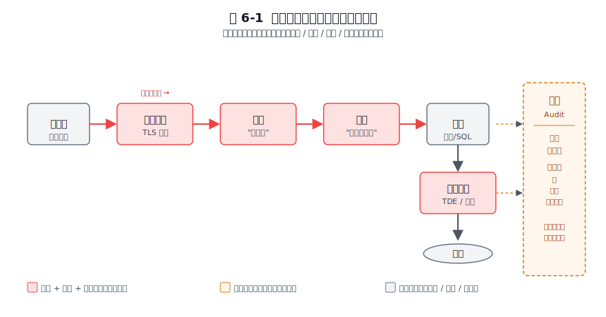
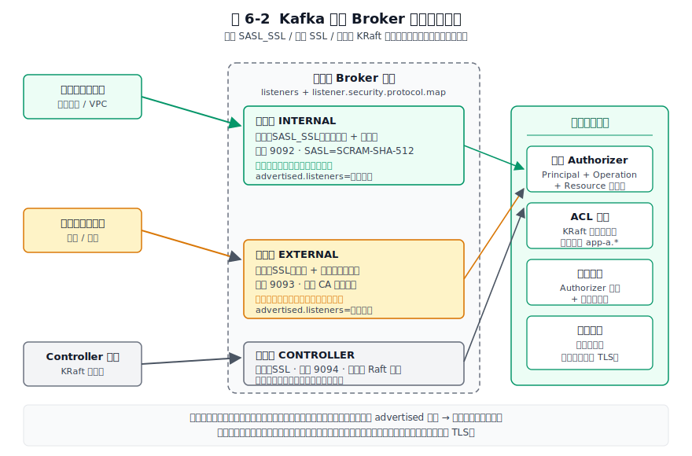
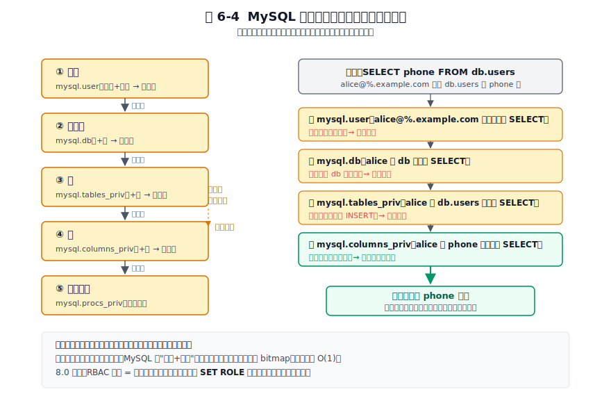

# 第 6 章 安全机制 — 权限、加密、审计

## 本章导读

为什么 Redis 可以裸奔很多年、MySQL 从第一天就把权限做到列级、Kafka 必须在每一跳都重新谈一次身份？这三个答案的差异比想象中大得多，而差异的根子不在"安全"本身——在它们各自的数据模型和部署形态。单机内存、企业关系型、分布式多跳，三种形态对安全提了完全不同的要求。

本章把三款软件放进同一张安全分析表，沿着认证、授权、加密、审计四条线上逐个拆解。读完你会形成一个可迁移的判断：安全设计的上限，由数据模型（关系、键值、流）和部署形态（单机、企业、分布式）共同决定。下次给一个新系统做安全评审，先看它的数据住在哪、请求要跨几跳——答案自然就出来了。

## 6.1 问题的本质

在看三款软件的实现之前，先把"数据系统的安全"抽象成一个共性问题。任何一个面向多用户的数据系统，都要在四条线上同时把守。

第一条是**认证（Authentication）**，回答"你是谁"。它要解决凭证的存储、传输、校验和防暴力破解。第二条是**授权（Authorization）**，回答"你能做什么"。它把一个已认证身份映射到一组可执行的操作集合，集合的边界越精细，越能控制误操作和越权带来的伤害。第三条是**加密（Encryption）**，分为传输加密和存储加密：传输加密保证机密性与完整性在路上不被破坏，存储加密保证数据落盘后即使磁盘被盗也无法直接读取。第四条是**审计（Audit）**，回答"事后能否查清谁在什么时候做了什么"，是合规取证和事后复盘的依据。这四条线在一次"客户端发起请求到数据落盘"的链路上各管一段。

图 6-1 把四维模型落在一次请求链路上，展示了它们各自负责的范围。


图 6-1：从客户端发起请求到数据落盘，认证、授权、加密、审计各负责链路中的一段。

客户端的请求先穿过传输加密建立的 TLS 隧道，进入服务端后由认证确认身份，由授权决定能不能执行这条命令或 SQL，执行结果写入磁盘时由存储加密保护，而整个过程的关键事件由审计留痕。四维在一条请求上接力，任何一段缺位都构成漏洞。

数据系统和普通的 Web 应用在安全上有几个特殊约束。一是**长连接加高频小操作**。Redis 单条 GET、MySQL 单条主键查询的耗时是微秒到亚毫秒级，如果每条操作都走完整的认证握手，性能会被拖垮。于是它们都在"会话级认证一次、每操作级授权一次"的模型上做缓存与简化。二是**多租户共享存储**。同一个 Redis 实例、同一个 MySQL 实例、同一个 Kafka 集群往往承载多个应用的不同键、表、主题，授权必须做到细粒度的资源隔离。三是**复制与分布式协调**。主从之间、Broker 之间、Broker 与 KRaft 控制面之间也要互相认证，身份不止"客户端对服务端"这一种，节点对节点、控制面对数据面都要谈身份。

这三款软件因先天约束差异，走出了不同的安全路线。Redis 的内核追求极简和单核十万级 QPS（小包 GET/SET 场景），因为长期假设部署在内网，安全特性一直往后排。MySQL 面向企业市场，权限模型从第一天就追求列级、多层级、可审计。Kafka 天生分布式、多跳通信，安全设计必须可组合，于是它选了 SASL 框架加监听器分层这条路。这些差异在 6.6 节会系统对比。

## 6.2 认证

认证是安全的第一关：在客户端执行任何操作之前，系统必须回答"你是谁"。Redis 内网里一个共享密码就够，MySQL 要按账号、来源、插件把认证做成体系，Kafka 则因为多跳，必须在每一跳都重新认证一次。

### Redis：从全局密码到 ACL 用户

我见过一个真实的"公网裸奔"案例。一家初创公司图方便，把 Redis 绑在 0.0.0.0:6379 上，没设密码就上线了。两周后被扫到，攻击者写了 SSH 公钥进去，服务器直接失守。那次之后我养成了一个习惯：任何新系统上线前，先审一遍它暴露给网络的端口和认证手段。

Redis 的安全演进路径是"先放弃、再补回"。它把性能和极简内核摆在第一位，安全能力一直往后排，直到 6.0 才一次性补上 ACL 和 TLS。这条演进路径本身就是选型时该记的。

6.0 之前的 Redis 只有一个 `requirepass` 全局密码，所有客户端共享，无法区分身份。这是"安全让位给极简内核"的取舍：内核不知道调用者是谁，只校验一个共享口令。这种模型在内网可信环境里够用，但一旦 Redis 被错误地暴露到公网，攻击者拿到密码就等于拿到最高权限，历史上未授权 Redis 写 SSH 公钥、写定时任务导致远程代码执行（RCE）的案例多到成梗。

6.0 引入 ACL（Access Control List，访问控制列表）是一次结构性补回。ACL 的核心是"用户"这个一等概念，每个用户有自己的密码集合、命令权限和键模式。一条典型的规则长这样：

```redis
ACL SETUSER alice on >pwd ~keys:* +get +set
```

这条语句创建用户 alice，启用状态、设置密码、允许访问匹配 `keys:*` 的键、授予 `GET` 和 `SET`。每一项都是"最小可表达单元"的取舍。Redis 不做 RBAC（基于角色的访问控制）角色，因为内核要轻。Redis 实例上的用户数通常很少，几台应用机器各对应一个用户就够，引入"角色—用户"两层语义会让内核背上不必要的复杂度。把组角色这类复杂语义留给外部的身份管理系统（IAM），是 Redis 一贯的边界划法。

凭证存储上，密码用 SHA-256 哈希存（通过 `ACL SAVE` 持久化到 `aclfile` 指定的文件，默认 `users.acl`；运行时改完可用 `ACL LOAD` 重新加载），不存明文。这是凭证落盘的最小安全要求。SHA-256 是哈希不是加密，且无加盐，对弱密码仍有字典攻击风险，因此 Redis 文档强调密码要足够长且随机。

与 Redis 不同，MySQL 从第一天就把认证当作企业级功能来设计。

### MySQL：可插拔认证插件是核心抽象

MySQL 面向企业市场，一开始就把安全当作一等公民：强密码、多层级权限、可审计、可插拔认证。它的安全设计绕不开两点：层级权限表和可插拔认证。

MySQL 的用户身份由 `用户名@主机名` 两部分组成，主机名是身份的一部分。它让 MySQL 天生支持"同一个账号在不同来源有不同密码和权限"，这是企业级多来源接入（办公网、VPN、应用网段、跳板机）的现实需求。

8.0.4 起把默认认证插件从老的 `mysql_native_password` 改成了 `caching_sha2_password`（8.0 系列中后段默认即此，老客户端常因不支持而需要显式回退）。新插件用 SHA-256 哈希，首次连接走完整的挑战—响应握手，之后服务端把哈希结果缓存在内存里，后续连接走快路径。缓存让长连接场景下的高频认证不再成为瓶颈，但缓存失效（改密码、重启）会触发重新走慢路径。这正是"长连接加高频认证"这类场景用缓存换性能的常见做法。MySQL 不像 Redis 那样把认证做成轻量模型，正是因为它的用户量和接入复杂度要求认证逻辑足够灵活。

可插拔是更深的设计。认证逻辑与协议解耦，认证变成一个可替换的插件：`auth_socket` 让本机进程免密登录、`authentication_pam` 对接企业 PAM、`authentication_ldap_simple` 对接 LDAP 目录、`sha256_password` 提供无缓存的高安全选项。把身份验证外包给最合适的子系统，这与第 5 章讲过的"可插拔存储引擎"是同一种思路：核心保留扩展点，把变化的部分留给插件。TLS 的协商嵌在握手包里，配合 `REQUIRE SSL`、`REQUIRE X509` 或指定证书主题字段，可以做到账号级强制加密。

如果说前两款都还是单点系统的认证，Kafka 则必须面对分布式多跳的挑战。

### Kafka：SASL 框架加 JAAS 配置

Kafka 的安全设计面对的是一个单机系统不会有的难题：一次数据流动要跨好几跳。客户端把消息发给 Broker，Broker 把消息复制到其他 Broker 的副本，Broker 还要和控制面（ZooKeeper 或 3.x 的 KRaft）通信。任何一跳明文、任何一跳不认证，都是漏洞。Kafka 的应对是把认证、加密、授权都做成可独立启用的模块，让运维按网络域组合配置。多跳身份和可组合安全，是看懂 Kafka 安全全貌的两把钥匙。

Kafka 复用 SASL（Simple Authentication and Security Layer，简单认证与安全层）这个抽象层。SASL 下面挂多种机制：PLAIN、SCRAM-SHA-256、SCRAM-SHA-512、GSSAPI（Kerberos）、OAUTHBEARER（OAuth 2.0）。每种机制通过 JAAS（Java Authentication and Authorization Service）配置文件注入 Broker 和客户端。这个选型的逻辑是：Kafka 要无缝接入企业 Kerberos 和云原生 OAuth，复用成熟的标准生态比自己发明协议更稳，也更容易通过合规审查。

生产环境推荐 SCRAM，尤其是 SCRAM-SHA-512。SCRAM 是挑战—响应机制，凭证只存服务端（用迭代哈希加盐存储），客户端不需要持有明文密码。相比 PLAIN 机制（客户端要持有明文、网络上虽走 SASL 但 PLAIN 本身无挑战），它安全得多。SCRAM 的一个关键取舍是凭证存放在元数据存储里：在 3.x 去 ZooKeeper 之后，SCRAM 凭证存在 KRaft 的元数据日志里。这意味着元数据存储本身成了新的信任根：谁能写元数据，谁就能改 SCRAM 凭证。这是分布式系统把信任根从"单点数据库"转移到"共识日志"的典型例子，相应的元数据存储也要严格认证和加密。

Kafka 还有一个绕不开的循环依赖：KRaft 控制面的节点间共识通信（quorum）不能用 SCRAM 认证，因为 SCRAM 凭证就存在这条共识日志里，要先有 quorum 才能读到凭证，先有鸡还是先有蛋说不清。所以控制面监听器通常配成预共享证书的 SSL，而把 SCRAM 留给客户端到 Broker 这一层。监听器分层在这里不只是便利，而是机制上的硬性约束。

委托令牌（Delegation Token）是 Kafka 处理"身份在跳之间频繁传递"的另一招。长期凭证（SCRAM 密码、Kerberos 票据）在客户端和 Broker 之间反复传会有泄露风险，委托令牌是短期有效的令牌，由已认证的客户端向 Broker 申请，之后用令牌做认证，到期自动失效。这是分布式"身份传递"问题的标准解，我们在 6.7 节会展开它的设计意义。

监听器分层是 Kafka 区别于单机系统的能力。同一个 Broker 进程可以同时开多个监听器：内部走 `SASL_SSL`（强制认证加加密）、受信网络走 `SASL_PLAINTEXT`（认证但不加密，省 CPU）、对外走 `SSL`（仅加密）或独立的 `SASL_SSL`。配置项 `listeners` 和 `listener.security.protocol.map` 让你按网络域给不同端口配不同协议。这是"按网络域分级信任"的设计，图 6-2 展示了它的典型布局。


图 6-2：内部 SASL_SSL、外部 SSL、控制面 KRaft 三条路径并行，按网络域分级信任。

同一个 Broker 对内网应用客户端开 INTERNAL 监听器（SASL_SSL，SCRAM-SHA-512，内网互信证书），对外网客户端开 EXTERNAL 监听器（SSL 或独立 SASL_SSL，公网 CA 签发证书），同时与 KRaft 控制面通过控制面监听器通信。三条路径用不同的协议、证书和信任级别，做到了"内网宽松、外网严格"的分级。这种设计在单机系统里没有对应物，是 Kafka 作为分布式流平台必须付出的架构复杂度。

认证抽象层的厚度，与系统的协作复杂度成正比：单机一个密码就够了，分布式多跳必须上标准框架。

## 6.3 授权

确认身份之后，下一个问题是授权：一个已认证的身份能做哪些操作、不能做哪些操作。三款软件的数据模型形状不同，授权能做到多细也就不一样：MySQL 有"列"这个概念，权限可以收窄到列；Redis 只有键，最细到键模式；Kafka 的主语是服务，按资源类型划分。

### Redis：键模式加命令类别的二维控制

Redis 的授权把权限直接绑到用户，不做角色继承。理由是用户数少、角色层是过度设计。授权的控制面是两个维度的组合：命令类别和键模式。

命令类别是关键抽象。Redis 把上百条命令折叠成几个语义组：`@read`、`@write`、`@admin`、`@dangerous`、`@fast`、`@slow`。运维一眼就能配出一个"只读且不含危险命令"的用户：`+@read -@dangerous`。这种"按风险分桶"的命名让常见的安全意图（只读、不可破坏）能被一行表达，而不必逐条列举几十个命令。

图 6-3 展示了一次完整连接里 Redis ACL 的工作流程。


图 6-3：会话级认证一次，每条命令都走"命令类别加键模式"二维授权检查。

连接建立时客户端先用 `AUTH alice <密码>` 走一次完整认证，服务端校验 SHA-256 通过后把这条连接绑定到用户 alice。这是阶段一，整个会话只做一次。之后每条命令进入阶段二的授权检查：服务端根据当前用户绑定的规则，分别检查命令类别（GET 属于 @read）和键模式（`keys:1` 匹配 `~keys:*`）两个维度，两项都命中才放行。图中 alice 执行 `GET keys:1` 通过，但执行 `FLUSHALL` 会被拒绝：`FLUSHALL` 属于 @dangerous，alice 的规则里没有授予。

这个"认证一次、每命令授权"的设计，是 Redis 在性能和安全之间找的平衡点：认证握手贵，所以摊到会话上；授权检查轻，所以每条命令都做。

键模式控制作用范围。`~keys:*` 限定用户只能访问匹配该模式的键，这让多租户场景下不同应用可以按前缀隔离。6.2 之后，通道（channel）权限也独立出来，Pub/Sub 的订阅权限和键空间的读写权限分离，避免一个客户端既能写数据又能订阅敏感事件。

Redis 的默认策略其实长期没有收紧到"默认安全"。7.x 里 `default` 用户的内置规则仍是 `user default on nopass ~* &* +@all`：启用、无密码、全键、全通道、全命令，即"裸奔态"靠的是向后兼容，不能指望它替你兜底。真正起作用的是 `protected-mode`（保护模式，3.2.0 起，默认开启）：当 Redis 绑定全部网卡且没有配置任何密码、`AUTH` 等认证手段时，它只接受本地回环连接，对外网连接直接拒绝。换句话说，protected-mode 拦的是"裸监听被外网命中"，不替代认证本身。要真正加固，还得运维自己动手：显式给 `default` 用户设密码或直接禁用（例如 `ACL SETUSER default off` 禁用用户，或 `ACL SETUSER default resetpass` 清除密码）。

Redis 的授权模型在键值场景里够用，但关系型数据库需要精细得多的控制。

### MySQL：多层级权限表加 8.0 RBAC

MySQL 的授权模型是三款软件里最复杂的，也是最精细的。权限按作用域分五层：全局、数据库、表、列、存储程序。这套层级对应 `mysql.user`、`mysql.db`、`mysql.tables_priv`、`mysql.columns_priv`、`mysql.procs_priv` 多张权限表。授权检查时，从全局到列逐层收窄，命中即停。

图 6-4 展示了这条逐层收窄的检查流程。


图 6-4：授权检查从全局到列逐层收窄，命中即停；细粒度优先于粗粒度。

一条 `SELECT phone FROM db.users` 要先查全局权限表（是否对该账号全库通吃），未命中再查数据库级、表级，最后到列级（phone 这一列有没有 SELECT）。这种"逐层收窄、命中即停"的设计有一个直接代价：层级越细检查越慢。MySQL 的应对是把检查结果按"账号加库表"做内存缓存，权限用位图（bitmap）表示，授权检查在绝大多数热路径上就变成一次内存查询。

8.0 才补齐 RBAC 角色系统，支持 `CREATE ROLE`、`GRANT role TO user`、会话级 `SET ROLE`。MySQL 已有的权限矩阵很复杂，用户量级也大，引入角色必须兼顾"不破坏已有 GRANT 语义"，因此它的做法是"角色等于一组权限的命名集合加会话激活"。这是一种务实的兼容优先：新能力叠加在老模型上，老应用零迁移。

权限语义按风险分四类：数据操作（DML，包括 SELECT、INSERT、UPDATE、DELETE）、结构变更（DDL，包括 CREATE、ALTER、DROP，更危险）、管理（SUPER、PROCESS、FILE、RELOAD，高度敏感）、复制（REPLICATION SLAVE、REPLICATION CLIENT，专用于复制拓扑）。这种按风险分桶的命名本身就是安全设计：它让 DBA 一眼能看出哪些权限该谨慎授予。注意：FILE 权限能读写服务器文件系统，配合 SQL 注入可读任意文件，是高敏权限的典型。

Kafka 的授权没有"列/键"概念，主语是服务。

### Kafka：ACL 绑定 "Principal + Operation + Resource" 三元组

Kafka 的授权模型是 ACL，每条规则绑定三元组：主体（Principal，通常是服务账号或用户）、操作（Operation）、资源（Resource）。资源类型有 Topic、Group、Cluster、TransactionalId、DelegationToken，每类资源有自己的操作集：Read、Write、Create、Delete、Alter、Describe、ClusterAction、All。

Kafka 原生只有 ACL，没有 RBAC。原因和 Redis 类似但语境不同，流平台的主语通常是"应用或服务"而不是"人"，服务身份相对稳定，角色层收益不大。企业真要 RBAC 时，通常外接 Apache Ranger 或 Sentry 这类统一管控层，把 Kafka 的 ACL 作为底层落地点。这种"内核只做最小 ACL，把 RBAC 留给上层"的边界划法，和 Redis 把角色留给 IAM、MySQL 把审计插件做成可选是同一种工程哲学，都把复杂语义外挂、核心保持简单。

前缀授权（prefixed resource pattern）是多租户场景的便利设计。一条规则 `--resource-pattern-type prefixed --topic app-a.` 就能把所有 `app-a.` 开头的主题的读写权限授予 app-a 这个服务，避免逐主题授权。在一个集群承载几十上百个服务的场景下，前缀授权让权限管理退化成"前缀约定加少量例外"，运维成本随之下降。

Kafka 的默认策略偏保守：`allow.everyone.if.no.acl.found` 这个参数（对 `AclAuthorizer` 生效；KRaft 下的 `StandardAuthorizer` 同样遵循"默认拒绝"）从 1.x 起默认就是 false，即无 ACL 即拒绝，3.x 沿用这一默认。新引入的 `StandardAuthorizer`（KRaft 模式下的内置授权器）同样遵循"默认拒绝"。也就是说，3.x 基线下默认已经是安全的。注：真正在版本间改过默认值的是 `unclean.leader.election.enable`（0.11 起从 true 改为 false，KAFKA-4711），别把它和 ACL 这个参数混为一谈。但生产部署时仍建议显式确认这个值并配齐 ACL：因为"默认拒绝"一旦生效，遗漏某个资源的 ACL 会让正常请求也被拒，运维必须保证 ACL 覆盖完整。

授权粒度跟随数据模型。MySQL 能到列级，因为关系模型本来就有"列"这个概念；Redis 只能到键模式，键值模型里没有列；Kafka 只到资源类型级，因为流的主语是服务而不是人。

## 6.4 加密

加密在传输途中和落盘之后保护数据的安全。三款软件的传输加密都选了 TLS，但补上 TLS 的时机和方式各不相同：Redis 拖到 6.0 才原生支持，且做成可选；MySQL 从一开始就把它和账号权限绑在一起；Kafka 因为多跳，必须每条路径都覆盖。

### Redis：TLS 是 6.0 才补上的课

Redis 到 6.0 才原生支持 TLS。6.0 之前的"安全传输"靠 stunnel 代理或 SSH 隧道，也就是把加密功能外包给外部进程。这是一次明确的取舍：Redis 追求单核十万级 QPS（小包 GET/SET 场景），TLS 的握手开销和每个包的加解密都会直接拉低吞吐，把这种代价推到内核之外，能让绝大多数不需要加密的内网用户不受影响。

补上 TLS 之后，Redis 也没有把它设为强制。它选择"TLS 可选、按端口开启"：你可以关掉明文端口、只开 TLS 端口，也可以两者并存做平滑迁移。配置上建议限定 `tls-protocols TLSv1.2 TLSv1.3`，关闭老旧协议，客户端证书按需启用。典型的性能代价是：握手密集场景下开启 TLS，单线程吞吐相比无加密约降至六到八成（具体数值随硬件、TLS 版本、证书算法波动较大，以实测为准）。Redis 把这个决策权交给部署者自行判断。

Redis 的 TLS 是 6.0 才补上的课，而 MySQL 从设计第一天就有企业级加密方案。

### MySQL：传输 TLS 加存储 TDE 两层

MySQL 的加密覆盖传输和存储两层。传输层 TLS 的配置与服务端证书、CA、客户端证书验证同 Redis、Kafka 大体一致，但 MySQL 多了前面提到的账号级 `REQUIRE SSL`，让加密变成权限的一部分。

存储加密是 MySQL 区别于另外两款的部分。TDE（Transparent Data Encryption，透明数据加密）在 InnoDB 表空间级别加密数据，密钥由密钥管理插件托管，常见的是对接 HashiCorp Vault 或云厂商 KMS。TDE 的核心取舍是"对应用透明"：SQL 不需要改一个字，加解密在存储引擎层完成。代价是密钥管理变成新的单点：密钥丢失等于数据不可读，所以 TDE 必须配套密钥轮换与备份策略，否则就是把"数据丢失"风险换成了"密钥丢失"风险。

redo log 与 undo log 的加密（`innodb_redo_log_encrypt` / `innodb_undo_log_encrypt`）自 8.0.1 起就支持，binlog 与 relay log 的加密（`binlog_encryption`）自 8.0.14 起支持。表加密了，但日志明文写在磁盘上，攻击者仍能从日志里拼出敏感数据。日志加密补上了这个缺口，是纵深防御在存储层的体现。

Kafka 的加密必须覆盖多跳全路径。

### Kafka：TLS 覆盖所有通信路径

Kafka 的加密范围比单机系统广得多。客户端到 Broker、Broker 到 Broker（副本同步）、Broker 到控制面（KRaft 元数据）都要 TLS，任何一段明文都是漏洞。这是分布式纵深防御的硬要求，也是 Kafka 加密配置比 Redis、MySQL 复杂的根本原因：你要同时管好几条 TLS 通道。

性能代价也大。副本同步是大流量长连接，TLS 加解密对吞吐影响明显。握手密集场景下实测，RSA 证书方案吞吐降幅约两到三成，改用 ECDSA 证书能把降幅进一步压低（具体数值随硬件和负载波动，以实测为准）。优化手段包括用 ECDSA 替代 RSA、启用 TLS 会话恢复（session resumption，避免重复握手）、在专用硬件上做加密卸载。内部通信和外部通信还可以用不同监听器配不同证书，做到"内网互信证书加外网 CA 签发证书"分层，既省内部开销又保外部严格。

三款软件都选了 TLS 做传输加密，差别只在时机——而这背后是各自的性能约束：Redis 怕 TLS 拖累单线程 QPS，MySQL 把它当企业级标配，Kafka 因多跳无法回避。

### 6.4.4 三款软件的加密取舍

Redis 的安全取向是"内网优先、按需叠加"。它默认假设部署在可信网络，把安全能力做成可选模块。实用底线：开启 ACL 并为每个应用建独立用户、关闭 default 用户、开启 protected-mode、按需开 TLS、用 ACL LOG 加外接采集补审计，补完这套，Redis 才算从"能用"进入"敢上生产"。

MySQL 的安全取向是"企业级默认安全、分层完整"。装好就要求强 root 密码、提供删匿名用户的脚本、可启用 `connection_control` 插件做连接失败锁定。代价是配置项多、学习曲线陡，但学完之后它能胜任金融、电信这类对合规要求严苛的场景。

Kafka 的安全取向是"模块化可组合、按网络域分级"。把 SASL、TLS、ACL 做成三套可独立启用的积木，让运维按部署形态自由组合。代价是配置矩阵复杂，生产化通常需要 Ranger 这类统一管控层来统一管理。评审 Kafka 集群安全时抓住重点：先看监听器分层是否合理，再看 SASL 机制选型，最后看 ACL 是否覆盖全部资源，几十个配置项就容易梳理了。

## 6.5 审计

把认证、授权、加密、审计排个优先级，审计在三款软件里排在最后。审计的每一分细致都是用吞吐换的。

Redis 只提供 ACL LOG（记录被拒命令的详情，包括时间戳、客户端 IP、被拒命令和参数）和 SLOWLOG（记录执行时间超过阈值的命令）。这两样加在一起能回答"谁被拒了"和"什么慢了"，但距离完整的审计轨迹（谁在什么时候做了什么操作、改了什么数据）还差得远。

MySQL 的审计能力比 Redis 强，但有门槛。企业版提供审计插件，能做语句级审计、按用户/数据库/主机过滤、把日志输出到文件或 syslog。社区版用户通常只能用 General Log 做近似替代：记录所有客户端发来的 SQL，短时间调试可以，生产环境长时间开启会让磁盘和性能都吃不消。

Kafka 的原生审计来自 Authorizer 日志：记录每一次授权决策（允许或拒绝），但粒度粗且不包含消息内容。生产环境通常外挂补全：自定义 ProducerInterceptor / ConsumerInterceptor 在客户端拦截并写审计主题，或接 Ranger 这类带审计能力的统一管控层。

这三款软件的共同启示是：审计在生产级部署中几乎总是外挂的。如果每条操作都同步写审计日志，性能会崩到不可用。接受这个现实之后，务实的选择是把审计日志做成异步、采样、或外接专用审计系统。

## 6.6 横向对比

把三款软件在四个维度上的选择并排放出来，能看出同一问题上各自的取舍和背后的动机。下表按认证、授权、加密、审计四维铺开，重点不在罗列，而在看"为什么分叉"。

**表 6-1：安全机制四维横向对比表**

| 对比维度 | Redis（7.x） | MySQL（8.0） | Kafka（3.x） |
|---|---|---|---|
| 默认是否认证 | 否（仅可选密码） | 是（强 root 密码） | 否（明文监听器可选） |
| 认证抽象 | ACL 用户加多密码 | 可插拔认证插件 | SASL 框架加 JAAS |
| 推荐生产认证 | ACL 加 TLS 客户端证书 | caching_sha2_password | SCRAM-SHA-512 |
| 凭证存储 | 内存加 aclfile（ACL SAVE/LOAD）（SHA-256） | mysql.user（SHA-256 缓存） | KRaft/ZK（SCRAM 哈希） |
| 授权模型 | ACL（用户直绑） | RBAC 加五级层级 | ACL（资源三元组） |
| 最细粒度 | 键模式加命令 | 列级 | 资源类型级 |
| 角色继承 | 无 | 8.0 RBAC | 无（外接 Ranger） |
| 默认策略 | default 用户默认全开，靠 protected-mode 拦外网 | 默认安全（强密码、可删匿名） | 无 ACL 默认拒绝（2.0 起） |
| 传输加密 | 6.0+ TLS，可选 | TLS（账号级 REQUIRE） | TLS 全路径（多监听器） |
| 存储加密 | 无原生 | TDE 表空间加日志加密 | 无原生（靠磁盘加密） |
| 审计能力 | ACL LOG 加 SLOWLOG（弱） | 企业审计插件加 General Log | Authorizer 日志加拦截器（弱） |
| 性能取向 | 性能优先，安全可选 | 安全与功能并重 | 模块化可组合 |
| 典型部署假设 | 可信内网 | 企业网络 | 混合或云原生多跳 |

## 6.7 架构启示

从三款软件的具体实现里，能提炼出五条可复用的安全设计原则。它们是选型和评审时能直接拿出来的判断标准。

### 启示一：默认安全策略要与典型部署环境匹配

Redis 默认开放（假设内网）、MySQL 默认收紧（假设企业网络暴露）、Kafka 默认中性（假设混合云）。这三款软件的默认值对应各自对"最可能被怎么部署"的预判。配错默认值等于把攻击面留给了运维者的记性：Redis 历史上那些公网裸奔被攻陷的案例，本质都是默认值与实际部署环境错配。

**原则**：默认安全取决于部署环境。面向公网的服务应默认收紧，内部工具可以更开放。

### 启示二：纵深防御等于每层都收一点性能税

把安全做成多层叠加：网络隔离、传输加密、认证、授权、审计、存储加密。任何一层单独突破都不致命，攻击者要拿走数据必须同时攻破多层。代价是每层都付出一点性能代价：TLS 握手多一到两个 RTT、授权检查每条操作都走一次、审计带来额外 I/O、存储加密吃 CPU。它们都接受这笔多层叠加的代价，而非只靠某一层（比如只靠网络隔离）。

**原则**：安全的代价是每一层都付出一点性能代价。愿意付这笔代价的系统，比任何单点加固都更难攻破。

### 启示三：最小权限原则是可操作规则，不是口号

它们都支持且都推荐最小权限：每个应用独立账号、只授必要命令或操作、限定键或表或主题范围、定期审查。实现手段各不相同：Redis 用键模式隔离、MySQL 用角色加列权限、Kafka 用前缀授权，但原则一致。反模式也一致：用超级用户跑应用、授予 ALL 权限"以防万一"、密码硬编码、长期不轮换。在评审一个系统的安全时，"是否每个应用都有独立的最小权限账号"是最快也最有效的检查项。

### 启示四：分布式身份传递是单机安全没有的新问题

单机系统的安全模型是"认证一次、授权每操作"，这个模型在分布式多跳下不够用。Kafka 的委托令牌、服务账户、代理传递三种方案各有取舍：委托令牌短期有效但需要刷新机制；服务账户丢弃了原始客户端身份；代理传递依赖服务之间的信任。任何分布式系统的安全设计，都要额外回答一个问题："身份如何在跳与跳之间安全传递且不被伪造"。这个问题在 Redis、MySQL 这种单进程系统里根本不存在，但在 Kafka、在微服务网格、在任何跨服务调用里都是头等难题。

### 启示五：抽象层的厚度与协作复杂度成正比

回看前面各维度节的规律：单点系统用直白认证（Redis），企业系统用可插拔插件（MySQL），分布式系统用标准框架（Kafka 的 SASL）。做选型时先问自己两个问题："我要对接多少种身份源""我的请求要跨多少跳"，答案决定了你应该选多厚的抽象层。强行给单点系统上 SASL 框架是过度设计，强行让分布式系统用全局密码是欠设计。

现代视角的延伸：三款软件的默认模型仍偏向"内网可信"，而现代零信任（Zero Trust）架构要求每一跳都认证授权、不区分内外网。零信任超出了这三款软件的内置能力，需要外接服务网格、统一身份平面、动态授权引擎，但理解它们的内置安全模型，是迈向零信任的必要基础：你得先知道每一跳现在是怎么认证的，才能把它改造成零信任要求的样子。

## 6.8 小结

认证、授权、加密、审计这四件事，在三款软件身上各有侧重。Redis 从无到有补上 ACL，走的是“安全让位于性能、再按需补回”；MySQL 一上来就把权限做到列级，回应企业级场景对完整性和可审计的硬要求；Kafka 最吃力，SASL、TLS、ACL 三套积木缺一不可，因为多跳分布式里身份要层层传递。它们差异背后是同一条规律：安全设计的上限，由数据模型（关系、键值、流）和部署形态（单机、企业、分布式）共同决定。脱离这两者谈"谁更安全"没有意义，正确的问法是"在它的数据模型和部署形态下，这套安全设计是否做到了合理的上限"。说到底，安全的复杂度取决于身份要在多少跳之间传递：单进程一跳就够，多跳就要每跳重新谈一次。

下一章进入集群架构，我们要看的正是安全身份如何在多节点之间传递与校验：Redis Cluster 的节点互信、MySQL 组复制的成员认证、Kafka 多 Broker 的 SASL 与控制面安全，会把本章的"多跳身份"问题放到更大的拓扑里继续展开。
