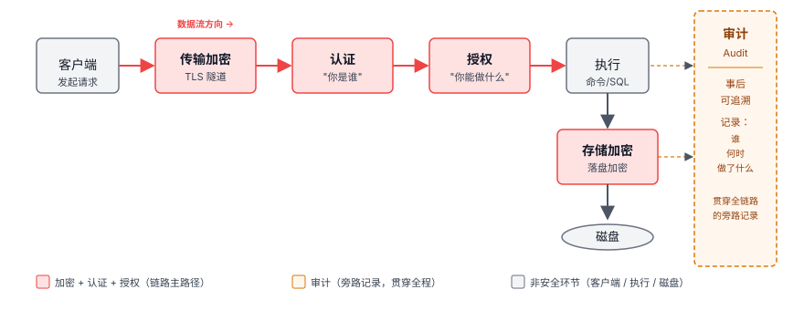
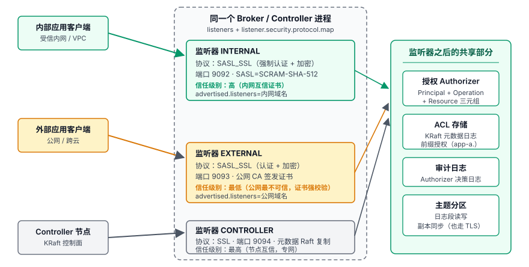
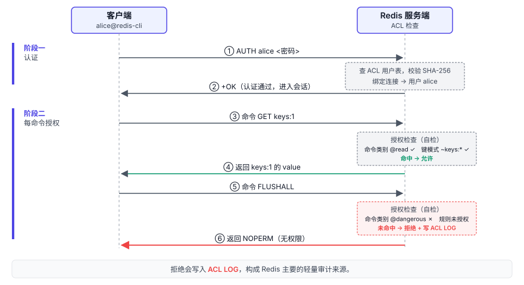
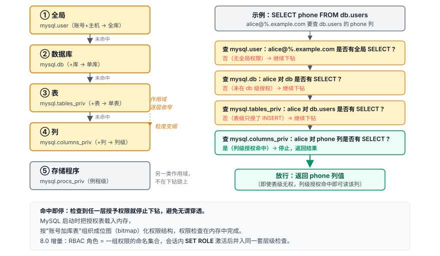

# 第 6 章 安全机制 — 权限、加密、审计

## 本章导读

我自己对安全的态度是被一次安全事件扭过来的。早年在测试环境跑 Redis 没设密码，某天发现 `KEYS *` 返回来一堆不认识的东西：一个爬虫脚本扫到了公网 IP 上的 6379 端口，把我们的实例当成了免费缓存。好在只是测试环境。真正该记住的是那个事实：一个不加认证的 6379 端口挂到公网，当天就会被扫到。

Redis 可以在无密码状态下运行，MySQL 提供细到列级的权限，Kafka 则需要为客户端、Broker 和控制面之间的连接分别配置认证。三种做法差这么远，根源是各自的数据模型和部署形态。Redis 面向内存键空间，MySQL 面向企业关系型应用，Kafka 要处理分布式多跳通信，因而各自强调的安全需求不同。

三个软件放进同一张安全分析表，沿着认证、授权、加密、审计四个层面逐个拆解。下次给一个新系统做安全评审，先看它的数据存放在哪、请求要跨几跳。

## 6.1 问题的本质

在看三个软件的实现之前，先把"数据系统的安全"抽象成一个共性问题。任何一个面向多用户的数据系统，四个层面都要做防护。

第一个是**认证（Authentication）**，确认"你是谁"。它要解决凭证的存储、传输、校验和防暴力破解。

第二个是**授权（Authorization）**，界定"你能做什么"。它把一个已认证身份映射到一组可执行的操作集合，集合的边界越精细，越能控制误操作和越权带来的伤害。

第三个是**加密（Encryption）**，分为传输加密和存储加密：传输加密保证数据在传输过程中的机密性与完整性不被破坏，存储加密保证数据落盘后即使磁盘被盗也无法直接读取。

第四个是**审计（Audit）**，对应的问题是"事后能否查清谁在什么时候做了什么"。审计记录是合规取证和事后复盘的依据。

在一次"客户端发起请求到数据落盘"的链路上，认证确认会话身份，授权约束具体操作，加密保护传输与存储中的数据，审计记录关键事件。

图 6-1 把四维模型落在一次请求链路上，展示了各自的分工。


图 6-1　从客户端发起请求到数据落盘，认证与授权检查身份和操作权限，加密保护传输与存储，审计记录关键事件。

客户端的请求先穿过传输加密建立的 TLS 隧道，进入服务端后由认证确认身份，由授权界定这条命令或 SQL 能不能执行，执行结果写入磁盘时由存储加密保护，而整个过程的关键事件由审计留痕。这四个层面的覆盖范围相互交叠，需要沿实际请求路径检查是否存在防护缺口。

数据系统和普通的 Web 应用在安全上有几个特殊约束。一是**长连接加高频小操作**。Redis 单条 GET、MySQL 单条主键查询的耗时在亚毫秒级，如果每条操作都走完整的认证握手，性能会被拖垮。于是它们都在"会话级认证一次、每操作级授权一次"的模型上做缓存与简化。二是**多租户共享存储**。同一个 Redis 实例、同一个 MySQL 实例、同一个 Kafka 集群往往承载多个应用的不同键、表、主题，授权必须做到细粒度的资源隔离。三是**复制与分布式协调**。主从之间、Broker 之间、Broker 与 KRaft 控制面之间也要互相认证，身份不止"客户端对服务端"这一种，节点对节点、控制面对数据面都要做身份认证。

这三个软件因先天约束差异，走出了不同的安全路线。Redis 的内核追求极简和单核十万级 QPS（小包 GET/SET 场景），因为长期假设部署在内网，安全特性一直往后排。MySQL 面向企业市场，权限模型强调列级、多层级和可审计。Kafka 天生分布式、多跳通信，安全设计必须可组合，于是它选了 SASL（Simple Authentication and Security Layer，简单认证与安全层）框架加监听器分层这条路。

## 6.2 认证

认证是安全的第一步：在客户端执行受保护的操作之前，系统必须确认“你是谁”。Redis 早期用一个全局密码校验共享凭证，MySQL 按账号、来源、插件组织认证，Kafka 则为客户端、Broker 和控制面之间的连接分别配置认证。

### Redis：从全局密码到 ACL 用户

Redis 的安全演进路径是安全让位于性能、之后再按需补回。它把性能和极简内核摆在第一位，直到 6.0 才一次性补上 ACL 和 TLS。这条演进路径本身就是选型时该记的。

6.0 之前的 Redis 只有一个 `requirepass` 全局密码，所有客户端共享，无法区分身份。这是"安全让位给极简内核"的取舍：内核不知道调用者是谁，只校验一个共享口令。这种模型在内网可信环境里够用，但一旦 Redis 被错误地暴露到公网，攻击者拿到密码就等于拿到最高权限，历史上未授权 Redis 写 SSH 公钥、写定时任务导致远程代码执行（RCE）的案例非常多见。

6.0 引入 ACL（Access Control List，访问控制列表），补上了按用户分别管理凭证和权限的能力。ACL 以"用户"为核心，每个用户有自己的密码集合、命令权限和键模式。一条典型的规则长这样：

在 redis-cli 中执行：

```redis
ACL SETUSER alice on >pwd ~keys:* +get +set
```

（`>pwd` 中的 `>` 是 ACL 密码前缀，非 shell 重定向符。）

这条语句创建用户 alice，将其启用、设置密码、允许访问匹配 `keys:*` 的键、授予 `GET` 和 `SET`。每一项都体现同一个取舍：只保留最小可表达单元。Redis 不做 RBAC（基于角色的访问控制），因为内核要轻。Redis 实例上的用户数通常很少，几台应用机器各对应一个用户就够，引入"角色—用户"两层语义会让内核背上不必要的复杂度。把组角色这类复杂语义留给外部的身份管理系统（IAM），是 Redis 一贯划分边界的做法。

凭证存储上，密码以 SHA-256 摘要形式保存，不存明文。这是凭证落盘的最小安全要求。摘要通过 `ACL SAVE` 持久化到 `aclfile` 指定的文件；默认无 aclfile，需显式设置。在外部编辑过 aclfile 后，用 `ACL LOAD` 让服务端重读，内存中的运行时改动会被文件覆盖。要注意这个摘要是不加盐、不迭代的裸 SHA-256：哈希不是加密，而无盐快哈希意味着相同密码的摘要相同、对弱密码有字典攻击和彩虹表风险，因此 Redis 文档强调密码要足够长且随机，靠密码本身的熵来补无盐的短板。

### MySQL：可插拔认证插件是核心抽象

MySQL 面向企业市场，提供的安全能力包括强密码、多层级权限、可审计、可插拔认证。它的安全设计有两个关键点：层级权限表和可插拔认证。

MySQL 的用户身份由 `用户名@主机名` 两部分组成，主机名是身份的一部分。这种两部分身份让 MySQL 天生支持"同一个账号在不同来源有不同密码和权限"，这是企业级多来源接入（办公网、VPN、应用网段、跳板机）的现实需求。

MySQL 从 8.0.4 起把默认认证插件从老的 `mysql_native_password` 改成了 `caching_sha2_password`（老客户端常因不支持而需要显式回退）。新插件使用 SHA-256。缓存未命中时，服务端通过安全连接或 RSA 加密的密码交换完成完整认证，成功后在内存中缓存账号与密码哈希；后续连接命中缓存时，走挑战—响应的快速认证路径。缓存减少了高频建连时的重复认证开销；改密码、重启等事件清除相关缓存后，需要重新完成完整认证。MySQL 不像 Redis 那样把认证做成轻量模型，正是因为它的用户量和接入复杂度要求认证逻辑足够灵活。

可插拔是更深的设计。认证逻辑与协议解耦，认证变成一个可替换的插件：`auth_socket` 让本机进程免密登录、`authentication_pam` 对接企业 PAM、`authentication_ldap_simple` 对接 LDAP 目录、`sha256_password` 提供无缓存的高安全选项。把身份验证外包给最合适的子系统，这与第 5 章讲过的"可插拔存储引擎"是同一种思路：核心保留扩展点，把变化的部分留给插件。TLS 的协商嵌在握手包里，配合 `REQUIRE SSL`、`REQUIRE X509` 或指定证书主题字段，可以做到账号级强制加密。

### Kafka：SASL 框架加 JAAS 配置

Kafka 的安全设计面对的是一个单机系统不会有的难题：一次数据流动要跨好几跳。客户端把消息发给 Broker，Broker 把消息复制到其他 Broker 的副本，Broker 还要和控制面（ZooKeeper 或 3.x 的 KRaft）通信。任何一跳明文、任何一跳不认证，都是漏洞。Kafka 的应对是把认证、加密、授权都做成可独立启用的模块，让运维按网络域组合配置。

Kafka 复用 SASL 这个抽象层。SASL 下面挂多种机制：PLAIN、SCRAM-SHA-256、SCRAM-SHA-512、GSSAPI（Kerberos）、OAUTHBEARER（OAuth 2.0）。每种机制通过 JAAS（Java Authentication and Authorization Service）配置文件注入 Broker 和客户端。这个选型的逻辑是：Kafka 要直接对接企业 Kerberos 和云原生 OAuth，复用成熟的标准生态比自己发明协议更稳，也更容易通过合规审查。

生产环境可以选用 SCRAM-SHA-256 或 SCRAM-SHA-512，并配合 TLS。SCRAM 是挑战—响应机制（RFC 5802）：客户端持有密码，用密码、服务端下发的盐和双方的随机数算出证明；服务端用保存的加盐迭代哈希派生密钥验证，交换过程不直接传输密码。相比 PLAIN 需要在 TLS 保护下传递密码，SCRAM 避免了直接发送密码，但凭证库泄露后，弱密码仍有被离线猜解的风险。SCRAM 的一个关键取舍是凭证存放在元数据存储里：ZooKeeper 模式存在 ZooKeeper 中，KRaft 模式存在元数据日志中。凭证管理因此依赖元数据存储的安全：能篡改其中的认证数据，就可能改变身份校验结果，相应的访问控制和通信加密也要落实。

KRaft 控制面还要解决启动期凭证是否可用的问题。SCRAM 可以用于 Broker 间通信，Kafka 3.5.0 也加入了 Broker 到 Controller 的 SCRAM 支持；这与 Controller 之间的共识连接不是同一条路径。后者在 3.5.1、3.6.0 曾出现用 SCRAM 启动集群失败的问题。控制面可以采用启动前就备好证书的双向 TLS，避免依赖元数据日志来取得启动认证凭证。监听器分层让这些链路分别选择认证方式，其约束来自具体路径和版本的实现。

委托令牌（Delegation Token）能减少向工作进程分发基础认证凭证的需要。例如，客户端不必把 SCRAM 密码、Kerberos 票据等基础认证凭证交给每个执行任务的进程，而可由已认证的客户端向 Broker 申请令牌，再让工作进程用令牌认证。令牌有有效期，可由获准的身份续期，到期未续则失效。

监听器分层是 Kafka 组织不同通信路径的方式。同一个 Broker 进程可以同时开多个监听器：对外采用 `SASL_SSL`，内部基线也建议 `SASL_SSL`（Kafka 出厂默认 inter-broker 是 PLAINTEXT，需要显式配置）。`SASL_PLAINTEXT` 虽然省去加解密的 CPU 开销，但只认证、不加密，不能保护数据机密性；选用 SCRAM 时，官方仍建议配合 TLS。配置项 `listeners` 和 `listener.security.protocol.map` 让运维按网络域给不同端口配不同协议。图 6-2 画的是 Broker 与 Controller 合并部署时的一种布局。


图 6-2　内部 SASL_SSL、外部 SASL_SSL、控制面 KRaft 三条路径并行，按网络域分级信任。

这套分层的代价是配置矩阵成倍增长：每个监听器都要独立配协议、端口、证书与 `advertised.listeners`，配置量随监听器数量与 Broker 数量的乘积增长。生产环境最常见的故障也出在这里——客户端从 bootstrap 地址拿到的 advertised 主机名不属于自己所在的网络域，连接建不起来。应对是把每个域的监听器配置固化成模板、证书按域独立签发与轮转，让"哪个域用哪套配置"成为一份可审计的清单。这份复杂度换来的是：每段链路的认证与加密可以按它面对的网络域单独定级。

## 6.3 授权

确认身份之后，下一个问题是授权：一个已认证的身份能做哪些操作。三个软件的数据模型不同，授权能做到多细也就不一样。

### Redis：键模式加命令类别的二维控制

Redis 的授权把权限直接绑到用户，不做角色继承。授权是两个维度的组合：命令类别和键模式。

命令类别是关键抽象。Redis 把上百条命令归成二十来个类别：既有 `@read`、`@write`、`@admin`、`@dangerous` 这类语义组，也有 `@fast`、`@slow` 这类按性能划分的类别。运维一眼就能配出一个"只读且不含危险命令"的用户：`+@read -@dangerous`。这种"按风险分类"的命名让常见的安全意图（只读、不可破坏）能被一行表达，而不必逐条列举几十个命令。

键模式控制作用范围。`~keys:*` 限定用户只能访问匹配该模式的键，这让多租户场景下不同应用可以按前缀隔离。

图 6-3 展示了一次完整连接里 Redis ACL 的工作流程。


图 6-3　会话级认证一次，每条命令都走"命令类别加键模式"二维授权检查。

连接建立时客户端先用 `AUTH alice <密码>` 走一次完整认证，服务端校验 SHA-256 通过后把这条连接绑定到用户 alice。这是阶段一，整个会话只做一次。之后每条命令进入阶段二的授权检查：服务端根据当前用户绑定的规则，分别检查命令类别（GET 属于 @read）和键模式（`keys:1` 匹配 `~keys:*`）两个维度，两项都命中才放行。图中 alice 执行 `GET keys:1` 通过，但执行 `FLUSHALL` 会被拒绝：`FLUSHALL` 属于 @dangerous，alice 的规则里没有授予。

这个"认证一次、每命令授权"的设计，是 Redis 在性能和安全之间找的平衡点：认证握手开销大，因此按会话摊销；授权检查开销小，可以每条命令都执行。

6.2 起，通道（channel）权限也独立出来，Pub/Sub 的订阅权限和键空间的读写权限分离，使同一用户的键空间写权限与通道订阅权限可以分别配置；是否同时授予这两类权限，由 ACL 规则决定。

Redis 的默认策略仍然偏向兼容。7.x 里 `default` 用户的内置规则是 `user default on nopass ~* &* +@all`：启用、无密码、全键、全通道、全命令，客户端无需显式认证就能以 default 身份操作。`protected-mode`（保护模式，3.2.0 起引入，默认开启）提供另一道限制：在 Redis 7.0 的实现中，保护模式开启、default 用户带有 nopass 标记、对端连接不来自回环地址（loopback），三个条件同时满足即拒绝该连接。6.2 及更早版本此判定还要求未显式 bind，显式 bind 后保护模式整体失效；7.0 起移除该条件。保护模式不替代账号和权限配置。加固时仍需显式给 default 设置密码，或用 `ACL SETUSER default off` 禁止新的 default 用户认证；也可用 `ACL SETUSER default resetpass` 清空密码并移除 nopass 标记，此后要重新设置密码才能以密码认证为 default。

### MySQL：多层级权限表加 8.0 RBAC

MySQL 的授权模型是三个软件里粒度最细的。权限按作用域分五层：全局、数据库、表、列、存储程序。这套层级对应 `mysql.user`、`mysql.db`、`mysql.tables_priv`、`mysql.columns_priv`、`mysql.procs_priv` 多张权限表。授权检查时，从全局到列逐层收窄，命中即停。


图 6-4　权限从全局到列逐层收窄的检查路径，命中即停。

一条 `SELECT phone FROM db.users` 要先查全局权限表（是否对该账号授予了全局权限），未命中再查数据库级、表级，最后到列级（phone 这一列有没有 SELECT）。这种"逐层收窄、命中即停"的设计有一个直接代价：层级越细检查越慢。MySQL 的应对是在启动时把授权表整表载入内存，按"账号加库表"组织成位图（bitmap）化的权限结构，授权检查在绝大多数热路径上就变成一次内存查询。

8.0 才补齐 RBAC 角色系统，支持 `CREATE ROLE`、`GRANT role TO user`、会话级 `SET ROLE`。MySQL 已有的权限矩阵很复杂，用户量级也大，引入角色必须兼顾"不破坏已有 GRANT 语义"，因此它的做法是"角色等于一组权限的命名集合加会话激活"。这是一种兼容优先的务实做法：新能力叠加在老模型上，老应用零迁移。

权限语义按风险分四类：数据操作（DML，包括 SELECT、INSERT、UPDATE、DELETE）、结构变更（DDL，包括 CREATE、ALTER、DROP，更危险）、管理（SUPER、PROCESS、FILE、RELOAD，高度敏感）、复制（REPLICATION SLAVE、REPLICATION CLIENT，专用于复制拓扑）。这种按风险归类的命名本身就是安全设计：它让 DBA 一眼能看出哪些权限该谨慎授予。注意：FILE 权限允许读写服务器上的文件，范围仍受 MySQL 进程的操作系统权限及 `secure_file_priv` 等配置限制。若发生 SQL 注入，它可能被利用来读取敏感文件，是高敏权限的典型。

### Kafka：ACL 绑定 "Principal + Operation + Resource" 三元组

Kafka 的授权模型是 ACL，每条规则绑定三元组：主体（Principal，通常是服务账号或用户）、操作（Operation）、资源（Resource）。资源类型有 Topic、Group、Cluster、TransactionalId、DelegationToken，每类资源有自己的操作集：Read、Write、Create、Delete、Alter、Describe、ClusterAction、All。

Kafka 原生只有 ACL，没有 RBAC，和 Redis 一样；但理由不同：流平台的主体通常是"应用或服务"而不是"人"，服务身份相对稳定，角色层收益不大。企业真要 RBAC 时，通常外接 Apache Ranger 这类统一管控层，把 Kafka 的 ACL 作为底层落地点。这种"内核只做最小 ACL，把 RBAC 留给上层"的边界划分，和 Redis 把角色留给 IAM、MySQL 把审计插件做成可选是同一种工程哲学，都把复杂语义外挂，核心保持简单。

前缀授权（prefixed resource pattern）是多租户场景的便利设计。配置 ACL 时，`--resource-pattern-type prefixed --topic app-a.` 指定所有 `app-a.` 开头的主题，再结合 app-a 的服务主体及 Read、Write 操作，就能为这一组主题授权，避免逐主题配置。在一个集群承载几十上百个服务的场景下，前缀授权让权限管理简化为"前缀约定加少量例外"，运维成本随之下降。

Kafka 的默认策略要区分“未启用授权器”和“启用授权器但未配 ACL”。在 Kafka 3.9 中，ZooKeeper 模式的 `AclAuthorizer` 和 KRaft 模式的 `StandardAuthorizer` 都将 `allow.everyone.if.no.acl.found` 默认为 **false**：资源没有匹配的 ACL 时，除超级用户外的请求默认被拒绝。显式设为 true 才会在这类资源上放行所有人。生产环境需要启用对应的授权器、保持默认拒绝并配齐 ACL；遗漏资源的授权会让正常请求也被拒绝，运维必须核对覆盖范围。

## 6.4 加密

三个软件的传输加密都选了 TLS，但补上 TLS 的时机和方式各不相同。

### Redis：TLS 到 6.0 才原生支持

6.0 之前的"安全传输"靠 stunnel 代理或 SSH 隧道，也就是把加密功能外包给外部进程。这是一次明确的取舍：Redis 的设计目标是单核十万级 QPS，TLS 的握手开销和每个包的加解密都会直接拉低吞吐，把这种代价推到内核之外，能让绝大多数不需要加密的内网用户不受影响。

补上 TLS 之后，Redis 也没有把它设为强制。做法是"TLS 可选、按端口开启"：你可以关掉明文端口、只开 TLS 端口，也可以两者并存做平滑迁移。配置上建议限定 `tls-protocols TLSv1.2 TLSv1.3`，关闭老旧协议，客户端证书按需启用。TLS 会增加加解密和完整性校验的开销，吞吐影响取决于硬件、TLS 版本和工作负载；短连接频繁握手还会增加认证与密钥协商开销。是否启用 TLS，由部署者根据吞吐与安全需求自行权衡。

### MySQL：传输 TLS 加存储 TDE 两层

MySQL 的加密覆盖传输和存储两层。传输层 TLS 的配置与服务端证书、CA、客户端证书验证同 Redis、Kafka 大体一致，但 MySQL 多了前面提到的账号级 `REQUIRE SSL`，让加密变成权限的一部分。

存储加密让 MySQL 区别于另外两款。TDE（Transparent Data Encryption，透明数据加密）在 InnoDB 表空间级别加密数据，密钥由 keyring 组件或插件托管。发行版能力要分清：社区版可用本地文件型 `keyring_file`，8.0.24 起也可用 `component_keyring_file`；Oracle 提供的 HashiCorp Vault 或云厂商 KMS 对接能力属于企业版。TDE 的核心取舍是“对应用透明”：SQL 不需要改一个字，加解密在存储引擎层完成。代价是必须管理好密钥：密钥丢失会导致数据不可读，所以 TDE 必须配套密钥轮换与备份策略。

表加密了，但日志明文写在磁盘上，攻击者仍能从日志里拼出敏感数据。日志加密补上了这个缺口。 redo log 与 undo log 的加密（`innodb_redo_log_encrypt` / `innodb_undo_log_encrypt`）自 8.0.1 起就支持，binlog 与 relay log（中继日志）的加密（`binlog_encryption`）自 8.0.14 起支持。

### Kafka：TLS 覆盖所有通信路径

Kafka 的加密范围比单机系统广得多。客户端到 Broker、Broker 到 Broker（副本同步）、Broker 到控制面（KRaft 元数据）都要 TLS。这是分布式纵深防御的硬要求，也是 Kafka 加密配置比 Redis、MySQL 复杂的根本原因：你要同时管好几条 TLS 通道。

副本同步是大流量长连接，TLS 加解密会增加处理开销。长连接稳态下需要持续处理记录层的对称加解密（AES-GCM 等 AEAD 套件），证书采用 RSA 还是 ECDSA 则影响握手阶段的认证运算。一次握手的开销会被后续通信摊薄；在短连接、频繁建连的场景下，证书算法和证书链大小的影响更明显，具体收益仍取决于实现与硬件。优化手段要对应这些来源：用硬件指令（AES-NI）降低对称加解密成本、启用 TLS 会话恢复（session resumption，减少重复完整握手），或在专用硬件上做加密卸载。内部通信和外部通信还可以用不同监听器配置不同证书，分别管理内部信任关系和外部 CA 信任关系。

## 6.5 审计

把认证、授权、加密、审计排个优先级，审计在三个软件里排在最后。审计记录越细，吞吐代价越大。

Redis 只提供 ACL LOG（记录被拒命令的详情，包括时间戳、客户端 IP、被拒命令，不含命令参数）和 SLOWLOG（记录执行时间超过阈值的命令）。这两样加在一起，只覆盖"谁被拒了"和"什么慢了"，但距离完整的审计轨迹（谁在什么时候做了什么操作、改了什么数据）还差得远。

MySQL 的审计能力比 Redis 强，但有门槛。企业版提供审计插件，能做语句级审计、按用户/数据库/主机过滤、把日志输出到文件或 syslog。社区版用户通常只能用 General Log 做近似替代：记录所有客户端发来的 SQL，短时间调试可以，生产环境长时间开启会带来难以承受的磁盘压力和性能开销。

Kafka 的原生审计来自 Authorizer 日志（`kafka.authorizer.logger`）：每一次授权决策都记，被拒的记为 INFO、放行的记为 DEBUG，默认日志级别下基本只看得到拒绝；粒度粗且不包含消息内容。生产环境通常外挂补全：自定义 ProducerInterceptor / ConsumerInterceptor 在客户端拦截并写审计主题，或接 Ranger 这类带审计能力的统一管控层。

这三个软件的共同点是：审计在生产级部署中几乎总是外挂的。如果每条操作都同步写审计日志，性能会显著下降，甚至让系统不可用。接受这个现实之后，务实的选择是异步写入审计日志、对日志采样，或外接专用审计系统。

## 6.6 横向对比

表 6-1 按认证、授权、加密、审计四维对比三家的安全选择。

**表 6-1　安全机制四维横向对比**

| 对比维度 | Redis（7.x） | MySQL（8.0） | Kafka（3.x） |
|---|---|---|---|
| 初始认证配置 | default 默认 nopass；保护模式有条件限制连接 | --initialize 生成临时 root 密码；--initialize-insecure 不设密码 | 默认 PLAINTEXT，不自动启用身份认证 |
| 认证抽象 | ACL 用户加多密码 | 可插拔认证插件 | SASL 框架加 JAAS |
| 推荐生产认证 | ACL 用户与必要的 TLS 证书校验 | caching_sha2_password | SCRAM-SHA-256/512 加 TLS |
| 凭证存储 | 内存加 aclfile（ACL SAVE/LOAD）（SHA-256） | mysql.user 中的 SHA-256 认证信息，加内存认证缓存 | KRaft/ZK（SCRAM 哈希） |
| 授权模型 | ACL（用户直绑） | RBAC 加五级层级 | ACL（资源三元组） |
| 最细粒度 | 键模式加命令 | 列级 | 具体资源名或前缀加操作 |
| 角色继承 | 无 | 8.0 RBAC | 无（外接 Ranger） |
| 默认策略 | default 规则全开；protected-mode 按其条件拒绝非本地连接 | 初始账号状态取决于初始化方式，需继续配置权限 | 启用授权器后，两种授权器无匹配 ACL 都默认拒绝（超级用户除外） |
| 传输加密 | 6.0+ TLS，可选 | TLS（账号级 REQUIRE） | TLS 全路径（多监听器） |
| 存储加密 | 无原生 | TDE 表空间加日志加密 | 无原生（靠磁盘加密） |
| 审计能力 | ACL LOG 加 SLOWLOG（弱） | 企业审计插件加 General Log | Authorizer 日志加拦截器（弱） |
| 性能取向 | 性能优先，安全可选 | 安全与功能并重 | 模块化可组合 |
| 典型部署假设 | 可信内网 | 企业网络 | 混合或云原生多跳 |

三家的安全取向不同，源于数据模型与请求要跨的跳数。取向本身没有高下，部署时的错配才会带来事故：把面向内网的安全配置直接用到公网，就是本章开头那个爬虫事件的根因。

### 从姿态对比到生产底线

对比之后是生产配置。Redis 的安全取向是“内网优先、按需叠加”。配置时先为每个应用建立独立 ACL 用户，授予必要权限，处理 default 用户的开放规则，并按部署环境配置网络隔离、保护模式与 TLS，再用 ACL LOG 加外接采集补充审计。这些配置需要一起检查：保护模式有特定生效条件，不能把开启它当作已经加固完成。

MySQL 提供安全初始化和连接防护工具：使用 `--initialize` 时会生成已过期的随机 root 密码，`--initialize-insecure` 则不会；`mysql_secure_installation` 可用于清理匿名账号等默认配置，`connection_control` 插件能在连续认证失败后增加连接响应延迟。代价是配置项多、学习曲线陡；要满足金融、电信等场景的合规要求，还需落实账号、加密、审计和运维策略。

Kafka 把 SASL、TLS、ACL 做成三套可独立启用的模块，让运维按网络域自由组合。代价是配置矩阵复杂，大规模部署可借助 Ranger 这类统一管控层管理权限。评审 Kafka 集群安全时抓住三个重点：监听器分层是否合理、SASL 机制选型、ACL 是否覆盖全部资源。这三个看清了，几十个配置项就容易梳理了。

## 6.7 架构启示

安全设计的重心在默认值。这五条启示，选型和评审时能直接拿去对照。

### 启示一：默认安全策略要与典型部署环境匹配

Redis 的 default 用户保留开放规则，同时由保护模式提供有条件的连接限制；MySQL 的初始账号状态取决于初始化方式；Kafka 是否启用认证、加密和授权取决于监听器及授权器配置。这些默认配置有各自的兼容与部署背景，落到实际环境还需核对。把开放配置直接带到公网，就只能靠运维人员记得补做安全配置；本章开头的爬虫事件正是这种错配。

我做安全评审先看两件事：默认值与部署环境是否错配、每个应用有没有独立的最小权限账号。这两条不过关，加密配得再强我也不签——默认值错配的洞，比权限配粗的洞出得快，也更难被发现。一句话：默认安全取决于部署环境——面向公网的服务应默认收紧，内部工具可以更开放。

### 启示二：纵深防御，每层都有一点性能开销

把安全做成多层叠加：网络隔离、传输加密、认证、授权、审计、存储加密。这样做是为了在一层失效时，仍有其他措施阻断攻击或留下追查线索；能否保护数据，还要看攻击路径和各层配置。代价是每一层都有开销：TLS 1.2/1.3 的常见完整握手需要一到两个 RTT、授权检查每条操作都走一次、审计带来额外 I/O、存储加密吃 CPU。三家都提供了多层安全措施，但是否启用、如何组合仍取决于部署。

我评审一套系统的安全设计，先数它有几层：只押一层的方案，无论多厚，我都打回。

### 启示三：最小权限原则可以落成可操作规则

三家都支持并推荐最小权限：每个应用独立账号、只授必要命令或操作、限定键或表或主题范围、定期审查。实现手段各不相同：Redis 用键模式隔离、MySQL 用角色加列权限、Kafka 用前缀授权，但原则一致。反模式也一致：用超级用户跑应用、授予 ALL 权限"以防万一"、密码硬编码、长期不轮换。对照这几条做检查，花力气最少，也最见效果。

### 启示四：多跳协作需要明确身份如何传递

连接上的认证与逐操作授权，并不能直接解决跨服务调用时原始身份的传递问题。委托令牌、服务账户、代理传递各有取舍：委托令牌短期有效，需要刷新机制；若下游只认证服务账户，它看到的是服务身份；代理传递则依赖服务之间的信任。需要保留原始调用者身份时，还要回答一个问题："身份如何在跳与跳之间安全传递且不被伪造"。Kafka 和微服务网格会面对这个问题；Redis、MySQL 的复制与集群部署也有节点间认证，只是不一定需要逐跳传递原始客户端身份。

### 启示五：安全抽象要适应协作方式

回看前面的实现：Redis 以密码和 ACL 为主，MySQL 通过插件对接不同认证方式，Kafka 支持 SASL 等标准机制。我自己做选型，先问两个问题："我要对接多少种身份源""我的请求要跨多少跳"，再据此判断需要哪些认证接口和身份传递能力。身份源简单时，引入复杂框架未必划算；多个服务共用一个全局密码，又很难分别限制权限或撤销凭证。

现代视角的延伸：零信任（Zero Trust）不因请求来自内网就默认信任，而是围绕资源访问进行认证和授权。三个软件的内置认证、权限和加密能力可以参与这套设计，但仅配置好某一个软件还不够；跨服务的身份与授权还需要整体规划。服务网格、统一身份平面、动态授权引擎都是可考虑的实现手段，并非必须全部采用。理解它们的内置安全模型，是改造的第一步。

## 6.8 小结

认证、授权、加密、审计这四件事，在三个软件身上各有侧重。Redis 从全局密码补到 ACL，走的是“安全让位于性能、再按需补回”；MySQL 提供列级权限等能力，服务于企业场景的权限与审计需求；Kafka 要分别配置认证、传输加密和授权，可以按部署需要组合 SASL、TLS、ACL 等机制。它们的差异提醒我，安全设计要同时考虑数据模型、请求经过的边界和实际威胁。脱离部署与配置谈"谁更安全"没有意义，我更关心的是："在它的数据模型和部署形态下，这套设计有没有覆盖需要防范的风险"。

下一章进入集群架构：分片怎么切、副本怎么一致、故障怎么自动转移、元数据谁说了算，正是本章"请求要跨几跳"那句判断在更大拓扑里的展开。
