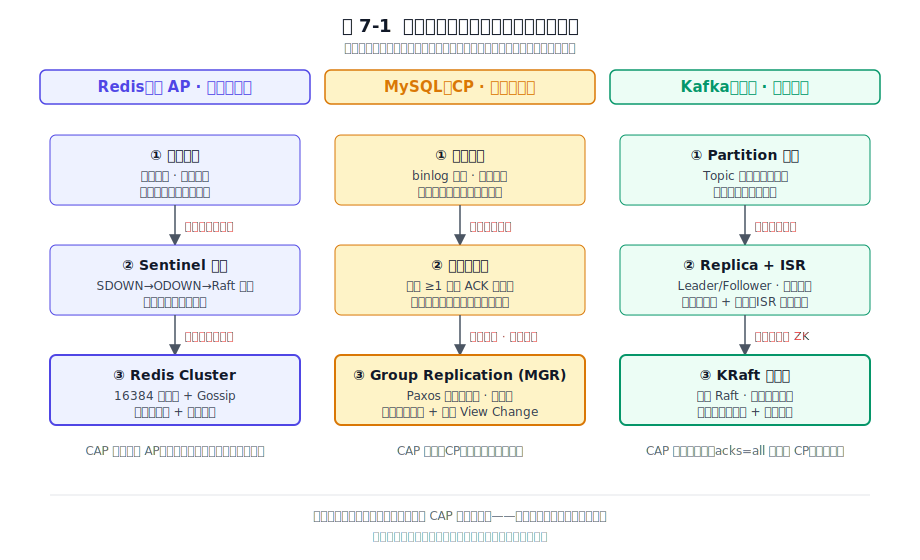
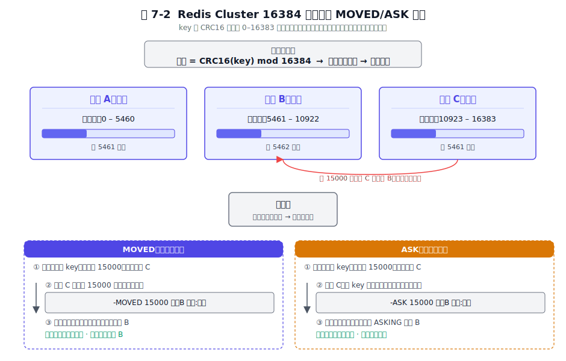
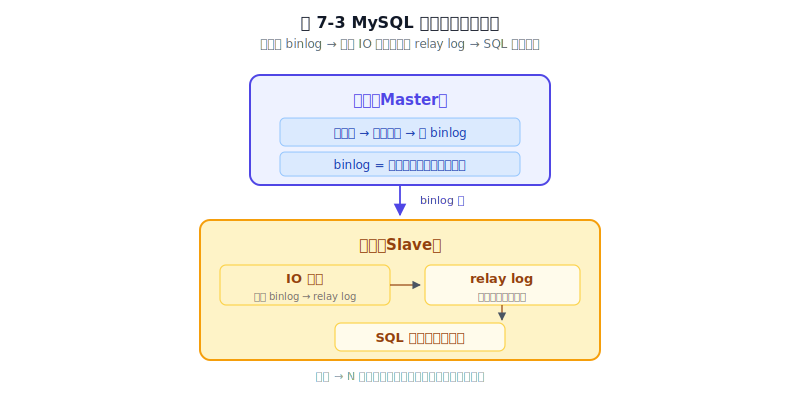
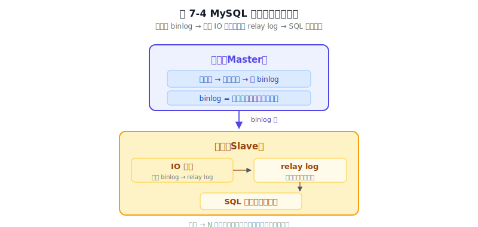
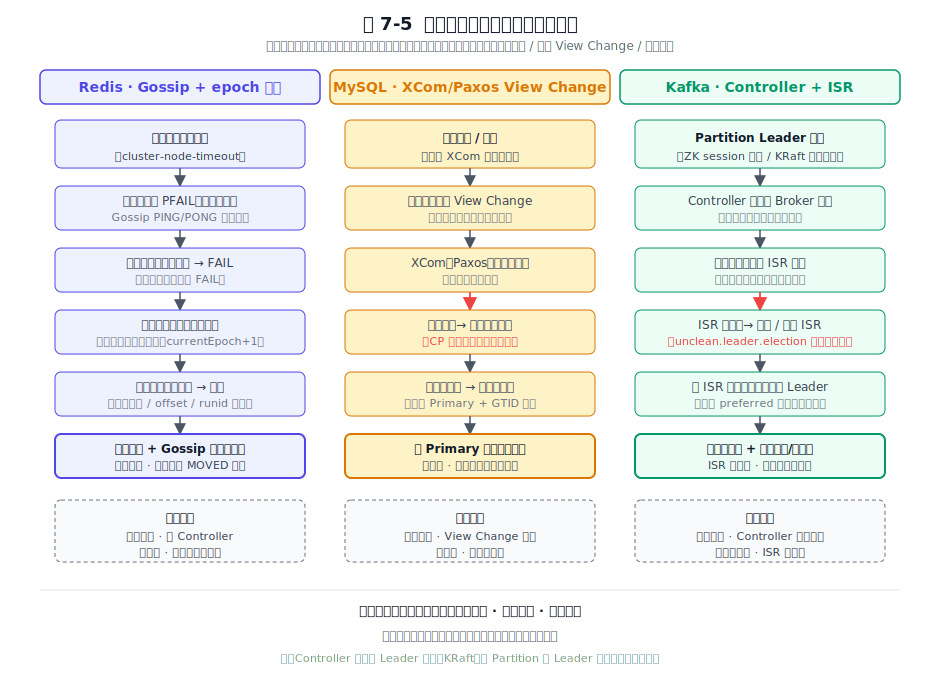

# 第 7 章 集群架构 — 从单点到分布式

## 本章导读

业务跑顺了，流量却开始翻倍。某天你会发现一台机器扛不住了：CPU 打满、磁盘告急，再宕一次机整个服务就跟着瘫痪。单机的 CPU、内存、磁盘都有物理上限，机器也总会坏，要跨过这道墙，只能把数据和服务分摊到多台机器上，对外还得装成一台。这就是集群架构要解决的问题。

但分布式既是解药也是新病。一旦数据散到多台机器，四个新难题立刻冒出来：数据怎么切才均衡、副本之间怎么保持一致、某台挂了怎么自动发现和转移、集群的元数据到底谁说了算。Redis、MySQL、Kafka 在生产环境里把这些问题打磨了十几年，沉淀出三个针锋相对的答案。同样面对"单点不够用"，Redis 偏向高可用（异步可丢写，但分区时少数派会停写、归类有争议，详见 7.2.3）；MySQL 默认复制形态偏 AP（异步）、产品定位偏 CP（靠半同步/MGR 才走到宁可停服也不丢一笔）；Kafka 不写死，把一致性做成可调旋钮，交到你手里按业务调。
三个答案摆在一条光谱上。这条光谱怎么用、每一档付什么代价，就是本章要讲的事。集群的拓扑与容错归本章，复制的字节级细节归第 9 章。

我做过的第一个分布式系统是一个库存服务。当时选了 Redis Cluster，觉得"够快、能自动分片"。结果上线第一个月就出了事：一次网络抖动触发了主从切换，刚刚扣减的库存因为异步复制丢了。用户下了单，仓库说没货。那次之后我才真正理解，CAP 不只是教科书上的理论选择题，落到代码里就是实打实的取舍。选了快，就要为快可能丢数据做好预案。

## 7.1 问题的本质

集群要解决两件事：扩容和高可用。它们常被当成一件事——“单机容量或性能不够”，混在一起谈，是集群设计中最常见的失误之一。

第一件是**水平扩展（scale-out）**。一台机器的内存装不下全部数据，一块磁盘写满，一个 CPU 跑不动全部计算。解法是把数据切到多台机器上，每台只承担一部分。这件事技术上叫分片（sharding）或分区（partitioning）。它解决的是**容量与吞吐**。

第二件是**高可用（high availability）**。一台机器必然会坏：电源故障、网卡失联、磁盘损坏、机房断电。如果数据只有一份，那这一台坏了，这部分数据就不可读不可写，业务随之中断。解法是把同一份数据存到多台机器上，一台坏了另一台接管，这件事叫复制（replication）。它解决的是**可用性**。

分片和复制是正交的。你可以只分片不复制：容量上去了，但任何一台坏了，它负责的那份数据就没了；也可以只复制不分片：可用性上去了，但总容量仍受单机限制，顶不住数据增长。真正成熟的集群两件事都做，但分工清晰：分片扩容，副本保活。

单机还有第三道天花板：**单节点吞吐瓶颈**。即便数据量不大，单机的网络带宽、磁盘 IOPS 也可能成为吞吐上限。分片天然也解决了这个问题，因为分片把流量分摊到了多台机器上。

至此，问题清楚了。但分布式一上来，立刻引入四个新的难题，本章后面这三款软件会逐一回应。

**第一，数据怎么切。** 是按范围切（如 0-999 在节点 A、1000-1999 在节点 B），还是按哈希切（`hash(key) % N`）？哈希分片分布均匀，但加节点就要重分片、数据大搬迁；范围分片支持范围查询，但容易热点。重分片的代价，是集群能不能平滑扩容的关键。

**第二，副本怎么一致。** 主节点写完一笔，要不要等从节点确认？不等（异步复制）最快，但主挂了可能丢已提交的写；全等（同步复制）不丢，但任何一个慢从都会拖垮写性能；折中是多数派确认：只要大多数副本确认了就算提交，这也是共识协议的核心思想。一致性强度与写延迟，一直是同一枚硬币的两面。

**第三，故障怎么发现与转移。** 一个节点多久没心跳算"死"？是单点判定（主观下线）还是多数派投票（客观下线）？选新主按什么规则（优先级、日志进度、ID）？分区时少数派该怎么办：继续写（可能脑裂）还是停服（宁可不可用）？这套机制决定了集群在故障时的表现。

**第四，元数据谁说了算。** 哪个节点负责哪些分片？谁是当前的主？副本同步到哪了？这些元数据（metadata）放哪：是集中存到一个协调者（Controller）上，还是去中心化地用 Gossip 让所有节点最终一致？集中式强一致但有单点风险，去中心化无单点但收敛慢。这是集群架构的另一条主轴。

这四个难题之上，还横着一条更根本的约束：**CAP 定理**。网络分区（Partition）是分布式绕不开的现实，于是一致性（Consistency）与可用性（Availability）必须取舍。P 是给定的，C 和 A 之间只能偏一头。三款软件的默认形态里，Redis 偏 AP（异步可丢、但分区时少数派停写，归类有争议）、MySQL 的默认复制偏 AP、产品定位偏 CP，Kafka 在两端之间可调。这条主轴贯穿全章。

> **关键数字**
> 
> - **Redis Cluster：16384 个槽**，Gossip bitmap 仅 2KB。实际节点数上限约 500-1,000（官方建议不超过 1,000；社区生产实践推荐 400-500）；超过后 Gossip 消息膨胀、CPU 开销显著上升，收敛时间变长。
> - **MySQL MGR：组大小通常 3/5/7/9 个成员**（奇数个避免平票；超过 9 个后 Paxos 共识性能明显下降）。跨 AZ 部署时每笔事务要多约 5–10ms（同城 AZ 典型 RTT 2-5ms；MGR 的 Paxos 共识需多轮往返，实际增加延迟为 RTT 的 2-3 倍；异地 Region 会更高）；多数派容错，3 个成员可容忍 1 个故障。
> - **Kafka 单分区吞吐：约 10–50MB/s**（视硬件与消息大小；1KB 消息约 1-5 万条/秒，100 字节消息可达 10 万条/秒以上）。KRaft 模式下分区数可达百万级（ZK 时代单集群实践上限约 20 万，受 ZooKeeper 元数据开销所限）。

这三款软件各自走了一条不同的路。图 7-1 把它们的演进主线并列出来，便于先建立一个总体印象。

图 7-1　三款软件从单点到集群的演进主线并列：Redis 走主从→Sentinel→Cluster，MySQL 走异步→半同步→MGR，Kafka 走 Partition→Replica→KRaft。

它们虽然都从单点起步，但演进的步数和重点各异。Redis 每一代都在补上一代留下的局限：主从解决单点故障，但故障转移要人工，于是 Sentinel 把自动化补上，可写还是集中在一个主上，这才有了 Cluster 的分片。MySQL 三段式则始终守着"不丢数据"这条线，从异步一路推到多数派确认。Kafka 一上来就是分布式，分片和副本是从设计起点就内置的，它真正的演进是在元数据层（从 ZooKeeper 到 KRaft）。理解了这个起点的差异，后面的机制对比就有了坐标系。

## 7.2 Redis 的做法

Redis 的集群演进，是逐步补上各代方案局限的过程。每一代方案都解决了上一代留下的某个具体局限，同时也会暴露新的局限。下面四节就按这个脉络走。

### 7.2.1 主从复制：高可用的地基，但还不是集群

Redis 最朴素的集群化，是主从复制（replication）。在从节点上执行 `REPLICAOF host port`（旧版叫 `SLAVEOF`），从节点发起连接，建立后由主节点把数据推送过来：第一次连接时做全量同步，主节点 `fork` 出子进程，把内存打成一个 RDB（快照文件）发给从节点，期间主节点新产生的写命令先存进复制积压缓冲区（replication backlog），RDB 发完再补发这部分增量；之后如果从节点短暂断线又重连，且断线期间主节点的写偏移量（offset）没有超出积压缓冲区的范围，就只补差量，这叫部分重同步（partial resync）。字节级的复制流细节归第 9 章，这里只看它在集群中扮演的角色。

主从复制解决了一个问题：读可以分担到从节点，主节点坏了可以从从节点恢复数据。但它有三个根本性的局限。第一，复制是**异步**的：主节点写完立即返回客户端，不等从节点确认。这是 Redis 的性能取舍：要快就不能等。代价是主节点刚确认的写、从节点还没收到时主节点宕机，这笔写就丢了。第二，**写仍然集中在单主**。主从复制解决了读扩展和高可用，但没有解决写扩展：所有写还是压在一个主节点上，单机内存仍然是容量天花板。第三，**故障转移要人工**。主节点宕了，运维得手动把某个从节点提升为主、再让其他从节点改连新主。对"高可用"这个目标，人工转移不够格。

主从复制解决了单点故障问题，但自动恢复仍然要靠手工，留下了自动化这笔债。

### 7.2.2 Sentinel：把人工故障转移自动化

Sentinel（哨兵）就是来还这笔债的。Sentinel 本身是一组独立进程（通常部署 3 个或更多，奇数个便于投票），它们专门盯着主从节点，负责在主节点宕机时自动完成故障转移。机制分几步：每个 Sentinel 周期性地给主从节点发心跳，超过 `down-after-milliseconds` 没回应，这个 Sentinel 把主节点标记为**主观下线**（SDOWN，subjectively down）：这只是"我觉得它挂了"。然后它通过 Gossip 把这个判断扩散给其他 Sentinel，如果达到配置的 quorum 数量都认为主节点挂了，就升级为**客观下线**（ODOWN，objectively down）：这是"大家都觉得它挂了"。接下来 Sentinels 之间用一种 Raft 风格的选举（Redis 官方文档称之为 "Raft-like"，借鉴了 Raft 的任期号加多数派投票，但没有完整的 Raft 日志复制）选出一个 Leader Sentinel 主持转移，再按优先级、复制偏移量（offset）、runid 三个维度从从节点里挑一个提升为新主，给它发 `REPLICAOF NO ONE`，并通知其他从节点改连新主。

Sentinel 自身用了多数派投票（Gossip 传播判断 + Raft-like 选举）来防止单点误判，但**数据层仍然是单主异步复制**。也就是说，监控层的一致性（多数派投票决定谁挂了、谁来主持转移）和数据层的弱一致性（异步复制可丢写）是两件事：前者只管"决策"，不管"数据"。Sentinel 能保证"主节点真的挂了才转移"，但保证不了"转移后一笔都不丢"。主从异步复制的丢写风险原封不动地继承下来。

Sentinel 解决了自动故障转移的问题，但又留下三个新局限：写仍然集中在单主，水平扩展写做不到。内存仍然受单机限制，应付不了数据量增长。客户端要懂 Sentinel 协议，得知道去问谁要当前主节点地址。这三个局限加在一起，指向同一个诉求：既要能水平扩展，又要能自动容错。这就是 Redis Cluster 要解决的事。

### 7.2.3 Redis Cluster：分片加自动容错，去中心化元数据

Redis Cluster 是 Redis 的分布式集群方案。它的三个关键词是：分片、自动容错、去中心化。

**分片用 16384 个槽（slot）。** Redis Cluster 不直接把 key 映射到节点，而是先映射到 0–16383 这 16384 个槽，再把槽分配给节点。映射公式是 `CRC16(key) mod 16384`。每个主节点负责其中一段连续或不连续的槽。为什么不直接 `hash(key) mod 节点数`？因为节点数会变，节点一变所有 key 都要重映射，而引入槽这一层中间抽象后，加节点只是把部分槽从老节点迁移到新节点，大部分 key 不动。图 7-2 把这套槽位划分和路由语义画了出来。

图 7-2　key 经 CRC16 哈希到 0–16383 槽，槽映射到节点；迁移中与迁移完的两种重定向语义不同。

16384 这个数的选择基于工程折中。Gossip 消息里每个节点要携带自己负责的槽位 bitmap，16384 个槽对应 16384/8 = 2KB 的 bitmap，这个大小在消息压缩与槽粒度之间是个折中：槽太少则单节点承载过重、迁移粒度太粗，槽太多则 bitmap 占用大、Gossip 消息膨胀。16384 既能让集群规模到上百节点仍每节点分到上百槽，又把 bitmap 控制在 2KB 量级，是两边都过得去的取值。

**客户端路由靠 MOVED 和 ASK 两种重定向。** 客户端可以缓存一份槽到节点的映射表，绝大多数请求直接命中。但集群拓扑会变（扩容、缩容、故障转移），所以节点收到不属于自己槽的请求时，会返回一个 MOVED 或 ASK 重定向。MOVED 表示"这个槽已经永久不在你这了，去这个新地址"，客户端收到后更新本地映射表，以后都走新地址；ASK 表示"这个槽正在迁移中，本次请求请去临时地址试一下"，是一次性重定向，客户端不更新映射表，因为迁移完之后这个槽还会回来或换地方。两者的区别在于：MOVED 是状态变更后的最终路由，ASK 是迁移过程中的临时跳板。此外，Redis Cluster 禁用了多数据库的 `SELECT` 命令（只有 0 号库），并要求多键命令（如 `MGET`、事务、Lua 脚本）涉及的所有 key 必须落在同一个槽。可以用哈希标签（hash tag）`{user:1001}.name`、`{user:1001}.email` 强制让带相同 `{...}` 的 key 落到同槽。

**元数据完全去中心化，用 Gossip 传播。** Redis Cluster 没有一个集中的协调者节点，所有节点对等，靠 Gossip 协议（PING/PONG/MEET/FAIL 消息）互相交换和传播集群状态：谁加入了、谁负责哪些槽、谁挂了。每个节点最终都会收敛到一致的集群视图，但"最终"意味着过程中可能短暂不一致。Gossip 的好处是无单点、自动发现、能容忍网络抖动；代价是收敛慢，故障感知到全集群达成共识可能要几秒到十几秒，期间部分客户端可能拿到过期视图。

**容错靠从节点发起选举。** 当某个主节点被多数主节点判定下线后，它的某个从节点会发起选举请求，向其他主节点拉票（用集群任期号（epoch）防止过期投票），拿到多数主节点票数后升级为新主，接管原主负责的槽，并通过 Gossip 广播新拓扑。这套机制保证新主是合法多数派选出来的，不会脑裂出两个主。但因为复制是异步的，新主未必有原主宕机前的全部数据。如果原主宕机前刚写入、还没来得及同步到从节点，这部分写就永久丢失了。这种容忍丢写但优先可用的策略，使 Redis Cluster 在生产中常被通俗地称为 AP，但这只是其默认形态（异步复制）的简化描述；它在网络分区下的真实行为更微妙，下面单独说。

**Redis Cluster 在网络分区时优先保证可用**。拥有多数槽的分区继续服务，少数派分区里的槽因为凑不齐多数派主节点无法完成选举，会短暂不可用但不会脑裂写脏数据。由于选举要求多数派，少数派分区里的主节点在超时后停止写入，这实际上偏向 CP（一致性优先）行为。社区对此归类有争议（antirez 本人主张 CP），但生产实践中异步复制导致的丢写确实存在，所以本书不作绝对的 AP/CP 一刀切归类，而是强调理解其行为边界的实际影响。最小拓扑 3 主 3 从是工程惯例：3 个主是为了能在 1 个主宕机时仍有 2 个主凑成多数派完成选举，每个主配 1 个从是为了主宕了有人顶替。这是可用性、容错能力、资源成本三者之间的实践平衡，不是 Redis 强制的硬约束。

## 7.3 MySQL 的做法

理解 MySQL 的集群，得先看清它的基本拓扑。MySQL 集群最核心的组件是**主从复制**：一台主节点（Master）负责处理所有写请求，把每一条数据变更记进二进制日志（binlog）；一台或多台从节点（Slave）通过订阅主节点的 binlog 来保持数据同步。从节点内部有两个独立线程：I/O 线程负责从主节点拉取 binlog 事件并写入本地的中继日志（relay log），SQL 线程负责从中继日志里逐个回放事件。这种"拉取线程 + 回放线程"的分离设计，让网络拉取和本地回放互不阻塞：网络快了先拉下来囤着，回放慢了就慢慢追。

从这个基础拓扑出发，MySQL 的集群演进走了三步：异步复制（默认，快但可能丢已提交事务）→ 半同步复制（至少等一个从节点确认收到 binlog，弱一致）→ 组复制 MGR（多数派 Paxos 确认，强一致）。每一步都在为更强的一致性付更多的延迟。注意一个关键细节：半同步复制只等从库 I/O 线程把 binlog 写入 relay log 即确认，不等 SQL 线程回放完毕——如果从库回放慢但 I/O 快，主库以为已同步完成，切换后仍可能丢数据。这是半同步"确认但不保证已回放"的边界，也是生产中从"半同步"到"真正不丢"之间最后一道缝隙。下面分别展开。

图 7-3　MySQL 主从复制基础拓扑：主节点写 binlog，从节点 I/O 线程拉取到中继日志，SQL 线程回放，三个角色各司其职。

MySQL 的集群哲学是"不丢数据"。从最古老的异步复制到最新的组复制，这条底线始终没动过。MySQL 的集群演进，就是在这条底线之上，一步步把可用性、自动化、强一致性补全的过程：异步先保证能跑，半同步保证通常不丢，MGR 保证数学上不丢。

### 7.3.1 基于 binlog 的复制：单向、异步、行流

MySQL 复制的基础是二进制日志（binlog）。主节点把所有写操作记进 binlog，从节点的 I/O 线程连上来拉取 binlog，写到本地的中继日志，再由 SQL 线程回放中继日志重做这些变更。这是单向的（只能主到从）、异步的（主写完 binlog 立即返回，不等从节点）。binlog 事件格式（STATEMENT/ROW/MIXED 三种）的取舍细节归第 9 章，本章只把它当作"变更流的载体"。

老式复制靠 file + position 定位复制位点：从节点记录"我同步到了 mysql-bin.000003 的第 1580 字节"。这种方式很脆弱：主节点一换、binlog 一滚动，位点的语义就乱了。MySQL 5.6 引入了全局事务标识（GTID，Global Transaction Identifier），格式是 `source_id:transaction_id`，给每个事务一个全局唯一 ID。从节点只要记"我同步到了哪些 GTID"，主从切换、新从接入都能自动定位，不再依赖脆弱的文件位点。GTID 让 MySQL 复制从"能用"跨到"好用"。

异步复制的代价：主节点不等从节点，主节点宕机时，那些已经提交、但还没来得及发到从节点的事务就丢了。从延迟方面看也有问题：单 SQL 线程回放意味着从节点只能串行重做主节点的所有写，主节点写并发一高，从节点跟不上，复制延迟越拉越大。MySQL 的多线程复制（MTS，Multi-Threaded Slave）按主节点的组提交（group commit）粒度并行回放：主节点同一组提交的事务之间必然无锁冲突，从节点就可以放心并行，缓解了但不根治回放延迟。存储格式与回放机制见第 8、9 章。

### 7.3.2 半同步复制：在异步与全同步之间

异步太激进（快但可丢），全同步太保守（不丢但慢）。半同步复制（semi-sync replication）是中间路线：主节点提交事务前，至少等一个从节点确认收到 binlog。它在 MySQL 的一致性光谱上位于异步复制和组复制之间：用一点延迟换"通常不丢"。参数方面，8.0.26 起半同步相关变量由 `master/slave` 统一重命名为 `source/replica`。

半同步的精确提交流程（`AFTER_SYNC` vs `AFTER_COMMIT`）、超时降级语义、以及它为何仍然不能保证零丢失，这些细节已在第 9 章半同步复制一节展开。

### 7.3.3 Group Replication：Paxos 多数派，CP 路线的实现

组复制（MGR，MySQL Group Replication）是 MySQL 把一致性从"尽力而为"推到"数学保证"的一步。它在 MySQL 5.7.17 首次作为 GA 特性提供，8.0 又做了大量增强（更完善的成员管理、更好的并发写性能）。它的核心是引入了共识协议（一个叫 XCom 的 Paxos 变种），让一组 MySQL 节点（一个"组"，group）对每一笔事务做**多数派确认**后才提交。具体流程大致是：客户端把事务发给主节点（单主模式下），主节点把事务广播给组内所有成员，XCom 在成员之间跑一轮 Paxos，超过半数成员确认后这笔事务才算"法定通过"，主节点才真正提交并返回客户端成功。

这套机制让"不丢数据"从口头承诺变成可证明的性质：只要多数派成员活着，任何已提交的事务必然存在于至少一个多数派成员上，不会因主节点单独宕机而丢失。容错能力是经典的 (N-1)/2：3 个成员能容忍 1 个故障，5 个能容忍 2 个。成员故障或加入会触发 View Change，组内重新协商新的成员视图，并对齐 GTID 让所有成员知道彼此的同步进度。

MGR 有两种模式。**单主模式（single-primary）** 是生产主流：组里只有一个主节点（Primary）可写，其他从节点（Secondary）只读，主节点故障时组内自动选新主。**多主模式（multi-primary）** 允许所有成员都可写，但写入要在组内做冲突检测（基于事务时间戳的 Certification），冲突的事务会被回滚。多主模式是能力存在、但生产实战极少：它的冲突检测开销和写冲突概率在真实业务负载下都不理想，绝大多数 MGR 部署都跑单主模式。本书不展开多主的冲突算法细节。

MGR 是 CP 系统。这是它和 Redis Cluster 的区别。当网络分区发生、组内凑不齐多数派时，少数派分区里的成员会**直接停止服务**：宁可不可用，也不允许脑裂写出脏数据。这与 Redis Cluster 优先保可用、容忍短暂不一致的策略不同。代价是写延迟：每笔事务都要走一轮跨节点的 Paxos 确认，写延迟随组成员数和跨机房网络延迟上升。

### 7.3.4 MGR 不分片：一个有意的取舍

MGR 有一个关键、却容易被忽略的取舍：**它不分片**。组里每个成员都持有**全量数据**。加一个成员到组里，扩的是"副本数"：可用性更高、读吞吐更大，但**不扩容量**，单表的数据量仍然受单机磁盘限制，写吞吐仍然受单主瓶颈限制。

这是 MySQL 生态的分工。MySQL 把"高可用、强一致副本组"做扎实（MGR），把"数据分片"交给上层中间件：ShardingSphere、Vitess、MyCAT 这类方案在 MySQL 之上做分库分表，跨多个 MySQL 实例分摊数据。这种分层让 MySQL 内核专注于它擅长的单机事务引擎和复制协议，分片逻辑由独立的中间件层处理，模块边界清晰。代价是使用门槛上不那么省事：你想要一个既能强一致又能水平扩展的 MySQL 集群，得自己把 MGR 和分片中间件拼起来。这是一个工程取舍：模块化、可组合，胜过大一统。

### 7.3.5 InnoDB Cluster：把零件打包成方案

MGR 本身只是副本组，单靠它还不能直接给应用用：客户端怎么知道当前主节点是谁？主节点切换了客户端怎么自动重连？这层"可用性包装"由 MySQL Router 提供。Router 是一个代理，它连着 MGR 组、实时感知当前拓扑，对客户端暴露统一的读写端口：写请求路由到主节点，读请求按策略路由到主节点或从节点，主节点切换时 Router 自动把流量切到新主。再加上 MySQL Shell 提供的运维管理（建组、加成员、查看状态），三者打包起来叫 InnoDB Cluster。

InnoDB Cluster 没有新机制，只是把 MGR + Router + Shell 打包：强一致副本组还是 MGR 提供的，Router 只是把 MGR 的使用门槛降到了"普通运维也能搭"的程度。它的取舍是工程整合而非机制创新：降低了使用复杂度，但底层特性（CP、单主、全量复制、不分片）原样继承自 MGR。如果业务能接受这些特性，InnoDB Cluster 是目前 MySQL 生态里最完整、最被推荐的高可用方案。

## 7.4 Kafka 的做法

Kafka 天生就是分布式。与 Redis 和 MySQL 不同，Kafka 的分区和副本从设计起点就已内置：它从第一行代码就假设自己跑在多台机器上，单机版的 Kafka 在概念上不存在。先看清它的基本拓扑：一个 Topic 被切成多个 Partition（分区），每个 Partition 有多个 Replica（副本）分布在不同 Broker 上：其中一个 Replica 是 Leader、负责该分区的全部读写，其余是 Follower、只从 Leader 同步数据。Leader 分布在不同的 Broker 上，所以整集群的读写负载天然分摊到所有机器，没有单点瓶颈。

图 7-4　Kafka 分区与副本拓扑：Topic 切为 3 个 Partition，每个 Partition 有 1 个 Leader + 2 个 Follower，Leader 分散在不同 Broker 上，读写负载天然分摊。Partition 1 的 Broker 3 副本因落后超时被踢出 ISR，不再参与 Leader 选举。

Kafka 原生就是分布式的，因此集群设计上没背负前两款软件那种从单机改造的包袱，但也做了几处明确的取舍。

### 7.4.1 Partition：分区即并行单位

Kafka 的分区（partition）就是并行单位。一个主题（topic）被切成 N 个分区，每个分区是一份有序的、只能追加（append-only）的日志。生产者发消息时按 key 决定去哪个分区：有 key 时默认用 `murmur2(key) % N` 做哈希路由，保证同一个 key 永远去同一个分区；没有 key 时，生产者（Kafka 2.4 起经 KIP-480 改为默认）用"粘性分区"（sticky partitioner），把一批消息都发到同一个分区，攒够一批再换分区。这样在保持分区内有序的前提下，把批处理效率做到最高；老的轮询（round-robin）策略会把消息轮流分发到各分区，批更小、延迟更高。

分区的第一个语义是**并行度**。Kafka 的吞吐靠分区并行：分区越多，能并行的生产者、消费者、Broker 落盘就越分散，整体吞吐越高。分区的第二个语义是**顺序性的边界**：顺序性只在单个分区内成立，跨分区不保证顺序。这是 Kafka 一致性承诺的核心边界：如果你要严格的全局有序，只能用一个分区，那就回到了单分区的串行瓶颈；如果你要高吞吐，就得接受"分区内有序、分区间无序"。

分区数怎么选，是个经典的容量规划权衡。分区太少了，并行度上不去，吞吐受限；分区太多了，Broker 要为每个分区维护文件句柄、索引、内存结构，运维开销线性上升，故障时的 Leader 选举恢复时间也拉长（因为每个分区都要独立选主）。经验值大致是：单分区在普通硬件上能跑到约 10MB/s 或约 1 万条/秒（均以约 1KB 消息估算；小于 100 字节消息可达 10 万条/秒以上。以实际压测为准），按这个粗算你的峰值吞吐反推分区数，再留些余量。没有放之四海皆准的最优值，得按业务负载实测。

### 7.4.2 Replica 与 ISR：副本的"够格"名单

每个分区在物理上有多个副本（replica），其中一个是 Leader、其余是 Follower。所有读写都走 Leader，Follower 主动从 Leader 拉取（fetch）数据追同步。这套 Leader-Follower 模型看着和 Redis、MySQL 的主从很像，但 Kafka 在"谁能当 Leader"上做了一个关键设计：**ISR（In-Sync Replicas，同步副本集合）**。

ISR 是一个动态名单：只有那些能在 `replica.lag.time.max.ms` 这个时间窗口内跟上 Leader 进度的副本，才被算作"同步副本"，留在 ISR 里；跟不上（lag 超时）的副本会被 Leader 踢出 ISR。当 Leader 故障时，新 Leader **只能从 ISR 里选**：不在 ISR 里的副本，哪怕它数据更全，也没资格当选。ISR 判定的是"副本是否可信"。这套设计把"副本是否可信"从静态配置（比如写死"3 副本才算数"）变成动态判定（按实际同步进度实时调整）。节点慢下来时自动剔除、不拖累整体，恢复时自动加回。

ISR 定义了 Kafka 副本同步的边界。它比 MGR 的"全员多数派"松：MGR 要所有成员都参与 Paxos 确认，任何一个成员卡住都会拖累写；比 Redis 的"纯异步"紧：Redis 的从节点同步进度完全不参与"能否当主"的判定，宕机后任何从节点都能升主、哪怕数据落后。Kafka 在两者之间走了一条中间路线，用一个动态"够格名单"在多数派（强但不灵活）和纯异步（灵活但不保证）之间找平衡。Follower 慢了就踢出 ISR，不影响写性能；但 Leader 切换只在 ISR 内选，保证不丢已确认的消息。LEO（Log End Offset，日志末端偏移量）与 HW（High Watermark，高水位）的推进规则、ISR 收缩/扩张的精确条件见第 9 章"LEO、HW 与 ISR"一节。

### 7.4.3 acks：把一致性强度做成旋钮

Kafka 在生产者端有一个参数 `acks`，决定生产者写一条消息时要等多少确认才算成功。三档语义非常清晰：`acks=0`，生产者发完不等任何确认就走，最快但 Leader 没收到也不重试，可能丢；`acks=1`（Kafka 3.0 之前的默认），等 Leader 本地写入成功就返回，Leader 宕机而 Follower 还没同步到时仍会丢；`acks=all`（也叫 `-1`），等 ISR 里所有副本都确认才返回（自 Kafka 3.0 起成为默认，对应 KIP-679），只要 ISR 非空且 ISR 全部收到，这条消息就不会丢。

`acks` 让使用者自己选择一致性强度。这是 Kafka 与 Redis、MySQL 在设计上的关键区别。Redis 默认是异步复制、归类有争议（见 7.2.3）；MySQL 默认复制形态也是异步（偏 AP），靠半同步/MGR 才走到偏 CP（见 9.3 节）。它们的取舍由设计者替你做了。Kafka 把这个取舍下放给了使用者：你要纯吞吐、能容忍偶尔丢，用 `acks=0`；你要快但不那么激进，用 `acks=1`（3.0 之前的默认）；你要绝不丢，用 `acks=all` 加 `min.insync.replicas`（3.0 起的默认组合）。代价是延迟：`acks` 越严，每条消息要等的副本确认越多，写延迟越高。一致性强度和延迟的对应关系摆在这里，只是这个取舍由你而不是 Kafka 来做。旋钮的价值在于让你按业务自己定档位。acks 参数与 min.insync.replicas 的精确交互、以及它们如何共同决定"消息算不算已提交"，见第 9 章 acks 旋钮一节。

### 7.4.4 Controller 与 KRaft：元数据管理的两次演进

Kafka 的元数据管理（哪个 Broker 活着、哪个分区的 Leader 是谁、ISR 是谁、副本怎么分配）经历了两次大的演进。

**早期方案是 ZooKeeper + Controller。** 元数据存在外部的 ZooKeeper 集群里，Kafka 集群里选出一个 Broker 充当 Controller，负责元数据的读写和 partition 的 Leader 选举。这套方案能用，但痛点随规模暴露：第一，元数据和实际状态分离在两套系统里，Broker 状态变更要双向同步，不一致风险大。第二，Controller 是单点（虽然有 failover），Controller 切换期间集群管理暂停。第三，ZooKeeper 本身不适合存大量元数据，分区数到几十万级别时 ZK 的 watch 通知就成了瓶颈。第四，运维要同时维护 Kafka 和 ZooKeeper 两套系统。还有一个隐患常被忽略：ZK 模式下有个潜在的脑裂风险，Controller 的 Leader 选举在 ZK 里做，partition 的 Leader 选举在 Controller 里做，两层状态可能不一致。

**KRaft 模式（3.3 起生产可用）是第二次演进。** KRaft 把元数据管理从 ZooKeeper 收回到 Kafka 内部：选一组 Controller 节点，它们之间跑 Raft 共识协议维护一份强一致的元数据日志，单进程、不再依赖外部系统。元数据本身也变成了 Kafka 的一个内部 topic（`__cluster_metadata`），Controller 用 Raft 维护它，所有 Broker 从中同步。这套改造带来几个好处：单系统部署、运维简化；元数据强一致（Raft 保证）；分区数可以从几十万扩到百万级（不受 ZK 限制）；Controller 故障恢复更快（Raft 选举比 ZK session 超时快）。

KRaft 的成熟度口径：按 KIP-833 的官方路线，KRaft 在 **Kafka 3.3**（2022 年发布）才被标记为"对新集群生产可用"；这是稳定线的起点。**Kafka 3.5** 把 ZooKeeper 模式正式标记为 deprecated，迁移工具（KIP-866）在 3.4 起以 Early Access 引入、3.5 为 preview、3.6 起进入生产可用（GA，社区建议使用 3.6.2+ 或 3.7.1+ 以获得关键 bug 修复）。**Kafka 3.9** 是最后一个支持 ZK 模式的 bridge release。直到后续大版本（Kafka 4.0）才彻底移除 ZK 支持。所以"Kafka 3.x 用 KRaft"这个说法要精确到 3.3+ 才算稳妥，3.0–3.2 的 KRaft 还在预览阶段，不应在生产使用（以官方 KIP-833/866 公告与实际版本为准）。

Kafka 里有**两层独立的 Leader 选举**。一层是 Controller 节点之间的 Raft 选举，决定谁是"活跃 Controller"，这是元数据层的事；另一层是 partition 的 Leader 选举，决定某个分区的 Leader 是哪个副本，这是数据层的事，由活跃 Controller 从该分区的 ISR 里选。两套机制别混：Raft 选举的是"元数据的老大"，ISR 选举的是"数据分区的老大"。Kafka 从 ZK 走到 KRaft，本质上是让元数据层同时具备强一致和可用性：以前元数据靠 ZK（强一致但外部依赖）、数据层靠 Controller（集中但有单点），现在元数据层用 Raft 内化、数据层继续靠 Controller 但 Controller 本身由 Raft 保证强一致和自动 failover。

## 7.5 横向对比

把三款软件放进同一张坐标系，能更清楚地看到各自的设计取舍。对比围绕六个维度展开：数据分片策略、副本一致性模型、故障检测与 Leader 选举、元数据管理、CAP 立场、横向扩展能力。表 7-1 把这些维度浓缩成一张可扫读的总表，表后是对每个维度的解读。

表 7-1　三款集群方案横向对比总表（维度作为行，三款软件作为列）

| 对比维度 | Redis | MySQL | Kafka |
|---|---|---|---|
| 数据分片策略 | 16384 槽哈希分片，客户端路由（MOVED/ASK） | 不分片（MGR 全量复制），分片交给上层中间件 | Partition 哈希/粘性分片，生产者端路由 |
| 副本一致性模型 | 异步复制（可丢写） | 异步 / 半同步 / MGR 多数派确认 | ISR 动态名单 + acks 可调 |
| 故障检测与 Leader 选举 | Gossip 传播 + epoch 多数派投票（去中心化） | XCom/Paxos View Change（共识驱动） | 活跃 Controller 从 ISR 选 Leader（集中仲裁） |
| 元数据管理 | Gossip 去中心化、最终一致 | 组内 Paxos 强一致 | Controller（KRaft Raft）集中强一致 |
| CAP 立场 | 偏 AP（异步复制可丢写，但分区时少数派停止写入偏 CP；社区有 AP/CP 之争，详见 7.2.3） | 偏 CP（产品定位；少数派分区停服，详见正文） | 3.x 默认偏安全（acks=all），可由 acks / unclean.leader.election 在 AP↔CP 间滑动 |
| 横向扩展能力 | 分片同时扩写与容量 | 加副本只提可用，扩容量靠上层分片 | 加 Partition + Broker 同时扩吞吐与容量 |

**分片策略的差异，根子在定位。** Redis 和 Kafka 都做分片，但粒度不同：Redis 是"key → 槽 → 节点"两层映射，槽是可迁移的最小单位；Kafka 是"key → 分区"直接映射，分区既是分片单位也是并行单位，没有中间抽象。为什么这样分？因为 Redis 和 Kafka 要扛的是海量数据和高吞吐，数据量涨上去单机装不下，必须切；而 MySQL 要扛的是强一致事务，先把单机和复制做稳，数据分片反而是它能外包给上层中间件的事。

**副本一致性模型，是一条从弱到强的光谱。** Redis 纯异步在最左（最快、可丢），MySQL MGR 多数派在最右（不丢、最慢），Kafka 的 ISR 加 acks 是中间的可滑动点。这条光谱的横轴是写延迟，纵轴是一致性强度：要多少一致性，就要付多少延迟。MySQL 产品定位偏 CP 是因为它要当交易账本，丢一笔就是事故；Redis 常被当缓存，丢了从后端回源就行，所以默认形态偏 AP（社区归类有争议）；至于 Kafka，使用场景跨度太大（从日志采集的"尽力而为"到金融级流的"绝不丢"），写死任何一个都太武断，干脆把旋钮交给使用者。

**故障检测与 Leader 选举，三款软件各有侧重。** Redis 用 Gossip 让所有节点去中心化地传播和投票，无单点但收敛慢。MySQL 与 Kafka 则走集中仲裁的路：MySQL 用 XCom 在组内跑 Paxos，强一致但要凑齐多数派；Kafka 由活跃 Controller 集中地从 ISR 里选 Leader，仲裁集中、速度快但 Controller 本身是关键节点（用 KRaft 保证它高可用）。换句话说，这三件事（抗单点、强一致、快速收敛）正是它们各自的取舍重心。图 7-5 把同一个"谁来当新主"的决策路径，在三款软件的差别上并排画了出来。

图 7-5　同一个"谁来当新主"的问题，三款软件走出三条路：Redis 去中心化 Gossip+epoch 投票、MySQL XCom/Paxos View Change、Kafka 活跃 Controller 从 ISR 集中仲裁。

图 7-5 里的三处红色箭头，标记了"为保一致性而放弃可用性"的取舍点：Redis 在凑不齐多数派主节点票时让对应槽短暂不可用、MySQL 在少数派分区里直接停服、Kafka 在 ISR 为空时（默认）宁可等待也不选落后的非 ISR 副本。它们对"宁可不可用也不写脏数据"的边界各画在了一个不同的位置，这是它们 CAP 立场的具体落点。

**元数据管理方式直接限制了集群能扩到多大。** Redis 的 Gossip 最终一致，能容忍节点抖动但状态收敛慢，不适合超大规模（节点数上千时 Gossip 流量本身就成了负担）；MySQL 的组内 Paxos 强一致，但组的大小受 Paxos 性能限制（成员通常不超过个位数到十几个）；Kafka 的 KRaft 让元数据同时具备强一致和高可用，分区数可以到百万级。从 ZooKeeper 到 KRaft 的演进，是 Kafka 在用共识协议把元数据层的强一致和可用性一起守住。

**CAP 立场的根源是产品定位。** 上面那段光谱里各自落在哪一端，其实由它们的角色倒推出来（缓存丢了能回源、账本丢了是事故、流管道场景跨度大）。选型时先想清楚你的业务落在 CAP 的哪条边，再去选系统：选错 CAP 比选错参数严重得多。Redis 不该用来当账本，MySQL 不该用来当高吞吐缓存。

**横向扩展能力，它们扩的不是同一件事。** Redis 加分片同时扩写吞吐和容量。MySQL 加副本只扩可用性和读吞吐，扩容量要靠上层分片中间件。Kafka 加分区和 Broker 同时扩数据吞吐和总容量。如果你的瓶颈是"单表数据太大"，MySQL 单靠 MGR 解不了，必须叠加分片方案；如果你的瓶颈是"读 QPS 上不去"，它们加副本都能解。

## 7.6 架构启示

集群这块，三款软件的分歧最尖锐，但分歧底下是同几条选型规律。这些规律不只适用于这三个系统，对你自己设计任何分布式系统都有参考。每条启示后面附一句可独立引用的总结。

**启示一：分片与副本是正交的两件事，先分开再谈集群。** 做集群前先想清楚三件事：业务数据量在不在涨、写吞吐扛不扛得住、单点宕机会不会要命。前两个用分片解，最后一个用副本解。Redis 和 Kafka 两件事都做、分工清晰；MySQL 只做副本、把分片让给生态，定位决定选择。混为一谈的代价很具体：搭了一堆副本，数据量涨上去单机还是扛不住；或者做了分片却没做副本，一台机器坏了，那个分片的数据就没了。

> 分片解决容量，副本解决可用——先把这两件事分开，再谈集群设计。

**启示二：一致性强度是写延迟的函数。** Redis 异步复制快但可丢，延迟低、一致性弱；MGR 多数派确认不丢，但每次写都要跨节点 Paxos 往返，一致性强、延迟高；Kafka 的 ISR 用"够格名单"在两端之间滑动。设计自己的系统时，先想清楚业务对一致性的真实需求。很多业务并不需要强一致，上了强一致只是白白付延迟税；反过来，把需要强一致的业务放在弱一致系统上，迟早会出事。一句话：没有免费的一致性，只有你愿意付多少延迟。看清这条光谱，在正确的位置停下，是设计分布式系统时的关键判断。

**启示三：元数据管理决定集群的天花板。** 集群能扩到多大、故障恢复多快、状态一致性多强，很大程度上取决于元数据怎么管。去中心化的 Gossip 无单点、抗抖动，但收敛慢、不适合超大规模；集中式的共识协议强一致，但协调者本身是瓶颈和关键节点。Kafka 从 ZooKeeper 走到 KRaft，是让元数据同时具备强一致和可用性：以前是"强一致但外部依赖、Controller 单点"，KRaft 之后是"内嵌 Raft、Controller 自身强一致且自动 failover"。元数据层是被低估的复杂度来源：它要抗网络分区、要快速收敛、要支撑海量分区的状态。选错方案，整个集群的天花板就卡在这一层。

**启示四：把失败当常态，把一致性做成旋钮。** Kafka 的 `acks` 是一个把架构决策下放给使用者的典型例子。传统思路是设计者替使用者做完取舍、默认写死在系统里（Redis 默认异步复制、归类有争议；MySQL 默认复制也是异步，需开半同步/MGR 才偏 CP）；Kafka 的思路是设计者提供机制，让使用者按业务调旋钮。两种思路各有适用场景：使用场景单一明确时，写死更简单（Redis 给缓存用就够了）；使用场景跨度大时，旋钮更灵活（Kafka 从日志到金融流都要扛）。设计自己的系统时，问一句：哪些取舍该写死，哪些该交给配置？做旋钮比写死更难，也更值钱：前者要求你把所有可能性都想清楚，后者只是替用户做了一个选择。

**启示五：CAP 是定位题，不是选择题。** 选 C 还是选 A，由产品定位倒推出来，不能凭喜好挑。Redis 是缓存，宕了不能拖垮主流程，默认形态偏 AP（社区归类有争议）；MySQL 是账本，数据丢了是法律和财务事故，产品定位偏 CP；Kafka 是流管道，场景跨度大，所以必须可调。先确定业务落在 CAP 的哪条边，再去选型：这是从需求倒推架构。反过来想，"我手里有个 Redis，能不能拿它当账本用"，往往就是事故的开端。

> 先定 CAP 的边，再选系统——选错定位比选错参数严重得多。

在分片与副本、一致性与延迟、去中心化与集中式、写死与可调这四对取舍里，找到与产品定位最匹配的那一个点。它们不同，根子在它们要解决的问题不同。

## 7.7 小结

单点是故障的根源，分布式是解决方案，但它也带来新的复杂度。集群要同时回答数据怎么切、副本怎么一致、故障怎么转移、元数据谁说了算这四个问题，每一个都只能找到与你产品定位匹配的取舍。Redis Cluster 用去中心化 Gossip 加异步复制优先性能，对应缓存丢了能回源重建的需求；它的 CAP 归类有争议：分区时少数派会停止写入、行为偏 CP，但异步复制仍可能丢写，所以本书不作绝对归类。MySQL 产品定位走 CP 路线，用 Paxos 多数派确认保住强一致，因为账本丢一笔就是事故。Kafka 不写死，把一致性做成可调旋钮，用 ISR 在两端之间滑动，因为流管道的场景跨度太大，从尽力而为的日志采集到绝不丢的金融流都要扛。三款软件的共性是一套骨架：分片扩容、副本保活、共识协调；只是在这套骨架上，各自按自己的定位选择了不同的取舍。

集群建起来了，节点之间的数据如何精确同步、字节级的复制流怎么走，是第 9 章的主题。这些同步机制最终要落到磁盘上的存储格式（日志段、RDB/AOF），那是第 8 章的内容。而 Router、Controller 这类协调层如何嵌入整体分层架构，可以回看第 5 章。本章建立的"分片—副本—共识"坐标系，会成为后续几章的共同语言。
