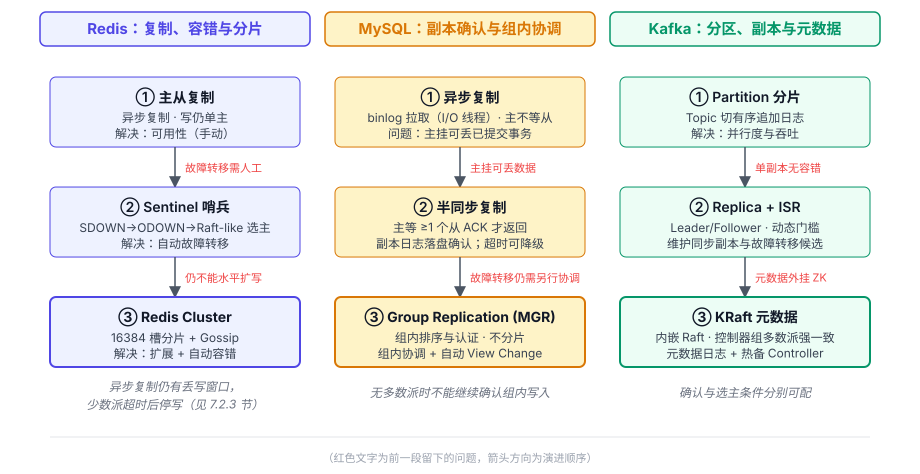
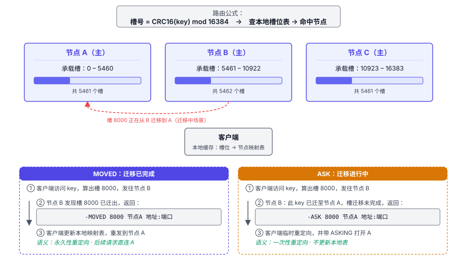
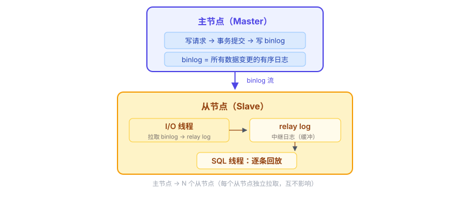
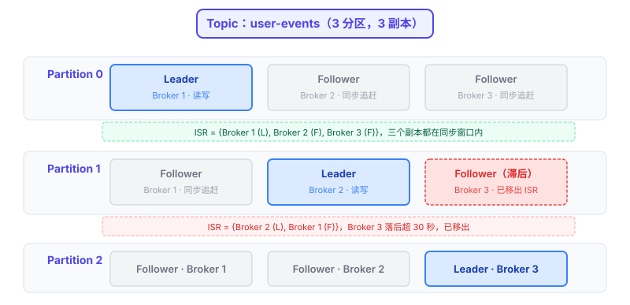
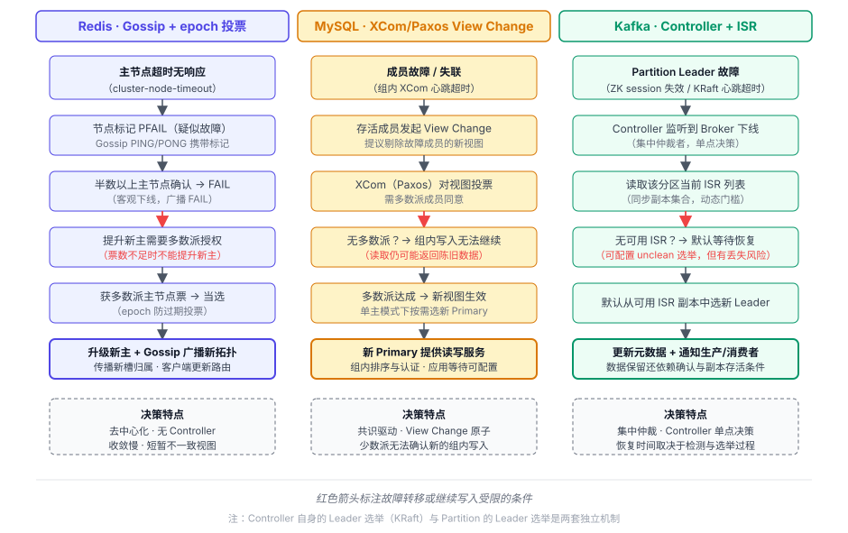

# 第 7 章 集群架构 — 从单点到分布式

## 本章导读

业务跑顺了，流量却开始翻倍。总有一天一台机器扛不住了：CPU 打满、磁盘告急，再宕一次机整个服务就跟着瘫痪。单机的 CPU、内存、磁盘都有物理上限，机器也总会坏。解决这个问题的办法，是把数据和服务分摊到多台机器上，对外表现为一个统一的系统。这就是集群架构要解决的问题。

但分布式在解决这些问题的同时，也引入了新的复杂度。一旦数据散到多台机器，四个新难题立刻冒出来：数据怎么切才均衡、副本之间怎么保持一致、某台挂了怎么自动发现和转移、集群元数据怎么统一管理。这些问题的解法，Redis、MySQL、Kafka 在生产环境里验证和改进了十几年，走出三条截然不同的路线。同样面对“单点不够用”，Redis Cluster 结合分片与异步复制，MySQL 提供不同的复制和组内协调方式，Kafka 则把副本确认范围暴露为生产者参数。
这些路线分别处理分片、复制确认和故障协调。集群的拓扑与容错归本章，复制的字节级细节归第 9 章。

我做过一个库存服务。当时选了 Redis Cluster，觉得"够快、能自动分片"。结果大促那天出了事：一次网络分区触发了主从切换，被割出去的少数派老主在超时窗口内还在接写，刚扣减的库存在网络恢复后被新主的数据覆盖了。用户下了单，仓库说没货。吃过这个亏，我才真正理解，CAP（一致性、可用性与分区容错的取舍定理）不只是教科书上的理论选择题，落到代码里就是实打实的取舍。使用异步复制，就要为故障转移可能丢数据做好预案。

## 7.1 问题的本质

不久前有个同事问我："Redis 内存快爆了，加个从节点是不是就行了？"

这个问题混淆了两件不同的事。加从节点提供的是故障接管的基础：主宕机后，可以由从节点接管，缩短服务中断。但主从数据是完整副本，主满了从也满，对"内存爆了"毫无帮助。要解决容量问题，得把数据切开放到不同机器上，每台只存一部分，这叫分片（sharding，也叫 partitioning）——这是"扩展"的事，与"高可用"是两码事。

先说扩展。数据量增长带来的压力最终落到硬件上：内存装不下、磁盘写满、CPU 打满，任何一层到顶，单机就扛不住了。把数据切到多台机器上，每台承载一部分，容量和吞吐都随机器数增长。

再说高可用。机器一定会坏：电源、网卡、磁盘、机房，任何一层出问题，数据只存一份的话，业务直接中断。把同一份数据存到多台机器上，一台坏了另一台接管，这叫复制（replication）。复制保的是可用性：机器坏了数据还在。

分片和复制是正交的。你可以只分片不复制：容量上去了，但任何一台坏了，它承载的那份数据就无法访问；也可以只复制不分片：可用性上去了，但总容量仍受单机限制，顶不住数据增长。需要同时扩容和容错的集群会把两者结合，但分工清晰：分片解决扩展，副本解决可用性。

单机还有一条与数据量无关的上限：**单节点吞吐瓶颈**。即便数据量不大，单机的网络带宽、磁盘 IOPS（每秒 I/O 操作数）也可能成为吞吐上限。分片可以把流量分摊到多台机器上，缓解这个瓶颈；实际效果还取决于热点是否分散，以及请求能否并行处理。

分布式一上来，立刻引入四个新的难题。

**第一，数据怎么切。** 是按范围切（如 0–999 在节点 A、1000–1999 在节点 B），还是按哈希切（`hash(key) % N`）？哈希分片分布均匀，但加节点就要重分片、大量数据需要重新分布；范围分片支持范围查询，但容易产生热点。重分片的代价，决定了集群能不能平滑扩展。

**第二，副本怎么一致。** 主节点写完一笔，要不要等从节点确认？不等可以省去副本确认的等待，但主节点故障后转移时可能缺少已提交的写。等待更多副本，能够增加故障后保留这笔数据的机会，也可能被慢副本拖延。Raft 这类共识协议则把多数派确认与选主规则结合起来，确保新主继承已提交的记录。确认的是收到、落盘还是应用，也必须分清；这些条件共同决定数据保证和等待开销。

**第三，故障怎么发现与转移。** 一个节点多久没心跳算"死"？是单点判定（主观下线）还是多数派投票（客观下线）？选新主按什么规则（优先级、日志进度、ID）？分区时少数派该怎么办：继续写（可能脑裂：两个主各自接受写入、数据分叉）还是停服（宁可不可用）？这套机制决定了集群在故障时的表现。

**第四，元数据怎么管理。** 哪个节点承载哪些分片？谁是当前的主？副本同步到哪了？这些元数据（metadata）由谁维护：是由 Controller 统一协调，并用复制或共识协议保存状态，还是用 Gossip（闲谈协议：节点间交换并传播状态）分散更新各节点的视图？统一协调便于组织决策，Gossip 则把传播工作分散出去；状态能否一致、故障后能否继续工作，还取决于各自的复制和决策规则。这是集群架构的另一条主线。

这四个难题之上，还有一条约束：**CAP 定理**。当网络分区（Partition）使节点之间无法通信时，系统不能同时保证原子一致性（Consistency）和所有非故障节点上的请求都能得到响应（Availability）。这里的一致性要求操作表现得像在一个节点上按顺序完成，并保留真实时间先后。它不是“数据是否落盘”，也不能直接换算成产品的快慢排序。下文重点比较分区时哪些请求还能执行，以及已确认数据在故障转移时如何保留。

> **关键数字**
> 
> **Redis Cluster：16384 个槽**，槽位 bitmap 为 2KB。官方建议的最大规模约为 1000 个节点；实际部署仍需评估 Gossip 流量、CPU 开销和故障恢复时间。
> 
> **MySQL MGR：组大小可取 3/5/7/9 个成员**，当前实现最多支持 9 个。奇数规模在多数派容错下更节省副本：3 个成员可容忍 1 个故障，5 个可容忍 2 个。跨 AZ 或 Region 的通信会增加协调等待，具体延迟取决于网络、负载和配置，需要在目标环境中测量。
> 
> **Kafka 分区容量要按负载实测。** 单分区吞吐受消息大小、批量、压缩、确认条件和硬件影响。KIP-500 把支持数十万乃至百万分区列为元数据架构的扩展目标；实际集群容量仍需结合元数据规模与恢复时间验证。

图 7-1　三个软件从单点到集群的演进主线并列：Redis 走主从→Sentinel→Cluster，MySQL 走异步→半同步→MGR，Kafka 走 Partition→Replica→KRaft。

它们虽然都从"无容错的单点"起步——Redis 和 MySQL 是单机实例，Kafka 是尚无副本的单份分区，但演进的步数和重点各异。Redis 每一代都在补上一代留下的局限：主从解决单点故障，但故障转移要人工，于是 Sentinel 把自动化补上，可写还是集中在一个主上，这才有了 Cluster 的分片。MySQL 则从异步复制逐步增加副本确认与组内事务协调。Kafka 一上来就是分布式，分片从设计起点就内置、副本是 0.8 才补上的，它真正的演进是在元数据层（从 ZooKeeper 到 KRaft）。理解了这个起点的差异，后面的机制对比就有了统一的参照。

## 7.2 Redis 的做法

### 7.2.1 主从复制：高可用的基础，但还不是集群

Redis 最朴素的集群化，是主从复制（replication）。在从节点上执行 `REPLICAOF host port`（旧版叫 `SLAVEOF`），从节点发起连接，建立后由主节点把数据推送过来。首次同步时，主节点 fork 子进程生成 RDB 快照；快照可以先写文件再传输，也可以通过无盘同步直接传给副本。期间产生的写命令保留在复制缓冲中，快照传完后再补发。Redis 7.0 让副本输出与复制积压区（replication backlog）引用共享缓冲块，各副本维护自己的发送进度；backlog 为断线后的续传保留近期历史。短暂断线后，如果复制 ID 仍能匹配相应历史，所需字节也还在 backlog 中，就可以只补差量，这叫部分重同步（partial resync）。这里只看它在集群中扮演的角色。

主从复制解决了一个问题：读可以分担到从节点，主节点坏了可以从从节点恢复数据。但它有三个根本性的局限。第一，复制是**异步**的：主节点写完立即返回客户端，不等从节点确认。这是 Redis 的默认取舍：不把副本确认放到请求的等待路径上。代价是主节点刚确认的写、从节点还没收到时主节点宕机，故障转移后这笔写可能丢失。第二，**写仍然集中在单主**。主从复制解决了读扩展和高可用，但没有解决写扩展：所有写还是落在一个主节点上，单机内存仍然是容量上限。第三，**故障转移要人工**。主节点宕了，运维得手动把某个从节点提升为主、再让其他从节点改连新主。对"高可用"这个目标，人工转移不够格。

### 7.2.2 Sentinel：把人工故障转移自动化

> **共识算法一分钟直觉**：这类算法要解决的是，几台机器如何对同一项决定达成一致，并在后续故障和换主中保留已经确认的结果。以 Raft 为例，**任期号（term）** 用来区分领导者任期，节点拒绝过期任期的请求；**日志复制**把决定传播给副本；**多数派确认、选举限制和日志规则**共同保证新领导者继承已经提交的记录。任期增加并不会让旧任期已提交的决定失效。Sentinel 借鉴了任期号和多数派选举，但不复制完整的业务日志；MGR 的 XCom 与 Kafka 的 KRaft 则用共识协议维护相应的组通信或元数据。想深究这些规则，可以读 Raft 的原始论文。

Sentinel（哨兵）就是来做自动故障转移的。Sentinel 本身是一组独立进程（通常部署 3 个或更多，奇数个便于投票），它们专门盯着主从节点，在主节点宕机时自动完成故障转移。机制分几步：每个 Sentinel 周期性地给主从节点发心跳，超过 `down-after-milliseconds` 没回应，这个 Sentinel 把主节点标记为**主观下线**（SDOWN，subjectively down）：这只是单个 Sentinel 基于本节点视角的判定。然后它通过 `SENTINEL is-master-down-by-addr` 直接询问其他 Sentinel 投票，如果认为主节点挂了的 Sentinel 数量达到配置的 quorum（quorum 是人工设定的判定票数，不必是多数派），就升级为**客观下线**（ODOWN，objectively down）：这是达到 quorum 数量后集群层面的共识判定。

接下来 Sentinel 之间用一种 Raft 风格的选举（Redis 官方文档称之为"Raft-like"，借鉴了 Raft 的任期号加多数派投票，但没有完整的 Raft 日志复制）选出一个 Leader Sentinel 主持转移，再按优先级、复制偏移量（offset）、runid 三个维度，挑选一个从节点提升为新主，给它发 `REPLICAOF NO ONE`，并通知其他从节点改连新主。

Sentinel 自身用了两轮投票（quorum 判定客观下线 + 多数派 Raft-like 选举 Leader）来降低单点误判的风险，但**数据层仍然是单主异步复制**。监控层的一致性和数据层的弱一致性是两件事：前者只管"决策"，不管"数据"。Sentinel 的下线判定不能证明主节点已真正宕机，网络分区也可能触发转移；它同样保证不了“转移后一笔都不丢”。主从异步复制的丢写风险原封不动地继承下来。

Sentinel 解决了自动故障转移的问题，但还有三个局限：写仍然集中在单主，没法水平扩展。内存仍然受单机限制，应付不了数据量增长。客户端要懂 Sentinel 协议，得知道去问谁要当前主节点地址。这三个局限加在一起，指向同一个诉求：既要能水平扩展，又要能自动容错。这就是 Redis Cluster 要解决的事。

### 7.2.3 Redis Cluster：分片加自动容错，去中心化元数据

Redis Cluster 是 Redis 的分布式集群方案。它的三个关键词是：分片、自动容错、去中心化。

**分片用 16384 个槽（slot）。** Redis Cluster 不直接把 key 映射到节点，而是先映射到 0–16383 这 16384 个槽，再把槽分配给节点。映射公式是 `CRC16(key) mod 16384`。每个主节点承载其中一段连续或不连续的槽。不直接用 `hash(key) mod 节点数`，是因为节点数会变：节点数一变，大量 key 的落点可能改变，而引入槽这一层中间抽象后，加节点只是把部分槽从老节点迁移到新节点，大部分 key 不动。图 7-2 把这套槽位划分和路由语义画了出来。

图 7-2　Redis Cluster 16384 槽分布与 MOVED/ASK 路由：槽是 key 到节点的中间抽象，加节点只迁移部分槽。

16384 这个数的选择基于工程折中。Gossip 消息里每个节点要携带自己分到的槽位 bitmap，16384 个槽对应 16384/8 = 2KB 的 bitmap，这个大小在消息体积与槽粒度之间是个折中：槽太少则迁移粒度太粗，槽太多则 bitmap 占用大、Gossip 消息膨胀。按约 100 个主节点平均分配，16384 个槽能让每个主节点分到约 160 个槽，又把 bitmap 控制在 2KB 量级，是两边都过得去的取值。

**客户端路由靠 MOVED 和 ASK 两种重定向。** 客户端可以缓存一份槽到节点的映射表，绝大多数请求直接命中。但集群拓扑会变（扩容、缩容、故障转移），节点可能根据槽归属或迁移状态返回 MOVED 或 ASK 重定向。MOVED 表示"这个槽已由另一个节点负责，请改用新地址"，客户端收到后更新本地映射表，以后都走新地址；ASK 表示"这个槽正在迁移中，本次请求请去临时地址试一下"，是一次性重定向，客户端先向目标节点发送 `ASKING`，再发送这次请求，暂不更新槽映射；后续请求仍先访问原节点，迁移完成后的新归属由 MOVED 通知。

此外，Redis Cluster 禁用了多数据库的 `SELECT` 命令（只有 0 号库），并要求多键命令（如 `MGET`、事务、Lua 脚本）涉及的所有 key 必须落在同一个槽。可以用哈希标签（hash tag）`{user:1001}.name`、`{user:1001}.email` 强制让带相同 `{...}` 的 key 落到同槽。

**元数据分散维护，用 Gossip 传播状态。** Redis Cluster 没有集中的协调者，节点通过集群总线交换槽归属、成员和故障信息。Gossip 主要用于传播节点状态和故障报告；故障转移授权还要遵守主节点多数派投票等规则。各节点视图在传播过程中可能暂时不同，收敛时间取决于超时配置和网络状况，客户端也可能暂时持有过期映射。

**容错靠从节点发起选举。** 当主节点被判定下线后，符合条件的从节点向其他主节点请求转移授权，获得多数主节点的票后提升为新主，接管原主的槽。epoch 用来区分选举和配置的新旧，新的槽归属再向其他节点传播。多数派授权约束的是谁可以接管；因为业务数据仍异步复制，新主未必有原主刚确认的全部写入。故障转移后，缺少的写入可能丢失。

**Redis Cluster 不保证网络分区期间所有节点都可用。** 少数派主节点失去与多数派的联系后，会在 `cluster-node-timeout`（默认 15 秒）触发的超时判定后停止写入；检测到分区之前仍可能接收写入。多数派一侧也需要为不可达的主节点找到可晋升副本，完成故障转移并恢复槽覆盖后，才能恢复相应服务。窗口期内写到少数派老主的数据，可能在转移后被丢弃。本章开头的库存超卖事故，就发生在这个时间窗口里。与其给它贴一个笼统的 AP 或 CP 标签，我更关心停止写入的条件，以及已经确认的写入在转移后能否保留。

最小拓扑 3 主 3 从是工程惯例：3 个主是为了能在 1 个主宕机时仍有 2 个主凑成多数派完成选举，每个主配 1 个从是为了主宕了有人顶替。这是可用性、容错能力、资源成本三者之间的实践平衡，不是 Redis 强制的硬约束。

## 7.3 MySQL 的做法

理解 MySQL 的集群，得先看清它的基本拓扑。MySQL 集群最核心的机制是**主从复制**：一台主节点（Master，8.0.22/8.0.23 起官方改称 source，新增 START REPLICA、CHANGE REPLICATION SOURCE TO 等语句别名）处理所有写请求，把每一条数据变更记进 binlog（二进制日志）；一台或多台从节点（Slave，同期改称 replica）通过订阅主节点的 binlog 来保持数据同步。从节点将网络接收和本地回放分开：I/O 线程接收 binlog 事件并写入中继日志，回放线程再从中读取执行。单线程回放时由一个 SQL 线程执行；多线程复制则由协调器和 worker 分工。中继日志缓冲了接收与回放的速度差，回放慢时可以逐步追赶，但接收仍会受缓冲空间等资源限制。

从这个基础拓扑出发，MySQL 逐步提供了异步复制、半同步复制和组复制 MGR：异步复制默认不等副本，故障转移时可能缺少已提交事务；半同步等待指定数量的副本将日志接收并刷盘；MGR 则在提交前加入组内事务协调。新增的确认和协调需要等待，但三种方案的区别不能只用一个“一致性强度”概括。

图 7-3　MySQL 主从复制基础拓扑：主节点写 binlog，从节点 I/O 线程拉到 relay log，SQL 线程回放。

MySQL 的集群目标是"不丢数据"，从异步复制到组复制始终没变；演进同时在补全可用性和自动化。

### 7.3.1 基于 binlog 的复制：单向、异步、行流

MySQL 复制的基础是 binlog，链路就是 7.3 开头那条"主写 binlog → I/O 线程拉到中继日志 → SQL 线程回放"。每条复制链路从主节点流向从节点；默认异步方式在主节点完成本地提交后返回，不等从节点。binlog 事件有 STATEMENT/ROW/MIXED 三种格式，取舍主要在 STATEMENT 与 ROW 之间；本章只把 binlog 当作"变更流的载体"。

老式复制靠 file + position 定位复制位点：从节点记录“我同步到了 mysql-bin.000003 的第 1580 字节”。文件滚动本身不会让位点失效，但换主时，新主的日志文件和位置可能不同，人工对齐容易出错。MySQL 5.6 引入了全局事务标识（GTID，Global Transaction Identifier），格式是 `source_id:transaction_id`，给事务一个全局唯一 ID。启用 GTID 自动定位后，从节点报告已接收或提交的 GTID 集合，新主据此补发缺少的事务。所需日志如果已经清理，仍要从其他源补齐，或用新备份重建副本。GTID 让切换复制源更容易管理，不再依赖人工对齐文件位点。

异步复制的代价是：主节点不等从节点，主节点宕机后转移到从节点时，可能缺少已经提交、但还没来得及传过去的事务。回放也可能遇到瓶颈：单 SQL 线程只能串行重做，主节点并发写入速度持续超过回放速度时，复制延迟就会增长。MySQL 的多线程复制（MTS，Multi-Threaded Slave；8.0.27 起默认开启，`replica_parallel_workers` 默认 4，更早版本默认 0 即单线程回放）利用 binlog 中的依赖标记 `last_committed` / `sequence_number` 调度并行回放。默认 `COMMIT_ORDER` 根据事务提交窗口是否重叠来生成依赖，不只限于同一次组提交；`WRITESET` 还可利用写集识别更多互不冲突的事务。并行回放能缓解延迟，收益仍受事务依赖和回放资源限制。存储格式与回放机制见第 8、9 章。

### 7.3.2 半同步复制：在异步与全同步之间

半同步复制（semi-sync replication）在异步复制上增加了副本确认。默认等待点下，主节点将 binlog 刷盘后，至少等一个从节点确认，再提交到存储引擎并向客户端返回成功。这里必须分清从节点确认的是哪一步：从节点 I/O 线程把 binlog 事件写入 relay log 并落盘后就回 ACK，不等 SQL 线程回放完毕。它缩小了“binlog 还没传到副本、主就没了”的风险，但确认超时会降级为异步；故障转移时还必须选择持有已确认事务的副本，保留并应用其 relay log。事务暂时停留在 relay log 中，并不等于已经丢失。

### 7.3.3 Group Replication：多数派协调与冲突认证

组复制（MGR，MySQL Group Replication）在复制链路中加入组内事务协调。它在 MySQL 5.7.17 首次作为 GA 特性提供，8.0 又做了大量增强（更完善的成员管理、更好的并发写性能）。它的核心是基于 Paxos 的组通信组件 XCom。以单主模式的读写事务为例：客户端把事务发给主节点，事务准备提交时，主节点向组内广播行变更及写集；XCom 建立全序消息传递，各成员按这个顺序做冲突认证。通过认证后，主节点才真正提交，并向客户端返回成功，其他成员也在认证后应用这笔事务。

XCom 需要多数派才能继续作出决定。容错能力是经典的 ⌊(N-1)/2⌋：3 个成员能容忍 1 个故障，5 个能容忍 2 个，只要剩余成员仍能形成多数派，组就能继续运行。成员故障或加入会触发 View Change，组内更新成员视图；重新加入的成员则借助 GTID 确定缺少的事务，再通过分布式恢复追赶数据。

MGR 有两种模式。**单主模式（single-primary）** 是默认模式：组里只有一个主节点（Primary）可写，其他从节点（Secondary）只读，主节点故障时组内自动选新主。**多主模式（multi-primary）** 允许所有成员都可写，但写入要在组内做冲突认证（Certification）：比较并发事务的写集，检查是否修改了同一行；冲突时，全序中排在前面的事务获胜，另一个事务在发起节点回滚。多主模式需要承担额外的写冲突和回滚开销，是否合适取决于业务负载。本书不展开多主的冲突算法细节。

当网络分区后无法联系多数派时，MGR 无法继续确认新的组内写入；成员后续如何退出或进入只读状态，还取决于故障处理配置。这里牺牲的是这部分写入的可用性；读取仍可能继续返回旧数据。多数派协调也不等于其他成员已应用完事务；MySQL 8.0 默认的一致性级别为 `EVENTUAL`，跨成员读取可能暂时看到旧数据，额外的等待由 `group_replication_consistency` 控制。跨节点通信和等待都可能增加事务延迟。

### 7.3.4 MGR 不分片：一个有意的取舍

MGR 有一个关键取舍：**它不分片**。组里每个成员都持有**全量数据**。加一个成员到组里，扩的是"副本数"：可用性更高、读吞吐更大，但**不扩容量**，单表的数据量仍然受单机磁盘限制，写吞吐仍然受单主瓶颈限制。

这是 MySQL 生态的分工。MySQL 把"高可用、可协调事务的副本组"做扎实（MGR），把"数据分片"交给上层中间件：ShardingSphere、Vitess、MyCAT 这类方案在 MySQL 之上做分库分表，跨多个 MySQL 实例分摊数据。这种分层让 MySQL 内核聚焦于其核心定位：单机事务引擎和复制协议，分片逻辑由独立的中间件层处理，模块边界清晰。代价是使用上不那么省事：你想要一个既有副本容错又能水平扩展数据容量的 MySQL 集群，得自己把 MGR 和分片中间件拼起来。这是一个工程取舍：模块化、可组合，胜过大一统。

### 7.3.5 InnoDB Cluster：把组件打包成方案

MGR 本身提供副本组和组内选主，客户端还需要在主节点切换后重新连接到合适的成员。MySQL Router 为此提供统一的连接入口：它读取集群拓扑，把读写连接路由到主节点，把只读连接按策略路由到相应成员。主节点切换后，新的连接可以路由到新主；原连接失败时，应用仍须处理错误并重连。再加上 MySQL Shell 提供的运维管理（建组、加成员、查看状态），三者打包起来叫 InnoDB Cluster。

InnoDB Cluster 的副本组仍由 MGR 提供，Router 和 Shell 把连接路由与运维管理整合进来。它的取舍主要在工程整合：降低使用复杂度，同时继承 MGR 的全量复制、不分片等特性，默认采用单主模式。如果业务能接受这些特性，InnoDB Cluster 是 MySQL 官方提供的高可用方案。

## 7.4 Kafka 的做法

Kafka 从设计起点就围绕分区组织数据，副本机制则在 0.8 加入。它可以只部署一个 Broker，也可以把主题的多个分区与副本分散到多台机器上。先看清它的基本拓扑：每个分区有一个 Leader，可以配置若干 Follower；写入由 Leader 处理，消费者默认也从 Leader 读取，Follower 从 Leader 拉取数据。把不同分区的 Leader 分散到不同 Broker 上，可以分摊负载，但分区热点仍可能让某台机器成为瓶颈。

图 7-4　Kafka 分区与副本拓扑：Partition 是并行单位，每个分区一个 Leader 加若干 Follower，Leader 分散在各 Broker。

Kafka 集群设计上没有前两款软件那种从单机改造的历史负担，但也做了几处明确的取舍。

### 7.4.1 Partition：分区即并行单位

Kafka 的分区（partition）就是并行单位。一个主题（topic）被切成 N 个分区，每个分区是一份有序的、只能追加（append-only）的日志。生产者未显式指定分区时，有 key 的默认路由是 `toPositive(murmur2(serializedKey)) % N`，先对序列化后的 key 求哈希并转成非负整数，再取模；N 和序列化方式不变时，同一个 key 落到同一个分区。没有 key 时，Kafka 2.4 经 KIP-480 引入默认粘性分区；在本章的 3.9 基线中，默认逻辑向一个分区累计发送至少 `batch.size` 字节后再切换，以改善成批发送的效率。逐条轮询会把记录分散到更多分区，批量效果因负载而异。

这个映射里的 N 一变，key 到分区的落点跟着重算：扩分区后新消息按新 N 计算落点，旧消息留在原分区不重新分布，同一个 key 的新旧消息可能就此分在两个分区，按键的顺序没有保证。依赖按键顺序的业务，扩分区是一次语义迁移，得按数据迁移来规划，不是单纯的容量操作。

分区的第一个语义是**并行度**。Kafka 的吞吐靠分区并行：增加分区可以提高生产、消费和存储的并行度，但实际吞吐还受流量分布和各节点资源限制。分区的第二个语义是**顺序性的边界**：顺序性只在单个分区内成立，跨分区不保证顺序。这是 Kafka 一致性保证的核心边界：如果你要严格的全局有序，只能用一个分区，那就回到了单分区的串行瓶颈；如果你要高吞吐，就得接受"分区内有序、分区间无序"。

分区数怎么选，是个经典的容量规划权衡。分区太少了，并行度上不去，吞吐受限；分区太多了，Broker 要为每个分区维护文件句柄、索引、内存结构，管理开销增加，故障时的 Leader 选举恢复时间也拉长（因为每个分区都要独立选主）。可以先在目标消息大小、确认条件和硬件环境下测出单分区吞吐，再用峰值吞吐反推分区数并留些余量；没有放之四海皆准的最优值，得按业务负载实测。

### 7.4.2 Replica 与 ISR：同步达标的副本集合

每个分区可以配置一个或多个副本（replica），其中一个是 Leader，其余是 Follower。写入走 Leader，消费者默认从 Leader 读取；Follower 主动从 Leader 拉取（fetch）数据追赶同步，也可以在启用相应读取策略后为消费者服务。这套 Leader-Follower 模型看着和 Redis、MySQL 的主从很像，但 Kafka 在“谁能当 Leader”上做了一个关键设计：**ISR（In-Sync Replicas，同步副本集合）**。

ISR 是一个动态集合：Follower 需要在 `replica.lag.time.max.ms` 的时间窗口内追上 Leader，才能维持同步副本资格；掉线或落后超时的副本会被移出 ISR。当 Leader 故障时，默认关闭 unclean 选举，新 Leader 从可用的 ISR 副本中选择；开启 unclean 选举则允许选择非 ISR 副本，但可能丢失已提交消息。ISR 把“哪些副本保持同步”做成了动态判定。慢副本移出后，不再需要等待它确认；但移出前仍可能拖慢写入，ISR 数量不足也会使 `acks=all` 写入失败。

ISR 定义了 Kafka 副本同步的边界，和 MGR 的多数派通信、Redis 的候选副本筛选解决的并非同一个问题。MGR 在读写事务提交前进行组内排序与冲突认证；Kafka 用 ISR 维护跟得上 Leader 的副本集合，再由生产者选择确认范围。Sentinel 也会排除长时间断线等不合格副本，然后按优先级、复制偏移量和 runid 选择新主。比较这几种机制，关键是确认成功时副本保存了什么，以及故障转移允许选择哪些副本。

### 7.4.3 acks：把副本确认范围做成可调参数

Kafka 在生产者端有一个参数 `acks`，决定写入成功前需要等待的确认范围。`acks=0` 不等待服务端确认，生产者无法据此判断 Leader 是否收到消息，相应的失败重试也不起作用；`acks=1`（Kafka 3.0 之前的默认）等 Leader 写入本地日志后返回，不等待 Follower 确认，Leader 此时故障仍可能丢失刚确认的消息；`acks=all`（也叫 `-1`，自 Kafka 3.0 起成为默认，对应 KIP-679）等待 ISR 中所有副本确认。后者还要满足 `min.insync.replicas` 的最低副本数要求；在至少一个同步副本持续存活、故障转移遵守同步副本规则的条件下，已提交消息才有相应的保留保证。收到确认不等于每条消息都已在各副本上执行 `fsync`。

三家的可配置项作用在不同环节。Redis 默认异步复制，也提供 `WAIT` 等待此前写入的副本确认，`min-replicas` 则限制副本状况不达标时继续写入；这些机制不会把 Redis 变成强一致系统。MySQL 可以选择异步、半同步或 MGR；半同步插件可在运行期启停，MGR 则使用另一套组内复制机制（见 7.3 节）。Kafka 把确认范围做成生产者参数，同一集群上的不同生产者可以各自选择。等待更多副本可能增加延迟，也会改变副本不足时写入能否成功。`acks` 与 `min.insync.replicas` 的精确交互，以及消息提交和生产者收到成功响应的区别，见第 9 章 acks 参数一节。

### 7.4.4 Controller 与 KRaft：元数据管理的两次演进

Kafka 的元数据管理（哪个 Broker 活着、哪个分区的 Leader 是谁、ISR 中有哪些副本、副本怎么分配）经历了两次大的演进。

**早期方案是 ZooKeeper + Controller。** 元数据存在外部的 ZooKeeper 集群里，Kafka 集群里选出一个 Broker 充当活跃 Controller，管理元数据和分区 Leader 选举。这套方案能用，但问题随规模暴露：元数据与各节点的内存状态分散在两套系统里，需要同步变更；Controller 切换后要重新加载和传播状态；ZooKeeper 的 watch 通知及重复读取会增加大规模元数据管理的开销（watch 是变更订阅机制）；运维还要同时维护 Kafka 和 ZooKeeper 两套系统。KIP-500 指出的一个风险是，未及时收到状态更新的 Broker 可能仍按过期的 Leader 信息处理请求。

**KRaft 模式（3.3 起对新集群生产可用）是第二次演进。** KRaft 把元数据管理从 ZooKeeper 收回到 Kafka 内部：一组 Controller 通过 Raft 维护元数据日志，不再依赖外部系统（Controller 可与 Broker 同进程部署，也可独立成组）。这是专用的集群元数据日志，落在 `__cluster_metadata-0` 等目录中，Broker 从 Controller 同步元数据变更。Controller 的热备成员持续跟进状态，切换时可以减少重新加载全部元数据的工作；日志与快照也支持按进度恢复。这套改造简化了部署，并为管理更多分区提供了条件，实际规模与恢复时间仍取决于配置和负载。

KRaft 的成熟度口径：按 KIP-833 的官方路线，KRaft 在 **Kafka 3.3**（2022 年发布）才被标记为"对新集群生产可用"；这是稳定线的起点。**Kafka 3.5** 把 ZooKeeper 模式正式标记为 deprecated，迁移工具（KIP-866）在 3.4 起以 Early Access 引入、3.5 为 preview、3.6 起进入生产可用（GA，社区建议使用 3.6.2+ 或 3.7.1+ 以获得关键 bug 修复）。**Kafka 3.9** 是最后一个支持 ZK 模式的 bridge release。直到后续大版本（Kafka 4.0）才彻底移除 ZK 支持。所以"Kafka 3.x 用 KRaft"这个说法要精确到 3.3+ 才算稳妥，3.0–3.2 的 KRaft 还在预览阶段，不应在生产使用。

Kafka 里有**两层独立的 Leader 选举**。一层是 Controller 节点之间的 Raft 选举，决定谁是“活跃 Controller”，这是元数据层的事；另一层是分区 Leader 的选择，由活跃 Controller 按副本状态和选举策略决定。默认关闭 unclean 选举时，从该分区可用的 ISR 副本中选择。Raft 选举的是元数据层的 Leader，ISR 则为数据分区 Leader 的选择提供候选范围。

## 7.5 横向对比

表 7-1 从六个维度对比三个集群方案：数据分片策略、副本确认与协调、故障检测与 Leader 选举、元数据管理、分区或副本不足时的行为、横向扩展能力。

**表 7-1　三个集群方案横向对比总表**

| 对比维度 | Redis | MySQL | Kafka |
|---|---|---|---|
| 数据分片策略 | 16384 槽哈希分片，客户端路由（MOVED/ASK） | 不分片（MGR 全量复制），分片交给上层中间件 | 分区哈希/粘性分片，生产者端路由 |
| 副本确认与协调 | 默认异步复制，可用 WAIT 等待副本确认 | 异步 / 半同步确认 / MGR 组内排序与认证 | ISR 动态集合 + acks 确认范围 |
| 故障检测与 Leader 选举 | Gossip 传播故障状态，主节点多数派授权从节点提升 | XCom/Paxos 协调成员视图，单主模式可自动选 Primary | 活跃 Controller 按策略选 Leader，默认从可用 ISR 中选 |
| 元数据管理 | Gossip 传播槽与节点状态，epoch 区分配置更新 | 组通信协调成员视图与事务顺序 | KRaft Controller 组维护元数据日志 |
| 分区或副本不足时的行为 | 少数派在超时后停写，窗口内已确认写仍可能丢失 | MGR 无多数派不能继续确认组内写入；读取可能陈旧 | 无可用 ISR 时默认不选非 ISR；acks=all 还受 min.insync.replicas 限制 |
| 横向扩展能力 | 分片扩写与容量，效果受负载分布影响 | 副本增加可用性与读扩展能力，扩容量靠上层分片 | 分区与 Broker 提供吞吐和容量扩展空间 |

**分片策略的差异，根子在定位。** Redis 和 Kafka 都做分片，但粒度不同：Redis 是“key → 槽 → 节点”，槽是分配和迁移管理的单位；Kafka 是“key → 分区 → Broker”，分区既组织有序日志，也提供并行处理的边界。两者都用中间的逻辑分片把数据与具体机器分开，只是移动槽与增加分区对 key 路由的影响不同。MySQL 的 MGR 则提供全量副本组，数据分片由上层中间件承接。

**副本机制的差异，要从确认与故障转移两边看。** Redis 默认不等待副本确认；MySQL 半同步等待副本保存日志，MGR 还进行组内排序与冲突认证；Kafka 则用 ISR 配合 `acks` 指定确认范围。缓存可以从后端重建，交易记录却不能靠重新查询补回丢失的写入，业务对丢失和陈旧读取的容忍度不同。Kafka 既可能用于日志采集，也可能用于传递重要业务事件，因此也需要按场景配置副本数、确认条件和选主策略。

**故障检测与 Leader 选举，三个软件各有侧重。** Redis Cluster 通过 Gossip 传播故障状态，由主节点多数派授权从节点提升。MySQL MGR 用 XCom 协调组成员视图，单主模式下在主节点退出后选出新的 Primary。Kafka 由活跃 Controller 按副本状态与选举策略选择分区 Leader，而 Controller 组自身通过 Raft 维持可接替的元数据状态。对同一个“谁来当新主”的问题，图 7-5 把三个软件的不同决策路径并排画了出来。

图 7-5　故障转移决策路径：Redis Cluster 由主节点多数派授权，MySQL MGR 协调成员视图，Kafka 由活跃 Controller 按副本状态与选举策略选择分区 Leader。

图 7-5 里的三处红色箭头，标记了继续服务受限的条件：Redis Cluster 无法取得多数派授权时不能提升新主；MySQL MGR 的少数派不能继续确认新的组内写入；Kafka 默认在没有可用 ISR 副本时等待恢复，而不直接选择落后的非 ISR 副本。这些限制分别作用于故障转移、事务提交和分区选主，并不等于三者都立即停止全部读写。

**元数据管理方式会限制集群能扩到多大。** Redis Cluster 随节点增多需要传播更多状态，官方给出的规模目标约为 1000 个节点；MySQL MGR 的实现最多支持 9 个成员，跨成员协调也会带来开销；Kafka KRaft 用元数据日志和快照减少状态同步与恢复的重复工作，为管理更多分区提供了条件。具体容量还要结合元数据量、负载和故障恢复时间判断。

**横向扩展时，三个软件解决的瓶颈不同。** Redis 加分片可以分摊写入并扩充容量。MySQL 加副本增加容错和读扩展的空间，MGR 本身不分摊数据容量。Kafka 则用分区与 Broker 扩展数据处理和存储。如果瓶颈是“单表数据太大”，MySQL 单靠 MGR 解不了，需要叠加分片方案；如果瓶颈是“读 QPS 上不去”，还要看请求能否路由到副本、业务能否接受对应的读可见性。Kafka 默认从 Leader 读取，单纯增加 Follower 不会自动分摊消费者流量。

## 7.6 架构启示

集群这块，三个软件的分歧最尖锐，但分歧底下是相同的几条选型规律。

### 启示一：分片与副本是正交的两件事，先分开再谈集群

我做集群前会先想清楚三件事：业务数据量在不在涨、写吞吐扛不扛得住、单点宕机会不会要命。前两个用分片解，最后一个用副本解。Redis 和 Kafka 两件事都做、分工清晰；MySQL 只做副本、把分片让给生态，定位决定选择。混为一谈的代价很具体：搭了一堆副本，数据量涨上去单机还是扛不住；或者做了分片却没做副本，一台机器坏了，那个分片就无法继续服务，数据能否恢复还要看原机存储或备份。

### 启示二：副本确认与事务协调需要等待

Redis 默认异步复制省去了等待副本确认的时间；MySQL 半同步和 MGR 增加了不同的确认与协调等待；Kafka 的 `acks` 则决定生产者等待哪些副本确认。我自己设计系统时，会先想清楚业务对一致性的真实需求。很多业务并不需要更强的同步保证，额外协调只会增加不必要的等待；反过来，把需要这些保证的业务放在未提供相应保证的系统上，也会出事。第 4 章启示三讨论过刷盘与响应时间的取舍，这里关注的是副本确认和组内协调。两种等待都需要成本，但确认的对象和故障后保留的保证不同，选型时必须分开判断。

### 启示三：元数据管理决定集群的上限

集群能扩到多大、故障恢复多快、状态如何协调，很大程度上取决于元数据怎么管。Gossip 分散了状态传播的工作，也需要处理传播延迟与暂时不一致的视图；共识日志则明确状态变更的顺序，需要多数派维持进展。Kafka 从 ZooKeeper 走到 KRaft，减少了两套系统之间的状态同步，并让备用 Controller 持续跟进元数据。元数据层是被低估的复杂度来源：它要抗网络分区、要快速收敛、要支撑海量分区的状态。选错方案，整个集群的上限就卡在这一层。

### 启示四：把失败当常态，把确认条件做成可调参数

故障的形态与业务的容忍度各不相同，没有普遍适用的答案。Kafka 的 `acks` 是一个把架构决策暴露为配置参数的典型例子。两种思路各有适用场景：使用场景单一明确时，固定策略更简单；使用场景跨度大时，可调参数更灵活。我设计系统时会问一句：哪些取舍该写死，哪些该交给配置？做可调参数需要明确每档的保证、代价及相互作用，固定策略也需要处理预期场景内的故障。代价是：参数多了，使用者也得跟着调。

### 启示五：分区时的取舍要由业务需求倒推

网络分区时，业务能接受请求失败，还是能接受读取陈旧数据，得由业务角色倒推。缓存是否可以降级或回源，要看主流程的容错方式；交易记录还必须单独考虑已确认写入的持久性，数据丢失可能带来法律和财务责任；流系统则需要按日志采集或关键业务事件的要求设定确认与选主条件。我选型前会先确定业务能接受哪些故障后果：选错定位，比选错参数严重得多。反过来想，只因为“我手里有个 Redis”就拿它存交易记录，却不检查故障转移和数据保留的保证，往往就是事故的开端。

## 7.7 小结

单点故障可以通过分布式部署缓解，但分布式也带来新的复杂度。集群要同时解决数据怎么切、副本怎么一致、故障怎么转移、元数据谁说了算这四个问题，三个软件各给出了一套不同的方案：Redis Cluster 用槽分片、Gossip 状态传播与异步复制，故障转移仍有丢写窗口；MySQL 提供基于 binlog 的复制，并由 MGR 增加组内排序与认证；Kafka 以分区组织并行处理，用 ISR 和确认参数管理副本写入，由 KRaft 协调元数据。三个软件的共性是一套基本结构：分片用于扩容，副本用于容错，并可支持读扩展，协调机制管理成员与状态变更；只是在这套结构上，各自按自己的定位做了不同的取舍。

集群里的数据以什么格式保存到磁盘（日志段、RDB/AOF），是第 8 章的内容；节点之间的数据如何精确同步、字节级的复制流怎么走，则是第 9 章的主题。而 Router、Controller 这类协调层如何嵌入整体分层架构，可以回看第 5 章。本章建立的"分片—副本—共识"这条线，后面几章会反复用到。
