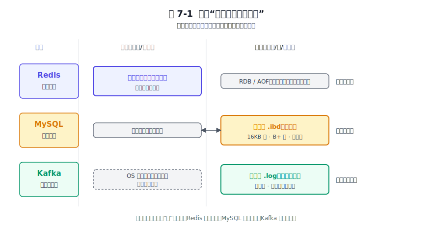
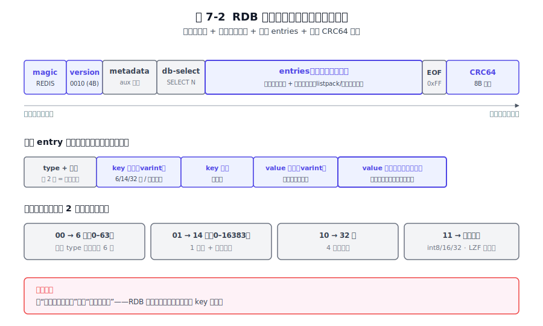
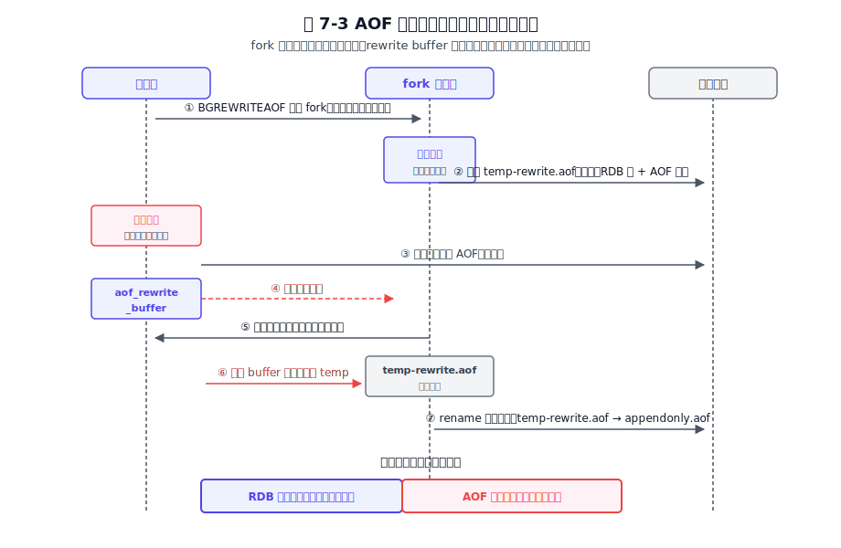
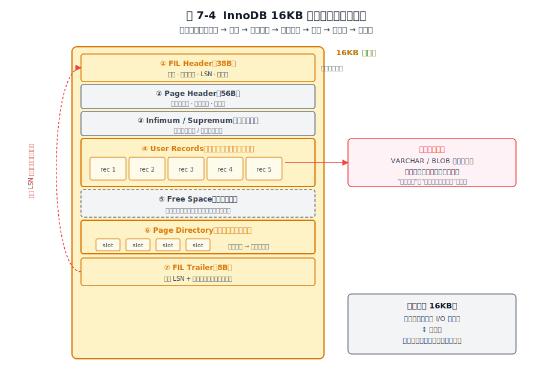
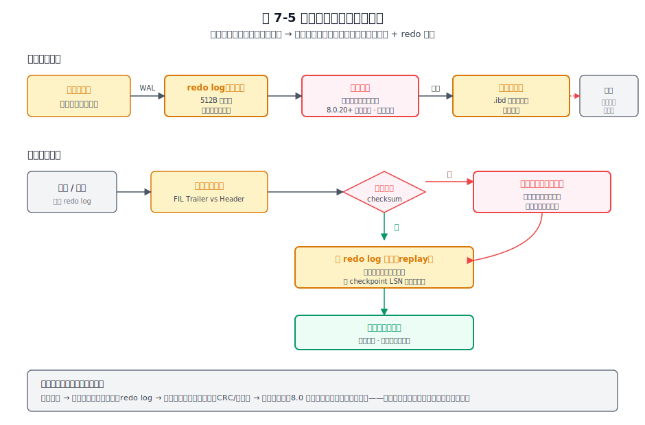
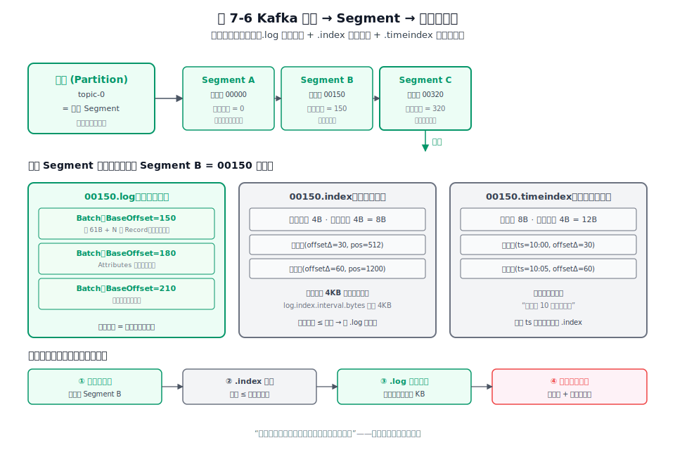
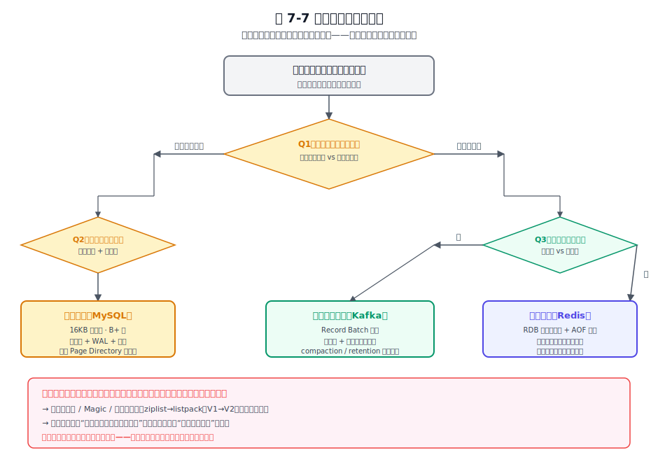

# 第 7 章 磁盘存储格式 — 文件结构的设计哲学

## 本章导读

当数据从易失内存落到持久化磁盘，文件结构本身就是一种架构决策——它同时框定了软件的性能天花板、可靠性下限和演进自由度。本章不堆三种文件格式的字段表，而是追问同一个根问题：给定不同的访问模式与可靠性诉求，磁盘上的字节该被组织成什么样？读完后，你能区分"快照 / 追加日志 / 定长页"三种范式各自服务的场景，能解释为什么 Redis 用变长紧凑编码、MySQL 死守 16KB 页、Kafka 把整批消息压进一个 Batch，并能在自己的系统里回答"我该选哪种格式骨架"。

## 7.1 问题的本质

### 7.1.1 为什么磁盘值得单独一章

磁盘不是"慢一点的内存"。两者在工程上的差距，远不止延迟数字。内存的随机访问几乎免费，磁盘的随机访问要付出寻道与页粒度的代价；内存字节序由 CPU 决定且进程独占，磁盘字节却要跨进程、跨机器、跨年份地被读取，因此必须自描述；内存写失败进程就死了，磁盘写一半断电（partial write）留下的却是半坏的数据结构，下一次启动要面对它。再加上扇区原子性、对齐、字节序、CRC 校验这些内存世界根本不存在的约束，磁盘格式从一开始就活在另一套物理规则里。

把存储格式想成一份契约更准确：它把"内存里活的、可变的数据结构"翻译成"磁盘上死的、自描述的字节序列"。这份契约一旦发布就无法收回——明天发布的格式要能读懂今天写的文件，后天升级的代码要能读懂前天写的文件，向前向后兼容从此变成长期债务。第 3 章讲过分层思想是软件应对存储介质差异的通用手段，本章是把这套思想落到"磁盘上那一层字节到底长什么样"的纵深。

### 7.1.2 四个根本张力

把所有持久化系统面对的磁盘格式问题摊开，绕不开四个张力。后文三家各自的做法，本质上是在这四个张力上做了不同的取舍，因此先把它讲清楚，作为后面反复回扣的主线。

第一是读写路径的不对称。写要快还是读要快，往往不能兼得。顺序追加让写达到磁盘带宽上限，但读时无法随机定位；定长页让读能 O(1) 跳到任意位置，但写时要付出页内整理与原地改的代价。

第二是空间与时间的置换。紧凑编码省 I/O 带宽和磁盘空间，但每次读写都要编解码吃 CPU；冗余字段与定长对齐让 CPU 解析省事，但浪费空间。压缩、变长整数、字典编码在一侧，对齐、定长字段、冗余校验在另一侧；CPU 越快、I/O 越慢，越值得为省 I/O 而烧 CPU。

第三是可靠性与性能的拉扯。校验和、双写、WAL、fsync 策略，每一项都在用性能换"断电后数据不坏"。多写一份冗余、多落一次盘、多记一条日志，都是为某一类故障买的保险——买保险要钱，更要清楚保的是哪类风险，否则就是无谓的写放大。

第四是定型与演进的矛盾。格式发布即定型，业务变了、字段要加、编码要换、旧 bug 要修，都得在原格式上做兼容设计。版本号、Magic、保留字段、编码切换、在线 DDL，都是为未来留的口子。

### 7.1.3 三家面对的共同问题与各自约束

Redis、MySQL、Kafka 都要回答同一组问题：基本 I/O 单元多大、写是追加还是原地改、怎么做崩溃恢复、怎么演进格式。但各自的约束南辕北辙，这直接把它们的格式推向了三种完全不同的骨架。

对 Redis 来说，内存才是数据的家，磁盘是保险——存盘只为崩溃后恢复，不为线上查询。对 MySQL 来说，磁盘才是数据的家，内存（缓冲池）只是磁盘页的缓存——线上事务随时要读写任意一行，格式必须支持随机定位与原地改。对 Kafka 来说，磁盘就是日志本体本身——消息只有一份真相躺在日志段里，读靠索引而非扫描，写永远追加。这三句是后面三家所有格式差异的总根。

我们先用一张图看清三家在"数据真正住在哪里"这件事上的权重差异。

图 7-1 三家"数据真正住在哪里"的内存/磁盘权重示意。

这张图把三家的内存与磁盘权重摆在同一坐标系下：Redis 内存占绝对主导，磁盘只是恢复副本；MySQL 磁盘是真相来源，内存缓冲池只是它的影子；Kafka 磁盘就是数据本体，内核页缓存承担内存层角色。权重的倒置，是后文三家格式选择不同的根本原因——为内存优化、为磁盘随机访问优化、为顺序追加优化的格式，自然长成三种样子。

## 7.2 Redis 的做法

### 7.2.1 定位先行：磁盘服务于内存

理解 Redis 的持久化格式，必须先理解它的定位。Redis 的真相数据始终在内存，RDB 与 AOF 扮演的角色是"崩溃后把内存重建出来"，而非"线上查询的来源"——线上查询永远走内存，磁盘文件在正常运行期间不参与任何读路径。

这一定位是决定性的。它意味着：格式可以紧凑到极致（加载是整文件一次性灌入，不需随机访问）；可以全量重写（只需保证最终内存正确，不需保持旧文件可读）；不必支持原地改写（内存改后，磁盘副本整个换掉即可）。Redis 能把磁盘格式做得这么简单，根本原因是它给磁盘提的要求只有"能恢复"而非"能查询"——这是 Redis 与 MySQL、Kafka 在格式设计上的根本差异。

### 7.2.2 RDB：紧凑二进制快照

RDB（快照文件）是 Redis 的全量快照格式。它的设计目标是文件小、加载快，因此走的是紧凑二进制路线。

文件以一段固定魔数 `REDIS` 开头，紧跟 4 字节 ASCII 版本号。RDB 版本号随 Redis 主版本递增，且与 Redis 主版本号不一一对应：Redis 7.0 写出 RDB version 10，7.2 提升到 11，7.4 提升到 12（具体以 `src/rdb.h` 中的 `RDB_VERSION` 宏为准）。文件靠前缀自识别，不靠扩展名——任何一段字节流，只要开头是 `REDIS` 加合法版本号，加载器就认它。长度字段普遍采用变长整数编码（length-encoding），按实际大小自动选最省字节的表示：类型字节的高两位做档位选择——`00` 走 6 位（0–63）、`01` 走 14 位（0–16383）、`10` 走 32 位定长、`11` 则是特殊编码（int8/int16/int32/LZF 压缩串等，把数值或压缩后的串直接塞进这几个字节）。小长度（0–63）只需 1 个字节就搞定，连额外长度字段都省了。每一处省下来的字节，乘以全量快照的规模，就是显著的文件体积下降。

值得专门提一句的是存储态编码与内存态编码的分离。内存里 Hash 可能用 listpack 编码，也可能用 hashtable 编码，存盘时并不照搬内存布局，而是按统一的紧凑二进制序列化；加载后由加载器按当前阈值重新决定编码。这种分离让磁盘格式不绑死内存数据结构的演进——内存编码升级，磁盘格式不需要跟着变。

我们来看 RDB 文件的整体布局。

图 7-2 RDB 文件布局：magic / version / metadata / db-selector / entries / CRC64 footer。

整个文件分成几个清晰段落：开头魔数与版本号做自识别，metadata 区存辅助字段（如 Redis 版本、创建时间、repl-stream-db 等元信息），db-selector 标记接下来的数据属于哪个 db，entries 段是一条条键值记录，结尾是 8 字节 CRC64 校验。CRC64 放尾部而非头部，是因为校验要覆盖整文件内容，写完才能算出来；加载时先校验，失败直接拒绝加载，避免把损坏数据灌进内存。

RDB 的关键取舍是"加载快、文件小"换"可随机访问"。RDB 完全不支持按 key 定位，要恢复必须整体加载。这对 Redis 没有损失——反正加载就是一次性把内存建起来，没人会对 RDB 做点查。

还有一处体现"格式为演进服务"的细节：7.0 起用 listpack 取代了旧版的 ziplist。ziplist 的历史包袱是连锁更新——每个元素记的不是自己的长度，而是前一个元素的长度（prev_entry_length），于是中间插入一个大元素会让 prev_entry_length 字段从 1 字节扩张为 5 字节，进而导致后面所有元素的同名字段都得跟着扩张，最坏情况退化为 O(n²) 的连锁更新。listpack 让每个元素只自记长度，彻底消除连锁更新。这是一次"格式演进解决历史包袱"的范例，呼应 7.1.2 提到的第四个张力：格式定型后难免积累问题，演进机制（在这里是编码切换）正是用来弥补这些不足。

### 7.2.3 AOF：协议即文件

AOF（仅追加文件）走的是另一条路。它记录的不是数据快照，而是"写命令本身"——文件内容就是 RESP 协议文本。客户端发了什么命令，AOF 就原样落什么命令。**磁盘格式 = 线上协议**，这是 Redis 一个关键的设计决策。

这个等式带来的收益是多方面的：AOF 损坏可以人工编辑修复（编辑器打开删掉坏掉的那条即可），可用 redis-cli 直接回放一个 AOF 文件（相当于免费获得一套恢复工具），格式零额外定义成本（协议早就定义好了，存盘就是按协议写一遍）。这些收益之所以能拿到，是因为 Redis 没有为持久化单独发明一套格式，而是复用了已经存在的协议。

代价同样明显：体积大、回放慢。一条命令的文本表示远比 RDB 的紧凑二进制臃肿，恢复时要逐条解析、逐条执行，速度比直接灌二进制差一个量级。Redis 用 fsync 策略在"最多少"与"多慢"之间切档：always 每条命令都落盘（最安全最慢）、everysec 每秒落一次（默认）、no 让操作系统决定（最快但崩溃可能丢更多）——同一种格式下，用 fsync 频率换可靠性档位。

AOF 还有一个绕不开的难题：随着命令不断追加，文件只会越来越大，里面会堆积大量被覆盖、被删除的过时命令——比如一百万次 INCR 同一个 key，真正有效的只有最后一次。Redis 的解法是重写（rewrite）。重写的关键取舍是：**不解析旧 AOF，而是 fork 子进程从当前内存直接生成新 AOF**。这一步绕开了"解析越积越大的日志"这个坑——重写复杂度只跟当前内存数据量有关，跟 AOF 已经积累了多少无关。

但 fork 那一刻之后，父进程还在处理新写命令，这些命令既不能丢也不能让重写卡住。Redis 的解法是双缓冲：重写期间的新写命令进 aof_rewrite_buffer，重写完成的子进程产出新文件后，父进程把 buffer 里的命令原子追加到新文件尾部，再做 rename 替换。这是"追加日志如何做在线 compaction"的经典手法。

### 7.2.4 混合持久化：工程实用主义的胜利

Redis 4.0 引入的混合持久化把前面的两套格式拼了起来（由 `aof-use-rdb-preamble` 开关控制，7.0 起默认开启）。文件头是 RDB 全量快照，尾部接 AOF 增量命令。设计意图很直接：取 RDB 的"加载快"（大头走二进制快速灌入）加上 AOF 的"少丢"（尾部增量精确回放自上次 RDB 之后的所有写命令）。一次重启，先用 RDB 快速把内存主体建起来，再回放 AOF 尾部的少量增量，兼顾恢复速度与数据完整。

我们用一张时序图看清 AOF 重写与混合持久化的双缓冲协作。

图 7-3 AOF 重写 + 混合持久化的双缓冲协作时序。

图中可以看到完整时序：父进程 fork 出子进程，子进程基于当前内存生成 RDB 全量写到新文件；期间父进程照常服务，新命令同时进 AOF 当前文件与 aof_rewrite_buffer；子进程写完后通知父进程，父进程把 buffer 里的增量命令追加到新文件尾部（混合格式的 AOF 段），再 rename 原子替换旧文件。整个过程线上服务不中断。

这套设计折射出 Redis 全书反复出现的态度：不追求理论纯粹，只追求组合后最优。RDB 与 AOF 不是二选一的对立方案，而是可以拼接的积木——大头走快格式，尾巴走准格式，组合出来的工程效果比任何单方案都好。需要说明的是，Redis 7.x 开箱的默认持久化仍是 RDB-only（`appendonly no`，靠 `save` 规则周期性 BGSAVE）；生产环境追求"少丢"才会显式打开 AOF（everysec），混合格式在 7.0 后随 AOF 重写默认产出——这套组合才是社区推荐的生产配置。

## 7.3 MySQL 的做法

### 7.3.1 定位先行：磁盘是家，内存是缓存

InnoDB 的定位与 Redis 正好倒过来。对 InnoDB 来说，磁盘上的表空间文件（系统表空间 ibdata 或独立 .ibd）才是数据的家，缓冲池只是磁盘页的缓存副本——命中率高的页留在内存，未命中的按需从磁盘读进来。这倒置是理解 InnoDB 所有格式设计的前提。

它意味着格式必须支持页级随机读写——任意一页要能被独立读、独立写、独立淘汰，不能像 RDB 那样只能整体加载。必须支持原地修改（in-place update）——一行被 UPDATE，对应的那一页就被原地改写，不能像 Kafka 那样只追加。必须保证页的原子性——一次 UPDATE 写到一半断电，那一页不能处于半新半旧的撕裂状态，否则下次启动整个数据库都不可信。这三条要求叠加，把 InnoDB 的格式牢牢锁在了"定长页 + 原地改 + WAL"这套骨架上。

### 7.3.2 三层骨架：表空间 → 段 → 页

InnoDB 的存储从大到小是三层：表空间、段、页。表空间由连续的页组成，默认每页 16KB。页号就是文件内偏移的索引——第 N 号页的物理位置就是 `N × 16KB`，O(1) 定位，不需要任何额外索引结构。这个"页号即偏移"的设计是定长页骨架能高效随机访问的根本。

段（segment）是逻辑聚合单位。一棵 B+ 树索引至少有两个段：叶子段与非叶子段，分别装叶子页与非叶子页；服务于事务的回滚段（undo segment）则单独成段。这里做了简化：回滚段存的是回滚日志（undo log），与索引的叶子/非叶子段不是同级概念，但作为空间预留单位它们都叫"段"。段不为寻址服务，而为空间预留——给同类型的页预留连续空间，减少随机分配的碎片。一张大表的索引在物理上不是散落各处的页，而是按段聚拢的页簇，对顺序扫描和空间回收都更友好。

页与页之间靠双向链表串联：同类型的页用 FIL Header 里的前后指针串成双向链表，空闲页一链、数据页一链、undo 页一链。链表是页式存储做空间管理的通用工具——分配、回收、顺序遍历都建立在链表之上，这也是第 3 章分层存储思想在磁盘内的微观体现。

关键取舍落在那个魔法数字 16KB 上。页越大，预读一次拿到的数据越多，顺序扫描越快；页越小，缓冲池里能放下的不同页越多，缓存命中率越高。这是一个没有标准答案的权衡，只有"对这台机器的磁盘、这个负载的访问模式"的答案。MySQL 允许通过 `innodb_page_size` 配置页大小（4K/8K/16K/32K/64K，其中 32K 仅用于压缩表），但默认值 16KB 几乎在生产中不被改动——格式定型后再撼动代价巨大，缓冲池、I/O 调度、操作系统页缓存全部围绕 16KB 调优。这就是"格式定型后难以撼动"的活教材。

### 7.3.3 数据页内布局：把一行行记录塞进 16KB

知道了页是 16KB 之后，下一个问题是这 16KB 内部怎么布局。InnoDB 的数据页内部分成七段，从上到下依次是：FIL Header（38 字节，含页号、前后指针、LSN、页类型）、Page Header（56 字节，记录页内统计信息）、Infimum 与 Supremum 两条虚拟记录（界定这一页的最小与最大记录）、User Records（真正按主键有序存放的用户记录）、Free Space（剩余空间）、Page Directory（稀疏槽）、FIL Trailer（8 字节，存 LSN 与校验和）。前后各放一个 LSN 是为了让恢复时能验证页是否完整写入。

我们用一张图看清这七段布局。

图 7-4 InnoDB 16KB 数据页内部七段布局。

七段布局里最有意思的是 Page Directory。它是页内的稀疏索引：不是给每条记录都建一个槽，而是每隔几条记录（默认每 4–8 条）建一个槽，槽里记的是那条"被拥有"的记录在页内偏移量（记录之间用前后指针串成有序链表，槽是链表上的稀疏采样点）。页内查找时，先在槽数组里二分定位到不大于目标的最大槽，再从该槽对应的记录顺着链表顺序扫几条。这一招用很少空间（几十个槽）把页内查找从 O(n) 降到 O(log n) 加几次顺序比较，是"在定长页内自己造个小索引"的微观范例，跟 Kafka 用的稀疏索引同一种思想，尺度小了一个数量级。

行格式（row format）层面，InnoDB 默认用 Dynamic 行格式（5.7 起为默认，8.0 沿用，由 `innodb_default_row_format` 控制）。两个设计要点值得提。一是变长字段长度逆序存放——记录头里先存最后一个变长字段的长度，倒着读，便于解析与崩溃恢复时边读边定位字段边界。二是大字段（VARCHAR、BLOB、TEXT）超过约页大小的一半时溢出到独立溢出页，行内只留一个 20 字节指针（区别于旧版 COMPACT 会先把 768 字节前缀留行内再外挂指针）。这是"页内紧凑"与"大对象不拖累整页"的折中——大对象不该把整页占满、让其他记录无处安放，更不该跨页撕裂导致一次读要拉好几页。Dynamic 让 B+ 树的非叶子节点更紧凑，单页能装下更多键、树更矮——这本身就是"格式演进解决历史包袱"的一例，呼应 7.1.2 的第四个张力。

### 7.3.4 redo log + 双写：让"原地改"不惧断电

原地改页最大的风险是断电导致的半写（partial write）。一个 16KB 页，操作系统可能只写了前 4KB 或前 8KB 就断电，剩下的没写：页结构损坏，Page Directory 与 User Records 对不上，校验和不过。更糟的是 redo log 假设页本身完整——redo 记录的是"对完整页做的物理修改"，重做的前提是页已处于某个一致状态。半写的页连"完整"这一关都没过，redo 救不了它。

InnoDB 的解法是双写缓冲（doublewrite buffer）。脏页落盘前，先顺序写到一段连续的双写区，再写到正式位置；恢复时若某页校验和不对，从双写区取回那个页的完整副本，再用 redo 重做到最新。双写区的物理位置随版本有过迁移：早期放在共享表空间（ibdata）内的一段连续区，8.0.20 起改为独立的 doublewrite 文件，但其"连续顺序写、多写一份"的本质不变。多写的代价是写放大——同一份脏页要落两次盘，但因为双写区是连续的顺序写，对性能影响有限。

redo log 本身是循环日志，按 512 字节块对齐。512 字节这个数字不是随便选的，它匹配传统磁盘扇区的原子写粒度——一次 512 字节的写要么完整要么不发生，不会留下半个扇区的撕裂。先写 redo（这就是 WAL，预写日志），再改页；崩溃后用 redo 把页重做到一致状态。8.0.30 之前 redo log 由固定数量、固定大小的文件循环写；8.0.30 起改为由 `innodb_redo_log_capacity` 统一管控的动态容量（可在运行期调整、无需重启，默认 100MB，允许范围 8MB 到 128GB，具体取值属调优细节），但"循环写 + 512B 块对齐"的物理骨架没变。redo 是物理到页、逻辑到操作的混合日志——记录的是"对哪个页偏移做了什么修改"，既不像纯物理日志那样体积大（每个字节改动都记一条），又不像纯逻辑日志那样难以幂等重做（重做同一个操作可能产生不同结果）。物理逻辑混合日志在"日志体积"与"恢复时能否幂等重做"之间取了折中。

我们用一张图看清脏页落盘与崩溃恢复的完整路径。

图 7-5 脏页落盘流程——双写缓冲 → 正式页，配合 redo log 的崩溃恢复路径。

图中可见完整的双保险机制：正常写路径上 redo 先落盘（WAL），脏页先写双写区再写正式位置；崩溃恢复路径上先扫描 redo，对每条记录检查目标页 LSN，页未损坏且 LSN 落后则重做，页损坏则从双写区取完整副本再重做。两条路径在"页完整性"上汇合——双写保证页不撕裂，redo 保证页内容最新。

值得提一句的是，MySQL 8.0 在硬件能力提升后给了选择：当底层存储支持原子写（如某些 NVM 设备或带原子写功能的 SSD）时，可以关掉双写缓冲，减少写放大。这是一个有普遍意义的设计规律——可靠性机制是为某类故障买的保险，当那类故障被下层硬件消灭时，软件冗余可以撤下来（7.6.4 原则四会再展开）。

## 7.4 Kafka 的做法

### 7.4.1 定位先行：磁盘就是日志本体

Kafka 的定位又是另一种倒法。对 Kafka 来说，消息只有一份真相，就躺在磁盘的日志段里。它不像 MySQL 那样自己管缓冲池——页缓存交给操作系统，Kafka 只把字节往日志文件里追加，读时直接从页缓存或磁盘顺序读。这种"磁盘即本体"的定位让格式设计极度聚焦，推出三条硬要求：纯追加写（日志段只在尾部追加，旧字节不再改写）、按位移（offset）随机读（靠索引而非扫描，定位要快）、高效压缩整批（带宽稀缺，一批相近消息压在一起能省下一个数量级的存储与传输成本）。三条叠加，把 Kafka 推向"日志段 + 稀疏索引 + Record Batch"这套骨架。

### 7.4.2 Log Segment：三件套

Kafka 的分区在磁盘上不是一个大文件，而是一串日志段（segment）。每个日志段是一组三个文件：`.log` 存消息数据本体、`.index` 存位移索引、`.timeindex` 存时间戳索引。三件套是一组——删日志段时三个文件一起删，压实（compaction）时三个文件一起重写，生命周期完全一致。

文件名是该日志段的起始位移。比如 `00000000000000000000.log`、`00000000000000123456.log`，文件名本身就是这一段消息的最小位移。这个设计很巧妙——文件系统目录结构相当于免费提供了一层稀疏索引。按位移定位一条消息时，先把目录里的文件名排序，二分找到起始位移不大于目标的最大那个日志段，再进 `.log` 内部细找。文件系统的目录就是这个分区的第一层索引，零额外开销。

我们用一张图看清分区、日志段与三件套的关系。

图 7-6 分区 → 日志段 → 三件套文件的目录与内部结构。

图中可以看到一个分区的目录展开成多个日志段，每个日志段三个文件并排。`.log` 内部是连续的 Record Batch，每个 Batch 由头部和若干条 Record 组成；`.index` 是定长条目的位移索引（每条 8 字节：相对位移 4 + 物理位置 4）；`.timeindex` 是时间戳索引（每条 12 字节：时间戳 8 + 相对位移 4）。三个文件用同一个起始位移对齐，查找时互相配合。

日志段的切分粒度是需要权衡的参数。切得太小，文件数量多，压实时要处理的日志段多，元数据开销大；切得太大，单个文件巨大，按时间回溯的精度下降（一个日志段内时间戳跨度大，时间索引定位后还要扫一大段）。Kafka 的默认是按大小（`log.segment.bytes` = 1GB）或时间（`log.roll.hours` = 7 天）任一条件触发切分。这个粒度还跟保留策略（retention）与压实（compaction）直接相关——删除旧数据的最小单位就是一整个日志段，所以日志段大小也决定了清理的颗粒度。

### 7.4.3 RecordBatch V2：把一批消息当成一个存储单元

Kafka 消息格式最有意思的设计是 V2 引入的 RecordBatch。在 V0、V1 时代，最小存储单元是单条消息（Message），每条都自带一份完整元数据：位移、时间戳、key 长度、value 长度、CRC、属性。一百万条消息就有一百万份重复元数据，不仅占空间，更让压缩没法高效——压缩算法擅长处理相似数据聚在一起，但单条消息的元数据把每条记录隔开了。

V2 把这个单位从单条换成了 Batch（批）。一个 Batch 头部固定 61 字节，存 BaseOffset、PartitionLeaderEpoch、ProducerId、ProducerEpoch、BaseSequence、CRC、Attributes、记录数等整批共享的元数据。Batch 内每条 Record 只存相对量：时间戳差值（相对 Batch 的 FirstTimestamp）、位移差值（相对 BaseOffset）、key 与 value 的变长字段。绝大多数差值只要一两个字节就够，单条消息的元数据开销从 V1 的几十字节压到个位数。

这是一个看似简单、实则影响深远的变化。根本收益在于让"压缩在 Batch 边界做"成为可能：一批时间相近、内容相似的消息聚在一起，压缩算法能找到大量重复模式，V2 的 Batch 级压缩相对 V1 的单条级压缩有结构性提升（具体压缩比取决于负载特征与所选压缩算法，公开的实测数据通常落在数倍到十倍区间）。Apache 官方未给出 V1 与 V2 的精确对比基准，工程实践中的体感是"相同负载下 V2 明显更省带宽"，引用时以"结构性提升"表述为宜。

代价也有：消费者要解整个 Batch 才能读单条。但 Kafka 的消费本来就是成批的——消费者拉一批处理一批，从来不会真去"读一条"。**让存储单元对齐访问单元**，这个代价被工作模式天然吸收。这是 Kafka 性能的根本之一。

还有一处常被忽略的设计：ProducerId、ProducerEpoch、BaseSequence 直接进了存储格式本身。这三个字段是幂等生产与事务的根基，这意味着幂等与事务不只是协议层的事，也是存储格式问题——Broker 重启后要从日志里恢复这些状态，格式不支持就存不下来。把协议状态写进存储格式，让"重启后能续上"成为磁盘层面的保证，这是常被忽略但重要的洞察。

### 7.4.4 双索引：位移索引 + 时间戳索引

Kafka 的随机读靠两套索引：位移索引和时间戳索引。两套都是稀疏索引，不是稠密的——不是给每条消息都建一条索引项。

位移索引的条目是 8 字节定长：4 字节相对位移（相对日志段起始位移）加 4 字节物理位置（在 `.log` 文件中的字节偏移）。它只在每写入一定量字节后才落一个条目，由参数 `log.index.interval.bytes` 控制，默认 4KB。也就是说，平均每 4KB 数据才有一个索引点。查找时，先用文件名二分定位日志段，再在 `.index` 内二分定位到不大于目标的最大位移条目，得到一个物理位置，然后从那个位置顺序扫描 `.log` 几 KB 找到精确位移。典型的"粗索引 + 顺序扫"组合。

时间戳索引服务于按时间消费的场景，比如"从昨天上午 10 点开始消费"。条目是 12 字节：8 字节时间戳加 4 字节相对位移。查找逻辑是先用时间戳索引找到对应的相对位移，再用这个位移去走位移索引，最后落到物理位置。两套索引协作，让"按时间"和"按位移"两种访问方式都高效。

为什么稀疏而不是稠密？稠密索引能让查找严格 O(log n)，但索引体积跟数据量等比例增长，根本放不进内存。稀疏索引牺牲一点点顺序扫描，换来索引体积小到能常驻内存——一个 TB 的 Topic 索引可能只有几 GB，热部分全在页缓存里。这与 MySQL 的 Page Directory 是同一种思想在不同尺度上的复现。

### 7.4.5 格式演进 V0 → V1 → V2

Kafka 的消息格式不是一成不变的，从 V0 演进到 V2，每代演进都是为上一代最贵的操作买单。

V0 是原始的单消息格式：每条消息有 offset、length、CRC、magic、attributes、key、value（注意 V0 没有时间戳字段）。它简单，但有两个明显问题：想知道一条消息的时间得把整条读出来（时间字段不存在），想压缩一批消息得在协议层包一层，压缩比低。

V1（Kafka 0.10 起，KIP-32）给每条消息加了时间戳字段，解决了"想知道时间得扫全文件"。但代价是每条消息冗余存一个 8 字节时间戳，且单条粒度的元数据让压缩依然低效。V1 在为 V0 的时间问题买单，自己又引入新的代价。

V2 把存储单元从单条换成 Batch，引入增量编码（相对时间戳、相对位移），把元数据集中到 Batch 头，并把 ProducerId/Epoch/BaseSequence 加进来支持幂等与事务。V2 在为 V1 的元数据冗余与压缩低效买单。每代格式都精准针对上一代最痛的点做手术。

演进机制靠 Magic 字段做版本号。Magic 是消息格式里的一个字节，标识这条消息是哪个版本。老 Broker 收到不认识的 Magic 直接拒绝；消费者按 Magic 选不同的解析路径。这种"格式自带版本号"的做法，是支持混合版本部署与平滑升级的标配——跟 RDB 的 version、InnoDB 的页类型字段是同一类机制。

我们用一张表对比三代格式的字段与演进动机。

表 7-1 Kafka 消息格式 V0 / V1 / V2 的字段对比与演进动机。

| 维度 | V0（原始单消息） | V1（加时间戳） | V2（RecordBatch） |
|------|------------------|----------------|-------------------|
| 存储单元 | 单条 Message | 单条 Message | Record Batch（含多条 Record） |
| 时间戳 | 无 | 每条 8 字节 | 每条存与 BaseTimestamp 的差值 |
| 位移 | 每条绝对位移 | 每条绝对位移 | Batch 存 BaseOffset，每条存差值 |
| CRC | 每条一条 | 每条一条 | Batch 级一条 |
| 压缩 | 单条级别，压缩比低 | 单条级别，压缩比低 | Batch 级别，压缩比高 |
| 幂等/事务 | 不支持 | 不支持 | 支持（ProducerId/Epoch/BaseSequence） |
| 演进动机 | —— | 为"想知道时间得扫全文件"买单 | 为"元数据冗余 + 压缩低效"买单 |

这张表把演进逻辑讲得很清楚：每一代都不是推倒重来，而是精准针对上一代最贵的操作做手术。V1 解决了时间问题却留下元数据冗余，V2 解决了冗余却引入 Batch 边界——每代演进都让某些操作变便宜、另一些变贵。没有免费的午餐，这正是格式演进的常态。

## 7.5 横向对比

讲完三家的具体做法，我们把它们摆到同一张表上对比，看每种范式各为谁优化、各自又付了什么代价。

### 7.5.1 三栏对比表

下面这张表把三家摆在同一组维度上，逐一对比它们在"磁盘上的字节怎么组织"这件事上的选择。

表 7-2 三家在八个维度上的范式对比。

| 维度 | Redis | MySQL | Kafka |
|------|-------|-------|-------|
| 数据的"家" | 内存 | 磁盘 | 磁盘（日志本体） |
| 基本 I/O 单元 | 单条命令 / 整个文件 | 16KB 定长页 | Record Batch（变长） |
| 写方式 | 全量重写（RDB）/ 追加（AOF） | 原地改页 + WAL | 纯追加，永不改写 |
| 读方式 | 加载到内存后随机访问 | B+ 树随机定位 | 稀疏索引 + 顺序扫描 |
| 索引形态 | 无（内存里现算） | B+ 树 + 页内 Page Directory | 稀疏位移 / 时间戳索引 |
| 崩溃恢复 | RDB 全量 + AOF 增量回放 | redo log 重做 + 双写修页 | 日志即真相，重放即可 |
| 演进机制 | RDB 版本号 + 编码升级 | 页类型 / 格式位 + 在线 DDL | Magic 版本号 |
| 校验 | RDB 尾部 CRC64 | 页校验和 + 双写 | Batch 级 CRC |

每一行都是一次明确的取舍。读方式这一行差异最直观：Redis 加载后才随机访问，MySQL 用 B+ 树随机定位，Kafka 靠稀疏索引加顺序扫描——三种读方式直接对应三种格式骨架。校验这一行则反映出三家对"损坏粒度"的不同假设：Redis 校验整个文件，MySQL 校验单页，Kafka 校验单批。

### 7.5.2 解读：三种范式各为谁优化

三种范式背后是三种不同的优化目标。

快照范式（Redis）为"快速整体恢复"优化。RDB 把整内存压成一个紧凑二进制，加载时一次性灌入；AOF 把写命令追加成协议文本，可逐条回放也可整体重写。这套格式的代价是不能在线随机查询磁盘——磁盘文件只在启动恢复时被读一次，运行期间不参与读路径。Redis 接受这个代价，因为它的查询永远走内存。

页式范式（MySQL）为"事务安全的随机读写"优化。16KB 定长页让任意一页能被 O(1) 定位、独立读写、独立淘汰；B+ 树在页之上建立多级索引，支持高效的点查与范围扫；redo 与双写保证原地改的页在断电后依然完整且最新。代价是写放大——双写让脏页落两次盘，redo 让每次修改都多记一条日志；以及定长页的空间浪费——一行 100 字节的记录也要占一个槽，半空的页在所难免。

追加日志范式（Kafka）为"极高吞吐的顺序写 + 成批压缩"优化。日志段只追加不改写，磁盘顺序写达到带宽上限；Record Batch 把一批消息当成一个存储单元，压缩在 Batch 边界做，压缩比能拉到约 10:1；稀疏索引小到常驻内存，按位移随机读只需一次二分加几 KB 顺序扫。代价是不能原地改写——删数据只能靠 retention（保留策略）整段删除，去重只能靠 compaction（压实）重写日志段，单条消息的"修改"在 Kafka 里根本不存在这个操作。

### 7.5.3 为什么三家选择如此不同

三家选择如此不同，根源是各自的核心场景在驱动，而非技术品味。

Redis 的场景是"内存数据别丢"——数据天生在内存，磁盘只是为了恢复，格式当然为"快速恢复"优化。MySQL 的场景是"线上事务随时读写"——数据必须随时可改可查，格式必须支持随机读写与事务安全，页式骨架是唯一选择。Kafka 的场景是"海量消息流式进出"——消息进来就追加，消费就顺序读，格式当然为"顺序写 + 成批压缩"优化。

由此可以提炼一条贯穿三家的规律：**存储格式是访问模式的镜像**。先确定"数据怎么被读、怎么被写、读多还是写多、要不要随机定位"，格式骨架几乎是被这些约束推着长出来的。Redis 不会发明页式格式，因为它的数据不住在磁盘上；MySQL 不会发明纯追加日志，因为它的事务要原地改；Kafka 不会发明快照格式，因为它的消息流没有"当前状态"这个概念，只有"事件序列"。访问模式定了，格式就定了大半。

这个规律也解释了为什么三家在"基本 I/O 单元"这一行差异最大：Redis 是整个文件（一次性灌入）、MySQL 是 16KB 定长页（随机读写单元）、Kafka 是变长 Record Batch（消费单元）。三种 I/O 单元对应三种访问模式，没有任何一种是绝对更优的，只有更适合自己场景的那一种。

## 7.6 架构启示

这一节是本章精华。我们从三家具体实现里提炼五条可复用的设计原则，每条尽量给一句可被独立引用的总结。

### 7.6.1 原则一：存储单元要对齐访问单元

Kafka 的 Record Batch 等于消费单元（消费者拉一批处理一批），MySQL 的 16KB 页等于 I/O 单元（一次磁盘读一个页，缓冲池按页缓存），Redis 的 AOF 等于协议回放单元（一条命令一份记录）。三家都做对了同一件事：磁盘上的最小存储单元，跟业务上的最小访问单元对齐。反过来想就知道代价——Kafka 若以单条消息为存储单元，消费者读一批要解 N 次头、做 N 次 CRC，开销翻倍；MySQL 若用不定长块，预读和缓存失去粒度，缓冲池管理会极其复杂；Redis 若给 AOF 命令加包装，恢复时多一道解析工序，得不偿失。

由此得到一句可被独立引用的结论：**让磁盘上的最小存储单元，等于业务上的最小访问单元，能省掉一个数量级的无效 I/O。** 设计存储格式时这是第一个该问的问题——你的数据被批量读还是单条读？被整体加载还是随机点查？答案决定存储单元该多大。

### 7.6.2 原则二：定长 vs 变长是写读路径的根本选择

定长与变长不是细节选择，是写读路径的根本分叉。

定长（MySQL 页）利于随机定位与原地改——页号即偏移，O(1) 跳过去就能改。代价是空间浪费与对齐开销，半空的页、补齐的字段都在烧空间。变长（Redis 编码、Kafka Record Batch）利于紧凑与压缩——每条记录只占自己实际需要的字节，相似记录聚在一起压缩比高。代价是不能原地改——记录变长意味着位置会变，改一条就得挪后面所有记录，所以只能追加写加重写。

选择定长还是变长，本质上是在回答一个问题：我会不会原地改这块数据？会原地改，就定长——MySQL 的行会被 UPDATE，所以页必须定长可原地改；不会原地改，就变长——Kafka 的消息从不改写，所以可以放心用变长 Batch 把空间压到极致。Redis 内存里两种编码都存在（listpack 紧凑变长、hashtable 定长桶），就是因为不同访问模式下最优编码不同。

这条规律的好处是它把一个看似复杂的格式选型问题，简化成了一个二选一的判断。你设计一个新存储，先问"数据会被原地改吗"，答案几乎自动推出格式骨架。

### 7.6.3 原则三：索引越稀疏，越要靠顺序扫描兜底

三家在索引上不约而同用了同一种手法：稀疏索引加局部顺序扫描。MySQL 的 Page Directory 是页内的稀疏槽——不是每条记录一个槽，而是每隔几条一个，二分定位到槽再顺序扫几条。Kafka 的位移索引是日志段级的稀疏索引——每 4KB 才落一个条目，二分定位到条目再顺序扫几 KB。Redis 加载完成后内存里的渐进式结构也类似——Skiplist、哈希表都不是稠密索引，访问都伴随局部遍历。

为什么都稀疏？因为稠密索引的体积跟数据量等比例增长，根本放不进内存。稀疏索引牺牲一点查找精度，把索引体积压到能常驻内存的程度。被牺牲的那一点精度，靠"局部顺序扫描"补回来——反正要找的记录就在附近几条或几 KB 之内，顺序扫成本极低。CPU 与内存的发展让"扫一小段"越来越便宜，"索引常驻内存"越来越值钱，稀疏索引的相对优势只会越来越大。

由此得到另一句结论：**稀疏索引不是偷懒，是用"少量顺序扫描"换"索引小到能常驻内存"。** 设计索引时，先想清楚索引能不能放进内存，放不进就考虑稀疏化——这一招在大多数场景下比追求严格 O(log n) 更划算。

### 7.6.4 原则四：可靠性要用性能去买，但要知道买的是什么

每加一层可靠性机制，都对应一类故障，也对应一份性能代价。

MySQL 的双写缓冲买的是"页完整性"——防的是断电导致 16KB 页半写。代价是同一份脏页落两次盘（写放大）。redo log 买的是"改动能重放"——防的是已提交事务的修改因页未落盘而丢失。代价是每次修改多记一条日志。CRC 校验买的是"损坏可检测"——防的是磁盘静默损坏（bit rot）。代价是每次读写多算一次校验和。

Kafka 的 Batch 级 CRC 买的是"整批消息完整性"，Redis 的 RDB 尾部 CRC64 买的是"快照文件完整性"，原理都一样。理解"买的是什么"，才能判断"什么时候可以撤"。MySQL 8.0 在底层存储支持原子写时允许关掉双写缓冲——因为"断电导致页半写"这类故障已被硬件消灭，软件冗余可以撤下来。但 redo log 不能撤——原子写解决不了"已提交事务页未落盘"的问题，那是另一类故障。

这条原则给实践者的启示是：加可靠性机制前先问"我防的是哪类故障，这类故障下层有没有更便宜的解法"。盲目堆冗余只会换来无谓的写放大；精准识别故障并让下层承担，才是工程上的最优解。

### 7.6.5 原则五：格式一旦发布就是长期债务

最后一条回到 7.1.2 的第四个张力。存储格式发布即定型，业务会变、字段要加、编码要换、旧 bug 要修，全都要在原格式上做兼容。版本号、保留字段、Magic、编码切换，都是为未来留的口子。

Redis 的 listpack 取代 ziplist、Kafka 的 V0 到 V1 到 V2、InnoDB 的 Compact 到 Dynamic 行格式，都是格式演进的实例。每一次演进都伴随版本号、兼容策略、新旧代码共存期、灰度迁移——这些都是"未来的税"。RDB 的 version 字段、Kafka 的 Magic 字段、InnoDB 的页类型字段，看起来只是几个字节，承担的却是"五年后还能读懂今天的文件"这份责任。

由此得到本章要送给你的一句话：**存储格式要为"五年后还要读今天的文件"设计，而不是为"今天能写就行"设计。** 这条原则的反面教材比比皆是——很多自研系统第一版格式图省事，没留版本号、没留保留字段，几年后业务一变，要么写迁移脚本痛苦地转一遍，要么干脆弃用老数据。在格式设计阶段多花一周想清楚兼容性，能为未来省下几个月的迁移债。

### 7.6.6 给实践者的三问

把上面五条原则落到实践，面对自己的存储设计先回答三个问题。第一问，数据会被原地改吗？这是最根本的分叉——会原地改，选定长页骨架（像 MySQL，页号即偏移，原地改加 WAL）；不会原地改，进下一问。第二问，访问是随机定位要快，还是批量流式进出？随机定位要快，走定长页加索引（B+ 树加页内稀疏槽）；批量流式进出且写远多于点查，走追加日志骨架（像 Kafka，纯追加加稀疏索引）；既不原地改也不批量流式、只需要崩溃后整体重建，走快照骨架（像 Redis 的 RDB 加 AOF）。其中"怕丢一小段还是怕全量重建慢"决定快照与增量日志的组合方式——怕丢选快照加增量日志（Redis 的混合持久化），怕恢复慢就提高快照频率、压缩增量。第三问，格式五年后还能被新代码读懂吗？能，靠预留版本号、Magic 与编码切换位（ziplist→listpack、V1→V2、页类型位）兜底；不能，就现在补上——这是常被忽略但代价最大的一项。

我们用一张决策树把这三问串起来。

图 7-7 存储格式设计决策树——从访问模式推到格式骨架。

这张决策树把三问可视化：第一问"会不会原地改"分出定长页与追加两条主干；第二问在"随机定位要快"还是"批量流式进出"之间进一步细分，把定长页引向 MySQL 的页式范式、把追加引向 Kafka 的日志范式或 Redis 的快照范式；第三问"五年后是否可读"横跨所有路径，决定版本号与兼容性投资。三问问完，格式骨架几乎自动浮现。下次设计存储格式，照着走一遍能少走很多弯路。

## 7.7 小结

三种范式的差异不是技术品味，而是访问模式的镜像。Redis 的快照为"快速整体恢复"而生，把磁盘当内存的保险；MySQL 的 16KB 页为"事务安全的随机读写"而守，用双写与 redo 让原地改不惧断电；Kafka 的追加日志为"极高吞吐的顺序写与成批压缩"而长，用 Record Batch 与稀疏索引把吞吐推到极限。三家都在为各自场景做优化，没有谁更先进，只有谁更适合谁的场景。

存储格式既是长期债务也是性能杠杆，选对骨架等于给系统定了天花板——页式再调优也追不上追加日志的写吞吐，追加日志再优化也做不了原地事务。本章承接第 6 章集群视角，把镜头从拓扑拉回到字节，也为第 8 章数据同步立基：格式决定了什么能被增量同步、什么必须全量重建——AOF 的 rewrite buffer、redo 的循环写、Kafka 的 retention 与 compaction，都是"格式如何支撑数据同步与清理"的前置命题。

