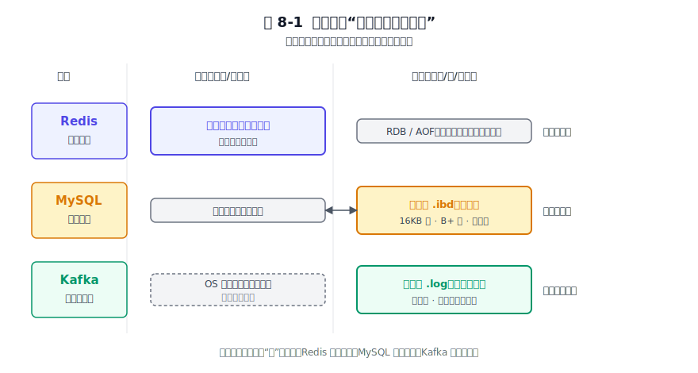
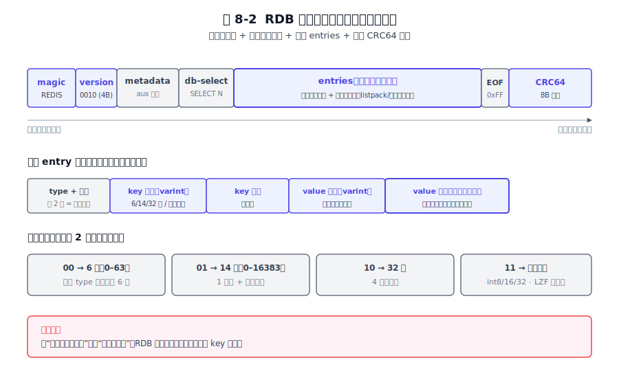
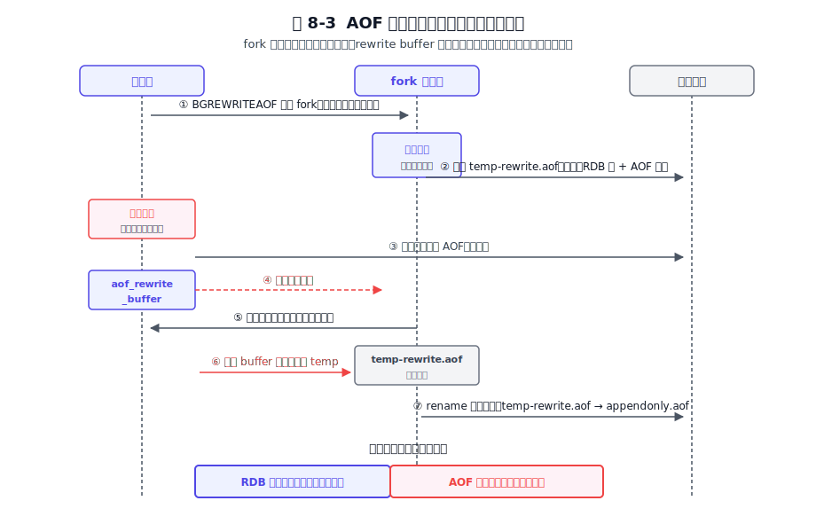
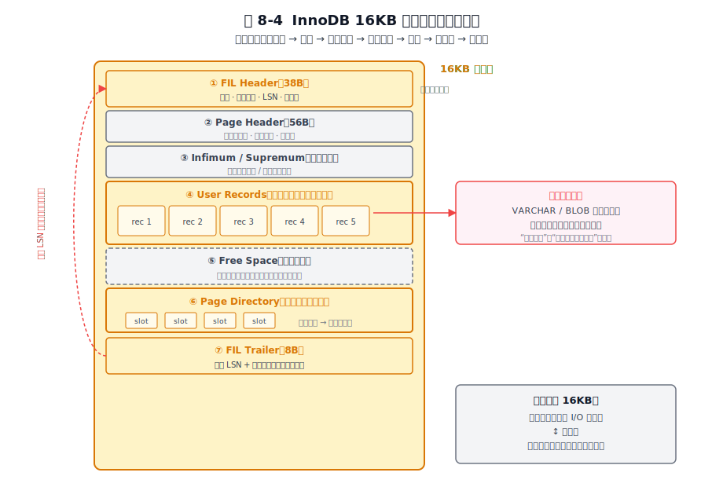
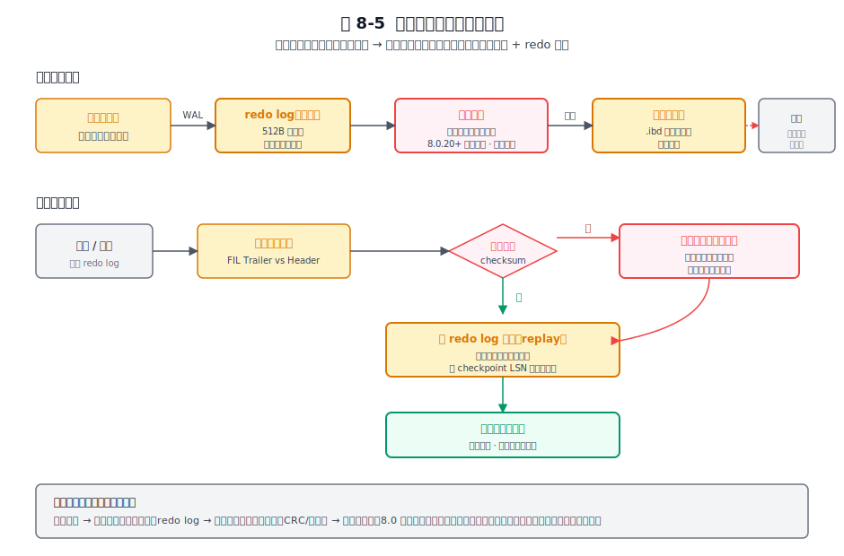
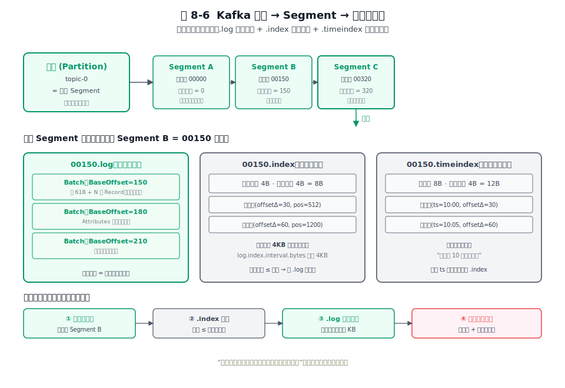
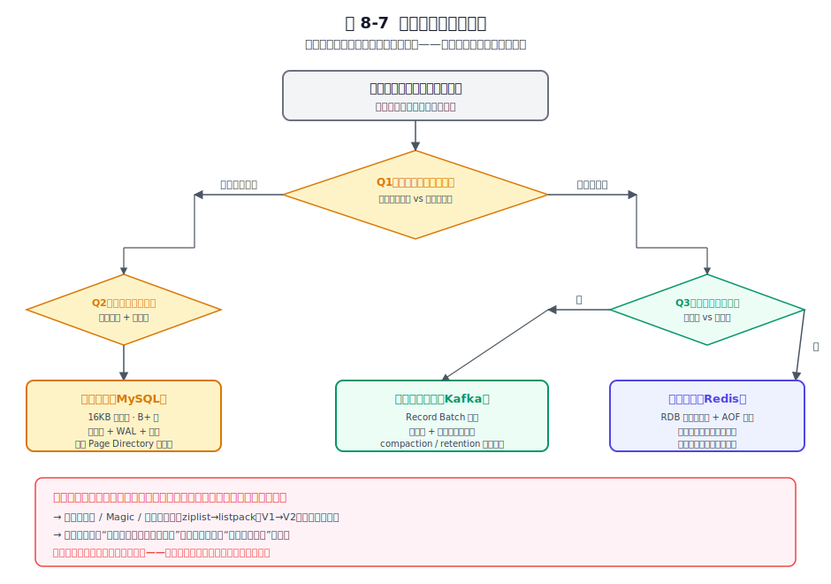
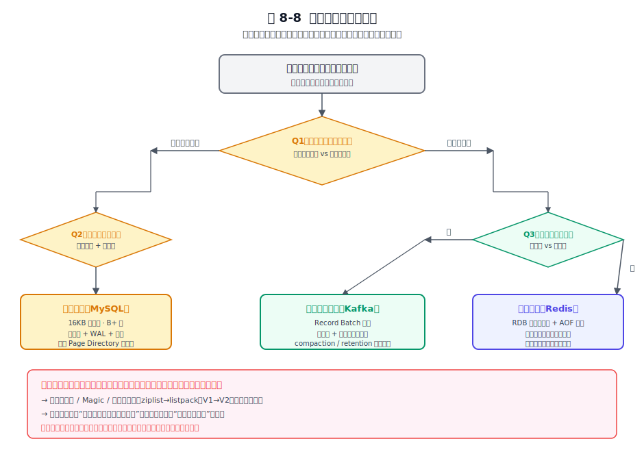

# 第 8 章 磁盘存储格式 — 文件结构的设计哲学

## 本章导读

哪天要给自己的系统设计一个文件格式，或者选一个序列化方案，会发现字节怎么摆是个关键的决定：按定长还是变长？加不加索引？要不要校验和？能不能向前兼容？这些选择一旦定下来、数据写进去了，再想改就要背负沉重的迁移代价。格式一旦发布，纠正成本极高。更关键的是，文件结构同时框定了软件的性能天花板、可靠性下限和演进自由度，摆错了，后面怎么优化都很难翻身。

本章不铺三种文件格式的字段表，只追同一个根问题：给定不同的访问模式与可靠性诉求，磁盘上的字节该被组织成什么样？为什么 Redis 用变长紧凑编码、MySQL 死守 16KB 页、Kafka 把整批消息放进一个 Batch？三种格式背后是三个不可兼得的优化目标。读完这章，下次设计文件格式时，手里会多一张"范式地图"。

我第一次自己定义文件格式时犯过一个低级错误：在头部放了一个版本号字段，但没想清楚向前兼容怎么做。三个月后要加一个新字段，发现解析器读到新版文件直接报错退出，因为旧代码不认识新格式。那次改版折腾了整整一周的迁移脚本。格式设计的教训只有一个：你永远不会只写一次。任何不预留扩展空间的格式，都是在给未来的自己挖坑。

## 8.1 问题的本质

### 8.1.1 为什么磁盘值得单独一章

磁盘与内存的工程差距，远不止延迟数字。内存的随机访问几乎免费，磁盘的随机访问要付出寻道与页粒度的代价。内存字节序由 CPU 决定且由进程独占，磁盘字节却要被不同进程、不同机器、在不同年份读出来，因此必须自描述。内存写失败进程就死了，磁盘写一半断电（partial write）留下的却是半坏的数据结构，下一次启动要面对它。再加上扇区原子性、对齐、字节序、CRC 校验这些内存世界根本不存在的约束，磁盘格式从一开始就活在另一套物理规则里。

更准确的说法是把存储格式当成一份契约：它把"内存里可变的数据结构"序列化成"磁盘上固定的、自描述的字节序列"。这份契约一旦发布就无法收回：明天发布的格式要能读懂今天写的文件，后天升级的代码要能读懂前天写的文件，向前向后兼容从此变成长期债务。第 4 章讲过分层思想是软件应对存储介质差异的通用手段，本章把这套思想用到了磁盘上那一层字节。

### 8.1.2 四个根本矛盾

把所有持久化系统面对的磁盘格式问题摊开，绕不开四个矛盾。后文它们各自的实现，就在这四个矛盾上做了不同的取舍。

第一是读写路径的不对称。写要快还是读要快，往往不能兼得。顺序追加让写达到磁盘带宽上限，但读时无法随机定位；定长页让读能 O(1) 跳到任意位置，但写时要付出页内整理与原地改的代价。

第二是空间与时间的置换。紧凑编码省 I/O 带宽和磁盘空间，但每次读写都要编解码吃 CPU；冗余字段与定长对齐让 CPU 解析省事，但浪费空间。压缩、变长整数、字典编码在一侧，对齐、定长字段、冗余校验在另一侧；CPU 越快、I/O 越慢，越值得为省 I/O 而烧 CPU。

第三是可靠性与性能的拉扯。校验和、双写、WAL、fsync 策略，每一项都在用性能换"断电后数据不坏"。多写一份冗余、多落一次盘、多记一条日志，都是在给某一类故障兜底：这种兜底要付性能代价，更要清楚它防的是哪类风险，否则就是无谓的写放大。

第四是定型与演进的矛盾。格式发布即定型，业务变了、字段要加、编码要换、旧 bug 要修，都得在原格式上做兼容设计。版本号、Magic、保留字段、编码切换、在线 DDL，都是为未来留的口子。

### 8.1.3 三款软件面对的共同问题与各自约束

Redis、MySQL、Kafka 都要回答同一组问题：基本 I/O 单元多大、写是追加还是原地改、怎么做崩溃恢复、怎么演进格式。但各自的约束差别很大，这直接把它们的格式推向了三种各自的骨架。

对 Redis 来说，内存才是数据的主存储，磁盘是保险：存盘只为崩溃后恢复，不为线上查询。对 MySQL 来说，磁盘才是数据的主存储，内存（缓冲池）只是磁盘页的缓存：线上事务随时要读写任意一行，格式必须支持随机定位与原地改。对 Kafka 来说，磁盘就是日志本体本身：消息只有一份真相躺在日志段里，读靠索引而非扫描，写永远追加。这三句是后面它们格式差异的源头。

图 8-1 三款软件"数据真正住在哪里"的内存/磁盘权重示意。

这张图把三款软件的内存与磁盘权重摆在同一坐标系下：Redis 内存占绝对主导，磁盘只是恢复副本；MySQL 磁盘是真相之源，内存缓冲池只是磁盘页的缓存副本；Kafka 磁盘就是数据本体，内核页缓存承担内存层角色。权重的倒置，正是后文它们格式选择不同的原因：为内存优化、为磁盘随机访问优化、为顺序追加优化的格式，自然就是三种样子。

> **关键数字**
> 
> **InnoDB 16KB 页：约 15/16 存数据，1/16 存页头+目录**。每页容纳约 2–200 行（依行宽而定）；页号即文件偏移，O(1) 随机定位是页式骨架的效率根基。
> 
> **Kafka RecordBatch V2：每批元数据约 61 字节**（V0 单条约 14 字节、V1 约 22 字节）。Batch 级压缩在同类消息上可达 2-6 倍（zstd，取决于消息内容相似度与压缩级别；文本类数据近上限，二进制/已压缩数据近下限），带宽与存储成本结构性下降。
> 
> **Redis RDB 压缩比：1GB 内存实例（字符串/列表型负载，典型场景）≈ 300–500MB 快照**。紧凑二进制编码（变长整数 + LZF）使磁盘文件远小于内存实际占用，恢复时快速灌入。

> **本书为什么没讲 LSM 树**：日志结构合并树（LSM-tree）是现代存储系统的另一个重要范式，RocksDB、LevelDB、HBase、TiDB 都在用它。它通过"内存写入 + 分层 SST 文件 + 后台合并（compaction）"实现高写入吞吐。本书这三款软件（Redis/MySQL/Kafka）无一采用 LSM 树作为默认引擎（MySQL 虽有 MyRocks 引擎但非默认），因此 LSM 范式不在本书深度覆盖范围内。读者若需要理解这一范式，Kleppmann《Designing Data-Intensive Applications》第 4 章是很好的起点。

## 8.2 Redis 的做法

### 8.2.1 定位先行：磁盘服务于内存

理解 Redis 的持久化格式，必须先理解它的定位。Redis 的真相数据始终在内存，RDB 与 AOF 扮演的角色是"崩溃后把内存重建出来"，而非"线上查询的来源"：线上查询永远走内存，磁盘文件在正常运行期间不参与任何读路径。

这一定位是决定性的。它意味着：格式可以很紧凑（加载是整文件一次性灌入，不需随机访问）；可以全量重写（只需保证最终内存正确，不需保持旧文件可读）；不必支持原地改写（内存改后，磁盘副本整个换掉即可）。Redis 能把磁盘格式做得这么简单，原因是它给磁盘提的要求只有"能恢复"，不需要"能查询"。这是 Redis 与 MySQL、Kafka 在格式设计上最根本的差异。

### 8.2.2 RDB：紧凑二进制快照

RDB（快照文件）是 Redis 的全量快照格式。它的设计目标是文件小、加载快，因此走的是紧凑二进制路线。

文件以一段固定魔数 `REDIS` 开头，紧跟 4 字节 ASCII 版本号。RDB 版本号随 Redis 主版本递增，但标识的是磁盘协议契约，与主版本不一一对应：7.0→v10，7.2→v11，7.4→v12（具体以 `src/rdb.h` 中的 `RDB_VERSION` 宏为准）。文件靠前缀自识别，不靠扩展名：任何一段字节流，只要开头是 `REDIS` 加合法版本号，加载器就认它。长度字段普遍采用变长整数编码（length-encoding），按实际大小自动选最省字节的表示。具体由类型字节的高两位做档位选择：`00` 走 6 位（0–63）、`01` 走 14 位（0–16383）、`10` 走 32 位定长、`11` 则是特殊编码（int8/int16/int32/LZF 压缩串等，把数值或压缩后的串直接塞进这几个字节）。小长度（0–63）只需 1 个字节就搞定，连额外长度字段都省了。每一处省下来的字节，乘以全量快照的规模，文件体积就能小很多。

注意：存储态编码与内存态编码是分离的。内存里 Hash 可能用 listpack 编码，也可能用 hashtable 编码，存盘时不照搬内存布局，改用统一的紧凑二进制序列化；加载后由加载器按当前阈值重新决定编码。这种分离让磁盘格式不绑死内存数据结构的演进：内存编码升级，磁盘格式不需要跟着变。

图 8-2 RDB 文件布局：magic / version / metadata / db-selector / entries / CRC64 footer。

整个文件分成几个清晰段落：开头魔数与版本号做自识别，metadata 区存辅助字段（如 Redis 版本、创建时间、repl-stream-db 等元信息），db-selector 标记接下来的数据属于哪个 db，entries 段是一条条键值记录，结尾是 8 字节 CRC64 校验。CRC64 放尾部而非头部，是因为校验要覆盖从 db-selector 到 EOF 的全部数据内容（不含文件头部的魔数和版本号），写完才能算出来；加载时先校验，失败直接拒绝加载，避免把损坏数据灌进内存。

RDB 用"加载快、文件小"换"可随机访问"。RDB 完全不支持按 key 定位，要恢复必须整体加载。这对 Redis 没有损失：反正加载就是一次性把内存建起来，没人会对 RDB 做点查。

还有一处体现"格式为演进服务"的细节：7.0 起用 listpack 取代了旧版的 ziplist。ziplist 的历史包袱是连锁更新：每个元素记的是前一个元素的长度（prev_entry_length），不是自己的长度，于是中间插入一个大元素会让 prev_entry_length 字段从 1 字节扩张为 5 字节，进而导致后面所有元素的同名字段都得跟着扩张，最坏情况退化为 O(n²) 的连锁更新。listpack 让每个元素只自记长度，连锁更新随之消失。格式定型后难免积累问题，演进机制（在这里是编码切换）就是用来补这些不足。

### 8.2.3 AOF：协议即文件

AOF（仅追加文件）走的是另一条路。它记录的是"写命令本身"：文件内容就是 RESP 协议文本。客户端发了什么命令，AOF 就原样落什么命令。**磁盘格式 = 线上协议**。这一等式决定了后续的一系列设计。

这个等式带来几个直接好处：AOF 损坏可以人工编辑修复（纯 AOF 模式下编辑器打开删掉坏掉的那条即可；混合持久化模式下 AOF 文件前段为二进制 RDB 数据，需先用 `redis-check-aof --fix` 工具修复），可用 redis-cli 直接回放一个 AOF 文件（相当于白得一套恢复工具），格式零额外定义成本（协议早就定义好了，存盘就是按协议写一遍）。这些好处之所以能拿到，是因为 Redis 没有为持久化单独发明一套格式，而是复用了已经存在的协议。

代价同样明显：体积大、回放慢。一条命令的文本表示远比 RDB 的紧凑二进制臃肿，恢复时要逐条解析、逐条执行，速度比直接灌二进制差一个量级。Redis 用 fsync 策略在"最多少"与"多慢"之间切档：always 每条命令都落盘（最安全最慢）、everysec 每秒落一次（默认）、no 让操作系统决定（最快但崩溃可能丢更多）。同一种格式下，用 fsync 频率换可靠性档位。

AOF 还有一个绕不开的难题：随着命令不断追加，文件只会越来越大，里面会堆积大量被覆盖、被删除的过时命令：比如一百万次 INCR 同一个 key，真正有效的只有最后一次。Redis 的解法是重写（rewrite）。重写的关键取舍是：**fork 子进程从当前内存直接生成新 AOF**。这一步绕开了"解析越积越大的日志"这个坑：重写复杂度只跟当前内存数据量有关，跟 AOF 已经积累了多少无关。

但 fork 那一刻之后，父进程还在处理新写命令，这些命令既不能丢也不能让重写卡住。Redis 的解法是双缓冲：重写期间的新写命令进 aof_rewrite_buffer，重写完成的子进程产出新文件后，父进程把 buffer 里的命令原子追加到新文件尾部，再做 rename 替换。这是"追加日志如何做在线 compaction"的经典手法。

### 8.2.4 混合持久化：RDB 头加 AOF 尾

Redis 4.0 引入 `aof-use-rdb-preamble` 开关（5.x–6.x 默认 yes，即混合持久化）；7.0 起 Multi-Part AOF 改造后该配置项已移除，base 文件始终为 RDB 格式，效果等同混合持久化常开。

Multi-Part AOF 的真正变化不在"混合"，而在文件结构的重构。7.0 之前，AOF 是单个大文件，重写靠 rename 替换——旧文件删掉、新文件顶上。这个设计在重写中断时可能留下损坏的旧文件。7.0 把它拆成了一个目录，里面由清单文件（manifest）统一管理三类文件：至多一个基础文件（base，RDB 格式）、零或多个增量文件（incr，AOF 命令）、以及重写后被标记为历史（history）待删的旧文件。重写不再是 rename 替换，而是生成新 base + 新 manifest 的原子切换。这和 git 的 commit 指针切换是同一种思路：数据不动，指针换。这个结构变化让 AOF 的重写从"危险的单文件替换"变成了"安全的多文件原子切换"，同时让增量文件可以单独轮转清理。

文件头是 RDB 全量快照，尾部接 AOF 增量命令。意图是取 RDB 的"加载快"（大头走二进制快速灌入）加上 AOF 的"少丢"（尾部增量精确回放自上次 RDB 之后的所有写命令）。一次重启，先用 RDB 快速把内存主体建起来，再回放 AOF 尾部的少量增量，兼顾恢复速度与数据完整。

图 8-3 AOF 重写 + 混合持久化的双缓冲协作时序。

图中可以看到完整时序：父进程 fork 出子进程，子进程基于当前内存生成 RDB 全量写到新文件；期间父进程照常服务，新命令同时进 AOF 当前文件与 aof_rewrite_buffer；子进程写完后通知父进程，父进程把 buffer 里的增量命令追加到新文件尾部（混合格式的 AOF 段），再 rename 原子替换旧文件。整个过程线上服务不中断。

RDB 与 AOF 是可以拼接的积木：大头走快格式，尾巴走准格式，组合效果在多数生产场景中优于纯 RDB 或纯 AOF。Redis 7.x 出厂默认持久化仍是 RDB-only（`appendonly no`，靠 `save` 规则周期性 BGSAVE）；生产环境追求"少丢"才会显式打开 AOF（everysec），混合格式在 7.0 后随 AOF 重写默认产出。这套组合才是社区推荐的生产配置。

## 8.3 MySQL 的做法

### 8.3.1 定位先行：磁盘是家，内存是缓存

InnoDB 的定位与 Redis 正好倒过来。对 InnoDB 来说，磁盘上的表空间文件（系统表空间 ibdata 或独立 .ibd）才是数据的主存储，缓冲池只是磁盘页的缓存副本：命中率高的页留在内存，未命中的按需从磁盘读进来。这倒置是理解 InnoDB 所有格式设计的前提。

它意味着格式必须支持页级随机读写：任意一页要能被独立读、独立写、独立淘汰，不能像 RDB 那样只能整体加载。必须支持原地修改（in-place update）：一行被 UPDATE，对应的那一页就被原地改写，不能像 Kafka 那样只追加。必须保证页的原子性：一次 UPDATE 写到一半断电，那一页不能处于半新半旧的撕裂状态，否则下次启动整个数据库都不可信。这三条要求叠加，把 InnoDB 的格式钉在了"定长页 + 原地改 + WAL"这套骨架上。

### 8.3.2 四层骨架：表空间 → 段 → 区 → 页

InnoDB 的存储从大到小是四层：表空间、段（segment）、区（extent）、页。一个区由 64 个连续页组成（默认页大小时为 1MB），段以区为单位申请空间，页只在区内部连续。表空间的页号就是文件内偏移的索引：第 N 号页的物理位置就是 `N × 16KB`，O(1) 定位，不需要任何额外索引结构。这个"页号即偏移"的设计是定长页骨架能做随机访问的根本。

段（segment）是逻辑聚合单位。一棵 B+ 树索引至少有两个段：叶子段与非叶子段，分别装叶子页与非叶子页；服务于事务的回滚段（undo segment）则单独成段。这里做了简化：回滚段存的是回滚日志（undo log），与索引的叶子/非叶子段不是同级概念，但作为空间预留单位它们都叫"段"。段为空间预留：给同类型的页预留连续空间，减少随机分配的碎片。一张大表的索引在物理上是按段聚拢的页簇，对顺序扫描和空间回收都更友好。

页与页之间靠双向链表串联：同类型的页用 FIL Header 里的前后指针串成双向链表，空闲页一链、数据页一链、undo 页一链。链表是页式存储做空间管理的通用工具：分配、回收、顺序遍历都建立在链表之上，这也是第 4 章分层存储思想在磁盘内的微观体现。

关键取舍落在那个魔法数字 16KB 上。页越大，预读一次拿到的数据越多，顺序扫描越快；页越小，缓冲池里能放下的不同页越多，缓存命中率越高。答案取决于"对这台机器的磁盘、这个负载的访问模式"。MySQL 允许通过 `innodb_page_size` 配置页大小（4K/8K/16K/32K/64K），但默认值 16KB 几乎在生产中不被改动：格式定型后再撼动代价巨大，缓冲池、I/O 调度、操作系统页缓存全部围绕 16KB 调优。

### 8.3.3 数据页内布局：把一行行记录塞进 16KB

知道了页是 16KB 之后，下一个问题是这 16KB 内部怎么布局。InnoDB 的数据页内部分成七段，从上到下依次是：FIL Header（含页号、前后指针、LSN、页类型）、Page Header（记录页内统计信息）、Infimum 与 Supremum 两条虚拟记录（界定这一页的最小与最大记录）、User Records（真正按主键有序存放的用户记录）、Free Space（剩余空间）、Page Directory（稀疏槽）、FIL Trailer（存 LSN 与校验和），前后各放一个 LSN 是为了让恢复时能验证页是否完整写入。

图 8-4 InnoDB 16KB 数据页内部七段布局。

七段布局里最值得看的是 Page Directory。它是页内的稀疏索引：每隔几条记录（默认每 4–8 条）建一个槽，槽里记的是那条"被拥有"的记录在页内偏移量（记录之间用前后指针串成有序链表，槽是链表上的稀疏采样点）。页内查找时，先在槽数组里二分定位到不大于目标的最大槽，再从该槽对应的记录顺着链表顺序扫几条。这一招用很少空间（几十个槽）把页内查找从 O(n) 降到 O(log n) 加几次顺序比较，是在定长页内自建小索引，跟 Kafka 用的稀疏索引同一种思想，尺度小了一个数量级。

行格式（row format）层面，InnoDB 默认用 Dynamic 行格式（5.7 起为默认，8.0 沿用，由 `innodb_default_row_format` 控制）。两个设计要点。一是变长字段长度逆序存放，记录头里先存最后一个变长字段的长度，倒着读，便于解析与崩溃恢复时边读边定位字段边界。二是大字段（VARCHAR、BLOB、TEXT）超过约页大小的一半时溢出到独立溢出页，行内只留一个 20 字节指针（区别于旧版 COMPACT 会先把 768 字节前缀留行内再外挂指针）。这是"页内紧凑"与"大对象不拖累整页"的折中：大对象不该把整页占满、让其他记录无处安放，更不该跨页撕裂导致一次读要拉好几页。Dynamic 让 B+ 树的非叶子节点更紧凑，单页能装下更多键、树更矮，同样是用格式演进解决历史包袱。

### 8.3.4 重做日志 + 双写：让"原地改"不惧断电

原地改页最大的风险是断电导致的半写（partial write）。一个 16KB 页，操作系统可能只写了前 4KB 或前 8KB 就断电，剩下的没写：页结构损坏，Page Directory 与 User Records 对不上，校验和不过。更糟的是重做日志假设页本身完整：重做日志记录的是"对完整页做的物理修改"，重做的前提是页已处于某个一致状态。半写的页连"完整"这一关都没过，重做日志救不了它。

InnoDB 的解法是双写缓冲（doublewrite buffer）。脏页刷盘前，先顺序写到一段连续的双写缓冲，再写到正式位置；恢复时若某页校验和不对，从双写缓冲取回那个页的完整副本，再用重做日志重做到最新。双写缓冲早期放在共享表空间的连续区，8.0.20 起改为独立 doublewrite 文件，但其"连续顺序写、多写一份"的本质不变。多写的代价是写放大：同一份脏页要刷两次盘，但因为双写缓冲是连续的顺序写，对性能影响有限。

重做日志本身是循环日志，按 512 字节块对齐。512 字节匹配传统磁盘扇区的原子写粒度：一次 512 字节的写要么完整要么不发生，不会留下半个扇区的撕裂。先写重做日志（这就是 WAL，预写日志），再改页；崩溃后用重做日志把页重做到一致状态。8.0.30 之前重做日志由固定数量、固定大小的文件循环写；8.0.30 起改为由 `innodb_redo_log_capacity` 统一管控的动态容量（默认 100MB），但"循环写 + 512B 块对齐"的物理骨架没变。重做日志是物理到页、逻辑到操作的混合日志，记录的是"对哪个页偏移做了什么修改"，既不像纯物理日志那样体积大（每个字节改动都记一条），又不像纯逻辑日志那样难以幂等重做（重做同一个操作可能产生不同结果）。物理逻辑混合日志在"日志体积"与"恢复时能否幂等重做"之间取了折中。

图 8-5 脏页刷盘流程：双写缓冲 → 正式页，配合重做日志的崩溃恢复路径。

图中可见完整的双保险机制：正常写路径上重做日志先落盘（WAL），脏页先写双写缓冲再写正式位置；崩溃恢复路径上先扫描重做日志，对每条记录检查目标页 LSN，页未损坏且 LSN 落后则重做，页损坏则从双写缓冲取完整副本再重做。两条路径都指向同一个目标，即页完整性：双写缓冲保证页不撕裂，重做日志保证页内容最新。

MySQL 8.0 在硬件能力提升后给了选择：当底层存储支持原子写（如某些 NVM 设备或带原子写功能的 SSD）时，可以关掉双写缓冲，减少写放大。每一层可靠性机制都是为某类故障加的冗余，当那类故障被下层硬件消灭时，软件冗余就可以撤下来（8.6.4 原则四会再展开）。

## 8.4 Kafka 的做法

### 8.4.1 定位先行：磁盘就是日志本体

Kafka 的定位又反过来了。对 Kafka 来说，消息只有一份真相，就躺在磁盘的日志段里。它不像 MySQL 那样自己管缓冲池，页缓存交给操作系统，Kafka 只把字节往日志文件里追加，读时直接从页缓存或磁盘顺序读。这种"磁盘即本体"的定位把格式设计的约束收得很紧，因此格式要满足三条硬要求：纯追加写（日志段只在尾部追加，旧字节不再改写）、按偏移量（offset）随机读（靠索引而非扫描，定位要快）、成批压缩（带宽稀缺，一批相近消息压在一起能省下一个数量级的存储与传输成本）。三条叠加，于是 Kafka 的骨架就是"日志段 + 稀疏索引 + Record Batch"这套。

### 8.4.2 Log Segment：三件套

Kafka 的分区在磁盘上是一串日志段（segment）。每个日志段是一组三个文件：`.log` 存消息数据本体、`.index` 存偏移量索引、`.timeindex` 存时间戳索引。三件套是一组：删日志段时三个文件一起删，压实（compaction）时三个文件一起重写，生命周期完全一致。

文件名是该日志段的起始偏移量。比如 `00000000000000000000.log`、`00000000000000123456.log`，文件名本身就是这一段消息的最小偏移量。这个设计省了一层结构：文件系统目录就相当于一层稀疏索引。按偏移量定位一条消息时，先把目录里的文件名排序，二分找到起始偏移量不大于目标的最大那个日志段，再进 `.log` 内部细找。文件系统的目录就是这个分区的第一层索引，零额外开销。

图 8-6 分区 → 日志段 → 三件套文件的目录与内部结构。

图中可以看到一个分区的目录展开成多个日志段，每个日志段三个文件并排。`.log` 内部是连续的 Record Batch，每个 Batch 由头部和若干条 Record 组成；`.index` 是定长条目的偏移量索引（每条 8 字节：相对偏移量 4 + 物理位置 4）；`.timeindex` 是时间戳索引（每条 12 字节：时间戳 8 + 相对偏移量 4）。三个文件用同一个起始偏移量对齐，查找时互相配合。

日志段的切分粒度是需要权衡的参数。切得太小，文件数量多，压实时要处理的日志段多，元数据开销大；切得太大，单个文件巨大，按时间回溯的精度下降（一个日志段内时间戳跨度大，时间索引定位后还要扫一大段）。Kafka 的默认是按大小（`log.segment.bytes` = 1GB）或时间（`log.roll.hours` = 7 天）任一条件触发切分。这个粒度还跟保留策略（retention）与压实（compaction）直接相关：删除旧数据的最小单位就是一整个日志段，所以日志段大小也决定了清理的颗粒度。

### 8.4.3 RecordBatch V2：把一批消息当成一个存储单元

Kafka 消息格式的关键变化是 V2 引入的 RecordBatch。在 V0、V1 时代，最小存储单元是单条消息（Message），每条都自带一份完整元数据：偏移量、时间戳、key 长度、value 长度、CRC、属性。一百万条消息就有一百万份重复元数据，既占空间，又把压缩效果压下去：压缩算法擅长处理相似数据聚在一起，但单条消息的元数据把每条记录隔开了。

V2 把这个单位从单条换成了 Batch（批）。一个 Batch 头部固定 61 字节，存 BaseOffset、PartitionLeaderEpoch、ProducerId、ProducerEpoch、BaseSequence、CRC、Attributes、记录数等整批共享的元数据。Batch 内每条 Record 只存相对量：时间戳差值（相对 Batch 的 FirstTimestamp）、偏移量差值（相对 BaseOffset）、key 与 value 的变长字段。绝大多数差值只要一两个字节就够，单条消息的元数据开销从 V1 的几十字节压到个位数。

这个变化最大的好处是让"压缩在 Batch 边界做"成立：一批时间相近、内容相似的消息聚在一起，压缩算法能找到大量重复模式，V2 的 Batch 级压缩相对 V1 的单条级压缩有结构性提升（具体压缩比取决于负载特征与所选压缩算法；Apache 官方未给出精确对比基准，工程体感是 V2 明显更省带宽）。

代价也有：消费者要解整个 Batch 才能读单条。但 Kafka 的消费本来就是成批的：消费者拉一批处理一批，从来不会真去"读一条"。**让存储单元对齐访问单元**，这个代价被工作模式吸收。

还有一处常被忽略的设计：ProducerId、ProducerEpoch、BaseSequence 直接进了存储格式本身。这三个字段是幂等生产与事务的根基，这意味着幂等与事务不只是协议层的事，也是存储格式问题：Broker 重启后要从日志里恢复这些状态，格式不支持就存不下来。把协议状态写进存储格式，让"重启后能续上"成为磁盘层面的保证。

### 8.4.4 双索引：偏移量索引 + 时间戳索引

Kafka 的随机读靠两套索引：偏移量索引和时间戳索引。两套都是稀疏索引：不是给每条消息都建一条索引项。

偏移量索引的条目是 8 字节定长：4 字节相对偏移量（相对日志段起始偏移量）加 4 字节物理位置（在 `.log` 文件中的字节偏移），由参数 `log.index.interval.bytes` 控制，默认每 4KB 落一个条目。查找时，先用文件名二分定位日志段，再在 `.index` 内二分定位到不大于目标的最大偏移量条目，得到一个物理位置，然后从那个位置顺序扫描 `.log` 几 KB 找到精确偏移量。典型的"粗索引 + 顺序扫"组合。

时间戳索引服务于按时间消费的场景，比如"从昨天上午 10 点开始消费"。条目是 12 字节：8 字节时间戳加 4 字节相对偏移量。查找逻辑是先用时间戳索引找到对应的相对偏移量，再用这个偏移量去走偏移量索引，最后落到物理位置。两套索引协作，让"按时间"和"按偏移量"两种访问方式都快。

不用稠密索引是因为它体积跟数据量等比例增长，放不进内存，虽然能让查找严格 O(log n)。稀疏索引牺牲一点点顺序扫描，换来索引体积小到能常驻内存：一个 TB 的 Topic 索引可能只有几 GB，热部分全在页缓存里。这与 MySQL 的 Page Directory 是同一种思想在不同尺度上的复现。

### 8.4.5 格式演进 V0 → V1 → V2

从 V0 到 V2，每代演进都是为上一代最贵的操作买单。V0 以单条消息为存储单元，没有时间戳；V1 加了时间戳但仍是单条粒度，元数据冗余让压缩依然低效。V2 把存储单元从单条换成 Batch，引入增量编码，并把 ProducerId/Epoch/BaseSequence 加进来支持幂等与事务。每代格式都针对上一代最贵的操作做改进。

演进机制靠 Magic 字段做版本号。Magic 是消息格式里的一个字节，标识这条消息是哪个版本。老 Broker 收到不认识的 Magic 直接拒绝；消费者按 Magic 选不同的解析路径。这种"格式自带版本号"的做法，是支持混合版本部署与平滑升级的标配：跟 RDB 的 version、InnoDB 的页类型字段是同一类机制。

下面用一张表对比三代格式的字段与演进动机。

表 8-1 Kafka 消息格式 V0 / V1 / V2 的字段对比与演进动机。

| 维度 | V0（原始单消息） | V1（加时间戳） | V2（RecordBatch） |
|------|------------------|----------------|-------------------|
| 存储单元 | 单条 Message | 单条 Message | Record Batch（含多条 Record） |
| 时间戳 | 无 | 每条 8 字节 | 每条存与 BaseTimestamp 的差值 |
| 偏移量 | 每条绝对偏移量 | 每条绝对偏移量 | Batch 存 BaseOffset，每条存差值 |
| CRC | 每条一条 | 每条一条 | Batch 级一条 |
| 压缩 | 单条级别，压缩比低 | 单条级别，压缩比低 | Batch 级别，压缩比高 |
| 幂等/事务 | 不支持 | 不支持 | 支持（ProducerId/Epoch/BaseSequence） |
| 演进动机 | —— | 为"想知道时间得扫全文件"买单 | 为"元数据冗余 + 压缩低效"买单 |

看演进动机这一列，每一代演进本身都有代价：V1 解决了时间问题却留下元数据冗余，V2 解决了冗余却引入 Batch 边界，格式演进让某些操作变便宜的同时，另一些变贵了。

### 8.4.6 Tiered Storage：从本地日志到分层存储

Kafka 3.9 起正式 GA 的 Tiered Storage（KIP-405），是 3.x 系列最重要的存储架构变化之一。它修正了 8.4.1 的判断："磁盘就是日志本体。" 改为：**日志本体横跨本地磁盘和远程对象存储，热数据在本地，冷数据可卸载到远端**。

机制核心是 RemoteStorageManager：一个统一接口，定义日志段的上传、下载和删除。当一个日志段被关闭（达到大小或时间阈值）后，Kafka 异步把它上传到 S3、GCS 或 Azure Blob 等对象存储，本地可以保留也可以丢弃。消费者或 Follower 读取时，先尝试本地磁盘，未命中则从远程拉取并缓存到本地（fetch-through 语义）。这里的设计要点是：**日志段格式完全不变**。`.log`、`.index`、`.timeindex` 三件套在远程和本地是同一套文件结构，存储格式与存储介质解耦。上层 API 和复制层感知不到这层变化：Log 抽象把"数据在哪"这个细节封装在存储层内部，第 5 章讲的"分层让可替换成为可能"在这里正好是一个现成的例子。

这一设计对本书几个核心论点产生了直接影响。第一，"磁盘就是日志本体"需要修正：真相之源仍是日志 Segment，但它的物理位置从"必须在本地"变成了"在本地或远程，格式一致"。第二，PageCache 假设被改写：冷数据不经过 PageCache（甚至不在本地磁盘），读远程段的延迟从毫秒级变为数十毫秒级（对象存储 GET 的网络往返）。第三，"存储格式是访问模式的镜像"这条规律多了一个新证据：Tiered Storage 改的只是放置策略，格式一字未动，因为冷热数据的访问模式不同，冷数据换个位置放就够了，用不着另起一套格式。

图 8-7 Kafka Tiered Storage 日志段生命周期：本地热段关闭后异步上传到远程对象存储，消费者和 Follower 读取时先尝试本地、未命中则回源远程。

## 8.5 横向对比

把三款软件的具体做法摆到同一张表上对比，看每种范式各为谁优化、各自又付了什么代价。

### 8.5.1 三栏对比表

表 8-2 三款软件在八个维度上的范式对比。

| 维度 | Redis | MySQL | Kafka |
|------|-------|-------|-------|
| 数据的"家" | 内存 | 磁盘 | 磁盘（日志本体） |
| 基本 I/O 单元 | 单条命令 / 整个文件 | 16KB 定长页 | Record Batch（变长） |
| 写方式 | 全量重写（RDB）/ 追加（AOF） | 原地改页 + WAL | 纯追加，永不改写 |
| 读方式 | 加载到内存后随机访问 | B+ 树随机定位 | 稀疏索引 + 顺序扫描 |
| 索引形态 | 无（内存里现算） | B+ 树 + 页内 Page Directory | 稀疏偏移量 / 时间戳索引 |
| 崩溃恢复 | RDB 全量 + AOF 增量回放 | 重做日志重做 + 双写修页 | 日志即真相，重放即可 |
| 演进机制 | RDB 版本号 + 编码升级 | 页类型 / 格式位 + 在线 DDL | Magic 版本号 |
| 校验 | RDB 尾部 CRC64 | 页校验和 + 双写 | Batch 级 CRC |

每一行都是一次明确的取舍。读方式这一行差异最直观：Redis 加载后才随机访问，MySQL 用 B+ 树随机定位，Kafka 靠稀疏索引加顺序扫描：三种读方式直接对应三种格式骨架。校验这一行则反映出它们对"损坏粒度"的不同假设：Redis 校验整个文件，MySQL 校验单页，Kafka 校验单批。

### 8.5.2 解读：三种范式各为谁优化

三种格式背后是三种不同的优化目标。

快照范式（Redis）为"快速整体恢复"优化。RDB 把整内存序列化成一个紧凑二进制，加载时一次性灌入；AOF 把写命令追加成协议文本，可逐条回放也可整体重写。这套格式的代价是不能在线随机查询磁盘：磁盘文件只在启动恢复时被读一次，运行期间不参与读路径。Redis 接受这个代价，因为它的查询永远走内存。

页式范式（MySQL）为"事务安全的随机读写"优化。16KB 定长页让任意一页能被 O(1) 定位、独立读写、独立淘汰；B+ 树在页之上建立多级索引，支持点查与范围扫；重做日志与双写缓冲保证原地改的页在断电后依然完整且最新。代价是写放大：双写缓冲让脏页刷两次盘，重做日志让每次修改都多记一条日志。另一项代价是定长页的空间浪费，一行 100 字节的记录也要占一个槽，半空的页在所难免。

Kafka 的追加日志做法为"高吞吐的顺序写 + 成批压缩"优化。日志段只追加不改写，磁盘顺序写能吃满带宽。Record Batch 把一批消息当成一个存储单元，压缩在 Batch 边界做，压缩比约 10:1。稀疏索引则小到能常驻内存，按偏移量随机读只需一次二分加几 KB 顺序扫。代价是不能原地改写：删数据只能靠 retention（保留策略）整段删除，去重只能靠 compaction（压实）重写日志段，单条消息的"修改"在 Kafka 里根本不存在这个操作。

### 8.5.3 为什么三款软件选择如此不同

它们选择如此不同，各家的核心场景不同，格式自然不同。

Redis 的场景是"内存数据别丢"：数据天生在内存，磁盘只是为了恢复，格式当然为"快速恢复"优化。到了 MySQL，场景换成"线上事务随时读写"，数据必须随时可改可查，随机读写与事务安全把格式钉死在页式骨架上；Kafka 再换一个场景，"海量消息流式进出"，消息进来就追加、消费就顺序读，"顺序写 + 成批压缩"是满足高吞吐要求的主要做法。

贯穿三款软件的规律是：**存储格式是访问模式的镜像**。先确定"数据怎么被读、怎么被写、读多还是写多、要不要随机定位"，格式骨架几乎就由这些约束决定了。假设 Kafka 用页式格式，每条消息进来都要先按 16KB 页定位、再原地改那一页，顺序追加的带宽红利立刻没了，成批压缩也无处下手，它的吞吐天花板会被这个错配直接打掉。

这个规律也解释了为什么它们在"基本 I/O 单元"这一行差异最大：Redis 是整个文件（一次性灌入）、MySQL 是 16KB 定长页（随机读写单元）、Kafka 是变长 Record Batch（消费单元）。三种 I/O 单元对应三种访问模式，各有更适合自己场景的那一种。

## 8.6 架构启示

存储格式是软件里最难推翻的决策，三款软件的选择里藏着五条能直接用的判据。

### 8.6.1 原则一：存储单元要对齐访问单元

Kafka 的 Record Batch 等于消费单元（消费者拉一批处理一批），MySQL 的 16KB 页就是它的 I/O 单元（一次磁盘读一个页，缓冲池按页缓存），Redis 的 AOF 命令也是一条一份记录，等于协议回放单元。它们都做对了同一件事：磁盘上的最小存储单元，跟业务上的最小访问单元对齐。反过来想就知道代价：Kafka 若以单条消息为存储单元，消费者读一批要解 N 次头、做 N 次 CRC，开销翻倍；MySQL 一旦放弃定长页，预读和缓存就失去了天然粒度，缓冲池的管理复杂度直接失控；Redis 若给 AOF 命令加包装，恢复时多一道解析工序，得不偿失。

一句话：**让磁盘上的最小存储单元，等于业务上的最小访问单元，能省掉一个数量级的无效 I/O。** 设计存储格式时这是第一个该问的问题：你的数据被批量读还是单条读？被整体加载还是随机点查？答案决定存储单元该多大。

### 8.6.2 原则二：定长 vs 变长是写读路径的根本选择

定长与变长是写读路径的根本分叉。

定长（MySQL 页）利于随机定位与原地改：页号即偏移，O(1) 跳过去就能改。代价是空间浪费与对齐开销，半空的页、补齐的字段都在烧空间。变长（Redis 编码、Kafka Record Batch）利于紧凑与压缩：每条记录只占自己实际需要的字节，相似记录聚在一起压缩比高。代价是不能原地改：记录变长意味着位置会变，改一条就得挪后面所有记录，所以只能追加写加重写。

选择定长还是变长，是在回答一个问题：我会不会原地改这块数据？会原地改，就定长：MySQL 的行会被 UPDATE，所以页必须定长可原地改；不会原地改，就变长：Kafka 的消息从不改写，所以可以放心用变长 Batch 把空间压到最紧。Redis 内存里两种编码都存在（listpack 紧凑变长、hashtable 定长桶），就是因为不同访问模式下最优编码不同。

这条规律的好处是它把一个看似复杂的格式选型问题，简化成了一个二选一的判断。你设计一个新存储，先问"数据会被原地改吗"，答案基本能确定格式骨架的方向。

### 8.6.3 原则三：索引越稀疏，越要靠顺序扫描补回来

它们在索引上不约而同用了同一种手法：稀疏索引加局部顺序扫描。MySQL 的 Page Directory 是页内的稀疏槽：每隔几条记录一个槽，二分定位到槽再顺序扫几条。Kafka 的偏移量索引是日志段级的稀疏索引：每 4KB 才落一个条目，二分定位到条目再顺序扫几 KB。Redis 加载完成后内存里的渐进式结构也类似，Skiplist、哈希表都不是稠密索引，访问都伴随局部遍历。

都选稀疏，是因为稠密索引的体积跟数据量等比例增长，放不进内存。稀疏索引牺牲一点查找精度，把索引体积压到能常驻内存的程度。被牺牲的那一点精度，靠"局部顺序扫描"补回来：反正要找的记录就在附近几条或几 KB 之内，顺序扫成本极低。CPU 与内存的发展让"扫一小段"越来越便宜，"索引常驻内存"越来越值钱，稀疏索引的相对优势只会越来越大。

这条思路可以概括为：**稀疏索引用"少量顺序扫描"换"索引小到能常驻内存"。** 设计索引时，先想清楚索引能不能放进内存，放不进就考虑稀疏化：这一招在大多数场景下比追求严格 O(log n) 更划算。

### 8.6.4 原则四：可靠性要付性能代价，但要知道防的是哪类故障

每加一层可靠性机制，都对应一类故障，也对应一份性能代价。

MySQL 的双写缓冲防止断电导致 16KB 页半写，保证页完整性，代价是同一份脏页刷两次盘（写放大）。重做日志保证已提交事务的修改在页未刷盘时也能重放回来，代价是每次修改多记一条日志。CRC 校验用来检测磁盘静默损坏（bit rot），代价是每次读写多算一次校验和。

Kafka 的 Batch 级 CRC 保证整批消息完整，Redis 的 RDB 尾部 CRC64 保证快照文件完整，原理都一样。理解每一层机制防的是哪类故障，才能判断什么时候可以撤。MySQL 8.0 在底层存储支持原子写时允许关掉双写缓冲：因为"断电导致页半写"这类故障已被硬件消灭，软件冗余可以撤下来。但重做日志不能撤：原子写解决不了"已提交事务页未落盘"的问题，那是另一类故障。

这条原则给实践者的启示是：加可靠性机制前先问"我针对的是哪类故障，这类故障下层有没有更便宜的解法"。盲目堆冗余只会换来无谓的写放大；精准识别故障并让下层承担，写放大就降得下来。

### 8.6.5 原则五：格式一旦发布就是长期债务

最后一条回到 8.1.2 的第四个张力。存储格式发布即定型，业务会变、字段要加、编码要换、旧 bug 要修，全都要在原格式上做兼容。版本号、保留字段、Magic、编码切换，都是为未来留的口子。

Redis 的 listpack 取代 ziplist、Kafka 的 V0 到 V1 到 V2、InnoDB 的 Compact 到 Dynamic 行格式，都是格式演进的实例。每一次演进都伴随版本号、兼容策略、新旧代码共存期、灰度迁移，这些都是"未来的税"。RDB 的 version 字段、Kafka 的 Magic 字段、InnoDB 的页类型字段，看起来只是几个字节，背后对应的是"五年后还能读懂今天的文件"这件事。

核心教训：**存储格式要为"五年后还要读今天的文件"设计。** 这条原则的反面例子不少：很多自研系统第一版格式图省事，没留版本号、没留保留字段，几年后业务一变，要么写迁移脚本痛苦地转一遍，要么干脆弃用老数据。在格式设计阶段多花一周想清楚兼容性，能为未来省下几个月的迁移债。

### 8.6.6 给实践者的三问

把五条原则落到实践，面对自己的存储设计先回答三个问题。第一问，数据会被原地改吗？这是最根本的分叉。会原地改，选定长页骨架（像 MySQL，页号即偏移，原地改加 WAL）。不会原地改，进下一问。第二问，访问是随机定位要快，还是批量流式进出？随机定位要快，走定长页加索引（B+ 树加页内稀疏槽）。批量流式进出且写远多于点查，走追加日志骨架（像 Kafka，纯追加加稀疏索引）。既不原地改也不批量流式、只需要崩溃后整体重建，走快照骨架（像 Redis 的 RDB 加 AOF）。其中"怕丢一小段还是怕全量重建慢"决定快照与增量日志的组合方式。怕丢，选快照加增量日志（Redis 的混合持久化）；怕恢复慢，就提高快照频率、压缩增量。第三问，格式五年后还能被新代码读懂吗？能，靠预留版本号、Magic 与编码切换位（ziplist→listpack、V1→V2、页类型位）来保证。不能，就现在补上。

图 8-8 存储格式设计决策树：从访问模式推到格式骨架。

这张决策树把三问可视化：第一问"会不会原地改"分出定长页与追加两条主干；第二问在"随机定位要快"还是"批量流式进出"之间进一步细分，把定长页引向 MySQL 的页式范式、把追加引向 Kafka 的日志范式或 Redis 的快照范式；第三问"五年后是否可读"横跨所有路径，决定版本号与兼容性投资。三问问完，格式骨架几乎自动浮现。

## 8.7 小结

三种格式的差异源于访问模式的不同。Redis 拿磁盘当内存的保险副本，为的是崩溃后快速整体重建；MySQL 把数据行放进 16KB 定长页，为的是事务安全的原地改与随机读写，双写和重做日志是它给断电加的保险；Kafka 永远只追加，靠 Record Batch 压一批、稀疏索引定位，把吞吐拉满。代价各自不同：Redis 因为不用原地改，省下了页式那套复杂度；MySQL 要付出全量重建的恢复时间；Kafka 则干脆连"原地改"这个选项都不要了。

存储格式的选择会长期绑住一个系统：页式再调优也追不上追加日志的写吞吐，追加日志再优化也做不了原地事务。而设计一个格式时，第一个该问的问题是“五年后还能不能加字段、换编码”，省字节决定当下的快慢，可演进性决定这格式三五年后是还能用，还是只能推倒重写。AOF 的 rewrite buffer、重做日志的循环写、Kafka 的 retention 与 compaction，这些机制都能看到"格式决定了什么能被增量同步、什么必须全量重建"这条主线，为第 9 章的数据同步讨论打下基础。

