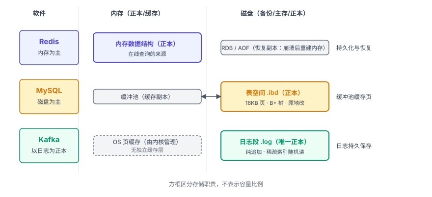
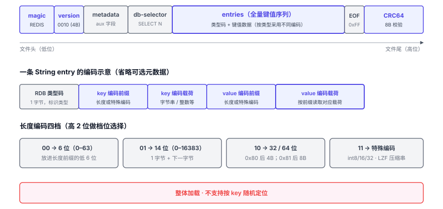
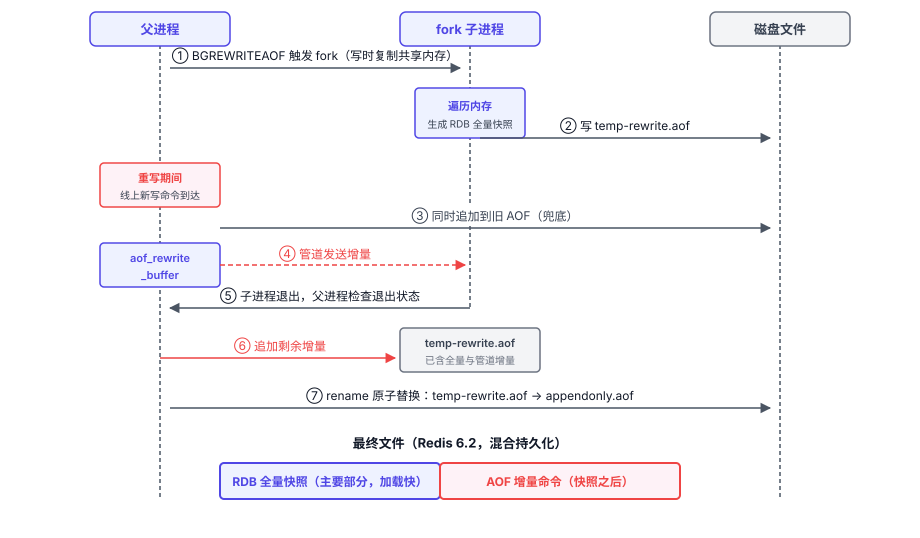
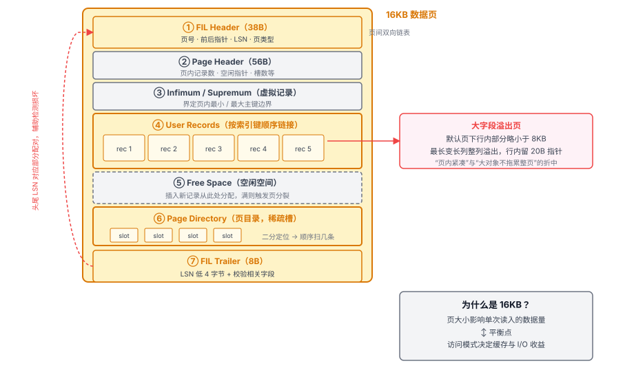
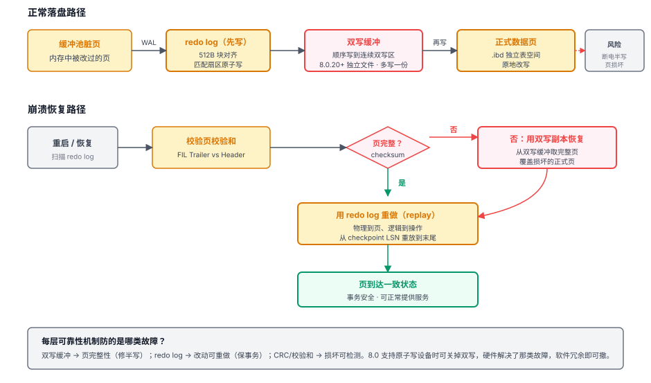
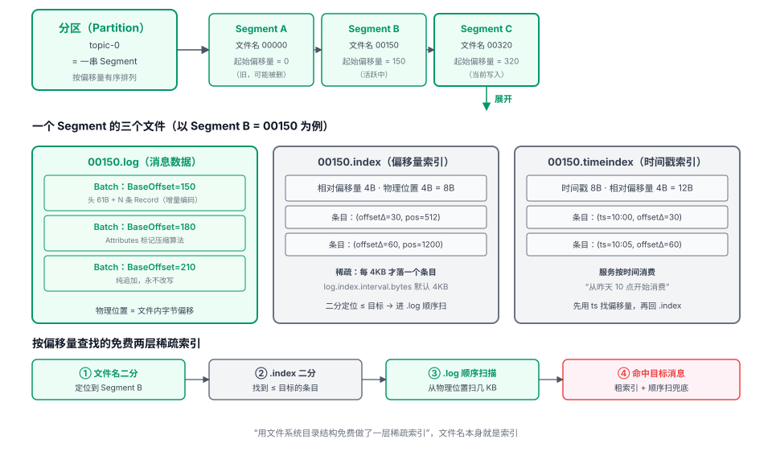
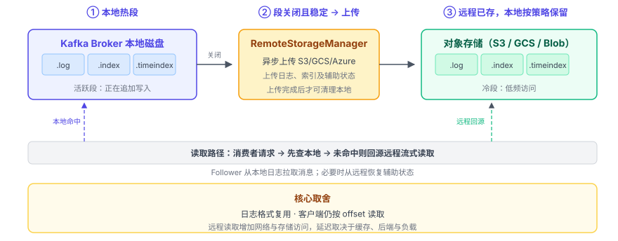
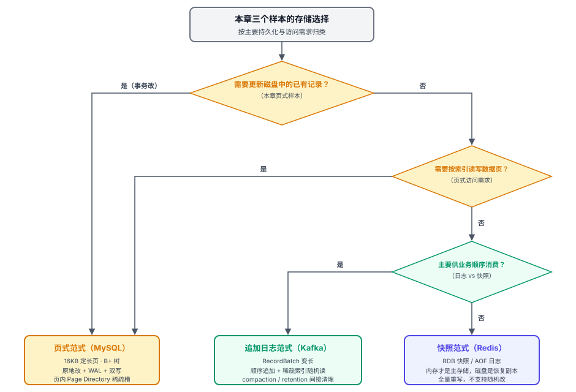

# 第 8 章 磁盘存储格式 — 文件结构的设计哲学

## 本章导读

我第一次自己定义文件格式时犯过一个低级错误：在头部放了一个版本号字段，但没想清楚向前兼容怎么做。三个月后要加一个新字段，发现解析器读到新版文件直接报错退出，因为旧代码不认识新格式。那次改版，迁移脚本折腾了整整一周。格式不会只写一次——任何不预留扩展空间的格式，都会在以后的演进中付出这份代价。

如果我们要给自己的系统设计一个文件格式，或者选一个序列化方案，会发现字节怎么排列是个非常关键的问题：用定长还是变长编码、加不加索引、要不要校验和、能不能向前兼容。这些选择一旦定下来，数据写进去了，再想改就要背负沉重的迁移代价。更关键的是，文件结构同时框定了软件的性能上限、可靠性下限和演进自由度，设计错了，后面怎么优化都很难挽救。

那怎么算设计对了？Redis 把内存中的数据序列化成快照文件，为的是崩溃后一次性整体重建；MySQL 把数据放进 16KB 定长页，支撑事务的随机读写和原地改；Kafka 只往日志段尾部追加，把磁盘顺序写的带宽用满。快照、页式、追加日志，三种范式各为一种访问方式优化，也各付一份代价。哪一种合适，取决于你的数据怎么读、怎么写。

## 8.1 问题的本质

### 8.1.1 为什么磁盘值得单独一章

磁盘与内存的工程差距，远不止延迟数字。磁盘访问还涉及 I/O 粒度与对齐，机械盘的随机访问有寻道开销。持久化文件可能跨进程、跨机器，几年后仍要由新的程序读取，所以格式需要明确约定字段、字节序和版本。写到一半断电（partial write）留下的不完整数据，也会成为下次启动的恢复问题。对齐、校验、写入顺序和兼容策略因此成为磁盘格式需要共同处理的约束。

更准确的说法是把存储格式当成一份契约：它把"内存里可变的数据结构"序列化成"磁盘上固定的、自描述的字节序列"。这份契约发布后，修改就需要兼容策略：明天升级的代码要能读懂今天写的文件，今天没升级的代码也可能要面对明天新格式写的文件，向前向后兼容从此变成长期债务。第 5 章讲过分层思想是软件应对复杂性的通用手段，本章把这套思想用到了磁盘上那一层字节。

### 8.1.2 四个根本矛盾

把所有持久化系统面对的磁盘格式问题列出来，绕不开四个矛盾。后文三个软件各自的实现，就在这四个矛盾上做了不同的取舍。

**读写路径不对称**。写要快还是读要快，往往不能兼得。顺序追加有利于合并写入，但要快速定位历史记录，还需要索引；定长页便于计算页的位置，页内记录仍需进一步查找，写入时也要处理页内整理与原地修改。

**空间与时间互相置换**。紧凑编码省 I/O 带宽和磁盘空间，但每次读写都要编解码，消耗 CPU；冗余字段与定长对齐让 CPU 解析省事，但浪费空间。压缩、变长整数、字典编码在一侧，对齐、定长字段、冗余校验在另一侧；CPU 越快、I/O 越慢，越值得为省 I/O 而耗 CPU。

**可靠性与性能的矛盾**。校验和、双写、WAL、fsync 策略，分别承担检测损坏、恢复不完整页和持久保存日志等职责。多写一份冗余、多落一次盘、多记一条日志，都是在给某一类故障兜底：这种兜底要付性能代价，设计时更要清楚它防的是哪类风险，否则就是无谓的写放大。

**定型与演进的矛盾**。格式发布即定型，业务变了、字段要加、编码要换、旧 bug 要修，都得在原格式上做兼容设计。版本号、Magic、保留字段、编码切换、在线 DDL，都是为未来预留的扩展空间。

### 8.1.3 三个软件面对的共同问题与各自约束

Redis、MySQL、Kafka 都要面对同一组问题：基本 I/O 单元多大、写是追加还是原地改、怎么做崩溃恢复、怎么演进格式。但各自的约束差别很大，所以它们的格式分成了三种基本结构。

对 Redis 来说，内存才是数据的主存储，磁盘文件用于恢复、复制与备份，不承担线上键查询。对 MySQL 来说，磁盘才是数据的主存储，内存（缓冲池）只是磁盘页的缓存：线上事务随时要读写任意一行，格式必须支持随机定位与原地改。而 Kafka 的磁盘就是日志本体：消息只有一份正本，存储在日志段里，读靠稀疏索引缩小范围后扫描，新的消息顺序追加。这些定位差异决定了它们后面的格式选择。

图 8-1　三个软件"数据真正存放在哪里"的内存/磁盘权重示意。

这张图把上面三句定位画成内存与磁盘的权重对比：Redis 内存占绝对主导，MySQL 磁盘主导，Kafka 磁盘就是本体、内核页缓存充当内存层角色。权重的倒置，也是它们格式选择不同的原因：为内存优化、为磁盘随机访问优化、为顺序追加优化的格式，各有各的样子。

> **关键数字**
> 
> **InnoDB 默认 16KB 页：页头、页尾、虚拟记录和页目录占用一部分空间，其余供用户记录与空闲区使用**。结构开销和每页行数随行宽、记录数与页内空闲情况变化。对单文件、未压缩的 16KB 页表空间，第 N 页的文件内字节偏移为 `N × 16KB`；按页号计算位置是页式结构随机定位的基础。
> 
> **Kafka RecordBatch V2：每批元数据约 61 字节**（V0 单条消息固定开销约 14 字节、V1 约 22 字节，均不含最外层 12 字节消息框，同口径计入外框为 26/34 字节）。Batch 级压缩在同类消息上可达 2–6 倍（zstd，取决于消息内容相似度与压缩级别；文本类数据近上限，二进制数据次之，已压缩数据趋近 1 倍——基本无收益），带宽与存储成本结构性下降。
> 
> **Redis RDB 内存/磁盘占用比：1GB 内存实例（字符串/列表型负载，典型场景）≈ 300–500MB 快照**。磁盘文件远小于内存实际占用，主因是内存态每键约 66–110 字节的结构开销不落盘，小键值负载下这笔开销占内存大头；次因是变长整数编码与 LZF（LZF 仅对超过 20 字节、且能省出至少 4 字节的值生效）；恢复时快速加载。

> **本书为什么没讲 LSM 树**：日志结构合并树（LSM-tree）是现代存储系统的另一个重要范式，RocksDB、LevelDB、HBase、TiDB 都在用它。它通过"内存写入 + 分层 SST 文件（Sorted String Table，排序字符串表）+ 后台合并（compaction）"实现高写入吞吐。本书这三个软件（Redis/MySQL/Kafka）无一采用 LSM 树作为默认引擎（MySQL 虽有 MyRocks 引擎但非默认），因此 LSM 范式不在本书深度覆盖范围内。读者若需要理解这一范式，Kleppmann《Designing Data-Intensive Applications》第 3 章是很好的起点。

## 8.2 Redis 的做法

### 8.2.1 定位先行：磁盘服务于内存

Redis 的持久化格式，源自它的定位。Redis 的数据正本在内存，RDB 与 AOF 用来重建内存中的数据，而不承担线上键查询。普通查询走内存；复制、备份等过程仍可能读取持久化文件。

这一定位决定了格式的取舍：文件可以很紧凑，因为恢复时顺序加载，不需按 key 随机定位；可以从内存中的当前状态全量生成新文件，再在写完后切换，不必沿用旧文件的内部布局；也不必为线上查询维护可原地改写的磁盘页。这是 Redis 与 MySQL、Kafka 在格式设计上的差异。

### 8.2.2 RDB：紧凑二进制快照

RDB（快照文件）是 Redis 的全量快照格式。它的设计目标是文件小、加载快，因此走的是紧凑二进制路线。

文件以一段固定魔数 `REDIS` 开头，紧跟 4 字节 ASCII 版本号。RDB 版本号标识磁盘协议契约，与 Redis 版本号不一一对应：5.0 到 6.2 共用 v9，大版本 7 内部却从 v10 一路跳到 v12——7.0→v10、7.2→v11、7.4→v12；具体以 `src/rdb.h` 中的 `RDB_VERSION` 宏为准。文件靠前缀自识别，不靠扩展名：加载器先检查开头的 `REDIS` 魔数和受支持的版本号。

长度字段采用分档编码，按大小选择表示。首字节高两位为 `00` 时，其余 6 位表示 0–63；为 `01` 时，与下一字节合成 14 位，表示 0–16383；为 `10` 时，还要按首字节的具体值区分后接的 32 位或 64 位长度。`11` 表示特殊编码，低 6 位标识 int8、int16、int32 或 LZF 等形式，实际整数或压缩数据随后存放。小长度（0–63）只需 1 个字节就能表示，编码标志与长度值共用这个字节。省下的字节在全量快照中累积起来，能减少文件体积。

存储态编码与内存态编码通过 RDB 类型码衔接，不是把整个内存对象原样写入文件。以 Hash 为例，Redis 7.0 对 listpack 编码保存其紧凑字节序列，对 hashtable 编码则逐项保存字段和值；加载器按类型码恢复对象，并在相应条件下根据当前阈值转换编码。这样可以为内存编码的演进保留兼容路径，但引入新编码时，RDB 类型码和加载代码也可能需要适配。图 8-2 展示了整份文件的结构、一条 entry 的字节序列，以及长度编码的档位。

图 8-2　RDB 文件布局：magic / version / metadata / db-selector / entries / CRC64 footer。

整个文件分成几个部分：开头魔数与版本号做自识别，metadata 区存辅助字段（如 Redis 版本、创建时间、repl-stream-db 等元信息），db-selector 标记接下来的数据属于哪个 db，entries 段是一条条键值记录，结尾是 8 字节 CRC64 校验和。CRC64 覆盖文件开头到校验和之前的内容，包括魔数、版本号和记录；写文件时边写边累积，结束时把结果写在尾部。加载时也边读取边计算，读到尾部再比对。启用校验且文件带有效校验和时，校验失败会中止恢复。

RDB 用"不支持随机访问"换"加载快、文件小"。RDB 完全不支持按 key 定位，要恢复必须整体加载。这对 Redis 没有损失：反正加载就是一次性把内存建起来，没人会对 RDB 做点查。

还有一处体现"格式为演进服务"的细节：7.0 起用 listpack 取代了旧版的 ziplist。ziplist 的历史包袱是 2.2.1 节讲过的连锁更新：每个元素记前一个元素的长度，长度字段一旦扩张就逐级传导，最坏 O(n²)；listpack 让每个元素只自记长度，连锁更新随之消失。这次换代没有动 RDB 的整体布局，旧文件也不用迁移：listpack 值落盘只是多了几个新类型码（RDB 版本号随之从 v9 升到 v10），Redis 7.0 加载器同时保留了新旧编码的读取与转换路径。类型码和加载代码共同维护了这种兼容。格式定型后难免积累问题，演进机制（在这里是编码切换）就是用来补这些不足。

### 8.2.3 AOF：持久化文件复用协议格式

AOF（仅追加文件）走的是另一条路。它记录的是"写命令本身"：命令记录使用 RESP 格式，命令参数可以包含二进制数据。AOF 落的不是客户端发来的原文，而是命令执行完后、经与复制链路同一套规则改写的传播命令（`EXPIRE` 记成绝对时间的 `PEXPIREAT`），**磁盘上的持久化文件直接复用线上协议的格式**。这个选择决定了后续的一系列设计。

这种复用带来了现成的工具。纯命令格式的 AOF 可以用 `redis-cli --pipe` 发送给 Redis 重放，相当于多了一套现成的恢复工具；带 RDB 前段的混合文件和 Multi-Part AOF 则应按各自的文件结构加载，不能把整份内容都当 RESP 命令发送。AOF 损坏时，可以先用 `redis-check-aof` 定位问题，再决定如何修复；`--fix` 可能截断损坏位置之后的内容，不能理解为只删掉一条坏命令。人工修改还要保持 RESP 的字节长度与命令语义正确。复用已有协议，省去了另行定义一套命令记录格式的成本。

代价同样明显：与保存同一份数据的 RDB 相比，AOF 通常更大，恢复时还要逐条解析、执行命令；恢复耗时取决于日志内容和积累量。Redis 用 fsync 策略在数据丢失窗口与写入开销之间切档：`always` 在追加一批已执行命令后刷盘，再发送相应回复，多个命令可以共用一次刷盘；`everysec` 默认约每秒刷盘一次；`no` 不由 Redis 主动调用 fsync，交给操作系统决定。后两种方式减少同步等待，也会留下更大的故障丢失窗口。

AOF 还有一个绕不开的难题：随着命令不断追加，文件只会越来越大，里面会堆积大量被覆盖、被删除的过时命令——比如对同一个 key 执行一百万次 INCR，重建当前值不必逐次重放这一百万条命令，可以改写成设置最终计数值的命令。Redis 的解法是重写（rewrite）。重写的关键取舍是：**fork 子进程从当前内存直接生成新 AOF**。这一步绕开了"解析越积越大的日志"这个坑：重写复杂度只跟当前内存数据量有关，跟 AOF 已经积累了多少无关。

但 fork 那一刻之后，父进程还在处理新写命令，重写需要把这部分增量接上。7.0 之前，新写命令既追加到旧 AOF，也进入 aof_rewrite_buffer。以 Redis 6.2 为例，父进程在重写期间还通过管道向子进程传递增量，子进程将收到的部分追加到新文件；子进程退出后，父进程再补写尚未传完的剩余增量，最后用 rename 原子替换旧文件。原子性指的是文件切换，不是整段增量追加。fork 与收尾写入仍可能造成服务停顿。7.0 起的替代方案见下节。

### 8.2.4 从混合持久化到 Multi-Part AOF

Redis 4.0 引入 `aof-use-rdb-preamble` 开关（5.x–6.x 默认 yes，即混合持久化）。开启后（7.0 之前）AOF 是单个文件：文件头为 RDB 全量快照，尾部接 AOF 增量命令。意图是取 RDB 的"加载快"（大头走二进制快速加载）加上 AOF 的"少丢"（尾部重放快照时点之后已保存的增量命令）。一次重启，先用 RDB 快速把内存主体建起来，再重放 AOF 尾部的少量增量，兼顾恢复速度与数据完整。

相关机制已在第 4 章介绍，这里只讨论文件布局的变化。Multi-Part AOF 的变化在于文件结构的重构。7.0 之前，AOF 是单个大文件，重写完成后通过 rename 切换到新文件。重写期间的新命令既要追加到旧 AOF，又要经重写缓冲传给新文件，带来额外的内存和 I/O 开销；失败后还需继续使用旧 AOF。

7.0 把 AOF 拆成一个目录，由清单文件（manifest）管理三类文件：至多一个基础文件（base，默认 RDB 格式）、零或多个增量文件（incr，AOF 命令），以及重写后标为历史（history）待删除的文件。父进程先新开 incr 文件记录后续写入，子进程生成新 base，完成后通过原子替换 manifest 让新组合生效。仍被清单引用的 incr 文件必须保留；新 base 已涵盖的旧文件才可转为 history 清理。重写失败时，原有 base、incr 和新开的 incr 仍用于恢复，Redis 也有历史文件与临时文件的清理逻辑；异常中断后的残留文件仍需按清单引用关系处理。

`aof-use-rdb-preamble` 在 7.0 Multi-Part AOF 改造后仍存在（默认 yes），语义是控制 base 文件是否使用 RDB 格式：默认 yes 时 base 为 RDB 格式，效果等同混合持久化常开；设为 no 则 base 为 AOF 命令格式。

图 8-3　AOF 重写 + 混合持久化的双缓冲协作时序（7.0 之前的单文件机制；7.0 起为 manifest 原子切换，见上文）。

图中概括的是 7.0 之前单文件混合 AOF 的重写时序。父进程 fork 出子进程，子进程将内存快照写入新文件的 RDB 前段；父进程继续把新命令追加到旧 AOF，并放入 aof_rewrite_buffer。以 Redis 6.2 为例，增量会在重写期间经管道传给子进程，成为新文件尾部的 AOF 命令；子进程完成后，父进程补写剩余增量，再用 rename 原子切换。整个过程通常继续服务，但 fork 和收尾阶段仍可能停顿。7.0 起，这套重写增量缓冲与收尾追加机制改为“新开 incr 文件直写 + manifest 原子切换”。

RDB 与 AOF 可以搭配使用：独立快照便于备份和快速恢复，AOF 持续记录快照之后的写入。是否同时启用，要结合可接受的数据丢失窗口、恢复时间和资源开销判断。Redis 7.x 出厂默认持久化仍是 RDB-only（`appendonly no`，靠 `save` 规则周期性 BGSAVE）；需要持续记录写入时，可显式打开 AOF，默认使用 everysec 刷盘。`aof-use-rdb-preamble yes` 时，7.0 之后的 AOF 重写默认生成 RDB 格式的 base。独立 RDB 备份与 AOF 内部采用 RDB base，是两个相关但不同的配置选择。

## 8.3 MySQL 的做法

### 8.3.1 定位先行：磁盘为主，内存是缓存

InnoDB 的定位与 Redis 正好倒过来。对 InnoDB 来说，磁盘上的表空间文件（系统表空间 ibdata 或独立 .ibd）才是数据的主存储，缓冲池只是磁盘页的缓存副本：命中率高的页留在内存，未命中的按需从磁盘读进来。这一倒置是理解 InnoDB 所有格式设计的前提。

它意味着格式必须支持页级随机读写：任意一页要能被独立读取、写入和淘汰，不能像 RDB 那样只能整体加载。它还要支持原地修改（in-place update）：UPDATE 可以修改已有页中的记录，记录变长等情况也可能触发页内重组或页分裂。原地写页还带来半写风险：写到一半断电，页可能处于半新半旧的状态，恢复时需要能识别并修复这类损坏。这些要求叠加，InnoDB 采用了"定长页 + 原地改 + WAL"，并用双写机制补充页恢复能力。

### 8.3.2 四层结构：表空间 → 段 → 区 → 页

InnoDB 的存储从大到小可以分为表空间、段（segment）、区（extent）、页。默认 16KB 页下，一个区由 64 个连续页组成，共 1MB。段初期逐页分配空间，增长后再整区申请，以改善数据的连续性。页号标识页在表空间中的位置：对单文件、未压缩的 16KB 页表空间，第 N 页的文件内字节偏移为 `N × 16KB`，可以直接计算。表空间由多个文件组成时，还要先确定该页所在的文件。定长页把定位所需的信息简化为表空间、页号和页大小。

段（segment）是逻辑聚合单位。一棵 B+ 树索引有叶子段与非叶子段，分别管理叶子页与非叶子页；回滚段则管理 undo log（回滚日志）所用的多个表空间段，两者不是同一级概念。段用于预留空间：把同类型的页尽量连续分配，减少随机分配造成的碎片。一张大表的索引按段组织空间，对顺序扫描和空间回收都更友好。

页与页之间靠双向链表串联：B+ 树同一层的页用 FIL Header 里的前后指针串成双向链表，范围扫描顺着叶子层的链走；空闲页的分配回收由区（extent）描述里的位图与链表管理，undo 页归回滚段调度，都不走页头指针。链表是页式存储的通用工具：顺序遍历建立在它之上。

关键取舍落在页大小上。较大的页一次能容纳更多记录，有利于某些顺序访问；较小的页在随机读取少量数据时，可能减少同时读入的无关数据。答案取决于这台机器的磁盘和这个负载的访问模式。MySQL 允许在初始化实例时通过 `innodb_page_size` 配置页大小（4K/8K/16K/32K/64K），默认是 16KB。实例初始化后不能直接更改这个值，调整时需要迁移到采用目标页大小的新实例。

### 8.3.3 数据页内布局：一行行记录如何放进 16KB

知道了页是 16KB 之后，下一个问题是这 16KB 内部怎么布局。InnoDB 的数据页内部分成七段，从上到下依次是：

1. FIL Header（含页号、前后指针、LSN、页类型）
2. Page Header（记录页内统计信息）
3. Infimum 与 Supremum 两条虚拟记录（界定这一页的最小与最大记录）
4. User Records（用户记录按索引键顺序链接，物理位置不必按键排序）
5. Free Space（剩余空间）
6. Page Directory（稀疏槽）
7. FIL Trailer（包含页 LSN 的低 4 字节及校验相关字段）

页尾保存的 LSN 低 4 字节应与页头对应部分一致，配合页校验和，可用于检测不完整写入等损坏。

图 8-4　InnoDB 16KB 数据页内部七段布局：Page Directory 的稀疏槽是页内查找的落点，与 Kafka 段级稀疏索引同一手法。

七段布局里最关键的是 Page Directory。它是页内的稀疏索引：普通记录组通常由 4–8 条记录组成，首尾组有例外。每个槽占 2 字节，记录组末记录在页内的偏移量；记录之间用 next_record 串成按索引键排序的单向链表。查找时，先在槽数组中二分缩小到相邻槽之间的范围，再沿记录链比较组内的几条记录。这一招把页内逐条遍历改成二分加少量顺序比较，用较少索引空间缩小查找范围，跟 Kafka 段级稀疏索引采用的是相近思路。

行格式（row format）层面，InnoDB 默认用 Dynamic 行格式（5.7 起为默认，8.0 沿用，由 `innodb_default_row_format` 控制）。有两个设计要点。一是变长字段的长度信息按与字段相反的顺序存放。解析时从记录头附近读取这些长度，再确定字段边界。

二是溢出按整行判定，不以单个字段超页大小一半为准。默认 16KB 页下，行内记录长度上限略小于 8KB；行太长时，从最长的变长列（VARCHAR、BLOB、TEXT）起移到溢出页，行内只留一个 20 字节指针，直到行内部分能放下。不超过 40 字节的短 TEXT/BLOB 留在行内；旧版 COMPACT 则会在行内保留被移出列的 768 字节前缀，再加外挂指针。这个取舍使聚簇索引叶子页能容纳更多行内记录，减少长列占用的页内空间；读取被移出的列时，仍需访问溢出页。

### 8.3.4 redo log + 双写：保证"原地改"在断电后可恢复

原地改页的一个风险是断电导致半写（partial write）。例如，一个 16KB 页可能只写了前 4KB 或前 8KB 就断电，留下半新半旧的数据，页结构和校验信息可能不再一致。redo log 用于重放页的修改，但任意损坏的页未必还能直接接受这些修改。恢复过程还需要一份可用的完整页映像，这正是双写缓冲要保存的内容。

InnoDB 的解法是双写缓冲（doublewrite buffer）。启用完整双写模式时，脏页先写入双写存储区并完成刷盘，再写到正式位置；若正式页发生不完整写入，恢复时可从双写区取得有效的完整副本，再应用后续可用的 redo。双写缓冲早期位于系统表空间，8.0.20 起改为独立 doublewrite 文件，但"先保存完整页副本、再写正式位置"的次序不变。多写的代价是写放大；双写区支持批量顺序写和合并刷盘，能减少额外 I/O 操作，但实际开销仍取决于负载与存储设备。

redo log 本身是循环日志，按 512 字节块对齐。512 字节是日志块的组织与对齐粒度，本身不构成掉电时的原子写保证。WAL 要求脏页写入数据文件前，相应 redo 已经落盘；内存中的页可以先被修改。崩溃后，恢复过程从可用日志中重放需要的修改。8.0.30 之前 redo log 由固定数量、固定大小的文件循环写；8.0.30 起改为由 `innodb_redo_log_capacity` 统一管控的动态容量（默认 100MB，启用专用服务器自动配置时可不同），但"循环写 + 512B 块对齐"的物理结构没变。

redo log 是物理到页、逻辑到操作的混合日志，记录的是"对哪个页偏移做了什么修改"，既不像纯物理日志那样体积大（每个字节改动都记一条），又不像纯逻辑日志那样难以幂等重做（重做同一个操作可能产生不同结果）。物理逻辑混合日志在"日志体积"与"恢复时能否幂等重做"之间取了折中。

循环写的日志还要配一个 checkpoint（检查点）：checkpoint 标识此前的修改已写入数据文件的位置。崩溃恢复从 checkpoint 向后扫描日志；随着脏页刷盘和 checkpoint 推进，较早的 redo 空间才能复用。

图 8-5　脏页刷盘流程：双写缓冲 → 正式页，配合 redo log 的崩溃恢复路径。

图中可见两种配合使用的恢复机制：正常刷页时，相应 redo 先落盘（WAL），完整页再依次写入双写区和正式位置。崩溃恢复时，若正式页存在不完整写入，先用有效的双写副本修复；随后按页 LSN 判断并重放所需的 redo。双写提供修复页映像，redo 补上可恢复的修改；已提交事务能否在掉电后保留，还取决于日志刷盘配置与存储设备是否兑现持久化要求。

只有确认整条存储路径能为数据页写入提供所需的原子性时，才可以考虑关闭双写缓冲（`innodb_doublewrite=OFF`，这个开关早于 8.0 就存在），减少写放大。设备支持某种原子写指令，不等于当前文件系统和 InnoDB 写入路径已经使用它。MySQL 8.0 文档列出的自动关闭支持限于 Linux 上配合 NVMFS 的 Fusion-io 原子写路径，而且关闭开关会影响全部数据文件。软件冗余能否撤下，要按实际运行路径确认。

## 8.4 Kafka 的做法

### 8.4.1 定位先行：磁盘就是日志本体

Kafka 的定位又反过来了。对 Kafka 来说，消息只有一份正本，就存储在磁盘的日志段里。它不像 MySQL 那样自己管缓冲池，页缓存交给操作系统，Kafka 只把字节往日志文件里追加，读时直接从页缓存或磁盘顺序读。数据本体就在磁盘日志里，格式设计围绕三项需求展开：顺序追加写（新消息写入活跃日志段尾部）、按偏移量（offset）随机读（通过稀疏索引和局部扫描定位）、成批压缩（带宽稀缺，一批相近消息压在一起能省下数倍的存储与传输成本）。于是 Kafka 的基本结构就由"日志段 + 稀疏索引 + RecordBatch"三部分组成。

### 8.4.2 日志段（Log Segment）：日志文件与两类索引

Kafka 的分区在磁盘上是一串日志段（segment）。其中三类主要文件是：`.log` 存消息数据本体、`.index` 存偏移量索引、`.timeindex` 存时间戳索引。它们按日志段配套管理；此外还有事务索引 `.txnindex` 等辅助文件。删除和压实日志段时，也要处理相应的索引。

文件名使用该日志段的起始偏移量。比如 `00000000000000000000.log`、`00000000000000123456.log`，这个数是段内偏移量的下界；压实移除早期记录后，未必还有一条记录恰好等于它。Kafka 在内存中按起始偏移量维护有序的日志段集合。按偏移量定位时，先找到起始偏移量不大于目标的最后一个日志段，再到段内查找，不需要每次重新排序文件系统目录。

图 8-6　分区 → 日志段 → 三个主要文件的目录与内部结构。

一个分区在磁盘目录里展开成一串日志段，三个文件用相同的起始偏移量命名，`.index` 与 `.timeindex` 条目中的偏移量也以这个起始值为基准。相对偏移量用 4 字节整数保存；当新消息的相对偏移量超出可表示范围时，即使段文件还没达到 `log.segment.bytes`，也需要切分日志段。这与按字节数限制段大小是两种约束。两类索引都采用定长条目，便于二分查找。条目的具体构成与两套索引的查找步骤见第 8.4.4 节。

日志段的切分粒度是需要权衡的参数。切得太小，文件数量多，压实时要处理的日志段多，元数据开销大；切得太大，单个文件的管理和重写工作量增加，保留策略清理数据的粒度也更粗。Kafka 的默认是按大小（`log.segment.bytes` = 1GB）或时间（`log.roll.hours` = 7 天）任一条件触发切分。这个粒度还跟保留策略（retention）与压实（compaction）直接相关：删除旧数据的最小单位就是一整个日志段，所以日志段大小也决定了清理的粒度。压实是另一种清理路线：按 key 逐步清理旧值、保留最新状态，通过重写日志段回收空间（`__consumer_offsets` 这类内部主题靠它长期保留每个 key 的最新状态），与按时间/大小的整段删除互补。

### 8.4.3 RecordBatch V2：把一批消息当成一个存储单元

Kafka 消息格式的关键变化是 V2 引入的 RecordBatch（字段布局见 2.2.3 节表 2-1，这里看它为什么这样演进）。V0、V1 的 MessageSet 中，每条消息自带偏移量、key 长度、value 长度、CRC、属性等元数据，V1 起还增加了时间戳。这两代也能把多条消息包装后整体压缩，但内部消息仍各带一份元数据；消息越多，这部分重复开销越明显。

V2 把共享元数据集中到 Batch（批）头部。一个 Batch 头部固定 61 字节，存 BaseOffset、PartitionLeaderEpoch、ProducerId、ProducerEpoch、BaseSequence、CRC、Attributes、记录数等整批共享的元数据。Batch 内每条 Record 的时间戳和偏移量保存为相对差值，key、value 及 headers 则分别带有长度或数量信息。差值较小时，变长整数只需一两个字节；每条记录仍有自己的长度、属性等字段，但不再重复保存整批共享的信息。

这个变化把压缩边界与共享元数据的边界放在同一个 Batch 上：一批时间相近、内容相似的消息一起压缩，内部记录用差值表示时间戳和偏移量，减少重复元数据。V0/V1 的整包 wrapper 压缩也能合并多条消息，只是内层仍保留各自的头部。V2 的结构减少了这些开销，实际压缩比仍取决于负载特征与所选算法。

代价也有：读取压缩 Batch 中的一条记录，仍要解压包含它的批数据。Kafka 通常成批拉取消息，批量处理可以分摊这项开销；但一个 Batch 也可能只有一条记录，应用只需要其中一部分时，解压和解析仍有成本。批头的 61 字节也要靠条数分摊：单条成批时，V2 的固定开销反而高于 V1 同口径的 34 字节，约三条起才反超。**让存储单元适应常见的访问方式**，是在批量消费场景下作出的取舍。

还有一处设计：ProducerId、ProducerEpoch、BaseSequence 直接进了存储格式本身。这三个字段是幂等生产与事务的根基（生产者带单调递增序列号发消息，Broker 据此把重试的重复去掉），这意味着幂等与事务不只是协议层的事，也是存储格式问题：Broker 重启后要从日志里恢复这些状态，格式不支持就存不下来。把协议状态写进存储格式，让"重启后能续上"成为磁盘层面的保证。

### 8.4.4 双索引：偏移量索引 + 时间戳索引

Kafka 的随机读靠两套索引：偏移量索引和时间戳索引。两套都是稀疏索引：不是给每条消息都建一条索引项。

偏移量索引的条目是 8 字节定长：4 字节相对偏移量（相对日志段起始偏移量）加 4 字节物理位置（在 `.log` 文件中的字节偏移）。`log.index.interval.bytes` 控制索引间隔，默认约每 4KB 建一个条目，实际位置还受追加批次边界影响。查找时，先按起始偏移量定位日志段，再在 `.index` 内二分找到不大于目标的最大偏移量条目，得到物理位置，最后从那里顺序扫描 `.log`，找到目标或其后的首条现存记录。这是典型的"粗索引 + 顺序扫"组合。

时间戳索引服务于按时间消费的场景，比如"从昨天上午 10 点开始消费"。条目是 12 字节：8 字节时间戳加 4 字节相对偏移量。查找逻辑是先用时间戳索引找到对应的相对偏移量，再用这个偏移量去走偏移量索引，最后落到物理位置。两套索引协作，让"按时间"和"按偏移量"两种访问方式都快。

稠密索引为每条记录建立条目，数据量大时，索引也会占用更多空间。稀疏索引通过增加少量顺序扫描，换取较小的索引体积，使常用部分更有机会留在页缓存中。以每 4KB 数据对应一个 8 字节偏移量条目粗略估算，1TB 数据约需 2GB 偏移量索引；实际还受批次边界影响，时间戳索引等空间另计。Page Directory 在页内也采用了相近的思路（第 8.3.3 节）：二分缩小范围，再沿记录链完成局部查找。

### 8.4.5 格式演进 V0 → V1 → V2

从 V0 到 V2，格式逐步适应新的需求。V0 的消息没有时间戳；V1 加入时间戳，消息本身仍各带元数据，压缩时由外层 wrapper 包装一组消息。V2 引入 RecordBatch，将共享字段放到批头，记录内部采用差值编码，并加入 ProducerId/Epoch/BaseSequence，支持幂等与事务所需的状态。

演进机制靠 Magic 字段做版本号。Magic 是消息格式里的一个字节，标识这条消息是哪个版本。老 Broker 收到不支持的 Magic 版本直接拒绝；消费者按 Magic 选不同的解析路径。这种"格式自带版本号"的做法，是支持混合版本部署与平滑升级的标配：跟 RDB 的 version、InnoDB 的页类型字段是同一类机制。

下面用一张表对比三代格式的字段与演进动机。

**表 8-1　Kafka 消息格式 V0 / V1 / V2 的字段对比与演进动机**

| 维度 | V0（原始单消息） | V1（加时间戳） | V2（RecordBatch） |
|------|------------------|----------------|-------------------|
| 存储单元 | MessageSet 内的 Message | MessageSet 内的 Message | RecordBatch（可含一条或多条 Record） |
| 时间戳 | 无 | 每条 8 字节 | 每条存与 BaseTimestamp 的差值 |
| 偏移量 | 每条绝对偏移量 | 普通消息为绝对量；压缩内层为相对量 | Batch 存 BaseOffset，每条存差值 |
| CRC | 每条消息一个校验值 | 每条消息一个校验值 | 每个 Batch 一个校验值 |
| 压缩 | 整包 wrapper 压缩，内层各带元数据 | 整包 wrapper 压缩，内层各带元数据 | Batch 级压缩，记录共用批头元数据 |
| 幂等/事务 | 不支持 | 不支持 | 支持（ProducerId/Epoch/BaseSequence） |
| 演进动机 | —— | 加入消息时间语义 | 减少重复元数据，支持幂等与事务状态 |

每一代演进本身都有代价：V1 解决了时间问题却留下元数据冗余，V2 解决了冗余却引入 Batch 边界。

### 8.4.6 Tiered Storage：从本地日志到分层存储

Kafka 3.9 起正式 GA 的 Tiered Storage（KIP-405；Apache Kafka 3.9.0 发布公告将 Tiered Storage 列为 production-ready），是 3.x 系列最重要的存储架构变化之一：**日志本体横跨本地磁盘和远程对象存储，热数据在本地，冷数据可卸载到远端**。

机制核心是 RemoteStorageManager：一个统一接口，定义日志段及相关文件的上传、读取和删除，需要配置相应的远程存储实现。日志段关闭，且段内记录都位于最后稳定偏移量之前，Kafka 才把它列为上传候选，异步复制到 S3、GCS 或 Azure Blob 等远程存储；成功上传后，本地副本可按本地保留策略删除。消费者读取远端数据时，Broker 通过远程接口取得所需内容，不必把整段重新建成本地日志段。

副本同步不直接复制已经只存于远端的日志段。Follower 请求的偏移量落到仅存于远端的日志范围时，会收到 OFFSET_MOVED_TO_TIERED_STORAGE，随后进入远程状态重建流程。它从远程存储取得 leader epoch 历史（记录各任 Leader 的日志起点，第 9 章展开）和 producer snapshot（保存生产者序列等状态，见表 4-2），重建辅助状态，再从对应远程段末尾的下一偏移量继续向 Leader 拉取本地日志。这个流程依赖远程数据和元数据可用；副本若长期无法追上，仍可能因 `replica.lag.time.max.ms`（默认 30 秒）的条件被移出 ISR。较长的本地保留窗口，可以减少落后副本转入这条路径的机会。

这里的设计要点是：**日志段与索引可以沿用原有格式**，而远程存储接口和元数据管理负责其放置与读取。客户端仍按 offset 消费，复制层则需要识别远程边界并重建辅助状态。第 5 章讲的"让可替换出现在最值得替换的地方"，在这里体现为远程存储后端接口。

这一变化带来三方面影响。第一，日志正本的位置可以从本地磁盘扩展到远程存储，日志段与索引仍沿用原有格式。第二，读取已经不在本地的冷段，需要额外的远程请求，不能依靠本地日志文件的 PageCache 命中；延迟受网络、远程存储和缓存情况影响。第三，同一套日志格式可以服务于不同的放置策略：热段留在本地，较少访问的闭合段移到远端，存储后端、保留策略和读取流程相应调整。

图 8-7　Kafka Tiered Storage 日志段生命周期：本地段关闭并满足稳定性条件后异步上传，消费者可经 Broker 读取远端数据。

图 8-7 把生命周期拆成三步：新消息追加到本地活跃段，符合条件的关闭段异步上传，已上传段的本地副本再按保留策略清理。消费者读取留在本地的数据和只存于远端的数据，会经过不同路径，后者增加了远程访问的开销。

## 8.5 横向对比

把三个软件的具体做法放进同一张表，对比每种范式各为谁优化、各自又付了什么代价。

### 8.5.1 三栏对比表

**表 8-2　三个软件在八个维度上的范式对比**

| 维度 | Redis | MySQL | Kafka |
|------|-------|-------|-------|
| 数据的主存储位置 | 内存 | 磁盘 | 日志段（本地或远程存储） |
| 文件组织与处理单元 | RDB 文件 / AOF 命令记录 | 默认 16KB 页 | RecordBatch（变长） |
| 写方式 | 全量重写（RDB）/ 追加与重写（AOF） | 原地改页 + WAL | 新消息追加，压实时重写日志段 |
| 读方式 | 加载后在内存中查询 | B+ 树定位与页内查找 | 稀疏索引 + 顺序扫描 |
| 索引形态 | 持久化文件无 key 索引，查询使用内存结构 | B+ 树 + 页内 Page Directory | 稀疏偏移量 / 时间戳索引 |
| 崩溃恢复 | 按配置加载 RDB 或 AOF（可含 RDB base） | redo 重放 + 完整双写模式修页 | 以日志为正本，校验并截断残缺尾部 |
| 演进机制 | RDB 版本号 + 编码类型 | 行格式与页内格式标记 | Magic 版本号 |
| 损坏检测 | RDB 尾部 CRC64 | 页校验和与 LSN 对应部分 | Batch 级 CRC |

每一行都是一次明确的取舍。读方式这一行差异最直观：Redis 加载后才随机访问，MySQL 用 B+ 树随机定位，Kafka 靠稀疏索引加顺序扫描，三种读方式直接对应三种格式结构。损坏检测这一行则反映出它们对"损坏粒度"的不同假设：Redis 校验整个文件，MySQL 校验单页，Kafka 按批校验。

### 8.5.2 解读：三种范式各为谁优化

三种格式背后是三种不同的优化目标。第 4 章按数据的主存储放在内存还是磁盘，把三家分成全内存、缓存磁盘、顺序日志三种范式；本节按磁盘文件本身的组织结构来分，快照、页式、追加日志是另一个维度。

快照范式（Redis）为“快速整体恢复”优化。RDB 把内存数据序列化成紧凑的二进制文件，恢复时顺序加载；AOF 把传播命令按 RESP 格式追加，可逐条重放，也可从当前内存重写。这套格式不承担线上按 key 查询磁盘的工作，普通查询走内存；持久化文件仍可用于恢复、复制或备份。

页式范式（MySQL）为"事务安全的随机读写"优化。默认 16KB 定长页便于按页号计算位置，支持独立读写和淘汰；B+ 树在页之上建立多级索引，支持点查与范围扫；完整双写模式用于修复不完整写入，redo log 用于重放可恢复的页修改。代价是写放大：双写缓冲让脏页刷两次盘，redo log 需要记录页修改。另一项代价是页分裂与删除留洞的空间浪费（页合并受 MERGE_THRESHOLD 约束）：一页里哪怕只剩几行 100 字节的记录，也要占整整 16KB，半空的页在所难免，但这项开销可治理——MERGE_THRESHOLD 可按索引调整，在线重建索引也能回收空洞。

Kafka 的追加日志做法为"高吞吐的顺序写 + 成批压缩"优化。新消息顺序追加，RecordBatch 把多条记录放在一起压缩，同类消息上常见 2–6 倍压缩比，实际收益取决于内容与算法。稀疏索引缩小查找范围，再通过局部扫描定位记录。代价是没有直接更新既有消息的接口：旧数据按 retention（保留策略）整段删除，或由 compaction（压实）逐步清理被新值替代的旧记录，处理过程中需要重写日志段。

### 8.5.3 为什么三个软件选择如此不同

贯穿三个软件的规律是：**存储格式反映访问模式**。"数据怎么被读、怎么被写、读多还是写多、要不要随机定位"，会影响存储单元、索引和更新方式的选择。Kafka 采用日志段与 RecordBatch，把追加、批量传输和压缩组织在一起；如果换一种格式，也需要保留这些访问上的收益，并重新权衡定位和更新的成本。

这也解释了表中“文件组织与处理单元”的差异：Redis 恢复时顺序加载文件，AOF 又以命令记录增量；MySQL 按页管理缓存与数据文件；Kafka 把记录组织成变长 RecordBatch。这些单元处在不同层次，分别服务于各自的加载、缓存和批量处理需求。

## 8.6 架构启示

存储格式是软件里极难推翻的决策之一，三个软件的选择里藏着五条启示。

### 8.6.1 启示一：存储单元要对齐访问单元

Kafka 的 RecordBatch 适合批量传输和压缩；MySQL 以页为单位管理缓冲池与数据文件，一次读取也可能涉及多个页；Redis 的 AOF 命令记录可以复用协议解析和执行路径。三者都是让文件组织适应常见访问方式。批量共享元数据、按页管理缓存和复用命令解析，都有助于减少相应的处理开销，但存储单元不必与业务一次请求的范围完全相同。

**存储单元需要适应常见的访问方式。** 我设计存储格式时，第一个要定的就是这个：数据被批量读还是单条读？被整体加载还是随机点查？答案会影响存储单元该多大。

### 8.6.2 启示二：定长与变长可以在不同层次配合

定长页可以容纳变长记录，二者解决的是不同层次的问题。

定长页利于管理空间和按页号定位：在给定表空间布局与页大小后，可以计算页的位置。代价是空闲空间与对齐开销。变长记录和字段则能按内容长度使用空间，有利于紧凑编码。两者可以同时使用：InnoDB 的页是定长的，页内记录却可以包含变长列。记录增长时，需要看页内剩余空间，可能原地容纳、重组或分裂，并非一律只能追加重写。

空间管理粒度和记录编码需要分开考虑。MySQL 需要更新已有行，采用定长页来管理空间，同时允许页内记录变长；Kafka 用变长 RecordBatch 组织追加数据，没有更新既有消息的接口。Redis 的 listpack 与 hashtable 也在紧凑性和访问成本之间作不同取舍。是否原地修改是一个重要条件，还要结合记录长度变化、索引和空闲空间管理来判断。

### 8.6.3 启示三：索引越稀疏，越要靠顺序扫描补回来

MySQL 的 Page Directory 和 Kafka 的偏移量索引采用了相近手法：稀疏索引加局部顺序扫描。前者在页内按记录组设置槽，后者在日志段中按近似字节间隔建立条目；都先缩小范围，再查找其中的记录。Redis 的内存跳表和哈希表采用了不同的查找结构。

这对应第 8.4.4 节的取舍：减少索引条目，可以降低索引空间和缓存压力，代价是定位后还要扫描一段数据。是否合算，取决于索引规模、可用内存、索引间隔和访问分布；间隔过大时，补扫的成本也会增加。

**稀疏索引用局部顺序扫描换取较小的索引体积。** 我设计索引时，先想清楚索引能不能放进内存，放不进就考虑稀疏化，再比较节省的缓存空间和增加的扫描开销。

### 8.6.4 启示四：可靠性要付性能代价，但要知道防的是哪类故障

每加一层可靠性机制，都对应一类故障，也对应一份性能代价。

MySQL 的完整双写模式用于修复断电等故障造成的不完整页写入，代价是同一份脏页要写到双写区和正式位置。redo log 让尚未写入数据页的修改可以在恢复时重放；已确认提交能否经受掉电，还取决于日志是否持久化。CRC 等校验用于检测数据损坏，代价是写入和读取时的校验计算。

Kafka 的 Batch 级 CRC 用于检测批数据损坏，Redis 的 RDB 尾部 CRC64 用于检测快照数据损坏，校验本身不修复损坏。理解每一层机制处理哪类故障，才能判断什么时候可以撤：MySQL 的双写缓冲就是第 8.3.4 节的例子，只有实际页写路径已提供所需原子性，才考虑关闭双写。redo log 仍有独立作用：页写原子性解决不了已提交事务的数据页尚未落盘的问题。

我加可靠性机制前，先问"我针对的是哪类故障，这类故障下层有没有更便宜的解法"。盲目堆冗余只会换来无谓的写放大；精准识别故障并交给下层解决，这笔开销就降得下来。

### 8.6.5 启示五：格式一旦发布就是长期债务

最后一条回到 8.1.2 节的第四个矛盾。存储格式发布即定型，业务会变、字段要加、编码要换、旧 bug 要修，全都要在原格式上做兼容。版本号、保留字段、Magic、编码切换，都是为未来预留的扩展空间（第 2 章启示四在协议层讲过同一件事：第一个版本没人能把边界想全，先留版本字段）。

Redis 的 listpack 取代 ziplist、Kafka 的 V0 到 V1 到 V2、InnoDB 的 Compact 到 Dynamic 行格式，都是格式演进的实例。每一次演进都伴随版本号、兼容策略、新旧代码共存期、灰度迁移，这些都在累积长期债务。

存储格式的设计，要为"五年后还要读今天的文件"做好准备。这条原则的反面例子不少：很多自研系统第一版格式图省事，没留版本号、没留保留字段，几年后业务一变，要么写迁移脚本痛苦地转一遍，要么直接弃用老数据。在格式设计阶段多花一周想清楚兼容性，能为未来省下几个月的迁移债。我自己定格式，第一件事是把版本号和保留字段写进头部、把向前兼容想清楚再谈别的——本章开头那次改版，迁移脚本折腾了整整一周，正是这一步没走完的代价。

### 8.6.6 给实践者的三问

把五条启示落到实践，我面对自己的存储设计时，先回答三个问题。第一问，数据会被原地改吗？这会影响空间管理和恢复机制。MySQL 的做法是用定长页管理空间，按页号和页大小定位，并用 WAL 和双写配合原地更新；如果只追加，日志段也值得考虑。

第二问，访问更偏向随机定位，还是批量流式进出？随机定位需要相应的索引，MySQL 的 B+ 树与页目录、Kafka 的稀疏索引都给出了例子。批量流式进出、写远多于点查时，追加日志值得考虑；主要用于崩溃后整体重建时，可以考虑快照，并按数据丢失窗口和恢复时间决定是否配合增量日志。增加快照频率可以减少待重放的增量，也会增加生成快照的开销。图 8-8 按这两类问题，整理了本章三个样本的典型选择。

图 8-8　本章三个样本的存储结构选择示意：按原地修改和主要读取方式，理解页式、追加日志与快照的取舍。

图中的分支对应本章样本的主要需求：MySQL 用页式结构支持原地更新和随机查找；Kafka 把追加写与批量读取组织在日志段中；Redis 的持久化文件主要服务于内存状态重建。同一系统也可以组合这些做法。

第三问是："五年后还能不能读"。它适用于图中的所有方案，不用于区分页式、追加日志或快照，因此没有单列在图中。预留版本号、Magic 与编码切换位（ziplist→listpack、V1→V2、页类型位），格式才能长期可读。没有预留的，需要现在补上。回答这三问后，格式结构的方向就清晰了。

## 8.7 小结

三种格式的差异源于访问模式的不同。Redis 用磁盘保存内存数据的备份，为的是崩溃后快速整体重建；MySQL 把数据行放进 16KB 定长页，为的是事务安全的原地改与随机读写，双写和 redo log 是它对断电风险的保护；Kafka 的新消息顺序追加，靠 RecordBatch 成批压缩消息、稀疏索引定位，提高批量处理的吞吐。代价各自不同：Redis 因为不用原地改，省下了页式那套复杂度，代价是恢复时要整体加载重建；MySQL 则要为原地改背上双写与 redo log 的写放大，崩溃恢复还要按 checkpoint 之后的日志量重放 redo；Kafka 则直接连"原地改"这个选项都不要了。

存储格式的选择会长期影响一个系统：页式结构需要管理页内空间和更新，追加日志则需要处理历史数据的清理与索引。而设计一个格式时，我还会问"五年后还能不能加字段、换编码"，把眼前的编码效率和长期兼容放在一起考虑。AOF 的重写增量、redo log 的循环写、Kafka 的 retention 与 compaction，也引出了第 9 章的数据同步问题：哪些状态可以通过增量追赶，哪些情况下需要全量重建。

