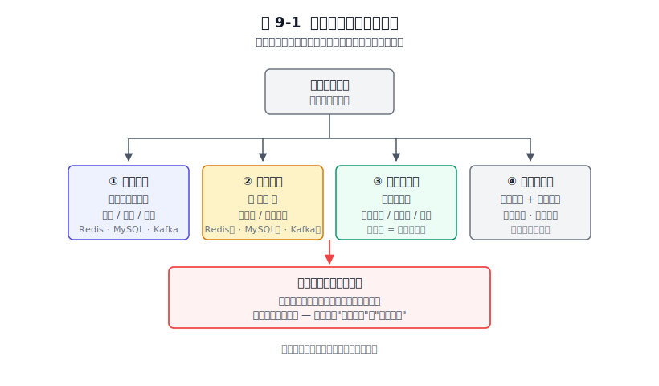
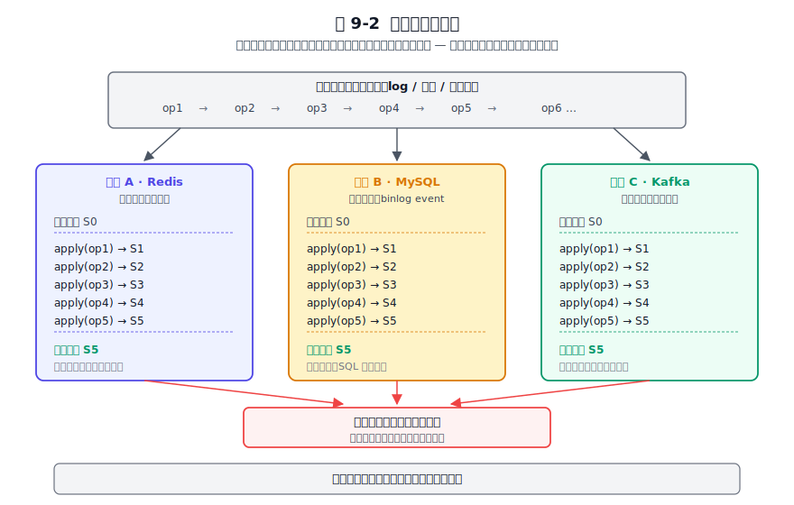
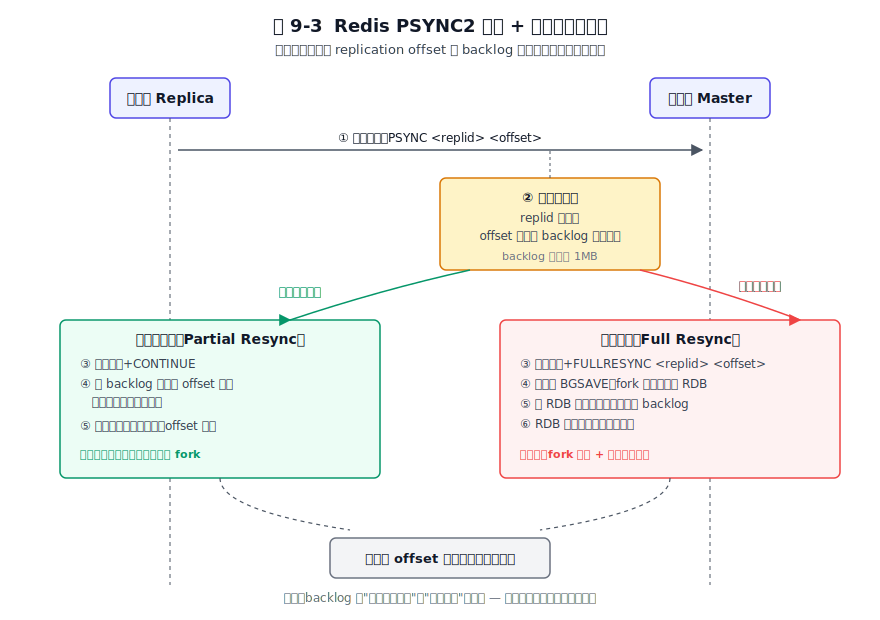
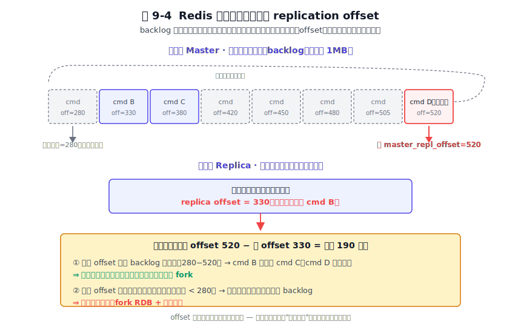
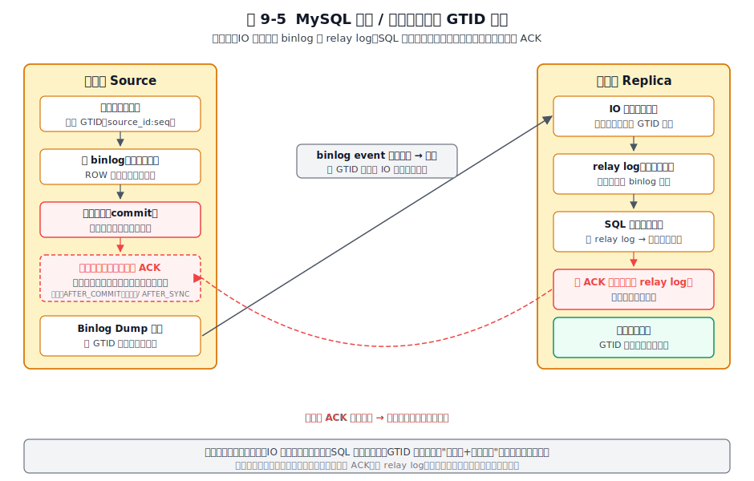
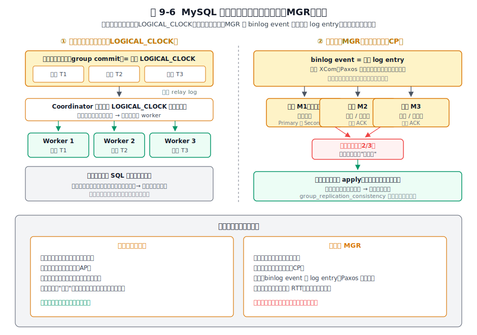
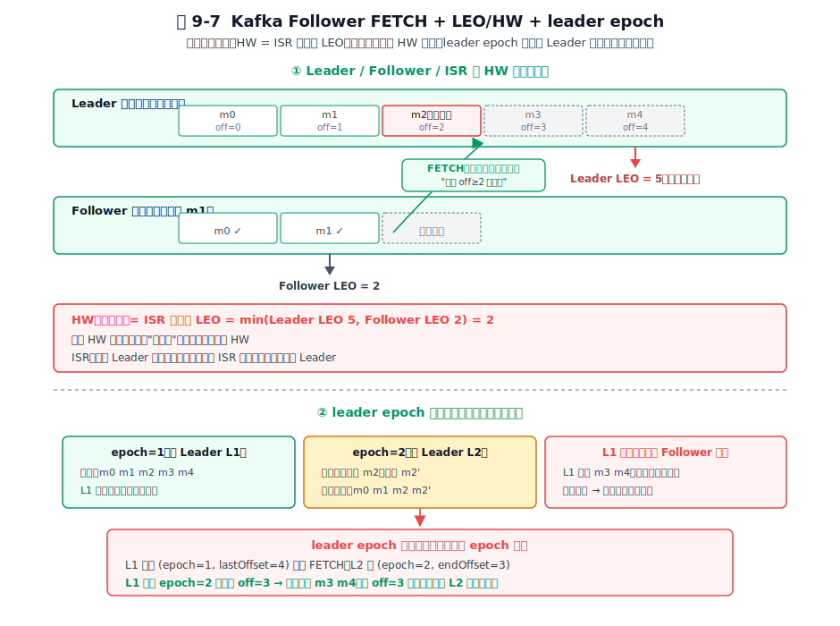

# 第 9 章 数据同步机制 — 集群一致性的实现

## 本章导读

你的系统长大了，开始有了"多份数据"：主库带几个从库、多机房多活、甚至只是 Redis 缓存配着 MySQL 数据库。一旦数据不止一份，一个要命的问题就冒出来：主库刚写入的那条记录，从库什么时候能看到？缓存和数据库不一致时，以谁为准？万一中间网络断了，重连之后怎么把漏掉的部分补上而不重复？处理不好，轻则用户看到旧数据，重则多卖了库存、转多了账。

这就是"数据同步"。它的本质只有一句话：把一处状态变化，可靠、有界延迟地传播到其他副本。Redis 把它做成了命令流，MySQL 做成了 binlog event，Kafka 做成了有序消息：表面三种答案，背后是同一条主线：状态机复制。本章承接第 7 章《集群架构》：那一章回答"集群怎么组、谁来当主"，这一章回答"主的数据怎么传到副本、传到什么程度算数、断了怎么续"。三家用了三套完全不同的机制：PSYNC2、GTID、leader epoch，却在做同一件事：用可比较的进度坐标对齐两个状态机。这套骨架，能解释你将来遇到的几乎任何一套复制系统。

## 9.1 问题的本质

单机迟早撞上容量、可用性或读扩展的天花板：加副本势在必行。DDIA 第 5 章已经充分论述了复制的基本模型、同步/异步分类与一致性-延迟权衡，本章不再重复。我们从一个更具体的问题出发：把"数据同步"这个笼统的大词拆开。

### 数据同步的四个子问题

把"数据同步"这个大词拆开，背后其实是四个独立但彼此关联的子问题。

**第一，传播什么。** 一次状态变化，到底把什么东西传给副本？是命令本身（"执行 `SET k v`"）、是事件（"行 k 的值变成了 v"）、还是消息（"编号 7 的记录内容是 v"）？传播单元的粒度，决定了下游几乎所有机制。

**第二，怎么传播。** 是主节点主动推，还是副本主动拉？推模式省一次往返但耦合主从，拉模式更解耦但副本要自己负责追赶节奏。

**第三，传播到什么程度才算数。** 主写完就告诉客户端"成功"，还是要等一个副本确认、多数派确认、所有副本确认？这是一个连续谱：一致性不是"有或没有"，而是一条按确认往返计价的曲线。后面 Redis 的 `min-replicas`、MySQL 的半同步、Kafka 的 `acks` 旋钮，都是这条曲线上不同位置的标价点。

**第四，传播断了或乱了怎么办。** 网络一定会断、副本一定会重启、主节点一定会换。断了之后能不能不重头来，从哪里接着传？这要求系统记一份"进度坐标"，并能在重启时用它对齐。

图 9-1　数据同步的四个子问题：传播什么、怎么传播、到什么程度、断了怎么办；底层主线是状态机复制。

这四个子问题的底层，是同一个模型：**状态机复制**，所有副本按相同顺序执行相同输入序列，终态必然相同。DDIA 第 5 章对此已有展开。三家都在用这个模型，差异只在序列载体和执行方式：Redis 是命令流（副本直接执行），MySQL 是 binlog event（副本回放事件），Kafka 是分区日志消息（副本按位移追加）。

图 9-2　状态机复制模型：相同的有序输入序列 + 相同的执行顺序，必然得到相同的最终状态；三家差异只在"序列载体"与"执行方式"。

载体不同，模型同构。下面三节分别展开三家在这四个子问题下的具体做法。

> **关键数字**
> 
> - **Redis PSYNC backlog：默认 1 MB**。1 万次写/秒的负载下覆盖约 1–2 分钟断线窗口；窗口外断线退回全量同步，代价即 fork 阻塞与内存风险。
> - **MySQL 半同步超时：`rpl_semi_sync_source_timeout` 默认 10 秒**。超时自动降级回异步，一致性保障消失。降级可观测需配合告警。。
> - **Kafka ISR 剔除阈值：`replica.lag.time.max.ms` 默认 30 秒**。副本落后超过 30 秒即踢出 ISR，不再参与 Leader 选举，以此保证新主不丢已确认消息。

我遇到过一次线上告警，用户反馈下单后查不到订单。排查发现是主从延迟导致的：主库写入新订单，从库还没同步到，用户的查询恰好落在了从库上。那次我意识到"数据已写入"和"用户能看到"之间有一个时间窗口，事务型和缓存型系统对这个窗口的取舍截然不同。后来我们加了一个写后读一致的路由层，但前提是必须先知道这道窗口的存在。

## 9.2 Redis 的做法

Redis 的同步设计目标很明确：在主节点保持极低延迟的前提下，把命令流可靠地推送给副本。由此引出后续的选择：异步、单向、命令即日志。

### 传播单元：命令本身

Redis 选择把命令本身作为传播单元。主节点执行完一条写命令后，把这条命令（用 Redis 序列化协议 RESP 重写后）原样发送给所有副本；副本收到后本地执行一次，状态就对齐了。

这个选择呼应了第 8 章"AOF 协议即文件"的设计：AOF 持久化记录的就是同一种命令流。于是 Redis 把持久化和复制**复用同一种载体**：一份命令流既写给磁盘（AOF）也写给网络（副本），二者天然一致。这种复用体现了 Redis 极简设计的取向：能用一种日志说清的事，就不引入第二种。

命令流的好处是轻：序列化开销小、副本侧执行就是原本就有的命令处理路径，几乎不用新增代码。代价是它抗不住**语义歧义**：比如非确定性命令（`SPOP`、`RANDOMKEY`、依赖时间的 Lua 脚本），不同副本执行结果可能不同。Redis 对此的处理是：复制链路上对这类命令做特殊改写，比如把 `EXPIRE`/`EXPIREAT` 改写为绝对时间戳 `PEXPIREAT`，或将涉及随机性的 Lua 脚本通过 `redis.replicate_commands()` 开启脚本效果复制（只复制最终的写命令效果），把潜在的分歧在源头消除。

### 单向异步：把一致性换成低延迟

Redis 复制是**单向异步**的。主节点写完后立即给客户端返回 OK，**不等任何副本确认**；副本通过一条长连接异步地接收命令流并追赶。副本只能有一个主（一个数据集的权威来源），形成树状的复制拓扑。

这是 AP（高可用优先）的取向。主节点的延迟几乎不受副本数量和副本健康度影响，而低延迟正是 Redis 作为缓存/在线存储最看重的特性。代价同样明确：主节点故障时，已经返回给客户端但还没来得及传到副本的写，会永久丢失。Redis 接受这个代价，用"丢失少量写"换来"主永远快、永远可用"。

### 全量同步：fork 出 RDB，传完补积压

副本第一次连上来，或者增量同步无法进行时，就要做全量同步。流程是：

1. 主节点收到副本的 `PSYNC ? -1`（表示"我什么都没有"），触发 `BGSAVE`，fork 出一个子进程把当前内存快照写成 RDB 文件。
2. 在 RDB 生成和传输的整段时间里，主节点继续服务新写入命令，同时把这些命令**暂存到复制积压缓冲区（replication backlog）**。
3. RDB 文件传给副本，副本加载后，状态回到了"主节点 fork 那一刻"。
4. 主节点把积压缓冲区里 RDB 生成期间累积的命令补发给副本，副本追上"当前"。

这里的关键在第二步：fork 是一个时间点快照，但同步过程是连续的时间，期间产生的新写不能丢。backlog 就用来补上"过去那一刻"到"当前"之间的这段空缺。

代价同样清楚：`BGSAVE` 的 fork 在大实例上会有一瞬间的内存翻倍风险（写时复制）和短暂的停顿；RDB 文件在网络上的传输要消耗主节点的出口带宽。全量同步越频繁，这两项代价越痛：所以 Redis 才会重点设计增量同步，把全量降级为"最后手段"。Redis 全量同步与部分重同步的完整分支见图 9-3。

图 9-3　PSYNC2 的核心是 offset 比对：断线后 offset 仍在 backlog 窗口内则部分重同步，否则退回全量。

### 增量同步：PSYNC2 与复制积压缓冲区

PSYNC2（Redis 4.0 引入，是对 2.8 版 PSYNC 的加固）解决的是"断线重连能不能不重头"的问题。它靠两个东西：

**第一是 replication offset。** 主节点维护一个 `master_repl_offset`，表示"我已经把多少字节的命令流写进复制流了"；副本也维护自己的 `replica_offset`，表示"我已经从复制流里消费到第几字节了"。两者都是字节进度坐标，本质就是一份单调递增的位点。

**第二是复制积压缓冲区（backlog）。** 主节点维护一个固定大小（默认约 1MB，可调 `repl-backlog-size`）的环形缓冲区，存"最近 N 字节的复制流"。这是一个滑动窗口：新命令进来，老命令被覆盖。

副本断线重连时，把自己的 `replica_offset` 通过 `PSYNC <replid> <offset>` 报给主节点。主节点检查：这个 offset 还在 backlog 窗口内吗？

- 在 → **部分重同步（partial resync）**：只把 offset 到当前之间的差额命令发给副本，几乎瞬间追上。
- 不在 → 退回全量同步，从头来过。

backlog 窗口与主从 offset 的位置关系，见图 9-4。

图 9-4　backlog 是滑动窗口，主从各持一个字节进度坐标；offset 在窗口内即可增量补差，否则全量。

backlog 默认约 1MB，是"断线容忍窗口"与"内存占用"之间的折中。窗口越大，能容忍越长时间的断线（典型场景：副本做一次短暂的 GC 或网络抖动），但主节点要常驻更多内存。这是个按业务调的参数：大流量实例把它调到几十 MB 甚至上百 MB 很常见，目的是让常见的短断线都走部分重同步，避免动辄全量。

一个容易忽略但关键的细节：故障转移后，新主会生成新的 replid，同时把老 replid 作为 `replid2` 连同老 offset 一起保留。这是 PSYNC2（Redis 4.0 引入）相比老 PSYNC 的增强：副本重连时即便面对的是换了 replid 的新主，仍可拿老 replid 与新主的 `replid2` 比对，若 offset 仍在 backlog 窗口内，照样走部分重同步：这放宽了"主节点更换必然触发全量"的旧限制。本书只需要抓住这一层机制：PSYNC2 不只比较字节进度，也把"这段进度属于哪一任主节点"纳入判断。

### 关键取舍：把同步强度做成可写门槛

Redis 本质上是 AP，但它给了一个弱保证旋钮：`min-replicas-to-write N` + `min-replicas-max-lag T`。这条规则的意思是：主节点接受写入的前提是至少有 N 个副本在线（连接存活），且这些副本的延迟（`master_repl_offset - replica_offset` 折算到秒）不超过 T 秒。

注意：它只是把"主可以完全单点"约束成"主至少有 N 个跟得上的副本"，否则拒绝写入。这是一个"软门槛"：达不到门槛的写会被拒绝，但已通过的写仍然可能丢失（因为副本是异步追赶）。Redis 的工程取向在此显现：不追求理论上的强一致，但在关键路径上设置一道可观测、可配置的弱保证，避免数据在无感知情况下丢失。

### 级联复制与延迟累积

副本也可以作为下一级副本的主，形成链式（tree）复制拓扑。常见动机是分担主节点的出口带宽：主只推给少数几个一级副本，一级副本再推给二级副本。

代价是延迟随链路深度累积：一级副本落后主一拍，二级副本落后一级一拍，依此类推。对于读副本来说这点延迟通常可接受，但要注意别把链路拉得太深，否则末端副本读到的状态会和主差好几个版本，造成"读到了旧数据"的体感问题。

### 故障转移的数据语义

Sentinel 或 Cluster 选出新主后，新主未必拥有老主的全部数据，这是异步复制的必然结果。老主在故障前已经确认给客户端的某些写，可能还没传到新主；老主恢复后以副本身份重新加入，新主会用自己的数据覆盖它。

这就是经典的"已确认的写丢失"。Redis 把语义讲清楚：你换来的，是主节点永不因副本问题而停摆。取舍总结一句话：**主节点的低延迟与高可用，代价是可能丢少量写**。

## 9.3 MySQL 的做法

MySQL 在"完全异步可丢"到"多数派强一致"之间铺开了一条连续谱，让使用者按业务在谱上选位。MySQL 的同步以 binlog event 为传播单元，串起了从主从复制到组复制（MGR）的一整套机制。

### 传播单元：binlog event

MySQL 选择**行变更的逻辑日志**作为传播单元。当一条 SQL 改动了行，主节点把它转换成 binlog event：现代主流是 ROW 格式，记录的是"行 k 从值 v1 变成了 v2"这样的行级事件。

选 ROW 而非语句，是因为语句复制有歧义：`UPDATE t SET x = x + 1` 在不同副本上可能影响不同行数（如果副本上数据状态不同），还可能因为非确定性函数产生不同结果。ROW 格式把"最终状态变化"作为事实下发，绕开了所有歧义：这和 Redis 处理非确定性命令是同一类思路：**把分歧在源头消除**。

代价是日志更重：一条 `UPDATE ... WHERE id<100` 影响一百行，ROW 格式会产生一百条事件。但换来的是确定性，对复制正确性是值得的。

### 传统复制：两段式的拉取 + 回放

MySQL 的传统异步复制是**两段式**的，背后是两个独立的线程：

- **IO 线程（从节点上）**：主动连接主节点，订阅主节点的 binlog 流，把收到的事件写入本地的中继日志（relay log）。这一段是"网络拉取"。
- **SQL 线程（从节点上）**：读 relay log，按顺序回放事件到本地存储引擎。这一段是"本地回放"。

主节点写 binlog、从节点 IO 线程拉到 relay log、SQL 线程回放，这条链路见图 9-5。这里有一个微妙的设计点：把"网络"和"回放"解耦成两个线程，让网络拉取可以快（先行把事件拉到本地缓冲），回放可以慢（按本地的引擎速度执行）。两者不互相阻塞，relay log 是它们之间的缓冲。这是推拉结合：从节点拉、relay log 缓冲、本地推。

图 9-5　异步复制主写完即返回；半同步增加 ACK 回路；GTID 把位点从文件偏移变成全局事务序号。

### 异步复制：默认的 AP 形态

默认配置下，MySQL 复制是异步的：主节点提交事务（写完 binlog 并落盘）就立刻给客户端返回 OK，不等任何副本。这和 Redis 一样是 AP 选择，故障切换时已提交事务可能丢失。MySQL 接受这个默认值，因为大量 OLTP 场景下，吞吐和延迟比强一致更重要。

### 半同步复制：可降级的一致性

半同步（semi-sync）是 MySQL 在异步和强一致之间的中间点：主节点等至少一个副本的 ACK（副本 IO 线程把事件写到 relay log 即回 ACK，不等本地回放）才返回成功。它的 `AFTER_SYNC` / `AFTER_COMMIT` 两档语义、超时降级回异步、等待副本数等机制细节，已在第 7 章 7.3.2 节展开，这里不重复。

从同步的视角看，半同步的设计要点只有一个：**它的降级语义揭示了"一致性可以临时关掉，但关掉这件事必须可观测"**。主节点等 ACK 超时（`rpl_semi_sync_source_timeout`，默认 10 秒）会自动降级回异步，不再阻塞：一致性被临时关掉了。如果这一降级默默发生，你以为在半同步其实在异步，故障时丢数据才意识到，为时已晚。MySQL 因此把降级次数、当前是否处于半同步状态都暴露成可观测变量。**任何可降级的一致性机制，降级本身都必须是一等公民的可观测事件**：Redis 的 `min-replicas` 触发拒绝写入、Kafka 的 ISR 收缩，都同理。

> 说明：8.0.26 起，半同步相关的 master/slave 命名变量统一重命名为 source/replica（如 `rpl_semi_sync_master_enabled` → `rpl_semi_sync_source_enabled`），旧名变量在过渡期仍可用但已标记弃用。本章统一以新名为准。

### GTID：让位点从脆弱变得鲁棒

传统复制用"文件名 + 字节偏移"作为位点（比如 `mysql-bin.000123:4567`）。这个位点很脆弱：主节点换了，文件名和位置都对不上，故障切换时人工对位点既繁琐又容易出错。

GTID（Global Transaction Identifier，全局事务标识）把位点升级成 `source_id:transaction_id` 的形式：`source_id` 是发起事务的源节点的 UUID，`transaction_id` 是该节点上单调递增的事务序号。每个事务在 binlog 里都有一个全局唯一的 GTID。

GTID 带来的简化在于：副本只要告诉新主"我这里有 GTID 1-100"，新主就自动从 101 开始追：不用人工对文件、不用查偏移。故障切换、级联复制、多源复制（一个副本同时从多个源同步）都因此变得直观。位点从"实现细节"变成了"可推理的语义对象"。

### 多线程并行复制：缓解单线程回放瓶颈

传统复制最大的痛点是**复制延迟**：从节点只有一个 SQL 线程串行回放事件，主节点并发写入、从节点串行追赶，吞吐不对称导致从节点越落越后。

8.0 的多线程并行复制（基于 `LOGICAL_CLOCK` 的组提交并行）提供了一个有效的解法。它利用了主节点上的一个事实：**同一组提交（group commit）内的事务，本身就没冲突过**（否则不可能同组落盘）。既然它们在主节点上是并行无冲突的，那在从节点上也可以并行回放：这是基于"既成事实"的并行，不需要副本自己再做依赖分析。

这个设计不在副本侧做复杂的冲突检测，而是借用主节点组提交时已经完成的事实判断，把并行性从主节点传递到从节点。配合 `replica_parallel_workers`（8.0.26 前为 `slave_parallel_workers`）、`replica_parallel_type=LOGICAL_CLOCK` 等参数，复制延迟在现代硬件上可以降到很低。并行复制与 MGR 共识的关系见图 9-6。

图 9-6　从节点按组提交边界并行回放；MGR 把 binlog event 当作共识 log entry，多数派确认才提交。

### 组复制（MGR）：把复制升级为共识

MGR（MySQL Group Replication）是把 MySQL 的复制从"异步可丢"推进到"强一致"的关键一步。它的核心思想是：**把 binlog event 当作共识协议（XCom，Paxos 变种）的 log entry，要求多数派确认才能提交**。

这是状态机复制在 MySQL 里的强一致形态：每个事务在主节点发起，经过多数派节点的 Paxos 确认后写入各节点的 binlog，再由各节点本地回放。因为多数派都确认过，所以任何一个少数派节点的故障都不会丢事务：只要多数派存活，已确认的事务就一定在。

代价是延迟：每一次提交都要承担一次跨节点的共识往返。但这是换取强一致的必要代价，是延迟-一致性曲线上靠 CP 的一端。MGR 还把一致性级别做成参数 `group_replication_consistency`，默认 `EVENTUAL`（不额外等待），从弱到强有 `BEFORE_ON_PRIMARY_FAILOVER`（仅主切换时等追平）、`BEFORE`（读前等本节点追平）、`AFTER`（写后等全组追平）、`BEFORE_AND_AFTER`（读写都等）几档：读写是否要等待本节点状态追平，按场景调档，同样是"一致性是可调旋钮"的思路。

### 分布式恢复：新成员怎么追上

新成员加入 MGR 时，状态和老成员差很多，怎么追？8.0.17+ 提供了 clone 插件：新成员直接从现有成员克隆一份完整的数据目录（物理拷贝），跳过漫长的 binlog 回放；克隆完再用 binlog 增量追平克隆期间的新事务。这是"全量 + 增量"两段式的标准做法，和 Redis 全量同步的思路同构。

### 取舍总结

MySQL 在数据同步上的取舍可以总结为一条连续谱：从异步（可丢、最快）到半同步（多数情况下不丢、超时降级）到组复制（多数派强一致、最慢）。**参数选择就是延迟与安全之间的交易**，业务方按场景在谱上选位。这是 MySQL 区别于 Redis 的重要特点：它把一致性展开成可选择的谱系。

## 9.4 Kafka 的做法

Kafka 本身就是为"日志"而生的系统。当别的系统要想办法把状态变化塞进某种传播单元时，Kafka 的传播单元就是它的原生数据结构：分区日志里按位移追加的消息。这让 Kafka 的复制机制变得简洁：副本就是分区日志的一份拷贝，同步就是把这份日志从 Leader 拷到 Follower。

### 传播单元：按分区有序的消息

Kafka 的传播单元是**消息**。每个分区（partition）是一个独立的、按位移（offset）严格有序的追加日志；副本就是这份分区日志在不同 broker 上的拷贝。一条消息一旦按位移写入 Leader 的日志，它在分区内的顺序就固定了：这种顺序性来自日志的"只追加"本质，不需要额外的排序协议。

这一点和第 5 章 Kafka 存储层的 Log 抽象直接呼应：日志天然提供了全序关系，所以"状态机复制里的有序输入序列"在 Kafka 这里是免费的：日志本身就是序列。别的系统要构造序列，Kafka 的序列就是它的日志数据结构。

### 纯拉模式：和消费者走同一条路径

Kafka 复制用的是**纯拉模式**：Follower 主动向 Leader 发 `FETCH` 请求拉取日志。这和 Redis 的"主推"、MySQL 的"IO 线程拉 + relay log 缓冲"都不同。

**Follower 的 FETCH 请求和消费者的 FETCH 请求走的是同一条读路径**。Leader 不区分对面是副本还是消费者，统一按"给我从位移 X 开始的日志"来响应。这种复用的好处很实在：Leader 端只需要一套日志读取逻辑，副本同步和消费读取共享同一份代码、同一套优化（零拷贝、页缓存命中、批量返回）。Log 抽象一次设计、处处复用：第 5 章讨论的分层思想在这里落到一个具体结论："读路径不分副本还是消费者"。

拉模式的代价是 Follower 要自己负责追赶节奏，副本数量多时 Leader 会被大量 FETCH 请求打到。Kafka 的应对是批量化（一次 FETCH 拉一大段日志）和页缓存（Leader 端日志常驻页缓存，FETCH 命中内存不落盘）。3.9 起 Tiered Storage 让冷段可卸载到对象存储，Follower 拉取冷数据时可直接从远程存储读取而不再经过 Leader 出口带宽：这一变化不改变拉模式本身，只改变数据来源（详见第 8 章 8.4.6 节）。

### LEO、HW 与 ISR：同步进度的标尺

Kafka 用 LEO（Log End Offset，日志末端位移）和 HW（High Watermark，高水位）描述副本的同步进度，用 ISR（同步副本集合）框定"谁算跟上"。这三个概念的完整定义与动态收缩机制已在第 7 章 7.4.2 节展开，这里直接看它们在同步中的角色。

从同步视角看，LEO 是每个副本的本地进度坐标，HW 是 Leader 据此计算出的"已确认边界"：HW 等于当前 ISR 中所有副本（含 Leader 自己）的最小 LEO，HW 以下才算已提交、消费者才读得到。**副本间的同步进度，由 ISR 里最慢的那一个决定**。只要有一个副本变慢，HW 就被拖慢；变慢的副本掉队到 `replica.lag.time.max.ms` 阈值之外就被踢出 ISR，HW 重新由剩下的较快副本决定。所以 HW 始终反映"当前 ISR 集合的实际同步进度"，而 ISR 的动态进出是在做可用性与一致性之间的实时权衡。Leader、Follower、ISR 与 HW 的时间关系见图 9-7。

图 9-7　HW = ISR 中最小 LEO，只有 HW 以下算已提交；leader epoch 用任期号界定权威日志段，截断老 Leader 的脑裂尾部。

### leader epoch：解决老 Leader 复活的脑裂

老 Leader 复活导致的**日志分叉（脑裂）**是分布式复制里最难处理的边界。场景是这样的：Leader A 在任期 1 写了几条消息后假死，集群选出 Leader B 进入任期 2，B 又写了几条；此时 A 复活，带着任期 1 的旧日志回来：它认为自己是 Leader，但它的日志和 B 不一致。

Kafka 用 **leader epoch**（单调递增的任期号）来截断这种不一致的尾部。每个任期对应一段"权威日志"，落盘到分区的 `leader-epoch-checkpoint` 文件里（一行 = 任期号 + 该任期起始位移）。副本恢复或重新追随时，在 FETCH 请求里带上自己最后一个已知的 `(epoch, offset)`；Leader 据此判断这段日志是否已被新任期否决，并在响应里回一个 `EndOffsetForEpoch`（"该 epoch 的权威日志到哪为止"）。副本发现自己的尾部超过了这个权威边界，就把它干净地截掉。这样老 Leader 的脑裂尾部被切掉，副本状态回到与新 Leader 一致。

leader epoch 的引入是为了补 offset 的不足：offset 只描述"日志长度"，无法表达"某段日志是否被新任期否决"。epoch 给每段日志盖上了"由哪一任 Leader 写下"的戳，让截断决策有据可依。这和 MySQL 用 GTID 标识事务、Redis 用 replid 标识主节点身份，本质是同类思路：**给日志段一个权威的归属标记**。

### acks 旋钮：一致性强度的生产者级旋钮

Kafka 把一致性强度做成了生产者侧的 `acks` 旋钮（0 / 1 / all 三档），它配合 `min.insync.replicas`（ISR 最少要有几个副本才允许写入）构成 Kafka 的可靠性语义。三档的完整定义与 3.0 起默认 `acks=all` 的定位调整，已在第 7 章 7.4.3 节展开。

`acks=all` + `min.insync.replicas` 与 MySQL 半同步在**降级语义**上存在关键差别：MySQL 半同步超时会降级回异步（宁可弱化也要保可用），Kafka 在 ISR 不足 `min.insync.replicas` 时则是拒绝写入并抛 `NotEnoughReplicasException`（宁可不可用也要保住可靠性下限）。同一个"一致性 vs 可用性"的抉择，两家在生产者侧画在了相反的位置：不存在普适的最优解，只有"把这个抉择的代价显式暴露，让业务自己选"。一个常见的强可靠配置是副本数 3、`min.insync.replicas=2`、`acks=all`，能容忍单副本故障而不丢数据。

### unclean leader 选举：CAP 取舍的显式开关

`unclean.leader.election.enable` 控制是否允许**非 ISR 副本**当选 Leader。这是一个把 CAP 取舍暴露成显式开关的典型设计：

- **允许（true）**：ISR 全挂时，从落后副本中选一个当 Leader，系统恢复可用，但 HW 之后未同步的消息会丢：可用性优先。
- **禁止（false，3.x 默认）**：ISR 全挂时宁可不选主，等 ISR 成员恢复：一致性优先，但分区可能短时不可用。（这个默认值其实自 0.11 起就是 false，3.x 沿用并强化了这一取向。）

Kafka 3.x 把默认值定为 false，对应现代实践对数据安全的偏向。但这个开关的存在本身比它的默认值更重要：它让你按业务（金融级 vs 日志采集级）显式选择要 AP 还是 CP。

### KRaft：元数据同步与数据同步同构

Kafka 用 KRaft（Kafka Raft）替代 ZooKeeper 管理集群元数据：KRaft 自 2.8 作为预览特性引入，在 3.3 达到生产可用。**元数据本身也是一条 Raft 复制日志**（由 Controller quorum 维护），它的复制机制和数据分区的复制**同构**：都是日志 + 副本 + Leader + epoch（Raft 用 term）。

展开来看：Kafka 把"同步思想"从数据层延伸到了元数据层。无论同步的是用户消息还是集群元数据，机制本质相同：状态机复制。这种统一让 Kafka 的架构在去掉 ZooKeeper 后依然自洽：它复用了自己已有的那一套同步机制。

### 幂等与事务：从状态一致到语义一致

生产者幂等（enable.idempotence=true）和事务（transactional）是 Kafka 把一致性推到更细粒度的两步。

幂等靠 ProducerId + ProducerEpoch + BaseSequence 实现：每个生产者有一个 ID，每次发送的消息带一个单调递增的序列号；broker 据此去重，即使消息因重试被发送多次，最终也只生效一次。这把"网络重传导致的重复"在 broker 侧消除。

事务更进一步：跨多个分区的一组写入要么全部成功要么全部不可见，靠 transaction coordinator 和两阶段提交（对消费者暴露 `committed` 标记）实现。这把"状态机复制"从"状态一致"延伸到了"操作语义一致"：不止副本们的数据状态相同，连"这条算不算生效"也一致。

### 取舍总结

Kafka 的取舍思路：**把一致性、可靠性、可用性全部参数化，把权衡的选择权显式交给使用者**。`acks`、`min.insync.replicas`、`unclean.leader.election.enable`、ISR 阈值，每一个都是一道旋钮。Kafka 不替你选答案，它给你一套可调的、语义清晰的参数，让你按业务自己定义"够好"的边界。

## 9.5 横向对比

把三家的同步机制并到同一张表里，以本章澄清的六个维度为行，按 Redis | MySQL | Kafka 的固定列序排列。

**表 9-1 三家数据同步机制横向对比**

| 维度 | Redis | MySQL | Kafka |
|------|-------|-------|-------|
| 传播单元 | 命令流（RESP 重写） | binlog event（ROW 行级） | 消息（按分区位移有序） |
| 传播方式 | 主推送命令 | 从拉取 + 本地回放分离（IO/SQL 双线程） | 纯拉取（FETCH，与消费者同路径） |
| 一致性模型 | 异步最终一致（AP） | 异步 / 半同步 / 多数派强一致（连续谱） | ISR + acks 可调（AP ↔ CP） |
| 位点语义 | replication offset（字节进度） | GTID（全局事务序号） | offset + leader epoch |
| 故障恢复粒度 | backlog 窗口内部分重同步，否则全量 | GTID 自动定位 + clone 分布式恢复 | leader epoch 截断 + ISR 仲裁 |
| 全量同步代价 | fork RDB 传输（主节点阻塞 + 内存翻倍风险） | clone 插件或全量 binlog 回放 | 分区日志拷贝（按分区粒度） |

表 9-1 把差异与共性同时摆出：六个维度上的选择不同，但背后都是共同的状态机复制模型。

### 解读一：传播单元的选择决定一切下游设计

把传播单元单拿出来看，会发现它是多数下游设计的起点。

Redis 选命令流，好处是轻：序列化小、副本直接执行命令处理路径。代价是抗不住非确定性，要在源头改写命令。MySQL 选 binlog event（ROW），好处是确定性：下发的是行级事实，副本不会算出不同结果。代价是重，一条大更新可能展开成上百条事件。Kafka 选消息，好处是天然有序：日志本身就是序列，复制无需额外排序。代价是只追加，更新和删除要靠"追加 tombstone/新版本"来表达。

一旦传播单元定下来，传播方式、位点形态、故障恢复粒度都跟着定型。**传播单元决定了下游一切机制**，理解了一家选了什么单元，就理解了它后续一切选择的由来。

### 解读二：位点（offset / GTID / 位移）是同步的通用语言

重点看第四行"位点语义"。三家的位点形态完全不同：

- Redis 的 replication offset 是字节进度，粗但够用，因为单元是字节流；
- MySQL 的 GTID 是全局事务序号，细到事务级，且全局唯一，便于跨节点推理；
- Kafka 的 offset + leader epoch 是位移加任期：位移描述进度，epoch 标定权威段。

形态不同，本质都是同一种东西：**进度坐标**。它们回答的都是同一个问题："我已经处理到哪里了？"。这是第 9.6 节要提炼的"位点是同步的通用货币"的原型：想给多份副本对齐，先给他们一把共同的尺子。

### 解读三：一致性谱的位置差异

第三行"一致性模型"展示了三家的谱位。Redis 把自己锁在 AP 一端（异步，可能丢少量写），MySQL 铺开了从 AP 到 CP 的整条谱（异步 / 半同步 / MGR），Kafka 则把谱位做成可调旋钮（acks + ISR 参数）。三种姿态对应三种产品定位：Redis 要最低延迟，MySQL 要适配从 OLTP 到金融级的不同场景，Kafka 要让使用者按消息价值自己选。每种选择都贴合自己的目标场景。

## 9.6 架构启示

本章分析了 Redis、MySQL、Kafka 三家的数据同步机制。以下五条启示是这三家共同印证的设计规律，可以迁移到你将来设计的任何一套复制系统。

### 启示一：数据同步的本质是状态机复制

三家的同步都在做同一件事：让副本按相同顺序重放相同的输入序列。同步传输的是"导致当前状态的那串操作"，而非当前状态的快照：这是分布式复制最底层的不变量，也是 8.1 四个子问题的共同底座。

### 启示二：进度坐标是同步的通用货币

三家用了完全不同形态的进度坐标：Redis 的复制偏移量（字节 offset）、MySQL 的事务位点（GTID）、Kafka 的消息位移（offset + leader epoch），但都是同一种东西：一份单调递增的、可比对的进度坐标。它解决了同步里最关键的工程问题：**断点续传**。没有这把坐标，副本断了就不知道从哪续；有了它，断点续传、增量同步、故障恢复都成了对齐坐标的简单操作。

> **想让多份副本对齐，先给他们一把共同的尺子。**

这把尺子要满足三个条件：单调（能比较前后）、持久（重启不丢）、唯一（跨节点不歧义）。GTID 把这三点做得最完备，是进度坐标设计的标杆；Redis 的字节偏移量和 Kafka 的位移则展示了"够用就好"的克制版本。设计自己的同步系统时，**先把进度坐标想清楚**，剩下的问题往往迎刃而解。

### 启示三：增量同步必须先解决断点续传

全量同步是兜底手段。三家都在"怎么让断线尽量走增量"上投入了大量设计：Redis 的 PSYNC2 + backlog、MySQL 的 GTID 自动定位、Kafka 的 offset + leader epoch 截断，都是为了在断线后精准补差，避免重头来过。

原因很简单：全量同步代价巨大。Redis 全量要 fork（阻塞 + 内存风险），MySQL 全量要克隆或长 binlog 回放，Kafka 全量要拷整个分区日志。频繁全量会拖垮主节点、消耗带宽、延长恢复时间。所以设计原则是：**能增量就别全量**，把全量降级为"实在没办法时的最后手段"。这要求你的位点设计足够鲁棒、你的缓冲窗口足够覆盖常见断线时长。

### 启示四：一致性的代价是延迟的函数

Redis 选最低延迟（异步，可丢少量写），MySQL 铺开整条谱（异步到 MGR），Kafka 用 acks + ISR 做成旋钮。三家在同一条曲线上标了不同的价。设计自己的复制系统时，先问业务能承受多少额外确认往返：延迟预算定了，一致性档位自然就定了。

### 启示五：故障恢复是同步的反向问题

同步把状态从主推到副本，故障恢复把落后的副本拉回一致。二者用的是同一套工具：同一份日志、同一种位点、同一套截断规则。Redis 故障转移后副本重连走 PSYNC2 比对 offset，MySQL 新成员加入走 clone + GTID 增量，Kafka 副本恢复走 leader epoch 截断 + FETCH 追赶：都是"用同步的机制跑一遍恢复流程"。

> **故障恢复是同步机制的反向应用。**

从这一视角看：**一套设计良好的同步机制，自动也是一套设计良好的恢复机制**。你不需要为恢复单独发明东西，只要保证日志可重放、位点可比对、截断有依据，恢复就水到渠成。反过来，如果你的同步机制在某些边界（比如脑裂、位点丢失）处理得不严谨，故障时这些边界一定会出问题。

### 反模式提醒

三个常见的反模式，都是从正面启示的反面衍生出来的：

- **同步链路过深致延迟累积**：Redis 链式副本拉得太长、MySQL 级联复制层级太多，末端副本读到的是几个版本前的状态。启示：控制拓扑深度，宁可主节点出口带宽多用一些，也别让延迟在链路上无限累积。
- **位点丢失致全量重灌**：backlog 太小、relay log 被清、offset 元数据损坏，都会让原本可以增量的同步退回全量。启示：把位点当作一等公民来运维，监控它的健康度。
- **忽视脑裂致数据分叉**：老 Leader 复活没被正确截断，两个副本对同一区间有不同数据。启示：必须有任期号（replid / GTID / leader epoch）这类权威标记，否则脑裂无法被检测和修复。

## 9.7 小结

回到导读的问题：数据放一份不够，多份就要让它们看起来像一份。Redis 用命令流、MySQL 用 binlog event、Kafka 用有序消息，三家各有一套方案，但剥开外壳，里面都是同一个模型：状态机复制，保证相同输入序列、相同执行顺序，副本终将一致。

共性骨架只有四个部件：传播单元（传什么）、位点（传到哪了）、一致性旋钮（传到什么程度算数）、故障恢复（断了怎么续）。这套骨架不只能解释 Redis、MySQL、Kafka，也能解释你将来遇到的几乎任何复制系统：无论是新数据库、消息队列，还是自己设计的分布式状态服务。

一致性是一条可标价的连续谱。三家把谱位做成参数和默认值，让使用者按延迟预算选择档位。理解这一点，你就从"会配置复制"升级到了"懂复制背后的权衡"。

本章的状态机复制 + 位点对齐，是第 10 章全书共性规律之一（规律五）的核心印证。从本章骨架出发，第 10 章会把八章的零散发现收敛成可迁移的设计规律。
