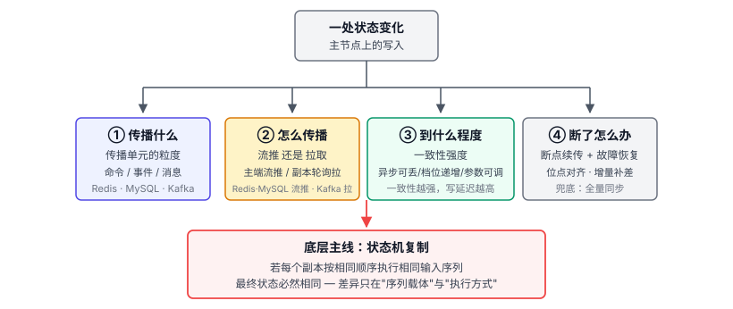
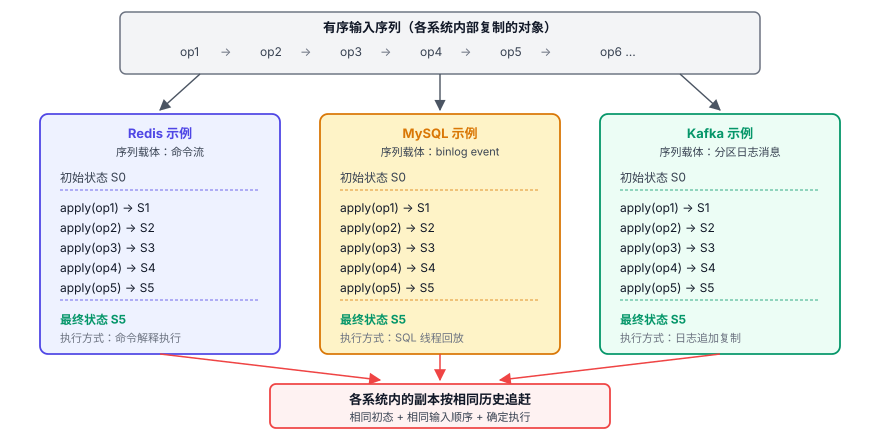
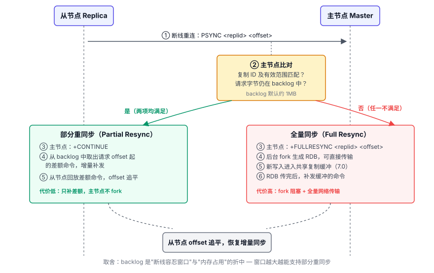
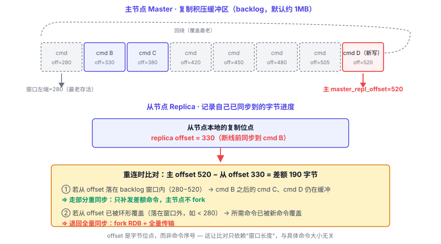
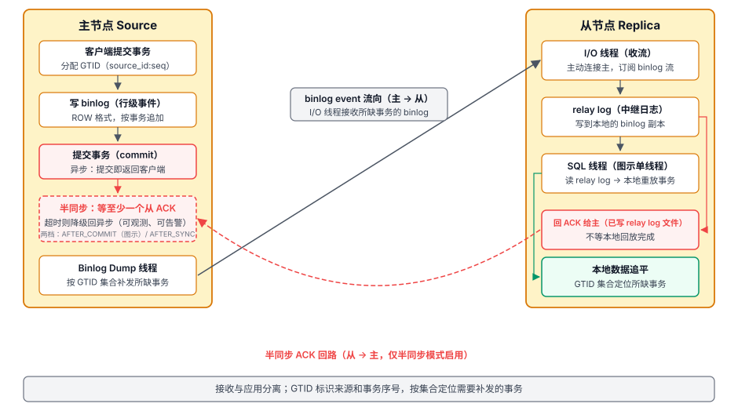
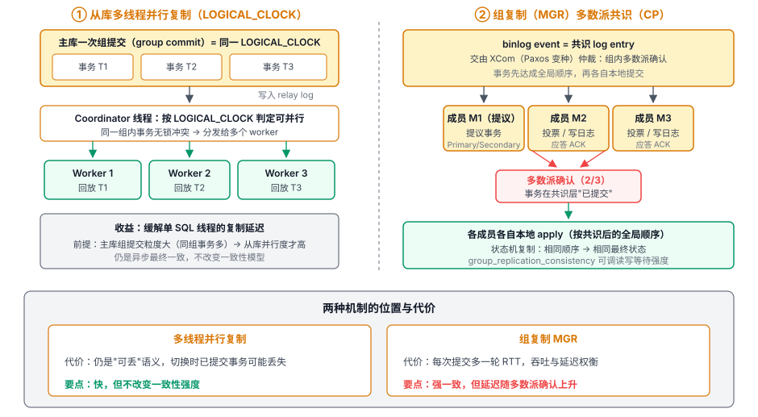
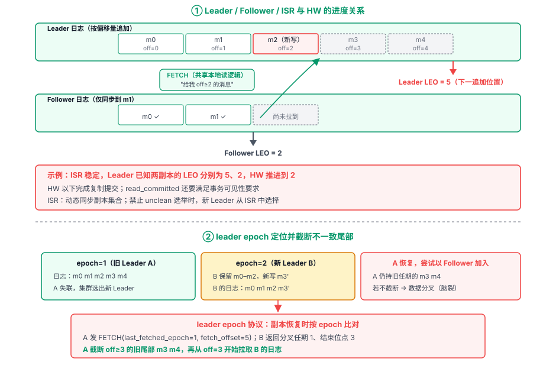

# 第 9 章 数据同步机制 — 集群一致性的实现

## 本章导读

当系统扩展到多副本时，开始有了"多份数据"：主节点带几个从节点、多机房多活、甚至只是 Redis 缓存配着 MySQL 数据库。一旦数据不止一份，一个关键问题随之而来：主节点刚写入的那条记录，从节点什么时候能看到。缓存和数据库不一致时该以谁为准，中间网络断了重连之后又怎么把漏掉的部分补上而不重复。处理不好，轻则用户看到旧数据，重则库存超卖、重复转账。

数据同步要把一处的状态变化传给其他副本，并处理传播延迟和中断。三个软件表面各做各的：Redis 传命令流、MySQL 传 binlog event、Kafka 传有序消息。它们都需要记录变化的顺序、同步进度和所属历史；状态机复制提供了理解这种对齐方式的模型。第 7 章讨论了集群拓扑与选主，本章聚焦主的数据怎么传到副本。PSYNC2、GTID、leader epoch 各自携带不同的进度或历史信息，帮助副本判断从哪里续传、是否需要重新建立数据基线。

我排查过不止一次缓存和数据库不一致的问题。印象最深的一次，用户改了资料，刷新页面看到的还是旧值：写库成功了，缓存没失效。查到最后，是删缓存和写数据库的先后顺序在不同代码路径里不一致。现在涉及多份数据的写路径，我先把"以谁为准、怎么对齐"画清楚再动手。这一章讲的就是这三个软件各自怎么解决这两个问题。

## 9.1 问题的本质

需要提高可用性或分担读请求时，可以增加副本。副本复制需要决定何时向客户端返回成功：异步方式不等待副本，故障转移时可能缺少已提交的写；等待副本确认会延后响应，慢副本或失联也可能使写入失败。数据能否保留、读取能否立即看到新值，还取决于确认的含义、选主和应用规则。

导读里“缓存和数据库谁为准”的问题，讨论的是正本与派生数据的关系，本章小结与第 10 章会给出答案。本章先讲清楚副本之间怎么对齐，不重复上述机制的完整推导，而是从一个工程问题说起：数据同步到底在同步什么？

### 数据同步的四个子问题

把"数据同步"这个大词拆开，背后是四个独立但彼此关联的子问题。

**第一，传播什么。** 一次状态变化，到底把什么东西传给副本？是命令本身（"执行 `SET k v`"）、是事件（"行 k 的值变成了 v"）还是消息（"编号 7 的记录内容是 v"）？传播单元的粒度，决定了下游几乎所有机制。

**第二，怎么传播。** 是一次请求后主端持续推流（Redis、MySQL），还是由副本发起一轮轮拉取（Kafka）？持续推流需要管理发送缓冲与慢副本；主动拉取让副本控制请求节奏，便于按当前需求取一批数据。两种方式都可以批量传输。

**第三，传播到什么程度才算数。** 主节点完成本地操作就向客户端返回，还是要等待副本收到、刷盘或应用？这些确认代表不同的保证。Redis 的 `min-replicas` 根据副本近期的状态限制是否接受写入；MySQL 半同步和 Kafka 的 `acks` 则规定本次写入等待什么确认。确认条件、失败处理与读取规则需要一起看。

**第四，传播断了或乱了怎么办。** 网络中断、副本重启、主节点更换都是必然发生的。中断后能不能不从头再来，从哪里接着传？这要求系统记录同步位点，并能在重启时用它对齐。

图 9-1　数据同步的四个子问题：传播什么、怎么传播、到什么程度、断了怎么办。

这四个子问题可以借助**状态机复制**来理解：从相同的初始状态出发，按相同顺序执行相同输入，并且执行是确定性的，副本才会得到相同状态。Kleppmann《Designing Data-Intensive Applications》在"一致性与共识"一章对此已有展开。三个软件都用日志或命令序列记录变化：Redis 的副本执行命令流，MySQL 的副本回放 binlog event，Kafka 的副本按偏移量复制分区日志。Kafka 提供的复制日志还可以作为上层状态机的输入，三列对照见图 9-2。

图 9-2　状态机复制模型：以三个软件为例，对照输入载体与副本处理方式；各系统内的副本按相同历史追赶。

模型成立的前提是初始状态相同，执行也是确定性的。带随机性或依赖本地时间的操作，需要把确定的结果或有效时间传给副本，才能避免重放时产生差异。Redis 为此在复制链路上改写了哪些命令，见 9.2 节。

> **关键数字**
> 
> **Redis 复制积压缓冲区（backlog）：默认 1MB**。1 万次写/秒、每条约 100 字节的负载下，约覆盖 **1 秒** 的断线窗口（覆盖时长 = backlog 大小 ÷ 写入字节速率；大实例或高写入场景需调大 `repl-backlog-size`）；窗口外断线退回全量同步，代价即 fork 阻塞与内存风险。
> 
> **MySQL 半同步超时：`rpl_semi_sync_source_timeout` 默认 10 秒**。超时后降级为异步，不再等待这项副本确认。降级是可观测的，但需配合告警。
> 
> **Kafka ISR 剔除阈值：`replica.lag.time.max.ms` 默认 30 秒**。副本持续未能追上 Leader，达到相应条件后会被移出 ISR。禁止 unclean 选举时，新主从 ISR 中选择；保留已提交消息还要求始终有同步副本存活。

我遇到过一次线上告警，用户反馈下单后查不到订单。排查发现是主从延迟导致的：主节点写入新订单，从节点还没同步到，用户的查询恰好落在了从节点上。"数据已写入"和"用户能看到"之间有一个时间窗口，事务型和缓存型系统对这个窗口的取舍截然不同。后来我们加了一个写后读一致的路由层，但前提是必须先知道这个窗口的存在。

## 9.2 Redis 的做法

Redis 的同步设计目标是：主节点延迟尽量低，同时把命令流可靠地推送给副本。后续三个设计由此确定：异步、单向、以命令流为日志。

### 传播单元：命令本身

Redis 把传播命令作为复制单元。主节点执行写命令后，把需要传播的命令按 RESP 编码发送给副本；这份命令可能已根据实际执行结果改写，并非总是客户端的原文。副本在相同的起始数据上按顺序执行传播命令，追赶主节点的状态。

这个做法呼应了第 8 章"AOF 持久化文件复用协议格式"的设计：AOF 持久化也记录传播命令。于是 Redis 在持久化和复制中**复用同一种载体**：命令按 RESP 编码后，分别进入 AOF 和复制路径，两条路径可以复用传播逻辑。能用一种日志说清的事，就不引入第二种。

命令流的好处是能复用原有接口：副本侧执行走的就是已有的命令处理路径。代价是需要处理**语义歧义**：比如 `SPOP` 的随机选取、`EXPIRE` 的相对时间，以及依赖时间的 Lua 脚本，直接重放原输入可能产生不同结果。Redis 会按主节点上的执行结果改写传播命令：例如把选中的集合元素转成 `SREM`，把 `EXPIRE`/`EXPIREAT` 的有效过期时间改写为绝对毫秒时间戳 `PEXPIREAT`。Lua 脚本默认采用效果复制（effects replication，5.0 起默认）：传播脚本产生的写命令效果，不让副本重新运行脚本中的非确定性计算。早期默认的逐字复制（verbatim，把脚本源码原样传播）已在 7.0 彻底移除。

### 单向异步：减少写入的确认等待

Redis 复制是**单向异步**的。主节点通常在本地执行写命令后向客户端返回结果，**不等待副本确认**；副本通过长连接接收命令流并追赶。每个副本只有一个上游主节点，也可以继续向下游副本传播，形成树状复制拓扑。

这减少了写入等待副本确认的延迟，但复制仍消耗主节点的 CPU、网络与缓冲空间，慢副本也可能因输出缓冲超限而被断开。代价同样明确：故障转移时，新主可能尚未收到老主已向客户端确认的写，因而丢失这些写。Redis 把副本追赶放在异步路径上，以数据丢失风险换取较少的确认等待；具体风险还受持久化、可写门槛和故障转移条件影响。

### 全量同步：fork 出 RDB，传完补增量

副本第一次连上来，或者增量同步无法进行时，就要做全量同步。流程是：

1. 副本首次连接时发送内部复制协议请求 `PSYNC ? -1`，表示没有可用于续传的复制 ID 与偏移量。主节点安排后台保存，fork 子进程生成 RDB。采用有盘同步时，先生成 RDB 文件再传输；采用无盘同步时，子进程直接向副本连接写出 RDB 数据。Redis 7.0 默认启用 `repl-diskless-sync`。
2. 在 RDB 生成和传输期间，主节点继续处理写入，并保留此后产生的复制流。Redis 7.0 让副本输出和 backlog 引用**同一组共享复制缓冲块**，各副本保留自己的发送进度；两者职责不同，底层字节却不必各存一份。
3. 副本加载 RDB 后，得到主节点 fork 时的数据快照。
4. 主节点继续发送快照之后保留的复制流，副本执行这些增量，逐步追赶。

这里的关键在第二步：fork 是一个时间点，同步过程却会持续一段时间，期间产生的新写也需要传给副本。缓冲保留的是快照之后的复制流，直到副本完成相应的接收。

全量同步还有两项代价：fork 要复制页表，可能造成短暂停顿；子进程运行期间，父进程修改内存页会触发写时复制（COW），额外内存随被修改的页增加，并非 fork 瞬间就复制全部数据。RDB 的网络传输还会消耗主节点出口带宽。全量同步越频繁，这些开销越明显，所以 Redis 重点设计增量同步，减少反复全量。Redis 全量同步与部分重同步的完整分支见图 9-3。

图 9-3　PSYNC2 同时核对复制历史与续传位置：复制 ID 有效且所需字节仍在 backlog 中，才能部分重同步，否则退回全量。

### 增量同步：PSYNC2 与复制积压缓冲区

PSYNC2（Redis 4.0 引入，是对 2.8 版 PSYNC 的加固）解决的是"断线重连能不能不重头"的问题。它靠两个东西：

**第一是 replication offset。** 主节点用 `master_repl_offset` 记录复制流推进到的字节位置；副本用自己的已处理偏移量记录执行进度，`INFO replication` 中对应 `slave_repl_offset`。位点按复制流的字节计数，需要与复制 ID 一起解释，不能只比较不同复制历史下的数字大小。

**第二是复制积压缓冲区（backlog）。** 主节点为断线续传保留最近一段复制流，保留规模由 `repl-backlog-size` 控制，默认约 1MB。Redis 7.0 用共享缓冲块维护这段历史，并逐步回收不再需要的旧块。逻辑上它仍是滑动窗口，实际保留内存还会受到副本引用和块粒度的影响。

副本断线重连时，通过 `PSYNC <replid> <offset>` 发送已知的复制 ID 和希望接收的下一个字节位置。主节点先验证复制历史是否匹配，再检查所需字节是否仍在 backlog 中。

- 条件满足 → **部分重同步（partial resync）**：从请求的位置继续发送保留的复制流，追赶时间取决于落后量和净处理速率。
- 历史不匹配或所需字节已不可得 → 退回全量同步。

backlog 窗口与主从 offset 的位置关系，见图 9-4。

图 9-4　backlog 滑动窗口：在复制历史匹配的前提下，所需字节仍保留时可增量补差；否则需要全量同步。

backlog 默认约 1MB，是"断线容忍窗口"与"内存占用"之间的折中。写入速率相同时，窗口越大，能覆盖越长的网络抖动或副本停顿，但主节点也需要保留更多内存。大流量实例可以结合写入字节速率和常见断线时长，评估是否需要几十 MB 甚至上百 MB 的窗口，目的是减少短断线后的全量同步。

保留窗口覆盖了断线时长，不代表恢复连接后就能立刻追平。设落后量为 B 字节，副本的有效处理速率为 C，主节点同期的写入速率为 W，只有 C 大于 W，副本才有净追赶能力，在速率恒定的假设下，追赶耗时粗略为 `B/(C-W)`：比如落后 120MB、每秒净追赶 2MB，约一分钟追完。C 小于 W 时，副本越落越远，调大 backlog 只能延后问题。前面关键数字框算的覆盖时长，管的是数据还在不在；这里的追赶耗时，管的是追不追得上。两个预算要分开算。

故障转移后，新主会生成新的 replid，把老 replid 保存为 `replid2`，并记录旧复制历史的有效偏移上限。副本拿老 ID 续传时，既要满足这个上限，也要满足 backlog 仍保留所需字节，才能走部分重同步。这放宽了更换主节点后续传的限制。PSYNC2 不只比较字节进度，也把"这段进度属于哪段复制历史"纳入判断。

### 关键取舍：把同步强度做成可写门槛

Redis 提供了一组可写门槛：`min-replicas-to-write N` + `min-replicas-max-lag T`。启用后，主节点接受写入前，要求至少有 N 个处于在线复制状态的副本，而且距离这些副本上次 REPLCONF ACK 的时间不超过 T 秒（主节点按 `server.unixtime - repl_ack_time ≤ T` 判断）。主从复制偏移量之差是字节进度差，可用于监控，但不是 `min-replicas-max-lag` 的判定依据。"字节进度差"和"确认消息的时间"是两套不同度量。

它把"主可以在没有健康副本时继续写"约束成"写入前要有足够多、最近仍在确认的在线副本"。达不到门槛时拒绝写入；通过门槛的写仍以异步方式传播，可能在故障转移时丢失。这是 Redis 在写入路径上增加的一道可观测、可配置的风险控制，不能替代对某次写入的复制确认。

还可以对本连接的先前写入使用 `WAIT N T` 命令（3.0 引入）。在可阻塞的执行上下文中，它等待至少 N 个副本确认本连接此前写入所对应的复制偏移量；T 毫秒超时后返回实际确认数，T 为 0 则不设超时。客户端需要检查返回值。`min-replicas-to-write` 是写入准入门槛，`WAIT` 是对已发出写入追加的确认等待。等待会增加延迟，返回确认也不等于副本已落盘，更不能保证所有故障转移下都不丢数据。

### 级联复制与延迟累积

副本也可以作为下一级副本的主，形成树状（tree）复制拓扑。常见动机是分担主节点的出口带宽：主只推给少数几个一级副本，一级副本再推给二级副本。

代价是延迟随链路深度累积：一级副本落后主一拍，二级副本落后一级一拍，依此类推。对于读副本来说这点延迟通常可接受，但链路深度过大，末端副本读到的状态可能和主差好几个版本，造成用户可感知的"读到了旧数据"问题。

### 故障转移的数据语义

Sentinel 或 Cluster 选出新主后，新主未必拥有老主的全部数据，这是异步复制的必然结果。老主在故障前已经确认给客户端的某些写，可能还没传到新主；老主恢复后以副本身份重新加入，新主会用自己的数据覆盖它。

这就是经典的"已确认的写丢失"：主节点故障时，客户端收到的成功应答可能不再有效。

## 9.3 MySQL 的做法

MySQL 提供异步复制、半同步复制和组复制（MGR），让使用者按业务选择副本确认与事务协调方式。MySQL 的同步以 binlog event 为传播单元，串起了从主从复制到组复制的一整套机制。

### 传播单元：binlog event

MySQL 把**行变更的逻辑日志**作为传播单元。当一条 SQL 改动了行，主节点把它转换成 binlog event：现代主流是 ROW 格式，记录的是"行 k 从值 v1 变成了 v2"这样的行级事件。

选 ROW 而非语句，是因为语句复制有歧义：`UPDATE t SET x = x + 1` 在不同副本上可能影响不同行数（如果副本上数据状态不同），还可能因为非确定性函数产生不同结果。ROW 格式把"最终状态变化"作为事实下发，避免副本重新执行语句时再次解释这些运算。这和 Redis 处理非确定性命令是同一类思路：在源头确定要传播的变更。

代价是日志可能更重：一条 `UPDATE ... WHERE id<100` 如果实际改动了一百行，ROW 格式就需要记录这一百行的变更。多行变更可以合并在一个行事件中，事件数量还取决于行大小等因素。但副本拿到的是具体的行变更，对复制正确性来说，这个代价值得付。

### 传统复制：两段式的收流 + 回放

MySQL 的传统异步复制分为**接收和回放两段**。先以单线程回放为例：

- **I/O 线程（从节点上）**：主动连接主节点，订阅主节点的 binlog 流，把收到的事件写入本地的中继日志。这一段是"收流"：副本发起后，主端 dump 线程把事件流持续推过来。
- **SQL 线程（从节点上）**：读 relay log，按顺序回放事件到本地存储引擎。这一段是"本地回放"。

主节点写 binlog、从节点 I/O 线程拉到 relay log、SQL 线程回放，这条链路见图 9-5。这里有一个微妙的设计点：把网络接收和本地回放分开，让接收可以先行把事件流写入 relay log，回放按本地引擎的速度执行。relay log 缓冲了两者的速度差，但接收仍会受到缓冲空间等资源限制。

图 9-5　异步 / 半同步 / GTID：异步复制完成本地提交后返回，半同步增加 ACK 等待，GTID 以事务标识辅助定位复制进度。

### 异步复制：本地提交不等待副本

默认配置下，MySQL 复制是异步的：主节点完成本地事务提交后就给客户端返回 OK，不等任何副本。半同步增加副本确认，组复制则增加组内事务协调与一致性选项（见下文“半同步复制”一节、第 7 章）。异步方式省去了提交时等待副本的延迟，代价是故障转移时可能缺少已提交事务。

### 半同步复制：可降级的副本确认

半同步（semi-sync）在本地提交路径上增加了副本确认：主节点等至少一个副本的 ACK（确认应答；副本 I/O 线程把事件写入 relay log 并落盘后即回 ACK，不等本地回放）才返回成功。它有两档等待时点。`AFTER_SYNC`（8.0 默认）是主节点先将 binlog 刷盘，等副本 ACK 后再提交到存储引擎。`AFTER_COMMIT` 则先在引擎层提交，再等 ACK。这一档有个危险窗口：事务先在引擎层提交，其他会话已经能读到它；若此刻副本 ACK 还没回来主就崩了，晋升的新主可能没有这笔事务；之前读到它的会话，等于看见数据消失。这是提交可见性与副本确认之间的窗口，不是隔离级别意义上的幻读。

半同步还可降级：等 ACK 超时（`rpl_semi_sync_source_timeout`，默认 10 秒）自动降级回异步，不再阻塞；等待副本数由 `rpl_semi_sync_source_wait_for_replica_count` 控制（默认 1）。

半同步仍有适用边界：超时降级后，提交不再等待副本确认；故障转移时，也必须选择持有已确认事务的副本，并保留、应用其 relay log。事务还未在副本上回放，并不等于它已经丢失。第 7 章 7.3.2 节从集群拓扑角度也提到了这些条件。

从同步的视角看，半同步的一个设计要点是：副本确认可以因超时而暂时取消，但这种降级必须可观测。如果降级默默发生，你以为在半同步其实在异步，故障时才发现缺少数据，为时已晚。MySQL 因此把降级次数、当前是否处于半同步状态都暴露成可观测变量。**正常状态与降级状态同等重要，都得可观测**。Redis 的 `min-replicas` 触发拒绝写入、Kafka 的 ISR 收缩虽然采取了不同动作，也都需要让运维知道保护条件发生了什么变化。

> **说明**：8.0.26 起，半同步相关的 master/slave 命名变量统一重命名为 source/replica（如 `rpl_semi_sync_master_enabled` → `rpl_semi_sync_source_enabled`），旧名变量在过渡期仍可用但已标记弃用。本章统一以新名为准。

### GTID：用事务标识辅助切换复制源

传统复制用“文件名 + 字节偏移”作为位点（比如 `mysql-bin.000123:4567`）。这种位点只对相应复制源的日志有效。换主时，新主的文件名和位置可能不同，故障切换时人工对齐既繁琐又容易出错。

GTID（Global Transaction Identifier，全局事务标识）把位点升级成 `source_id:transaction_id` 的形式：`source_id` 是发起事务的源节点的 UUID，`transaction_id` 是该节点上单调递增的事务序号。启用 GTID 后，已记录事务用这个标识区别于其他来源的事务。

GTID 带来的简化很直接。启用自动定位后，副本把已经接收或提交的 GTID 集合告诉新主，新主从自己的 binlog 中发送副本缺少的事务，不用人工对文件、查偏移。故障切换、级联复制、多源复制（一个副本同时从多个源同步）都因此更容易管理。所需日志如果已被清理，仍要从其他复制源补齐，或用较新的备份重建副本。位点因此成了一个能拿来推理的工具，不再只是内部细节。

### 多线程并行复制：缓解单线程回放瓶颈

单线程回放容易遇到**复制延迟**：主节点并发写入，从节点只有一个 SQL 线程串行追赶；当回放速度持续低于写入速度时，从节点就会越落越远。8.0.27 起，MTS 默认开启 4 个 worker，更早版本默认单线程。

基于 `LOGICAL_CLOCK` 的多线程并行复制利用主节点写入 binlog 的依赖标记 `last_committed` / `sequence_number`，划定可并行回放的事务范围。默认的 `COMMIT_ORDER` 根据主节点上事务提交窗口是否重叠来生成这些依赖，不只限于同一次组提交。`WRITESET` 还可以根据写集识别互不冲突的事务，扩大可并行范围。副本按主节点提供的依赖信息调度，无须重新推导全部行级依赖。

配合 `replica_parallel_workers`（8.0.26 前为 `slave_parallel_workers`）、`replica_parallel_type=LOGICAL_CLOCK` 等参数，并行回放可以缓解复制延迟。实际收益取决于依赖信息、事务冲突、worker 数量和回放资源。使用 `COMMIT_ORDER` 时，主库并发低会限制可识别的并行范围；使用 `WRITESET` 可以放宽这项限制，但存在依赖的事务仍需等待。并行复制与 MGR 共识的关系见图 9-6。

图 9-6　并行回放与 MGR：从节点按依赖标记调度回放，MGR 通过组通信建立事务顺序，再进行认证和提交。

### 组复制（MGR）：把复制升级为共识

MGR（MySQL Group Replication）在复制链路中加入组内事务协调。读写事务准备提交时，节点广播行变更及对应写集，由基于 Paxos 的 XCom 提供组通信和全序消息传递，再由各成员按这个顺序进行冲突认证。通过认证的事务才能提交。

组通信需要多数派才能继续作出决定，因此少数成员故障时，只要剩余成员仍能形成多数派，组就能继续运行。事务通过认证后，发起节点提交本地事务，其他成员接收并应用远端事务。共识确定的事务顺序，并不意味着每个成员在同一时刻都已应用到同一位置。

组通信与认证增加了提交等待，但跨成员读取是否需要追平，还由 `group_replication_consistency` 控制。MySQL 8.0 默认 `EVENTUAL`（不额外等待）；`BEFORE_ON_PRIMARY_FAILOVER` 在主切换后等待新主应用积压事务；`BEFORE` 在事务执行前等待本节点应用先前事务；`AFTER` 让读写事务等待其变更在其他 ONLINE 成员上应用；`BEFORE_AND_AFTER` 同时提供前后两种等待。`BEFORE` 对只读和读写事务都生效，可以按场景选择。

### 分布式恢复：新成员怎么追上

新成员加入 MGR 时，要从现有成员（donor）补齐缺失的数据。binlog 仍可用时，默认走增量恢复；`group_replication_clone_threshold` 的默认值是 GTID 事务序号上限，实际上不会仅因缺口大而触发 clone。若所需 binlog 已被清理，或缺口超过调低后的阈值，MGR 会尝试使用 8.0.17+ 的 clone 插件，前提是 donor 和新成员已配置好克隆所需的插件、权限及兼容环境。克隆以 donor 的物理数据建立基线，重启后再用 binlog 追平克隆期间的新事务。这是“先全量再增量”的做法：先拿到基线，再补上期间的增量，思路和 Redis 的“RDB 快照 + 期间增量补发”相近。

### 取舍总结

MySQL 在数据同步上提供了不同选择：异步复制不等待副本，半同步增加可超时降级的接收确认，组复制增加组内事务协调和可配置的一致性等待。业务方需要分别判断确认范围、故障转移条件和读取要求。Redis 默认使用异步复制，另有参数按副本状态限制写入，也可以使用 `WAIT` 命令，等待副本确认本连接此前的写入（均见 9.2 节）。

## 9.4 Kafka 的做法

Kafka 本身就是围绕"日志"构建的系统。当别的系统要想办法把状态变化封装进某种传播单元时，Kafka 的传播单元就是它的原生数据结构：分区日志里按偏移量追加的消息。这让 Kafka 的复制机制变得简洁：副本就是分区日志的一份拷贝，同步就是把这份日志从 Leader 拷到 Follower。

### 传播单元：按分区有序的消息

Kafka 的传播单元是**消息**。每个分区（partition）是一个独立的、按偏移量（offset）有序的追加日志。Leader 为追加的消息分配偏移量，副本按这个顺序复制。尚未提交的日志尾部在换主时可能被截断；已提交部分的保留还依赖副本和选主条件。

这一点和第 5 章 Kafka 存储层的 Log 抽象直接呼应：每个分区的日志都提供一条有序序列，可以作为副本共同复制的输入。不同分区之间并没有由 offset 建立的统一顺序。

### 拉模式：复用本地日志读取逻辑

Kafka 复制用的是**拉模式**：Follower 主动向 Leader 发 `FETCH` 请求拉取日志。这和 Redis、MySQL"副本发起后主端流推"都不同。

**Follower 与消费者的 FETCH 复用本地日志的读取逻辑**，但 Leader 会区分请求角色。Follower 可以拉取到 LEO，其请求还用于更新副本进度；消费者的读取受 HW 约束，使用 `read_committed` 时还受事务稳定边界 LSO 约束。请求中的 `replica_id` 可区分副本与普通消费者：Follower 填自己的 broker id，普通消费者填 -1。两类请求可以共享页缓存、批量读取等底层优化；本地文件传输在条件满足时还能使用零拷贝。第 5 章的分层思想在这里体现为：上层职责不同，底层日志读取仍可复用。

拉模式让 Follower 自己掌握追赶节奏，但副本数量多时，大量 FETCH 请求会集中在 Leader 上。Kafka 的应对是批量化（一次 FETCH 拉一批日志）和页缓存（命中时可从内存读取，未命中时仍需磁盘 I/O）。3.9 的 Tiered Storage 已可用于生产，冷段可卸载到远程存储。消费者可以读取远程段；Follower 的 FETCH 仍由 Leader 的本地日志提供消息。若所需数据已移到远程层，副本会从远程段恢复 leader epoch、生产者快照等辅助状态，再从对应远程段之后继续拉取本地日志（详见第 8 章 8.4.6 节）。本地保留窗口覆盖副本的落后量，有助于避免这条较复杂的追赶路径。

### LEO、HW 与 ISR：同步进度的度量

Kafka 用 LEO（Log End Offset，日志末端偏移量）和 HW（High Watermark，高水位）描述副本的同步进度，用 ISR（同步副本集合）框定"谁算跟上"。ISR 的定义与动态进出机制已在第 7 章 7.4.2 节展开；LEO 与 HW 的语义定义就在这里给出。

从同步视角看，LEO 是副本下一条消息的追加位置，HW 是复制提交的边界。Leader 根据 FETCH 中获知的副本进度和 ISR 状态推进 HW，不能直接看到所有副本此刻的实际 LEO。ISR 稳定且满足最小副本数要求时，较慢副本的已知进度会限制 HW 的推进。副本长时间未追上 Leader，超过 `replica.lag.time.max.ms` 后会被移出 ISR，随后按调整后的集合推进。HW 以下的记录已完成复制提交；消费者是否能返回其中的事务记录，还取决于隔离级别。Leader、Follower、ISR 与 HW 的时间关系见图 9-7。

图 9-7　HW 与 leader epoch：Leader 根据副本反馈的进度推进 HW；leader epoch 标识任期边界，帮助恢复中的副本定位并截断不一致尾部。

### leader epoch：定位旧 Leader 日志中的分叉

旧 Leader 恢复后，可能带回与新 Leader 不一致的日志尾部。场景是这样的：Leader A 在任期 1 写了几条消息后失联，集群选出 Leader B 进入任期 2，B 又写了几条；此时 A 恢复，仍保存着任期 1 的本地日志，需要先与当前 Leader 对齐。

Kafka 用 **leader epoch**（单调递增的任期号）标识日志的任期边界。分区的 `leader-epoch-checkpoint` 文件记录任期号和该任期的起始偏移量。副本重新追随时，可以在 FETCH 请求中带上最后已获取记录的任期和下一次拉取的偏移量；Leader 检查是否分叉，必要时返回 `diverging_epoch` 中的任期及结束偏移量。副本据此定位共同日志的边界，截断不一致尾部，再继续拉取。任期边界也可通过 `OffsetsForLeaderEpoch` 请求查询。

leader epoch 补充了 offset 所没有的历史信息：相同偏移量在不同任期可能对应不同的日志内容。Redis 的 replid 也用于区分复制历史；MySQL 的 GTID 则标识事务来源和事务身份。它们都让位点带上了可核对的来源信息，但各自标识的对象不同。

### acks 参数：生产者的写入确认要求

Kafka 通过生产者侧的 `acks` 参数（0 / 1 / all 三档）设置写入确认要求。`acks=all` 等待当前 ISR 中的副本确认，并配合 `min.insync.replicas` 检查 ISR 是否达到最低数量；达到最低数量后，`all` 仍要求当前 ISR 全部确认。确认复制也不等于各副本已逐条执行 fsync。三档的完整定义与 3.0 起默认 `acks=all` 的定位调整，已在第 7 章 7.4.3 节展开。

`acks=all` + `min.insync.replicas` 与 MySQL 半同步在**降级语义**上存在关键差别：MySQL 半同步确认超时后可降级为异步；Kafka 在 ISR 不足最低要求时会拒绝这类写入。两款软件在确认条件无法满足时，采取了不同的处理方式。这里没有标准答案，但有我的倾向：写路径碰钱和库存时，我站 Kafka 这边，宁可写失败让业务立刻感知，也不要超时后静默降级；日志、监控这类丢了能补的，降级才划算。一个常见的配置是副本数 3、`min.insync.replicas=2`、`acks=all`：它可在一个副本故障后继续写入；保留已确认数据还要求始终有同步副本存活，并避免从缺少这些数据的副本选主。

### unclean leader 选举：数据保留与恢复可用性的取舍

`unclean.leader.election.enable` 控制是否允许**非 ISR 副本**当选 Leader。没有可用的 ISR 成员时，这个开关决定是否接受从落后日志恢复服务的风险：

- **允许（true）**：ISR 全挂时，从落后副本中选一个当 Leader，系统恢复可用，但新 Leader 缺少的消息可能丢失，其中也可能包括原先已提交、位于 HW 以下的消息——可用性优先。
- **禁止（false，3.x 默认）**：ISR 全挂时宁可不选主，等待 ISR 成员恢复，分区在此期间不可用。（这个默认值自 0.11 起就由 true 改为 false，KIP-106，3.x 沿用。）

默认值的演变反映了对数据保留的重视。这个开关让业务在等待合格副本恢复与接受日志缺失风险之间作出明确选择。

### KRaft：元数据也采用复制日志

Kafka 用 KRaft（Kafka Raft）替代 ZooKeeper 管理集群元数据：KRaft 自 2.8 作为预览特性引入，在 3.3 对新集群达到生产可用状态。**元数据本身也是一条 Raft 复制日志**，由 Controller quorum 维护。它和数据分区都使用日志、Leader、副本与任期信息，但确认规则不同：KRaft 使用多数派共识，数据分区按 ISR 机制推进复制提交。两者复用了日志化状态管理的思路，并不是同一套复制协议。

### 幂等与事务：处理重试与跨分区提交

生产者幂等（`enable.idempotence=true`）处理重试导致的重复追加，事务则把多项 Kafka 写入纳入同一提交单元。

幂等使用 ProducerId、ProducerEpoch 和按分区维护的序列号，消息批次携带 BaseSequence。Broker 据此识别生产者的重复重试，避免在日志中再次追加同一批数据。它不负责识别应用重新发送的相同业务内容，也不保证消费处理只执行一次。开启事务（设置 `transactional.id`）会隐含启用幂等；反过来，仅开幂等不会自动启动事务。

事务由 transaction coordinator 协调，可以包含跨分区写入及消费 offset 的更新。提交或中止结果通过控制记录传播。使用 `read_committed` 的消费者只返回已提交事务的记录，并跳过中止事务；默认的 `read_uncommitted` 仍可能返回未提交或已中止事务的记录。事务提交结果与消费者的隔离级别共同决定哪些记录能被返回。

事务甚至能把消费 offset 纳入同一个提交单元，纳入不了的是外部系统的处理结果。消费端需要区分三件事：当前读取位置、已提交的 offset、业务系统里这条记录的处理结果；前两种由客户端管理，第三种在 Kafka 之外。因此，提交位置必须遵守一条规则：能提交的只有已交付记录中处理完成的前缀。并行处理时后一条先完成，不能越过前面还没处理完的记录去提交，否则重启后那条消息会被直接跳过。我写消费者默认按分区顺序处理完再提交，接受消费并行度降低，换来这条规则自动成立。

### 取舍总结

Kafka 的取舍思路是：**把写入确认、准入条件和故障选主要求分别交给配置控制**。`acks`、`min.insync.replicas`、`unclean.leader.election.enable`、ISR 阈值各有作用，组合起来决定相应场景下的等待、失败和数据保留行为。

## 9.5 横向对比

表 9-1 从六个维度对比三个软件的同步机制。

**表 9-1　三个软件数据同步机制横向对比**

| 维度 | Redis | MySQL | Kafka |
|------|-------|-------|-------|
| 传播单元 | 命令流（必要时改写为确定操作） | binlog event（默认 ROW 行级） | 消息（按分区偏移量有序） |
| 传播方式 | 副本发起后持续流推（复制缓冲） | 副本发起后持续流推（relay log 缓冲，接收与回放分离） | FETCH 请求-响应（副本发起拉取） |
| 确认与协调 | 默认异步；WAIT 可等待此前写入的副本确认 | 异步、半同步确认或 MGR 组内协调；读等待另有配置 | ISR + acks + min ISR；选主与事务读取另有条件 |
| 位点语义 | replid + replication offset（历史与字节进度） | GTID 集合（事务来源与已处理事务） | 分区 offset + leader epoch |
| 故障恢复条件 | 历史匹配且所需日志仍在 backlog，才能部分重同步 | GTID 自动定位需有可补发日志；组复制可按条件克隆 | 以任期检查分叉，再从有效保留范围追赶 |
| 建立副本基线的代价 | fork 与 RDB 传输，保存期间的写入可能带来 COW 开销 | 备份恢复或按条件克隆，再补所需 binlog | 获取分区保留日志及必要辅助状态 |

### 解读一：传播单元的选择决定下游设计

传播单元是多数下游设计的起点。

Redis 走命令流这条路，看重的是轻：序列化开销小、副本直接复用命令处理路径，但非确定性命令得在源头改写。MySQL 的 ROW 格式记录行变更，减少了副本重新执行 SQL 时产生不同结果的风险，代价是日志可能更大。Kafka 则由分区 Leader 确定追加顺序，副本复制这条日志；应用可以追加新记录表示状态变化，在启用 compaction 的主题中，还可以用 tombstone 表示删除。

传播单元定下来后，传播方式、位点形态、故障恢复粒度会高度耦合。

### 解读二：位点（offset / GTID / leader epoch）是同步的通用度量

三个软件的位点各走一路：

- Redis 用 replid 区分复制历史，用 replication offset 表示该历史中的字节进度；
- MySQL 的 GTID 标识事务来源与事务序号，跨来源的进度用集合表示；
- Kafka 的 offset 表示分区内的位置，leader epoch 用于核对这段日志的任期历史。

### 解读三：一致性的位置差异

三个软件提供了不同的确认与故障处理方式。Redis 默认异步复制，并提供写入准入限制和显式等待确认；MySQL 可在异步复制上增加半同步确认，或通过 MGR 进行组内事务协调；Kafka 则分别配置写入确认、副本准入和选主条件。这些机制回应了不同的需求：减少等待、保留已确认数据、控制故障时是否继续服务。选型时需要看清业务要的是哪一种保证。

## 9.6 架构启示

复制系统的设计，说到底都围着一件事转：写丢了怎么办。

### 启示一：数据同步的本质是状态机复制

从相同状态出发，按相同顺序确定性地执行输入，副本才能得到相同状态。追赶落后较多的副本时，可以先建立数据基线，再传输后续变化：Redis 使用 RDB，MySQL 可以恢复备份或克隆数据，Kafka 获取分区保留日志及相关状态。基线与增量必须衔接到同一份历史，重放也要遵守相应的顺序和应用规则。

### 启示二：位点是断点续传的基础

同步进度怎么表示，是这个机制要解决的头一个问题（三个软件的位点形态见 9.5 解读二）。位点帮助副本找到续传起点；对应历史匹配、所需日志仍然保留时，系统才有条件补发缺少的部分。记录位点、保留日志和核对历史，需要一起设计。

好的位点需要标清所属的日志或事务来源，能识别已经处理的范围，并在重启和切主后用于比对。GTID 用源节点 UUID 和事务序号标识事务，用集合记录已经执行的范围；不同源节点的 GTID 不构成一条全局递增序列。Redis 用 replid 配合复制偏移量标识复制流，Kafka 用分区、offset 与 leader epoch 识别日志位置及任期。我自己设计同步系统时，会**先把位点想清楚**，其他问题也会随之清晰。

### 启示三：增量同步必须先解决断点续传

全量同步是建立数据基线的一种手段。三个软件都在"怎么让断线尽量走增量"上投入了大量设计：Redis 的 PSYNC2 + backlog、MySQL 的 GTID 自动定位、Kafka 的 offset + leader epoch 检查，都是为了识别已有历史，补齐缺少的内容，避免不必要的重建。

原因在于重建副本可能代价很大。Redis 全量同步需要 fork 和 RDB 传输；MySQL 可通过备份或克隆建立基线，再回放此后的 binlog；Kafka 需要取得分区保留范围内的日志及相关状态。频繁重建会消耗主节点资源和带宽，延长恢复时间。所以设计原则是：**能增量就别全量**。这要求复制历史能够核对，所需日志的保留窗口足够覆盖常见断线时间。

### 启示四：把延迟预算与确认要求一起确定

第 7 章从集群选型讨论过可用性和数据保留的取舍，这里把它落到复制设计上。MySQL 的半同步超时参数（默认 10 秒）限制的是副本确认等待；超时后降级为异步，它不是整个事务响应时间的上限。我自己设计复制系统时，会把保证与等待放在一起考虑：业务需要保留什么数据、允许看到多旧的结果，以及为这些保证能承受多少等待。确认条件无法满足时，还要明确是失败、继续等待，还是允许降级。

### 启示五：故障恢复是同步的反向问题

同步传递持续发生的变化，恢复则需要先确认落后副本可以从哪里继续。二者会复用日志、位点和历史检查：Redis 故障转移后重连，用 PSYNC2 核对 replid 与 offset；MySQL 组复制成员按 GTID 补差，在日志不可用或达到配置阈值等条件下可选择克隆；Kafka 副本检查任期分叉，再继续 FETCH 追赶。

一套设计良好的同步机制，通常也构成恢复机制的坚实基础。日志能够重放、位点能够核对、分叉有处理依据，恢复就可以复用已有路径；实际恢复还需要可用的数据来源。反过来，同步机制没有处理好的历史冲突和日志缺失，往往也会在故障恢复时暴露出来。

### 反模式提醒

- **同步链路过深致延迟累积**：Redis 链式副本拉得太长、MySQL 级联复制层级太多，末端副本读到的是几个版本前的状态。我会控制拓扑深度，宁可主节点出口带宽多用一些，也不让延迟在链路上无限累积。
- **续传信息不足导致副本重建**：backlog 太小、所需日志已被清理、位点元数据损坏，都可能使原有续传路径失效。位点记录与日志保留范围需要一起检查。
- **忽视历史分叉导致数据冲突**：旧副本带回不同历史中的日志，不能直接按相同位置继续拼接。replid、GTID、leader epoch 提供不同的历史或事务标识，还需要配合相应的核对、补差或截断规则。

## 9.7 小结

数据放一份不够，就需要说明多份数据怎样对齐：Redis 用命令流、MySQL 用 binlog event、Kafka 以分区日志消息为载体。状态机复制提供了一个理解框架：共同的初始状态、相同的有序输入和确定性执行，才能导出相同状态；具体系统还要落实日志保留与故障处理规则。

本章围绕四个问题展开：传播单元（传什么）、传播方式（怎么传）、确认条件（传到什么程度才算数）、故障恢复（断了怎么续）。位点和历史标识贯穿其中，帮助副本记录进度、判断是否还能续传。

确认、应用可见性和故障后的数据保留，分别有自己的条件。这三个软件通过协议、参数和默认值提供不同选择，需要与业务的等待预算和失败处理要求一起确定。

导读里"缓存和数据库不一致时该以谁为准"的答案不在多副本，而在正本（source of truth）：数据库是正本、缓存是可重建的派生数据。

本章的状态机复制和位点对齐，是第 10 章规律五的核心印证。
