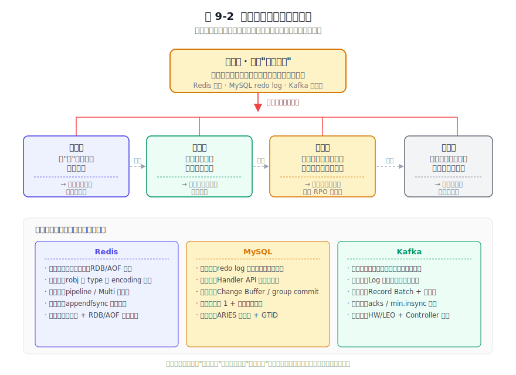
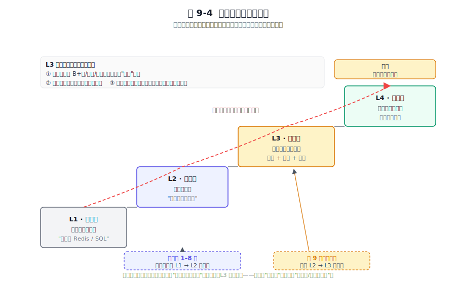

# 第 9 章 万法归一 —— 架构设计的共性规律与取舍之道

## 本章导读

前八章，我们把 Redis、MySQL、Kafka 放在七个主题的同一张答卷上"同题作答"：生命周期、内存与磁盘、分层架构、安全、集群、存储格式、数据同步（第 1 章引言定调，第 2–8 章逐题作答）。三家交出的答案差异巨大，甚至常常背道而驰。但这些差异底下，是否藏着同一套"骨架"？这个问题值得追问，因为会背三家的特性并不等于会做架构决策；只有把"它们为什么这样选"抽象成规律，规律才能迁移到你自己的系统上。读完本章，你会拿到三样东西：一张可复用的"架构共性地图"，一套能把规律翻译成选择的取舍框架，以及一条从使用者走向设计者的认知路径。本章不再深入单一机制，转而对全书做一次提炼。

---

## 9.1 八章一镜照：前八章核心启示复盘

八章八问，每章都在回答同一个母题的不同切面 —— "如何在约束下做出取舍"。我们不逐章复述机制，而是把每章最值得带走的一句话启示，连同三家在该主题上的关键决策，收敛成一张"八章启示总表"，作为后文提炼规律的素材库。

### 9.1.1 一张表收束八章

下表把第 1 到第 8 章的【核心问题 / Redis 决策 / MySQL 决策 / Kafka 决策 / 一句话共性启示】压缩进同一张坐标系。读法建议先竖着看一列、再横着看一行：竖看能看出三家的"性格"，横看能看出每一主题的"母题"。

**表 9-1 八章启示总表**

| 章 | 核心问题 | Redis 的关键决策 | MySQL 的关键决策 | Kafka 的关键决策 | 一句话共性启示 |
|---|---|---|---|---|---|
| 第 1 章 引言 | 选哪三款软件做样本 | 内存型代表 | 持久化型代表 | 流式型代表 | 范式互补才有研究价值，差异越大共性越显形 |
| 第 2 章 生命周期 | 启动关闭如何不丢状态 | RDB/AOF 重放重建内存 | redo + binlog 两阶段提交保提交一致；崩溃恢复重放 redo、回滚 undo | Controller 选举 + 日志截断到 HW | 启动与关闭不是"开关"，而是"状态机迁移" |
| 第 3 章 内存与磁盘 | 谁是真相之源 | 内存为家、磁盘是保险 | 磁盘为家、内存是缓冲池 | 磁盘日志为家、Page Cache 加速 | 持久化与性能的对立是表象，真相是"谁说了算" |
| 第 4 章 分层架构 | 怎么让系统可替换 | robj type/encoding 解耦直连 | THD + Handler 虚函数（可插拔引擎） | RequestChannel 队列 + 网络协议 | 分层是为了让"可替换"成为可能，层间通信决定演进自由度 |
| 第 5 章 安全 | 主体能对客体做什么 | 从无密码演进到 ACL | 细粒度 grant 表刻进数据字典 | SASL + ACL + 端到端 TLS | 安全是与权限模型同源的能力边界，越早建模演进越省 |
| 第 6 章 集群 | 多副本怎么一致 | 主从 → Sentinel → Cluster 槽分片 + Gossip | 异步 → 半同步 → MGR（Paxos 类多数派） | Partition + ISR + KRaft（去 ZooKeeper） | 没有"一步到位的分布式"，只有按一致性需求逐级抬价的阶梯 |
| 第 7 章 存储格式 | 字节怎么摆才好访问 | RDB/AOF 为"全量加载 + 增量回放"优化 | 16KB 页 + B+树为"点查 + 范围扫描"优化 | Segment + 稀疏索引为"顺序追加 + 位移定位"优化 | 存储单元要对齐访问单元，格式发布即长期债务 |
| 第 8 章 数据同步 | 怎么让两个状态机一致 | PSYNC（部分重同步 + 全量兜底） | binlog + GTID（基于事务的精确位点） | ISR + leader epoch 截断 + acks/幂等/事务 | 复制不是"抄数据"，是用可比的进度坐标（复制偏移量/GTID/位移）对齐状态机 |

这张表里的共性启示列，是 9.2 节要提炼规律的原料；关键决策列，是 9.3 节要抽出取舍维度的原料。八条启示串起来只有一条主线 —— **"约束决定边界，目标决定取舍的方向"**。每家都面对同样的物理约束（内存有限、磁盘慢、网络会分区、机器会宕），但每家优先保证的目标不同，于是形成了三种取向：Redis 在乎快，MySQL 在乎对，Kafka 在乎多。

### 9.1.2 八章逐条回扣

为了把抽象的"主线"落回具体，下面为前八章各写一段"启示回扣"，每段的结构固定为：该章解决什么问题 → 三家分别做了什么选择 → 抽出的一句共性启示。

**回扣第 1 章（引言）**。第 1 章没有讲机制，它讲的是"选样"：为什么是 Redis、MySQL、Kafka 这三款。答案是它们正好代言了"内存型 / 持久化型 / 流式型"三类后端基础设施，范式互补、目标冲突，因而把它们放在同一张答卷上，共性才会被差异逼出来。如果换成三款都是关系型数据库，共性研究就退化成"复述"。启示是 —— **研究共性必须先选好差异足够的样本，选样正当性来自范式互补**。

**回扣第 2 章（生命周期管理）**。这一章问的是：一个持有状态的进程，怎么做到启动时恢复、关闭时干净。三家的选择不同：Redis 用 `loadData` 读取 RDB/AOF 重建键空间；MySQL 用 redo log + binlog 的两阶段提交保证提交时的崩溃一致，再在崩溃恢复阶段重放 redo log（重做已提交、用 undo log 回滚未提交），确保已提交事务不丢、未提交事务不留痕；Kafka 用 Controller 主导的 leader 选举，把每个分区的高水位（HW）之前的日志视为已提交，截断之后的脏日志。三家机制不同，但同一句话能概括它们 —— **任何持有状态的进程，启动与关闭本质上都是一次状态机迁移**。

**回扣第 3 章（内存与磁盘）**。三家都在"快（内存）"与"稳（磁盘）"之间走钢丝，但落点截然不同。Redis 以内存为家、磁盘是保险（RDB/AOF 只是内存的派生快照）；MySQL 以磁盘为家、内存是缓存（缓冲池是磁盘页的派生副本，redo log 才是真相）；Kafka 把磁盘当日志本体，靠 Page Cache 与零拷贝让磁盘"快得像内存"。差异背后是同一个判断题 —— **持久化与性能的对立只是表象，真正的变量是"谁是真相之源"**。

**回扣第 4 章（分层架构）**。三家都把系统切成"交互层 / 逻辑层 / 存储层"，差异在层与层之间怎么说话。Redis 用对象指针直连，因为单进程内存模型不需要协议；MySQL 用 THD 上下文 + Handler 虚函数，让 InnoDB/MyISAM 这类存储引擎可插拔；Kafka 用 RequestChannel 队列加二进制网络协议，让 broker 之间、客户端与 broker 之间都通过消息解耦。启示 —— **分层不是为了好看，是为了让"可替换"成为可能；层间通信方式决定了系统的演进自由度**。

**回扣第 5 章（安全机制）**。安全被拆成身份认证、授权、传输加密、审计四件事，但底层只有一组三元组：主体、客体、操作。Redis 从早期"无密码"演进到 ACL（6.0 引入，7.x 继续增强按用户/键空间细粒度授权），把"哪个连接能执行哪些命令、能访问哪些键"显式建模；MySQL 把权限刻进数据字典的细粒度 grant 表，按库、表、列、例程逐层授权；Kafka 用 SASL 做认证、ACL 做授权、TLS 做传输加密，三者各司其职。启示 —— **安全机制不是后加的补丁，而是与权限模型同源的能力边界；越早把"主体-客体-操作"三元组建模进系统，演进成本越低**。

**回扣第 6 章（集群架构）**。从单点走向分布式的路径上，三家走了不同的步数。Redis 走了三步：主从复制、Sentinel 哨兵、Cluster（槽位分片 + Gossip 协议）；MySQL 走了三步：异步复制、半同步复制、组复制 MGR（基于 Paxos 类多数派协议）；Kafka 用 Partition + ISR + KRaft，把分区当成一致性单元、把 ISR 当成多数派的实战形式、用 KRaft 摆脱对 ZooKeeper 的依赖。三家走出不同的步数，是因为每一步都在为更强的一致性付更多的确认延迟。启示 —— **没有"一步到位的分布式"，只有"按一致性需求逐级抬价"的演进阶梯；选哪一级，取决于你能承受多少确认延迟**。

**回扣第 7 章（磁盘存储格式）**。存储格式是为"主访问路径"量身定做的，每一种格式都对应一种被偏爱的访问模式。Redis 的 RDB/AOF 为"全量加载 + 增量回放"优化，加载是低频动作，所以可以接受二进制紧凑但不易随机读取；MySQL 的 16KB 页 + B+树为"随机点查 + 范围扫描"优化，所以页要对齐 IO 粒度、树要矮、叶子要顺序链表；Kafka 的 Segment + 稀疏索引为"顺序追加 + 位移定位"优化，所以索引只记里程碑、定位靠二分加顺序扫描兜底。启示 —— **存储单元要对齐访问单元；格式一旦发布就是长期债务，改一次就要背负一轮兼容**。

**回扣第 8 章（数据同步）**。复制是分布式一致性的载体，但很多人误以为复制是"把数据抄一份"。三家的机制戳穿了这个误解：Redis 的 PSYNC 用复制偏移量和复制积压缓冲区做部分重同步，断线短就续传、断线长才全量；MySQL 用 binlog + GTID，把每个事务的全局唯一标识当位点，让从库能精确回答"我复制到了哪里、下一步该跳过哪些事务"；Kafka 用 ISR 决定哪些副本算"够新"，用 leader epoch 截断老 Leader 复活留下的脑裂尾部，用 acks 与幂等/事务把"至少一次"撑到"恰好一次"。启示 —— **复制不是"抄数据"，而是"用一个可比较的进度坐标（复制偏移量/GTID/位移）把两个状态机对齐"**。

八章回扣到此，主线已经清晰：每一家都在"约束"给定的边界内，押上自己最看重的注。下一节，我们把这八条启示蒸馏成五条更通用的规律。

---

## 9.2 共性规律：三家用不同语言讲同一套骨架

如果说 9.1 是把八章摊开看，9.2 就是把它们叠在一起看 —— 重影处，就是共性。下面把八章的启示蒸馏成五条可复用的架构共性规律。每条规律的结构固定为：一句话总结（可被引用）+ 三家印证 + 一段"换你做会怎样"。

### 9.2.1 规律一：先定"真相之源"，其余皆为派生

> **箴言：系统里只能有一个真相之源（source of truth），其他全是它的派生物。派生物可以丢，真相之源不能丢。**

三家用不同的说法讲同一句话。Redis 说内存是真相，RDB/AOF 只是内存派生的快照 —— 所以 Redis 崩溃可以容忍丢几秒（取决于 `appendfsync`），但不能容忍内存里的键值对算错。MySQL 说磁盘上的 redo log 是真相之源，缓冲池里的脏页只是 redo log 的派生物 —— 所以缓冲池脏页丢了无所谓，redo log 不能丢；`innodb_flush_log_at_trx_commit=1` 守护的是 redo log 不丢，双写缓冲则守护"脏页落盘时不被撕裂"这一前提（撕裂的页 redo 也救不回来）。Kafka 说磁盘上的日志 Segment 是真相之源，Page Cache 与消费者位移都是派生物 —— 所以日志是"家"，副本只是"抄家"，消费者位移甚至可以丢，因为它可以重放日志重新算出来。

换你做会怎样：设计任何有状态系统，第一件事先回答"谁是真相之源"，而不是急着画架构图。这个答案一旦模糊，故障恢复就会失控 —— 因为恢复时你不知道该信谁。一个常见的反例是把缓存和数据库都当真相之源，结果两者不一致时系统行为不可预测。规律一在告诉你：派生物可以重建，真相之源必须被守护，二者不能颠倒。

### 9.2.2 规律二：用"层"把可变性关进笼子

> **箴言：可变的细节用层包起来，稳定的契约留在层与层之间。**

层是工程上对抗变化的工具，三家各显神通。Redis 的 redisObject 把"语义类型（type）"和"底层编码（encoding）"解耦 —— 同一个 hash 语义，底层可以是 listpack 也可以是 hashtable，逻辑层只认 type，存储层管 encoding，于是 Redis 能根据数据大小动态换底层结构而不动上层逻辑。代价是一次类型检查的间接寻址。MySQL 的 Handler API 把存储引擎做成可插拔的层 —— Server 层（解析、优化、执行）稳定，InnoDB、MyISAM 可替换；同一个 SQL 能在引擎间迁移，因为契约在 Handler 接口上。代价是虚函数调用与跨层上下文（THD）传递。Kafka 把 Log 抽象成接口，UnifiedLog / Partition / Segment 分层 —— 上层 API 不关心 Segment 怎么切，Tiered Storage 能把冷段挪到对象存储而无需改动上层读写路径。代价是分层带来的间接性。

换你做会怎样：当你在两套实现之间犹豫，先抽接口。接口稳定了，实现可以一个一个换、一个一个演进，而不会牵一发动全身。规律二的潜台词是 —— **稳定的契约向内收敛，多变的实现向外发散**，这是一个比"高内聚低耦合"更可操作的判据：层与层之间只该交换契约，不该交换实现细节。

### 9.2.3 规律三：把随机变成顺序，把一次变成一批

> **箴言：硬件偏爱顺序与批量；架构的聪明，常常就是替硬件把随机改写成顺序、把单条改写成批量。**

这条规律在三家的性能优化里反复出现。Redis 的管道（pipeline）与 Multi/Exec 把 N 次网络往返压成 1 次 RTT，AOF 重写把碎片化的历史命令重新压实成一份快照，本质都是"把一次变成一批"。MySQL 的 Change Buffer 把对二级索引的随机写攒成批量，group commit 把多个事务的 redo 一次 fsync，预读把随机页请求变成顺序预取，本质都是"把随机变成顺序"。Kafka 的 Record Batch 把多条消息压缩成一个存储单元，生产者攒批 + 副本 FETCH 也批量拉，零拷贝（sendfile）让一批数据跳过用户态直接从页缓存到网卡，把三件事一起批了。

为什么这条规律这么普适？因为底层硬件（机械臂、闪存页、网卡包、CPU 缓存行）几乎都对"顺序 + 批量"友好、对"随机 + 单条"惩罚。软件架构师能做到的最大性能杠杆，往往是替硬件改写访问模式，靠堆 CPU 收益有限。换你做会怎样：性能优化先问"这里能不能批、能不能顺序"，再去想换更快的硬件。如果你发现自己在一个循环里反复单条调用，那大概率是规律三还没被你用上。

### 9.2.4 规律四：可靠性要用性能去买，但要知道买的是什么

> **箴言：每一次更强的一致性，都是用一次额外的同步等待换来的。买之前先看价签。**

一致性不是免费的，三家用参数把这个价签明码标价。Redis 的 `appendfsync` 有三档 —— `always`（每条命令都落盘，最慢但最不丢）、`everysec`（每秒落盘一次，默认）、`no`（交给操作系统决定，最快但可能丢较多），这是"丢多少 vs 慢多少"的价签。MySQL 的 `innodb_flush_log_at_trx_commit` 与 `sync_binlog` 的双 1 / 双 0 组合，是"持久性 vs 吞吐"的价签；半同步与异步复制的切换，是"延迟 vs RPO"的价签。Kafka 的 `acks=0/1/all` 配合 `min.insync.replicas`，是"吞吐 vs 不丢"的价签；幂等与事务则是用额外的 broker 状态机和协议往返，去换"恰好一次"这个更高的一致性档位。

这条规律的锋利之处在于它把"强一致"去神圣化 —— 任何"强一致"都是某个参数从 0 调到 1 的结果，没有什么是天生就一致的。换你做会怎样：架构师要做的，是把这个参数的价签暴露给真正在意它的人（业务方、SRE），让"愿意付多少延迟"和"能容忍多少丢失"成为一次明确的交易，而不是默认把所有参数调到最严。规律四还有个反面 —— 那些被默认设成"最严"却没人真正需要那么严的参数，往往是在白白浪费吞吐。

### 9.2.5 规律五：复杂状态必须显式建模，故障恢复要可预测

> **箴言：状态不会自己管理自己。你不为它建模、不为恢复写剧本，故障时它就替你做决定 —— 而且多半是错的那一个。**

任何有状态的系统，运行时都在维护一堆隐式或显式的状态。三家的成熟之处在于把这些状态显式建模，并为每个状态写了进出的剧本。Redis 把键空间、过期表、客户端连接显式建模为运行时状态，用 RDB/AOF + 启动加载当恢复剧本 —— 重启就是按剧本把状态重放回去。MySQL 把活跃事务、锁等待、LSN 当运行时状态，用 ARIES 协议（分析、重做、回滚三阶段）当崩溃恢复剧本，用 GTID 给复制状态一个全局可比的位点，让从库知道自己该重做哪些事务、跳过哪些事务。Kafka 把 HW/LEO、ISR、Controller 任期（epoch）当运行时状态，用"日志截断到 HW + Controller 重新分配 leader"当恢复剧本，于是任何 broker 重启后都能精确地说出"哪段日志算数、哪段要丢"。

换你做会怎样：设计系统时，先问"我最坏会处于哪些状态"，再为每个状态写"如何进、如何出"。能写出来才算可控；写不出来的状态，故障时一定会演变成事故。规律五其实是规律一的延伸 —— 真相之源之所以能被守护，是因为它的状态被显式建模，恢复路径被预先写定。

### 9.2.6 规律小结

五条规律不是并列的清单，而是一棵树：第一条是根，后四条都在服务它。下面这张图把这种递进关系画清楚。

图 9-1 五条共性规律的递进关系：后四条规律都在服务第一条——让真相之源又快、又稳、又可控。

读这张图的关键是看箭头：规律一定下"真相之源"的位置，规律二让它实现可替换、演进可控，规律三让它更快，规律四让它更稳，规律五让它故障可恢复。换句话说，后四条都在把第一条的"真相之源"改造成一个快、稳、可控的工程对象。理解了这棵树，你就理解了三家用不同语言讲的其实是同一套骨架。

---

## 9.3 取舍之道：把共性规律翻译成可操作的权衡框架

规律告诉你"是什么"，取舍告诉你"怎么选"。这一节给读者一套可打分的取舍框架 —— 先列五个永恒的权衡维度（每个维度都有三家的落点），再给一个选型决策树，最后给三道判断练习题。这是连接"懂规律"与"会设计"的桥。

### 9.3.1 五个永恒的权衡维度

每个维度的结构固定为：一句话定义张力 → 三家各自押在哪一端 → 代价是什么 → 什么场景该倒向哪一端。

**维度一：速度 vs 持久性**。这个维度问的是"数据写下去多久才算数"。Redis 默认押在速度端，`appendfsync=everysec` 把风险控制在约 1 秒量级的数据窗口内，换来更低的写入开销；MySQL 默认押在持久性端，"双 1"配置（`innodb_flush_log_at_trx_commit=1` + `sync_binlog=1`）让每条已提交事务都 fsync，换来"断电不丢"，代价是每事务一次磁盘同步；Kafka 押在持久性端，`acks=all` + 多副本让一条消息被 ISR 全部确认才算写入成功，付的是副本同步的 RTT。代价是清楚的：Redis 换来了吞吐、MySQL 换来了断电安全、Kafka 换来了多副本不丢。场景判断也清楚 —— 缓存、计数器、限流可偏速度端；账本、订单、支付必须偏持久性端。没有对错，只有"你这个场景丢得起吗"。

**维度二：一致性 vs 可用性（CAP 的实战投影）**。这个维度问的是网络分区时，要"对"还是要"活"。Redis Cluster 偏 AP，分区时持有多数主节点的分区继续服务、少数派分区的槽短暂不可用，故障切换时可能丢失少量已确认的写（异步复制的固有代价）；MySQL MGR 偏 CP，少数派分区直接拒绝写，宁可不活也不写错；Kafka 可调，用多数派选主 + `min.insync.replicas` 控制一致性强度，业务能在 CP 倾向和可用性之间自己调。AP 换来了高可用，代价是故障切换时可能丢少量写；CP 换来了强一致，代价是分区时部分请求失败。场景判断 —— 金融核心偏 CP（宁可拒绝服务也不能错账），社交 feed 偏 AP（少量数据可修，但不能不活）。

**维度三：空间 vs 时间**。这个维度问的是用空间换查询时间，还是用计算时间换存储空间。Redis 用内存换 O(1) 访问，把数据全部驻留内存是"空间换时间"的极致；MySQL 用 B+树索引 + 缓冲池换查询时间，索引和数据页都是为查询提速的额外空间开销；Kafka 用稀疏索引省空间（索引只记里程碑），用顺序扫描花时间兜底定位，是"时间换空间"的典型。空间换时间要付内存/存储成本，时间换空间要付 CPU 与延迟成本。场景判断 —— 热点读、低延迟访问偏空间换时间；冷数据归档、高吞吐追加偏时间换空间。

**维度四：简单 vs 灵活**。这个维度问的是把决策写死换性能，还是留开关换灵活性。Redis 把"命令执行单线程"写死（即便 6.0 起可开启多线程 IO 卸载网络读写，数据访问仍单线程），换来无锁快、可重入逻辑简单的内核，代价是单个实例吃不满多核 CPU；MySQL 的 Handler 接口留了灵活性，换来可插拔存储引擎，但付虚函数开销和跨层上下文传递；Kafka 把副本、位移、事务做成显式原语，灵活但概念多、学习曲线陡。简单难演进，灵活易误用 —— 这是一对永恒的张力。场景判断 —— 规模可控、需求稳定偏简单；需求多变、要长期演进偏灵活。

**维度五：通用 vs 专用**。这个维度问的是做一个啥都能干的系统，还是做一个把一件事做到极致的系统。MySQL 偏通用，事务、SQL、多种存储引擎、多种复制模式都支持，所以它能在很多场景都用上，但每个维度都难做到极致；Redis 与 Kafka 偏专用 —— Redis 专内存快取和计算，Kafka 专高吞吐日志 —— 专用换来了在自身领域的极致性能，代价是覆盖不了边界需求。通用难在每个维度都极致，专用难覆盖边界需求。场景判断 —— 业务域宽、需求杂偏通用；性能上限是生死线、需求聚焦偏专用。

五个维度不是孤立的，它们会互相牵扯。比如维度一（速度 vs 持久性）和维度二（CP vs AP）常常联动：你越偏持久性，越倾向于 CP。这种联动是真实的工程现实，不必强求每个维度都独立打分，但要把牵扯记在心里。

### 9.3.2 一个选型决策树

五个维度摆开之后，真正的问题是"我该怎么把它走通"。下图把取舍框架做成一棵可以一步步走的决策树。

图 9-2 实践者选型决策树：从"我要建一个有状态系统"出发，依次回答四个问题，叶子节点指向"这种约束组合下该借鉴哪家设计"。

这棵树的根节点是"我要建一个有状态的系统"，然后依次问四个问题：① 数据能丢吗（决定速度/持久性档位）；② 一致性要求多强（决定 CP/AP 倾向）；③ 读写模式是什么（决定空间/时间换法）；④ 是否需要长期演进（决定简单/灵活）。每个叶子节点都指向"这种约束组合下，三家里谁的设计可借鉴"。关键澄清一句：决策树不是为了帮你选 Redis 还是 MySQL 当生产系统，而是为了让你**先回答清楚自己的约束**，再去三家的设计里"借形不借器"。比如你做一个秒杀库存系统，决策树会把你带到"持久性优先 + CP 倾向 + 热点读"的叶子，那里指向 MySQL 的双 1 与 MGR —— 不是说必须用 MySQL，而是说在强一致场景下，对真相之源的保护机制就该长成那个样子。

### 9.3.3 三道判断练习

光看决策树不够，得动手走一遍。下面三道练习帮你把框架用起来。每题结构固定：场景描述 → 给出错误直觉 → 用本章框架推导正确取舍 → 指出该借鉴三家的哪条机制。

**练习一："做一个秒杀库存系统，应该用 Redis 还是 MySQL？"** 错误直觉是"用 Redis 快"。这个直觉错在把"性能"当成了唯一目标，而秒杀库存的本质是"账"—— 卖出一件就要少一件，多卖、少卖都是事故。用 9.2.1 规律一的判据：真相之源必须唯一。Redis 单机内存型，在 Cluster 分区时某个槽可能短暂双写，库存可能算错。所以正确取舍不是"二选一"，而是 MySQL 做真相之源（强一致、双 1、事务保护库存的"对"），Redis 做预扣减挡板（在 MySQL 之前用 SETEX + INCR 把流量削掉一部分，保护"快"）。借鉴的是规律一"真相之源唯一"和规律三"批量挡板"。这道练习呼应第 3 章（内存与磁盘）和第 6 章（集群架构）。

**练习二："日志采集系统，要不要上 Kafka 的事务？"** 错误直觉是"事务更安全所以上"。这个直觉错在把"更强的一致性"等同于"更好的设计"，违背了 9.2.4 规律四"看价签"。日志场景的特征是可容忍少量重复或乱序（消费端去重即可），而 Kafka 事务的额外开销（broker 维持事务状态机、生产者两阶段提交、消费者隔离读）换不回对等的业务价值。用 9.2.4 的判据：买之前先看价签。正确取舍是开 `enable.idempotence=true`（它内部会强制 `acks=all` + 重试，挡住"重复写入"和"生产者重试导致的乱序"），再上跨分区事务就是过度设计。借鉴的是规律四"一致性看价签"，呼应第 8 章（数据同步）。

**练习三："一个新业务，要不要一上来就分库分表？"** 错误直觉是"早做早省事"。这个直觉错在把"扩展性"当成免费的好东西，忽略了分片的代价。用 9.3.1 维度四（简单 vs 灵活）和维度五（通用 vs 专用）的判据：分片是"以可运维性换容量"的取舍，它牺牲了单机事务、JOIN、外键约束，换来水平扩展。过早分片等于用一个昂贵的灵活性去换你现在还不需要的容量。正确取舍是先用单机 MySQL + 读写分离扛住，到瓶颈（数据量、写入吞吐、单表行数）真的出现时再切，切的时候按第 6 章集群架构的演进阶梯一级一级抬。借鉴的是维度四"别为不需要的灵活性付过早的代价"，呼应第 6 章。

三道练习的共同点是：它们都在纠正一种"用直觉替代取舍"的冲动。框架的价值不在给你正确答案，而在逼你把约束摊开，让选择从感性变成可推演的。

---

## 9.4 给实践者的建议：从使用者到设计者

规律和框架是"道"，落到"用"上还需要一份具体的清单和一条认知路径。这一节分三块：一份可复用的架构设计 checklist、认知跃迁的四层台阶、持续学习的路径与全书收束。

### 9.4.1 架构设计 checklist：动手前先回答的 12 个问题

把 9.3 的五个维度拆成 12 个具体问题，按"数据 / 性能 / 可靠性 / 运维"四类组织。下面这张表把每个问题连同"三家如何回答"和"你的系统该回答什么"摆在一起，作为动手前的自检工具。

**表 9-2 架构设计 checklist（12 问）**

| 类别 | 问题 | Redis 怎么答 | MySQL 怎么答 | Kafka 怎么答 | 你的系统该答什么 |
|---|---|---|---|---|---|
| 数据 | 谁是真相之源？ | 内存键空间 | redo log | 日志 Segment | 写下一个名字，并说清派生物有哪些 |
| 数据 | 读写比例与访问模式？ | 读多写多、O(1) 访问 | 读多写少、随机点查 + 范围扫描 | 写多读多、顺序追加 + 位移定位 | 标出热点路径是读还是写、是随机还是顺序 |
| 数据 | 增长上限与冷热比例？ | 受内存约束、全热 | 受磁盘约束、缓冲池暖热 | 受磁盘约束、Page Cache 热 | 估算 1 年 / 3 年后的量，标出冷热分界 |
| 性能 | P99 延迟要求？ | 低延迟优先 | 稳定延迟优先 | 高吞吐下的可接受延迟 | 写一个具体数字，含尾延迟目标 |
| 性能 | 吞吐峰值？ | 热点 key 与单线程上限 | 事务提交与锁冲突上限 | 批量、分区、Broker 数决定上限 | 写峰值与均值，区分突发与持续 |
| 性能 | 是否存在热点？ | 单 key 易成热点 | 单行/单页易成热点 | 单 partition 易成热点 | 标出最热的 key/行/partition 与分担方案 |
| 可靠性 | 可接受最大丢失量（RPO）？ | 默认约 1 秒量级窗口 | 双 1 接近 0 | acks=all 接近 0 | 写一个 RPO 数字，并说清谁能拍板 |
| 可靠性 | 恢复时间要求（RTO）？ | RDB 加载或 AOF 重放 | redo log 重做 + undo 回滚 | leader 切换 + 副本同步 | 写一个 RTO 数字，并演练过没 |
| 可靠性 | 是否跨地域容灾？ | Cluster 跨机房复杂 | MGR 跨机房可行 | MirrorMaker / Cluster Linking | 标出主备地域与切换剧本 |
| 运维 | 扩容是否停机？ | Cluster 在线 reshard | 在线加节点 + 自动均衡 | 加 partition 受限、加 broker 可在线 | 标出扩容路径与停机窗口 |
| 运维 | 配置是否动态生效？ | CONFIG SET 部分动态 | 部分参数动态、部分需重启 | 多数 broker 参数动态 | 标出哪些参数改了要重启 |
| 运维 | 故障排查路径是否清晰？ | slowlog + latency monitor | slow log + performance_schema | broker log + 消费者 lag | 写下你出问题第一时间看哪个指标 |

这张表的用法不是照抄三家的答案，而是借三家的答案校准你自己系统的尺度。比如"RPO 是多少"这个问题，三家的默认值差异巨大，正好提醒你 —— 这不是技术问题，是业务问题，得让业务方拍板。收束一句：**这 12 个问题答完，选型往往就自然确定了 —— 因为约束已经替决策做了大部分工作**。

### 9.4.2 认知跃迁的四层台阶

读这本书的过程，本质上是一次认知坐标系的变换。这个过程可以拆成四层台阶。

图 9-3 认知跃迁的四层台阶：L1 使用者到 L4 创新者，四层之间的差距是"看问题的坐标系"在逐层升级，而不是知识量在累加；本书第 1–8 章带读者完成 L1→L2，本章推动 L2→L3。

从下到上四层：L1 是使用者，标志是会配置、会调优、知道"怎么用 Redis/SQL"，问题以"是什么、怎么配"开头；L2 是理解者，标志是懂内部机制、能讲清"为什么这么设计"，问题以"为什么"开头；L3 是设计者，标志是能借鉴思想设计自己的系统，问题以"换我怎么做"开头；L4 是创新者，标志是能定义新的架构范式。本书的 8 章对应 L1→L2 的跃迁 —— 把你从"会用"带到"懂机制"；本章对应 L2→L3 的跃迁 —— 把你从"懂机制"带到"能迁移"。

L3 是分水岭，因为从这里开始，你回答的不再是"它是什么"，而是"换我怎么做"。L3 的核心能力可以拆成三项，每一项都能在三家里找到印证。**抽象能力**：看到 B+树、跳表、稀疏索引背后的"索引"本质，看到 redo log、AOF、Kafka 日志背后的"预写日志"本质，看到 PSYNC、GTID、ISR 背后的"用位点对齐状态机"本质。抽象能力让你能从一万个细节里抽出五个模式。**权衡能力**：理解每个选项的机会成本，知道 Redis 用"命令执行单线程"换无锁快、付了多核扩展的代价，知道 MySQL 用 fsync 换断电不丢、付了吞吐的代价，知道 Kafka 用副本换高可用、付了延迟和复杂度的代价。权衡能力让你能说清"为什么不选另一个方案"。**工程直觉**：快速识别瓶颈（是 CPU、是 IO、是网络、还是锁），预判规模放大后的表现（数据量翻十倍哪个组件先崩）。直觉来自反复实验，不能只靠读。

一句话收束这一节：**从使用者走到设计者，换的不是知识量，是看问题的坐标系**。你不是在记住更多 API，而是在换一套提问方式。

### 9.4.3 持续学习与全书收束

读完本书只是起点。给实践者三条学习路径建议。

第一条是读源码。从 Redis 起步，它的代码量小、数据结构清晰，C 语言的直白让你能从命令处理一路追到内存表示，几周就能通读核心路径。再读 InnoDB，重点看页结构、B+树、redo/undo、MVCC，这部分代码厚但思路连贯。最后读 Kafka 的 Log 与 ReplicaManager，理解"日志即真相"的工程实现。读源码的姿势不是逐行，而是带着问题去 —— 比如"双 1 真的能保证不丢吗，看代码怎么 fsync 的"。

第二条是动手实验。改参数看行为是最快的理解方式。把 Redis 的 `appendfsync` 从 `everysec` 改成 `always`，用 `redis-benchmark` 看吞吐怎么跌；把 MySQL 的 `innodb_flush_log_at_trx_commit` 从 1 改成 0，强杀进程看丢多少；把 Kafka 的 `acks` 从 all 改成 1，断一个 broker 看消息丢不丢。亲手制造一次"丢数据"，你对参数的价签就有了肌肉记忆。

第三条是跨领域对照。数据库、消息队列、缓存、搜索引擎共享底层原理 —— 它们都在回答同一组问题：真相之源在哪、怎么批、怎么一致、怎么恢复。读完三本不同领域的书，把它们摆在 9.2 的五条规律上一对照，你会发现"换皮不换骨"。这种对照能力，是 L3 设计者最重要的资产。

也要警惕三个反模式。**反模式一：先选技术再找场景**。手拿一把锤子到处找钉子，是最常见也最隐蔽的设计失误，违背 9.3 的取舍之道。**反模式二：追求面面俱到**。什么都想要、什么参数都设最严，结果系统在每个维度都平庸，违背 9.2.4"一致性看价签"。**反模式三：把一致性当信仰而非价签**。盲目追求"强一致"，却不问业务是否需要，付了不必要的延迟和复杂度。三个反模式有一个共同病根：没有把约束摊开，导致选择停留在感性层面。

最后是全书收束。回到第 1 章的"同题作答"比喻：八章下来，三家交出了三份不同的答卷，但答卷背后的"答题方法"是同一套 —— 先认约束，再选真相之源，然后用层、用批量、用一致性档位、用显式状态把真相之源打磨成可用的系统。三家各自的取向，一句话能概括：**Redis 在乎快、MySQL 在乎对、Kafka 在乎多**。而作为一个理解了共性的人，你该在乎的是 —— **"适合"**。核心是与你的约束对得上，而不必追求最快、最强、最多。

收尾一句可以独立引用的总结：**优秀的架构，是在深刻理解约束之后，选择那个最简洁的方案**。简洁不是简陋，而是无可删减 —— 每一个组件、每一个参数、每一层抽象，都对应一个被摊开过的约束；删不掉的那个，才是该留下的那个。八章下来我们看过三家无数次取舍，归根到底都是在做这一件事：把约束变成简洁。

---

## 本章小结

这一章没有讲任何新机制，它做的是一件更高层的事 —— 把前八章的回答蒸馏成可迁移的规律。9.1 用一张表和八段回扣，把八章的核心启示串成"约束决定边界、取舍决定性格"的主线；9.2 把主线蒸馏成五条共性规律，其中"先定真相之源"是根，其余四条都在让它更快、更稳、更可控；9.3 把规律翻译成五个权衡维度、一棵决策树、三道练习，让选择从感性变成可推演；9.4 给出 12 问 checklist、四层认知台阶和持续学习路径，帮你把收获落到自己的系统上。回到本章导读的问题 —— 三家的差异底下藏着同一套骨架吗？答案是肯定的。从使用者到设计者，跨越的不是知识量，而是看问题的坐标系。读完这本书，希望你的坐标系已经换过一次。
