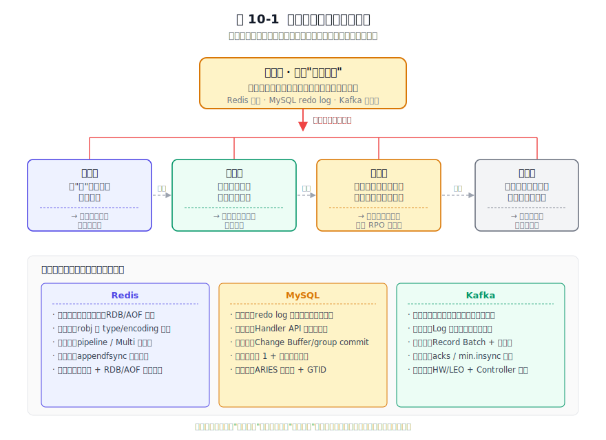
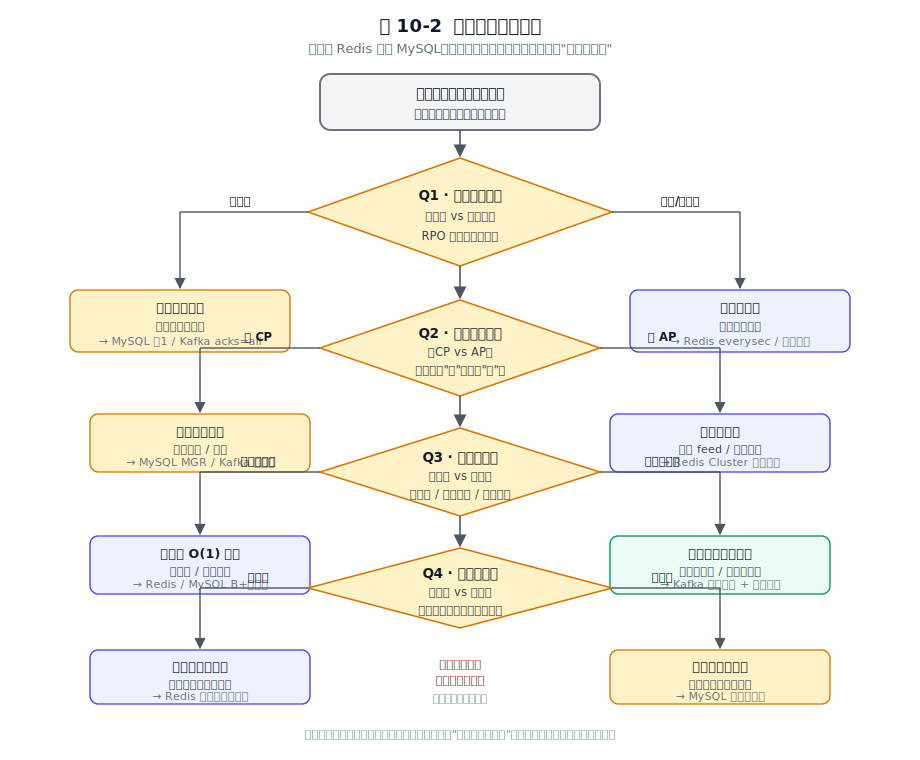
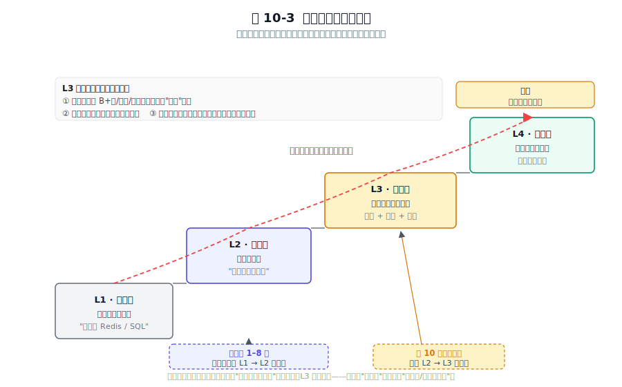

# 第 10 章 万法归一 —— 架构设计的共性规律与取舍之道

## 本章导读

前九章，三款软件在八个主题上交出了截然不同的答卷：差异大到各自的默认配置取向截然不同。Redis 偏延迟，MySQL 偏正确性，Kafka 偏吞吐。但这些差异底下，有没有同一套"骨架"？如果要设计一个新系统，该借鉴 Redis 的极简、MySQL 的严谨、还是 Kafka 的弹性？知道特性不等于会做架构决策。只有把"它们为什么这样选"抽象成规律，规律才能迁移到实际系统中。本章不引入新机制，只做一件事：把前九章的启示串成一条主线。

我回头看自己的职业生涯，最大的认知转折点不是学会了哪门新技术，而是有一天我突然不再问"这个系统快不快"，开始问"它在什么约束下做了哪些取舍，这些取舍今天还成不成立"。二十出头时我痴迷于压 QPS，后来踩的坑多了才慢慢明白，真正值钱的能力是在一堆约束面前做对选择。这本书就是我自己花了十年才慢慢想清楚的那些规律。

---

## 10.1 九章一镜照：前九章核心启示复盘

九章九问，每章都在回答同一个母题的不同切面："如何在约束下做出取舍"。把每章的一句话启示，连同它们在该主题上的关键决策，收敛成一张"九章启示总表"，作为后面提炼规律的素材库。

### 10.1.1 一张表收束九章

下表把第 1 到第 9 章的【核心问题 / Redis 决策 / MySQL 决策 / Kafka 决策 / 一句话共性启示】压缩进同一张坐标系。竖看能看出三款软件的定位，横看能看出每一主题的母题。

**表 10-1 九章启示总表**

| 章 | 核心问题 | Redis 的关键决策 | MySQL 的关键决策 | Kafka 的关键决策 | 一句话共性启示 |
|---|---|---|---|---|---|
| 第 1 章 引言 | 选哪三款软件做样本 | 内存型代表 | 持久化型代表 | 流式型代表 | 范式互补才有研究价值，差异越大共性越显形 |
| 第 2 章 数据结构与协议 | 如何定义数据格式与通信协议 | RESP 文本协议 + SDS/ziplist/listpack 按数据量自适应 | 二进制协议 + Dynamic 行格式 | RecordBatch V2 批量编码 + 变长整数/增量时间戳 | 编码对齐访问模式；协议即存储格式 |
| 第 3 章 生命周期 | 启动关闭如何不丢状态 | RDB/AOF 重放重建内存 | 重做日志 + binlog 两阶段提交保提交一致；崩溃恢复重放重做日志、用 undo log 回滚未提交事务 | Controller 选举 + 日志截断到 HW | 启动与关闭是"状态机迁移" |
| 第 4 章 内存与磁盘 | 谁是真相之源 | 内存为家、磁盘是保险 | 磁盘为家、内存是缓冲池 | 磁盘日志为家、PageCache 加速 | 持久化与性能的对立是表象，真相是"谁说了算" |
| 第 5 章 分层架构 | 怎么让系统可替换 | robj type/encoding 解耦直连 | THD + Handler 虚函数（可插拔引擎） | RequestChannel 队列 + 网络协议 | 分层是为了让"可替换"成为可能，层间通信决定演进自由度 |
| 第 6 章 安全 | 主体能对客体做什么 | 从无密码演进到 ACL | 细粒度 grant 表刻进数据字典 | SASL + ACL + 端到端 TLS | 安全是与权限模型同源的能力边界，越早建模演进越省 |
| 第 7 章 集群 | 多副本怎么一致 | 主从 → Sentinel → Cluster 槽分片 + Gossip | 异步 → 半同步 → MGR（Paxos 类多数派） | Partition + ISR + KRaft（去 ZooKeeper） | 按一致性需求逐级抬价的阶梯 |
| 第 8 章 存储格式 | 字节怎么摆才好访问 | RDB/AOF 为"全量加载 + 增量回放"优化 | 16KB 页 + B+树为"点查 + 范围扫描"优化 | Segment + 稀疏索引为"顺序追加 + 偏移量定位"优化 | 存储单元要对齐访问单元，格式发布即长期债务 |
| 第 9 章 数据同步 | 怎么让两个状态机一致 | PSYNC（部分重同步 + 全量回退） | binlog + GTID（基于事务的精确位点） | ISR + leader epoch 截断 + acks/幂等/事务 | 复制是用可比的进度坐标（复制偏移量/GTID/偏移量）对齐状态机 |

这张表里的共性启示列，是 10.2 节要提炼规律的原料；关键决策列，是 10.3 节要抽出取舍维度的原料。九条启示串起来只有一条主线：**约束划定了边界，目标决定了取舍的方向**。各自都面对同样的物理约束（内存有限、磁盘慢、网络会分区、机器会宕），但各自优先保证的目标不同：Redis 优先延迟，MySQL 优先正确性，Kafka 优先吞吐。表 10-1 已经收束了每章的核心启示与关键决策，下面直接进入提炼。

---

## 10.2 共性规律：三款软件用不同语言讲同一套骨架

把九章的启示蒸馏成五条可复用的架构共性规律。每条规律的结构：一句话总结 + 三款软件印证 + 拿到你自己的系统里怎么看。

### 10.2.1 规律一：先定"真相之源"，其余皆为派生

> **系统里只能有一个真相之源（source of truth），其他全是它的派生物。派生物可以丢，真相之源不能丢。**

它们用不同的说法讲同一句话。Redis 说内存是真相，RDB/AOF 只是内存派生的快照，所以 Redis 崩溃可以容忍丢几秒（取决于 `appendfsync`），但不能容忍内存里的键值对算错。MySQL 说磁盘上的重做日志是真相之源，缓冲池里的脏页只是重做日志的派生物，所以缓冲池脏页丢了无所谓，重做日志不能丢；`innodb_flush_log_at_trx_commit=1` 保证重做日志每事务落盘不丢，双写缓冲则保证"脏页刷盘时不被撕裂"（撕裂的页重做日志也救不回来）。Kafka 说磁盘上的日志 Segment 是真相之源，PageCache 与消费者偏移量都是派生物，所以日志是"家"，副本只是"抄家"，消费者偏移量甚至可以丢，因为它可以重放日志重新算出来。

拿到你自己的系统里：设计一个有状态系统，第一件事先回答"谁是真相之源"。这个答案一旦模糊，故障恢复就会失控，因为恢复时你不知道该信谁。一个常见的反例是把缓存和数据库都当真相之源，结果两者不一致时系统行为不可预测。规律一的核心：派生物可以重建，真相之源必须被守护，二者不能颠倒。

### 10.2.2 规律二：用"层"把可变性关进笼子

层是工程上对付变化的手法，Redis、MySQL、Kafka 各自用层解耦了不同维度的变化：可变的细节用层包起来，稳定的契约留在层与层之间。Redis 的 redisObject 把"语义类型（type）"和"底层编码（encoding）"解耦，同一个 hash 语义底层可以是 listpack 也可以是 hashtable，逻辑层只认 type、存储层管 encoding，于是 Redis 能根据数据大小动态换底层结构而不动上层逻辑，付的代价是一次类型检查的间接寻址。MySQL 的 Handler API 把存储引擎做成可插拔的层，Server 层（解析、优化、执行）稳定、InnoDB/MyISAM 可替换，同一个 SQL 能在引擎间迁移，因为契约落在 Handler 接口上，代价是虚函数调用与跨层上下文（THD）传递。Kafka 把 Log 抽象成接口，UnifiedLog / Partition / Segment 分层，上层 API 不关心 Segment 怎么切，Tiered Storage 能把冷段挪到对象存储而无需改动上层读写路径，同样付了分层带来的间接性。

当你在两套实现之间犹豫，先抽接口。接口稳定了，实现可以一个一个换、一个一个演进，而不会牵一发动全身。规律二的潜台词是：**稳定的契约向内收敛，多变的实现向外发散**，这是一个比"高内聚低耦合"更可操作的判据：层与层之间只通过稳定的接口交互，不暴露实现细节。

### 10.2.3 规律三：把随机变成顺序，把一次变成一批

硬件天然对顺序与批量友好，架构设计上的巧思常常就是替硬件把随机改写成顺序、把单条改写成批量，这条规律在它们的性能优化里反复出现。Redis 的管道（pipeline）与 Multi/Exec 把 N 次网络往返合并成 1 次 RTT，AOF 重写把碎片化的历史命令重新合并成一份快照，本质上都是在把一次变成一批。MySQL 的 Change Buffer 把对二级索引的随机写攒成批量，组提交把多个事务的重做日志一次 fsync，预读把随机页请求变成顺序预取，说白了都是在替硬件把随机改写成顺序。Kafka 的 Record Batch 把多条消息打包成一个存储单元，生产者攒批 + 副本 FETCH 也批量拉，零拷贝（sendfile）让一批数据跳过用户态直接从页缓存到网卡，把三件事一起批了。

为什么这条规律这么普适？因为底层硬件（机械臂、闪存页、网卡包、CPU 缓存行）几乎都对"顺序 + 批量"友好、对"随机 + 单条"不友好。软件架构师能做到的最大性能杠杆，往往是替硬件改写访问模式，靠堆 CPU 收益有限。性能优化先问"这里能不能批、能不能顺序"，再去想换更快的硬件。如果你发现自己在一个循环里反复单条调用，就该想想规律三：把单条攒成批。

### 10.2.4 规律四：可靠性要用性能去买，但要知道买的是什么

> **每一次更强的一致性，都是用一次额外的同步等待换来的。代价摆在明面上，选择权在你。**

一致性不是免费的，它们用参数把这个代价明码标价。Redis 的 `appendfsync` 有三档：`always`（每条命令都落盘，最慢但最不丢）、`everysec`（每秒落盘一次，开启 AOF 后的默认值）、`no`（交给操作系统决定，最快但可能丢较多），对应"丢多少 vs 慢多少"。MySQL 的 `innodb_flush_log_at_trx_commit` 与 `sync_binlog` 的双 1 / 双 0 组合，是"持久性 vs 吞吐"的取舍。半同步与异步复制的切换，是"延迟 vs 恢复点目标（Recovery Point Objective，RPO）"的取舍。Kafka 的 `acks=0/1/all` 配合 `min.insync.replicas`，是"吞吐 vs 不丢"的价签。幂等与事务，靠额外的 Broker 状态机和协议往返，达到了"恰好一次"这个更高的一致性档位。

这条规律说明"强一致"也不是天生就有的。所谓"强一致"都是某个参数从 0 调到 1 的结果。应用时，把这个参数的代价暴露给真正在意它的人（业务方、SRE），让"愿意付多少延迟"和"能容忍多少丢失"成为一次明确的取舍，而不是默认把所有参数调到最严。规律四的另一面：被默认设成最严却没人真正需要的参数，是在浪费吞吐。

### 10.2.5 规律五：复杂状态必须显式建模，故障恢复要可预测

运行时状态要显式建模出来，恢复路径要提前写定。一个有状态的系统，运行时都在维护一堆隐式或显式的状态。它们的做法是把这些状态显式建模，并为每个状态预先写定恢复路径。Redis 启动就是按 RDB/AOF 把状态重放回去。MySQL 把活跃事务、锁等待、LSN 当运行时状态，用 ARIES 协议（分析、重做、回滚三阶段）当崩溃恢复流程，用 GTID 给复制状态一个全局可比的位点，让从节点知道自己该重做哪些事务、跳过哪些事务。Kafka 把 HW/LEO、ISR、Controller 任期（epoch）当运行时状态，用"日志截断到 HW + Controller 重新分配 leader"当恢复路径，于是 Broker 重启后都能精确地说出"哪段日志算数、哪段要丢"。

应用到自己的系统：先问"我最坏会处于哪些状态"，再为每个状态写"如何进、如何出"。能写出来才算可控；写不出来的状态，故障时很可能演变成事故。规律五其实是规律一的延伸：真相之源之所以能守住，靠的就是把它的状态显式建模出来、把恢复路径提前写定。

### 10.2.6 规律小结

五条规律是一棵树：第一条是根，后四条都在为它服务。图 10-1 把这种递进关系画清楚。

图 10-1 五条共性规律的递进关系：后四条规律都在服务第一条：让真相之源又快、又稳、又可控。

箭头标示了递进关系：规律一定下"真相之源"的位置，后四条围绕它展开。规律二让它实现可替换、演进可控，规律三提速，规律四加固可靠性，规律五管住故障恢复。后四条都在把第一条的"真相之源"改造成一个能在生产环境里跑起来的工程对象。

> **适用边界**：五条规律建立在同一组前提上：你的系统是**有状态的**（持有不可丢失的数据）、**单写者/少写者**（真相之源通常只有一个写入者）、**OLTP 为主**（在线事务而非离线分析）。如果你面对的是无状态微服务（真相之源不在本服务内，而在外部数据库）、边缘计算/Serverless 函数（数据短暂驻留、生命周期不可控）、纯分析型系统（列存、批量扫描、无 OLTP 事务），这套框架的适用性就会打折扣：规律一"真相之源"仍然成立，但规律三（随机变顺序）和规律四（可靠性的代价）的形态会显著不同。框架的价值在于自知边界，边界之内的判断是可靠的，边界之外的类推需要额外验证。

---

## 10.3 取舍之道：把共性规律翻译成可操作的权衡框架

规律告诉你"是什么"，取舍告诉你"怎么选"。五个永恒的权衡维度加上一棵选型决策树和三道判断练习题，让规律落到实践。

### 10.3.1 五个永恒的权衡维度

每个维度的结构固定为：一句话定义张力 → 各自偏向哪一端 → 代价是什么 → 什么场景该倒向哪一端。

**维度一：速度 vs 持久性**。数据写下去多久才算数，是这一维度要回答的问题。Redis 默认偏向速度，`appendfsync=everysec` 把风险控制在约 1 秒量级的数据窗口内，因此写入开销更低。MySQL 默认偏向持久性（`innodb_flush_log_at_trx_commit=1` 是默认），若再开启 `sync_binlog=1` 即"双 1"配置，让每条已提交事务都 fsync，从而做到"断电不丢"，代价是每事务一次磁盘同步。Kafka 偏向持久性，`acks=all` + 多副本让一条消息被 ISR 全部确认才算写入成功，付的是副本同步的 RTT。三者各取所需：Redis 用秒级窗口换吞吐，MySQL 用每事务一次 fsync 换断电安全，Kafka 用副本同步换多副本下的数据不丢。缓存、计数器、限流可偏速度端；账本、订单、支付必须偏持久性端。核心问题是"这个场景丢得起吗"。

**维度二：一致性 vs 可用性（CAP 的实战投影）**。网络分区一来，你要么写对要么继续服务，没有两全。Redis Cluster 默认偏 AP（分区时少数派槽短暂停写偏 CP，社区归类有争议，本书不作绝对归类），分区时持有多数主节点的分区继续服务、少数派分区的槽短暂不可用，故障切换时可能丢失少量已确认的写（异步复制的固有代价）；MySQL MGR 偏 CP，少数派分区直接拒绝写，宁可不活也不写错；Kafka 可调，用多数派选主 + `min.insync.replicas` 控制一致性强度，业务能在 CP 倾向和可用性之间自己调。AP 优先高可用，代价是故障切换时可能丢少量写；CP 优先强一致，代价是分区时部分请求失败。金融核心偏 CP（宁可拒绝服务也不能错账），社交 feed 偏 AP（少量数据可修，但不能不活）。

**维度三：空间 vs 时间**。要么拿空间买查询时间，要么拿计算时间省存储空间。Redis 用内存换 O(1) 访问，把数据全部驻留内存，是"空间换时间"最彻底的做法；MySQL 用 B+树索引 + 缓冲池换查询时间，索引和数据页都是为查询提速的额外空间开销；Kafka 用稀疏索引省空间（索引只记里程碑），用顺序扫描花时间补上定位，是"时间换空间"的典型。空间换时间要付内存/存储成本，时间换空间要付 CPU 与延迟成本。热点读、低延迟访问偏空间换时间，冷数据归档、高吞吐追加偏时间换空间。

**维度四：简单 vs 灵活**。把决策写死换来性能，留开关换来灵活性，两头只能站一头。Redis 把"命令执行单线程"写死（即便 6.0 起可开启多线程 I/O 卸载网络读写，数据访问仍单线程），因此内核无锁快、可重入逻辑简单，代价是单个实例吃不满多核 CPU；MySQL 的 Handler 接口留了灵活性，支撑可插拔存储引擎，但付虚函数开销和跨层上下文传递；Kafka 把副本、偏移量、事务做成显式原语，灵活但概念多、学习曲线陡。简单难演进，灵活易误用：这是一对长期存在的张力。规模可控、需求稳定偏简单；需求多变、要长期演进偏灵活。

**维度五：通用 vs 专用**。做一个啥都能干的系统，还是把一件事做到极致。MySQL 偏通用，事务、SQL、多种存储引擎、多种复制模式都支持，所以它能在很多场景都用上，但每个维度都很难做到最强；Redis 与 Kafka 偏专用：Redis 专内存快速存取和计算，Kafka 专高吞吐日志，专用系统在自己擅长的那件事上性能很强，但覆盖不了边界需求。通用很难在每个维度都拔尖，专用难覆盖边界需求。业务域宽、需求杂偏通用，性能上限是生死线、需求聚焦则偏专用。

五个维度不是孤立的，它们会互相牵扯。比如维度一（速度 vs 持久性）和维度二（CP vs AP）常常联动：你越偏持久性，越倾向于 CP。这种联动是真实的工程现实，不必强求每个维度都独立打分。

### 10.3.2 一个选型决策树

五个维度摆开之后，下图把取舍框架做成一棵可以一步步走的决策树。

图 10-2 实践者选型决策树：从"我要建一个有状态系统"出发，依次回答四个问题，叶子节点指向"这种约束组合下该借鉴哪家设计"。

这棵树的根节点是"我要建一个有状态的系统"，然后依次问四个问题：① 数据能丢吗（决定速度/持久性档位）。② 一致性要求多强（决定 CP/AP 倾向）。③ 读写模式是什么（决定空间/时间换法）。④ 是否需要长期演进（决定简单/灵活）。每个叶子节点都指向"这种约束组合下，三款软件里谁的设计可借鉴"。决策树的用法：**先回答清楚自己的约束**，再去它们的设计里理解，在那个约束组合下保护机制为什么长成那个样子。比如你做一个秒杀库存系统，决策树会把你带到"持久性优先 + CP 倾向 + 热点读"的叶子，那里指向 MySQL 的双 1 与 MGR：强一致场景下，断电不丢、多数派确认这两层保护缺一不可。

### 10.3.3 三道判断练习

三道练习帮你把框架用起来。每题结构固定：场景 → 常见的第一反应 → 用本章框架推导 → 该借鉴它们的哪条机制。

**练习一："做一个秒杀库存系统，应该用 Redis 还是 MySQL？"** 常见的思路是"用 Redis 快"。但秒杀库存的本质是"账"：卖出一件就要少一件，多卖、少卖都是事故。用规律一（真相之源唯一）的判据：Redis 单机内存型，在 Cluster 分区时某个槽可能短暂双写，库存可能算错。所以正确取舍是 MySQL 做真相之源（强一致、双 1、事务保护库存的"对"），Redis 做预扣减挡板（在 MySQL 之前用 SETEX + INCR 把流量削掉一部分，保护"快"）。借鉴的是"真相之源唯一"和"批量挡板"。

**练习二："日志采集系统，要不要上 Kafka 的事务？"** 常见的思路是"事务更安全所以上"。但日志场景的特征是可容忍少量重复或乱序（消费端去重即可），而 Kafka 事务的额外开销（Broker 维持事务状态机、生产者两阶段提交、消费者隔离读）换不回对等的业务价值。用规律四（看一致性代价）的判据：开 `enable.idempotence=true`（它内部会强制 `acks=all` + 重试，挡住"重复写入"和"生产者重试导致的乱序"），再上跨分区事务就是过度设计。

**练习三："一个新业务，要不要一上来就分库分表？"** 常见的思路是"早做早省事"。但分片牺牲了单机事务、JOIN、外键约束，换来了水平扩展。过早分片等于为一个还不需要的容量去付昂贵的灵活性代价。用维度四（简单 vs 灵活）和维度五（通用 vs 专用）的判据：先用单机 MySQL + 读写分离顶住，到瓶颈真的出现时再切，切的时候按第 7 章集群架构的演进阶梯一级一级抬。早分片省的是今天的运维，付的是未来每次跨片事务的复杂度。

三道练习的共同点：它们都在逼你把约束摊开，让选择从"感觉"变成可推演的。框架的价值不在给你正确答案，而在让你看清自己到底在取舍什么。

---

## 10.4 给实践者的建议：从使用者到设计者

规律和框架是"道"，落到"用"上还需要一份具体的清单和一条认知路径。下面先给动手前要回答的 12 个自检问题，再说认知跃迁的四层台阶，最后是持续学习的路径。

### 10.4.1 架构设计 checklist：动手前先回答的 12 个问题

把 10.3 的五个维度拆成 12 个具体问题，按"数据 / 性能 / 可靠性 / 运维"四类组织。表 10-2 把每个问题连同"三款软件如何回答"和"你的系统该回答什么"摆在一起，作为动手前的自检工具。

**表 10-2 架构设计 checklist（12 问）**

| 类别 | 问题 | Redis 怎么答 | MySQL 怎么答 | Kafka 怎么答 | 你的系统该答什么 |
|---|---|---|---|---|---|
| 数据 | 谁是真相之源？ | 内存键空间 | 重做日志 | 日志 Segment | 写下一个名字，并说清派生物有哪些 |
| 数据 | 读写比例与访问模式？ | 读多写多、O(1) 访问 | 读多写少、随机点查 + 范围扫描 | 写多读多、顺序追加 + 偏移量定位 | 标出热点路径是读还是写、是随机还是顺序 |
| 数据 | 增长上限与冷热比例？ | 受内存约束、全热 | 受磁盘约束、缓冲池暖热 | 受磁盘约束、PageCache 热 | 估算 1 年 / 3 年后的量，标出冷热分界 |
| 性能 | P99 延迟要求？ | 低延迟优先 | 稳定延迟优先 | 高吞吐下的可接受延迟 | 写一个具体数字，含尾延迟目标 |
| 性能 | 吞吐峰值？ | 热点 key 与单线程上限 | 事务提交与锁冲突上限 | 批量、分区、Broker 数决定上限 | 写峰值与均值，区分突发与持续 |
| 性能 | 是否存在热点？ | 单 key 易成热点 | 单行/单页易成热点 | 单 partition 易成热点 | 标出最热的 key/行/partition 与分担方案 |
| 可靠性 | 可接受最大丢失量（RPO）？ | 默认约 1 秒量级窗口 | 双 1 接近 0 | acks=all 接近 0 | 写一个 RPO 数字，并说清谁能拍板 |
| 可靠性 | 恢复时间要求（Recovery Time Objective，RTO）？ | RDB 加载或 AOF 重放 | 重做日志重做 + 回滚日志回滚 | Leader 切换 + 副本同步 | 写一个 RTO 数字，并演练过没 |
| 可靠性 | 是否跨地域容灾？ | Cluster 跨机房复杂 | MGR 跨机房可行 | MirrorMaker / Cluster Linking | 标出主备地域与切换剧本 |
| 运维 | 扩容是否停机？ | Cluster 在线 reshard | 在线加节点 + 自动均衡 | 加 partition 受限、加 Broker 可在线 | 标出扩容路径与停机窗口 |
| 运维 | 配置是否动态生效？ | CONFIG SET 部分动态 | 部分参数动态、部分需重启 | 多数 Broker 参数动态 | 标出哪些参数改了要重启 |
| 运维 | 故障排查路径是否清晰？ | slowlog + latency monitor | slow log + performance_schema | Broker log + 消费者 lag | 写下你出问题第一时间看哪个指标 |

这张表的用法是借它们的答案校准你自己系统的尺度。比如"RPO 是多少"这个问题，它们的默认值差异巨大：这是业务问题，得让业务方拍板。12 个问题答完，选型往往就自然确定了：约束已经替决策做了大部分工作。

### 10.4.2 认知跃迁的四层台阶

读这本书的过程，是一次认知坐标系的变换。这个坐标系分四层。

图 10-3 认知跃迁的四层台阶：L1 使用者到 L4 创新者，四层之间的差距是"看问题的坐标系"在逐层升级；本书第 1–9 章带读者完成 L1→L2，本章推动 L2→L3。

从下到上四层：L1 是使用者，标志是会配置、会调优、知道"怎么用 Redis/SQL"，问题以"是什么、怎么配"开头；L2 是理解者，标志是懂内部机制、能讲清"为什么这么设计"，问题以"为什么"开头；L3 是设计者，标志是能借鉴思想设计自己的系统，问题以"换我怎么做"开头；L4 是创新者，标志是能定义新的架构范式。本书的 9 章对应 L1→L2 的跃迁：把你从"会用"带到"懂机制"；本章对应 L2→L3 的跃迁：把你从"懂机制"带到"能迁移"。

L3 是分水岭，因为从这里开始，你回答的问题从"它是什么"换成了"换我怎么做"。L3 的核心能力可以拆成三项，每一项都能在三款软件里找到印证。**抽象能力**：能从 B+树、跳表、稀疏索引里看出同一个"索引"的本质，能从重做日志、AOF、Kafka 日志里看出同一个"预写日志"的本质；更进一步，能从 PSYNC2、GTID、ISR 里看出"用可比位点对齐两个状态机"这个共性。抽象能力让你能从一万个细节里抽出五个模式。**权衡能力**：理解每个选项的机会成本。比如 Redis 用"命令执行单线程"换无锁快，代价是吃不满多核；MySQL 的每次 fsync 换来断电不丢，代价是吞吐被压低；Kafka 的多副本换来高可用，但延迟和复杂度都上去了。权衡能力让你能说清"为什么不选另一个方案"。**工程直觉**：快速识别瓶颈（是 CPU、是 I/O、是网络、还是锁），预判规模放大后的表现（数据量翻十倍哪个组件先崩）。直觉来自反复实验，不能只靠读。

从使用者到设计者的转变，本质是换一套看问题的坐标系——也就是换一套提问方式。

### 10.4.3 持续学习与全书收束

读完本书只是起点。三条学习路径，供参考。

读源码。从 Redis 起步，它的代码量小、数据结构清晰，C 语言的直白让你能从命令处理一路追到内存表示，几周就能通读核心路径。再读 InnoDB，重点看页结构、B+树、重做日志/回滚日志、MVCC，这部分代码厚但思路连贯。最后读 Kafka 的 Log 与 ReplicaManager，理解"日志即真相"的工程实现。读源码的姿势是带着问题去：比如"双 1 真的能保证不丢吗，看代码怎么 fsync 的"。

改参数看行为，是最快的理解方式。把 Redis 的 `appendfsync` 从 `everysec` 改成 `always`，用 `redis-benchmark` 看吞吐怎么跌。把 MySQL 的 `innodb_flush_log_at_trx_commit` 从 1 改成 0，强杀进程看丢多少。把 Kafka 的 `acks` 从 all 改成 1，断一个 Broker 看消息丢不丢。亲手制造一次"丢数据"，你对参数的代价就有了肌肉记忆。

跨领域对照。数据库、消息队列、缓存、搜索引擎共享底层原理：它们都在回答同一组问题：真相之源在哪、怎么批、怎么一致、怎么恢复。读完三本不同领域的书，把它们摆在 10.2 的五条规律上一对照，你会发现"换皮不换骨"。这种对照能力，是 L3 设计者最重要的资产。

三个常见的坑。**先选技术再找场景**：手拿一把锤子到处找钉子，是最常见也最隐蔽的设计失误。**追求面面俱到**：什么都想要、什么参数都设最严，结果系统在每个维度都平庸，一致性付出的代价都打了水漂。**把一致性当信仰而非价签**：盲目追求"强一致"，却不问业务是否需要，付了不必要的延迟和复杂度。

回到第 1 章的"同题作答"比喻：九章下来，三款软件交出了三份不同的答卷，但答卷背后的"答题方法"是同一套：先认约束，再选真相之源，然后用层、用批量、用一致性档位、用显式状态把真相之源搭成可用的系统。而理解了共性之后，关键在于**"适合"**：把你的约束（能丢多少、要一致到什么程度、读写模式是什么）摊开，去匹配它的取舍。

架构设计的本质，是在摸清约束之后选出最简洁的方案。简洁意味着组件、参数、每一层抽象，背后都对应一个被摊开过的约束；删不掉的那个，才是该留下的那个。

---

## 本章小结

这一章把前九章的回答蒸馏成可迁移的规律。从 10.1 的九章启示总表出发，主线收束成一句话：认清约束，选好真相之源，其余都是派生。10.2 把这条主线拆成五条共性规律，其中"先定真相之源"是根，其余四条都在让它更快、更稳、更可控。到了 10.3，规律被翻译成五个权衡维度、一棵决策树和三道练习题，目的是让选择从感性变成可推演；10.4 则补上动手前要回答的 12 个问题、四层认知台阶和一条持续学习路径。三款软件的差异底下藏着同一套骨架。读完这本书，如果你下次做选型时，能先想"这个系统的约束是什么、取舍在哪里"，这九章的目的就达到了。
