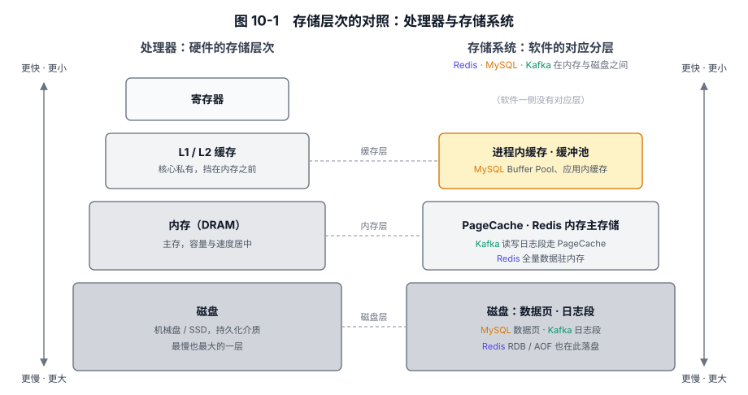
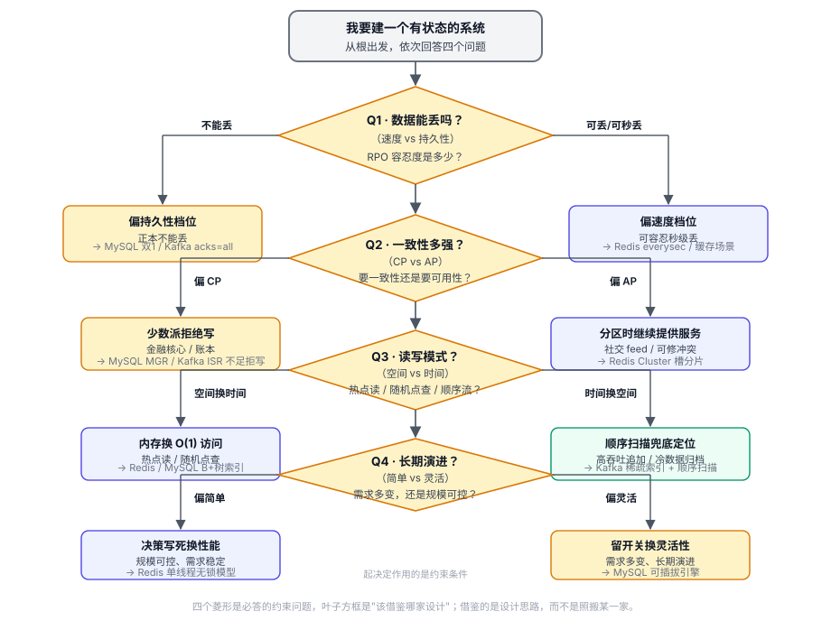
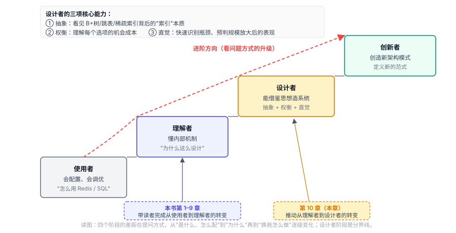

# 第 10 章 总结：架构设计的共性规律与取舍

## 本章导读

前九章向 Redis、MySQL、Kafka 提出了同一组设计问题。Redis 的内存结构、MySQL 的事务与恢复机制、Kafka 的批量日志，各有适用的条件。设计自己的系统时，重要的不是照着其中一家做，而是看清这些选择为什么成立。知道特性不等于会做架构决策。只有把"它们为什么这样选"抽象成规律，规律才能迁移到实际系统中。这一章把前九章的启示串成一条主线。

---

## 10.1 前九章核心启示复盘

前九章从不同方面讨论了同一个问题："如何在约束下做出取舍"。表 10-1 汇总每章的一句话启示与三个软件的关键决策，后面的规律由此归纳。

### 10.1.1 一张表收束九章

**表 10-1　九章启示总表**

| 章 | 核心问题 | Redis 的关键决策 | MySQL 的关键决策 | Kafka 的关键决策 | 一句话共性启示 |
|---|---|---|---|---|---|
| 第 1 章 引言 | 选哪三个软件做样本 | 内存型代表 | 持久化型代表 | 流式型代表 | 对照不同范式的成熟软件，有助于识别各自约束下的共性与取舍 |
| 第 2 章 数据结构与协议 | 如何定义数据格式与通信协议 | RESP 分帧 + 按类型和数据规模选择编码 | 文本/二进制协议 + Dynamic 行格式 | RecordBatch V2 批量编码 + 变长整数/增量时间戳 | 编码对齐访问模式，协议与存储格式互相配合 |
| 第 3 章 生命周期 | 启动关闭如何不丢状态 | 加载 RDB 或重放 AOF，重建内存 | 崩溃恢复重放 redo log、用 undo log 回滚未提交事务，保住事务一致性 | Broker 日志恢复；Controller 另行选举 | 启动重建运行状态，关闭按配置完成保存与职责交接 |
| 第 4 章 内存与磁盘 | 内存和磁盘怎么分工 | 内存保存运行数据，磁盘文件用于恢复 | 磁盘保存数据页和日志，内存作缓冲 | 分区日志保存消息，PageCache 加速访问 | 访问模式影响内存与磁盘的分工，以及故障后的恢复方式 |
| 第 5 章 分层架构 | 怎么让系统可替换 | redisObject 的 type/encoding 分离 | THD + Handler 虚函数（可插拔引擎） | RequestChannel 队列 + 对象调用，跨 Broker 使用网络协议 | 分层隔离职责与变化，接口契约影响替换范围与演进成本 |
| 第 6 章 安全 | 怎样确认身份、限制访问、保护数据和追查操作 | requirepass 与 ACL | 用户、角色与对象权限，授权表持久保存 | SASL + ACL + 按连接配置 TLS | 安全设计需要区分身份、权限范围及每段连接的保护 |
| 第 7 章 集群 | 数据怎么分片，故障怎么接管 | 主从 → Sentinel → Cluster 槽分片 + Gossip | 异步 → 半同步 → MGR（Paxos 类多数派） | 分区 + ISR + KRaft（去 ZooKeeper） | 复制确认与故障处理提供不同保证，按业务需求权衡代价 |
| 第 8 章 存储格式 | 字节怎么排列才好访问 | RDB/AOF 为"全量加载 + 增量重放"优化 | 默认 16KB 页 + B+ 树为"点查 + 范围扫描"优化 | 日志段 + 稀疏索引为"顺序追加 + 偏移量定位"优化 | 格式需要协调访问、恢复与兼容，发布后就是一笔长期债务 |
| 第 9 章 数据同步 | 怎么让副本对齐数据 | PSYNC2（部分重同步 + 全量回退） | binlog + GTID 集合（识别已接收和执行事务） | ISR + leader epoch 日志对齐 + acks/幂等/事务 | 在匹配的复制历史内确认进度，并依靠保留的日志或快照补齐数据 |

九条启示串起来只有一条主线：**约束决定哪些选项可行，目标决定在可行选项里怎么选**。三个软件面对的是同一组物理约束：内存有限、磁盘慢、网络会分区、机器会宕。

---

## 10.2 共性规律：三个软件背后的同一套基本结构

下面把九章启示提炼为五条可复用的架构共性规律。这些规律并非本书首次发现，价值在于用三个软件的实证把它们变成可操作的工具。

### 10.2.1 规律一：先确定唯一正本

> **先为每类数据确定权威来源（source of truth），再区分副本和派生结果。权威来源可以由多个物理副本共同保存；保留它和必要的恢复材料，其他数据才有重建依据。**

在 Redis 中，内存键空间是运行时处理命令的依据，RDB 保存快照，AOF 保存恢复数据所需的日志。崩溃后能恢复到哪里，取决于已保存的持久化内容；能否容忍数据丢失由业务决定，但不能容忍内存里的键值对算错。

在 MySQL 中，磁盘上的数据页和已持久化的 redo log 共同提供崩溃恢复依据，缓冲池里尚未刷回的修改可以通过 redo 恢复。

在 Kafka 中，消息保存在分区日志中，PageCache 缓存日志内容，多个副本共同提供容错能力。消费者偏移量记录消费组处理到哪里，需要单独保存；只保留消息日志，并不能重新算出业务已经完成了哪些处理。

我设计一个有状态系统时，第一件事就是回答"哪份数据是正本"。这个答案一旦模糊，故障恢复就会失控，因为恢复时你不知道该信谁。一个常见的反例是把缓存和数据库都当正本，结果两者不一致时系统行为不可预测。

### 10.2.2 规律二：用"层"隔离可变性

> **稳定的契约留在层间，多变的实现隔离在层内——这是一个比"高内聚低耦合"更可操作的判据。**

分层要隔离具体的变化。Redis 区分数据类型与底层编码，让内部表示可以改变，而命令语义保持稳定；MySQL 用 Handler 接口分开 SQL 处理与存储引擎；Kafka 在增加远程存储后，客户端仍按分区和 offset 读取日志。它们保留的是对外约定，把需要调整的实现放在内部。

当我在两套实现之间犹豫，我会先抽接口。接口稳定了，实现可以一个一个换、一个一个演进，而不会牵一发动全身。

### 10.2.3 规律三：把访问改写成顺序和批量

> **顺序访问可以减少定位开销，批量处理可以摊薄系统调用和网络往返的成本；收益最大的一项性能优化，往往是把随机访问改写成顺序、把单条操作合并成批量。**

Redis 的 pipeline 连续发送多条命令，减少逐条等待网络往返。MySQL 的修改缓冲延后适用的二级索引页修改，减少立即读页的随机 I/O；组提交让多个事务共享日志刷盘。Kafka 把消息组织成 RecordBatch，生产与副本拉取都可以成批进行。它们共同做的，是把原本反复发生的开销合并摊薄。

这条规律能跨越多个软件，是因为机械盘寻道、存储 I/O、网络往返和系统调用，都有值得摊薄的固定开销。对软件架构师来说，应用这条规律时，往往先改写访问模式以适应硬件。靠堆 CPU 收益有限。性能优化先问"这里能不能批、能不能顺序"，再去想换更快的硬件。当我发现自己在一个循环里反复单条调用，就该考虑把单条操作合并成批。

这条规律还可以放到更底层的存储层次结构里看。CPU 的寄存器、L1/L2 缓存、内存、磁盘，在访问延迟和容量之间作出不同取舍。缓存利用局部性减少对下层的访问，其他层次则承担计算中的数据暂存、主存储或持久化等职责。第 4 章启示五讲的是软件怎样安排内存与磁盘：MySQL 的缓冲池和 Kafka 使用的 PageCache 缓存磁盘内容，Redis 的内存则直接保存运行时数据。图 10-1 对照的是这些存储位置与职责。我们在架构上反复遇到的存储取舍，计算机组成里几十年前就给过答案，这也是观察三个软件时最让我在意的一条线索。

图 10-1　存储层次的对照：左侧是处理器与存储介质（寄存器→L1/L2 缓存→内存→磁盘），右侧是三个软件使用内存与磁盘的方式；两侧比较访问延迟、容量与职责。

### 10.2.4 规律四：更强的可靠性要付性能代价，先弄清代价再决定

> **提高可靠性，常要增加同步等待、复制或持久化工作。具体代价取决于要提供的保证和实现方式，是否接受由设计者决定。**

Redis 的 AOF 刷盘策略和 MySQL 的提交日志配置，都把持久性要求放进了写入路径：更早等到日志落盘，就要更早承担等待；放宽等待，则要接受更大的故障丢失窗口。第 4 章已经比较过具体档位，这里要记住的是每种保证由谁付出代价。

半同步复制正常时，提交还要等待规定数量的副本确认接收并记录事务日志，但不等副本应用完事务；确认超时可退回异步。它与异步复制的差别，是确认等待与恢复点目标（Recovery Point Objective，RPO）之间的取舍。Kafka 的 `acks=0/1/all` 决定生产者等待多大范围的确认，`min.insync.replicas` 则为 `acks=all` 设置最小 ISR 数量要求。这些复制确认与本地 fsync 是不同的保证。幂等写入处理生产者重试造成的重复，事务则可以把多个分区的输出和消费进度一起提交；配合 `read_committed`，可以实现 Kafka 内部的恰好一次处理，写入外部系统还需要对方配合。它们增加的 Broker 状态与协议开销，也需要按业务需求判断是否值得。

这些参数控制的是不同保证，选择时要先说明希望防住哪类故障。我应用这条规律时，会把所选保证的代价暴露给真正在意它的人（业务方、SRE），让"愿意付多少延迟"和"能容忍多少丢失"成为一次明确的取舍，而不是默认把所有参数调到最严。规律四的另一面：为业务不需要的保证承担额外等待和处理开销，是在浪费性能。

### 10.2.5 规律五：复杂状态必须显式建模，故障恢复要可预测

> **复杂状态必须显式建模，并为每个状态预先写定恢复路径；能写出来才算可控，写不出来的状态，故障时很可能演变成事故。**

一个有状态的系统，运行时都在维护多种隐式或显式的状态。三个软件都把重要状态记录下来，并安排相应的恢复过程。Redis 启动时按 RDB/AOF 恢复数据。MySQL 维护活跃事务、锁等待、LSN 等运行时状态，崩溃后重放 redo、用 undo 回滚未完成事务；复制则用 GTID 集合标识已接收或执行的事务，在复制源仍保留所需日志时补齐缺失的事务。Kafka 维护 HW/LEO、ISR 和分区 leader epoch，结合副本日志历史处理分叉尾部；Controller 负责分区 Leader 的选举与管理。日志内容、复制进度和元数据共同决定恢复动作。

应用到自己的系统，我会先考虑：服务突然停在这里，重启后凭什么判断下一步该做什么？例如一项任务，尚未开始、已经完成、完成却没收到确认，需要的处理就不一样。先把这些状态及其记录方式写清，再设计重试和恢复。

### 10.2.6 规律小结

五条规律互相配合：确定数据的权威来源，用分层控制变化，用访问方式改善效率，权衡可靠性的代价，再把状态与恢复过程说明白。

> **适用边界**：这五条规律来自三个有状态存储软件的观察。用于其他系统时，仍需重新判断数据归属、访问模式和恢复要求，不能直接照搬具体方案。

---

## 10.3 从规律到权衡框架

上一节讲规律是什么，这一节把规律变成可操作的取舍框架：五个反复出现的权衡维度，加上一张选型问题图和三道判断练习题。

### 10.3.1 五个反复出现的权衡维度

**维度一：速度 vs 持久性**。核心问题是"这个场景丢得起吗"。数据丢失后能否重建、最多允许回退到哪个时点、愿意为此多等多久，要先由业务给出要求，再选择刷盘策略。副本确认还要单独判断：多台机器收到了写入，不等于每台都已经刷盘。

**维度二：一致性 vs 可用性（CAP 的工程体现）**。网络分区时，若要求所有操作仍满足线性一致性，就不能同时保证每个非故障节点都能完成请求。Redis Cluster 的少数侧会在超时后拒绝写入，多数侧恢复服务也要有可晋升的副本；窗口内已确认的写入仍可能在故障切换时丢失。MySQL MGR 无法取得多数派时，不能继续确认组内写入，读取行为还取决于配置。Kafka 默认从 ISR 中选主；使用 `acks=all` 时，ISR 数量不足 `min.insync.replicas` 会使写入失败，允许非 ISR 副本当选则可能损失已提交数据。它们需要分别评估分区时哪些操作还能完成、能维持什么保证。金融核心宁可拒绝操作，也要避免错账；社交 feed 则可以在业务允许的范围内接受暂时不一致，以维持服务。

**维度三：空间 vs 时间**。用更多存储结构减少查找工作，或用更多扫描和计算减少额外存储，是常见的取舍。Redis 让运行数据驻留内存，简单键查询可用哈希表快速定位，具体操作复杂度仍取决于命令和数据结构；MySQL 用 B+ 树索引和缓冲池减少查找与磁盘访问，索引和缓存需要额外空间；Kafka 用稀疏索引省空间，先定位附近的日志位置，再顺序扫描到目标。空间换时间的代价是内存和存储，时间换空间的代价是 CPU 与延迟。热点读、低延迟访问要往空间换时间上靠；冷数据归档、高吞吐追加反过来，往时间换空间上靠。

**维度四：简单 vs 灵活**。固定部分决策可以减少运行时开销，保留开关和接口则增加调整空间。Redis 的普通命令执行路径以单线程为主（6.0 起可开启多线程 I/O 卸载网络写），减少了这条路径的数据并发控制，代价是命令执行难以直接利用多个 CPU 核心；MySQL 的 Handler 接口留了灵活性，支撑可插拔存储引擎，但背上虚函数开销和跨层上下文传递；Kafka 把副本、偏移量、事务做成显式原语，灵活但概念多、学习曲线陡。需要长期演进，不等于先把系统做复杂。对已经看得见的变化留好接口，其余部分保持直接，往往更容易维护；真正需要可配置、可替换时，再承担相应的复杂度。

**维度五：通用 vs 专用**。做一个什么都能做的系统，还是聚焦一类需求做到最强。MySQL 用事务和 SQL 覆盖多种数据处理需求；Redis 和 Kafka 分别围绕内存数据操作、追加日志组织能力。通用方案可以少引入几套系统，专用方案则能更贴近某类访问方式。选择时，要把性能收益和新增系统的维护成本一起算。业务域宽、需求杂，倾向通用；性能决定成败、需求聚焦，倾向专用。

五个维度不是孤立的，它们会互相牵扯。一次写入可以同时等待本地刷盘和副本确认，两种等待共同影响延迟；但本地持久化与网络分区时的复制选择，处理的是不同故障。评估时可以结合它们的成本，同时分别核对它们提供的保证。

### 10.3.2 从约束寻找可借鉴的设计

图 10-2　实践者选型问题图：四个约束问题分别引出可借鉴的设计。

图 10-2 从"我要建一个有状态的系统"出发，分别问四个问题：数据能丢吗、需要哪些确认与读取保证、读写模式是什么、是否需要长期演进。每个分支给出可以参考的设计，需要结合实际约束使用。**先明确自己的约束**，再理解对应保护机制为什么这样设计。比如库存系统，要分别回答：并发扣减怎样不超卖，已经确认的订单怎样保存，当前节点失败后由谁接管。先分清问题，再去选择事务、持久化和副本机制，而不是把几个可靠性开关一起打开。

### 10.3.3 三道判断练习

下面三道练习，用这套框架分析具体约束下的选择。

**练习一："做一个网约车系统，司机位置上报和派单该放 Redis 还是 MySQL？"** 常见的思路是"都是核心系统，统一放 MySQL"。但这两个子问题的访问模式完全不同。司机位置每几秒上报一次，读写都高频，丢一次，等下一次上报就补回来，这是"快"的问题，适合放 Redis（GEO 地理位置结构直接支持附近司机查询）。而派单成单属于交易数据：同一单派给两个司机就是事故，状态迁移必须可审计，这是"对"的问题。用规律一的判据，可以让 MySQL 保存订单的权威状态，通过事务与业务约束保护状态迁移，并按持久性要求配置刷盘；Redis 保存司机位置，提供位置索引与派单候选的快速过滤。订单派生数据可按 MySQL 重建，位置则由后续上报更新，最终派单仍需核验订单状态。借鉴的是明确数据归属，以及用快速筛选减少交易处理的候选范围。

**练习二："日志采集系统，要不要上 Kafka 的事务？"** 先看日志场景能容忍什么。如果业务允许的少量重复可以由消费端去重，也能接受一定乱序，又不需要跨分区原子写入或把输出与消费进度一起提交，事务增加的开销就未必值得。生产者幂等可以处理重试造成的重复追加，但不等于业务去重，也不会自动开启事务。用规律四的判据：先明确需要哪种保证，再决定是否承担事务的状态与提交开销。

**练习三："一个新业务，要不要一上来就分库分表？"** 分片会增加跨片事务、JOIN 和约束维护的复杂度，换来水平扩展。如果当前负载与可预见的增长仍在单机能力以内，过早分片会提前增加这些复杂度。用维度四（简单 vs 灵活）和维度五（通用 vs 专用）的判据：可以先从单个 MySQL 写入实例起步，按读负载需要增加只读副本，持续观察容量与吞吐；当增长预测表明单机将无法满足需求时，提前安排分片。第 7 章介绍的复制与高可用方案可以改善相应问题，但不会自动扩展单机写入容量，分片仍需单独设计。早分片省的是将来从单机迁到分片的那一次大迁移，背上的是从今往后每次跨片事务的复杂度。

---

## 10.4 给实践者的建议：从使用者到设计者

### 10.4.1 架构设计 checklist：动手前先回答的 12 个问题

把 10.3 的五个维度拆成 12 个具体问题，按"数据 / 性能 / 可靠性 / 运维"四类组织。表 10-2 把每个问题连同三个软件的参考做法和填写提示放在一起，作为动手前的自检工具。

**表 10-2　架构设计 checklist（12 问）**

| 类别 | 问题 | Redis 参考 | MySQL 参考 | Kafka 参考 | 填写提示 |
|---|---|---|---|---|---|
| 数据 | 哪份数据是正本？ | 运行时以内存键空间为准，RDB/AOF 用于恢复 | 数据页与已持久化 redo 提供恢复依据 | 分区日志；消费进度另行保存 | 按数据类别写清权威来源和派生数据 |
| 数据 | 读写比例与访问模式？ | 内存键查询与各类数据结构操作 | 随机点查 + 范围扫描，读写比例依业务 | 顺序追加 + 偏移量定位 | 标出热点路径是读还是写、是随机还是顺序 |
| 数据 | 增长上限与冷热比例？ | 运行数据受内存容量约束 | 数据主要存磁盘，缓冲池缓存常用页 | 日志主要存磁盘，PageCache 缓存近期访问内容 | 估算 1 年 / 3 年后的量，标出冷热分界 |
| 性能 | P99 延迟要求？ | 低延迟优先 | 稳定延迟优先 | 高吞吐下的可接受延迟 | 写一个具体数字，含尾延迟目标 |
| 性能 | 吞吐峰值？ | 热点 key 与单线程上限 | 事务提交与锁冲突上限 | 批量、分区、Broker 数决定上限 | 写峰值与均值，区分突发与持续 |
| 性能 | 是否存在热点？ | 单 key 易成热点 | 单行/单页易成热点 | 单分区易成热点 | 标出最热的 key/行/分区与分担方案 |
| 可靠性 | 可接受的恢复点目标（RPO）？ | 每秒 AOF 可能丢约一秒写入；RDB 取决于快照 | 双 1（redo 与 binlog 提交前均刷盘）保护已提交日志，仍需明确故障范围 | 按 acks、最小 ISR、存活副本与选主策略评估 | 写一个 RPO 目标，并说清谁能拍板 |
| 可靠性 | 恢复时间要求（Recovery Time Objective，RTO）？ | RDB 加载或 AOF 重放 | redo 重放 + undo 回滚 | Leader 切换 + 副本同步 | 写一个 RTO 数字，并说明是否做过恢复演练 |
| 可靠性 | 是否跨地域容灾？ | Cluster 跨机房复杂 | MGR 跨机房需评估网络与多数派布局 | Apache Kafka MirrorMaker / Confluent Cluster Linking | 标出主备地域与切换预案 |
| 运维 | 扩容是否停机？ | Cluster 在线 reshard | MGR 在线加成员（全员全量、无数据再均衡，读流量可经 Router 分摊） | 可在线加 Broker；已有负载还需迁移分区；增加分区会影响按键路由 | 标出扩容路径与停机窗口 |
| 运维 | 配置是否动态生效？ | CONFIG SET 支持部分动态配置 | 部分参数动态、部分需重启 | 按配置项区分动态更新与重启生效 | 标出哪些参数改了要重启 |
| 运维 | 故障排查路径是否清晰？ | slowlog + latency monitor | slow log + performance_schema | Broker log + 消费者 lag | 写下你出问题第一时间看哪个指标 |

借它们的答案校准你对自己系统的判断。比如"RPO 是多少"，软件的默认配置并不能替业务回答，得让业务方拍板。12 个问题答完，选型的依据就更清楚了。

### 10.4.2 从使用者到设计者的四个阶段

从会用一个软件，到能做出自己的设计，可以从下面几个方面观察能力的变化。

图 10-3　从使用者到设计者的四个阶段：四级台阶自下而上，两个虚线标注框标出本书各部分覆盖的阶段。

四个阶段的差距不在掌握的名词多少，在能独立产出什么：使用者交出一份能跑的配置；理解者能写出机制解释，能判断一次慢查询慢在哪一层；设计者能给出自己系统的结构与取舍方案；创新者定义新的范式。常见的问题有两种。一种是产出停在使用者一级，却借用理解者的词汇：配置照抄别人的结论，说不出适用约束。另一种是机制没吃透就自建系统：往往只复刻了表面结构，原设计要避开的难点照样撞上。每上一级，检验标准都一样：能不能独立产出这一级的东西。

设计者阶段的核心能力可以拆成三项，每一项都能在三个软件里找到印证。

**抽象能力**：能从 B+ 树、跳表、稀疏索引里看出组织查询路径的不同方式，从 redo log、AOF、Kafka 日志里看出日志在恢复和复制中的不同职责；更进一步，能结合 Redis 复制历史与偏移量、MySQL 的 GTID 集合、Kafka 的分区 offset 与 leader epoch，理解副本怎样确认进度并补齐数据。抽象能力让你把大量细节归纳成少数几条模式。

**权衡能力**：理解每个选项的机会成本。比如 Redis 让普通命令在单线程中执行，以减少数据并发控制，代价是这条路径难以利用多核；MySQL 用提交刷盘降低故障丢失风险，代价是等待存储同步；Kafka 的多副本增加容错能力，也带来同步与管理开销。权衡能力让你能说清"为什么不选另一个方案"。

**工程直觉**：快速识别瓶颈（是 CPU、是 I/O、是网络还是锁），预判规模放大后的表现（数据量翻十倍哪个组件先崩）。直觉来自反复实验，不能只靠读。

### 10.4.3 持续学习与全书收束

读完本书只是起点。还可以沿三条路径继续学习。

读源码，可以从 Redis 的一条命令开始，沿着请求解析、命令执行，一路追到内存中的数据结构。再读 InnoDB，重点看页结构、B+ 树、redo log/undo log、MVCC，这部分代码厚但思路连贯。最后读 Kafka 的 Log 与 ReplicaManager，理解"以日志为正本"的工程实现。读源码的方法是带着问题去：比如"双 1 真的能保证不丢吗，看代码怎么 fsync 的"。

改参数看行为，能帮助理解机制。在隔离的测试环境里，先开启 Redis AOF，把 `appendfsync` 从 `everysec` 改成 `always`，用 `redis-benchmark` 对比吞吐。再把 MySQL 的 `innodb_flush_log_at_trx_commit` 从 1 改成 0，在持续写入时强杀进程，重启后核对已确认事务的保留情况。最后，在关闭幂等的 Kafka 测试生产者上，把 `acks` 从 all 改成 1，使用多副本分区，对比 Leader 故障并由副本接管后的已确认消息，同时记录 ISR 状态和 `min.insync.replicas` 设置。是否观察到丢失，取决于故障发生时的刷盘和复制进度。强杀进程与掉电是两种不同的故障，不能混为一谈。亲手观察这些变化，你对参数的代价就有了直观感受。

跨领域对照。数据库、消息队列、缓存、搜索引擎共享底层原理，都在解决同一组问题：正本在哪、怎么批量、怎么一致、怎么恢复。读完三本不同领域的书，把它们放到 10.2 的五条规律下一一对照，它们表面不同、底层一致。这种对照能力，是设计者阶段重要的资产。

三个值得留意的倾向。一是先选技术再找场景：先定了技术再去凑适用场景，是很容易不知不觉形成的惯性。二是追求面面俱到：什么都想要、每个参数都拧到最紧，结果为并不需要的能力付出了等待和维护成本。三是把一致性当信仰而不看代价：盲目追求"强一致"，却不问业务是否需要，背上了不必要的延迟和复杂度。

回到第 1 章的组织方式：三个软件对同一批问题有三份不同方案，但做决策的步骤是同一套。理解共性之后，剩下的判断是：哪个方案适合自己的约束。

顺着这一判断推下去：架构设计的本质，是在摸清约束之后选出最简洁的方案。简洁意味着组件、参数、每一层抽象，背后都对应一个被明确列出的约束；去掉就会违反约束的组件，才是必须保留的。

---

## 10.5 小结

约束决定哪些选项可行，目标决定在可行选项里怎么选。读完这本书，如果你下次做选型时，能先想"这个系统的约束是什么、取舍在哪里"，本书的目的就达到了：不只知道解法，还能理解取舍，作出自己的判断。
